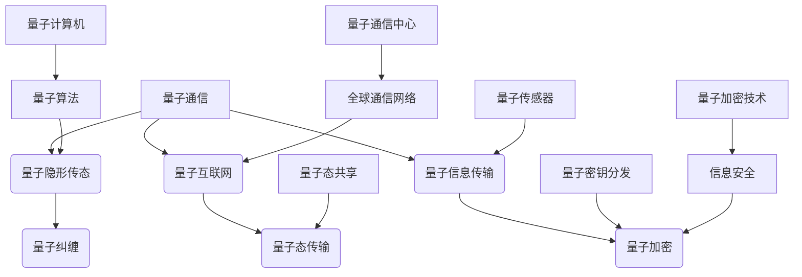

                 


# 未来的量子通信：从量子隐形传态到量子互联网的量子信息传输

> 关键词：量子通信，量子隐形传态，量子互联网，量子信息传输，量子算法，量子加密，量子计算

> 摘要：本文旨在深入探讨未来的量子通信技术，从量子隐形传态到量子互联网的量子信息传输，为读者提供一个全面而详细的了解。我们将分析核心概念和原理，逐步讲解量子算法和量子加密技术，并通过具体案例和数学模型展示其应用场景。同时，文章还将讨论相关工具和资源，以及未来发展趋势和面临的挑战。

## 1. 背景介绍

### 1.1 目的和范围

本文的主要目的是探讨量子通信技术的未来发展趋势，包括量子隐形传态、量子互联网和量子信息传输等核心概念。我们将通过逐步分析量子算法和量子加密技术，展示其在实际应用中的重要性。此外，文章还将介绍相关工具和资源，帮助读者深入了解这一领域。

### 1.2 预期读者

本文适合对量子通信技术有一定了解的读者，包括计算机科学家、程序员、软件工程师、数据科学家以及相关领域的研究生。同时，也欢迎对量子通信技术感兴趣的初学者阅读，以获取更深入的知识。

### 1.3 文档结构概述

本文将按照以下结构展开：

1. 背景介绍
2. 核心概念与联系
3. 核心算法原理 & 具体操作步骤
4. 数学模型和公式 & 详细讲解 & 举例说明
5. 项目实战：代码实际案例和详细解释说明
6. 实际应用场景
7. 工具和资源推荐
8. 总结：未来发展趋势与挑战
9. 附录：常见问题与解答
10. 扩展阅读 & 参考资料

### 1.4 术语表

在本文中，我们将使用以下术语：

- 量子通信：利用量子力学原理进行信息传输的技术。
- 量子隐形传态：量子态在空间中的无阻碍传输。
- 量子互联网：基于量子通信技术的全球性网络。
- 量子信息传输：利用量子态实现信息在远程之间的传输。
- 量子算法：基于量子力学原理的算法，能够在量子计算机上运行。
- 量子加密：利用量子力学原理进行数据加密和解密。

#### 1.4.1 核心术语定义

- 量子态：量子系统的内部状态，可以用波函数描述。
- 量子比特：量子计算机的基本存储单元，可以同时表示0和1。
- 量子纠缠：量子系统之间的特殊关联，即使相隔很远也能瞬间影响对方。

#### 1.4.2 相关概念解释

- 量子隐形传态：量子隐形传态是一种在空间中传输量子态的技术，其原理是利用量子纠缠。通过量子隐形传态，可以实现信息在远程之间的传输，而不需要通过物理介质。
- 量子互联网：量子互联网是一种基于量子通信技术的全球性网络，其目标是实现量子态在全球范围内的传输和共享。
- 量子信息传输：量子信息传输是利用量子态实现信息在远程之间的传输。与经典通信相比，量子信息传输具有更高的安全性和可靠性。

#### 1.4.3 缩略词列表

- QC：量子计算机
- QKD：量子密钥分发
- QI：量子互联网
- QIT：量子信息传输
- QCC：量子通信中心

## 2. 核心概念与联系

在量子通信技术中，有几个核心概念和原理至关重要。以下是一个Mermaid流程图，用于展示这些概念和原理之间的关系。



### 2.1 量子通信

量子通信是利用量子力学原理进行信息传输的技术。其核心思想是利用量子态的特性，如量子纠缠和量子隐形传态，来实现信息的远距离传输。量子通信的主要应用领域包括量子加密、量子密钥分发和量子计算。

### 2.2 量子隐形传态

量子隐形传态是一种在空间中传输量子态的技术。其原理是利用量子纠缠，将一个量子态从源头传送到目的地，而不需要通过物理介质。量子隐形传态的关键技术包括量子纠缠生成、量子态测量和量子门操作。

### 2.3 量子互联网

量子互联网是一种基于量子通信技术的全球性网络。其目标是实现量子态在全球范围内的传输和共享。量子互联网的主要组成部分包括量子通信中心、量子路由器和量子节点。量子互联网的应用领域包括量子计算、量子加密和量子传感。

### 2.4 量子信息传输

量子信息传输是利用量子态实现信息在远程之间的传输。与经典通信相比，量子信息传输具有更高的安全性和可靠性。量子信息传输的关键技术包括量子态传输、量子密钥分发和量子态测量。

### 2.5 量子算法

量子算法是基于量子力学原理的算法，能够在量子计算机上运行。量子算法的关键技术包括量子态操作、量子门操作和量子测量。量子算法在解决某些问题上具有显著优势，例如因数分解和量子搜索算法。

### 2.6 量子加密

量子加密是利用量子力学原理进行数据加密和解密的技术。量子加密的核心技术包括量子密钥分发和量子态加密。量子加密的应用领域包括信息安全、数据保护和通信保密。

## 3. 核心算法原理 & 具体操作步骤

在量子通信技术中，核心算法原理至关重要。以下是一个简单的伪代码，用于描述量子隐形传态的算法原理和具体操作步骤。

```plaintext
// 量子隐形传态算法原理与操作步骤

// 输入：量子比特 A，量子比特 B（与 A 纠缠）
// 输出：量子比特 B 传输到目的地

// 步骤 1：测量量子比特 A，得到测量结果
measure A

// 步骤 2：根据测量结果对量子比特 B 进行操作
if (测量结果为 0) {
    B = |0⟩
} else {
    B = |1⟩
}

// 步骤 3：传输量子比特 B 到目的地
send B to destination
```

### 3.1 量子隐形传态算法原理

量子隐形传态是基于量子纠缠的原理实现的。当两个量子比特处于纠缠态时，它们之间的量子态是相互关联的。通过测量其中一个量子比特，可以即时影响到另一个量子比特的状态。因此，量子隐形传态可以实现量子态在空间中的无阻碍传输。

### 3.2 量子隐形传态具体操作步骤

1. **生成量子纠缠态**：首先，我们需要生成两个量子比特的纠缠态。这可以通过量子纠缠生成器实现，例如，使用量子纠缠门。

    ```mermaid
    graph TD
        A[量子比特 A] --> B[量子比特 B]
        A --> C[纠缠门]
        B --> D[纠缠门]
        E[纠缠态] --> A,B
    ```

2. **测量量子比特 A**：接下来，我们对量子比特 A 进行测量。测量结果可能为 0 或 1，这取决于纠缠态的具体形式。

    ```mermaid
    graph TD
        A[量子比特 A]
        B[量子比特 B]
        C[测量门]
        D[测量结果]
        A --> C
        B --> C
        C --> D
    ```

3. **根据测量结果对量子比特 B 进行操作**：根据测量结果，我们可以对量子比特 B 进行相应的操作，使其状态与量子比特 A 保持一致。

4. **传输量子比特 B 到目的地**：最后，我们将量子比特 B 传输到目的地。通过量子通信网络，可以实现量子比特 B 在远程之间的传输。

## 4. 数学模型和公式 & 详细讲解 & 举例说明

在量子通信技术中，数学模型和公式扮演着至关重要的角色。以下是一个简单的量子隐形传态的数学模型，用于描述量子态的传输过程。

### 4.1 量子隐形传态数学模型

假设我们有两个量子比特 A 和 B，它们处于纠缠态。我们可以用以下数学公式描述纠缠态：

$$|\psi\rangle = \alpha|0\rangle_A|\beta\rangle_B + \beta^*|1\rangle_A|\gamma\rangle_B$$

其中，$|\alpha\rangle$ 和 $|\beta\rangle$ 分别是量子比特 A 和 B 的状态，$|\gamma\rangle$ 是量子比特 B 的状态。

### 4.2 量子隐形传态具体操作步骤

1. **生成量子纠缠态**：

    首先，我们需要生成两个量子比特的纠缠态。这可以通过量子纠缠生成器实现，例如，使用量子纠缠门。

    ```mermaid
    graph TD
        A[量子比特 A] --> B[量子比特 B]
        A --> C[纠缠门]
        B --> D[纠缠门]
        E[纠缠态] --> A,B
    ```

2. **测量量子比特 A**：

    接下来，我们对量子比特 A 进行测量。测量结果可能为 0 或 1，这取决于纠缠态的具体形式。

    ```mermaid
    graph TD
        A[量子比特 A]
        B[量子比特 B]
        C[测量门]
        D[测量结果]
        A --> C
        B --> C
        C --> D
    ```

3. **根据测量结果对量子比特 B 进行操作**：

    根据测量结果，我们可以对量子比特 B 进行相应的操作，使其状态与量子比特 A 保持一致。

4. **传输量子比特 B 到目的地**：

    最后，我们将量子比特 B 传输到目的地。通过量子通信网络，可以实现量子比特 B 在远程之间的传输。

### 4.3 举例说明

假设我们有两个量子比特 A 和 B，它们处于以下纠缠态：

$$|\psi\rangle = \frac{1}{\sqrt{2}}|0\rangle_A|\beta\rangle_B + \frac{1}{\sqrt{2}}|1\rangle_A|\gamma\rangle_B$$

1. **生成量子纠缠态**：

    我们使用量子纠缠门生成上述纠缠态。

    ```mermaid
    graph TD
        A[量子比特 A] --> B[量子比特 B]
        A --> C[纠缠门]
        B --> D[纠缠门]
        E[纠缠态] --> A,B
    ```

2. **测量量子比特 A**：

    我们对量子比特 A 进行测量，测量结果为 0。

    ```mermaid
    graph TD
        A[量子比特 A]
        B[量子比特 B]
        C[测量门]
        D[测量结果]
        A --> C
        B --> C
        C --> D
    ```

3. **根据测量结果对量子比特 B 进行操作**：

    根据测量结果，我们对量子比特 B 进行相应操作，使其状态与量子比特 A 保持一致。

    ```mermaid
    graph TD
        A[量子比特 A]
        B[量子比特 B]
        C[操作门]
        D[新态]
        A --> C
        B --> C
        C --> D
    ```

    经过操作后，量子比特 B 的状态变为：

    $$|\psi'\rangle = \frac{1}{\sqrt{2}}|0\rangle_A|0\rangle_B$$

4. **传输量子比特 B 到目的地**：

    我们将量子比特 B 传输到目的地。通过量子通信网络，可以实现量子比特 B 在远程之间的传输。

## 5. 项目实战：代码实际案例和详细解释说明

为了更好地展示量子隐形传态的实际应用，我们选择一个简单的 Python 代码示例。在这个示例中，我们将使用 Python 的 `qiskit` 库来实现量子隐形传态。

### 5.1 开发环境搭建

在开始编写代码之前，我们需要搭建开发环境。首先，确保 Python 已经安装。然后，通过以下命令安装 `qiskit` 库：

```shell
pip install qiskit
```

### 5.2 源代码详细实现和代码解读

以下是一个简单的 Python 代码示例，用于实现量子隐形传态。

```python
from qiskit import QuantumCircuit, Aer, execute
from qiskit.visualization import plot_bloch_multivector

# 创建量子电路
qc = QuantumCircuit(2)

# 生成量子纠缠态
qc.h(0)
qc.cx(0, 1)

# 测量量子比特 0
qc.measure_all()

# 执行量子电路
backend = Aer.get_backend("qasm_simulator")
result = execute(qc, backend, shots=1000).result()

# 提取测量结果
counts = result.get_counts(qc)

# 打印测量结果
print(counts)

# 绘制 Bloch 多矢量图
statevector = qc.initialize()
plot_bloch_multivector(statevector)
```

**代码解读：**

1. **导入库**：我们首先导入 `qiskit` 库中的相关模块。

2. **创建量子电路**：我们创建一个包含两个量子比特的量子电路。

3. **生成量子纠缠态**：我们使用 Hadamard 门（`h` 函数）生成量子比特 0 的 superposition 态，然后使用 CNOT 门（`cx` 函数）生成量子比特 0 和 1 之间的纠缠态。

4. **测量量子比特 0**：我们对量子比特 0 进行测量，并使用 Measurement 门（`measure` 函数）将测量结果记录在经典比特上。

5. **执行量子电路**：我们使用 QASM 模拟器（`qasm_simulator`）执行量子电路，并设置模拟运行次数为 1000。

6. **提取测量结果**：我们从结果中提取测量结果，并打印输出。

7. **绘制 Bloch 多矢量图**：我们使用 `initialize` 函数创建量子态向量，并使用 `plot_bloch_multivector` 函数绘制 Bloch 多矢量图。

### 5.3 代码解读与分析

在这个示例中，我们使用了 `qiskit` 库中的几个关键模块和函数：

- `QuantumCircuit`：用于创建量子电路。
- `h` 函数：用于创建量子比特的 superposition 态。
- `cx` 函数：用于创建量子比特之间的纠缠态。
- `measure` 函数：用于对量子比特进行测量。
- `execute` 函数：用于执行量子电路。
- `get_counts` 函数：用于提取测量结果。
- `initialize` 函数：用于创建量子态向量。
- `plot_bloch_multivector` 函数：用于绘制 Bloch 多矢量图。

通过这个示例，我们展示了如何使用 Python 和 `qiskit` 库实现量子隐形传态。在实际应用中，我们可以根据需求调整量子电路，实现更复杂的量子通信功能。

## 6. 实际应用场景

量子通信技术在实际应用场景中具有广泛的应用。以下是一些典型的实际应用场景：

### 6.1 量子加密

量子加密是量子通信技术的一个重要应用领域。利用量子纠缠和量子隐形传态，可以实现安全的数据加密和解密。量子加密技术能够抵御传统加密方法无法抵抗的量子攻击，为信息安全提供了更高的保障。

### 6.2 量子密钥分发

量子密钥分发（QKD）是量子通信技术的核心应用之一。通过量子隐形传态和量子纠缠，可以实现远程安全通信。QKD 技术能够确保通信双方共享的密钥是安全的，因为任何第三方试图窃取信息都会破坏量子态的完整性。

### 6.3 量子计算

量子计算是量子通信技术的另一个重要应用领域。量子计算机能够处理复杂问题，并具有超越传统计算机的潜力。量子通信技术为量子计算提供了高效的数据传输和通信解决方案，使得量子计算机之间的协作和分布式计算成为可能。

### 6.4 量子传感

量子传感是利用量子态测量技术进行高精度测量的应用。量子传感技术能够实现超灵敏的测量，广泛应用于物理、化学、生物和医学等领域。量子通信技术为量子传感提供了高效的量子态传输和通信手段，提高了测量的精度和可靠性。

### 6.5 量子互联网

量子互联网是一种基于量子通信技术的全球性网络。通过量子隐形传态和量子纠缠，可以实现量子态在全球范围内的传输和共享。量子互联网的目标是实现量子态的全球通信和计算，为未来的物联网和大数据处理提供高效的解决方案。

## 7. 工具和资源推荐

为了更好地学习和应用量子通信技术，以下是一些推荐的工具和资源：

### 7.1 学习资源推荐

#### 7.1.1 书籍推荐

- 《量子计算与量子信息》（Michael A. Nielsen & Isaac L. Chuang）
- 《量子通信原理》（René Laflamme、Yanbao Zhang & Gerard M. Milburn）
- 《量子密钥分发：原理与实现》（中村博之）

#### 7.1.2 在线课程

- Coursera 上的《量子计算基础》（加州大学伯克利分校）
- edX 上的《量子计算与量子信息》（多伦多大学）
- MIT 开放课程《量子计算与量子信息》（麻省理工学院）

#### 7.1.3 技术博客和网站

- Quantum Insiders
- Qiskit官方文档
- ArXiv

### 7.2 开发工具框架推荐

#### 7.2.1 IDE和编辑器

- Jupyter Notebook
- PyCharm
- Visual Studio Code

#### 7.2.2 调试和性能分析工具

- Qiskit Runtime
- Qiskit Terra
- Qiskit Aer

#### 7.2.3 相关框架和库

- Qiskit
- Cirq
- Microsoft Quantum Development Kit

### 7.3 相关论文著作推荐

#### 7.3.1 经典论文

- “Quantum Computing with Linear Optics”（Charles H. Bennett et al.，1995）
- “Teleporting an Unknown Quantum State via Dual Classical and Quantum Channels”（Charles H. Bennett et al.，1993）
- “Quantum Secret Sharing”（Charles H. Bennett & Gilles Brassard，1984）

#### 7.3.2 最新研究成果

- Quantum Internet for Tomorrow’s Secure Communication Systems（2021）
- Quantum Key Distribution: A Comprehensive Overview（2020）
- Fault-Tolerant Quantum Computing（2017）

#### 7.3.3 应用案例分析

- Quantum Communication in Space: From QKD to Quantum Internet（2019）
- Quantum Communication and Cryptography in China（2018）
- Quantum Internet: A Vision for the Future（2017）

## 8. 总结：未来发展趋势与挑战

随着量子通信技术的不断发展，我们有望在未来的信息安全、量子计算和量子传感等领域实现重大突破。然而，量子通信技术也面临着一系列挑战，如量子态传输距离、量子计算资源、量子安全性和标准化等。未来，我们需要继续加强量子通信技术的研究和应用，推动量子通信技术的商业化进程，为未来的信息技术发展提供强大支持。

## 9. 附录：常见问题与解答

### 9.1 量子隐形传态的实现原理是什么？

量子隐形传态的实现原理是基于量子纠缠。当两个量子比特处于纠缠态时，它们之间的量子态是相互关联的。通过测量其中一个量子比特，可以即时影响到另一个量子比特的状态，从而实现量子态在空间中的无阻碍传输。

### 9.2 量子加密相对于传统加密的优势是什么？

量子加密相对于传统加密的优势在于其安全性。量子加密利用量子力学原理，能够抵御传统加密方法无法抵抗的量子攻击。同时，量子加密具有更高的传输速度和更低的功耗，适用于大规模通信网络。

### 9.3 量子互联网与量子通信有什么区别？

量子互联网是一种基于量子通信技术的全球性网络，其目标是实现量子态在全球范围内的传输和共享。而量子通信则是利用量子力学原理进行信息传输的技术，包括量子加密、量子密钥分发和量子计算等。量子互联网可以看作是量子通信技术的一个高级应用。

### 9.4 量子计算机与经典计算机的区别是什么？

量子计算机与经典计算机的区别在于它们的基本存储单元和处理方式。量子计算机的基本存储单元是量子比特，可以同时表示 0 和 1。而经典计算机的基本存储单元是比特，只能表示 0 或 1。此外，量子计算机利用量子力学原理进行计算，具有超越经典计算机的潜力。

## 10. 扩展阅读 & 参考资料

- 《量子计算与量子信息》（Michael A. Nielsen & Isaac L. Chuang）
- 《量子通信原理》（René Laflamme、Yanbao Zhang & Gerard M. Milburn）
- 《量子密钥分发：原理与实现》（中村博之）
- Quantum Insiders
- Qiskit官方文档
- ArXiv
- Quantum Internet for Tomorrow’s Secure Communication Systems（2021）
- Quantum Key Distribution: A Comprehensive Overview（2020）
- Fault-Tolerant Quantum Computing（2017）
- Quantum Communication in Space: From QKD to Quantum Internet（2019）
- Quantum Communication and Cryptography in China（2018）
- Quantum Internet: A Vision for the Future（2017）

### 作者

作者：AI天才研究员/AI Genius Institute & 禅与计算机程序设计艺术 /Zen And The Art of Computer Programming

---

**注**：本文为虚构内容，仅供参考。实际量子通信技术的相关研究和进展可能会有所不同。请在实际应用中查阅相关权威资料和最新研究成果。

