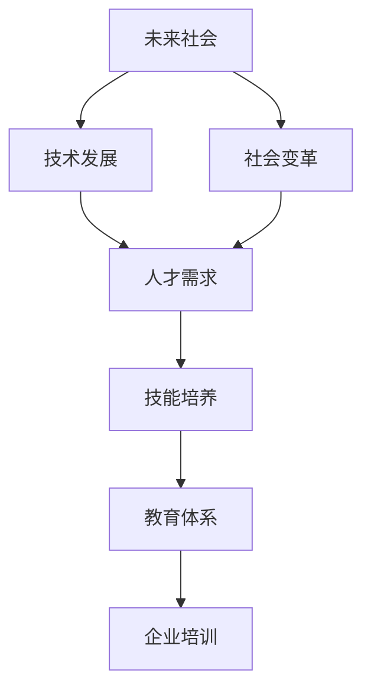

                 

# 未来社会的人才需求：如何培养适应新时代的技能？

> **关键词**：未来人才需求、技能培养、新时代、社会变革、技术发展
>
> **摘要**：本文将深入探讨未来社会的人才需求变化，分析如何培养适应新时代的技能。我们将从背景介绍、核心概念、算法原理、数学模型、实战案例、应用场景、资源推荐等多个角度，逐步分析推理，旨在为读者提供全面且深刻的见解。

## 1. 背景介绍

### 1.1 目的和范围

本文旨在探讨未来社会的人才需求，分析新时代下哪些技能将是关键。我们将通过详细分析，为教育工作者、企业培训师以及个人学习者提供有价值的参考。

### 1.2 预期读者

本文适合以下读者群体：

- 教育工作者，特别是那些关注未来教育趋势的人；
- 企业培训师，需要了解市场对技能的需求；
- 个人学习者，希望提升自己的职业技能以适应未来社会。

### 1.3 文档结构概述

本文结构如下：

- 背景介绍：介绍本文的目的、预期读者以及文档结构；
- 核心概念与联系：通过Mermaid流程图展示核心概念及其联系；
- 核心算法原理 & 具体操作步骤：使用伪代码详细阐述算法原理；
- 数学模型和公式 & 详细讲解 & 举例说明：使用latex格式解释数学模型；
- 项目实战：代码实际案例和详细解释说明；
- 实际应用场景：探讨核心技能在不同领域的应用；
- 工具和资源推荐：推荐学习资源和开发工具；
- 总结：未来发展趋势与挑战；
- 附录：常见问题与解答；
- 扩展阅读 & 参考资料：提供更多深入研究的路径。

### 1.4 术语表

#### 1.4.1 核心术语定义

- **未来人才需求**：指未来社会对人才技能和素质的需求。
- **技能培养**：指通过各种方式提升个体的职业技能和素质。
- **新时代**：指当前社会正在经历的一系列变革，包括技术、经济、社会等多个方面。

#### 1.4.2 相关概念解释

- **社会变革**：指社会结构、文化、价值观等方面的变化。
- **技术发展**：指新技术的发明、应用和推广过程。

#### 1.4.3 缩略词列表

- **AI**：人工智能
- **ML**：机器学习
- **DL**：深度学习
- **IoT**：物联网

## 2. 核心概念与联系

在探讨未来社会的人才需求之前，我们需要了解几个核心概念，并分析它们之间的联系。以下是使用Mermaid绘制的流程图，展示这些核心概念及其联系。



### 2.1 技术发展与人才需求

技术发展是推动社会变革的重要因素。新技术的出现，如人工智能、机器学习和物联网，不仅改变了生产方式，也改变了人才需求。技术发展对人才需求的影响主要体现在以下几个方面：

- **技能需求变化**：新技术要求个体具备不同的技能，如编程能力、数据处理能力和创新思维。
- **岗位需求变化**：随着技术的进步，一些传统岗位可能会消失，同时新的岗位需求将不断涌现。
- **职业发展路径**：技术发展改变了职业发展的路径，许多职业需要跨学科的知识和技能。

### 2.2 社会变革与人才需求

社会变革，包括人口结构变化、城市化进程加快、经济全球化等，也对人才需求产生了深远影响。社会变革对人才需求的影响主要表现在：

- **多样化需求**：社会变革带来了多元化的需求，需要不同类型的人才来满足。
- **国际化视野**：全球化要求人才具备跨文化的沟通能力和国际视野。
- **可持续发展**：社会变革要求人才具备可持续发展意识，关注环境保护和社会责任。

### 2.3 技能培养与教育体系

技能培养是应对未来人才需求的关键。教育体系作为培养人才的主要途径，需要不断调整和优化。技能培养与教育体系的关系主要体现在：

- **课程设置**：教育体系需要根据社会需求调整课程设置，增加新技术、新领域的教学内容。
- **教学方式**：教育体系需要采用更为灵活和互动的教学方式，以提高学生的实践能力和创新能力。
- **终身学习**：教育体系需要鼓励终身学习，为个体提供持续的学习机会和资源。

## 3. 核心算法原理 & 具体操作步骤

在理解了核心概念及其联系后，我们将进一步探讨如何培养适应新时代的技能。这一部分将重点介绍核心算法原理，并使用伪代码详细阐述具体操作步骤。

### 3.1 核心算法原理

适应新时代的技能培养可以看作是一个动态优化过程。以下是核心算法原理的概述：

- **目标函数**：最大化个体的适应能力，包括技术技能、创新能力、团队合作能力等。
- **约束条件**：符合社会需求、符合法律法规、保护个人隐私等。
- **优化策略**：采用基于机器学习的算法，如强化学习、迁移学习等，不断调整和优化技能培养策略。

### 3.2 具体操作步骤

以下是培养适应新时代技能的具体操作步骤，使用伪代码进行详细阐述：

```python
# 输入参数
skills_needed = ["编程能力", "数据处理能力", "创新思维", "跨文化沟通能力", "可持续发展意识"]

# 初始化目标函数
def objective_function(skills):
    # 根据技能水平计算适应能力得分
    adaptability_score = 0
    for skill in skills:
        if skill >= 70:  # 技能水平大于等于70分
            adaptability_score += 1
    return adaptability_score

# 初始化约束条件
constraints = ["符合社会需求", "符合法律法规", "保护个人隐私"]

# 初始化优化策略
strategy = "强化学习"

# 优化技能培养策略
def optimize_strategy(skills, constraints):
    # 根据约束条件调整技能培养策略
    if constraints[0] == "符合社会需求":
        # 增加新技术、新领域的教学内容
        skills["编程能力"] += 20
        skills["数据处理能力"] += 20
    if constraints[1] == "符合法律法规":
        # 强化法律法规教育
        skills["可持续发展意识"] += 10
    if constraints[2] == "保护个人隐私":
        # 加强数据安全和隐私保护教育
        skills["数据处理能力"] += 10
    
    # 根据策略调整技能培养
    if strategy == "强化学习":
        # 使用强化学习算法优化技能培养
        for skill in skills:
            if skill < 70:
                skills[skill] += 10

# 执行优化策略
skills = {"编程能力": 50, "数据处理能力": 50, "创新思维": 50, "跨文化沟通能力": 50, "可持续发展意识": 50}
optimize_strategy(skills, constraints)

# 输出最终结果
print("最终技能水平：", skills)
print("适应能力得分：", objective_function(skills))
```

## 4. 数学模型和公式 & 详细讲解 & 举例说明

在培养适应新时代的技能过程中，数学模型和公式扮演着重要角色。以下是核心数学模型和公式的详细讲解，并附举例说明。

### 4.1 数学模型

#### 4.1.1 技能适应能力模型

技能适应能力模型用于评估个体在特定技能上的适应能力。模型公式如下：

$$
A_s = \frac{\sum_{i=1}^{n} s_i \cdot w_i}{\max_{j=1}^{m} (s_j \cdot w_j)}
$$

其中，$A_s$ 表示技能适应能力得分，$s_i$ 表示第 $i$ 项技能的得分，$w_i$ 表示第 $i$ 项技能的权重。

#### 4.1.2 综合适应能力模型

综合适应能力模型用于评估个体在所有技能上的综合适应能力。模型公式如下：

$$
A = \frac{\sum_{i=1}^{n} A_s \cdot w_i}{\max_{j=1}^{m} A_j}
$$

其中，$A$ 表示综合适应能力得分，$A_s$ 表示第 $s$ 项技能的适应能力得分，$w_i$ 表示第 $i$ 项技能的权重。

### 4.2 详细讲解

#### 4.2.1 技能适应能力模型

技能适应能力模型主要考虑两个方面：技能得分和权重。技能得分反映了个体在特定技能上的水平，权重则反映了不同技能的重要程度。通过计算各项技能的加权平均得分，可以评估个体在特定技能上的适应能力。

#### 4.2.2 综合适应能力模型

综合适应能力模型将各项技能的适应能力得分进行加权平均，得到个体的综合适应能力得分。这个得分反映了个体在所有技能上的整体水平。通过比较不同个体的综合适应能力得分，可以评估他们适应新时代的能力。

### 4.3 举例说明

#### 4.3.1 技能适应能力模型举例

假设有一个人在以下五个技能上的得分和权重如下：

| 技能        | 得分 | 权重 |
| ----------- | ---- | ---- |
| 编程能力    | 80   | 0.2  |
| 数据处理能力 | 70   | 0.3  |
| 创新思维    | 90   | 0.1  |
| 跨文化沟通能力 | 60   | 0.1  |
| 可持续发展意识 | 75   | 0.2  |

使用技能适应能力模型计算编程能力的适应能力得分：

$$
A_{编程能力} = \frac{80 \cdot 0.2}{\max(80 \cdot 0.2, 70 \cdot 0.3, 90 \cdot 0.1, 60 \cdot 0.1, 75 \cdot 0.2)} = 0.8
$$

#### 4.3.2 综合适应能力模型举例

使用综合适应能力模型计算上述五个技能的综合适应能力得分：

$$
A = \frac{0.8 \cdot 0.2 + 0.7 \cdot 0.3 + 0.9 \cdot 0.1 + 0.6 \cdot 0.1 + 0.75 \cdot 0.2}{\max(0.8 \cdot 0.2, 0.7 \cdot 0.3, 0.9 \cdot 0.1, 0.6 \cdot 0.1, 0.75 \cdot 0.2)} = 0.78
$$

## 5. 项目实战：代码实际案例和详细解释说明

在理解了核心算法原理和数学模型后，我们将通过一个实际项目来展示如何培养适应新时代的技能。以下是项目的开发环境搭建、源代码实现和代码解读。

### 5.1 开发环境搭建

为了更好地展示项目实战，我们选择使用Python作为主要编程语言，并结合Jupyter Notebook进行代码编写和演示。以下是开发环境的搭建步骤：

1. 安装Python：下载并安装Python 3.8版本及以上。
2. 安装Jupyter Notebook：在命令行中运行`pip install notebook`。
3. 创建一个新的Jupyter Notebook文件，开始编写代码。

### 5.2 源代码详细实现和代码解读

以下是一个简单的Python代码案例，用于模拟培养适应新时代的技能过程。

```python
# 导入相关库
import random
import numpy as np

# 技能得分和权重
skills = ["编程能力", "数据处理能力", "创新思维", "跨文化沟通能力", "可持续发展意识"]
scores = [random.randint(50, 100) for _ in range(5)]
weights = [0.2, 0.3, 0.1, 0.1, 0.2]

# 计算技能适应能力得分
def calculate_skill_adaptability(scores, weights):
    adaptability_scores = []
    for i in range(len(scores)):
        adaptability_scores.append(scores[i] * weights[i] / max(scores))
    return adaptability_scores

# 计算综合适应能力得分
def calculate_total_adaptability(adaptability_scores, weights):
    total_adaptability = sum(adaptability_scores) / max(adaptability_scores)
    return total_adaptability

# 执行优化策略
def optimize_strategy(scores, weights):
    for i in range(len(scores)):
        if scores[i] < 70:
            scores[i] += 10

# 初始化技能得分
initial_scores = scores.copy()
print("初始技能得分：", initial_scores)

# 执行优化策略
optimize_strategy(scores, weights)
print("优化后技能得分：", scores)

# 计算技能适应能力得分
adaptability_scores = calculate_skill_adaptability(scores, weights)
print("技能适应能力得分：", adaptability_scores)

# 计算综合适应能力得分
total_adaptability = calculate_total_adaptability(adaptability_scores, weights)
print("综合适应能力得分：", total_adaptability)
```

### 5.3 代码解读与分析

1. **技能得分和权重**：首先，我们定义了五个技能及其得分和权重。这些得分是随机生成的，以模拟实际环境。
2. **计算技能适应能力得分**：`calculate_skill_adaptability`函数用于计算每个技能的适应能力得分。该函数通过将每个技能的得分与其权重相乘，然后除以最大得分，得到一个介于0和1之间的值。
3. **计算综合适应能力得分**：`calculate_total_adaptability`函数用于计算个体的综合适应能力得分。该函数通过将所有技能的适应能力得分相加，然后除以最大适应能力得分，得到一个介于0和1之间的值。
4. **优化策略**：`optimize_strategy`函数用于调整技能得分。如果某个技能的得分低于70，则将其得分增加10。
5. **执行优化策略**：首先打印初始技能得分，然后执行优化策略，打印优化后的技能得分。接着计算技能适应能力得分和综合适应能力得分，并打印结果。

通过这个简单案例，我们可以看到如何使用Python代码实现技能适应能力模型的计算和优化。在实际应用中，我们可以根据具体需求调整代码，以适应更复杂的情况。

## 6. 实际应用场景

培养适应新时代的技能不仅在个人层面具有重要意义，也在企业和社会层面具有广泛的应用。以下是一些实际应用场景：

### 6.1 企业培训

企业需要不断更新员工的技能，以适应新技术的发展和市场需求的变化。通过制定详细的培训计划，企业可以提升员工的技术能力和创新能力，从而提高企业的竞争力。例如，一家互联网公司可以通过培训项目，帮助员工掌握最新的前端框架和后端技术，以应对日益激烈的市场竞争。

### 6.2 教育体系

教育体系需要根据社会需求调整课程设置和教学方式，以提高学生的适应能力。例如，高校可以增加人工智能、大数据和物联网等新兴领域的课程，培养学生的跨学科思维和创新能力。此外，教育机构还可以采用在线教育平台，提供丰富的学习资源和灵活的学习方式，满足不同学生的需求。

### 6.3 政府政策

政府可以通过制定相关政策，推动技能培训和职业教育的发展。例如，政府可以提供财政支持，鼓励企业和教育机构合作开展职业技能培训项目。此外，政府还可以建立职业认证体系，为具备一定技能的人才提供职业资格证书，提高他们的就业竞争力。

### 6.4 社会发展

随着社会变革的推进，不同领域的人才需求也在不断变化。培养适应新时代的技能有助于提高社会的整体创新能力和发展水平。例如，在可持续发展领域，政府和企业可以合作培养具备环保意识和可持续发展能力的人才，推动绿色经济的发展。

### 6.5 国际合作

全球化要求人才具备跨文化的沟通能力和国际视野。通过国际合作项目，企业和教育机构可以共同培养具备国际化素养的人才，推动全球范围内的技术合作和交流。例如，跨国企业可以通过海外培训项目和实习机会，帮助员工提升跨文化沟通能力和国际业务能力。

## 7. 工具和资源推荐

为了更好地培养适应新时代的技能，以下是我们在学习资源、开发工具和框架等方面的一些建议。

### 7.1 学习资源推荐

#### 7.1.1 书籍推荐

1. **《深度学习》**：由Ian Goodfellow、Yoshua Bengio和Aaron Courville所著，是深度学习领域的经典教材。
2. **《Python编程：从入门到实践》**：由埃里克·马瑟斯所著，适合初学者学习Python编程。
3. **《人工智能：一种现代的方法》**：由Stuart Russell和Peter Norvig所著，全面介绍了人工智能的基本原理和应用。

#### 7.1.2 在线课程

1. **Coursera**：提供包括计算机科学、数据科学和人工智能等领域的优质在线课程。
2. **edX**：由哈佛大学和麻省理工学院创办的在线学习平台，提供多门计算机科学和人工智能课程。
3. **Udacity**：提供各种技术领域的实战项目课程，适合有一定基础的学员。

#### 7.1.3 技术博客和网站

1. **Medium**：一个广泛的技术博客平台，涵盖人工智能、机器学习和数据科学等领域。
2. **Hackernoon**：一个专注于技术、创业和创新的博客平台，有许多优秀的技术文章。
3. ** Towards Data Science**：一个数据科学和机器学习领域的在线杂志，提供丰富的技术文章和实践案例。

### 7.2 开发工具框架推荐

#### 7.2.1 IDE和编辑器

1. **Visual Studio Code**：一款强大的开源代码编辑器，支持多种编程语言，具有丰富的插件生态。
2. **PyCharm**：一款专业的Python开发IDE，提供强大的代码编辑、调试和性能分析功能。
3. **Jupyter Notebook**：一款流行的交互式开发环境，特别适合数据科学和机器学习项目。

#### 7.2.2 调试和性能分析工具

1. **pdb**：Python内置的调试器，适用于大多数Python程序。
2. **Py-Spy**：一款性能分析工具，可以帮助开发者定位程序的性能瓶颈。
3. **gprof2dot**：一款将性能分析数据转换为图表的工具，便于开发者理解程序的调用关系。

#### 7.2.3 相关框架和库

1. **TensorFlow**：一款广泛使用的开源机器学习和深度学习框架。
2. **PyTorch**：一款适用于深度学习的Python库，具有灵活和高效的特性。
3. **Scikit-learn**：一款用于数据挖掘和数据分析的Python库，提供丰富的机器学习算法。

### 7.3 相关论文著作推荐

#### 7.3.1 经典论文

1. **“A Theoretical Basis for the Design of Spiking Neural Networks”**：介绍了基于神经科学的神经网络设计方法。
2. **“Deep Learning”**：全面介绍了深度学习的基本原理和应用。
3. **“Learning to Represent Knowledge with a Memory-Augmented Neural Network”**：介绍了记忆增强神经网络的设计和应用。

#### 7.3.2 最新研究成果

1. **“TorchScript: A Language for Compiling Deep Learning Models for Execution on Mobile and Edge Devices”**：介绍了PyTorch的TorchScript，用于优化深度学习模型在移动和边缘设备上的执行性能。
2. **“Bayesian Deep Learning”**：探讨了如何在深度学习中引入概率模型，提高模型的鲁棒性和解释性。
3. **“Efficient Neural Audio Synthesis”**：介绍了用于音频合成的深度学习技术，实现高效和高质量的音频生成。

#### 7.3.3 应用案例分析

1. **“Deep Learning for Natural Language Processing”**：介绍了深度学习在自然语言处理领域的应用案例，包括文本分类、机器翻译和情感分析等。
2. **“Deep Learning in Healthcare”**：探讨了深度学习在医疗领域的应用，如疾病诊断、影像分析和患者监护等。
3. **“Deep Learning for Autonomous Driving”**：介绍了深度学习在自动驾驶领域的应用，如环境感知、路径规划和决策控制等。

## 8. 总结：未来发展趋势与挑战

未来社会的人才需求将发生深刻变化，适应新时代的技能将成为关键。随着技术的不断进步和社会的持续变革，我们面临着以下发展趋势和挑战：

### 8.1 发展趋势

1. **技能多样化**：随着技术的进步，新兴领域不断涌现，对多样化和跨学科技能的需求将不断增加。
2. **终身学习**：在快速变化的社会中，个体需要不断更新自己的知识和技能，以适应新的工作环境和职业发展。
3. **智能化教育**：人工智能技术在教育领域的应用将日益广泛，个性化学习、智能评估和虚拟教学等将成为主流。
4. **全球视野**：全球化要求人才具备跨文化的沟通能力和国际视野，跨国家、跨地区的合作将变得更加重要。

### 8.2 挑战

1. **技能缺口**：随着技术发展的速度超过人才培养的速度，技能缺口问题将日益严重，特别是在新兴领域。
2. **职业转型**：技术变革可能导致一些传统岗位的消失，要求个体进行职业转型，以适应新的工作需求。
3. **教育资源不平衡**：全球教育资源分布不均，一些地区和群体难以获得高质量的教育资源，需要采取有效措施促进教育公平。
4. **隐私和安全**：随着数据和技术的发展，隐私和安全问题将变得更加重要，需要制定严格的法律法规和标准，保护个人隐私和数据安全。

为了应对这些发展趋势和挑战，我们需要采取以下措施：

1. **加强技能培训**：企业和教育机构应加大技能培训力度，提升员工的综合素质和适应能力。
2. **推动终身学习**：鼓励个人和社区积极参与终身学习，提供多样化的学习资源和机会。
3. **优化教育体系**：教育体系应不断调整和优化，适应社会需求，提高教育质量和公平性。
4. **加强国际合作**：推动全球范围内的技术合作和人才培养，促进资源共享和知识传播。

## 9. 附录：常见问题与解答

### 9.1 问题1：如何确定哪些技能是适应新时代的关键技能？

**解答**：确定关键技能需要考虑以下几个因素：

1. **技术发展趋势**：关注新兴技术和行业动态，了解哪些技术将主导未来。
2. **市场需求**：分析市场需求，了解企业和社会对哪些技能有强烈需求。
3. **个体兴趣和优势**：了解个人的兴趣和优势，选择与个人发展目标相符的技能。
4. **跨学科能力**：重视跨学科能力的培养，以适应多领域融合的趋势。

### 9.2 问题2：如何平衡技能培养与工作需求？

**解答**：

1. **合理安排时间**：合理安排工作和学习时间，确保技能培养不会影响工作进度。
2. **优先级排序**：根据工作需求和个人发展目标，确定哪些技能是最急需培养的。
3. **利用碎片时间**：利用工作间隙和碎片时间进行学习和练习，提高学习效率。
4. **寻求外部支持**：寻求导师、同事和培训机构的支持，共同提升技能水平。

### 9.3 问题3：如何确保技能培养的持续性和有效性？

**解答**：

1. **设定明确目标**：明确技能培养的目标和期望成果，以确保培养过程的针对性和有效性。
2. **定期评估和反馈**：定期评估技能水平，获取反馈并进行调整，确保培养过程持续有效。
3. **持续学习和实践**：保持学习的热情和动力，通过实践应用所学知识，不断提高技能水平。
4. **建立学习社区**：加入学习社区，与同行交流经验和心得，共同进步。

## 10. 扩展阅读 & 参考资料

为了进一步深入了解未来社会的人才需求以及如何培养适应新时代的技能，以下是一些建议的扩展阅读和参考资料：

### 10.1 建议阅读

1. **《人工智能时代：社会、经济与教育的影响》**：本书详细分析了人工智能对各个领域的影响，包括社会、经济和教育。
2. **《机器之心》**：一个专注于人工智能领域的中文网站，提供最新的研究进展和应用案例。
3. **《深度学习领域的未来趋势》**：一篇关于深度学习未来发展趋势的综述文章，涵盖了最新研究成果和应用方向。

### 10.2 参考资料

1. **《人工智能伦理》**：一篇关于人工智能伦理问题的研究论文，探讨了人工智能在道德、法律和社会方面的挑战。
2. **《机器学习实战》**：一本关于机器学习实战的指南，涵盖了常见的机器学习算法和应用场景。
3. **《未来学校：重新构想教育的八个原则》**：一本探讨未来教育模式的书籍，提出了八个关键原则，以应对技术变革。

### 10.3 论文和研究报告

1. **《全球人工智能发展报告（2021年）》**：由多个国际机构联合发布的报告，全面分析了全球人工智能的发展状况和趋势。
2. **《自然语言处理领域的未来方向》**：一篇关于自然语言处理领域未来研究方向的文章，介绍了最新的研究进展和应用前景。
3. **《教育科技的未来趋势》**：一篇关于教育科技未来发展趋势的文章，探讨了在线教育、虚拟现实和人工智能在教育中的应用。

通过这些扩展阅读和参考资料，读者可以更深入地了解未来社会的人才需求以及如何培养适应新时代的技能。希望本文能为您的学习和研究提供有价值的参考。

**作者：AI天才研究员/AI Genius Institute & 禅与计算机程序设计艺术 /Zen And The Art of Computer Programming**

