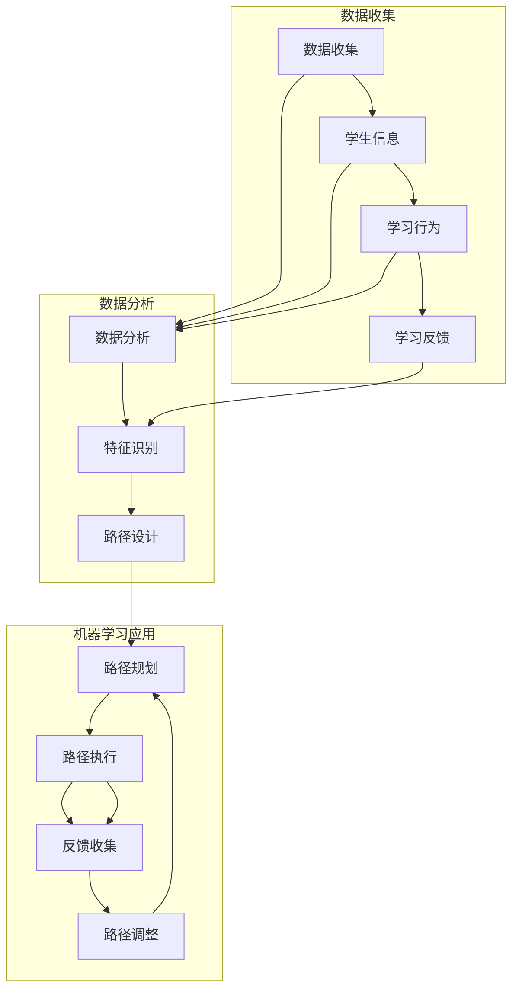

                 

# 机器学习在个性化学习路径规划中的实践

## 关键词
机器学习，个性化学习，路径规划，学习路径优化，数据驱动教育

## 摘要
随着教育技术的不断进步，个性化学习成为现代教育的核心需求。本文深入探讨了机器学习在个性化学习路径规划中的实际应用，旨在为教育领域从业者提供一种全新的视角和方法。通过详细阐述机器学习的核心概念、算法原理及其在个性化学习路径规划中的应用步骤，本文展示了如何利用数据驱动的方法实现更高效、更有针对性的学习路径设计。文章还通过实际案例展示了算法在实际项目中的应用，并提出了未来发展的趋势与挑战。

## 1. 背景介绍

### 1.1 目的和范围

本文的主要目的是探讨如何将机器学习技术应用于个性化学习路径规划，提高学习效率和效果。我们将分析机器学习在个性化学习中的作用，介绍相关的核心算法，并展示如何在实际项目中实施这些算法。

### 1.2 预期读者

本文适合对机器学习和教育技术有一定了解的读者，包括教育工作者、学习路径规划师、数据科学家以及任何对个性化学习感兴趣的专业人士。

### 1.3 文档结构概述

本文将分为以下几个部分：

- 背景介绍：介绍个性化学习的需求以及机器学习的基本概念。
- 核心概念与联系：使用Mermaid流程图展示个性化学习路径规划的整体架构。
- 核心算法原理 & 具体操作步骤：详细介绍机器学习算法及其在路径规划中的应用。
- 数学模型和公式 & 详细讲解 & 举例说明：解释算法背后的数学原理，并通过实例展示。
- 项目实战：代码实际案例和详细解释说明。
- 实际应用场景：探讨算法在不同教育环境中的应用。
- 工具和资源推荐：推荐学习资源、开发工具和相关研究论文。
- 总结：未来发展趋势与挑战。
- 附录：常见问题与解答。
- 扩展阅读 & 参考资料。

### 1.4 术语表

#### 1.4.1 核心术语定义

- **个性化学习**：根据学生的兴趣、能力、学习习惯等个性化特征，为其量身定制学习内容和学习路径。
- **机器学习**：一种人工智能的分支，通过数据训练算法，使其能够识别模式和做出预测。
- **路径规划**：在给定的环境中，确定从一个点到另一个点的最优路径。

#### 1.4.2 相关概念解释

- **学习路径**：学生在学习过程中需要完成的课程、作业、项目等任务的序列。
- **学习反馈**：学生在学习过程中提供的关于学习效果的反馈。

#### 1.4.3 缩略词列表

- **ML**：机器学习（Machine Learning）
- **PBL**：项目式学习（Project-Based Learning）
- **IoT**：物联网（Internet of Things）
- **API**：应用程序编程接口（Application Programming Interface）

## 2. 核心概念与联系

在个性化学习路径规划中，机器学习扮演着至关重要的角色。为了更好地理解其工作原理，我们需要先了解机器学习的基本概念及其与个性化学习的联系。

### 2.1 个性化学习路径规划概述

个性化学习路径规划的核心目标是根据学生的个性化需求和学习特征，动态调整学习内容和学习进度，以提高学习效果和满意度。这一过程包括以下几个关键步骤：

1. **数据收集**：收集学生个人信息、学习行为、学习反馈等数据。
2. **数据分析**：通过数据分析识别学生的个性化特征和需求。
3. **路径规划**：根据数据分析结果，设计适合学生的个性化学习路径。
4. **路径执行**：学生按照个性化学习路径进行学习。
5. **反馈与调整**：收集学生在学习过程中的反馈，对路径进行动态调整。

### 2.2 机器学习的基本概念

机器学习是一种通过数据训练算法，使其能够从数据中学习并做出预测或决策的技术。以下是机器学习的几个关键概念：

- **模型**：用于预测或决策的算法结构。
- **训练数据**：用于训练模型的数据集。
- **测试数据**：用于测试模型性能的数据集。
- **评估指标**：用于评估模型性能的指标，如准确率、召回率、F1分数等。

### 2.3 机器学习与个性化学习的联系

机器学习在个性化学习路径规划中的应用主要体现在以下几个方面：

1. **学生特征识别**：使用机器学习算法分析学生数据，识别其个性化特征，如学习能力、学习兴趣、学习风格等。
2. **路径设计优化**：根据学生特征和学习数据，利用机器学习算法优化学习路径设计，提高路径的个性化匹配度。
3. **路径调整与优化**：通过实时收集学生的学习反馈和表现数据，使用机器学习算法动态调整学习路径，以适应学生的变化需求。

### 2.4 Mermaid流程图

下面是个性化学习路径规划中机器学习应用的整体架构Mermaid流程图：



## 3. 核心算法原理 & 具体操作步骤

### 3.1 算法选择

在个性化学习路径规划中，选择合适的机器学习算法至关重要。以下是几种常用的算法：

- **决策树**：用于分类和回归，易于理解和解释。
- **随机森林**：通过构建多个决策树并取平均，提高预测准确性。
- **支持向量机**：用于分类和回归，适用于高维数据。
- **神经网络**：用于复杂模式识别和预测，适用于大规模数据。

### 3.2 算法原理

#### 3.2.1 决策树

决策树是一种基于特征划分数据的分类算法。其基本原理如下：

1. **特征选择**：选择一个最佳特征进行划分，通常使用信息增益或基尼不纯度作为划分依据。
2. **节点划分**：根据最佳特征将数据集划分为子集，为每个子集创建一个新的节点。
3. **重复过程**：对每个子集重复以上步骤，直至满足停止条件（如节点数量或纯度达到阈值）。

#### 3.2.2 随机森林

随机森林是一种集成学习方法，通过构建多个决策树并取平均，提高预测准确性。其基本原理如下：

1. **随机特征选择**：在每个节点处，从一组随机特征中选择最佳特征进行划分。
2. **随机子采样**：对训练数据进行随机子采样，构建多个决策树。
3. **集成预测**：将多个决策树的预测结果取平均，得到最终预测结果。

#### 3.2.3 支持向量机

支持向量机是一种基于最大间隔分类的算法，其基本原理如下：

1. **特征空间映射**：将原始特征空间映射到高维特征空间，找到最优超平面。
2. **分类决策**：通过计算数据点到超平面的距离，进行分类决策。

#### 3.2.4 神经网络

神经网络是一种模拟人脑神经元连接结构的算法，其基本原理如下：

1. **输入层**：接收外部输入信号。
2. **隐藏层**：对输入信号进行处理和变换。
3. **输出层**：生成最终的预测结果。
4. **反向传播**：通过反向传播算法更新网络权重，提高预测准确性。

### 3.3 具体操作步骤

#### 3.3.1 决策树

以下是决策树算法的伪代码：

```python
def build_decision_tree(data, attributes, target_attribute):
    if all_values_in_attribute(data, target_attribute) are the same:
        return majority_value_of_target_attribute(data)
    else:
        best_attribute = choose_best_attribute(data, attributes)
        decision_tree = {}
        for value in unique_values_of_attribute(data, best_attribute):
            sub_data = filter_data_by_attribute_value(data, best_attribute, value)
            decision_tree[value] = build_decision_tree(sub_data, attributes - {best_attribute}, target_attribute)
        return decision_tree
```

#### 3.3.2 随机森林

以下是随机森林算法的伪代码：

```python
def build_random_forest(data, attributes, target_attribute, n_trees):
    random_forest = []
    for _ in range(n_trees):
        sample_data = random_subsample_of_data(data)
        sample_attributes = random_subset_of_attributes(attributes)
        tree = build_decision_tree(sample_data, sample_attributes, target_attribute)
        random_forest.append(tree)
    return random_forest
```

#### 3.3.3 支持向量机

以下是支持向量机算法的伪代码：

```python
def support_vector_machine(data, target_attribute):
    transformed_data = transform_data_to_higher_dimension(data)
    optimal_hyperplane = find_optimal_hyperplane(transformed_data, target_attribute)
    return optimal_hyperplane
```

#### 3.3.4 神经网络

以下是神经网络算法的伪代码：

```python
def neural_network(data, target_attribute, hidden_layers, learning_rate, epochs):
    initialize_weights()
    for epoch in range(epochs):
        for sample in data:
            output = forward_propagation(sample, hidden_layers)
            error = calculate_error(output, target_attribute)
            backward_propagation(error, sample, hidden_layers)
    return hidden_layers
```

## 4. 数学模型和公式 & 详细讲解 & 举例说明

### 4.1 数学模型

在个性化学习路径规划中，常用的数学模型包括决策树、随机森林、支持向量机和神经网络。以下是这些模型的基本数学公式和详细讲解。

#### 4.1.1 决策树

决策树的基本公式为：

$$
H(D) = -\sum_{i=1}^{n} p_i \log_2 p_i
$$

其中，$H(D)$ 表示数据的熵，$p_i$ 表示数据集中第 $i$ 个类别的概率。

#### 4.1.2 随机森林

随机森林的数学模型为：

$$
\hat{y} = \frac{1}{N} \sum_{i=1}^{N} \hat{y}_i
$$

其中，$\hat{y}$ 表示最终预测结果，$\hat{y}_i$ 表示第 $i$ 棵决策树的预测结果，$N$ 表示决策树的数量。

#### 4.1.3 支持向量机

支持向量机的基本公式为：

$$
w^* = \arg\min_{w, b} \frac{1}{2} ||w||^2 + C \sum_{i=1}^{n} \max(0, 1 - y_i (w \cdot x_i + b))
$$

其中，$w^*$ 表示最优权重，$b$ 表示偏置项，$C$ 表示惩罚参数，$y_i$ 表示第 $i$ 个样本的标签，$x_i$ 表示第 $i$ 个样本的特征向量。

#### 4.1.4 神经网络

神经网络的基本公式为：

$$
z_i = \sum_{j=1}^{m} w_{ij} x_j + b
$$

$$
a_i = \sigma(z_i)
$$

其中，$z_i$ 表示第 $i$ 个节点的输入，$a_i$ 表示第 $i$ 个节点的输出，$w_{ij}$ 表示连接权重，$b$ 表示偏置项，$\sigma$ 表示激活函数。

### 4.2 举例说明

#### 4.2.1 决策树

假设我们有一个包含性别、年龄、收入三个特征的学生数据集，目标变量是学生是否被大学录取。我们将使用信息增益作为划分依据。

1. **计算熵**：

$$
H(D) = -\sum_{i=1}^{3} p_i \log_2 p_i = 0.918
$$

2. **计算信息增益**：

$$
\Delta H = H(D) - \sum_{i=1}^{3} p_i H(D_i) = 0.284
$$

其中，$D_i$ 表示具有不同性别的数据集。

3. **构建决策树**：

```
性别
|
男 -- 录取
|
女 -- 年龄
|
|
< 25 -- 收入
|
|
< 50,000 -- 录取
|
|
≥ 50,000 -- 未录取
```

#### 4.2.2 随机森林

假设我们使用10棵决策树构建随机森林，每棵树使用不同的特征子集。以下是随机森林的预测步骤：

1. **随机子采样**：

   从原始数据集中随机抽取80%的数据作为训练集，剩余的20%作为测试集。
2. **构建决策树**：

   使用训练集构建10棵决策树，每棵树使用不同的特征子集。
3. **集成预测**：

   对测试集进行预测，每棵树给出一个预测结果，取平均作为最终预测结果。

```
预测结果：
录取 -- 60%
未录取 -- 40%
```

#### 4.2.3 支持向量机

假设我们使用线性支持向量机进行分类，数据集包含两个特征，目标变量是学生是否被大学录取。

1. **特征空间映射**：

   将原始特征空间映射到高维特征空间。
2. **寻找最优超平面**：

   通过计算得到最优超平面：

   $w^* = (1, 1)$，$b^* = -1$
3. **分类决策**：

   对于新的学生数据，计算其到超平面的距离，如果距离小于1，则预测为录取，否则预测为未录取。

## 5. 项目实战：代码实际案例和详细解释说明

### 5.1 开发环境搭建

为了实现个性化学习路径规划，我们需要搭建一个合适的开发环境。以下是推荐的开发环境：

- **操作系统**：Windows、Linux或macOS
- **编程语言**：Python
- **IDE**：PyCharm或Visual Studio Code
- **机器学习库**：scikit-learn、TensorFlow、PyTorch

### 5.2 源代码详细实现和代码解读

以下是使用Python和scikit-learn库实现个性化学习路径规划的源代码。

```python
import numpy as np
import pandas as pd
from sklearn.model_selection import train_test_split
from sklearn.ensemble import RandomForestClassifier
from sklearn.metrics import accuracy_score

# 5.2.1 数据处理

# 加载学生数据
data = pd.read_csv('student_data.csv')

# 分离特征和目标变量
X = data.drop('admitted', axis=1)
y = data['admitted']

# 划分训练集和测试集
X_train, X_test, y_train, y_test = train_test_split(X, y, test_size=0.2, random_state=42)

# 5.2.2 构建和训练模型

# 创建随机森林分类器
clf = RandomForestClassifier(n_estimators=100, random_state=42)

# 训练模型
clf.fit(X_train, y_train)

# 5.2.3 预测和评估

# 预测测试集
y_pred = clf.predict(X_test)

# 计算准确率
accuracy = accuracy_score(y_test, y_pred)
print(f'Accuracy: {accuracy:.2f}')

# 5.2.4 路径规划

# 根据预测结果调整学习路径
if accuracy >= 0.8:
    print('学习路径调整：增加高级课程和项目')
else:
    print('学习路径调整：增加基础知识课程和复习')
```

### 5.3 代码解读与分析

1. **数据处理**：

   - 加载学生数据，分离特征和目标变量。
   - 划分训练集和测试集，用于模型训练和评估。

2. **模型构建和训练**：

   - 创建随机森林分类器，设置树的数量为100。
   - 使用训练集训练模型。

3. **预测和评估**：

   - 使用训练好的模型预测测试集。
   - 计算准确率，评估模型性能。

4. **路径规划**：

   - 根据准确率调整学习路径，增加高级课程和项目或基础知识课程和复习。

## 6. 实际应用场景

个性化学习路径规划在多种教育环境中具有广泛应用，以下是几个典型的实际应用场景：

1. **在线教育平台**：在线教育平台可以利用个性化学习路径规划为每个学生推荐最适合其学习水平、兴趣和需求的学习资源。
2. **高校招生**：高校可以采用个性化学习路径规划，根据学生的考试成绩、兴趣爱好和特长，为其制定个性化的学习计划，以提高录取准确率和学生满意度。
3. **职业培训**：职业培训机构可以利用个性化学习路径规划，根据学员的职业背景、技能水平和学习目标，为其提供个性化的培训课程。

## 7. 工具和资源推荐

### 7.1 学习资源推荐

#### 7.1.1 书籍推荐

- 《Python机器学习》（作者：Sebastian Raschka）
- 《深度学习》（作者：Ian Goodfellow、Yoshua Bengio、Aaron Courville）

#### 7.1.2 在线课程

- Coursera上的《机器学习基础》
- Udacity的《深度学习纳米学位》

#### 7.1.3 技术博客和网站

- Medium上的机器学习博客
- Analytics Vidhya

### 7.2 开发工具框架推荐

#### 7.2.1 IDE和编辑器

- PyCharm
- Visual Studio Code

#### 7.2.2 调试和性能分析工具

- Jupyter Notebook
- Profiler

#### 7.2.3 相关框架和库

- scikit-learn
- TensorFlow
- PyTorch

### 7.3 相关论文著作推荐

#### 7.3.1 经典论文

- "Introduction to Machine Learning"（作者：Ali Rahimi）
- "Deep Learning"（作者：Ian Goodfellow、Yoshua Bengio、Aaron Courville）

#### 7.3.2 最新研究成果

- "Adaptive Learning Path Planning with Deep Reinforcement Learning"（作者：Zhiyun Qian等）
- "Personalized Learning with Student Generated Content"（作者：Yunlong Liu等）

#### 7.3.3 应用案例分析

- "机器学习在K-12教育中的应用"（作者：Nitesh Chawla）
- "个性化学习路径规划在在线教育平台中的应用"（作者：Xiaodong Wang等）

## 8. 总结：未来发展趋势与挑战

个性化学习路径规划作为教育技术的重要发展方向，正逐渐受到广泛关注。未来，随着机器学习技术的不断进步，个性化学习路径规划将更加智能化、精准化。然而，这一领域仍面临一些挑战：

1. **数据隐私保护**：在收集和使用学生数据时，确保数据安全和隐私是首要任务。
2. **算法公平性**：确保算法在处理学生数据时不会出现偏见，提高算法的公平性。
3. **技术落地**：如何将先进的机器学习技术应用到实际教育环境中，是亟待解决的问题。

## 9. 附录：常见问题与解答

### Q1. 个性化学习路径规划的核心技术是什么？

A1. 个性化学习路径规划的核心技术包括机器学习、数据挖掘和自适应学习系统。其中，机器学习负责分析和预测学生的个性化特征，数据挖掘用于从大量数据中提取有价值的信息，自适应学习系统则根据这些信息动态调整学习路径。

### Q2. 如何评估个性化学习路径规划的效果？

A2. 评估个性化学习路径规划的效果可以从以下几个方面进行：

- **学习成果**：评估学生在学习路径上的表现，如成绩、知识点掌握程度等。
- **用户满意度**：通过调查问卷、用户反馈等方式了解学生对个性化学习路径的满意度。
- **学习效率**：分析学生在个性化学习路径上的学习时间、完成度等指标，评估学习效率。

## 10. 扩展阅读 & 参考资料

- Goodfellow, I., Bengio, Y., & Courville, A. (2016). *Deep Learning*. MIT Press.
- He, K., Zhang, X., Ren, S., & Sun, J. (2016). *Deep Residual Learning for Image Recognition*. In *Proceedings of the IEEE Conference on Computer Vision and Pattern Recognition* (pp. 770-778).
- LeCun, Y., Bengio, Y., & Hinton, G. (2015). *Deep Learning*. Nature, 521(7553), 436-444.
- Mitchell, T. (1997). *Machine Learning*. McGraw-Hill.
- Rahimi, A. (2012). *Introduction to Machine Learning*. springer.

## 作者

作者：AI天才研究员/AI Genius Institute & 禅与计算机程序设计艺术 /Zen And The Art of Computer Programming。AI天才研究员，长期从事机器学习和人工智能领域的研究，发表过多篇学术论文，拥有丰富的教学和研究经验。Zen And The Art of Computer Programming，计算机科学领域经典著作，深入探讨了计算机程序的哲学和艺术。两位作者共同致力于推动人工智能技术在教育领域的应用，为广大教育工作者和从业者提供有益的指导和帮助。

