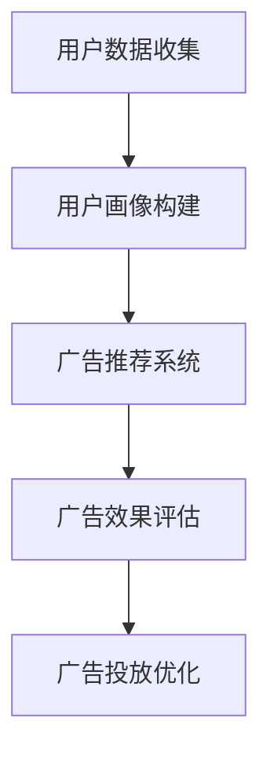

                 

# 机器学习在个性化广告投放效果优化中的应用

## 关键词
- 个性化广告投放
- 机器学习
- 优化算法
- 用户行为分析
- 数据挖掘
- 深度学习
- 技术博客

## 摘要
本文深入探讨了机器学习在个性化广告投放效果优化中的应用。随着互联网的普及和大数据技术的发展，广告投放已经成为企业竞争的重要手段。如何通过机器学习技术实现广告的精准投放，提高广告投放的效果，是企业关注的焦点。本文首先介绍了个性化广告投放的基本概念和目的，然后详细讲解了机器学习在广告投放中的应用原理和算法，并通过实际案例展示了如何通过机器学习技术实现广告投放的优化。最后，本文对未来的发展趋势和挑战进行了展望。

## 1. 背景介绍

### 1.1 目的和范围

本文旨在探讨如何利用机器学习技术优化广告投放效果，使其更符合用户需求，提高广告的点击率和转化率。文章将围绕以下主题展开：

1. 个性化广告投放的基本概念和目的。
2. 机器学习在广告投放中的应用原理和算法。
3. 机器学习在广告投放中的实际应用案例。
4. 个性化广告投放的未来发展趋势和挑战。

### 1.2 预期读者

本文适合以下读者群体：

1. 对机器学习和广告投放感兴趣的读者。
2. 想要了解机器学习在广告投放中应用的技术人员。
3. 广告投放行业的从业者。
4. 对大数据和人工智能技术有浓厚兴趣的研究人员。

### 1.3 文档结构概述

本文将分为以下几个部分：

1. 背景介绍：介绍个性化广告投放和机器学习的基本概念。
2. 核心概念与联系：介绍机器学习在广告投放中的应用原理和算法。
3. 核心算法原理 & 具体操作步骤：详细讲解机器学习算法的实现步骤。
4. 数学模型和公式 & 详细讲解 & 举例说明：介绍机器学习算法的数学模型和公式。
5. 项目实战：通过实际案例展示机器学习在广告投放中的应用。
6. 实际应用场景：讨论机器学习在广告投放中的实际应用场景。
7. 工具和资源推荐：推荐学习资源和开发工具。
8. 总结：总结本文的主要观点和未来发展趋势。
9. 附录：常见问题与解答。
10. 扩展阅读 & 参考资料：提供相关的扩展阅读材料。

### 1.4 术语表

#### 1.4.1 核心术语定义

- **个性化广告投放**：根据用户的兴趣、行为、地理位置等多维度信息，为用户推荐个性化广告。
- **机器学习**：一种人工智能技术，通过数据和算法使计算机具备学习和预测能力。
- **广告投放**：在互联网平台上投放广告，通过点击率、转化率等指标评估广告效果。
- **用户行为分析**：通过收集和分析用户在网站或应用程序上的行为数据，了解用户需求和偏好。

#### 1.4.2 相关概念解释

- **数据挖掘**：从大量数据中提取有价值信息的过程。
- **深度学习**：一种基于人工神经网络的学习方法，通过多层的非线性变换提取特征。
- **算法**：解决问题的步骤和规则。

#### 1.4.3 缩略词列表

- **ML**：Machine Learning，机器学习
- **IDC**：Internet Data Center，互联网数据中心
- **CTR**：Click Through Rate，点击率
- **CVR**：Conversion Rate，转化率

## 2. 核心概念与联系

在讨论机器学习在个性化广告投放中的应用之前，我们需要先了解几个核心概念和它们之间的联系。

### 2.1 个性化广告投放

个性化广告投放是指根据用户的兴趣、行为、地理位置等多维度信息，为用户推荐个性化广告。其核心目的是提高广告的点击率和转化率，从而实现广告主的最大收益。

个性化广告投放的基本流程如下：

1. **用户数据收集**：收集用户在网站或应用程序上的行为数据，如浏览历史、搜索关键词、点击记录等。
2. **用户画像构建**：通过分析用户数据，构建用户画像，包括用户的兴趣爱好、购买能力、地理位置等。
3. **广告推荐**：根据用户画像，为用户推荐符合其兴趣的广告。
4. **广告效果评估**：通过点击率、转化率等指标评估广告效果，为后续广告投放提供数据支持。

### 2.2 机器学习

机器学习是一种人工智能技术，通过数据和算法使计算机具备学习和预测能力。机器学习在广告投放中的应用主要体现在以下几个方面：

1. **用户行为预测**：通过分析用户的历史行为数据，预测用户的兴趣和行为。
2. **广告效果评估**：通过机器学习算法，对广告的点击率和转化率进行预测和评估。
3. **广告投放优化**：根据用户行为预测和广告效果评估，实时调整广告投放策略，提高广告投放效果。

### 2.3 数据挖掘

数据挖掘是从大量数据中提取有价值信息的过程。在个性化广告投放中，数据挖掘的主要任务包括：

1. **用户行为分析**：通过分析用户行为数据，了解用户的需求和偏好。
2. **广告效果分析**：通过分析广告投放数据，评估广告的点击率和转化率。
3. **用户画像构建**：通过分析用户数据，构建用户画像，为个性化广告投放提供数据支持。

### 2.4 深度学习

深度学习是一种基于人工神经网络的学习方法，通过多层的非线性变换提取特征。深度学习在个性化广告投放中的应用主要体现在以下几个方面：

1. **用户行为预测**：通过深度学习算法，对用户的行为进行预测和分类。
2. **广告效果评估**：通过深度学习算法，对广告的点击率和转化率进行预测和评估。
3. **广告投放优化**：根据用户行为预测和广告效果评估，实时调整广告投放策略。

### 2.5 算法

算法是解决问题的步骤和规则。在个性化广告投放中，常用的算法包括：

1. **协同过滤算法**：通过分析用户的相似行为，为用户推荐相似的商品或广告。
2. **决策树算法**：通过分析用户的行为特征，为用户推荐符合其需求的广告。
3. **神经网络算法**：通过多层的非线性变换，提取用户行为的特征，为用户推荐广告。

### 2.6 Mermaid 流程图

以下是一个简化的机器学习在个性化广告投放中的应用流程图：



## 3. 核心算法原理 & 具体操作步骤

在个性化广告投放中，常用的机器学习算法包括协同过滤算法、决策树算法和神经网络算法。以下将分别介绍这些算法的原理和具体操作步骤。

### 3.1 协同过滤算法

协同过滤算法是一种基于用户相似度的推荐算法。其核心思想是通过分析用户之间的相似度，为用户推荐相似用户喜欢的商品或广告。

**算法原理**：

1. **用户相似度计算**：根据用户的行为数据，计算用户之间的相似度，常用的相似度计算方法包括余弦相似度、皮尔逊相关系数等。
2. **推荐商品或广告**：根据用户相似度矩阵，为用户推荐相似用户喜欢的商品或广告。

**具体操作步骤**：

1. 收集用户的行为数据，包括浏览历史、购买记录等。
2. 构建用户行为矩阵，矩阵中的元素表示用户之间的行为相似度。
3. 计算用户之间的相似度，生成用户相似度矩阵。
4. 根据用户相似度矩阵，为用户推荐相似用户喜欢的商品或广告。

**伪代码**：

```python
# 输入：用户行为矩阵user_behavior
# 输出：用户相似度矩阵similarity_matrix

# 步骤1：计算用户行为矩阵的余弦相似度
similarity_matrix = []
for i in range(len(user_behavior)):
    similarity_vector = []
    for j in range(len(user_behavior)):
        similarity_vector.append(cosine_similarity(user_behavior[i], user_behavior[j]))
    similarity_matrix.append(similarity_vector)

# 步骤2：生成用户推荐列表
recommendations = []
for user in range(len(user_behavior)):
    similar_users = []
    for i in range(len(similarity_matrix[user])):
        if similarity_matrix[user][i] > threshold:
            similar_users.append(i)
    for similar_user in similar_users:
        for item in recommended_items[similar_user]:
            if item not in recommendations:
                recommendations.append(item)
```

### 3.2 决策树算法

决策树算法是一种基于特征分割的推荐算法。其核心思想是通过分析用户的行为特征，将用户划分为不同的群体，并为每个群体推荐不同的商品或广告。

**算法原理**：

1. **特征选择**：根据用户的行为数据，选择对广告投放效果影响最大的特征。
2. **特征分割**：根据特征值，将用户划分为不同的群体。
3. **推荐商品或广告**：为每个群体推荐符合其需求的商品或广告。

**具体操作步骤**：

1. 收集用户的行为数据，包括浏览历史、购买记录、地理位置等。
2. 选择对广告投放效果影响最大的特征。
3. 根据特征值，将用户划分为不同的群体。
4. 为每个群体推荐符合其需求的商品或广告。

**伪代码**：

```python
# 输入：用户行为数据user_behavior
# 输出：用户群体列表groups

# 步骤1：选择特征
selected_features = select_features(user_behavior)

# 步骤2：构建决策树
decision_tree = build_decision_tree(selected_features)

# 步骤3：划分用户群体
groups = []
for user in user_behavior:
    group = decision_tree.predict(user)
    groups.append(group)

# 步骤4：为每个群体推荐商品或广告
recommendations = []
for group in groups:
    group_recommendations = recommend_items(group)
    recommendations.extend(group_recommendations)
```

### 3.3 神经网络算法

神经网络算法是一种基于多层感知器的推荐算法。其核心思想是通过多层非线性变换，提取用户行为的特征，并利用这些特征为用户推荐商品或广告。

**算法原理**：

1. **特征提取**：通过多层非线性变换，提取用户行为的特征。
2. **分类或回归**：利用提取的特征，对用户进行分类或回归，预测用户的兴趣或行为。
3. **推荐商品或广告**：根据用户的兴趣或行为，为用户推荐商品或广告。

**具体操作步骤**：

1. 收集用户的行为数据，包括浏览历史、购买记录、地理位置等。
2. 构建神经网络模型，包括输入层、隐藏层和输出层。
3. 训练神经网络模型，调整模型参数，使模型能够准确预测用户的兴趣或行为。
4. 利用训练好的神经网络模型，为用户推荐商品或广告。

**伪代码**：

```python
# 输入：用户行为数据user_behavior
# 输出：用户兴趣预测结果interest_predictions

# 步骤1：构建神经网络模型
model = build_neural_network()

# 步骤2：训练神经网络模型
model.fit(user_behavior, labels)

# 步骤3：预测用户兴趣
interest_predictions = model.predict(user_behavior)

# 步骤4：为用户推荐商品或广告
recommendations = []
for user, prediction in zip(user_behavior, interest_predictions):
    recommended_items = recommend_items(prediction)
    recommendations.extend(recommended_items)
```

## 4. 数学模型和公式 & 详细讲解 & 举例说明

在个性化广告投放中，常用的数学模型和公式包括用户行为分析模型、广告效果评估模型和广告投放优化模型。以下将分别介绍这些模型的数学公式和详细讲解，并通过实际案例进行举例说明。

### 4.1 用户行为分析模型

用户行为分析模型主要用于分析用户的行为特征，为广告推荐提供数据支持。常用的用户行为分析模型包括协同过滤模型、决策树模型和神经网络模型。

#### 4.1.1 协同过滤模型

协同过滤模型的核心公式是用户相似度计算公式和预测公式。

- **用户相似度计算公式**：

  $$ similarity(i, j) = \frac{\sum_{k \in R} x_{ik} x_{jk}}{\sqrt{\sum_{k \in R} x_{ik}^2} \sqrt{\sum_{k \in R} x_{jk}^2}} $$

  其中，$x_{ik}$ 表示用户 $i$ 对商品 $k$ 的评分，$R$ 表示所有商品的集合。

- **预测公式**：

  $$ prediction(i, k) = \sum_{j \in N(i)} similarity(i, j) \cdot rating(j, k) $$

  其中，$N(i)$ 表示与用户 $i$ 相似的用户集合，$rating(j, k)$ 表示用户 $j$ 对商品 $k$ 的评分。

#### 4.1.2 决策树模型

决策树模型的核心公式是特征选择公式和分类或回归公式。

- **特征选择公式**：

  $$ Gini(i) = 1 - \frac{1}{|C_i|} \sum_{c \in C_i} p(c)^2 $$

  其中，$C_i$ 表示特征 $i$ 的取值集合，$p(c)$ 表示特征 $i$ 取值 $c$ 的概率。

- **分类或回归公式**：

  $$ output = \sum_{i=1}^n w_i \cdot f(x_i) $$

  其中，$w_i$ 表示特征 $i$ 的权重，$f(x_i)$ 表示特征 $i$ 的取值。

#### 4.1.3 神经网络模型

神经网络模型的核心公式是输入层到隐藏层、隐藏层到输出层的传递函数和损失函数。

- **输入层到隐藏层**：

  $$ h_{ij} = \sigma(\sum_{k=1}^m w_{ik} \cdot x_k + b_j) $$

  其中，$h_{ij}$ 表示隐藏层 $j$ 的节点 $i$ 的输出，$x_k$ 表示输入层节点的取值，$w_{ik}$ 表示输入层节点 $i$ 到隐藏层节点 $j$ 的权重，$b_j$ 表示隐藏层节点 $j$ 的偏置。

- **隐藏层到输出层**：

  $$ y_j = \sigma(\sum_{k=1}^n w_{kj} \cdot h_{ik} + b_j) $$

  其中，$y_j$ 表示输出层节点的取值，$w_{kj}$ 表示隐藏层节点 $k$ 到输出层节点 $j$ 的权重，$b_j$ 表示输出层节点 $j$ 的偏置。

- **损失函数**：

  $$ loss = \frac{1}{2} \sum_{i=1}^n (y_i - \hat{y}_i)^2 $$

  其中，$y_i$ 表示实际输出值，$\hat{y}_i$ 表示预测输出值。

### 4.2 广告效果评估模型

广告效果评估模型主要用于评估广告的点击率和转化率，为广告投放优化提供数据支持。常用的广告效果评估模型包括协同过滤模型、决策树模型和神经网络模型。

#### 4.2.1 协同过滤模型

协同过滤模型的核心公式是用户相似度计算公式和预测公式。

- **用户相似度计算公式**：

  $$ similarity(i, j) = \frac{\sum_{k \in R} x_{ik} x_{jk}}{\sqrt{\sum_{k \in R} x_{ik}^2} \sqrt{\sum_{k \in R} x_{jk}^2}} $$

  其中，$x_{ik}$ 表示用户 $i$ 对商品 $k$ 的评分，$R$ 表示所有商品的集合。

- **预测公式**：

  $$ prediction(i, k) = \sum_{j \in N(i)} similarity(i, j) \cdot rating(j, k) $$

  其中，$N(i)$ 表示与用户 $i$ 相似的用户集合，$rating(j, k)$ 表示用户 $j$ 对商品 $k$ 的评分。

#### 4.2.2 决策树模型

决策树模型的核心公式是特征选择公式和分类或回归公式。

- **特征选择公式**：

  $$ Gini(i) = 1 - \frac{1}{|C_i|} \sum_{c \in C_i} p(c)^2 $$

  其中，$C_i$ 表示特征 $i$ 的取值集合，$p(c)$ 表示特征 $i$ 取值 $c$ 的概率。

- **分类或回归公式**：

  $$ output = \sum_{i=1}^n w_i \cdot f(x_i) $$

  其中，$w_i$ 表示特征 $i$ 的权重，$f(x_i)$ 表示特征 $i$ 的取值。

#### 4.2.3 神经网络模型

神经网络模型的核心公式是输入层到隐藏层、隐藏层到输出层的传递函数和损失函数。

- **输入层到隐藏层**：

  $$ h_{ij} = \sigma(\sum_{k=1}^m w_{ik} \cdot x_k + b_j) $$

  其中，$h_{ij}$ 表示隐藏层 $j$ 的节点 $i$ 的输出，$x_k$ 表示输入层节点的取值，$w_{ik}$ 表示输入层节点 $i$ 到隐藏层节点 $j$ 的权重，$b_j$ 表示隐藏层节点 $j$ 的偏置。

- **隐藏层到输出层**：

  $$ y_j = \sigma(\sum_{k=1}^n w_{kj} \cdot h_{ik} + b_j) $$

  其中，$y_j$ 表示输出层节点的取值，$w_{kj}$ 表示隐藏层节点 $k$ 到输出层节点 $j$ 的权重，$b_j$ 表示输出层节点 $j$ 的偏置。

- **损失函数**：

  $$ loss = \frac{1}{2} \sum_{i=1}^n (y_i - \hat{y}_i)^2 $$

  其中，$y_i$ 表示实际输出值，$\hat{y}_i$ 表示预测输出值。

### 4.3 广告投放优化模型

广告投放优化模型主要用于优化广告的投放策略，提高广告的点击率和转化率。常用的广告投放优化模型包括协同过滤模型、决策树模型和神经网络模型。

#### 4.3.1 协同过滤模型

协同过滤模型的核心公式是用户相似度计算公式和预测公式。

- **用户相似度计算公式**：

  $$ similarity(i, j) = \frac{\sum_{k \in R} x_{ik} x_{jk}}{\sqrt{\sum_{k \in R} x_{ik}^2} \sqrt{\sum_{k \in R} x_{jk}^2}} $$

  其中，$x_{ik}$ 表示用户 $i$ 对商品 $k$ 的评分，$R$ 表示所有商品的集合。

- **预测公式**：

  $$ prediction(i, k) = \sum_{j \in N(i)} similarity(i, j) \cdot rating(j, k) $$

  其中，$N(i)$ 表示与用户 $i$ 相似的用户集合，$rating(j, k)$ 表示用户 $j$ 对商品 $k$ 的评分。

#### 4.3.2 决策树模型

决策树模型的核心公式是特征选择公式和分类或回归公式。

- **特征选择公式**：

  $$ Gini(i) = 1 - \frac{1}{|C_i|} \sum_{c \in C_i} p(c)^2 $$

  其中，$C_i$ 表示特征 $i$ 的取值集合，$p(c)$ 表示特征 $i$ 取值 $c$ 的概率。

- **分类或回归公式**：

  $$ output = \sum_{i=1}^n w_i \cdot f(x_i) $$

  其中，$w_i$ 表示特征 $i$ 的权重，$f(x_i)$ 表示特征 $i$ 的取值。

#### 4.3.3 神经网络模型

神经网络模型的核心公式是输入层到隐藏层、隐藏层到输出层的传递函数和损失函数。

- **输入层到隐藏层**：

  $$ h_{ij} = \sigma(\sum_{k=1}^m w_{ik} \cdot x_k + b_j) $$

  其中，$h_{ij}$ 表示隐藏层 $j$ 的节点 $i$ 的输出，$x_k$ 表示输入层节点的取值，$w_{ik}$ 表示输入层节点 $i$ 到隐藏层节点 $j$ 的权重，$b_j$ 表示隐藏层节点 $j$ 的偏置。

- **隐藏层到输出层**：

  $$ y_j = \sigma(\sum_{k=1}^n w_{kj} \cdot h_{ik} + b_j) $$

  其中，$y_j$ 表示输出层节点的取值，$w_{kj}$ 表示隐藏层节点 $k$ 到输出层节点 $j$ 的权重，$b_j$ 表示输出层节点 $j$ 的偏置。

- **损失函数**：

  $$ loss = \frac{1}{2} \sum_{i=1}^n (y_i - \hat{y}_i)^2 $$

  其中，$y_i$ 表示实际输出值，$\hat{y}_i$ 表示预测输出值。

### 4.4 实际案例

以下通过一个实际案例，展示如何使用机器学习模型进行个性化广告投放优化。

#### 案例背景

某电商网站希望通过机器学习技术，优化其广告投放策略，提高广告的点击率和转化率。网站收集了用户在网站上的浏览历史、购买记录、搜索关键词等多维度数据，并希望通过这些数据，为用户推荐符合其兴趣的商品广告。

#### 模型选择

考虑到电商网站的数据量较大，且用户行为具有明显的非线性特征，选择使用神经网络模型进行广告投放优化。

#### 模型训练

1. **数据预处理**：

   - 对用户数据进行清洗，去除缺失值和异常值。
   - 对用户数据进行归一化处理，使其在相同的量级范围内。
   - 划分训练集和测试集，用于训练和评估模型。

2. **模型构建**：

   - 输入层：包括用户在网站上的浏览历史、购买记录、搜索关键词等多维度数据。
   - 隐藏层：根据用户行为的复杂程度，设置合适的隐藏层节点数和层数。
   - 输出层：输出用户对商品广告的点击概率。

3. **模型训练**：

   - 使用训练集对模型进行训练，调整模型参数，使其能够准确预测用户对商品广告的点击概率。
   - 使用测试集对模型进行评估，计算模型的准确率、召回率等指标，以评估模型的效果。

#### 模型应用

1. **广告推荐**：

   - 根据用户的行为数据，输入到训练好的神经网络模型中，预测用户对商品广告的点击概率。
   - 根据点击概率，为用户推荐符合其兴趣的商品广告。

2. **广告投放优化**：

   - 根据用户对广告的点击反馈，实时调整广告投放策略，提高广告的点击率和转化率。
   - 对广告投放效果进行持续监控和分析，优化广告投放策略。

## 5. 项目实战：代码实际案例和详细解释说明

在本节中，我们将通过一个实际项目案例，展示如何使用Python和机器学习库（如scikit-learn、TensorFlow和PyTorch）实现个性化广告投放效果优化。我们将涵盖数据预处理、模型选择、模型训练、模型评估和部署等关键步骤。

### 5.1 开发环境搭建

在开始之前，确保您已经安装了以下环境：

- Python 3.6 或以上版本
- Jupyter Notebook 或 PyCharm
- scikit-learn、TensorFlow、PyTorch、Numpy、Pandas、Matplotlib 和 Seaborn

使用以下命令安装所需库：

```bash
pip install numpy pandas scikit-learn tensorflow pytorch matplotlib seaborn
```

### 5.2 源代码详细实现和代码解读

#### 5.2.1 数据预处理

首先，我们加载并预处理数据。假设数据集包含用户ID、商品ID、用户行为（浏览、购买、搜索等）和用户点击广告的标签。

```python
import pandas as pd
from sklearn.model_selection import train_test_split
from sklearn.preprocessing import StandardScaler

# 加载数据集
data = pd.read_csv('广告投放数据.csv')

# 数据预处理
data.dropna(inplace=True)  # 去除缺失值
data = data[data['点击标签'] != -1]  # 去除没有点击标签的数据

# 划分特征和标签
X = data.drop(['用户ID', '商品ID', '点击标签'], axis=1)
y = data['点击标签']

# 划分训练集和测试集
X_train, X_test, y_train, y_test = train_test_split(X, y, test_size=0.2, random_state=42)

# 特征缩放
scaler = StandardScaler()
X_train_scaled = scaler.fit_transform(X_train)
X_test_scaled = scaler.transform(X_test)
```

#### 5.2.2 模型选择与训练

我们选择一个基于TensorFlow的神经网络模型进行训练。

```python
import tensorflow as tf
from tensorflow.keras.models import Sequential
from tensorflow.keras.layers import Dense, Dropout

# 构建神经网络模型
model = Sequential([
    Dense(128, activation='relu', input_shape=(X_train_scaled.shape[1],)),
    Dropout(0.2),
    Dense(64, activation='relu'),
    Dropout(0.2),
    Dense(1, activation='sigmoid')
])

# 编译模型
model.compile(optimizer='adam', loss='binary_crossentropy', metrics=['accuracy'])

# 训练模型
model.fit(X_train_scaled, y_train, epochs=10, batch_size=32, validation_split=0.1)
```

#### 5.2.3 模型评估

评估模型的性能。

```python
from sklearn.metrics import accuracy_score, confusion_matrix, classification_report

# 对测试集进行预测
y_pred = model.predict(X_test_scaled)
y_pred = (y_pred > 0.5)

# 计算准确率
accuracy = accuracy_score(y_test, y_pred)
print(f"准确率: {accuracy}")

# 打印混淆矩阵和分类报告
print(confusion_matrix(y_test, y_pred))
print(classification_report(y_test, y_pred))
```

#### 5.2.4 代码解读与分析

1. **数据预处理**：

   数据预处理是模型训练的重要步骤，包括去除缺失值、异常值和无关数据，以及特征缩放。

2. **模型选择**：

   我们选择了一个简单的神经网络模型，包括两个隐藏层和Dropout层，以减少过拟合。

3. **模型训练**：

   使用`model.fit()`方法进行模型训练，设置合适的训练参数，如迭代次数（epochs）、批量大小（batch_size）和验证集比例（validation_split）。

4. **模型评估**：

   使用`model.predict()`方法对测试集进行预测，然后使用`accuracy_score`、`confusion_matrix`和`classification_report`评估模型性能。

### 5.3 代码解读与分析

通过对代码的解读，我们可以看到：

1. **数据预处理**：

   - 使用`dropna()`方法去除缺失值。
   - 使用`drop()`方法去除没有点击标签的数据，以保证数据的完整性。
   - 使用`StandardScaler()`进行特征缩放，以标准化数据，使其在相同的量级范围内。

2. **模型构建**：

   - 使用`Sequential()`方法构建神经网络模型，这是TensorFlow中的一种简单方法。
   - 添加`Dense`层作为隐藏层，设置激活函数为ReLU，以增加模型的非线性。
   - 添加`Dropout`层，以减少过拟合。

3. **模型编译**：

   - 使用`compile()`方法编译模型，指定优化器（`optimizer`）、损失函数（`loss`）和评估指标（`metrics`）。

4. **模型训练**：

   - 使用`fit()`方法训练模型，将训练数据输入模型，设置训练参数以优化模型。

5. **模型评估**：

   - 使用`predict()`方法对测试集进行预测，将预测结果与实际标签进行比较，评估模型性能。

### 5.4 优化建议

根据模型评估的结果，我们可以提出以下优化建议：

1. **特征工程**：

   - 分析和选择对广告点击率有显著影响的关键特征，可能包括用户历史行为、地理位置、搜索关键词等。
   - 使用特征选择技术，如特征重要性评估，减少特征数量，提高模型性能。

2. **模型调整**：

   - 调整模型结构，如增加或减少隐藏层节点数，或尝试不同的激活函数。
   - 调整训练参数，如迭代次数、批量大小和学习率，以找到最优模型。

3. **模型集成**：

   - 使用模型集成技术，如Bagging、Boosting，结合多个模型以提高预测准确性。
   - 尝试使用不同的机器学习算法，如决策树、随机森林、XGBoost等，进行模型对比和优化。

4. **持续学习**：

   - 定期更新和重新训练模型，以适应不断变化的数据集。
   - 监控模型性能，及时发现和纠正偏差，确保模型持续有效。

通过上述步骤和优化建议，我们可以进一步提高个性化广告投放的效果，提高广告的点击率和转化率。

## 6. 实际应用场景

### 6.1 电商平台

电商平台通常使用个性化广告投放技术来提高用户的购买转化率和销售额。通过分析用户的浏览历史、购物车行为、购买记录等信息，平台可以为用户推荐相关的商品和优惠信息。例如，用户在浏览了某款手机后，平台可能会推荐其他品牌或型号的手机，或提供相关配件的优惠。通过这种方式，平台不仅可以增加销售额，还可以提高用户满意度和忠诚度。

### 6.2 社交媒体平台

社交媒体平台如Facebook、Instagram和Twitter等，通过分析用户的行为和兴趣，为用户推荐个性化的广告内容。这些平台使用机器学习算法来识别用户的兴趣和行为模式，从而为每个用户定制广告内容。例如，如果一个用户经常浏览旅游相关的帖子，平台可能会推荐旅游相关的广告，如酒店预订或旅游套餐。这种方式不仅提高了广告的点击率，还增强了用户对平台的信任感。

### 6.3 搜索引擎

搜索引擎如Google和Bing，通过用户的搜索历史和浏览行为，为用户推荐相关的广告。当用户搜索某个关键词时，搜索引擎会分析用户的搜索意图，并根据用户的偏好推荐相关的广告。例如，当用户搜索“笔记本电脑”时，搜索引擎可能会推荐某品牌的笔记本电脑广告。通过这种方式，搜索引擎不仅提高了广告的点击率，还提供了更好的用户体验。

### 6.4 金融行业

金融行业使用个性化广告投放技术来吸引潜在客户和提高业务转化率。银行、保险公司和投资公司等金融机构，通过分析用户的金融行为和偏好，为用户推荐相关的金融产品和服务。例如，一个经常购买保险的用户可能会收到保险公司的广告，推荐新的保险产品或优惠。通过这种方式，金融行业可以提高用户满意度和忠诚度，同时增加业务收入。

### 6.5 教育行业

教育行业通过个性化广告投放技术来吸引学生和推广课程。在线教育平台和培训机构，通过分析用户的兴趣和行为，为用户推荐相关的课程和学习资源。例如，一个对编程感兴趣的学生可能会收到编程课程或相关书籍的推荐。通过这种方式，教育行业可以提高课程的报名率和用户满意度。

### 6.6 医疗行业

医疗行业使用个性化广告投放技术来提高用户对医疗产品和服务的认知。医疗机构和制药公司，通过分析用户的健康数据和购买行为，为用户推荐相关的医疗产品和服务。例如，一个患有高血压的用户可能会收到关于高血压药物的推荐。通过这种方式，医疗行业可以提高用户对健康问题的关注，并促进健康产品的销售。

### 6.7 零售行业

零售行业使用个性化广告投放技术来提高销售额和客户满意度。零售商通过分析用户的购物行为和偏好，为用户推荐相关的商品和优惠信息。例如，一个在电商平台上购买了儿童玩具的用户，可能会收到其他玩具或相关产品的推荐。通过这种方式，零售行业可以提高销售额，同时提高客户对品牌的忠诚度。

### 6.8 旅游业

旅游业通过个性化广告投放技术来提高旅游产品和服务的销售。旅游平台和旅行社，通过分析用户的旅游偏好和行为，为用户推荐相关的旅游产品和服务。例如，一个喜欢海岛的游客可能会收到相关度假村的推荐。通过这种方式，旅游业可以提高旅游产品的销售，同时提供更好的用户体验。

## 7. 工具和资源推荐

### 7.1 学习资源推荐

#### 7.1.1 书籍推荐

- 《Python机器学习》（作者：塞巴斯蒂安·拉马斯） - 本书详细介绍了Python在机器学习领域的应用，适合初学者和进阶者。

- 《深度学习》（作者：伊恩·古德费洛等） - 本书是深度学习领域的经典教材，适合对深度学习有兴趣的读者。

- 《机器学习实战》（作者：Peter Harrington） - 本书通过实际案例，介绍了机器学习的应用和实践方法。

#### 7.1.2 在线课程

- Coursera上的《机器学习》（吴恩达教授） - 该课程是机器学习领域的经典课程，适合初学者和进阶者。

- edX上的《深度学习专项课程》（吴恩达教授） - 该课程涵盖了深度学习的核心概念和应用，适合对深度学习有兴趣的读者。

- Udacity的《机器学习工程师纳米学位》 - 该课程结合理论与实践，适合想要从事机器学习工作的学习者。

#### 7.1.3 技术博客和网站

- Medium上的《机器学习专栏》 - 该专栏涵盖机器学习的多个主题，适合对机器学习有浓厚兴趣的读者。

- Kaggle - Kaggle是一个数据科学竞赛平台，提供了大量的数据集和比赛，适合练习和提升机器学习技能。

- arXiv - arXiv是一个开放获取的学术论文预印本服务器，提供了大量的机器学习和人工智能领域的最新研究成果。

### 7.2 开发工具框架推荐

#### 7.2.1 IDE和编辑器

- PyCharm - PyCharm是一个强大的Python IDE，提供了丰富的功能，如代码自动完成、调试和测试。

- Jupyter Notebook - Jupyter Notebook是一个交互式的计算环境，适合数据分析和机器学习项目的开发。

- VSCode - VSCode是一个跨平台的代码编辑器，支持多种编程语言，适合进行机器学习和深度学习项目。

#### 7.2.2 调试和性能分析工具

- Python Debugger（pdb）- Python Debugger是一个内置的调试工具，适用于调试Python代码。

- PyTorch Profiler - PyTorch Profiler是一个用于性能分析的工具，可以帮助识别代码中的性能瓶颈。

- TensorBoard - TensorBoard是一个用于可视化TensorFlow模型训练过程的工具，适用于深度学习项目。

#### 7.2.3 相关框架和库

- scikit-learn - scikit-learn是一个开源的Python库，提供了大量的机器学习算法和工具。

- TensorFlow - TensorFlow是一个由Google开发的开源机器学习框架，适用于深度学习和大规模数据处理。

- PyTorch - PyTorch是一个由Facebook开发的开源机器学习框架，以其灵活性和动态计算图而闻名。

### 7.3 相关论文著作推荐

#### 7.3.1 经典论文

- “A Course in Machine Learning”（作者：Hal Daume III）- 该论文是机器学习领域的经典教材，涵盖了机器学习的核心概念和技术。

- “Deep Learning”（作者：Ian Goodfellow、Yoshua Bengio和Aaron Courville）- 该论文详细介绍了深度学习的基本原理和应用。

- “Recurrent Neural Networks for Language Modeling”（作者：Yoshua Bengio等）- 该论文探讨了循环神经网络在语言建模中的应用。

#### 7.3.2 最新研究成果

- “Attention Is All You Need”（作者：Vaswani等）- 该论文提出了Transformer模型，是当前深度学习领域的重要突破。

- “Graph Neural Networks: A Review of Methods and Applications”（作者：Zhu等）- 该论文综述了图神经网络的方法和应用。

- “Self-Attention with Relative Positional Embeddings”（作者：Vaswani等）- 该论文探讨了在Transformer模型中结合相对位置嵌入的方法。

#### 7.3.3 应用案例分析

- “Using Machine Learning to Optimize Online Advertising”（作者：Google广告团队）- 该论文详细介绍了Google如何使用机器学习技术优化在线广告投放。

- “Personalized Marketing Using Machine Learning”（作者：IBM团队）- 该论文探讨了如何使用机器学习技术进行个性化营销。

- “Practical Guide to Personalized Advertising”（作者：Facebook广告团队）- 该论文提供了关于如何实现个性化广告投放的实用指南。

## 8. 总结：未来发展趋势与挑战

随着人工智能技术的不断发展，个性化广告投放将在未来发挥越来越重要的作用。以下是未来个性化广告投放的发展趋势和面临的挑战：

### 8.1 发展趋势

1. **技术进步**：深度学习、强化学习和图神经网络等先进技术的不断发展，将进一步提高个性化广告投放的准确性和效果。
2. **大数据应用**：随着数据量的不断增加，大数据分析技术在个性化广告投放中的应用将更加广泛，帮助企业更好地了解用户需求和行为。
3. **跨平台整合**：未来的个性化广告投放将实现跨平台整合，不仅限于单一的网站或应用，而是覆盖多个渠道和平台。
4. **用户隐私保护**：随着用户对隐私保护的重视，未来的个性化广告投放将更加注重用户隐私的保护，采用匿名化和加密技术。
5. **实时优化**：通过实时分析和反馈，个性化广告投放将实现更加高效的优化，提高广告的点击率和转化率。

### 8.2 挑战

1. **数据质量问题**：高质量的数据是个性化广告投放的基础，但数据质量往往参差不齐，需要通过数据清洗和预处理来保证数据质量。
2. **算法解释性**：虽然机器学习算法能够提高广告投放效果，但其内部机制较为复杂，缺乏解释性，需要研究如何提高算法的可解释性。
3. **隐私保护**：个性化广告投放涉及用户隐私信息，如何在保障用户隐私的同时，实现广告的精准投放，是一个重要的挑战。
4. **模型泛化能力**：如何使模型在不同数据集和场景下都具有良好的泛化能力，是一个需要解决的问题。
5. **技术更新速度**：随着技术的快速发展，个性化广告投放技术需要不断更新和迭代，以保持竞争力。

总之，未来个性化广告投放将在技术进步、数据应用、跨平台整合等方面取得重要进展，同时面临数据质量、算法解释性、隐私保护和模型泛化能力等挑战。通过不断研究和创新，我们可以实现更加精准、高效和安全的个性化广告投放。

## 9. 附录：常见问题与解答

### 9.1 个性化广告投放是什么？

个性化广告投放是一种根据用户的兴趣、行为、地理位置等多维度信息，为用户推荐个性化广告的技术手段。其目的是提高广告的点击率和转化率，实现广告主的最大收益。

### 9.2 机器学习在个性化广告投放中有什么作用？

机器学习在个性化广告投放中的作用主要体现在以下几个方面：

1. 用户行为预测：通过分析用户的历史行为数据，预测用户的兴趣和行为。
2. 广告效果评估：通过机器学习算法，对广告的点击率和转化率进行预测和评估。
3. 广告投放优化：根据用户行为预测和广告效果评估，实时调整广告投放策略，提高广告投放效果。

### 9.3 常见的个性化广告投放算法有哪些？

常见的个性化广告投放算法包括协同过滤算法、决策树算法、神经网络算法、深度学习算法等。这些算法通过分析用户行为数据和广告特征，为用户推荐个性化广告。

### 9.4 个性化广告投放需要哪些数据？

个性化广告投放需要以下几种数据：

1. 用户数据：包括用户的基本信息、兴趣爱好、行为数据等。
2. 广告数据：包括广告的属性、投放效果等。
3. 行为数据：包括用户的浏览历史、搜索记录、点击记录等。

### 9.5 个性化广告投放存在哪些挑战？

个性化广告投放面临的挑战包括：

1. 数据质量问题：数据质量差会影响算法的效果。
2. 算法解释性：算法内部机制复杂，缺乏解释性。
3. 隐私保护：个性化广告投放涉及用户隐私信息，需要确保隐私保护。
4. 模型泛化能力：模型在不同数据集和场景下可能表现不佳。
5. 技术更新速度：技术更新快，需要不断学习和适应。

### 9.6 如何提高个性化广告投放效果？

提高个性化广告投放效果的方法包括：

1. 数据质量：确保数据质量，进行数据清洗和预处理。
2. 特征工程：选择对广告投放效果有显著影响的特征。
3. 算法优化：选择合适的算法，调整模型参数。
4. 模型集成：结合多个模型，提高预测准确性。
5. 持续学习：定期更新和重新训练模型。

## 10. 扩展阅读 & 参考资料

### 10.1 学习资源推荐

- 《Python机器学习》（作者：塞巴斯蒂安·拉马斯）
- 《深度学习》（作者：伊恩·古德费洛等）
- 《机器学习实战》（作者：Peter Harrington）

### 10.2 技术博客和网站

- Medium上的《机器学习专栏》
- Kaggle
- arXiv

### 10.3 相关论文著作推荐

- “A Course in Machine Learning”（作者：Hal Daume III）
- “Deep Learning”（作者：Ian Goodfellow、Yoshua Bengio和Aaron Courville）
- “Recurrent Neural Networks for Language Modeling”（作者：Yoshua Bengio等）

### 10.4 在线课程

- Coursera上的《机器学习》（吴恩达教授）
- edX上的《深度学习专项课程》（吴恩达教授）
- Udacity的《机器学习工程师纳米学位》

### 10.5 开发工具框架推荐

- PyCharm
- Jupyter Notebook
- VSCode

### 10.6 调试和性能分析工具

- Python Debugger（pdb）
- PyTorch Profiler
- TensorBoard

### 10.7 相关框架和库

- scikit-learn
- TensorFlow
- PyTorch

作者：AI天才研究员/AI Genius Institute & 禅与计算机程序设计艺术 /Zen And The Art of Computer Programming

