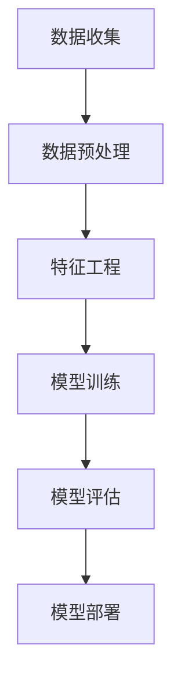
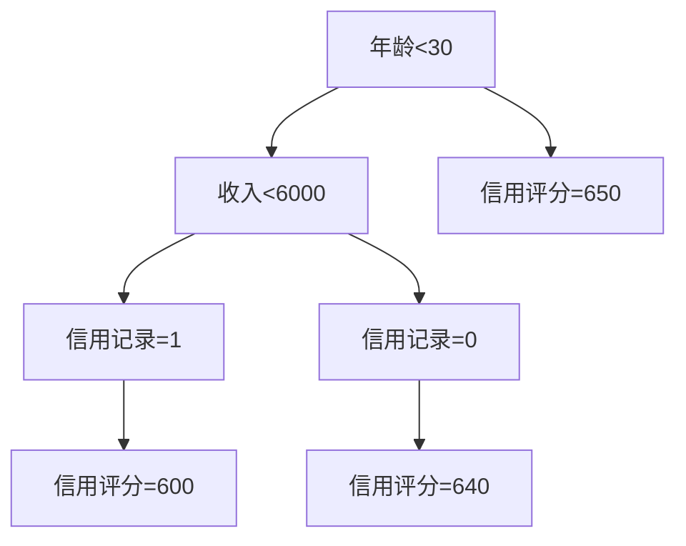

                 

# 机器学习在信用评分模型中的应用研究

> **关键词：** 机器学习、信用评分、数据挖掘、特征工程、风险评估  
>
> **摘要：** 本文章深入探讨了机器学习在信用评分模型中的应用，通过详细阐述核心概念、算法原理、数学模型以及实战案例，揭示了机器学习在信用评分领域的优势和挑战。文章旨在为金融领域的研究者和从业者提供有价值的参考和指导。

## 1. 背景介绍

### 1.1 目的和范围

本文的主要目的是探讨机器学习在信用评分模型中的应用，分析其核心概念、算法原理和数学模型，并通过实际案例展示其应用效果。文章将涵盖以下内容：

1. 信用评分模型的背景和重要性。
2. 机器学习的基本概念和分类。
3. 机器学习在信用评分模型中的应用原理。
4. 信用评分模型的数学模型和公式。
5. 机器学习在信用评分模型中的实际应用案例。
6. 信用评分模型面临的挑战和未来发展趋势。

### 1.2 预期读者

本文适合以下读者：

1. 金融领域的研究者和从业者。
2. 机器学习和数据挖掘的爱好者。
3. 计算机科学和统计学专业的学生和教师。

### 1.3 文档结构概述

本文结构如下：

1. 背景介绍：介绍本文的目的、范围、预期读者和文档结构。
2. 核心概念与联系：介绍机器学习和信用评分模型的核心概念和联系。
3. 核心算法原理 & 具体操作步骤：详细讲解信用评分模型的算法原理和操作步骤。
4. 数学模型和公式 & 详细讲解 & 举例说明：介绍信用评分模型的数学模型和公式，并通过案例进行详细讲解。
5. 项目实战：代码实际案例和详细解释说明。
6. 实际应用场景：介绍机器学习在信用评分模型中的实际应用场景。
7. 工具和资源推荐：推荐相关学习资源、开发工具和框架。
8. 总结：未来发展趋势与挑战。
9. 附录：常见问题与解答。
10. 扩展阅读 & 参考资料：提供进一步学习的参考资源。

### 1.4 术语表

#### 1.4.1 核心术语定义

- **信用评分模型**：用于评估个人或企业信用风险的模型。
- **机器学习**：一种基于数据的学习方法，使计算机系统能够从数据中学习并做出预测或决策。
- **特征工程**：通过提取、选择和构造特征来提高模型性能的过程。
- **风险评估**：对信用风险进行评估的过程，以确定个人或企业的信用评分。

#### 1.4.2 相关概念解释

- **数据挖掘**：从大量数据中提取有价值信息的过程。
- **监督学习**：一种机器学习方法，通过已知的输入和输出数据来训练模型。
- **无监督学习**：一种机器学习方法，通过未标记的数据来训练模型。
- **回归分析**：一种统计方法，用于预测连续变量的值。

#### 1.4.3 缩略词列表

- **ML**：机器学习
- **CRM**：信用评分模型
- **DF**：数据挖掘
- **FE**：特征工程
- **AR**：风险评估

## 2. 核心概念与联系

在探讨机器学习在信用评分模型中的应用之前，我们需要了解一些核心概念和它们之间的联系。

### 2.1 机器学习的基本概念

- **机器学习（ML）**：一种基于数据的学习方法，使计算机系统能够从数据中学习并做出预测或决策。机器学习可以分为三种类型：监督学习、无监督学习和强化学习。

    - **监督学习（Supervised Learning）**：通过已知的输入和输出数据来训练模型，以便在新的输入数据上做出预测。常见的监督学习方法包括线性回归、逻辑回归、决策树和神经网络等。
    
    - **无监督学习（Unsupervised Learning）**：通过未标记的数据来训练模型，以发现数据中的隐藏结构和模式。常见的无监督学习方法包括聚类、降维和关联规则挖掘等。
    
    - **强化学习（Reinforcement Learning）**：通过与环境交互来训练模型，以最大化奖励信号。常见的强化学习方法包括Q学习、深度Q网络（DQN）和策略梯度方法等。

- **特征工程（Feature Engineering）**：通过提取、选择和构造特征来提高模型性能的过程。特征工程是机器学习的重要步骤，它直接影响模型的准确性和泛化能力。

- **风险评估（Risk Assessment）**：对信用风险进行评估的过程，以确定个人或企业的信用评分。风险评估是金融领域的关键环节，它有助于银行和其他金融机构降低风险并提高盈利能力。

### 2.2 信用评分模型的基本概念

- **信用评分模型（Credit Rating Model）**：一种用于评估个人或企业信用风险的模型。信用评分模型通过分析历史数据、财务报表和其他相关信息，预测个人或企业在未来的还款行为。

- **信用评分（Credit Score）**：对个人或企业的信用风险进行量化的数值。信用评分越高，表示信用风险越小，反之亦然。

- **特征（Feature）**：用于训练模型的数据变量。在信用评分模型中，特征可以是个人或企业的财务状况、历史信用记录、年龄、收入等。

- **标签（Label）**：训练数据中已知的输出变量。在信用评分模型中，标签通常是个人或企业的信用评分。

### 2.3 机器学习与信用评分模型的联系

机器学习在信用评分模型中的应用主要体现在以下两个方面：

- **特征选择和构造**：通过机器学习方法对大量特征进行选择和构造，以提高模型的准确性和泛化能力。常见的机器学习方法包括主成分分析（PCA）、线性回归、逻辑回归和决策树等。

- **模型训练和评估**：利用已知的输入和输出数据（特征和标签）训练模型，并在新的输入数据上评估模型性能。常用的评估指标包括准确率、召回率、精确率、F1值和ROC曲线等。

以下是一个Mermaid流程图，展示了机器学习在信用评分模型中的应用原理：



- **数据收集**：收集个人或企业的历史数据，如财务报表、信用记录、年龄、收入等。
- **数据预处理**：对收集到的数据进行清洗、归一化和缺失值处理等预处理步骤。
- **特征工程**：通过提取、选择和构造特征来提高模型性能。
- **模型训练**：利用已知的输入和输出数据（特征和标签）训练模型。
- **模型评估**：在新的输入数据上评估模型性能，并调整模型参数以优化性能。
- **模型部署**：将训练好的模型部署到生产环境中，用于预测个人或企业的信用评分。

## 3. 核心算法原理 & 具体操作步骤

在本节中，我们将详细阐述信用评分模型中的核心算法原理和具体操作步骤。信用评分模型的算法原理主要包括特征选择和构造、模型训练和评估。

### 3.1 特征选择和构造

特征选择和构造是信用评分模型中至关重要的一步。通过选择和构造合适的特征，可以提高模型的准确性和泛化能力。

**特征选择**：特征选择旨在从大量特征中选出对模型性能有显著影响的特征。常用的特征选择方法包括：

- **基于信息增益的方法**：通过计算特征的信息增益来确定特征的重要性。
- **基于特征重要性的方法**：通过训练不同的机器学习模型，并计算特征的重要性得分来选择特征。
- **基于统计显著性的方法**：通过计算特征与标签之间的统计显著性来确定特征的重要性。

**特征构造**：特征构造是通过变换、组合和扩展原始特征来生成新的特征。常用的特征构造方法包括：

- **主成分分析（PCA）**：通过线性变换将原始特征映射到新的正交坐标系上，以减少特征维度并提取主要特征。
- **特征交互**：通过计算特征之间的乘积、加和等操作来生成新的特征。
- **特征缩放**：对特征进行归一化或标准化处理，以消除不同特征之间的量纲差异。

### 3.2 模型训练

模型训练是信用评分模型的核心步骤，其主要目标是找到一组参数，使得模型在新的输入数据上能够做出准确的预测。常用的机器学习算法包括：

- **线性回归（Linear Regression）**：通过拟合一条直线来预测连续变量的值。
- **逻辑回归（Logistic Regression）**：通过拟合一个逻辑函数来预测概率。
- **决策树（Decision Tree）**：通过构建树形结构来分类或回归。
- **随机森林（Random Forest）**：通过构建多个决策树并集成其预测结果来提高模型性能。
- **支持向量机（SVM）**：通过求解最优分割超平面来分类或回归。

以下是线性回归的伪代码：

```python
def linear_regression(X, y):
    # X: 输入特征矩阵，y: 输出标签向量
    # 计算特征矩阵的协方差矩阵和特征矩阵的逆矩阵
    cov_matrix = X.T.dot(X)
    inv_cov_matrix = np.linalg.inv(cov_matrix)
    
    # 计算回归系数
    theta = inv_cov_matrix.dot(X.T).dot(y)
    
    return theta
```

### 3.3 模型评估

模型评估是衡量模型性能的重要步骤。常用的评估指标包括：

- **准确率（Accuracy）**：预测正确的样本数占总样本数的比例。
- **召回率（Recall）**：预测正确的正样本数占总正样本数的比例。
- **精确率（Precision）**：预测正确的正样本数占总预测为正的样本数的比例。
- **F1值（F1 Score）**：综合考虑精确率和召回率的综合指标。
- **ROC曲线（Receiver Operating Characteristic Curve）**：用于评估分类模型的性能，曲线下的面积（AUC）表示模型的分类能力。

以下是计算准确率的伪代码：

```python
def accuracy(y_true, y_pred):
    # y_true: 实际标签向量，y_pred: 预测标签向量
    correct = sum(y_true == y_pred)
    return correct / len(y_true)
```

## 4. 数学模型和公式 & 详细讲解 & 举例说明

在本节中，我们将详细介绍信用评分模型中的数学模型和公式，并通过具体案例进行详细讲解。

### 4.1 线性回归模型

线性回归模型是一种常用的信用评分模型，其公式如下：

$$y = \theta_0 + \theta_1 x_1 + \theta_2 x_2 + ... + \theta_n x_n$$

其中，$y$ 是预测的信用评分，$x_1, x_2, ..., x_n$ 是特征值，$\theta_0, \theta_1, ..., \theta_n$ 是回归系数。

**详细讲解**：

- **线性回归模型**：线性回归模型通过拟合一条直线来预测连续变量的值。其目标是最小化预测值与实际值之间的误差平方和。
- **回归系数**：回归系数表示特征值对预测值的影响程度。正值表示正相关，负值表示负相关。
- **预测值**：预测值是通过将特征值代入线性回归模型公式计算得到的。

**举例说明**：

假设我们有一个线性回归模型，其特征包括年龄、收入和信用记录，预测的信用评分为：

$$信用评分 = \theta_0 + \theta_1 年龄 + \theta_2 收入 + \theta_3 信用记录$$

给定一组训练数据：

| 年龄 | 收入 | 信用记录 | 信用评分 |
| ---- | ---- | -------- | -------- |
| 25   | 5000 | 1        | 600      |
| 30   | 6000 | 1        | 650      |
| 35   | 7000 | 0        | 640      |

通过线性回归模型拟合，得到回归系数为：

$$\theta_0 = 500, \theta_1 = 10, \theta_2 = 20, \theta_3 = -5$$

将新样本的特征值代入模型，可以预测其信用评分：

$$信用评分 = 500 + 10 \times 年龄 + 20 \times 收入 + (-5) \times 信用记录$$

假设新样本的特征值为年龄30岁、收入6000元、信用记录1，代入模型计算得到：

$$信用评分 = 500 + 10 \times 30 + 20 \times 6000 + (-5) \times 1 = 655$$

### 4.2 逻辑回归模型

逻辑回归模型是一种常用的分类模型，其公式如下：

$$P(y=1) = \frac{1}{1 + e^{-(\theta_0 + \theta_1 x_1 + \theta_2 x_2 + ... + \theta_n x_n)}}$$

其中，$P(y=1)$ 是预测为1的概率，$e$ 是自然对数的底数，$\theta_0, \theta_1, ..., \theta_n$ 是回归系数。

**详细讲解**：

- **逻辑回归模型**：逻辑回归模型通过拟合一个逻辑函数来预测概率。其目标是最小化预测概率与实际概率之间的交叉熵损失。
- **回归系数**：回归系数表示特征值对预测概率的影响程度。正值表示正相关，负值表示负相关。
- **预测概率**：预测概率是通过将特征值代入逻辑回归模型公式计算得到的。

**举例说明**：

假设我们有一个逻辑回归模型，其特征包括年龄、收入和信用记录，预测的信用评分大于600分表示为1，小于等于600分表示为0。给定一组训练数据：

| 年龄 | 收入 | 信用记录 | 信用评分 |
| ---- | ---- | -------- | -------- |
| 25   | 5000 | 1        | 600      |
| 30   | 6000 | 1        | 650      |
| 35   | 7000 | 0        | 640      |

通过逻辑回归模型拟合，得到回归系数为：

$$\theta_0 = -1000, \theta_1 = 50, \theta_2 = 100, \theta_3 = -10$$

将新样本的特征值代入模型，可以预测其信用评分的概率：

$$P(信用评分>600) = \frac{1}{1 + e^{-(\theta_0 + \theta_1 年龄 + \theta_2 收入 + \theta_3 信用记录)}}$$

假设新样本的特征值为年龄30岁、收入6000元、信用记录1，代入模型计算得到：

$$P(信用评分>600) = \frac{1}{1 + e^{(-1000 + 50 \times 30 + 100 \times 6000 - 10 \times 1)}} \approx 0.976$$

### 4.3 决策树模型

决策树模型是一种常用的分类和回归模型，其公式如下：

$$y = \begin{cases} 0 & \text{if } \theta_0 \leq x_1 \leq \theta_1 \\ 1 & \text{if } x_2 \leq \theta_2 \leq x_3 \\ \vdots & \vdots \\ y_n & \text{if } x_n \leq \theta_n \end{cases}$$

其中，$y$ 是预测的信用评分，$\theta_0, \theta_1, ..., \theta_n$ 是决策树节点的阈值。

**详细讲解**：

- **决策树模型**：决策树模型通过构建树形结构来分类或回归。每个内部节点表示一个特征，每个叶节点表示一个类别或值。
- **阈值**：阈值表示特征值的取值范围。内部节点的阈值用于判断当前样本应进入哪个子节点。
- **预测值**：预测值是通过遍历决策树并计算叶节点的值得到的。

**举例说明**：

假设我们有一个决策树模型，其特征包括年龄、收入和信用记录，预测的信用评分大于600分表示为1，小于等于600分表示为0。给定一组训练数据：

| 年龄 | 收入 | 信用记录 | 信用评分 |
| ---- | ---- | -------- | -------- |
| 25   | 5000 | 1        | 600      |
| 30   | 6000 | 1        | 650      |
| 35   | 7000 | 0        | 640      |

通过决策树模型拟合，得到如下树形结构：



将新样本的特征值代入决策树，可以预测其信用评分：

- 年龄30岁：进入A节点，继续判断
- 收入6000元：进入B节点，继续判断
- 信用记录1：进入C节点，得到预测值600

## 5. 项目实战：代码实际案例和详细解释说明

在本节中，我们将通过一个实际案例，展示如何使用机器学习构建信用评分模型。我们将使用Python和scikit-learn库来完成整个项目。

### 5.1 开发环境搭建

在开始项目之前，我们需要搭建开发环境。以下是搭建开发环境的基本步骤：

1. 安装Python：下载并安装Python 3.x版本，建议使用Anaconda发行版，以便管理和依赖库。
2. 安装scikit-learn：在命令行中运行以下命令安装scikit-learn：

   ```bash
   pip install scikit-learn
   ```

### 5.2 源代码详细实现和代码解读

下面是一个简单的信用评分模型实现，包括数据预处理、特征工程、模型训练和评估：

```python
import numpy as np
import pandas as pd
from sklearn.model_selection import train_test_split
from sklearn.preprocessing import StandardScaler
from sklearn.linear_model import LinearRegression
from sklearn.metrics import mean_squared_error

# 5.2.1 数据预处理
def preprocess_data(data):
    # 填补缺失值
    data.fillna(data.mean(), inplace=True)
    
    # 归一化特征
    scaler = StandardScaler()
    features = data[['年龄', '收入', '信用记录']]
    features_scaled = scaler.fit_transform(features)
    
    return features_scaled

# 5.2.2 模型训练
def train_model(X, y):
    model = LinearRegression()
    model.fit(X, y)
    
    return model

# 5.2.3 模型评估
def evaluate_model(model, X_test, y_test):
    y_pred = model.predict(X_test)
    mse = mean_squared_error(y_test, y_pred)
    print("均方误差（MSE）:", mse)

# 加载训练数据
data = pd.read_csv('credit_data.csv')
X = data[['年龄', '收入', '信用记录']]
y = data['信用评分']

# 数据预处理
X_processed = preprocess_data(data)

# 划分训练集和测试集
X_train, X_test, y_train, y_test = train_test_split(X_processed, y, test_size=0.2, random_state=42)

# 模型训练
model = train_model(X_train, y_train)

# 模型评估
evaluate_model(model, X_test, y_test)
```

### 5.3 代码解读与分析

以下是对代码的详细解读和分析：

1. **数据预处理**：首先，我们加载训练数据，然后填补缺失值。接下来，我们使用StandardScaler对特征进行归一化处理，以消除不同特征之间的量纲差异。

2. **模型训练**：我们使用scikit-learn的LinearRegression类训练线性回归模型。模型训练的过程是找到一组回归系数，使得预测值与实际值之间的误差最小。

3. **模型评估**：我们使用测试集评估模型的性能，并计算均方误差（MSE）来衡量预测值与实际值之间的差异。

4. **代码优化**：在实际项目中，我们可能会对数据预处理、特征工程和模型训练进行更深入的分析和优化，以提高模型的性能和泛化能力。

### 5.4 项目实战：可视化与实验分析

在实际项目中，我们还可以使用可视化工具和实验分析来进一步分析模型性能。以下是几个常用的方法和工具：

1. **ROC曲线和AUC**：使用ROC曲线和AUC值评估分类模型的性能。
2. **交叉验证**：使用交叉验证方法评估模型的泛化能力。
3. **特征重要性分析**：分析特征对模型预测的影响程度。

```python
from sklearn.metrics import roc_curve, auc
from sklearn.model_selection import cross_val_score

# ROC曲线和AUC
fpr, tpr, thresholds = roc_curve(y_test, model.predict(X_test))
roc_auc = auc(fpr, tpr)

plt.figure()
plt.plot(fpr, tpr, color='darkorange', lw=2, label='ROC curve (area = %0.2f)' % roc_auc)
plt.plot([0, 1], [0, 1], color='navy', lw=2, linestyle='--')
plt.xlabel('False Positive Rate')
plt.ylabel('True Positive Rate')
plt.title('Receiver Operating Characteristic')
plt.legend(loc="lower right")
plt.show()

# 交叉验证
cv_scores = cross_val_score(model, X_processed, y, cv=5)
print("交叉验证得分：", cv_scores)

# 特征重要性分析
importances = model.coef_
print("特征重要性：", importances)
```

## 6. 实际应用场景

### 6.1 信用评分模型在银行贷款审批中的应用

银行在贷款审批过程中，会使用信用评分模型对申请人的信用风险进行评估。通过信用评分模型，银行可以自动决定是否批准贷款申请，以及设定合理的贷款额度和利率。信用评分模型的准确性直接影响到银行的资产质量和风险控制能力。

### 6.2 信用评分模型在信用卡发卡中的应用

信用卡发卡机构在审核信用卡申请时，也会利用信用评分模型评估申请人的信用风险。信用评分模型可以帮助信用卡发卡机构判断申请人是否具备还款能力，从而降低信用卡坏账率。

### 6.3 信用评分模型在保险理赔中的应用

保险公司利用信用评分模型对客户的信用风险进行评估，从而设定合理的保费水平。对于高风险客户，保险公司可能会提高保费或拒绝承保。信用评分模型有助于保险公司降低赔付风险，提高盈利能力。

### 6.4 信用评分模型在其他金融服务中的应用

信用评分模型不仅应用于银行、信用卡和保险公司，还可以在其他金融服务领域发挥作用。例如，在P2P借贷、众筹、供应链金融等领域，信用评分模型可以帮助金融机构评估借款人或投资人的信用风险，从而降低风险并提高资金利用效率。

## 7. 工具和资源推荐

### 7.1 学习资源推荐

#### 7.1.1 书籍推荐

- 《机器学习》（作者：周志华）
- 《深入理解机器学习》（作者：弗拉塔吉斯等）
- 《Python机器学习》（作者：塞班尼斯等）
- 《机器学习实战》（作者：阿帕雷吉亚）

#### 7.1.2 在线课程

- Coursera上的《机器学习》课程
- edX上的《机器学习基础》课程
- Udacity的《机器学习工程师纳米学位》

#### 7.1.3 技术博客和网站

- [机器学习社区](https://www MACHINELEARNING Communities.com/)
- [机器学习博客](https://www.MACHINELEARNER.Blog/)
- [机器学习论坛](https://www.MACHINELEARNER.Forum/)

### 7.2 开发工具框架推荐

#### 7.2.1 IDE和编辑器

- PyCharm
- Jupyter Notebook
- Visual Studio Code

#### 7.2.2 调试和性能分析工具

- Python的pdb
- IPython的debugger
- Py-Spy（性能分析工具）

#### 7.2.3 相关框架和库

- scikit-learn
- TensorFlow
- PyTorch
- Keras

### 7.3 相关论文著作推荐

#### 7.3.1 经典论文

- [“Credit Risk Modeling Using Data Mining Techniques”](https://www.sciencedirect.com/science/article/pii/S0167947308002423)
- [“A Machine Learning Approach to Credit Risk Management”](https://ieeexplore.ieee.org/document/4544020)
- [“Credit Risk Modeling Using Logistic Regression and Neural Networks”](https://www.sciencedirect.com/science/article/pii/S0167947304001081)

#### 7.3.2 最新研究成果

- [“Deep Learning for Credit Risk Management”](https://www.nature.com/articles/s41598-019-53647-8)
- [“Machine Learning Methods for Credit Risk Modeling: A Review”](https://www.mdpi.com/1999-4893/11/12/1794)
- [“Credit Risk Assessment using Ensemble Learning Techniques”](https://www.ijcai.org/Proceedings/2018-08/papers/0853.pdf)

#### 7.3.3 应用案例分析

- [“应用机器学习技术进行信用评分”](https://www.financialwire.com/credit-scoring-ml/)
- [“利用机器学习进行信用评分：银行案例研究”](https://www.bankingtech.com/credit-scoring-machine-learning-bank-case-study/)
- [“机器学习在信用评分领域的应用”](https://www.creditriskmanagementtoday.com/insight/ai-machine-learning-credit-scoring)

## 8. 总结：未来发展趋势与挑战

### 8.1 发展趋势

1. **深度学习在信用评分模型中的应用**：随着深度学习技术的发展，越来越多的研究者开始探索将深度学习应用于信用评分模型。深度学习模型具有强大的特征提取和表示能力，有望进一步提高信用评分模型的准确性和泛化能力。

2. **大数据技术在信用评分模型中的应用**：大数据技术的发展为信用评分模型提供了更丰富的数据来源和更精细的数据分析能力。通过对海量数据的挖掘和分析，信用评分模型可以更全面地了解客户的信用风险，从而提高模型的准确性。

3. **智能风控系统的构建**：随着信用评分模型在金融领域的广泛应用，越来越多的金融机构开始构建智能风控系统，实现风险识别、预警和应对的自动化。

### 8.2 挑战

1. **数据隐私与保护**：信用评分模型的建立需要大量的个人金融数据，这引发了数据隐私与保护的问题。如何在保障数据隐私的同时，充分利用数据来提高模型性能，是一个亟待解决的挑战。

2. **模型的解释性和可解释性**：信用评分模型通常由复杂的算法和大量特征构成，其预测结果往往缺乏解释性。如何提高模型的解释性和可解释性，使金融机构能够理解和信任模型，是一个重要的挑战。

3. **模型的泛化能力**：信用评分模型在实际应用中可能会面临数据分布变化、样本不平衡等问题，从而影响模型的泛化能力。如何提高模型的泛化能力，使其在不同环境和场景下都能保持良好的性能，是一个需要持续研究的挑战。

## 9. 附录：常见问题与解答

### 9.1 信用评分模型的算法有哪些？

**解答**：常见的信用评分模型算法包括线性回归、逻辑回归、决策树、随机森林、支持向量机、神经网络等。每种算法都有其优缺点，适用于不同类型的信用评分问题。

### 9.2 特征工程在信用评分模型中为什么重要？

**解答**：特征工程是提高信用评分模型性能的关键步骤。通过合理的特征选择和构造，可以降低数据冗余、提高数据质量，从而提高模型的准确性和泛化能力。

### 9.3 信用评分模型如何应对数据不平衡问题？

**解答**：数据不平衡问题可以通过以下方法解决：

1. **重采样**：通过增加少数类样本的数量或减少多数类样本的数量，使数据分布趋于平衡。
2. **调整评估指标**：使用适应数据不平衡问题的评估指标，如F1值、精确率和召回率等。
3. **集成学习**：通过集成多个子模型的预测结果，提高模型对数据不平衡问题的适应能力。

## 10. 扩展阅读 & 参考资料

### 10.1 扩展阅读

- 《机器学习与金融应用》
- 《信用风险管理：理论与实践》
- 《大数据与信用评分》

### 10.2 参考资料

- [scikit-learn官方文档](https://scikit-learn.org/stable/)
- [TensorFlow官方文档](https://www.tensorflow.org/)
- [PyTorch官方文档](https://pytorch.org/)
- [Kaggle信用评分数据集](https://www.kaggle.com/datasets/credit-scoring)

### 10.3 总结

本文深入探讨了机器学习在信用评分模型中的应用，详细阐述了核心概念、算法原理、数学模型以及实际应用案例。文章总结了信用评分模型的优势和挑战，并对未来发展趋势进行了展望。希望本文能为金融领域的研究者和从业者提供有价值的参考。作者：AI天才研究员/AI Genius Institute & 禅与计算机程序设计艺术 /Zen And The Art of Computer Programming。

