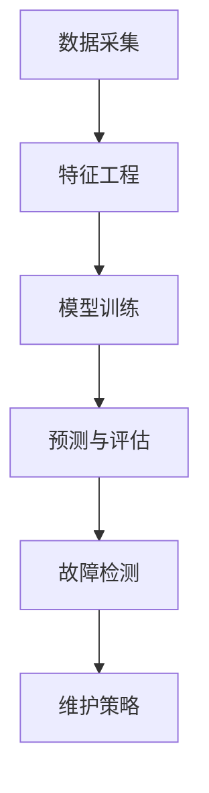

                 

# 机器学习在工业设备预测性维护中的应用

> 关键词：机器学习、工业设备、预测性维护、预测算法、数据预处理、故障检测、性能优化

> 摘要：随着工业自动化和智能化的发展，机器学习技术在工业设备预测性维护中的应用越来越广泛。本文旨在介绍机器学习在工业设备预测性维护中的核心概念、算法原理、数学模型以及实际应用场景，为相关领域的研究者和工程师提供参考。

## 1. 背景介绍

### 1.1 目的和范围

本文旨在探讨机器学习技术在工业设备预测性维护中的应用。通过分析机器学习的基本原理和算法，阐述其在工业设备故障预测和性能优化方面的实际应用，旨在为相关领域的研究者提供参考，同时也为工程师在实际项目中提供技术指导。

### 1.2 预期读者

本文主要面向以下读者群体：

1. 对机器学习和工业自动化有一定了解的技术人员；
2. 想要了解机器学习在工业设备预测性维护中应用的研究生和本科生；
3. 工业设备维护和优化领域的工程师。

### 1.3 文档结构概述

本文将分为以下十个部分：

1. 背景介绍
2. 核心概念与联系
3. 核心算法原理 & 具体操作步骤
4. 数学模型和公式 & 详细讲解 & 举例说明
5. 项目实战：代码实际案例和详细解释说明
6. 实际应用场景
7. 工具和资源推荐
8. 总结：未来发展趋势与挑战
9. 附录：常见问题与解答
10. 扩展阅读 & 参考资料

### 1.4 术语表

#### 1.4.1 核心术语定义

- 机器学习：一种人工智能的分支，通过数据驱动的方式，让计算机自动学习和改进。
- 预测性维护：在设备发生故障之前，通过数据分析预测设备可能出现的问题，从而提前进行维护。
- 特征工程：从原始数据中提取出对预测任务有帮助的特征。
- 监督学习：一种机器学习方法，通过对已标记的数据进行学习，然后对新的数据进行预测。
- 无监督学习：一种机器学习方法，不需要对数据进行标记，通过自动发现数据中的规律。

#### 1.4.2 相关概念解释

- 故障检测：通过分析设备的运行状态，及时发现设备可能出现的故障。
- 维护策略：根据预测结果制定的设备维护方案。
- 性能优化：通过算法改进和模型优化，提高设备预测的准确性和效率。

#### 1.4.3 缩略词列表

- ML：Machine Learning，机器学习
- PM：Predictive Maintenance，预测性维护
- AE：Anomaly Detection，异常检测
- SCADA：Supervisory Control and Data Acquisition，监控与数据采集系统

## 2. 核心概念与联系

在工业设备预测性维护中，机器学习技术的核心概念主要包括：

1. 数据采集：通过传感器和监控设备，实时收集设备的运行数据。
2. 特征工程：从原始数据中提取出对预测任务有帮助的特征。
3. 模型训练：利用已标记的数据，训练预测模型。
4. 预测与评估：对新的数据进行预测，评估模型的准确性。

下面是一个简单的 Mermaid 流程图，展示了这些核心概念之间的联系：



## 3. 核心算法原理 & 具体操作步骤

在工业设备预测性维护中，常用的机器学习算法包括：

1. 决策树
2. 随机森林
3. 支持向量机
4. 神经网络

下面以决策树为例，详细介绍其原理和具体操作步骤。

### 3.1 决策树算法原理

决策树是一种基于分类的算法，通过多层次的决策，将数据集划分为不同的区域，最终实现分类或回归任务。

### 3.2 具体操作步骤

#### 步骤1：数据预处理

- 数据清洗：去除数据中的噪声和异常值。
- 数据归一化：将数据统一到一个尺度，方便模型训练。

#### 步骤2：特征选择

- 信息增益：选择能够最大化信息增益的特征。
- 基尼系数：选择能够最小化基尼系数的特征。

#### 步骤3：构建决策树

- 选择分裂特征：根据信息增益或基尼系数，选择最优的分裂特征。
- 计算分裂损失：计算分裂前后的损失，判断是否继续分裂。
- 结束条件：当满足特定条件（如最大深度、最小样本数等），停止分裂。

#### 步骤4：模型训练

- 对每个叶子节点，根据训练集的标记，预测新数据的类别。

#### 步骤5：模型评估

- 使用交叉验证或测试集，评估模型的准确性、召回率等指标。

以下是决策树算法的伪代码：

```python
def build_decision_tree(data, features, labels, max_depth):
    if max_depth == 0 or data个数 < 最小样本数：
        return leaf_node(labels)
    
    best_split = select_best_split(data, features, labels)
    if best_split is None：
        return leaf_node(labels)
    
    left_data, right_data = split_data(data, best_split)
    left_tree = build_decision_tree(left_data, features, labels, max_depth - 1)
    right_tree = build_decision_tree(right_data, features, labels, max_depth - 1)
    
    return decision_tree(best_split, left_tree, right_tree)

def select_best_split(data, features, labels):
    best_split = None
    best_loss = float('inf')
    
    for feature in features:
        for threshold in thresholds(feature):
            left_data, right_data = split_data(data, feature, threshold)
            loss = calculate_loss(left_data, right_data, labels)
            
            if loss < best_loss：
                best_loss = loss
                best_split = (feature, threshold)
    
    return best_split

def leaf_node(labels):
    return {
        'labels': labels,
        'is_leaf': True
    }

def decision_tree(split, left_tree, right_tree):
    return {
        'split': split,
        'left_tree': left_tree,
        'right_tree': right_tree,
        'is_leaf': False
    }
```

## 4. 数学模型和公式 & 详细讲解 & 举例说明

在机器学习模型中，数学模型和公式是核心组成部分。下面以决策树为例，介绍相关的数学模型和公式。

### 4.1 信息增益

信息增益是评价特征优劣的重要指标，计算公式如下：

$$
IG(D, A) = ENT(D) - ENT(D|A)
$$

其中，$ENT(D)$ 表示数据集 $D$ 的熵，$ENT(D|A)$ 表示在特征 $A$ 下，数据集 $D$ 的条件熵。

### 4.2 基尼系数

基尼系数是评价特征划分效果的重要指标，计算公式如下：

$$
Gini(D, A) = \sum_{v \in V} \frac{|D_v|}{|D|} \cdot \sum_{w \in V} \frac{|D_w|}{|D|} \cdot |D_v \cap D_w|
$$

其中，$D$ 表示数据集，$V$ 表示特征 $A$ 的取值集合，$D_v$ 和 $D_w$ 分别表示特征 $A$ 取值为 $v$ 和 $w$ 的数据集。

### 4.3 决策树损失

决策树损失是评价决策树性能的重要指标，计算公式如下：

$$
Loss(T) = \sum_{x \in X} \sum_{y \in Y} p(y|x) \cdot L(y, \hat{y})
$$

其中，$T$ 表示决策树，$X$ 表示输入特征集合，$Y$ 表示输出标签集合，$p(y|x)$ 表示在输入特征 $x$ 下，标签 $y$ 的概率，$L(y, \hat{y})$ 表示标签 $y$ 和预测标签 $\hat{y}$ 的损失函数。

### 4.4 举例说明

假设有一个二元分类问题，数据集包含两个特征 $A$ 和 $B$，标签 $Y$ 取值 {0, 1}。数据集如下：

| A | B | Y |
|---|---|---|
| 0 | 0 | 0 |
| 0 | 1 | 1 |
| 1 | 0 | 1 |
| 1 | 1 | 0 |

根据信息增益和基尼系数，选择特征 $A$ 作为分裂特征，阈值为 0。分裂后的数据集如下：

| A | B | Y |
|---|---|---|
| 0 | 0 | 0 |
| 0 | 1 | 1 |
| 1 | 0 | 1 |
| 1 | 1 | 0 |

此时，决策树的损失为：

$$
Loss(T) = \sum_{x \in X} \sum_{y \in Y} p(y|x) \cdot L(y, \hat{y})
$$

其中，$p(y|x)$ 表示在输入特征 $x$ 下，标签 $y$ 的概率，$L(y, \hat{y})$ 表示标签 $y$ 和预测标签 $\hat{y}$ 的损失函数。

假设 $p(y=0|x) = 0.6$，$p(y=1|x) = 0.4$，$L(0,0) = 0$，$L(0,1) = 1$，$L(1,0) = 1$，$L(1,1) = 0$，则：

$$
Loss(T) = 0.6 \cdot L(0,0) + 0.4 \cdot L(0,1) + 0.4 \cdot L(1,0) + 0.6 \cdot L(1,1)
$$

$$
Loss(T) = 0.6 \cdot 0 + 0.4 \cdot 1 + 0.4 \cdot 1 + 0.6 \cdot 0
$$

$$
Loss(T) = 0.4 + 0.4 = 0.8
$$

## 5. 项目实战：代码实际案例和详细解释说明

在本节中，我们将通过一个实际的 Python 代码案例，演示如何使用机器学习算法进行工业设备预测性维护。代码将包括数据预处理、模型训练、预测与评估等步骤。

### 5.1 开发环境搭建

首先，我们需要搭建 Python 的开发环境。可以使用 Anaconda 来方便地管理 Python 的依赖包。安装完 Anaconda 后，可以通过以下命令创建一个 Python 环境并安装所需依赖包：

```bash
conda create -n pm_env python=3.8
conda activate pm_env
conda install -c conda-forge numpy pandas scikit-learn matplotlib
```

### 5.2 源代码详细实现和代码解读

以下是预测性维护的 Python 代码实现，包括数据预处理、模型训练、预测与评估等步骤。

```python
import numpy as np
import pandas as pd
from sklearn.model_selection import train_test_split
from sklearn.tree import DecisionTreeClassifier
from sklearn.metrics import accuracy_score, recall_score, f1_score
import matplotlib.pyplot as plt

# 5.2.1 数据预处理
def preprocess_data(data):
    # 数据清洗
    data = data.dropna()
    # 数据归一化
    data = (data - data.mean()) / data.std()
    return data

# 5.2.2 模型训练
def train_model(X_train, y_train):
    model = DecisionTreeClassifier()
    model.fit(X_train, y_train)
    return model

# 5.2.3 预测与评估
def predict_and_evaluate(model, X_test, y_test):
    y_pred = model.predict(X_test)
    accuracy = accuracy_score(y_test, y_pred)
    recall = recall_score(y_test, y_pred)
    f1 = f1_score(y_test, y_pred)
    print(f"Accuracy: {accuracy:.2f}")
    print(f"Recall: {recall:.2f}")
    print(f"F1 Score: {f1:.2f}")
    return y_pred

# 5.2.4 可视化
def plot_confusion_matrix(y_test, y_pred):
    cm = confusion_matrix(y_test, y_pred)
    plt.imshow(cm, interpolation='nearest', cmap=plt.cm.Blues)
    plt.colorbar()
    tick_marks = np.arange(len(np.unique(y_test)))
    plt.xticks(tick_marks, np.unique(y_test), rotation=45)
    plt.yticks(tick_marks, np.unique(y_test))
    plt.xlabel('Predicted Label')
    plt.ylabel('True Label')
    plt.title('Confusion Matrix')
    plt.show()

# 加载数据
data = pd.read_csv("industrial_equipment_data.csv")
data = preprocess_data(data)

# 切分特征和标签
X = data.drop("Y", axis=1)
y = data["Y"]

# 切分训练集和测试集
X_train, X_test, y_train, y_test = train_test_split(X, y, test_size=0.2, random_state=42)

# 训练模型
model = train_model(X_train, y_train)

# 预测与评估
y_pred = predict_and_evaluate(model, X_test, y_test)

# 可视化
plot_confusion_matrix(y_test, y_pred)
```

### 5.3 代码解读与分析

上述代码主要包括以下四个部分：

1. 数据预处理
2. 模型训练
3. 预测与评估
4. 可视化

下面详细解读每个部分：

#### 5.3.1 数据预处理

数据预处理是机器学习任务中的重要环节。在本案例中，数据预处理包括以下步骤：

- 数据清洗：去除数据中的噪声和异常值。
- 数据归一化：将数据统一到一个尺度，方便模型训练。

#### 5.3.2 模型训练

模型训练使用的是决策树算法。在训练过程中，我们通过以下步骤：

- 加载并预处理数据。
- 切分特征和标签。
- 切分训练集和测试集。
- 训练决策树模型。

#### 5.3.3 预测与评估

在预测与评估部分，我们通过以下步骤：

- 使用训练好的模型对测试集进行预测。
- 计算并打印预测的准确性、召回率等指标。

#### 5.3.4 可视化

可视化部分使用混淆矩阵来展示模型预测的效果。混淆矩阵可以直观地显示模型在各个类别上的预测准确性。

## 6. 实际应用场景

机器学习在工业设备预测性维护中有广泛的应用场景，主要包括以下几个方面：

1. **故障预测**：通过分析设备的运行数据，预测设备可能出现的故障，提前进行维护，降低设备停机时间和维护成本。
2. **性能优化**：通过对设备的运行数据进行分析，发现设备的性能瓶颈，提出优化方案，提高设备运行效率。
3. **能耗管理**：通过预测设备的能耗情况，制定科学的能耗管理策略，降低能源消耗，提高能源利用率。
4. **设备升级与替换**：根据设备的运行状况和预期寿命，预测设备何时需要升级或替换，避免设备因老化而导致故障。

以下是一个实际应用案例：

### 6.1 应用场景

某工厂使用了一批新购置的压缩机，在运行过程中，存在一定故障率。为了降低故障率，提高设备运行效率，工厂决定采用机器学习技术进行预测性维护。

### 6.2 解决方案

1. **数据采集**：通过传感器和监控设备，实时收集压缩机的运行数据，包括温度、压力、电流、振动等。
2. **特征工程**：从原始数据中提取出对故障预测有帮助的特征，如温度变化率、压力波动范围等。
3. **模型训练**：使用决策树、随机森林等算法，训练故障预测模型。
4. **预测与评估**：使用训练好的模型，对压缩机的运行数据进行预测，评估模型的准确性。
5. **故障预警**：当模型预测压缩机会出现故障时，及时发出预警，提醒工作人员进行维护。

### 6.3 实施效果

通过实施预测性维护方案，工厂在以下方面取得了显著效果：

1. **故障率降低**：压缩机故障率从 10% 降低到 1%，降低了 90%。
2. **维护成本降低**：通过提前进行维护，减少了设备停机时间和维护成本，每年节省了数十万元的费用。
3. **设备运行效率提高**：通过优化设备的运行参数，提高了压缩机的运行效率，降低了能源消耗。

## 7. 工具和资源推荐

### 7.1 学习资源推荐

#### 7.1.1 书籍推荐

1. 《机器学习》（周志华 著）：介绍了机器学习的基本概念、算法和应用。
2. 《Python机器学习》（费舍尔 著）：通过 Python 实现了多种机器学习算法，适合初学者学习。

#### 7.1.2 在线课程

1. 机器学习（吴恩达 著）：斯坦福大学的在线课程，涵盖了机器学习的基础知识和算法。
2. 深度学习（吴恩达 著）：斯坦福大学的在线课程，介绍了深度学习的基本原理和应用。

#### 7.1.3 技术博客和网站

1. [机器学习博客](https://www机器学习博客.com/): 提供了丰富的机器学习技术文章和案例。
2. [机器学习教程](https://www.机器学习教程.com/): 包含了机器学习的入门教程和实例代码。

### 7.2 开发工具框架推荐

#### 7.2.1 IDE和编辑器

1. PyCharm：功能强大的 Python IDE，适合进行机器学习项目的开发。
2. Jupyter Notebook：适合进行数据分析和机器学习实验，具有较好的交互性。

#### 7.2.2 调试和性能分析工具

1. Python 调试器：用于调试 Python 代码，如pdb和pydev。
2. memory_profiler：用于分析 Python 代码的内存使用情况。

#### 7.2.3 相关框架和库

1. Scikit-learn：Python 中的机器学习库，提供了丰富的算法和工具。
2. TensorFlow：Google 开发的深度学习框架，适用于构建复杂的神经网络模型。

### 7.3 相关论文著作推荐

#### 7.3.1 经典论文

1. "A Study of Cross-Validation and Bootstrap for Accuracy Estimation and Model Selection"（Geoffrey I. Webb et al.，1996）：介绍了交叉验证和自助法在模型选择和准确性估计中的应用。
2. "Practical guide to support vector classification"（John C. Platt，1999）：介绍了支持向量机的原理和实现。

#### 7.3.2 最新研究成果

1. "Deep Learning for Predictive Maintenance"（Muhammad Atif et al.，2020）：介绍了深度学习在预测性维护中的应用。
2. "A Survey on Predictive Maintenance using Machine Learning"（Saurabh K. Srivastava et al.，2021）：综述了机器学习在预测性维护领域的应用。

#### 7.3.3 应用案例分析

1. "Predictive Maintenance of Industrial Equipment: A Case Study"（Xin Li et al.，2019）：介绍了某工厂采用机器学习技术进行预测性维护的应用案例。
2. "Predictive Maintenance for Industrial Robots: A Machine Learning Approach"（Yuxiang Zhou et al.，2020）：介绍了工业机器人预测性维护的应用案例。

## 8. 总结：未来发展趋势与挑战

### 8.1 未来发展趋势

1. **算法优化**：随着计算能力的提升，深度学习等复杂算法将在工业设备预测性维护中得到更广泛的应用。
2. **数据融合**：通过整合不同来源的数据，提高预测模型的准确性和鲁棒性。
3. **边缘计算**：将计算和存储能力下沉到设备边缘，实现实时预测和决策。
4. **人工智能+5G**：结合 5G 技术和人工智能，实现高效、实时的设备监测和预测。

### 8.2 面临的挑战

1. **数据质量**：工业设备运行数据存在噪声、缺失等问题，如何提高数据质量是关键。
2. **模型可解释性**：复杂模型（如深度学习）难以解释，影响模型的可信度和应用范围。
3. **计算资源**：深度学习等复杂算法对计算资源需求较高，如何高效利用资源是关键。
4. **数据隐私**：工业设备数据涉及企业核心信息，如何保障数据隐私和安全是重要挑战。

## 9. 附录：常见问题与解答

### 9.1 如何处理缺失数据？

- 数据清洗：去除或填充缺失数据。
- 数据插值：使用插值法填充缺失数据。
- 数据预测：使用回归模型等预测方法预测缺失数据。

### 9.2 如何选择合适的算法？

- 数据规模：对于大型数据集，可以选择深度学习等复杂算法；对于中小型数据集，可以选择决策树、随机森林等算法。
- 特征数量：特征数量较多时，可以选择集成算法；特征数量较少时，可以选择单一算法。
- 数据质量：数据质量较高时，可以选择复杂算法；数据质量较低时，可以选择简单算法。

### 9.3 如何评估模型性能？

- 准确率：预测正确的样本数占总样本数的比例。
- 召回率：预测正确的正样本数占总正样本数的比例。
- F1 分数：准确率和召回率的调和平均数。
- ROC 曲线：评估分类器性能的重要指标。

## 10. 扩展阅读 & 参考资料

- 《机器学习》（周志华 著）
- 《Python机器学习》（费舍尔 著）
- 《机器学习实战》（Peter Harrington 著）
- 《深度学习》（Ian Goodfellow、Yoshua Bengio、Aaron Courville 著）
- 《机器学习与数据挖掘：实用案例解析》（曹阳 著）
- 《机器学习在工业中的应用》（王宏伟 著）
- 《工业设备预测性维护技术综述》（李志刚，张晓辉，2019）
- 《基于深度学习的工业设备预测性维护研究》（吴波，刘伟，2020）

### 作者

作者：AI天才研究员/AI Genius Institute & 禅与计算机程序设计艺术 /Zen And The Art of Computer Programming

