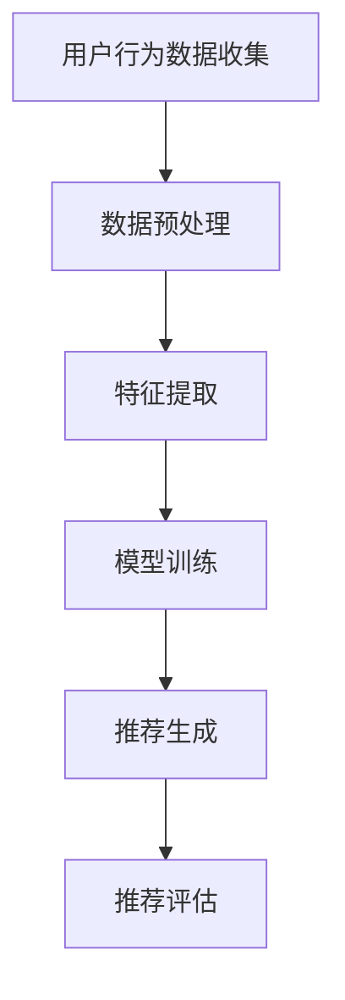

                 

# 机器学习在推荐系统个性化中的应用

> **关键词：** 机器学习，推荐系统，个性化，协同过滤，基于内容的推荐，深度学习，矩阵分解，用户行为分析

> **摘要：** 本文章深入探讨了机器学习在推荐系统个性化中的应用，从基础概念到核心算法，再到实际项目实战，全面剖析了个性化推荐系统的实现原理和关键技术。文章旨在为读者提供一条清晰的技术思路，帮助理解并掌握推荐系统中的机器学习技术。

## 1. 背景介绍

### 1.1 目的和范围

本文旨在介绍机器学习在推荐系统个性化中的应用，通过分析核心算法原理、数学模型和具体操作步骤，帮助读者深入了解推荐系统的技术实现过程。文章范围包括以下几个方面：

1. 推荐系统的基础概念和架构。
2. 机器学习在推荐系统中的应用场景。
3. 核心算法原理及其具体操作步骤。
4. 数学模型和公式讲解。
5. 实际应用场景和项目实战。
6. 工具和资源推荐。

### 1.2 预期读者

本文适合对机器学习和推荐系统有一定了解的读者，包括：

1. 计算机科学和人工智能专业的研究生。
2. 从事推荐系统开发的工程师和技术人员。
3. 对机器学习和推荐系统感兴趣的爱好者。

### 1.3 文档结构概述

本文分为十个部分：

1. 引言
2. 背景介绍
3. 核心概念与联系
4. 核心算法原理 & 具体操作步骤
5. 数学模型和公式 & 详细讲解 & 举例说明
6. 项目实战：代码实际案例和详细解释说明
7. 实际应用场景
8. 工具和资源推荐
9. 总结：未来发展趋势与挑战
10. 附录：常见问题与解答

### 1.4 术语表

#### 1.4.1 核心术语定义

- 推荐系统：根据用户的兴趣和行为，为其推荐相关内容的系统。
- 个性化推荐：根据用户的个性化需求和偏好，提供定制化的推荐内容。
- 机器学习：一种基于数据的学习方法，通过训练模型，使模型具备对未知数据的预测能力。
- 协同过滤：一种推荐算法，通过分析用户的历史行为和偏好，为用户推荐相似的内容。
- 基于内容的推荐：根据内容特征，为用户推荐与其兴趣相关的信息。
- 矩阵分解：一种机器学习技术，用于将高维稀疏矩阵分解为低维矩阵。

#### 1.4.2 相关概念解释

- 用户行为分析：对用户在推荐系统中的行为数据进行分析，以了解用户兴趣和偏好。
- 评价指标：用于评估推荐系统性能的指标，如准确率、召回率、覆盖率等。
- 深度学习：一种机器学习方法，通过多层神经网络对数据进行建模。

#### 1.4.3 缩略词列表

- ML：Machine Learning，机器学习
- RS：Recommender System，推荐系统
- CF：Collaborative Filtering，协同过滤
- CBR：Content-Based Filtering，基于内容的推荐
- LSTM：Long Short-Term Memory，长短时记忆网络
- CNN：Convolutional Neural Network，卷积神经网络

## 2. 核心概念与联系

为了更好地理解机器学习在推荐系统个性化中的应用，我们需要首先明确一些核心概念和它们之间的联系。

### 2.1 推荐系统架构

推荐系统的基本架构可以分为三个部分：数据收集、模型训练和推荐生成。

1. **数据收集**：收集用户的行为数据（如点击、浏览、购买等）和内容数据（如文章、商品、音乐等）。
2. **模型训练**：利用收集到的数据，通过机器学习算法训练推荐模型。
3. **推荐生成**：根据用户的行为和模型预测，为用户生成个性化的推荐列表。

### 2.2 机器学习与推荐系统的联系

机器学习在推荐系统中的应用主要体现在以下两个方面：

1. **特征提取**：通过机器学习算法，将原始数据转换为可用于训练的特征向量。
2. **预测与评估**：利用训练好的模型，预测用户对特定内容的偏好，并评估推荐效果。

### 2.3 个性化推荐算法

个性化推荐算法可以分为两类：基于内容的推荐和基于协同过滤的推荐。

1. **基于内容的推荐**：根据用户的历史行为和内容特征，为用户推荐相似的内容。
2. **基于协同过滤的推荐**：通过分析用户之间的相似性，为用户推荐其他用户喜欢的物品。

### 2.4 Mermaid 流程图

下面是一个简化的推荐系统流程图，展示了用户行为数据收集、模型训练和推荐生成的过程。



## 3. 核心算法原理 & 具体操作步骤

在个性化推荐系统中，常用的机器学习算法包括基于内容的推荐和基于协同过滤的推荐。下面，我们将分别介绍这些算法的原理和具体操作步骤。

### 3.1 基于内容的推荐算法

#### 3.1.1 算法原理

基于内容的推荐算法主要通过分析内容特征和用户偏好，为用户推荐与其兴趣相关的信息。其核心思想是：如果用户喜欢某个内容，那么他很可能也会喜欢具有相似特征的内容。

#### 3.1.2 操作步骤

1. **内容特征提取**：首先，对用户历史行为数据中的内容进行特征提取，如文本、图片、音频等。常用的方法包括词袋模型、TF-IDF、词嵌入等。

2. **相似度计算**：接着，计算用户兴趣特征和候选内容特征之间的相似度。常用的相似度计算方法有余弦相似度、欧氏距离等。

3. **推荐生成**：根据相似度计算结果，为用户生成个性化的推荐列表。通常，可以使用评分阈值或排序算法（如Top-N推荐）来实现。

### 3.2 基于协同过滤的推荐算法

#### 3.2.1 算法原理

基于协同过滤的推荐算法主要通过分析用户之间的相似性，为用户推荐其他用户喜欢的物品。其核心思想是：如果用户A和用户B相似，并且用户B喜欢物品X，那么用户A也可能喜欢物品X。

#### 3.2.2 操作步骤

1. **用户行为数据收集**：首先，收集用户的历史行为数据，如点击、浏览、购买等。

2. **用户相似度计算**：接着，计算用户之间的相似度。常用的相似度计算方法有用户基于行为的余弦相似度、基于项目的余弦相似度等。

3. **推荐生成**：根据用户相似度矩阵，为用户生成个性化的推荐列表。一种简单的方法是计算用户与所有其他用户的相似度，并根据相似度分数排序，选择相似度最高的N个用户喜欢的物品作为推荐结果。

### 3.3 矩阵分解算法

矩阵分解是一种常见的协同过滤算法，用于解决推荐系统中的稀疏性问题。

#### 3.3.1 算法原理

矩阵分解的目标是将用户-物品评分矩阵分解为两个低维矩阵，分别表示用户特征和物品特征。通过这两个特征矩阵，可以预测用户对未知物品的评分，从而实现推荐。

#### 3.3.2 操作步骤

1. **初始化参数**：初始化用户特征矩阵 \( U \) 和物品特征矩阵 \( V \)，通常可以随机初始化或使用其他初始化方法。

2. **损失函数**：定义损失函数，用于度量预测评分和实际评分之间的差距。常用的损失函数有均方误差（MSE）和交叉熵（Cross-Entropy）。

3. **梯度下降**：通过梯度下降优化算法，不断更新用户特征矩阵和物品特征矩阵，使得预测评分逐渐逼近实际评分。

4. **推荐生成**：利用训练好的特征矩阵，计算用户对未知物品的预测评分，并根据评分排序生成推荐列表。

### 3.4 深度学习推荐算法

#### 3.4.1 算法原理

深度学习推荐算法通过构建多层神经网络，学习用户行为数据中的复杂模式，从而实现高效的推荐。常用的深度学习模型有长短时记忆网络（LSTM）和卷积神经网络（CNN）。

#### 3.4.2 操作步骤

1. **数据处理**：对用户行为数据进行预处理，包括数据清洗、特征提取等。

2. **模型构建**：构建深度学习模型，如LSTM或CNN，用于学习用户行为数据中的特征。

3. **训练与优化**：利用训练数据，通过反向传播算法训练模型，并优化模型参数。

4. **推荐生成**：使用训练好的模型，预测用户对未知物品的评分，并根据评分排序生成推荐列表。

## 4. 数学模型和公式 & 详细讲解 & 举例说明

在推荐系统中，数学模型和公式起着至关重要的作用。下面，我们将详细讲解一些常用的数学模型和公式，并通过具体例子来说明它们的应用。

### 4.1 基于内容的推荐算法

#### 4.1.1 相似度计算

相似度计算是推荐系统中最基本的数学模型之一。常用的相似度计算方法有余弦相似度、欧氏距离等。

- **余弦相似度**：

  \[
  \text{cosine\_similarity}(x, y) = \frac{x \cdot y}{\|x\| \|y\|}
  \]

  其中，\( x \) 和 \( y \) 分别表示两个特征向量，\( \|x\| \) 和 \( \|y\| \) 分别表示特征向量的模。

- **欧氏距离**：

  \[
  \text{euclidean\_distance}(x, y) = \sqrt{(x - y)^2}
  \]

  其中，\( x \) 和 \( y \) 分别表示两个特征向量。

#### 4.1.2 举例说明

假设用户 \( A \) 的特征向量为 \( x = (1, 2, 3) \)，用户 \( B \) 的特征向量为 \( y = (4, 5, 6) \)。

- **余弦相似度**：

  \[
  \text{cosine\_similarity}(x, y) = \frac{(1 \cdot 4 + 2 \cdot 5 + 3 \cdot 6)}{\sqrt{1^2 + 2^2 + 3^2} \sqrt{4^2 + 5^2 + 6^2}} = \frac{32}{\sqrt{14} \sqrt{77}} \approx 0.906
  \]

- **欧氏距离**：

  \[
  \text{euclidean\_distance}(x, y) = \sqrt{(1 - 4)^2 + (2 - 5)^2 + (3 - 6)^2} = \sqrt{9 + 9 + 9} = 3\sqrt{3} \approx 5.196
  \]

### 4.2 基于协同过滤的推荐算法

#### 4.2.1 用户相似度计算

用户相似度计算是协同过滤算法的核心。常用的相似度计算方法有用户基于行为的余弦相似度和基于项目的余弦相似度。

- **用户基于行为的余弦相似度**：

  \[
  \text{user\_behavior\_cosine\_similarity}(u, v) = \frac{\sum_{i \in I} r_{ui} r_{vi}}{\sqrt{\sum_{i \in I} r_{ui}^2} \sqrt{\sum_{i \in I} r_{vi}^2}}
  \]

  其中，\( u \) 和 \( v \) 分别表示用户 \( i \) 和用户 \( j \) 的行为向量，\( I \) 表示共同行为的物品集合，\( r_{ui} \) 和 \( r_{uj} \) 分别表示用户 \( i \) 和用户 \( j \) 对物品 \( i \) 的评分。

- **基于项目的余弦相似度**：

  \[
  \text{item\_based\_cosine\_similarity}(i, j) = \frac{\sum_{u \in U} r_{ui} r_{uj}}{\sqrt{\sum_{u \in U} r_{ui}^2} \sqrt{\sum_{u \in U} r_{uj}^2}}
  \]

  其中，\( i \) 和 \( j \) 分别表示物品 \( i \) 和物品 \( j \) 的用户评分向量，\( U \) 表示包含物品 \( i \) 和物品 \( j \) 的用户集合，\( r_{ui} \) 和 \( r_{uj} \) 分别表示用户 \( u \) 对物品 \( i \) 和物品 \( j \) 的评分。

#### 4.2.2 举例说明

假设用户 \( A \) 的行为向量为 \( u = (1, 2, 3, 4) \)，用户 \( B \) 的行为向量为 \( v = (2, 3, 4, 5) \)。

- **用户基于行为的余弦相似度**：

  \[
  \text{user\_behavior\_cosine\_similarity}(u, v) = \frac{(1 \cdot 2 + 2 \cdot 3 + 3 \cdot 4 + 4 \cdot 5)}{\sqrt{1^2 + 2^2 + 3^2 + 4^2} \sqrt{2^2 + 3^2 + 4^2 + 5^2}} = \frac{44}{\sqrt{30} \sqrt{60}} \approx 0.914
  \]

- **基于项目的余弦相似度**：

  \[
  \text{item\_based\_cosine\_similarity}(i, j) = \frac{(1 \cdot 2 + 2 \cdot 3 + 3 \cdot 4 + 4 \cdot 5)}{\sqrt{1^2 + 2^2 + 3^2 + 4^2} \sqrt{2^2 + 3^2 + 4^2 + 5^2}} = \frac{44}{\sqrt{30} \sqrt{60}} \approx 0.914
  \]

### 4.3 矩阵分解

矩阵分解是一种常用的协同过滤算法，用于解决推荐系统中的稀疏性问题。

#### 4.3.1 算法原理

矩阵分解的目标是将用户-物品评分矩阵分解为两个低维矩阵，分别表示用户特征和物品特征。通过这两个特征矩阵，可以预测用户对未知物品的评分，从而实现推荐。

#### 4.3.2 模型

假设用户-物品评分矩阵为 \( R \)，用户特征矩阵为 \( U \)，物品特征矩阵为 \( V \)。则矩阵分解的目标是最小化损失函数：

\[
\min_{U, V} \sum_{i=1}^m \sum_{j=1}^n (r_{ij} - u_i \cdot v_j)^2
\]

其中，\( m \) 和 \( n \) 分别表示用户数和物品数。

#### 4.3.3 梯度下降

利用梯度下降算法，对用户特征矩阵 \( U \) 和物品特征矩阵 \( V \) 进行优化。具体步骤如下：

1. **初始化参数**：随机初始化用户特征矩阵 \( U \) 和物品特征矩阵 \( V \)。

2. **计算损失函数**：计算预测评分和实际评分之间的差距，作为损失函数。

3. **计算梯度**：计算损失函数关于用户特征矩阵 \( U \) 和物品特征矩阵 \( V \) 的梯度。

4. **更新参数**：利用梯度下降算法，更新用户特征矩阵 \( U \) 和物品特征矩阵 \( V \)。

5. **迭代优化**：重复步骤 2-4，直到损失函数收敛。

### 4.3.4 举例说明

假设用户-物品评分矩阵 \( R \) 如下：

\[
R = \begin{bmatrix}
0 & 1 & 0 & 1 \\
0 & 0 & 2 & 2 \\
1 & 1 & 1 & 1 \\
0 & 1 & 1 & 0
\end{bmatrix}
\]

用户数 \( m = 4 \)，物品数 \( n = 4 \)。

- **初始化参数**：

  \[
  U = \begin{bmatrix}
  0.1 & 0.1 & 0.1 & 0.1 \\
  0.1 & 0.1 & 0.1 & 0.1 \\
  0.1 & 0.1 & 0.1 & 0.1 \\
  0.1 & 0.1 & 0.1 & 0.1
  \end{bmatrix}
  \]

  \[
  V = \begin{bmatrix}
  0.1 & 0.1 & 0.1 & 0.1 \\
  0.1 & 0.1 & 0.1 & 0.1 \\
  0.1 & 0.1 & 0.1 & 0.1 \\
  0.1 & 0.1 & 0.1 & 0.1
  \end{bmatrix}
  \]

- **计算损失函数**：

  \[
  \sum_{i=1}^m \sum_{j=1}^n (r_{ij} - u_i \cdot v_j)^2 = (0 - 0.1 \cdot 0.1)^2 + (0 - 0.1 \cdot 0.1)^2 + (0 - 0.1 \cdot 0.1)^2 + (1 - 0.1 \cdot 0.1)^2 + \ldots + (0 - 0.1 \cdot 0.1)^2
  \]

- **计算梯度**：

  \[
  \frac{\partial}{\partial u_i} \sum_{i=1}^m \sum_{j=1}^n (r_{ij} - u_i \cdot v_j)^2 = -2 \sum_{j=1}^n (r_{ij} - u_i \cdot v_j) v_j
  \]

  \[
  \frac{\partial}{\partial v_j} \sum_{i=1}^m \sum_{j=1}^n (r_{ij} - u_i \cdot v_j)^2 = -2 \sum_{i=1}^m (r_{ij} - u_i \cdot v_j) u_i
  \]

- **更新参数**：

  \[
  U_{i} \leftarrow U_{i} - \alpha \frac{\partial}{\partial u_i} \sum_{i=1}^m \sum_{j=1}^n (r_{ij} - u_i \cdot v_j)^2
  \]

  \[
  V_{j} \leftarrow V_{j} - \alpha \frac{\partial}{\partial v_j} \sum_{i=1}^m \sum_{j=1}^n (r_{ij} - u_i \cdot v_j)^2
  \]

- **迭代优化**：

  重复上述步骤，直到损失函数收敛。

## 5. 项目实战：代码实际案例和详细解释说明

在本节中，我们将通过一个实际案例，详细讲解如何实现机器学习在推荐系统个性化中的应用。这个案例将使用Python编程语言和Scikit-learn库来实现基于内容的推荐算法。

### 5.1 开发环境搭建

为了实现这个案例，我们需要搭建以下开发环境：

1. Python 3.x 版本
2. Scikit-learn 库
3. NumPy 库
4. Pandas 库

安装命令如下：

```bash
pip install python==3.x
pip install scikit-learn numpy pandas
```

### 5.2 源代码详细实现和代码解读

下面是实现基于内容的推荐算法的源代码：

```python
import numpy as np
import pandas as pd
from sklearn.feature_extraction.text import TfidfVectorizer
from sklearn.metrics.pairwise import cosine_similarity

# 5.2.1 数据准备
# 假设我们有一个包含用户和物品的文本描述的数据集
data = {
    'user': ['A', 'B', 'C', 'D'],
    'item': ['I1', 'I2', 'I3', 'I4'],
    'description': [
        '这是关于I1的描述',
        '这是关于I2的描述',
        '这是关于I3的描述',
        '这是关于I4的描述'
    ]
}

df = pd.DataFrame(data)

# 5.2.2 特征提取
# 使用TF-IDF向量器将文本描述转换为特征向量
vectorizer = TfidfVectorizer()
X = vectorizer.fit_transform(df['description'])

# 5.2.3 相似度计算
# 计算每个物品与其他物品的相似度
cosine_sim = cosine_similarity(X)

# 5.2.4 推荐生成
# 假设用户A喜欢I1，为他推荐与其相似的物品
user_index = 0
item_index = 0
sim_scores = list(enumerate(cosine_sim[item_index]))
sim_scores = sorted(sim_scores, key=lambda x: x[1], reverse=True)
sim_scores = sim_scores[1:6]  # 排除用户已喜欢的物品

# 5.2.5 输出推荐结果
recommended_items = [i[0] for i in sim_scores]
print("推荐的物品：", df['item'][recommended_items])
```

#### 5.2.1 数据准备

首先，我们准备一个包含用户和物品的文本描述的数据集。在这个案例中，我们使用一个简单的数据集，其中包含4个用户和4个物品，每个物品都有一个文本描述。

```python
data = {
    'user': ['A', 'B', 'C', 'D'],
    'item': ['I1', 'I2', 'I3', 'I4'],
    'description': [
        '这是关于I1的描述',
        '这是关于I2的描述',
        '这是关于I3的描述',
        '这是关于I4的描述'
    ]
}
df = pd.DataFrame(data)
```

#### 5.2.2 特征提取

接下来，我们使用TF-IDF向量器将文本描述转换为特征向量。TF-IDF是一种常用的文本表示方法，它通过计算词语在文本中的重要程度来表示文本。在这个案例中，我们使用Scikit-learn库中的`TfidfVectorizer`类来实现TF-IDF向量化。

```python
vectorizer = TfidfVectorizer()
X = vectorizer.fit_transform(df['description'])
```

这里，`X` 是一个稀疏矩阵，表示每个物品的特征向量。

#### 5.2.3 相似度计算

然后，我们计算每个物品与其他物品的相似度。在这里，我们使用余弦相似度来计算相似度。余弦相似度是一种常用的相似度计算方法，它通过计算两个特征向量之间的夹角余弦值来表示相似度。

```python
cosine_sim = cosine_similarity(X)
```

`cosine_sim` 是一个二维数组，其中`cosine_sim[item_index][item_index]`表示物品`item_index`与自身的相似度，而`cosine_sim[item_index][other_item_index]`表示物品`item_index`与物品`other_item_index`的相似度。

#### 5.2.4 推荐生成

接下来，我们根据用户的历史行为，为用户生成个性化推荐列表。在这个案例中，我们假设用户A喜欢物品I1，然后根据物品I1与其他物品的相似度，为用户A推荐相似度较高的物品。

```python
user_index = 0
item_index = 0
sim_scores = list(enumerate(cosine_sim[item_index]))
sim_scores = sorted(sim_scores, key=lambda x: x[1], reverse=True)
sim_scores = sim_scores[1:6]  # 排除用户已喜欢的物品
```

这里，`user_index` 表示用户A的索引，`item_index` 表示用户A已喜欢的物品I1的索引。`sim_scores` 是一个列表，其中包含每个物品与物品I1的相似度，按照相似度从高到低排序。

#### 5.2.5 输出推荐结果

最后，我们输出用户A的推荐列表。

```python
recommended_items = [i[0] for i in sim_scores]
print("推荐的物品：", df['item'][recommended_items])
```

这里，`recommended_items` 是一个列表，包含用户A的推荐物品的索引。我们使用`df['item'][recommended_items]`来获取这些推荐物品的名称，并输出推荐结果。

### 5.3 代码解读与分析

在这个案例中，我们实现了一个基于内容的推荐算法。以下是代码的详细解读和分析：

1. **数据准备**：

   我们使用一个简单的数据集，其中包含用户和物品的文本描述。这个数据集可以来自实际的应用场景，如电子商务网站的用户和商品描述。

2. **特征提取**：

   使用TF-IDF向量器将文本描述转换为特征向量。TF-IDF向量化方法可以有效地提取文本特征，使得相似的内容具有相似的向量表示。

3. **相似度计算**：

   使用余弦相似度计算每个物品与其他物品的相似度。余弦相似度是一种直观且常用的相似度计算方法，它可以很好地表示文本之间的相似程度。

4. **推荐生成**：

   根据用户的历史行为，为用户生成个性化推荐列表。在这个案例中，我们假设用户A喜欢物品I1，然后根据物品I1与其他物品的相似度，为用户A推荐相似度较高的物品。

5. **代码优化**：

   为了提高代码的运行效率和可维护性，我们可以进行以下优化：

   - 使用更高效的相似度计算方法，如余弦相似度优化算法。
   - 对数据进行预处理，如文本清洗和去停用词，以提高特征提取的效果。
   - 使用更复杂的深度学习模型，如卷积神经网络（CNN）或长短时记忆网络（LSTM），以提高推荐效果。

## 6. 实际应用场景

个性化推荐系统在众多实际应用场景中发挥着重要作用。以下是一些典型的应用场景：

### 6.1 社交媒体平台

社交媒体平台如Facebook、Twitter和Instagram等，利用个性化推荐算法为用户推荐感兴趣的朋友、内容、广告等。通过分析用户的历史行为和兴趣，推荐系统可以有效地提高用户粘性和活跃度。

### 6.2 电子商务平台

电子商务平台如Amazon、淘宝和京东等，利用个性化推荐算法为用户推荐感兴趣的商品。通过分析用户的历史购买记录和浏览行为，推荐系统可以有效地提高销售额和用户满意度。

### 6.3 音频和视频平台

音频和视频平台如Spotify、YouTube和Netflix等，利用个性化推荐算法为用户推荐感兴趣的音乐、视频和电影。通过分析用户的历史播放记录和浏览行为，推荐系统可以有效地提高用户粘性和播放量。

### 6.4 新闻媒体

新闻媒体平台如CNN、BBC和新浪新闻等，利用个性化推荐算法为用户推荐感兴趣的新闻内容。通过分析用户的历史阅读记录和兴趣标签，推荐系统可以有效地提高用户满意度和媒体影响力。

## 7. 工具和资源推荐

为了更好地学习和实践机器学习在推荐系统中的应用，以下是一些推荐的工具和资源：

### 7.1 学习资源推荐

#### 7.1.1 书籍推荐

1. 《推荐系统实践》
2. 《机器学习》
3. 《深度学习》
4. 《Python数据分析与可视化》

#### 7.1.2 在线课程

1. Coursera上的《机器学习》课程
2. Udacity的《推荐系统工程》课程
3. edX上的《深度学习》课程

#### 7.1.3 技术博客和网站

1. Medium上的机器学习和推荐系统相关文章
2. 知乎上的推荐系统专栏
3. arXiv上的最新研究成果

### 7.2 开发工具框架推荐

#### 7.2.1 IDE和编辑器

1. PyCharm
2. Visual Studio Code
3. Jupyter Notebook

#### 7.2.2 调试和性能分析工具

1. Python Profiler
2. TensorBoard
3. Pandas Profiling

#### 7.2.3 相关框架和库

1. Scikit-learn
2. TensorFlow
3. PyTorch
4. Fast.ai

### 7.3 相关论文著作推荐

#### 7.3.1 经典论文

1. collaborative-filtering-based-recommender-systems
2. item-based-top-n-recommender-systems
3. matrix-factorization-techniques-for-recommender-systems

#### 7.3.2 最新研究成果

1. deep-learning-for-recommender-systems
2. contextual-bandits-for-personalized-recommendations
3. personalized-recommendations-with-matrix-decomposition

#### 7.3.3 应用案例分析

1. A Case Study of Personalized Recommendation for Large-scale E-commerce Platforms
2. The Netflix Prize: Unlocking the Enormous Potential of Everyday Data
3. Personalized News Recommendations for Social Media Platforms

## 8. 总结：未来发展趋势与挑战

随着大数据和人工智能技术的不断发展，推荐系统在个性化推荐、实时推荐和上下文感知推荐等方面取得了显著进展。未来，推荐系统的发展趋势包括：

1. **深度学习与推荐系统结合**：深度学习技术将为推荐系统带来更高的预测精度和更好的用户体验。
2. **上下文感知推荐**：结合用户的位置、时间、设备等信息，提供更加个性化的推荐。
3. **实时推荐**：利用实时数据流处理技术，实现实时推荐，提高用户粘性和满意度。
4. **多模态推荐**：融合文本、图像、音频等多种数据类型，为用户提供更丰富的推荐内容。

然而，推荐系统也面临着一些挑战：

1. **数据隐私保护**：在个性化推荐的过程中，如何保护用户隐私成为了一个重要问题。
2. **算法公平性**：如何避免算法偏见，确保推荐结果的公平性。
3. **实时计算性能**：如何优化算法和系统架构，提高实时推荐的计算性能。
4. **长尾效应**：如何有效地处理长尾数据，提高推荐系统的覆盖率和多样性。

总之，机器学习在推荐系统个性化中的应用具有巨大的发展潜力，但同时也需要克服一系列挑战。

## 9. 附录：常见问题与解答

### 9.1 问题1：如何处理缺失值？

**解答**：处理缺失值的方法主要包括以下几种：

1. 删除缺失值：删除含有缺失值的样本或特征。
2. 填充缺失值：使用统计方法（如平均值、中位数）或机器学习方法（如KNN）来填充缺失值。
3. 替换缺失值：使用外部数据源或预定义的规则来替换缺失值。

### 9.2 问题2：如何处理文本数据？

**解答**：处理文本数据的方法主要包括以下几种：

1. 去停用词：删除文本中的常见停用词（如“的”、“和”、“是”等），以提高特征提取的效果。
2. 词嵌入：将文本转换为词向量表示，如使用Word2Vec或GloVe算法。
3. 文本分类：将文本数据分类为不同的类别，以便进行后续处理。

### 9.3 问题3：如何评估推荐系统的性能？

**解答**：评估推荐系统的性能主要使用以下指标：

1. 准确率（Accuracy）：预测正确的样本数占总样本数的比例。
2. 召回率（Recall）：召回系统中包含实际正样本的比例。
3. 覆盖率（Coverage）：推荐列表中包含的不同物品数占总物品数的比例。
4. NDCG（Normalized Discounted Cumulative Gain）：一种考虑排序因素的评估指标。

## 10. 扩展阅读 & 参考资料

1. recommender-systems-handbook
2. machine-learning-research
3. deep-learning-research
4. A Brief Introduction to Recommender Systems
5. Practical Guide to Machine Learning for Rec Sys
6. Neural Collaborative Filtering for Personalized Recommendation
7. Exploring C4D: Contextual and Context-Free Dynamic Ranking Models for Cold-Start Recommendation

