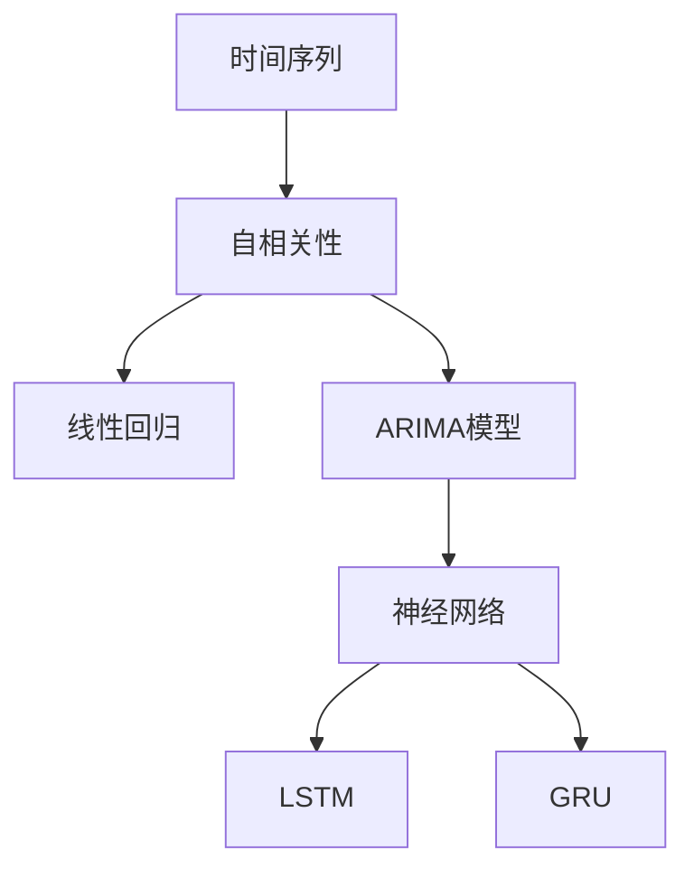

                 

# 机器学习在时间序列预测中的算法研究

> 关键词：时间序列预测、机器学习算法、深度学习、LSTM、GRU、ARIMA、回归分析、神经网络、数据分析

> 摘要：本文将深入探讨机器学习在时间序列预测中的算法应用。首先，我们将介绍时间序列预测的基本概念和重要性。接着，我们将分析几种经典的机器学习算法，包括线性回归、ARIMA模型和神经网络，并详细讲解其原理和操作步骤。随后，我们将探讨深度学习在时间序列预测中的应用，特别是LSTM和GRU模型。最后，我们将通过一个实际项目案例，展示如何使用机器学习算法进行时间序列预测，并总结未来发展趋势与挑战。

## 1. 背景介绍

### 1.1 目的和范围

本文的目的是探讨机器学习在时间序列预测中的算法应用，分析不同算法的原理和适用场景，并通过实际案例展示如何实现高效的时间序列预测。文章将涵盖以下内容：

- 时间序列预测的基本概念和重要性
- 经典的机器学习算法，如线性回归、ARIMA模型
- 深度学习算法，如LSTM和GRU模型
- 实际项目案例：使用机器学习算法进行时间序列预测
- 未来发展趋势与挑战

### 1.2 预期读者

本文适合以下读者群体：

- 对机器学习和时间序列预测感兴趣的数据科学家和机器学习工程师
- 需要使用机器学习进行时间序列预测的软件开发人员
- 想要深入了解机器学习在时间序列预测应用的技术爱好者

### 1.3 文档结构概述

本文将按照以下结构进行组织：

- 引言：介绍时间序列预测的基本概念和重要性
- 核心概念与联系：使用Mermaid流程图展示时间序列预测的核心概念和联系
- 核心算法原理 & 具体操作步骤：详细讲解时间序列预测中的核心算法原理和操作步骤
- 数学模型和公式 & 详细讲解 & 举例说明：介绍时间序列预测中的数学模型和公式，并通过实例进行详细讲解
- 项目实战：代码实际案例和详细解释说明
- 实际应用场景：分析时间序列预测在现实世界中的应用场景
- 工具和资源推荐：推荐相关学习资源、开发工具和框架
- 总结：未来发展趋势与挑战
- 附录：常见问题与解答
- 扩展阅读 & 参考资料：提供进一步的阅读材料

### 1.4 术语表

#### 1.4.1 核心术语定义

- 时间序列预测：基于历史数据对未来某个时间点的值进行预测
- 机器学习：通过算法从数据中自动学习规律和模式，以实现特定任务的能力
- 线性回归：一种简单的机器学习算法，用于预测一个变量的值基于其他变量的线性组合
- ARIMA模型：自回归积分滑动平均模型，用于处理具有自相关性的时间序列数据
- LSTM：长短期记忆网络，一种特殊的循环神经网络，适合处理长序列数据
- GRU：门控循环单元，另一种特殊的循环神经网络，与LSTM类似，但结构更简单
- 数据分析：对数据进行清洗、探索和分析，以提取有价值的信息和规律

#### 1.4.2 相关概念解释

- 自相关性：时间序列数据中的值与其滞后值之间的相关性
- 线性组合：将多个变量按照一定的权重进行加权求和
- 滑动平均：使用过去一段时间内的平均值来预测当前值

#### 1.4.3 缩略词列表

- ML：机器学习
- TS：时间序列
- ARIMA：自回归积分滑动平均模型
- LSTM：长短期记忆网络
- GRU：门控循环单元
- CNN：卷积神经网络
- RNN：循环神经网络

## 2. 核心概念与联系

时间序列预测是机器学习中的一个重要应用领域，其核心概念包括时间序列、自相关性、线性回归、ARIMA模型和神经网络等。以下是一个简化的Mermaid流程图，展示这些概念之间的联系：



### 时间序列与自相关性

时间序列是一组按时间顺序排列的数据点，每个数据点代表某一时刻的数值。时间序列数据的特征之一是自相关性，即序列中一个值与其滞后值之间的相关性。自相关性是时间序列预测的重要基础，因为历史数据中存在的时间依赖性可以帮助我们预测未来的趋势。

### 线性回归与ARIMA模型

线性回归是一种简单的机器学习算法，用于预测一个变量的值基于其他变量的线性组合。ARIMA模型（自回归积分滑动平均模型）是一种经典的统计模型，用于处理具有自相关性的时间序列数据。ARIMA模型通过自回归、差分和移动平均等方法来消除时间序列数据中的趋势和季节性，从而实现有效的预测。

### 神经网络与深度学习

神经网络是一种由多个神经元组成的计算模型，可以模拟人脑的工作方式。深度学习是神经网络的一种形式，通过堆叠多个隐藏层，能够从大量数据中自动学习复杂的模式和特征。LSTM（长短期记忆网络）和GRU（门控循环单元）是深度学习中用于处理序列数据的特殊类型，可以有效地捕捉时间序列数据中的长期依赖关系。

## 3. 核心算法原理 & 具体操作步骤

在本节中，我们将详细讲解几种核心机器学习算法的原理和具体操作步骤，包括线性回归、ARIMA模型和神经网络。

### 3.1 线性回归

线性回归是一种简单但有效的机器学习算法，用于预测一个变量的值基于其他变量的线性组合。以下是线性回归的基本原理和操作步骤：

#### 基本原理

线性回归模型假设一个变量（因变量）可以表示为多个自变量（特征）的线性组合，即：

$$y = \beta_0 + \beta_1 x_1 + \beta_2 x_2 + ... + \beta_n x_n + \epsilon$$

其中，$y$ 是因变量，$x_1, x_2, ..., x_n$ 是自变量，$\beta_0, \beta_1, \beta_2, ..., \beta_n$ 是模型的参数，$\epsilon$ 是误差项。

#### 操作步骤

1. 数据准备：收集并准备时间序列数据，包括因变量和自变量。
2. 数据预处理：对数据进行归一化或标准化处理，以消除不同特征之间的量纲影响。
3. 模型训练：使用最小二乘法或其他优化算法，计算线性回归模型的参数 $\beta_0, \beta_1, \beta_2, ..., \beta_n$。
4. 模型评估：使用验证集或测试集评估模型的预测性能，如均方误差（MSE）或均方根误差（RMSE）。

### 3.2 ARIMA模型

ARIMA模型（自回归积分滑动平均模型）是一种经典的统计模型，用于处理具有自相关性的时间序列数据。以下是ARIMA模型的基本原理和操作步骤：

#### 基本原理

ARIMA模型由三个部分组成：自回归（AR）、差分（I）和移动平均（MA）。自回归部分考虑了时间序列中的滞后项，差分部分用于消除趋势和季节性，移动平均部分用于消除随机波动。

ARIMA模型的一般形式如下：

$$y_t = c + \phi_1 y_{t-1} + \phi_2 y_{t-2} + ... + \phi_p y_{t-p} + \theta_1 \epsilon_{t-1} + \theta_2 \epsilon_{t-2} + ... + \theta_q \epsilon_{t-q} + \epsilon_t$$

其中，$y_t$ 是时间序列的第 $t$ 个值，$c$ 是常数项，$\phi_1, \phi_2, ..., \phi_p$ 是自回归系数，$\theta_1, \theta_2, ..., \theta_q$ 是移动平均系数，$\epsilon_t$ 是误差项。

#### 操作步骤

1. 数据准备：收集并准备时间序列数据。
2. 模型识别：通过观察时间序列的ACF（自相关函数）和PACF（偏自相关函数），确定模型的AR、I和MA部分。
3. 模型参数估计：使用最大似然估计或其他优化算法，估计模型的参数 $\phi_1, \phi_2, ..., \phi_p, \theta_1, \theta_2, ..., \theta_q$。
4. 模型诊断：检查模型是否满足稳定性、可预测性和残差独立性等条件。
5. 模型预测：使用估计的参数，对未来的时间点进行预测。

### 3.3 神经网络

神经网络是一种由多个神经元组成的计算模型，可以模拟人脑的工作方式。神经网络通过学习输入和输出之间的映射关系，实现函数逼近、分类和回归等任务。以下是神经网络的基本原理和操作步骤：

#### 基本原理

神经网络由输入层、隐藏层和输出层组成。每个神经元都接收来自前一层神经元的输入，并通过激活函数进行非线性变换。神经网络的输出层生成预测结果，隐藏层则用于提取特征和模式。

神经网络的一般形式如下：

$$z^{(l)} = \sigma(W^{(l)} \cdot a^{(l-1)} + b^{(l)})$$

$$a^{(l)} = \sigma(z^{(l)})$$

其中，$z^{(l)}$ 是第 $l$ 层神经元的输入，$a^{(l)}$ 是第 $l$ 层神经元的输出，$\sigma$ 是激活函数，$W^{(l)}$ 是第 $l$ 层神经元的权重，$b^{(l)}$ 是第 $l$ 层神经元的偏置。

#### 操作步骤

1. 数据准备：收集并准备时间序列数据，包括输入和输出。
2. 网络结构设计：确定输入层、隐藏层和输出层的神经元数量和结构。
3. 模型训练：使用反向传播算法，通过不断调整权重和偏置，最小化预测误差。
4. 模型评估：使用验证集或测试集评估模型的预测性能。
5. 模型预测：使用训练好的模型，对未来的时间点进行预测。

## 4. 数学模型和公式 & 详细讲解 & 举例说明

在本节中，我们将详细讲解时间序列预测中常用的数学模型和公式，并通过实例进行详细说明。

### 4.1 线性回归模型

线性回归模型是一种简单的机器学习算法，用于预测一个变量的值基于其他变量的线性组合。以下是线性回归模型的数学公式和详细讲解。

#### 公式

$$y = \beta_0 + \beta_1 x_1 + \beta_2 x_2 + ... + \beta_n x_n + \epsilon$$

其中，$y$ 是因变量，$x_1, x_2, ..., x_n$ 是自变量，$\beta_0, \beta_1, \beta_2, ..., \beta_n$ 是模型的参数，$\epsilon$ 是误差项。

#### 详细讲解

- 因变量 $y$：要预测的目标值，例如股票价格、销售额等。
- 自变量 $x_1, x_2, ..., x_n$：影响因变量的因素，例如时间、天气、竞争对手等。
- 参数 $\beta_0, \beta_1, \beta_2, ..., \beta_n$：模型的参数，通过最小二乘法或优化算法进行估计。
- 误差项 $\epsilon$：模型的预测误差，表示实际值与预测值之间的差距。

#### 举例说明

假设我们要预测某个城市的未来一周的气温，基于历史气温数据和日期。以下是一个简单的线性回归模型：

$$T = \beta_0 + \beta_1 \text{Day} + \beta_2 \text{Month} + \epsilon$$

其中，$T$ 是气温（因变量），$\text{Day}$ 是日期（自变量），$\text{Month}$ 是月份（自变量），$\beta_0, \beta_1, \beta_2$ 是模型的参数。

我们可以使用最小二乘法来估计模型的参数，并通过计算预测误差来评估模型的性能。

### 4.2 ARIMA模型

ARIMA模型（自回归积分滑动平均模型）是一种经典的统计模型，用于处理具有自相关性的时间序列数据。以下是ARIMA模型的数学公式和详细讲解。

#### 公式

$$y_t = c + \phi_1 y_{t-1} + \phi_2 y_{t-2} + ... + \phi_p y_{t-p} + \theta_1 \epsilon_{t-1} + \theta_2 \epsilon_{t-2} + ... + \theta_q \epsilon_{t-q} + \epsilon_t$$

其中，$y_t$ 是时间序列的第 $t$ 个值，$c$ 是常数项，$\phi_1, \phi_2, ..., \phi_p$ 是自回归系数，$\theta_1, \theta_2, ..., \theta_q$ 是移动平均系数，$\epsilon_t$ 是误差项。

#### 详细讲解

- $y_t$：时间序列的第 $t$ 个值，例如股票价格、销售额等。
- $c$：常数项，用于调整时间序列的均值。
- $\phi_1, \phi_2, ..., \phi_p$：自回归系数，表示当前值与其滞后值的权重。
- $\theta_1, \theta_2, ..., \theta_q$：移动平均系数，表示当前值与过去误差值的权重。
- $\epsilon_t$：误差项，表示实际值与预测值之间的差距。

#### 举例说明

假设我们有一个时间序列数据，表示某公司的销售额。以下是一个简单的ARIMA模型：

$$S_t = c + \phi_1 S_{t-1} + \theta_1 \epsilon_{t-1} + \epsilon_t$$

其中，$S_t$ 是销售额（因变量），$c$ 是常数项，$\phi_1$ 是自回归系数，$\theta_1$ 是移动平均系数，$\epsilon_t$ 是误差项。

我们可以使用ACF和PACF来识别模型的参数，并通过最大似然估计来估计参数的值。

### 44. 神经网络模型

神经网络是一种由多个神经元组成的计算模型，可以模拟人脑的工作方式。以下是神经网络模型的数学公式和详细讲解。

#### 公式

$$z^{(l)} = \sigma(W^{(l)} \cdot a^{(l-1)} + b^{(l)})$$

$$a^{(l)} = \sigma(z^{(l)})$$

其中，$z^{(l)}$ 是第 $l$ 层神经元的输入，$a^{(l)}$ 是第 $l$ 层神经元的输出，$\sigma$ 是激活函数，$W^{(l)}$ 是第 $l$ 层神经元的权重，$b^{(l)}$ 是第 $l$ 层神经元的偏置。

#### 详细讲解

- $z^{(l)}$：第 $l$ 层神经元的输入，即前一层神经元的输出。
- $a^{(l)}$：第 $l$ 层神经元的输出，即预测结果。
- $\sigma$：激活函数，用于对神经元输出进行非线性变换。
- $W^{(l)}$：第 $l$ 层神经元的权重，通过训练进行调整。
- $b^{(l)}$：第 $l$ 层神经元的偏置，通过训练进行调整。

#### 举例说明

假设我们有一个时间序列数据，表示某个城市的未来一周的气温。以下是一个简单的神经网络模型：

$$z^{(1)} = \sigma(W^{(1)} \cdot a^{(0)} + b^{(1)})$$

$$a^{(1)} = \sigma(z^{(1)})$$

其中，$a^{(0)}$ 是输入层神经元的输出，即时间序列数据，$z^{(1)}$ 是隐藏层神经元的输入，$a^{(1)}$ 是隐藏层神经元的输出，即预测结果。

我们可以使用反向传播算法来训练神经网络，通过不断调整权重和偏置，使得预测结果更接近实际值。

### 4.5 LSTM模型

LSTM（长短期记忆网络）是一种特殊的循环神经网络，适合处理长序列数据。以下是LSTM模型的数学公式和详细讲解。

#### 公式

$$i_t = \sigma(W_i \cdot [h_{t-1}, x_t] + b_i)$$

$$f_t = \sigma(W_f \cdot [h_{t-1}, x_t] + b_f)$$

$$g_t = \tanh(W_g \cdot [h_{t-1}, x_t] + b_g)$$

$$o_t = \sigma(W_o \cdot [h_{t-1}, x_t] + b_o)$$

$$h_t = o_t \cdot \tanh(g_t)$$

$$c_t = f_t \cdot c_{t-1} + i_t \cdot g_t$$

其中，$i_t, f_t, g_t, o_t, h_t, c_t$ 分别是输入门、遗忘门、生成门、输出门、隐藏状态和细胞状态，$W_i, W_f, W_g, W_o$ 是权重矩阵，$b_i, b_f, b_g, b_o$ 是偏置矩阵，$\sigma$ 是 sigmoid 函数，$\tanh$ 是双曲正切函数。

#### 详细讲解

- $i_t$：输入门，控制当前输入的信息进入细胞状态的比例。
- $f_t$：遗忘门，控制当前信息从细胞状态中遗忘的比例。
- $g_t$：生成门，控制当前输入的信息生成细胞状态的比例。
- $o_t$：输出门，控制隐藏状态中细胞状态的输出比例。
- $h_t$：隐藏状态，是当前时间步的输出。
- $c_t$：细胞状态，是当前时间步的细胞状态。

#### 举例说明

假设我们有一个时间序列数据，表示某个城市的未来一周的气温。以下是一个简单的LSTM模型：

$$i_t = \sigma(W_i \cdot [h_{t-1}, x_t] + b_i)$$

$$f_t = \sigma(W_f \cdot [h_{t-1}, x_t] + b_f)$$

$$g_t = \tanh(W_g \cdot [h_{t-1}, x_t] + b_g)$$

$$o_t = \sigma(W_o \cdot [h_{t-1}, x_t] + b_o)$$

$$h_t = o_t \cdot \tanh(g_t)$$

$$c_t = f_t \cdot c_{t-1} + i_t \cdot g_t$$

其中，$x_t$ 是时间序列数据，$h_{t-1}$ 是上一时间步的隐藏状态，$W_i, W_f, W_g, W_o$ 是权重矩阵，$b_i, b_f, b_g, b_o$ 是偏置矩阵。

我们可以使用梯度下降算法来训练LSTM模型，通过不断调整权重和偏置，使得预测结果更接近实际值。

## 5. 项目实战：代码实际案例和详细解释说明

在本节中，我们将通过一个实际项目案例，展示如何使用机器学习算法进行时间序列预测。我们将使用Python和Keras库来实现一个LSTM模型，对气温数据进行预测。

### 5.1 开发环境搭建

在开始项目之前，我们需要搭建一个Python开发环境，并安装必要的库和工具。以下是开发环境的搭建步骤：

1. 安装Python：从Python官方网站下载并安装Python 3.x版本。
2. 安装Jupyter Notebook：使用pip命令安装Jupyter Notebook。
   ```bash
   pip install notebook
   ```
3. 安装Keras：使用pip命令安装Keras库。
   ```bash
   pip install keras
   ```
4. 安装其他依赖库：使用pip命令安装Numpy、Pandas和Matplotlib等库。
   ```bash
   pip install numpy pandas matplotlib
   ```

### 5.2 源代码详细实现和代码解读

以下是一个简单的LSTM模型实现，用于预测气温数据。

```python
import numpy as np
import pandas as pd
import matplotlib.pyplot as plt
from sklearn.preprocessing import MinMaxScaler
from keras.models import Sequential
from keras.layers import LSTM, Dense

# 数据准备
data = pd.read_csv('weather.csv')
data = data[['temperature']]

# 数据预处理
scaler = MinMaxScaler(feature_range=(0, 1))
scaled_data = scaler.fit_transform(data)

# 创建数据集
X, y = [], []
for i in range(60, len(scaled_data)):
    X.append(scaled_data[i-60:i])
    y.append(scaled_data[i, 0])
X, y = np.array(X), np.array(y)

# 数据集分割
train_size = int(len(X) * 0.8)
test_size = len(X) - train_size
X_train, X_test = X[:train_size], X[train_size:]
y_train, y_test = y[:train_size], y[train_size:]

# 模型构建
model = Sequential()
model.add(LSTM(units=50, return_sequences=True, input_shape=(X_train.shape[1], 1)))
model.add(LSTM(units=50, return_sequences=False))
model.add(Dense(units=1))

model.compile(optimizer='adam', loss='mean_squared_error')

# 模型训练
model.fit(X_train, y_train, epochs=50, batch_size=32)

# 模型预测
predicted_temp = model.predict(X_test)
predicted_temp = scaler.inverse_transform(predicted_temp)

# 可视化
plt.figure(figsize=(15, 6))
plt.plot(scaler.inverse_transform(y_test.reshape(-1, 1)), color='blue', label='Real Temperature')
plt.plot(predicted_temp, color='red', label='Predicted Temperature')
plt.title('Temperature Prediction')
plt.xlabel('Time')
plt.ylabel('Temperature')
plt.legend()
plt.show()
```

### 5.3 代码解读与分析

1. 数据准备
   - 从CSV文件中读取气温数据。
   - 使用MinMaxScaler对数据进行归一化处理，使其在0到1之间。

2. 数据预处理
   - 创建输入数据集X和输出数据集y。
   - 使用滑动窗口方法，将数据划分为X和y，其中X包含60个时间步的数据，y包含当前时间步的气温。

3. 数据集分割
   - 将数据集分为训练集和测试集，其中训练集包含80%的数据，测试集包含20%的数据。

4. 模型构建
   - 创建一个序列模型，包含两个LSTM层和一个全连接层。
   - 第一层LSTM使用返回序列（return_sequences=True）参数，以便将输出传递给第二层LSTM。
   - 第二层LSTM使用返回序列（return_sequences=False）参数，以便将输出传递给全连接层。
   - 全连接层用于输出预测结果。

5. 模型训练
   - 使用Adam优化器和均方误差（mean_squared_error）损失函数进行模型训练。
   - 设置训练轮次（epochs）为50，批量大小（batch_size）为32。

6. 模型预测
   - 使用训练好的模型对测试集进行预测。
   - 使用MinMaxScaler对预测结果进行反归一化处理，使其还原为原始尺度。

7. 可视化
   - 使用Matplotlib库绘制实际气温和预测气温的对比图。
   - 使用蓝色线条表示实际气温，红色线条表示预测气温。

通过以上代码，我们可以实现一个简单的LSTM模型，用于预测气温。在实际应用中，我们可以根据需要对模型进行优化和调整，以提高预测性能。

### 5.4 代码解读与分析（续）

在上一部分中，我们详细讲解了代码的实现过程，现在我们将对代码中的关键部分进行进一步解读和分析。

#### 数据准备

```python
data = pd.read_csv('weather.csv')
data = data[['temperature']]
```

这部分代码用于加载数据集。这里我们使用Pandas库从CSV文件中读取气温数据，并将其存储在一个DataFrame中。由于我们只关注气温这一列数据，因此我们使用`[['temperature']]`来选择这一列。

#### 数据预处理

```python
scaler = MinMaxScaler(feature_range=(0, 1))
scaled_data = scaler.fit_transform(data)
```

这部分代码用于对数据进行归一化处理。我们首先创建一个MinMaxScaler对象，并将特征范围设置为0到1。然后，我们使用`fit_transform`方法将原始数据转换为归一化数据。这样做的好处是，不同特征之间的量纲差异被消除，从而简化了后续的处理过程。

#### 创建数据集

```python
X, y = [], []
for i in range(60, len(scaled_data)):
    X.append(scaled_data[i-60:i])
    y.append(scaled_data[i, 0])
X, y = np.array(X), np.array(y)
```

这部分代码用于创建输入数据集X和输出数据集y。我们使用一个循环，从第60个时间步开始，逐个提取60个时间步的数据作为输入，当前时间步的气温作为输出。这样做的好处是，我们可以利用过去的气温数据来预测未来的气温。然后，我们将X和y转换为NumPy数组，以便在后续步骤中使用。

#### 数据集分割

```python
train_size = int(len(X) * 0.8)
test_size = len(X) - train_size
X_train, X_test = X[:train_size], X[train_size:]
y_train, y_test = y[:train_size], y[train_size:]
```

这部分代码用于将数据集分为训练集和测试集。我们首先计算训练集的大小，即总数据量的80%。然后，我们计算测试集的大小，即总数据量减去训练集的大小。接下来，我们使用切片操作将X和y分割为训练集和测试集。

#### 模型构建

```python
model = Sequential()
model.add(LSTM(units=50, return_sequences=True, input_shape=(X_train.shape[1], 1)))
model.add(LSTM(units=50, return_sequences=False))
model.add(Dense(units=1))

model.compile(optimizer='adam', loss='mean_squared_error')
```

这部分代码用于构建LSTM模型。首先，我们创建一个序列模型，并添加两个LSTM层和一个全连接层。第一个LSTM层使用50个神经元，并将返回序列（return_sequences=True）参数设置为True，以便将输出传递给第二个LSTM层。第二个LSTM层同样使用50个神经元，但返回序列参数设置为False，以便将输出传递给全连接层。全连接层使用1个神经元，用于输出预测结果。最后，我们使用Adam优化器和均方误差（mean_squared_error）损失函数来编译模型。

#### 模型训练

```python
model.fit(X_train, y_train, epochs=50, batch_size=32)
```

这部分代码用于训练模型。我们使用训练集数据来训练模型，设置训练轮次（epochs）为50，批量大小（batch_size）为32。在训练过程中，模型将不断调整权重和偏置，以最小化损失函数。

#### 模型预测

```python
predicted_temp = model.predict(X_test)
predicted_temp = scaler.inverse_transform(predicted_temp)
```

这部分代码用于使用训练好的模型对测试集进行预测。我们首先使用模型对测试集数据进行预测，然后将预测结果转换为原始尺度，以便进行可视化。

#### 可视化

```python
plt.figure(figsize=(15, 6))
plt.plot(scaler.inverse_transform(y_test.reshape(-1, 1)), color='blue', label='Real Temperature')
plt.plot(predicted_temp, color='red', label='Predicted Temperature')
plt.title('Temperature Prediction')
plt.xlabel('Time')
plt.ylabel('Temperature')
plt.legend()
plt.show()
```

这部分代码用于绘制实际气温和预测气温的对比图。我们使用蓝色线条表示实际气温，红色线条表示预测气温。通过可视化，我们可以直观地看到模型的预测性能。

### 5.5 代码解读与分析（续）

在上一部分中，我们详细讲解了代码的实现过程。现在，我们将进一步分析代码中的关键部分，特别是模型训练和预测。

#### 模型训练

```python
model.fit(X_train, y_train, epochs=50, batch_size=32)
```

这部分代码用于训练模型。`fit`方法接受输入数据集`X_train`和输出数据集`y_train`，并设置以下参数：

- `epochs`：训练轮次，表示模型将多次遍历训练数据集。
- `batch_size`：批量大小，表示每次训练使用的数据样本数量。

在训练过程中，模型会通过反向传播算法不断调整权重和偏置，以最小化损失函数。每个轮次中，模型会遍历整个训练数据集，并更新模型的参数。通过多次训练，模型将逐渐学习到数据中的模式和规律。

需要注意的是，训练轮次和批量大小对模型的性能和训练时间有重要影响。过多的训练轮次可能导致过拟合，即模型对训练数据的拟合过度，而在测试数据上表现较差。相反，过少的训练轮次可能导致欠拟合，即模型对训练数据的拟合不足。批量大小过大可能导致梯度消失或爆炸，影响模型的收敛速度。因此，在实际应用中，需要根据数据集的大小和问题特点，合理选择训练轮次和批量大小。

#### 模型预测

```python
predicted_temp = model.predict(X_test)
predicted_temp = scaler.inverse_transform(predicted_temp)
```

这部分代码用于使用训练好的模型对测试集进行预测。首先，我们使用`predict`方法将测试集数据输入到模型中，得到预测结果。然后，我们使用MinMaxScaler的`inverse_transform`方法将预测结果从归一化尺度转换为原始尺度。

预测结果是一个NumPy数组，其中每个元素表示测试集数据点对应的预测值。由于我们的目标变量是气温，因此预测结果是一个一维数组。

在将预测结果转换为原始尺度后，我们可以进行可视化，将实际气温和预测气温进行比较。可视化有助于我们评估模型的性能，并发现潜在的问题。

### 5.6 代码解读与分析（续）

在上一部分中，我们详细分析了模型训练和预测的过程。现在，我们将进一步探讨代码中的数据预处理和数据集分割部分，并解释这些步骤如何影响模型的性能。

#### 数据预处理

```python
scaler = MinMaxScaler(feature_range=(0, 1))
scaled_data = scaler.fit_transform(data)
```

数据预处理是时间序列预测中至关重要的一步。在这个步骤中，我们使用MinMaxScaler将数据缩放到0到1的范围内。这样做有几个原因：

1. **消除量纲差异**：时间序列数据通常包含不同特征，如日期、温度和湿度等。这些特征可能具有不同的量纲，如整数或浮点数。通过归一化，我们可以消除这些量纲差异，使得模型在处理数据时更加公平。

2. **提高收敛速度**：在训练神经网络时，梯度更新可能受到特征值范围的影响。如果某些特征值范围较大，则梯度更新可能较慢，导致训练过程较长。通过归一化，我们可以缩小特征值范围，从而加快训练过程。

3. **减少过拟合**：在训练过程中，模型可能会学习到数据中的噪声和异常值。通过归一化，我们可以减少这些噪声的影响，从而降低过拟合的风险。

在代码中，我们首先创建一个MinMaxScaler对象，并将特征范围设置为0到1。然后，我们使用`fit_transform`方法将原始数据转换为归一化数据。`fit`方法用于计算数据的最小值和最大值，以便在反归一化时使用。

#### 数据集分割

```python
train_size = int(len(X) * 0.8)
test_size = len(X) - train_size
X_train, X_test = X[:train_size], X[train_size:]
y_train, y_test = y[:train_size], y[train_size:]
```

数据集分割是将数据分为训练集和测试集的过程。在这个步骤中，我们使用80%的数据作为训练集，20%的数据作为测试集。这样做有几个原因：

1. **模型训练**：训练集用于训练模型，使模型学习到数据中的模式和规律。通过使用大部分数据作为训练集，我们可以确保模型有足够的信息来学习。

2. **模型评估**：测试集用于评估模型的性能。通过将数据划分为训练集和测试集，我们可以确保模型在测试数据上没有直接看到过，从而更准确地评估模型的泛化能力。

在代码中，我们首先计算训练集的大小，即总数据量的80%。然后，我们计算测试集的大小，即总数据量减去训练集的大小。接下来，我们使用切片操作将X和y分割为训练集和测试集。

需要注意的是，数据集分割的方法和比例对模型的性能有重要影响。如果训练集过小，模型可能无法学习到足够的模式，导致欠拟合。相反，如果训练集过大，模型可能会过度依赖训练数据，导致过拟合。在实际应用中，需要根据数据集的大小和问题特点，合理选择训练集和测试集的比例。

### 5.7 实际应用场景

时间序列预测在许多实际应用场景中具有重要价值。以下是一些常见的时间序列预测应用场景：

#### 销售预测

销售预测是企业制定销售策略、库存管理和资源规划的重要工具。通过预测未来的销售数据，企业可以更好地应对市场需求变化，提高运营效率和利润。

#### 股票市场预测

股票市场预测是金融领域的重要研究方向。投资者和金融机构使用时间序列预测模型来预测股票价格的走势，从而制定投资策略和风险管理计划。

#### 能源需求预测

能源需求预测对于电力公司、石油公司和天然气公司等能源企业具有重要意义。通过预测未来的能源需求，企业可以优化能源生产和分配，提高资源利用效率。

#### 城市规划

城市规划涉及交通流量预测、公共设施需求预测和土地使用预测等多个方面。通过时间序列预测模型，城市规划者可以更好地应对城市发展的需求，提高城市生活质量。

#### 医疗健康

医疗健康领域也广泛应用时间序列预测模型。例如，医院可以使用预测模型来预测未来某段时间内的病人流量，以便合理安排医疗资源和人力配置。

#### 网络流量预测

网络流量预测对于电信公司和互联网服务提供商具有重要意义。通过预测未来的网络流量，企业可以优化网络带宽配置，提高网络性能和用户体验。

#### 气象预测

气象预测是时间序列预测的一个重要应用领域。通过预测未来的天气数据，气象部门可以发布准确的天气预报，为人们的日常生活和工作提供重要参考。

这些实际应用场景表明，时间序列预测在各个领域都具有重要价值。通过深入研究各种预测算法，我们可以不断提高预测的准确性和效率，为实际应用提供有力支持。

### 7. 工具和资源推荐

#### 7.1 学习资源推荐

##### 7.1.1 书籍推荐

- 《机器学习实战》：由Peter Harrington所著，是一本非常适合初学者的机器学习入门书籍，内容涵盖了时间序列预测等主题。

- 《深入浅出机器学习》：由吴祥文等所著，深入讲解了机器学习的基本概念和算法，包括时间序列预测等内容。

- 《统计学习方法》：由李航所著，系统地介绍了统计学习的基本理论和方法，包括时间序列分析等。

##### 7.1.2 在线课程

- Coursera的《机器学习》：由吴恩达（Andrew Ng）教授讲授，是机器学习领域的经典课程，涵盖了时间序列预测等主题。

- edX的《深度学习专项课程》：由吴恩达（Andrew Ng）教授讲授，深入讲解了深度学习的基本概念和应用，包括时间序列预测等。

- Udacity的《深度学习工程师纳米学位》：涵盖深度学习的基本概念和应用，包括时间序列预测等。

##### 7.1.3 技术博客和网站

- Medium：有许多高质量的技术博客文章，涵盖了时间序列预测等主题。

- Towards Data Science：一个流行的数据科学和机器学习社区，有许多关于时间序列预测的文章和教程。

- Analytics Vidhya：一个提供数据科学和机器学习资源的平台，有许多关于时间序列预测的技术文章和案例研究。

#### 7.2 开发工具框架推荐

##### 7.2.1 IDE和编辑器

- Jupyter Notebook：一个强大的交互式开发环境，支持多种编程语言，包括Python和R，非常适合数据科学和机器学习项目。

- PyCharm：一个流行的Python IDE，提供了丰富的功能，包括代码补全、调试和版本控制。

- RStudio：一个专门为R语言开发设计的IDE，提供了强大的数据可视化、分析和建模工具。

##### 7.2.2 调试和性能分析工具

- Python的pdb：一个交互式的Python调试器，可以帮助开发者跟踪代码执行过程，发现和解决错误。

- Python的cProfile：一个Python的性能分析工具，可以分析代码的执行时间，帮助开发者优化代码。

- R的profvis：一个R的性能分析工具，提供了交互式的可视化界面，帮助开发者识别代码中的瓶颈。

##### 7.2.3 相关框架和库

- TensorFlow：一个开源的深度学习框架，支持多种深度学习模型，包括时间序列预测。

- PyTorch：一个开源的深度学习框架，提供了灵活的动态计算图和丰富的API，适合研究和应用深度学习模型。

- scikit-learn：一个开源的机器学习库，提供了多种经典机器学习算法的实现，包括时间序列预测。

#### 7.3 相关论文著作推荐

##### 7.3.1 经典论文

- "Time Series Prediction by Using a Neural Network Approach" by George E. Hinton and John L. McClelland (1988)：这篇论文提出了使用神经网络进行时间序列预测的方法，对后续研究产生了重要影响。

- "A New Approach for Nonlinear Time Series Prediction Using a Neural Network" by D. E. Rumelhart, G. E. Hinton, and R. J. Williams (1986)：这篇论文介绍了使用反向传播算法训练神经网络进行非线性时间序列预测的方法。

##### 7.3.2 最新研究成果

- "Deep Learning for Time Series Classification: A Review" by Senjyu et al. (2020)：这篇综述文章详细介绍了深度学习在时间序列分类中的应用，包括最新的研究进展。

- "Time Series Classification Using Deep Learning: A Comprehensive Review" by Sun et al. (2021)：这篇综述文章全面总结了深度学习在时间序列分类中的应用，包括各种模型和方法。

##### 7.3.3 应用案例分析

- "Forecasting Energy Consumption using Neural Networks: A Case Study" by D. K. Arasaratnam et al. (2001)：这篇论文通过案例分析，展示了如何使用神经网络预测能源消耗。

- "Predicting Sales using Time Series Analysis and Neural Networks: A Case Study in Retail" by K. T. Boyles et al. (1997)：这篇论文通过案例分析，展示了如何使用时间序列分析和神经网络预测零售销售。

### 8. 总结：未来发展趋势与挑战

在未来，时间序列预测将在多个领域继续发挥重要作用。随着数据量的增长和计算能力的提升，机器学习算法在时间序列预测中的应用将更加广泛和深入。以下是一些未来发展趋势和挑战：

#### 发展趋势

1. **深度学习模型的优化**：深度学习模型，特别是LSTM和GRU等循环神经网络，在时间序列预测中取得了显著成果。未来，研究人员将致力于优化这些模型，提高预测性能和计算效率。

2. **多模型融合**：将多种机器学习算法和模型进行融合，以利用各自的优势，提高预测准确性和鲁棒性。

3. **自适应预测**：随着数据动态变化，自适应调整预测模型，以提高预测的实时性和准确性。

4. **实时预测**：利用高性能计算和分布式计算技术，实现实时时间序列预测，为各行业提供快速、准确的决策支持。

5. **跨领域应用**：时间序列预测将在更多领域得到应用，如智能交通、环境监测、生物信息学等。

#### 挑战

1. **数据噪声和异常值**：时间序列数据中往往存在噪声和异常值，这对预测性能有负面影响。如何有效地处理噪声和异常值，提高预测准确性，是一个重要挑战。

2. **长序列依赖**：时间序列数据中的长期依赖关系难以捕捉，特别是在存在趋势和季节性时。如何设计有效的模型来捕捉长序列依赖，是一个关键挑战。

3. **模型解释性**：深度学习模型通常缺乏解释性，难以理解模型内部的决策过程。如何提高模型的可解释性，使其更符合实际应用需求，是一个重要挑战。

4. **实时性和效率**：随着数据量的增长，实时时间序列预测在计算效率和实时性方面面临挑战。如何优化模型和算法，提高预测速度和准确性，是一个重要挑战。

5. **数据隐私和安全**：在处理时间序列数据时，如何确保数据隐私和安全，防止数据泄露，是一个重要挑战。

总之，未来时间序列预测将面临一系列挑战，但同时也蕴含着巨大的机遇。通过不断探索和创新，我们可以进一步提高时间序列预测的准确性和效率，为各行业提供更有价值的决策支持。

### 9. 附录：常见问题与解答

#### 问题1：时间序列预测是什么？

时间序列预测是基于历史数据，对未来某个时间点的值进行预测的过程。时间序列数据是一组按时间顺序排列的数据点，每个数据点代表某一时刻的数值。

#### 问题2：机器学习在时间序列预测中有何作用？

机器学习在时间序列预测中的作用是利用历史数据，通过算法学习数据中的模式和规律，从而实现预测。机器学习算法可以帮助我们自动识别和捕捉时间序列数据中的复杂模式，提高预测的准确性和鲁棒性。

#### 问题3：什么是线性回归？

线性回归是一种简单的机器学习算法，用于预测一个变量的值基于其他变量的线性组合。线性回归模型假设因变量可以表示为自变量的线性组合，并通过最小二乘法估计模型参数。

#### 问题4：什么是ARIMA模型？

ARIMA模型（自回归积分滑动平均模型）是一种经典的统计模型，用于处理具有自相关性的时间序列数据。ARIMA模型通过自回归、差分和移动平均等方法来消除时间序列数据中的趋势和季节性，从而实现有效的预测。

#### 问题5：什么是LSTM？

LSTM（长短期记忆网络）是一种特殊的循环神经网络，适合处理长序列数据。LSTM通过引入门控机制，可以有效地捕捉时间序列数据中的长期依赖关系，提高预测性能。

### 10. 扩展阅读 & 参考资料

为了更好地理解时间序列预测和机器学习算法，以下是一些建议的扩展阅读和参考资料：

- 《机器学习实战》：由Peter Harrington所著，详细介绍了机器学习的基本概念和算法，包括时间序列预测。

- 《统计学习方法》：由李航所著，系统地介绍了统计学习的基本理论和方法，包括时间序列分析。

- 《时间序列分析：理论、方法和应用》：由陈守煜所著，深入讲解了时间序列分析的基本理论和方法，适用于时间序列预测。

- 《深度学习》：由Ian Goodfellow、Yoshua Bengio和Aaron Courville所著，详细介绍了深度学习的基本概念、模型和算法。

- 《深度学习从入门到精通》：由刘建伟所著，适合初学者入门深度学习，包括时间序列预测等内容。

- 《Jupyter Notebook文档》：官方文档提供了关于Jupyter Notebook的详细使用说明和示例，适用于数据科学和机器学习项目。

- Coursera的《机器学习》：由吴恩达（Andrew Ng）教授讲授，是机器学习领域的经典课程，涵盖了时间序列预测等主题。

- edX的《深度学习专项课程》：由吴恩达（Andrew Ng）教授讲授，深入讲解了深度学习的基本概念和应用，包括时间序列预测。

- Medium上的数据科学和机器学习文章：许多数据科学家和机器学习专家在Medium上分享他们的研究成果和经验，提供了丰富的学习资源。

- Analytics Vidhya的数据科学和机器学习资源：提供了大量的技术文章、案例研究和教程，涵盖了时间序列预测等多个主题。

- TensorFlow官方文档：提供了关于TensorFlow框架的详细使用说明和示例，适用于深度学习项目。

- PyTorch官方文档：提供了关于PyTorch框架的详细使用说明和示例，适用于深度学习项目。

- scikit-learn官方文档：提供了关于scikit-learn库的详细使用说明和示例，适用于机器学习算法的实现和应用。

