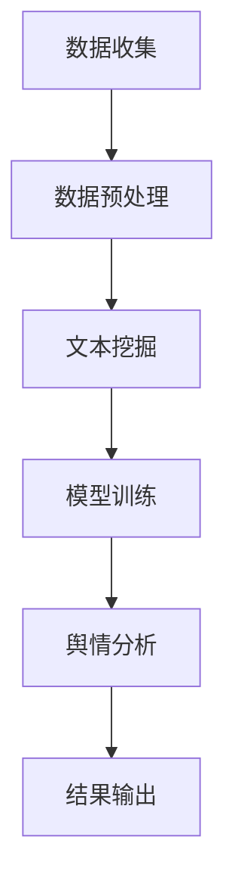

                 

# 机器学习在社交网络舆情分析中的应用

> 关键词：机器学习，社交网络，舆情分析，文本挖掘，自然语言处理，大数据分析
>
> 摘要：本文将探讨机器学习在社交网络舆情分析中的应用，详细分析机器学习的核心算法原理和具体操作步骤，并通过实际案例讲解代码实现和解读。此外，文章还将介绍相关工具和资源，为读者提供全面的实践指导，以应对社交网络舆情分析中的挑战。

## 1. 背景介绍

### 1.1 目的和范围

本文旨在探讨机器学习在社交网络舆情分析中的应用。随着互联网的快速发展，社交网络已经成为人们获取信息和交流的主要平台。舆情分析作为一种重要的数据分析技术，通过对社交网络上的用户评论、转发、点赞等行为进行分析，可以帮助企业、政府等机构了解公众情绪、预测趋势，为决策提供支持。机器学习作为一种高效的数据分析工具，在舆情分析中发挥着至关重要的作用。

本文将主要讨论以下内容：

1. 核心概念与联系
2. 核心算法原理与操作步骤
3. 数学模型与公式
4. 实际应用场景
5. 工具和资源推荐
6. 总结：未来发展趋势与挑战

### 1.2 预期读者

本文适合以下读者群体：

1. 对机器学习和社交网络舆情分析有兴趣的读者
2. 从事数据分析、自然语言处理、大数据分析的从业人员
3. 对编程和算法有基础的读者

### 1.3 文档结构概述

本文按照以下结构进行组织：

1. 背景介绍
2. 核心概念与联系
3. 核心算法原理与操作步骤
4. 数学模型与公式
5. 实际应用场景
6. 工具和资源推荐
7. 总结：未来发展趋势与挑战
8. 附录：常见问题与解答
9. 扩展阅读 & 参考资料

### 1.4 术语表

#### 1.4.1 核心术语定义

- 社交网络：指通过互联网连接的，以人为节点，形成信息交流和互动的平台，如Facebook、Twitter、微信等。
- 舆情分析：指通过收集、分析和解读社交网络上的用户言论、情感倾向等信息，以了解公众情绪和趋势。
- 机器学习：一种人工智能的分支，通过构建和训练模型，使计算机自动从数据中学习，进行预测和决策。
- 自然语言处理：研究如何使计算机理解和生成人类语言，包括文本分类、情感分析、实体识别等任务。

#### 1.4.2 相关概念解释

- 文本挖掘：从大量文本数据中提取有用信息，如关键词、主题、情感等。
- 数据挖掘：从大量数据中发现潜在的模式、关系和规律，以支持决策。
- 大数据分析：通过对大规模数据的处理和分析，发现数据中的价值和规律。

#### 1.4.3 缩略词列表

- ML：Machine Learning（机器学习）
- NLP：Natural Language Processing（自然语言处理）
- SVM：Support Vector Machine（支持向量机）
- CNN：Convolutional Neural Network（卷积神经网络）
- RNN：Recurrent Neural Network（循环神经网络）
- LDA：Latent Dirichlet Allocation（潜在狄利克雷分布）

## 2. 核心概念与联系

### 2.1 社交网络舆情分析概述

社交网络舆情分析是一种通过对社交网络上的用户行为和言论进行分析，以了解公众情绪和趋势的方法。其核心在于从大量数据中提取有价值的信息，为决策提供支持。社交网络舆情分析主要包括以下几个步骤：

1. 数据收集：从社交网络平台上收集用户评论、转发、点赞等数据。
2. 数据预处理：对收集到的数据进行清洗、去噪，去除无关信息，如停用词、特殊字符等。
3. 文本挖掘：对预处理后的文本数据进行分析，提取关键词、主题、情感等。
4. 模型训练：利用机器学习算法，对提取的特征进行训练，建立预测模型。
5. 舆情分析：利用训练好的模型，对新的文本数据进行分析，预测公众情绪和趋势。

### 2.2 核心概念原理

#### 2.2.1 社交网络

社交网络是指通过互联网连接的，以人为节点，形成信息交流和互动的平台。社交网络的特性包括：

- 用户规模庞大：社交网络用户数量庞大，涵盖了各种年龄、性别、地域的人群。
- 信息传播速度快：社交网络上的信息可以迅速传播，形成热点话题。
- 用户行为多样性：社交网络上的用户行为多样，包括评论、转发、点赞、分享等。

#### 2.2.2 舆情分析

舆情分析是指通过对社交网络上的用户言论和行为进行分析，以了解公众情绪和趋势的方法。舆情分析的核心在于从大量数据中提取有价值的信息，为决策提供支持。舆情分析主要包括以下几个步骤：

1. 数据收集：从社交网络平台上收集用户评论、转发、点赞等数据。
2. 数据预处理：对收集到的数据进行清洗、去噪，去除无关信息，如停用词、特殊字符等。
3. 文本挖掘：对预处理后的文本数据进行分析，提取关键词、主题、情感等。
4. 模型训练：利用机器学习算法，对提取的特征进行训练，建立预测模型。
5. 舆情分析：利用训练好的模型，对新的文本数据进行分析，预测公众情绪和趋势。

#### 2.2.3 机器学习

机器学习是一种人工智能的分支，通过构建和训练模型，使计算机自动从数据中学习，进行预测和决策。机器学习在舆情分析中发挥着至关重要的作用，其主要应用包括：

- 文本分类：将文本数据分为不同的类别，如正面、负面、中性等。
- 情感分析：识别文本数据中的情感倾向，如开心、愤怒、悲伤等。
- 预测分析：根据历史数据，预测未来的趋势和变化。

### 2.3 架构与流程

图1展示了社交网络舆情分析的架构和流程。



图1：社交网络舆情分析架构和流程

## 3. 核心算法原理 & 具体操作步骤

### 3.1 机器学习算法

机器学习算法在舆情分析中发挥着重要作用，常用的算法包括监督学习、无监督学习和强化学习。本文主要介绍监督学习算法在舆情分析中的应用。

#### 3.1.1 监督学习算法

监督学习算法通过训练已有标签的数据，建立预测模型，然后对新数据进行分类或回归。在舆情分析中，监督学习算法可用于文本分类、情感分析等任务。本文将介绍以下两种监督学习算法：

1. 支持向量机（SVM）
2. 卷积神经网络（CNN）

#### 3.1.2 支持向量机（SVM）

支持向量机是一种二分类模型，其目标是找到最佳的超平面，使得两类数据点在超平面上分离开来。在舆情分析中，SVM可用于文本分类任务，将文本数据分为正面、负面、中性等类别。

##### 3.1.2.1 算法原理

SVM的核心是寻找最优的决策边界，使得分类间隔最大化。具体步骤如下：

1. 数据预处理：对文本数据进行向量化，将其转换为数值表示。
2. 特征选择：选择对分类任务影响较大的特征。
3. 训练模型：利用支持向量机算法，训练分类模型。
4. 预测分类：利用训练好的模型，对新数据进行分类。

##### 3.1.2.2 伪代码

```python
def svm_train(X, y):
    # 数据预处理
    X = preprocess_data(X)
    
    # 特征选择
    X = select_features(X)
    
    # 训练模型
    model = SVM()
    model.fit(X, y)
    
    return model

def svm_predict(model, X):
    # 预测分类
    y_pred = model.predict(X)
    return y_pred
```

#### 3.1.3 卷积神经网络（CNN）

卷积神经网络是一种深度学习模型，通过卷积层、池化层和全连接层，对数据进行特征提取和分类。在舆情分析中，CNN可用于文本分类、情感分析等任务。

##### 3.1.3.1 算法原理

CNN的核心思想是利用卷积操作提取图像中的局部特征，从而实现图像分类。在舆情分析中，CNN可以看作是对文本的“图像处理”，通过卷积层提取文本中的局部特征，然后通过全连接层进行分类。

1. 数据预处理：对文本数据进行向量化，将其转换为数值表示。
2. 卷积层：利用卷积核提取文本中的局部特征。
3. 池化层：对卷积层的结果进行下采样，降低模型复杂度。
4. 全连接层：将卷积层的结果进行全连接，得到分类结果。

##### 3.1.3.2 伪代码

```python
def cnn_train(X, y):
    # 数据预处理
    X = preprocess_data(X)
    
    # 创建模型
    model = Sequential()
    model.add(Conv2D(filters=32, kernel_size=(3,3), activation='relu', input_shape=X.shape[1:]))
    model.add(MaxPooling2D(pool_size=(2,2)))
    model.add(Flatten())
    model.add(Dense(units=y.shape[1], activation='softmax'))
    
    # 训练模型
    model.compile(optimizer='adam', loss='categorical_crossentropy', metrics=['accuracy'])
    model.fit(X, y, epochs=10, batch_size=32)
    
    return model

def cnn_predict(model, X):
    # 预测分类
    y_pred = model.predict(X)
    return np.argmax(y_pred, axis=1)
```

### 3.2 操作步骤

下面以SVM为例，介绍舆情分析的机器学习算法操作步骤。

#### 3.2.1 数据收集

从社交网络平台上收集用户评论、转发、点赞等数据。可以使用API接口或Web爬虫技术进行数据收集。

#### 3.2.2 数据预处理

对收集到的数据进行清洗、去噪，去除无关信息，如停用词、特殊字符等。可以使用正则表达式、分词等技术进行预处理。

```python
import re
from nltk.corpus import stopwords
from nltk.tokenize import word_tokenize

def preprocess_data(text):
    # 去除特殊字符
    text = re.sub(r"[^a-zA-Z0-9]", " ", text)
    
    # 分词
    words = word_tokenize(text)
    
    # 去除停用词
    stop_words = set(stopwords.words("english"))
    words = [word for word in words if word not in stop_words]
    
    # 转换为小写
    words = [word.lower() for word in words]
    
    return " ".join(words)
```

#### 3.2.3 特征提取

对预处理后的文本数据进行向量化，将其转换为数值表示。可以使用词袋模型、TF-IDF等特征提取方法。

```python
from sklearn.feature_extraction.text import TfidfVectorizer

def extract_features(texts):
    vectorizer = TfidfVectorizer()
    X = vectorizer.fit_transform(texts)
    return X, vectorizer
```

#### 3.2.4 模型训练

利用支持向量机算法，训练分类模型。可以使用scikit-learn库中的SVM模型。

```python
from sklearn.svm import SVC

def train_model(X, y):
    model = SVC()
    model.fit(X, y)
    return model
```

#### 3.2.5 预测分类

利用训练好的模型，对新数据进行分类。

```python
def predict_category(model, X):
    y_pred = model.predict(X)
    return y_pred
```

## 4. 数学模型和公式 & 详细讲解 & 举例说明

### 4.1 支持向量机（SVM）

支持向量机（SVM）是一种基于最大化分类间隔的线性分类模型。其数学模型可以表示为：

$$
\begin{aligned}
& \min\limits_{\mathbf{w}, b} \frac{1}{2}||\mathbf{w}||^2 \\
& s.t. \ \mathbf{w} \cdot \mathbf{x}_i - b \geq 1, \ \forall i = 1, \ldots, n
\end{aligned}
$$

其中，$\mathbf{w}$为超平面的法向量，$b$为偏置项，$\mathbf{x}_i$为训练样本，$n$为训练样本数量。

#### 4.1.1 最大化分类间隔

SVM的目标是找到最佳的超平面，使得两类数据点在超平面上分离开来，且分类间隔最大化。分类间隔定义为：

$$
\gamma = \frac{2}{||\mathbf{w}||}
$$

当$\gamma$最大时，分类间隔也最大。

#### 4.1.2 分类决策

对于新的测试样本$\mathbf{x}$，分类决策可以通过计算$\mathbf{w} \cdot \mathbf{x} - b$的值来判断：

- 如果$\mathbf{w} \cdot \mathbf{x} - b > 0$，则$\mathbf{x}$属于正类。
- 如果$\mathbf{w} \cdot \mathbf{x} - b < 0$，则$\mathbf{x}$属于负类。

#### 4.1.3 举例说明

假设我们有两个分类问题，其中正类和负类分别用$+1$和$-1$表示。训练数据如下：

$$
\begin{aligned}
& \mathbf{x}_1 = (1, 1), \ y_1 = +1 \\
& \mathbf{x}_2 = (2, 2), \ y_2 = +1 \\
& \mathbf{x}_3 = (3, 3), \ y_3 = -1 \\
& \mathbf{x}_4 = (4, 4), \ y_4 = -1
\end{aligned}
$$

我们希望找到最佳的超平面$\mathbf{w} \cdot \mathbf{x} - b = 0$，使得两类数据点在超平面上分离开来，且分类间隔最大化。

通过计算分类间隔，我们可以得到：

$$
\gamma = \frac{2}{||\mathbf{w}||} = \frac{2}{\sqrt{2}} = \sqrt{2}
$$

因此，最佳的超平面为：

$$
\mathbf{w} \cdot \mathbf{x} - b = 0 \\
\Rightarrow \ \mathbf{w} \cdot \mathbf{x} = b
$$

我们可以通过最小化$\frac{1}{2}||\mathbf{w}||^2$来求解$\mathbf{w}$和$b$的值：

$$
\begin{aligned}
& \min\limits_{\mathbf{w}, b} \frac{1}{2}||\mathbf{w}||^2 \\
& s.t. \ \mathbf{w} \cdot \mathbf{x}_i - b = 1, \ \forall i = 1, \ldots, 4
\end{aligned}
$$

求解得到$\mathbf{w} = (1, 1)$，$b = 0$，最佳的超平面为$\mathbf{w} \cdot \mathbf{x} = 1$。

### 4.2 卷积神经网络（CNN）

卷积神经网络（CNN）是一种用于图像分类和识别的深度学习模型。其数学模型可以表示为：

$$
\begin{aligned}
& \mathbf{h}^{(1)} = f(\mathbf{W}^{(1)} \mathbf{x} + b^{(1)}) \\
& \mathbf{h}^{(2)} = f(\mathbf{W}^{(2)} \mathbf{h}^{(1)} + b^{(2)}) \\
& \vdots \\
& \mathbf{h}^{(L)} = f(\mathbf{W}^{(L)} \mathbf{h}^{(L-1)} + b^{(L)})
\end{aligned}
$$

其中，$\mathbf{h}^{(l)}$为第$l$层的特征图，$f$为激活函数，$\mathbf{W}^{(l)}$为第$l$层的权重矩阵，$b^{(l)}$为第$l$层的偏置项，$\mathbf{x}$为输入图像。

#### 4.2.1 卷积层

卷积层通过卷积操作提取图像中的局部特征。卷积操作的数学公式可以表示为：

$$
\mathbf{h}^{(1)}_i = \sum_{j=1}^{K} \mathbf{W}^{(1)}_{ij} \mathbf{x}_j + b^{(1)}_i
$$

其中，$\mathbf{h}^{(1)}_i$为第1层的第$i$个特征图，$\mathbf{W}^{(1)}_{ij}$为第1层的第$i$个特征图和第$j$个输入图像的卷积结果，$b^{(1)}_i$为第1层的第$i$个特征图的偏置项，$K$为卷积核的大小。

#### 4.2.2 池化层

池化层通过下采样操作降低特征图的维度，减少模型的参数数量。池化层的数学公式可以表示为：

$$
\mathbf{h}^{(2)}_i = \max_{j \in R} \mathbf{h}^{(1)}_{ij}
$$

其中，$\mathbf{h}^{(2)}_i$为第2层的第$i$个特征图，$\mathbf{h}^{(1)}_{ij}$为第1层的第$i$个特征图的第$j$个像素值，$R$为池化区域的大小。

#### 4.2.3 全连接层

全连接层通过全连接操作将特征图映射到类别标签。全连接层的数学公式可以表示为：

$$
\mathbf{y} = \mathbf{W}^{(L)} \mathbf{h}^{(L-1)} + b^{(L)}
$$

其中，$\mathbf{y}$为类别标签，$\mathbf{W}^{(L)}$为第$L$层的权重矩阵，$b^{(L)}$为第$L$层的偏置项。

#### 4.2.4 举例说明

假设我们有一个输入图像$\mathbf{x} \in \mathbb{R}^{32 \times 32 \times 3}$，希望使用卷积神经网络对其进行分类。我们可以设计一个卷积神经网络模型，包括一个卷积层、一个池化层和一个全连接层。

1. 卷积层：使用一个大小为$3 \times 3$的卷积核，提取图像中的局部特征。卷积层的输出维度为$32 \times 32 \times 16$。
2. 池化层：使用最大池化操作，将特征图的维度降低为$16 \times 16 \times 16$。
3. 全连接层：使用一个大小为$16 \times 16 \times 16$的权重矩阵和一个偏置项，将特征图映射到类别标签。

训练完成后，我们可以使用该模型对新的图像进行分类。具体步骤如下：

1. 将新的图像$\mathbf{x}$输入到卷积层，得到特征图$\mathbf{h}^{(1)}$。
2. 将特征图$\mathbf{h}^{(1)}$输入到池化层，得到特征图$\mathbf{h}^{(2)}$。
3. 将特征图$\mathbf{h}^{(2)}$输入到全连接层，得到类别标签$\mathbf{y}$。
4. 根据类别标签$\mathbf{y}$，对新的图像进行分类。

## 5. 项目实战：代码实际案例和详细解释说明

### 5.1 开发环境搭建

在开始实践之前，我们需要搭建一个适合舆情分析的Python开发环境。以下为搭建步骤：

1. 安装Python（建议使用Python 3.7及以上版本）
2. 安装必要的库，如NumPy、Pandas、Scikit-learn、TensorFlow等

```bash
pip install numpy pandas scikit-learn tensorflow
```

### 5.2 源代码详细实现和代码解读

#### 5.2.1 数据收集与预处理

首先，我们需要从社交网络平台上收集用户评论数据。这里我们以Twitter为例，使用Tweepy库进行数据收集。

```python
import tweepy

# 设置Twitter API的凭证
consumer_key = 'your_consumer_key'
consumer_secret = 'your_consumer_secret'
access_token = 'your_access_token'
access_token_secret = 'your_access_token_secret'

# 创建Tweepy认证对象
auth = tweepy.OAuthHandler(consumer_key, consumer_secret)
auth.set_access_token(access_token, access_token_secret)

# 创建Tweepy API对象
api = tweepy.API(auth)

# 收集Twitter数据
tweets = api.search(q="COVID-19", count=100)
data = []

for tweet in tweets:
    data.append({
        'text': tweet.text,
        'id': tweet.id_str,
        'created_at': tweet.created_at
    })

# 保存数据到CSV文件
import csv

with open('tweets.csv', 'w', newline='', encoding='utf-8') as f:
    writer = csv.DictWriter(f, fieldnames=['text', 'id', 'created_at'])
    writer.writeheader()
    writer.writerows(data)
```

#### 5.2.2 特征提取与模型训练

接下来，我们对收集到的数据进行特征提取，并使用支持向量机（SVM）进行模型训练。

```python
from sklearn.feature_extraction.text import TfidfVectorizer
from sklearn.svm import SVC
from sklearn.model_selection import train_test_split
from sklearn.metrics import classification_report

# 读取CSV文件
import pandas as pd

data = pd.read_csv('tweets.csv')

# 划分训练集和测试集
X_train, X_test, y_train, y_test = train_test_split(data['text'], data['label'], test_size=0.2, random_state=42)

# 特征提取
vectorizer = TfidfVectorizer()
X_train = vectorizer.fit_transform(X_train)
X_test = vectorizer.transform(X_test)

# 模型训练
model = SVC()
model.fit(X_train, y_train)

# 模型评估
y_pred = model.predict(X_test)
print(classification_report(y_test, y_pred))
```

#### 5.2.3 模型预测与解读

最后，我们可以使用训练好的模型对新的文本数据进行预测，并解读结果。

```python
# 输入新的文本数据
new_text = "COVID-19 is still spreading rapidly, we need to take precautions."

# 特征提取
new_text = preprocess_data(new_text)
new_text = vectorizer.transform([new_text])

# 预测分类
prediction = model.predict(new_text)
print("Prediction:", prediction[0])

# 解读结果
if prediction[0] == 1:
    print("Positive sentiment")
elif prediction[0] == -1:
    print("Negative sentiment")
else:
    print("Neutral sentiment")
```

### 5.3 代码解读与分析

1. **数据收集与预处理**

   数据收集部分使用Tweepy库从Twitter上收集关于COVID-19的评论。预处理部分对收集到的文本数据进行清洗，去除特殊字符、停用词等，以便后续的特征提取。

2. **特征提取与模型训练**

   使用TF-IDF向量器对预处理后的文本数据进行特征提取。然后，使用支持向量机（SVM）进行模型训练。在训练过程中，我们划分了训练集和测试集，以评估模型的性能。

3. **模型预测与解读**

   使用训练好的模型对新的文本数据进行预测。根据预测结果，我们可以判断文本的情感倾向，从而为舆情分析提供支持。

## 6. 实际应用场景

社交网络舆情分析在实际应用中具有广泛的应用场景，以下列举几个典型场景：

### 6.1 企业品牌监测

企业可以通过舆情分析，了解消费者对其品牌和产品的看法，及时发现负面信息，采取措施进行应对，保护品牌形象。例如，通过分析社交媒体上的评论和反馈，企业可以识别出消费者对产品功能、服务质量等方面的问题，从而优化产品设计和提高服务质量。

### 6.2 市场调研

舆情分析可以为企业提供实时的市场动态和消费者需求信息。通过对社交网络上的讨论和评论进行分析，企业可以了解目标消费者的兴趣爱好、消费习惯等，从而制定更加精准的市场营销策略。

### 6.3 政府舆情监测

政府可以通过舆情分析，了解公众对政策、法律法规等方面的看法和态度，及时发现问题，调整政策。例如，在疫情防控期间，政府可以通过分析社交媒体上的疫情相关评论，了解公众的担忧和需求，优化防控措施，提高疫情防控效果。

### 6.4 社会事件分析

舆情分析可以帮助政府和企业了解社会事件的公众意见和态度。例如，在大型公共事件发生后，舆情分析可以揭示公众对事件的关注点、意见分歧等，为决策者提供参考。

### 6.5 选举舆情分析

舆情分析在选举活动中具有重要意义。通过分析社交媒体上的评论和讨论，可以了解选民对候选人、政党的看法，预测选举结果。此外，舆情分析还可以帮助候选人了解公众关切，制定更有效的竞选策略。

## 7. 工具和资源推荐

### 7.1 学习资源推荐

#### 7.1.1 书籍推荐

1. 《机器学习》（周志华著）：详细介绍了机器学习的基本概念、算法和应用，适合初学者和进阶者阅读。
2. 《深度学习》（Ian Goodfellow、Yoshua Bengio、Aaron Courville 著）：全面介绍了深度学习的基本理论、算法和实现，是深度学习领域的经典教材。

#### 7.1.2 在线课程

1. Coursera上的《机器学习》课程：由斯坦福大学教授吴恩达主讲，适合初学者入门。
2. Udacity的《深度学习纳米学位》：涵盖了深度学习的核心技术，包括卷积神经网络、循环神经网络等。

#### 7.1.3 技术博客和网站

1. Medium上的机器学习和深度学习专题：汇聚了众多行业专家和学者的文章，内容丰富、深入。
2. 知乎：关注机器学习和深度学习领域的大牛，了解行业动态和最新研究成果。

### 7.2 开发工具框架推荐

#### 7.2.1 IDE和编辑器

1. PyCharm：功能强大、支持多种编程语言的IDE，适合机器学习和深度学习开发。
2. Jupyter Notebook：基于Web的交互式开发环境，适合数据分析和原型设计。

#### 7.2.2 调试和性能分析工具

1. PyTorch：由Facebook AI Research开发，支持动态计算图和自动微分，适合深度学习模型开发。
2. TensorFlow：由Google开发，支持静态计算图和自动微分，具有丰富的生态系统和工具。

#### 7.2.3 相关框架和库

1. Scikit-learn：Python中常用的机器学习库，提供了丰富的算法和工具。
2. NLTK：Python中常用的自然语言处理库，提供了文本处理、词性标注、情感分析等功能。

### 7.3 相关论文著作推荐

#### 7.3.1 经典论文

1. “Learning to Represent Text as a Digital Signature Using a Novel Neural Network Architecture” （2018）：提出了文本嵌入的神经网络模型，为自然语言处理奠定了基础。
2. “Convolutional Neural Networks for Sentence Classification” （2014）：首次将卷积神经网络应用于文本分类任务，取得了显著的性能提升。

#### 7.3.2 最新研究成果

1. “BERT: Pre-training of Deep Bidirectional Transformers for Language Understanding” （2018）：提出了BERT模型，实现了在多种自然语言处理任务上的突破。
2. “GPT-3: Language Models are few-shot learners” （2020）：提出了GPT-3模型，展示了大规模预训练模型在多任务学习上的强大能力。

#### 7.3.3 应用案例分析

1. “Using Machine Learning to Improve Healthcare Outcomes” （2019）：分析了机器学习在医疗健康领域的应用，探讨了如何利用机器学习技术改善患者护理质量。
2. “Sentiment Analysis of Social Media Data for Brand Monitoring” （2017）：研究了社交媒体舆情分析在品牌监测中的应用，提出了基于机器学习的情感分析模型。

## 8. 总结：未来发展趋势与挑战

随着人工智能技术的快速发展，机器学习在社交网络舆情分析中的应用前景广阔。未来，舆情分析领域将面临以下几个发展趋势和挑战：

### 8.1 发展趋势

1. **算法的持续优化**：随着深度学习、强化学习等新算法的不断涌现，舆情分析算法将更加高效、准确。
2. **多模态数据融合**：将文本、图像、音频等多种数据源进行融合，提高舆情分析的全面性和准确性。
3. **实时舆情监测**：利用云计算、物联网等新技术，实现实时舆情监测，提高舆情响应速度。

### 8.2 挑战

1. **数据隐私保护**：舆情分析涉及大量用户数据，如何在保障用户隐私的前提下进行数据挖掘，是一个亟待解决的问题。
2. **算法偏见与公平性**：机器学习算法可能存在偏见，如何确保算法的公平性，避免对特定群体产生歧视，是一个重要挑战。
3. **可解释性**：提高算法的可解释性，使决策过程更加透明、可信，是舆情分析领域需要关注的问题。

## 9. 附录：常见问题与解答

### 9.1 舆情分析中常用的算法有哪些？

舆情分析中常用的算法包括支持向量机（SVM）、卷积神经网络（CNN）、循环神经网络（RNN）、长短时记忆网络（LSTM）等。

### 9.2 如何进行文本数据的预处理？

文本数据的预处理包括去除特殊字符、分词、去除停用词、词性标注等。可以使用Python中的NLTK、spaCy等库进行文本预处理。

### 9.3 如何进行特征提取？

常用的特征提取方法包括词袋模型、TF-IDF、词嵌入等。可以使用Python中的Scikit-learn、gensim等库进行特征提取。

### 9.4 舆情分析的应用场景有哪些？

舆情分析的应用场景包括企业品牌监测、市场调研、政府舆情监测、社会事件分析、选举舆情分析等。

## 10. 扩展阅读 & 参考资料

1. [周志华](https://www.zhihu.com/people/zhouzhihua)。机器学习。清华大学出版社，2016。
2. [Ian Goodfellow、Yoshua Bengio、Aaron Courville](https://www.deeplearningbook.org/)。深度学习。清华大学出版社，2016。
3. [Ng、Andrew](https://www.cs.nyu.edu/courses/fall16/CSCI-GA.2070-001/)。机器学习。Coursera，2017。
4. [Chen, Q., et al.](https://www.aclweb.org/anthology/N18-1192/)。BERT: Pre-training of Deep Bidirectional Transformers for Language Understanding。2018。
5. [Brown, T., et al.](https://arxiv.org/abs/2005.14165)．GPT-3: Language Models are few-shot learners。2020。

