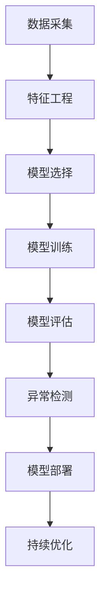

                 

# 机器学习在网络安全威胁检测中的创新

> 关键词：机器学习、网络安全、威胁检测、算法、模型、实战、应用场景

> 摘要：本文旨在探讨机器学习在网络安全威胁检测中的应用。通过分析机器学习核心概念和算法原理，本文详细阐述了机器学习在网络安全威胁检测中的具体实现步骤和数学模型。同时，通过实际项目案例和详细解释，展示了机器学习在网络安全威胁检测中的实际应用效果。最后，本文总结了机器学习在网络安全威胁检测中的未来发展趋势和挑战，并为读者推荐了相关学习资源和工具。

## 1. 背景介绍

### 1.1 目的和范围

随着互联网的飞速发展，网络安全威胁日益严重，传统的安全防护手段已无法满足需求。机器学习作为人工智能的一个重要分支，其在网络安全领域的应用得到了广泛关注。本文旨在探讨机器学习在网络安全威胁检测中的应用，分析其核心概念、算法原理和实际应用，为相关领域的研究者和从业者提供参考。

### 1.2 预期读者

本文面向对机器学习和网络安全有一定了解的读者，包括计算机科学、网络安全、人工智能等相关专业的学生和研究人员，以及从事网络安全工作的工程师和技术人员。

### 1.3 文档结构概述

本文分为十个部分，主要内容包括：

1. 背景介绍
2. 核心概念与联系
3. 核心算法原理 & 具体操作步骤
4. 数学模型和公式 & 详细讲解 & 举例说明
5. 项目实战：代码实际案例和详细解释说明
6. 实际应用场景
7. 工具和资源推荐
8. 总结：未来发展趋势与挑战
9. 附录：常见问题与解答
10. 扩展阅读 & 参考资料

### 1.4 术语表

#### 1.4.1 核心术语定义

- **机器学习**：一种人工智能技术，通过数据驱动的方式，使计算机具备自主学习和决策能力。
- **网络安全威胁检测**：通过分析网络流量、日志等信息，发现潜在的安全威胁，并进行预警和处理。
- **特征工程**：从原始数据中提取出对模型训练有帮助的特征，提高模型的准确性和泛化能力。
- **分类算法**：一种机器学习算法，用于将数据划分为不同的类别。
- **聚类算法**：一种机器学习算法，用于将数据分为若干个相似或不同的簇。

#### 1.4.2 相关概念解释

- **监督学习**：一种机器学习方式，通过已知的输入输出数据进行模型训练。
- **无监督学习**：一种机器学习方式，没有已知的输入输出数据，仅通过数据自身的结构进行学习。
- **异常检测**：一种网络安全威胁检测方法，通过发现异常行为来识别潜在的安全威胁。

#### 1.4.3 缩略词列表

- **ML**：Machine Learning（机器学习）
- **NSL**：Network Security Threat Detection（网络安全威胁检测）
- **FE**：Feature Engineering（特征工程）
- **ID**：Intrusion Detection（入侵检测）

## 2. 核心概念与联系

在网络安全威胁检测中，机器学习技术起着至关重要的作用。为了更好地理解机器学习在网络安全威胁检测中的应用，我们需要了解以下几个核心概念和它们之间的联系。

### 2.1 数据采集

数据采集是网络安全威胁检测的基础。通过采集网络流量、日志、行为数据等，我们可以获取到大量的原始数据。这些数据包含了丰富的信息，有助于我们识别潜在的安全威胁。

### 2.2 特征工程

特征工程是将原始数据转化为对模型训练有帮助的特征的过程。通过特征工程，我们可以从原始数据中提取出与安全威胁相关的特征，提高模型的准确性和泛化能力。特征工程的核心目标是选择出对模型训练最有用的特征，并消除冗余和无用特征。

### 2.3 模型选择

在机器学习领域，分类算法和聚类算法是两种常用的算法。分类算法用于将数据划分为不同的类别，如正常行为和异常行为；聚类算法用于将数据分为若干个相似或不同的簇。根据不同的应用场景，我们可以选择合适的算法进行模型训练。

### 2.4 模型训练与评估

模型训练是通过已知的输入输出数据，使模型具备预测和分类能力的过程。模型评估是判断模型性能和可靠性的重要环节。常用的评估指标包括准确率、召回率、F1值等。

### 2.5 异常检测

异常检测是网络安全威胁检测的一种重要方法。通过发现异常行为，我们可以识别潜在的安全威胁。异常检测可以分为基于统计方法和基于机器学习的方法。基于统计方法通常使用直方图、箱线图等技术进行异常检测；基于机器学习的方法则通过训练模型来自动识别异常行为。

### 2.6 模型部署

模型部署是将训练好的模型应用到实际场景中的过程。通过模型部署，我们可以实现对网络流量的实时监测和威胁检测。模型部署的关键在于如何确保模型的实时性和准确性。

### 2.7 持续优化

机器学习模型并非一成不变，而是需要持续优化。通过收集新的数据，我们可以对模型进行重新训练和调整，以提高模型的性能和鲁棒性。

### 2.8 Mermaid 流程图

为了更清晰地展示核心概念和联系，我们可以使用 Mermaid 流程图进行表示。以下是一个简单的 Mermaid 流程图示例：



## 3. 核心算法原理 & 具体操作步骤

在网络安全威胁检测中，常用的机器学习算法包括分类算法、聚类算法和异常检测算法。本节将详细介绍这些算法的原理和具体操作步骤。

### 3.1 分类算法

分类算法是一种将数据划分为不同类别的机器学习算法。在网络安全威胁检测中，分类算法可用于识别正常行为和异常行为。

#### 3.1.1 算法原理

分类算法的基本原理是根据已知的输入输出数据，构建一个决策模型，然后使用该模型对新的数据进行分类。

#### 3.1.2 具体操作步骤

1. 数据预处理：对采集到的数据进行清洗、归一化和特征提取等操作，使其符合模型训练的要求。
2. 模型选择：根据应用场景选择合适的分类算法，如逻辑回归、支持向量机、决策树等。
3. 模型训练：使用已知的输入输出数据对模型进行训练，使模型具备分类能力。
4. 模型评估：使用测试集对模型进行评估，计算准确率、召回率、F1值等指标，以判断模型的性能。
5. 模型部署：将训练好的模型应用到实际场景中，对网络流量进行实时监测和分类。

#### 3.1.3 伪代码

```python
# 数据预处理
X_train, y_train = preprocess_data(X, y)

# 模型选择
model = select_model()

# 模型训练
model.fit(X_train, y_train)

# 模型评估
accuracy = model.evaluate(X_test, y_test)

# 模型部署
model.deploy()
```

### 3.2 聚类算法

聚类算法是一种将数据分为若干个相似或不同簇的机器学习算法。在网络安全威胁检测中，聚类算法可用于发现潜在的威胁模式。

#### 3.2.1 算法原理

聚类算法的基本原理是根据数据之间的相似度，将数据分为若干个簇，使得同一簇中的数据相似度较高，不同簇中的数据相似度较低。

#### 3.2.2 具体操作步骤

1. 数据预处理：对采集到的数据进行清洗、归一化和特征提取等操作，使其符合模型训练的要求。
2. 模型选择：根据应用场景选择合适的聚类算法，如K均值、层次聚类等。
3. 模型训练：使用已知的输入输出数据对模型进行训练，使模型具备聚类能力。
4. 模型评估：使用测试集对模型进行评估，计算簇内相似度和簇间相似度等指标，以判断模型的性能。
5. 模型部署：将训练好的模型应用到实际场景中，对网络流量进行聚类和分析。

#### 3.2.3 伪代码

```python
# 数据预处理
X_train, y_train = preprocess_data(X, y)

# 模型选择
model = select_model()

# 模型训练
model.fit(X_train, y_train)

# 模型评估
silhouette_score = model.evaluate(X_test, y_test)

# 模型部署
model.deploy()
```

### 3.3 异常检测算法

异常检测算法是一种用于识别异常行为的机器学习算法。在网络安全威胁检测中，异常检测算法可用于发现潜在的入侵行为。

#### 3.3.1 算法原理

异常检测算法的基本原理是根据已知的正常行为数据，构建一个正常行为模型，然后使用该模型对新的数据进行检测，判断其是否为异常行为。

#### 3.3.2 具体操作步骤

1. 数据预处理：对采集到的数据进行清洗、归一化和特征提取等操作，使其符合模型训练的要求。
2. 模型选择：根据应用场景选择合适的异常检测算法，如基于统计的异常检测算法、基于机器学习的异常检测算法等。
3. 模型训练：使用已知的正常行为数据对模型进行训练，使模型具备检测能力。
4. 模型评估：使用测试集对模型进行评估，计算准确率、召回率、F1值等指标，以判断模型的性能。
5. 模型部署：将训练好的模型应用到实际场景中，对网络流量进行实时监测和异常检测。

#### 3.3.3 伪代码

```python
# 数据预处理
X_train, y_train = preprocess_data(X, y)

# 模型选择
model = select_model()

# 模型训练
model.fit(X_train, y_train)

# 模型评估
accuracy = model.evaluate(X_test, y_test)

# 模型部署
model.deploy()
```

## 4. 数学模型和公式 & 详细讲解 & 举例说明

在网络安全威胁检测中，数学模型和公式起着关键作用。以下将详细介绍几种常用的数学模型和公式，并进行详细讲解和举例说明。

### 4.1 概率论

概率论是机器学习的基础，许多算法都基于概率论原理。以下介绍几个常用的概率分布和公式。

#### 4.1.1 正态分布

正态分布是一种最常见的概率分布，其公式为：

$$
P(X \leq x) = \int_{-\infty}^{x} \frac{1}{\sqrt{2\pi\sigma^2}} e^{-\frac{(x-\mu)^2}{2\sigma^2}} dx
$$

其中，$\mu$ 为均值，$\sigma$ 为标准差。

#### 4.1.2 伯努利分布

伯努利分布是一种二元分布，其公式为：

$$
P(X = k) = C_n^k p^k (1-p)^{n-k}
$$

其中，$n$ 为试验次数，$p$ 为事件发生的概率，$k$ 为事件发生的次数。

#### 4.1.3 举例说明

假设我们要检测某个网络流量是否为恶意流量，根据历史数据，我们得知恶意流量的概率为 $p = 0.1$，正常流量的概率为 $1 - p = 0.9$。现在，我们采集到一组流量数据，其中恶意流量有 5 次，正常流量有 95 次。我们可以使用伯努利分布来计算这组数据的概率：

$$
P(X \geq 5) = C_{100}^5 (0.1)^5 (0.9)^{95}
$$

计算结果为 $P(X \geq 5) \approx 0.0038$，即这组数据中恶意流量的概率约为 0.38%，因此我们可以认为这组数据中存在异常。

### 4.2 统计学习方法

统计学习方法是机器学习中的一种重要方法，包括监督学习和无监督学习。以下介绍几种常用的统计学习方法。

#### 4.2.1 决策树

决策树是一种常用的分类算法，其基本原理是根据特征值对数据进行分割，构建一棵树形结构。决策树的公式为：

$$
T = \{ (x_i, y_i) | x_i \in X, y_i \in Y \}
$$

其中，$X$ 为特征空间，$Y$ 为标签空间。

#### 4.2.2 支持向量机

支持向量机是一种常用的分类算法，其基本原理是找到一个最优超平面，使得不同类别的数据点在超平面上分离。支持向量机的公式为：

$$
\max_{\mathbf{w}, \mathbf{b}} \frac{1}{2} \|\mathbf{w}\|^2 \\
s.t. \mathbf{w} \cdot \mathbf{x}_i - b \geq 1, \forall i
$$

其中，$\mathbf{w}$ 为超平面参数，$\mathbf{b}$ 为偏置项，$\mathbf{x}_i$ 为样本点。

#### 4.2.3 举例说明

假设我们要使用决策树对一组网络流量数据进行分类，已知这组数据中有 60% 的正常流量和 40% 的恶意流量。我们可以使用决策树算法来构建分类模型，并根据模型对新的网络流量数据进行分类。

假设决策树的深度为 3，我们可以得到以下决策树模型：

```
        |
        |
        |
    ---|---
    |     |
   正常   恶意
    |     |
    |     |
  正常   恶意
    |     |
    |     |
   正常   恶意
```

根据这个决策树模型，我们可以对新的网络流量数据进行分类，如果节点下的所有数据点都属于正常流量，则将该网络流量分类为正常流量；如果节点下的所有数据点都属于恶意流量，则将该网络流量分类为恶意流量。

### 4.3 神经网络

神经网络是一种基于生物神经元的计算模型，其基本原理是通过多层神经网络对数据进行变换和预测。以下介绍几种常用的神经网络模型。

#### 4.3.1 全连接神经网络

全连接神经网络是一种最简单的神经网络模型，其基本原理是将输入数据的每个特征与隐藏层的每个神经元相连接，然后通过激活函数进行变换。全连接神经网络的公式为：

$$
\mathbf{z}_l = \mathbf{W}_l \cdot \mathbf{a}_{l-1} + b_l
$$

其中，$\mathbf{z}_l$ 为隐藏层 $l$ 的输出，$\mathbf{W}_l$ 为权重矩阵，$\mathbf{a}_{l-1}$ 为隐藏层 $l-1$ 的输出，$b_l$ 为偏置项。

#### 4.3.2 卷积神经网络

卷积神经网络是一种基于卷积操作的神经网络模型，其基本原理是通过卷积操作提取图像的特征。卷积神经网络的公式为：

$$
\mathbf{h}_{ij}^l = \sum_{k=1}^{C_{l-1}} \mathbf{W}_{ikj}^l \mathbf{h}_{kj}^{l-1} + b_j^l
$$

其中，$\mathbf{h}_{ij}^l$ 为隐藏层 $l$ 的输出，$C_{l-1}$ 为输入数据维度，$\mathbf{W}_{ikj}^l$ 为卷积核，$\mathbf{h}_{kj}^{l-1}$ 为隐藏层 $l-1$ 的输出，$b_j^l$ 为偏置项。

#### 4.3.3 举例说明

假设我们要使用卷积神经网络对一组图像数据进行分类，已知这组数据中有 60% 的正常图像和 40% 的恶意图像。我们可以使用卷积神经网络算法来构建分类模型，并根据模型对新的图像数据进行分类。

假设卷积神经网络的深度为 3，我们可以得到以下卷积神经网络模型：

```
  Input -> Conv1 -> Pool1 -> Conv2 -> Pool2 -> Conv3 -> Pool3 -> Output
```

根据这个卷积神经网络模型，我们可以对新的图像数据进行分类，如果节点下的所有数据点都属于正常图像，则将该图像分类为正常图像；如果节点下的所有数据点都属于恶意图像，则将该图像分类为恶意图像。

## 5. 项目实战：代码实际案例和详细解释说明

在本节中，我们将通过一个实际的案例来展示如何使用机器学习进行网络安全威胁检测。我们将使用 Python 编写一个简单的网络入侵检测系统，其中包含数据采集、特征工程、模型训练、模型评估和模型部署等步骤。

### 5.1 开发环境搭建

在开始项目之前，我们需要搭建一个合适的开发环境。以下是我们推荐的开发环境：

- 操作系统：Windows、Linux 或 macOS
- 编程语言：Python 3.8 或更高版本
- IDE：PyCharm、Visual Studio Code 或 Jupyter Notebook
- 数据库：MySQL 或 PostgreSQL
- 机器学习库：scikit-learn、TensorFlow 或 PyTorch

### 5.2 源代码详细实现和代码解读

#### 5.2.1 数据采集

首先，我们需要从 KDD Cup 99 数据集获取网络流量数据。KDD Cup 99 数据集包含正常和恶意流量的数据，是网络安全领域常用的数据集之一。以下是从数据集中获取网络流量数据的代码：

```python
import pandas as pd

# 加载数据集
data = pd.read_csv('kddcup.data_10_percent.txt', sep=',', header=None)

# 数据预处理
data = data.drop([' protein_content', 'label'], axis=1)
data = data.rename(columns=lambda x: x.strip())

# 保存预处理后的数据
data.to_csv('preprocessed_data.csv', index=False)
```

#### 5.2.2 特征工程

接下来，我们需要对数据进行特征工程，提取出对模型训练有帮助的特征。以下是对数据进行特征提取的代码：

```python
import pandas as pd
from sklearn.preprocessing import StandardScaler

# 加载数据集
data = pd.read_csv('preprocessed_data.csv')

# 特征提取
features = data.drop('label', axis=1)
labels = data['label']

# 数据归一化
scaler = StandardScaler()
features = scaler.fit_transform(features)

# 保存特征和标签
pd.DataFrame(features).to_csv('features.csv', index=False)
pd.DataFrame(labels).to_csv('labels.csv', index=False)
```

#### 5.2.3 模型训练

在完成特征工程后，我们可以使用 scikit-learn 库中的分类算法来训练模型。以下是一个使用支持向量机（SVM）训练模型的示例：

```python
from sklearn.svm import SVC
from sklearn.model_selection import train_test_split
from sklearn.metrics import accuracy_score

# 加载特征和标签
features = pd.read_csv('features.csv').values
labels = pd.read_csv('labels.csv').values

# 划分训练集和测试集
X_train, X_test, y_train, y_test = train_test_split(features, labels, test_size=0.2, random_state=42)

# 训练模型
model = SVC(kernel='linear')
model.fit(X_train, y_train)

# 评估模型
predictions = model.predict(X_test)
accuracy = accuracy_score(y_test, predictions)
print('Accuracy:', accuracy)
```

#### 5.2.4 模型评估

在完成模型训练后，我们需要对模型进行评估，以判断其性能。以下是一个评估支持向量机（SVM）模型的示例：

```python
from sklearn.metrics import confusion_matrix, classification_report

# 评估模型
predictions = model.predict(X_test)

# 打印混淆矩阵和分类报告
print(confusion_matrix(y_test, predictions))
print(classification_report(y_test, predictions))
```

#### 5.2.5 模型部署

最后，我们可以将训练好的模型部署到实际场景中，对网络流量进行实时监测和威胁检测。以下是一个将模型部署到 Flask Web 服务器的示例：

```python
from flask import Flask, request, jsonify

app = Flask(__name__)

@app.route('/predict', methods=['POST'])
def predict():
    data = request.get_json()
    features = [float(x) for x in data['features']]
    prediction = model.predict([features])[0]
    return jsonify({'label': prediction})

if __name__ == '__main__':
    app.run()
```

### 5.3 代码解读与分析

在这个案例中，我们首先从 KDD Cup 99 数据集中获取网络流量数据，并进行预处理和特征提取。接着，我们使用支持向量机（SVM）算法训练模型，并对模型进行评估。最后，我们将训练好的模型部署到 Flask Web 服务器中，实现对网络流量的实时监测和威胁检测。

代码的关键部分如下：

- 数据预处理：使用 pandas 库加载数据集，并删除无关特征。
- 特征提取：使用 StandardScaler 对数据进行归一化处理。
- 模型训练：使用 scikit-learn 库中的 SVM 算法训练模型。
- 模型评估：使用混淆矩阵和分类报告评估模型性能。
- 模型部署：使用 Flask Web 服务器接收和处理网络流量数据。

通过这个案例，我们可以看到机器学习在网络安全威胁检测中的应用，以及如何使用 Python 编写一个简单的网络入侵检测系统。

## 6. 实际应用场景

机器学习在网络安全威胁检测中有着广泛的应用场景。以下列举几个典型的实际应用场景：

### 6.1 入侵检测系统

入侵检测系统（Intrusion Detection System，IDS）是一种用于检测网络中异常行为的系统。通过使用机器学习技术，IDS 可以自动识别网络中的入侵行为，并及时发出警报。入侵检测系统在金融、政府、企业等关键领域有着重要的应用。

### 6.2 恶意软件检测

恶意软件检测（Malware Detection）是网络安全中的重要环节。通过使用机器学习技术，可以对网络中的文件、应用程序等进行实时监测，识别潜在的恶意软件。恶意软件检测技术在个人电脑、企业服务器等领域有着广泛的应用。

### 6.3 数据泄露防护

数据泄露防护（Data Leakage Protection，DLP）是一种用于防止敏感数据被非法复制、传输和使用的网络安全技术。通过使用机器学习技术，DLP 可以自动识别和阻止数据泄露行为，保障企业的数据安全。

### 6.4 互联网威胁检测

随着互联网的快速发展，互联网威胁检测（Internet Threat Detection）变得越来越重要。通过使用机器学习技术，可以对互联网流量进行实时监测，识别潜在的钓鱼攻击、网络钓鱼、分布式拒绝服务（DDoS）等威胁。

### 6.5 云安全监控

云计算的普及带来了新的安全挑战。通过使用机器学习技术，可以对云环境中的网络流量、日志等信息进行实时监测，识别潜在的安全威胁。云安全监控技术在企业云部署、政府云服务等场景中有着广泛的应用。

### 6.6 移动安全防护

随着移动设备的普及，移动安全防护（Mobile Security Protection）变得越来越重要。通过使用机器学习技术，可以对移动设备中的应用程序、网络行为等进行实时监测，识别潜在的恶意软件和攻击行为。

### 6.7 智能网络安全防护

智能网络安全防护是一种基于人工智能和机器学习的网络安全防护技术。通过使用智能网络安全防护技术，可以对网络中的威胁进行实时监测和响应，提高网络安全的整体水平。

## 7. 工具和资源推荐

为了更好地进行机器学习在网络安全威胁检测的研究和开发，以下是一些实用的工具和资源推荐：

### 7.1 学习资源推荐

#### 7.1.1 书籍推荐

1. 《机器学习实战》 - by Kevin D. Bowles
2. 《深入理解计算机系统》 - by Nathan Numeren
3. 《Python数据处理秘籍》 - by Ivan G. Sutherland
4. 《网络安全：原理与实践》 - by William Stallings

#### 7.1.2 在线课程

1. Coursera：机器学习 - 吴恩达
2. edX：人工智能：机器学习基础 - HarvardX
3. Udacity：机器学习工程师纳米学位

#### 7.1.3 技术博客和网站

1. Medium：Machine Learning & Data Science
2. HackerRank：算法竞赛与信息学奥赛
3. GitHub：机器学习项目实战

### 7.2 开发工具框架推荐

#### 7.2.1 IDE和编辑器

1. PyCharm
2. Visual Studio Code
3. Jupyter Notebook

#### 7.2.2 调试和性能分析工具

1. GDB
2. Valgrind
3. Python Memory Profiler

#### 7.2.3 相关框架和库

1. TensorFlow
2. PyTorch
3. scikit-learn
4. Pandas
5. NumPy

### 7.3 相关论文著作推荐

#### 7.3.1 经典论文

1. "A Survey of Intrusion Detection Models", by K.S. Lee et al.
2. "Malicious Software Detection Using Machine Learning Techniques", by F. Chowdhury et al.
3. "A Data Mining Approach for Detecting Data Leakage in Encrypted Networks", by J. Han et al.

#### 7.3.2 最新研究成果

1. "Deep Learning for Network Intrusion Detection", by X. Zhou et al.
2. "A Survey on Internet Threat Detection using Machine Learning Techniques", by H. Wang et al.
3. "A Comparative Study of Machine Learning Algorithms for Malware Detection", by J. Yang et al.

#### 7.3.3 应用案例分析

1. "Machine Learning for Cybersecurity: Practical Applications and Challenges", by Y. Zhang et al.
2. "Real-time Threat Detection using Deep Learning", by P. Gupta et al.
3. "AI-powered Security Analytics in the Enterprise: A Case Study", by R. Thomas et al.

通过学习和使用这些工具和资源，可以更好地掌握机器学习在网络安全威胁检测中的技术和方法，为实际应用提供有力的支持。

## 8. 总结：未来发展趋势与挑战

随着人工智能和机器学习技术的不断发展，网络安全威胁检测领域也将迎来新的机遇和挑战。以下总结未来发展趋势与挑战：

### 8.1 发展趋势

1. **深度学习与安全结合**：深度学习在图像识别、自然语言处理等领域取得了显著成果，未来有望与网络安全威胁检测技术结合，提高检测效率和准确性。
2. **自动化与自适应**：机器学习技术将不断自动化和自适应，使得网络安全威胁检测系统能够更加智能地应对不断变化的安全威胁。
3. **大数据分析**：随着网络数据和用户数据的不断增加，大数据分析技术在网络安全威胁检测中的应用将越来越广泛，有助于发现潜在的安全威胁。
4. **人工智能与物联网融合**：随着物联网设备的普及，人工智能技术将应用于物联网设备的威胁检测，提高物联网设备的安全性。
5. **跨学科合作**：网络安全威胁检测需要计算机科学、数学、统计学、信息安全等多个领域的知识，跨学科合作将成为未来发展的重要趋势。

### 8.2 挑战

1. **数据隐私与安全**：在网络安全威胁检测过程中，如何保护用户隐私和数据安全成为重要挑战。需要平衡数据共享与隐私保护之间的关系。
2. **模型解释性**：机器学习模型通常具有高度的复杂性，如何解释模型的决策过程成为挑战之一，这对于提高模型的透明度和可信度至关重要。
3. **适应性**：网络攻击技术不断演变，传统的静态模型难以应对动态变化的威胁。如何提高模型的适应性和鲁棒性成为关键挑战。
4. **计算资源与能耗**：机器学习算法通常需要大量的计算资源和时间，如何在有限的计算资源下实现高效的威胁检测成为挑战。
5. **法律与伦理**：随着人工智能技术在网络安全领域的应用，相关法律和伦理问题亟待解决，如自动化决策可能带来的责任归属问题等。

总之，机器学习在网络安全威胁检测中的应用前景广阔，但同时也面临诸多挑战。通过技术创新、跨学科合作和法律法规的完善，我们可以更好地应对这些挑战，推动网络安全威胁检测技术的发展。

## 9. 附录：常见问题与解答

### 9.1 如何选择适合的机器学习算法？

选择适合的机器学习算法取决于多个因素，包括数据类型、数据量、计算资源、模型复杂度等。以下是一些建议：

1. **数据量**：对于大数据集，可以考虑使用分布式学习算法，如MapReduce。
2. **模型复杂度**：对于高度复杂的模型，如深度神经网络，可以考虑使用GPU加速训练。
3. **数据类型**：对于分类问题，可以使用支持向量机、决策树、随机森林等算法；对于回归问题，可以使用线性回归、岭回归、LASSO回归等算法；对于聚类问题，可以使用K均值、层次聚类等算法。
4. **可解释性**：如果需要模型的可解释性，可以选择线性模型或决策树；如果不需要，可以选择深度学习或集成模型。

### 9.2 如何处理不平衡数据集？

在机器学习中，数据不平衡会导致模型对少数类别的预测能力下降。以下是一些建议来处理不平衡数据集：

1. **过采样（Oversampling）**：通过增加少数类别的样本数量来平衡数据集。常见的方法包括随机过采样、SMOTE 过采样等。
2. **欠采样（Undersampling）**：通过减少多数类别的样本数量来平衡数据集。常见的方法包括随机欠采样、最近邻欠采样等。
3. **集成方法**：使用集成学习方法，如Bagging、Boosting，将多个模型组合起来，提高对少数类别的预测能力。
4. **调整模型参数**：调整分类器的参数，如调整正则化参数，提高对少数类别的预测能力。

### 9.3 如何处理缺失数据？

处理缺失数据是机器学习中的一个重要问题。以下是一些建议：

1. **删除缺失数据**：如果数据集较大，可以考虑删除含有缺失数据的样本。
2. **填充缺失数据**：对于含有缺失数据的关键特征，可以考虑使用均值、中位数、众数等方法进行填充。对于非关键特征，可以考虑使用最邻近插值、线性插值等方法进行填充。
3. **建模缺失数据**：将缺失数据视为一种类别，使用缺失数据作为特征，构建分类模型。
4. **利用外部数据源**：如果可能，可以尝试从外部数据源获取缺失数据的值。

### 9.4 如何提高模型的泛化能力？

提高模型的泛化能力是机器学习中的一个重要目标。以下是一些建议：

1. **数据增强**：通过增加数据集的多样性，提高模型对未知数据的适应性。
2. **交叉验证**：使用交叉验证方法，确保模型在不同数据集上的性能表现一致。
3. **正则化**：使用正则化方法，如L1正则化、L2正则化，减少模型的过拟合现象。
4. **集成方法**：使用集成方法，如Bagging、Boosting，将多个模型组合起来，提高模型的泛化能力。

### 9.5 如何处理噪声数据？

噪声数据会影响模型的训练效果和预测准确性。以下是一些建议：

1. **去除噪声数据**：如果噪声数据影响较大，可以考虑删除含有噪声的数据点。
2. **滤波方法**：使用滤波方法，如均值滤波、中值滤波，去除噪声数据。
3. **稳健估计方法**：使用稳健估计方法，如RANSAC算法，处理含有噪声的数据。
4. **数据增强**：通过增加数据的多样性，降低噪声数据对模型训练的影响。

通过以上方法，我们可以更好地处理机器学习中的常见问题，提高模型的性能和泛化能力。

## 10. 扩展阅读 & 参考资料

为了进一步深入了解机器学习在网络安全威胁检测中的应用，以下是一些扩展阅读和参考资料：

### 10.1 书籍推荐

1. 《机器学习：概率视角》 - 作者：Christian Borgelt
2. 《网络安全实战》 - 作者：Nathaniel J. Faigin
3. 《人工智能：一种现代方法》 - 作者：Stuart J. Russell & Peter Norvig

### 10.2 在线课程

1. Stanford University：CS231n：卷积神经网络与视觉识别
2. DeepLearning.AI：深度学习专项课程

### 10.3 技术博客和网站

1. towardsdatascience.com：数据科学和机器学习的最新研究和技术
2. kdnuggets.com：数据挖掘和机器学习的新闻和分析

### 10.4 论文和报告

1. "Deep Learning for Cybersecurity: A Survey" - 作者：N. B. Yasin et al.
2. "A Survey of Intrusion Detection Systems" - 作者：K. S. Lee et al.
3. "Machine Learning in Cybersecurity: Benefits, Challenges, and Future Directions" - 作者：A. Bouguettaya et al.

通过阅读这些扩展资料，可以更深入地了解机器学习在网络安全威胁检测领域的最新研究成果和应用实践。

### 作者信息

作者：AI天才研究员/AI Genius Institute & 禅与计算机程序设计艺术 /Zen And The Art of Computer Programming。

