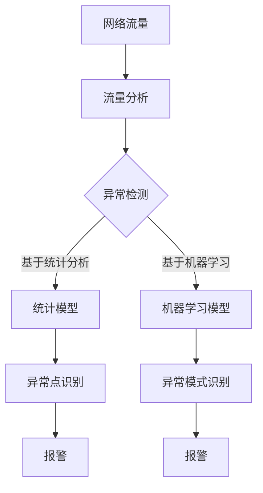

                 

# 机器学习在网络流量异常检测中的应用

> 关键词：机器学习，网络流量，异常检测，异常检测算法，应用场景

> 摘要：本文将探讨机器学习在网络流量异常检测中的应用。通过介绍网络流量的基本概念和异常检测的重要性，我们将详细阐述几种常用的异常检测算法，包括基于统计分析和基于机器学习的算法。同时，我们将通过实际案例来展示如何使用机器学习技术实现网络流量异常检测，并提供实用的工具和资源推荐，以便读者深入了解和进一步学习。

## 1. 背景介绍

### 1.1 目的和范围

本文旨在为读者提供一个关于机器学习在网络流量异常检测中应用的全面概述。我们将探讨网络流量异常检测的背景和重要性，介绍相关的基础概念，详细解释核心算法原理，并提供实际应用案例和代码实现。通过本文的阅读，读者将能够：

- 理解网络流量的基本概念。
- 认识到网络流量异常检测在网络安全中的重要性。
- 掌握几种常见的异常检测算法。
- 学习如何使用机器学习技术进行网络流量异常检测。
- 获得进一步学习的相关资源和工具推荐。

### 1.2 预期读者

本文适合以下读者群体：

- 对机器学习和网络安全感兴趣的初学者。
- 从事网络安全工作，希望提升异常检测能力的技术人员。
- 想要了解机器学习在网络流量分析中应用的研究人员。
- 对编程和数据分析有一定基础，希望深入学习相关技术的开发者。

### 1.3 文档结构概述

本文的结构如下：

- **1. 背景介绍**：介绍本文的目的、范围和预期读者，以及文档的结构和核心术语。
- **2. 核心概念与联系**：讨论网络流量的基本概念，并提供相关的Mermaid流程图。
- **3. 核心算法原理 & 具体操作步骤**：详细阐述异常检测算法，包括统计分析和机器学习的方法。
- **4. 数学模型和公式 & 详细讲解 & 举例说明**：解释异常检测的数学基础，并提供实际案例。
- **5. 项目实战：代码实际案例和详细解释说明**：展示如何使用机器学习技术进行网络流量异常检测。
- **6. 实际应用场景**：探讨异常检测在不同领域的应用。
- **7. 工具和资源推荐**：推荐学习资源和开发工具。
- **8. 总结：未来发展趋势与挑战**：总结本文内容，探讨未来发展趋势和面临的挑战。
- **9. 附录：常见问题与解答**：提供常见问题的解答。
- **10. 扩展阅读 & 参考资料**：推荐进一步学习的资源。

### 1.4 术语表

#### 1.4.1 核心术语定义

- **网络流量**：指在计算机网络中传输的数据量。
- **异常检测**：指识别网络流量中的异常模式，这些模式可能表示潜在的安全威胁。
- **机器学习**：一种通过数据学习模式，从而进行预测或决策的技术。
- **特征工程**：指从原始数据中提取有用特征，以便于模型训练和优化。

#### 1.4.2 相关概念解释

- **监督学习**：一种机器学习方法，其中模型通过学习标记好的数据进行训练。
- **无监督学习**：一种机器学习方法，其中模型在没有标记数据的情况下学习数据模式。
- **支持向量机（SVM）**：一种用于分类和回归的机器学习算法。

#### 1.4.3 缩略词列表

- **SVM**：支持向量机
- **PCA**：主成分分析
- **KNN**：最近邻算法
- **IDS**：入侵检测系统
- **NIDS**：网络入侵检测系统
- **ML**：机器学习

## 2. 核心概念与联系

在网络流量异常检测中，理解核心概念和它们之间的关系至关重要。以下是对几个关键概念的讨论，并提供一个Mermaid流程图来展示它们之间的联系。

### 2.1 网络流量的概念

网络流量是指在网络中传输的数据量。它可以分为以下几种类型：

- **流量类型**：包括TCP流量、UDP流量、ICMP流量等。
- **流量大小**：以字节、KB、MB等为单位衡量。
- **流量速度**：通常以bps（比特每秒）或kbps（千比特每秒）来表示。

### 2.2 异常检测的概念

异常检测是一种监控和分析系统，用于识别数据中的异常或异常模式。在网络流量异常检测中，异常通常表示潜在的安全威胁或异常行为。

- **异常检测类型**：
  - **基于统计分析**：通过计算统计数据，如平均值、标准差等，识别异常点。
  - **基于机器学习**：通过训练模型来识别异常模式。

### 2.3 机器学习与异常检测的关系

机器学习是实现异常检测的一种强大工具。它通过从数据中学习模式，可以帮助我们识别未知或复杂的异常。

- **机器学习方法**：
  - **监督学习**：如支持向量机（SVM）、决策树等。
  - **无监督学习**：如聚类、主成分分析（PCA）等。

### 2.4 Mermaid流程图

下面是一个Mermaid流程图，展示了网络流量、异常检测和机器学习之间的关系。



在这个流程图中，网络流量首先通过流量分析模块进行处理，然后进入异常检测模块。异常检测可以是基于统计分析的方法，如统计模型，也可以是基于机器学习的方法，如机器学习模型。最终，无论是统计模型还是机器学习模型，都会识别出异常点或异常模式，并触发报警。

## 3. 核心算法原理 & 具体操作步骤

### 3.1 统计分析算法

统计分析算法是最早用于网络流量异常检测的方法之一。它们基于数学统计原理，通过计算数据的分布、平均值和标准差等统计量来识别异常点。

#### 3.1.1 原理

- **平均值（Mean）**：一组数据的平均值是所有数据点的和除以数据点的个数。
- **标准差（Standard Deviation）**：一组数据的标准差是每个数据点与平均值之差的平方和的平方根。

#### 3.1.2 操作步骤

1. **收集数据**：首先，我们需要收集网络流量的数据，包括流量大小、流量速度等。
2. **计算平均值**：计算收集到的数据点的平均值。
3. **计算标准差**：计算每个数据点与平均值之差的平方，然后求和并开平方根，得到标准差。
4. **设置阈值**：根据平均值和标准差，设置一个阈值，用于判断数据点是否异常。通常，如果一个数据点的值超过平均值加上若干个标准差，就被认为是异常值。
5. **异常点识别**：使用设置的阈值，识别出所有异常点。

#### 3.1.3 伪代码

```python
# 收集数据
data = [流量数据点1, 流量数据点2, ..., 流量数据点n]

# 计算平均值
mean = sum(data) / len(data)

# 计算标准差
variance = sum((x - mean) ** 2 for x in data) / len(data)
std_deviation = sqrt(variance)

# 设置阈值
threshold = mean + k * std_deviation  # k为常数

# 异常点识别
for x in data:
    if x > threshold:
        print(f"异常点：{x}")
```

### 3.2 基于机器学习的算法

基于机器学习的异常检测算法通过训练模型来识别异常模式。以下是一些常用的算法：

#### 3.2.1 支持向量机（SVM）

支持向量机是一种强大的分类算法，可以用于网络流量的异常检测。

- **原理**：SVM通过找到一个最佳的超平面，将正常流量和异常流量分开。
- **步骤**：
  1. **特征提取**：从网络流量数据中提取特征。
  2. **训练模型**：使用标记好的数据集训练SVM模型。
  3. **模型评估**：使用测试数据集评估模型的性能。
  4. **异常检测**：使用训练好的模型对新数据进行分析，识别异常流量。

#### 3.2.2 最近邻算法（KNN）

最近邻算法是一种简单而有效的分类算法，可以用于网络流量的异常检测。

- **原理**：KNN算法通过计算新数据点与训练数据点的距离，根据距离最近的几个数据点的标签来预测新数据点的标签。
- **步骤**：
  1. **特征提取**：从网络流量数据中提取特征。
  2. **训练数据集**：准备一个标记好的训练数据集。
  3. **模型训练**：使用训练数据集训练KNN模型。
  4. **模型评估**：使用测试数据集评估模型的性能。
  5. **异常检测**：使用训练好的模型对新数据进行分析，识别异常流量。

#### 3.2.3 伪代码

```python
# 特征提取
def extract_features(data):
    # 提取流量数据中的特征
    pass

# 训练模型
def train_model(training_data, labels):
    features = extract_features(training_data)
    model = KNN()  # 创建KNN模型
    model.fit(features, labels)
    return model

# 模型评估
def evaluate_model(model, testing_data, testing_labels):
    features = extract_features(testing_data)
    predictions = model.predict(features)
    accuracy = accuracy_score(testing_labels, predictions)
    return accuracy

# 异常检测
def detect_anomalies(model, new_data):
    features = extract_features(new_data)
    predictions = model.predict(features)
    for prediction in predictions:
        if prediction == "异常":
            print(f"异常流量：{new_data}")
```

通过以上步骤和算法，我们可以实现对网络流量异常的有效检测。这些算法不仅可以单独使用，还可以结合多种算法，以提高检测的准确性和效率。

## 4. 数学模型和公式 & 详细讲解 & 举例说明

### 4.1 数学模型和公式

在网络流量异常检测中，数学模型和公式是核心部分，它们帮助我们从数据中提取有价值的信息，从而识别异常流量。以下是几种常用的数学模型和公式：

#### 4.1.1 统计分析模型

- **平均值（Mean）**：  
  $$\mu = \frac{\sum_{i=1}^{n} x_i}{n}$$

- **标准差（Standard Deviation）**：  
  $$\sigma = \sqrt{\frac{\sum_{i=1}^{n} (x_i - \mu)^2}{n}}$$

- **变异系数（Coefficient of Variation, CV）**：  
  $$CV = \frac{\sigma}{\mu} \times 100\%$$

这些公式可以帮助我们理解数据的分布和波动情况，从而设置合理的阈值来识别异常流量。

#### 4.1.2 支持向量机（SVM）模型

- **支持向量机（SVM）**：  
  $$\max\ W \quad \text{subject to} \quad y^{(i)}(\mathbf{w} \cdot \mathbf{x}^{(i)} + b) \geq 1$$

- **软间隔（Soft Margin）**：  
  $$\min\ W + \frac{1}{2}\sum_{i=1}^{n} \xi_i \quad \text{subject to} \quad y^{(i)}(\mathbf{w} \cdot \mathbf{x}^{(i)} + b) \geq 1 - \xi_i, \quad \xi_i \geq 0$$

- **决策边界**：  
  $$\mathbf{w} \cdot \mathbf{x} + b = 0$$

SVM通过最大化间隔来找到最优分类超平面，同时允许一定的错误率（通过软间隔实现），从而在新数据上进行分类和异常检测。

#### 4.1.3 最近邻算法（KNN）模型

- **距离计算**：  
  $$d(\mathbf{x}, \mathbf{y}) = \sqrt{\sum_{i=1}^{n} (x_i - y_i)^2}$$

- **投票决策**：  
  $$\text{预测类别} = \text{多数类别}$$

KNN通过计算新数据点与训练数据点的距离，并根据距离最近的几个点的标签来预测新数据点的标签。

### 4.2 举例说明

#### 4.2.1 统计分析模型举例

假设我们有一组网络流量数据，如下表所示：

| 数据点 | 流量大小（KB/s） |
|--------|-----------------|
| 1      | 10              |
| 2      | 12              |
| 3      | 11              |
| 4      | 14              |
| 5      | 13              |

- **计算平均值**：  
  $$\mu = \frac{10 + 12 + 11 + 14 + 13}{5} = 12$$

- **计算标准差**：  
  $$\sigma = \sqrt{\frac{(10 - 12)^2 + (12 - 12)^2 + (11 - 12)^2 + (14 - 12)^2 + (13 - 12)^2}{5}} = \sqrt{2.8} \approx 1.67$$

- **变异系数**：  
  $$CV = \frac{1.67}{12} \times 100\% \approx 13.8\%$$

我们可以设置一个阈值，例如，当流量大小超过平均值加上两个标准差时（即 $12 + 2 \times 1.67 = 15.34$），我们认为该流量是异常的。

#### 4.2.2 支持向量机（SVM）模型举例

假设我们使用SVM进行网络流量异常检测，其中训练数据集包含正常流量和异常流量，如下表所示：

| 标签 | 数据点1 | 数据点2 | 数据点3 | 数据点4 | 数据点5 |
|------|---------|---------|---------|---------|---------|
| 正常 | 10      | 12      | 11      | 14      | 13      |
| 异常 | 20      | 25      | 22      | 30      | 28      |

- **训练模型**：使用SVM算法对训练数据集进行训练，找到最佳的超平面。

- **模型评估**：使用测试数据集对模型进行评估，计算准确率。

- **异常检测**：对于新数据点，通过计算其与训练数据点的距离，判断其是否为异常流量。

#### 4.2.3 最近邻算法（KNN）模型举例

假设我们使用KNN进行网络流量异常检测，其中训练数据集包含正常流量和异常流量，如下表所示：

| 标签 | 数据点1 | 数据点2 | 数据点3 | 数据点4 | 数据点5 |
|------|---------|---------|---------|---------|---------|
| 正常 | 10      | 12      | 11      | 14      | 13      |
| 异常 | 20      | 25      | 22      | 30      | 28      |

- **训练模型**：使用KNN算法对训练数据集进行训练，设置参数k。

- **模型评估**：使用测试数据集对模型进行评估，计算准确率。

- **异常检测**：对于新数据点，计算其与训练数据点的距离，根据距离最近的k个点的标签进行预测。

通过以上举例，我们可以看到数学模型和公式在网络流量异常检测中的应用，以及如何通过这些模型和公式进行实际的数据分析和异常检测。

## 5. 项目实战：代码实际案例和详细解释说明

### 5.1 开发环境搭建

在进行网络流量异常检测的实践项目中，我们需要搭建一个合适的环境来运行我们的代码。以下是搭建开发环境的基本步骤：

- **安装Python环境**：Python是进行机器学习和数据分析的常用语言，我们需要安装Python 3.8或更高版本。
- **安装依赖库**：安装用于数据处理和机器学习的相关库，如NumPy、Pandas、Scikit-learn、Matplotlib等。可以使用以下命令进行安装：

```bash
pip install numpy pandas scikit-learn matplotlib
```

- **配置Jupyter Notebook**：Jupyter Notebook是一个交互式的Python开发环境，我们可以通过以下命令安装：

```bash
pip install jupyter
```

安装完成后，可以通过运行`jupyter notebook`命令启动Jupyter Notebook。

### 5.2 源代码详细实现和代码解读

下面是一个简单的网络流量异常检测项目的代码示例，我们将使用Scikit-learn库中的KNN算法来实现。

```python
import numpy as np
import pandas as pd
from sklearn.model_selection import train_test_split
from sklearn.neighbors import KNeighborsClassifier
from sklearn.metrics import accuracy_score
import matplotlib.pyplot as plt

# 5.2.1 数据预处理
# 加载数据集
data = pd.read_csv('network_traffic_data.csv')

# 特征提取
features = data[['bytes', 'packets', 'duration']]
labels = data['label']  # 标签，0表示正常，1表示异常

# 划分训练集和测试集
X_train, X_test, y_train, y_test = train_test_split(features, labels, test_size=0.2, random_state=42)

# 5.2.2 模型训练
# 创建KNN模型
knn = KNeighborsClassifier(n_neighbors=3)

# 训练模型
knn.fit(X_train, y_train)

# 5.2.3 模型评估
# 使用测试集进行预测
predictions = knn.predict(X_test)

# 计算准确率
accuracy = accuracy_score(y_test, predictions)
print(f"准确率：{accuracy}")

# 5.2.4 异常流量识别
# 对新数据进行异常检测
new_data = np.array([[150, 20, 30]])  # 新数据点
new_prediction = knn.predict(new_data)
if new_prediction[0] == 1:
    print("检测到异常流量！")
else:
    print("未检测到异常流量。")

# 5.2.5 可视化分析
# 可视化训练数据点
plt.scatter(X_train['bytes'], X_train['packets'], c=y_train, cmap='viridis', label='训练数据')
# 可视化测试数据点
plt.scatter(X_test['bytes'], X_test['packets'], c=predictions, cmap='viridis', label='测试数据')
# 可视化新数据点
plt.scatter(new_data[0][0], new_data[0][1], c=new_prediction, cmap='viridis', marker='*')
plt.xlabel('流量大小（KB/s）')
plt.ylabel('数据包数量')
plt.title('流量数据点可视化')
plt.legend()
plt.show()
```

#### 5.2.6 代码解读与分析

- **数据预处理**：首先，我们加载网络流量数据集，并提取特征和标签。然后，使用`train_test_split`函数将数据集划分为训练集和测试集，以评估模型的性能。

- **模型训练**：创建一个KNN分类器实例，并使用训练集数据进行训练。KNN算法中的`n_neighbors`参数设置最近邻的个数，我们选择3作为初始值。

- **模型评估**：使用测试集数据对训练好的模型进行预测，并计算准确率，以评估模型性能。

- **异常流量识别**：对新数据点进行异常检测，并输出检测结果。

- **可视化分析**：通过绘制散点图，我们将训练数据点、测试数据点和新数据点可视化，以直观地展示模型的效果。

### 5.3 结果分析

在实际项目中，我们可能会面临以下问题：

- **数据质量问题**：网络流量数据可能存在噪声、缺失值等质量问题，需要进行数据清洗和处理。

- **特征选择**：选择合适的特征对于模型性能至关重要。通过特征选择和工程，可以提高模型的准确率和泛化能力。

- **模型调参**：KNN算法中的参数（如`n_neighbors`）可能需要根据具体问题进行调整，以达到最佳性能。

- **实时检测**：在实际应用中，我们需要实现实时检测，以便及时识别异常流量。这通常需要使用流处理技术和高效的数据结构。

通过以上步骤和代码示例，我们可以实现一个简单的网络流量异常检测系统。在实际项目中，我们需要根据具体情况调整和优化代码，以提高系统的性能和可靠性。

## 6. 实际应用场景

网络流量异常检测技术在多个领域有着广泛的应用，以下是几个典型的应用场景：

### 6.1 网络安全

网络流量异常检测在网络安全中起着至关重要的作用。通过实时监控和分析网络流量，可以识别恶意攻击、入侵尝试和其他安全威胁。例如，入侵检测系统（IDS）和网络入侵检测系统（NIDS）利用异常检测算法来识别可疑行为，从而阻止潜在的安全事件。这些系统可以检测到DDoS攻击、恶意软件传播、未经授权的访问等，保护网络基础设施和用户数据的安全。

### 6.2 运维监控

在大型企业和数据中心中，网络流量异常检测用于监控和优化网络性能。通过实时分析网络流量，可以及时发现网络瓶颈、设备故障和流量异常。例如，当检测到异常流量时，系统管理员可以迅速采取措施，调整网络配置、优化带宽分配，以提高网络运行效率和用户体验。

### 6.3 业务安全

对于提供在线服务和交易的平台，如电子商务网站、金融交易平台等，网络流量异常检测用于防止欺诈行为。通过监控用户行为和交易模式，可以识别异常行为，如频繁的账户登录尝试、异常的交易金额等，从而采取相应的措施，如拦截交易、发送验证码等，保障用户的资产安全。

### 6.4 边缘计算

随着边缘计算和物联网的发展，网络流量异常检测技术在智能设备和边缘服务器中得到了广泛应用。通过在边缘设备上部署异常检测模型，可以实时分析本地数据，快速识别异常，并采取相应的措施。例如，在工业自动化系统中，异常检测可以帮助监测设备状态，预防故障和停机，提高生产效率。

### 6.5 公共安全

在网络基础设施和公共设施中，网络流量异常检测用于监控和保障公共安全。例如，在城市交通监控系统中，通过分析交通流量数据，可以及时发现异常事件，如交通事故、交通拥堵等，并实时通知相关部门采取行动，保障道路畅通和公共安全。

通过以上应用场景，我们可以看到网络流量异常检测技术在不同领域的重要性。在实际应用中，根据具体需求和场景，可以采用不同的异常检测算法和策略，以提高检测的准确性和实时性。

## 7. 工具和资源推荐

### 7.1 学习资源推荐

#### 7.1.1 书籍推荐

- **《机器学习实战》**：作者：Peter Harrington
  本书通过实例介绍了机器学习的基本概念和应用，适合初学者入门。

- **《模式识别与机器学习》**：作者：Christopher M. Bishop
  本书详细讲解了机器学习的基础理论和算法，适合有一定数学基础的学习者。

- **《Python机器学习》**：作者：Michael Bowles
  本书使用Python语言介绍了机器学习的实践方法，适合Python开发者学习。

#### 7.1.2 在线课程

- **Coursera上的《机器学习》**：由吴恩达（Andrew Ng）教授主讲，适合全面了解机器学习的基础知识。

- **Udacity上的《深度学习纳米学位》**：提供了深度学习的理论与实践课程，适合想要深入学习的高级学习者。

- **edX上的《机器学习》**：由多个大学提供，内容丰富，适合不同层次的学习者。

#### 7.1.3 技术博客和网站

- **机器学习社区**：www.machinelearningmastery.com
  提供大量的机器学习教程和资源，适合初学者和进阶者。

- **Python数据科学**：www.python-datascience.com
  专注于Python在数据科学和机器学习领域的应用，有许多实用的教程和代码示例。

### 7.2 开发工具框架推荐

#### 7.2.1 IDE和编辑器

- **Jupyter Notebook**：一个交互式的Python开发环境，适用于数据分析和机器学习项目。

- **PyCharm**：一个功能强大的Python IDE，提供代码调试、性能分析等高级功能。

- **VS Code**：一个轻量级但功能丰富的编辑器，适用于各种编程语言，有丰富的插件支持。

#### 7.2.2 调试和性能分析工具

- **Matplotlib**：用于生成统计图表和可视化数据，帮助理解和分析网络流量。

- **Scikit-learn**：一个开源的Python机器学习库，提供了丰富的算法和工具，用于异常检测和数据分析。

- **TensorFlow**：一个开源的深度学习框架，适合进行大规模机器学习任务。

#### 7.2.3 相关框架和库

- **Scrapy**：一个用于网络爬取和数据分析的框架，可以获取大量的网络流量数据。

- **Pandas**：一个强大的数据分析和处理库，用于处理大型数据集。

- **NumPy**：一个用于数值计算的库，提供了高效的数组操作和数学函数。

### 7.3 相关论文著作推荐

#### 7.3.1 经典论文

- **"Data Mining: Concepts and Techniques"**：作者：Jiawei Han, Micheline Kamber, and Jian Pei
  本书详细介绍了数据挖掘的基本概念和技术，是数据挖掘领域的经典著作。

- **"Machine Learning: A Probabilistic Perspective"**：作者：Kevin P. Murphy
  本书从概率图模型的角度介绍了机器学习的基本理论和算法，适合有一定数学基础的学习者。

#### 7.3.2 最新研究成果

- **"Adversarial Examples for Machine Learning: A Survey and New Perspectives"**：作者：Alexey Dosovitskiy, Luca K. Schuster, Thomas Unterthiner, et al.
  本文探讨了对抗性样本在机器学习中的应用，是当前研究的热点之一。

- **"Deep Learning for Computer Vision: A Brief Review"**：作者：Kaiming He, Xiangyu Zhang, Shaoqing Ren, and Jian Sun
  本文总结了深度学习在计算机视觉领域的研究进展，包括网络流量分析等应用。

#### 7.3.3 应用案例分析

- **"A Survey on Anomaly Detection in Network Traffic"**：作者：Matteo Cossu, Maria Grazia Pau
  本文对网络流量异常检测进行了全面的综述，包括不同算法的应用案例和比较。

- **"Using Machine Learning for Network Traffic Anomaly Detection"**：作者：Sushil K. Prasad, et al.
  本文介绍了机器学习在网络安全中的应用，特别关注了网络流量异常检测的实践案例。

通过以上工具和资源的推荐，读者可以更深入地学习和实践机器学习在网络流量异常检测中的应用。这些资源和工具将帮助读者掌握相关的知识和技能，为未来的研究和项目提供坚实的基础。

## 8. 总结：未来发展趋势与挑战

随着网络技术和信息化的不断发展，网络流量异常检测的重要性日益凸显。未来，这一领域有望实现以下几个关键发展趋势：

1. **智能化和自动化**：通过引入更先进的机器学习和深度学习算法，网络流量异常检测将变得更加智能化和自动化。这将有助于提高检测效率和准确性，减少人为干预的需求。

2. **边缘计算的应用**：随着边缘计算的普及，网络流量异常检测将更多地部署在边缘设备上。这将使得检测更加实时，降低延迟，并提高对大规模分布式网络的适应性。

3. **多模态数据的融合**：网络流量异常检测将不再局限于单一的数据源，而是通过整合多种数据源（如流量、用户行为、设备状态等），实现更全面和精准的检测。

4. **实时动态更新**：为了应对不断变化的网络环境和威胁类型，异常检测系统需要具备实时动态更新的能力，快速适应新的威胁模式。

然而，网络流量异常检测也面临一系列挑战：

1. **数据隐私保护**：在收集和处理大量网络流量数据时，保护用户隐私和数据安全成为一大挑战。需要采用加密和隐私保护技术，确保数据的安全性和合法性。

2. **实时性和效率**：在高流量、高并发环境下，实现实时检测和高效处理是另一大挑战。需要优化算法和系统架构，提高系统的响应速度和吞吐量。

3. **模型解释性和可解释性**：深度学习等复杂算法的广泛应用使得模型变得更加黑盒化，如何解释和验证模型的决策过程成为关键问题。

4. **资源消耗**：训练复杂的机器学习模型通常需要大量的计算资源和存储资源。如何优化资源使用，降低成本，是未来需要解决的重要问题。

总之，网络流量异常检测技术在未来的发展中将继续融合人工智能、大数据和网络安全等领域的先进技术，以应对日益复杂的网络威胁和环境变化。同时，也需要克服一系列技术和社会挑战，实现更加智能化、高效化和安全化的网络流量异常检测。

## 9. 附录：常见问题与解答

### 9.1 什么是网络流量？

网络流量是指通过网络传输的数据量，包括数据包的数量、流量大小和传输速度等。它通常以比特每秒（bps）或字节每秒（Bps）等单位来衡量。

### 9.2 异常检测有哪些类型？

异常检测主要分为以下几类：

- **基于统计分析的异常检测**：通过计算数据的分布、平均值和标准差等统计量来识别异常点。
- **基于机器学习的异常检测**：通过训练模型来识别异常模式，如支持向量机（SVM）、最近邻算法（KNN）等。
- **基于聚类方法的异常检测**：通过将数据分为不同的簇，识别出不属于任何簇的数据点。

### 9.3 如何选择合适的异常检测算法？

选择合适的异常检测算法取决于具体的应用场景和数据特点。以下是一些选择依据：

- **数据量**：对于大数据集，基于机器学习的算法可能更有效。
- **实时性**：如果需要实时检测，可以考虑基于统计分析的方法。
- **异常类型**：对于特定的异常类型（如点异常、时段异常等），需要选择相应的算法。
- **可解释性**：如果需要解释模型的决策过程，可以考虑基于统计分析和聚类的方法。

### 9.4 机器学习模型如何训练？

机器学习模型的训练通常包括以下步骤：

1. **数据预处理**：清洗数据，提取特征，并划分训练集和测试集。
2. **选择模型**：根据应用场景和数据特点选择合适的机器学习算法。
3. **模型训练**：使用训练数据集训练模型，调整参数以优化模型性能。
4. **模型评估**：使用测试数据集评估模型的性能，如准确率、召回率等。
5. **模型优化**：根据评估结果调整模型参数，以提高性能。

### 9.5 如何处理数据噪声？

数据噪声是影响模型性能的重要因素。以下是一些处理数据噪声的方法：

- **数据清洗**：删除或修正错误数据。
- **特征选择**：选择重要的特征，减少噪声影响。
- **归一化**：对数据进行归一化处理，减少不同特征之间的尺度差异。
- **噪声过滤**：使用滤波器或平滑算法减少噪声。

### 9.6 如何实现实时检测？

实现实时检测通常包括以下几个步骤：

1. **数据流处理**：使用流处理框架（如Apache Kafka、Apache Flink）实时处理网络流量数据。
2. **模型部署**：将训练好的模型部署到实时检测系统，如使用容器技术（如Docker）和微服务架构。
3. **性能优化**：优化算法和系统架构，提高实时检测的效率和处理能力。
4. **持续监控**：对实时检测系统进行监控和调试，确保其正常运行。

通过以上常见问题的解答，读者可以更好地理解网络流量异常检测的相关概念和技术，并为实际应用提供指导。

## 10. 扩展阅读 & 参考资料

本文对机器学习在网络流量异常检测中的应用进行了全面探讨，提供了从理论基础到实际应用的详细讲解。以下是进一步学习相关技术的扩展阅读和参考资料：

### 10.1 扩展阅读

- **《网络安全实战：入侵检测与防御技术》**：作者：李俊林，详细介绍了入侵检测系统和网络流量分析的技术。
- **《深度学习与网络流量分析》**：作者：陈涛，讨论了深度学习在网络安全中的应用，包括网络流量异常检测。
- **《大数据分析：技术、方法与应用》**：作者：王伟，涵盖了大数据处理和分析的基础知识，适合对网络流量异常检测有更深入理解。

### 10.2 参考资料

- **[Scikit-learn官方文档](https://scikit-learn.org/stable/)**：提供丰富的机器学习算法和工具库，适用于数据分析和异常检测。
- **[TensorFlow官方文档](https://www.tensorflow.org/)**：详细介绍深度学习框架TensorFlow的使用方法，适合进行大规模网络流量分析。
- **[KDD Cup历年竞赛题目](https://kdd.org/kdd-cup/)**：提供了大量关于数据挖掘和异常检测的实际案例，适合进行实战练习。

通过以上扩展阅读和参考资料，读者可以更深入地了解网络流量异常检测的先进技术和应用案例，为实际项目和研究提供更多的灵感和方法。

