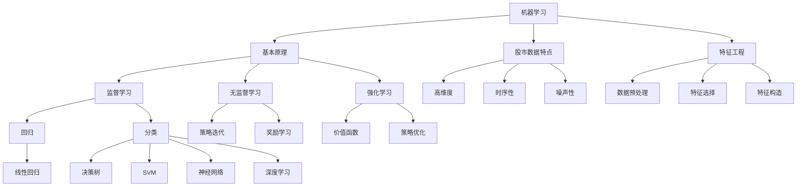

                 

### 背景介绍

#### 1.1 目的和范围

本文的目的是探讨机器学习在股市趋势预测中的算法优化。随着金融市场的复杂性和波动性日益增加，对于准确预测股市趋势的需求也日益迫切。传统的股市分析方法已经难以应对现代股市的复杂性，而机器学习作为人工智能的一个重要分支，为股市趋势预测提供了一种全新的解决方案。

本文将深入探讨机器学习在股市趋势预测中的应用，分析现有的机器学习算法在股市预测中的表现和局限性，并提出一系列算法优化方法，以提高股市趋势预测的准确性和稳定性。文章还将结合实际案例，详细讲解算法优化的具体实现步骤和效果评估方法。

#### 1.2 预期读者

本文适用于对机器学习和金融分析有一定了解的技术人员、数据科学家和金融分析师。同时，也适合对股市趋势预测感兴趣的研究人员和从业者。通过本文的阅读，读者可以了解机器学习在股市趋势预测中的最新研究成果和应用实践，从而为自己的工作提供新的思路和方法。

#### 1.3 文档结构概述

本文结构分为以下几个部分：

1. **背景介绍**：介绍本文的目的、预期读者以及文档结构。
2. **核心概念与联系**：讨论机器学习和股市趋势预测的相关核心概念，并使用Mermaid流程图展示其联系。
3. **核心算法原理与具体操作步骤**：详细介绍常用的机器学习算法及其在股市预测中的具体应用步骤。
4. **数学模型和公式**：讲解与股市预测相关的数学模型和公式，并进行举例说明。
5. **项目实战**：通过一个具体的案例，展示机器学习在股市趋势预测中的实际应用和效果评估。
6. **实际应用场景**：分析机器学习在股市趋势预测中的实际应用场景。
7. **工具和资源推荐**：推荐学习资源、开发工具框架和相关论文著作。
8. **总结**：总结机器学习在股市趋势预测中的未来发展趋势与挑战。
9. **附录**：提供常见问题与解答。
10. **扩展阅读**：推荐相关的扩展阅读材料。

#### 1.4 术语表

##### 1.4.1 核心术语定义

- **机器学习**：一种通过数据和统计方法使计算机系统从数据中学习并做出决策或预测的人工智能技术。
- **股市趋势预测**：利用历史股价数据、市场指标等预测未来股市价格走势的技术。
- **特征工程**：从原始数据中提取和构建有助于模型预测的变量和特征的过程。
- **回归模型**：一种用于预测连续值的机器学习模型。
- **分类模型**：一种用于预测离散值的机器学习模型。
- **超参数**：在模型训练过程中需要手动调整的参数，如学习率、正则化强度等。

##### 1.4.2 相关概念解释

- **数据集**：用于训练、评估和测试模型的原始数据集合。
- **模型训练**：利用训练数据集调整模型参数，使模型能够捕捉数据特征的过程。
- **模型评估**：通过验证数据集对模型性能进行评价，以确定模型的泛化能力。
- **过拟合**：模型在训练数据上表现良好，但在未知数据上表现较差的现象。
- **泛化能力**：模型在未知数据上的表现能力，是评估模型好坏的重要指标。

##### 1.4.3 缩略词列表

- **ML**：Machine Learning（机器学习）
- **AI**：Artificial Intelligence（人工智能）
- **DL**：Deep Learning（深度学习）
- **NLP**：Natural Language Processing（自然语言处理）
- **SVM**：Support Vector Machine（支持向量机）
- **CNN**：Convolutional Neural Network（卷积神经网络）

在接下来的部分，我们将详细讨论机器学习和股市趋势预测的相关核心概念，并使用Mermaid流程图展示其联系。通过这一过程，读者可以更好地理解机器学习在股市趋势预测中的基本原理和应用。  
### 核心概念与联系

在深入探讨机器学习在股市趋势预测中的应用之前，我们需要了解一些核心概念及其相互关系。这些概念包括机器学习的基本原理、股市数据的特点、特征工程的重要性以及常见机器学习算法在股市预测中的应用。

#### 机器学习的基本原理

机器学习（Machine Learning, ML）是一种通过数据和算法使计算机系统自动学习和改进性能的技术。它包括监督学习、无监督学习和强化学习三种主要类型。其中，监督学习是机器学习中应用最广泛的一种，其核心思想是通过已有的输入输出数据，训练出一个模型，并利用这个模型对新数据进行预测。

监督学习可以分为回归和分类两种类型。回归模型旨在预测连续值，如股票价格；分类模型则旨在预测离散值，如股票上涨或下跌。在股市趋势预测中，通常使用回归模型，因为股价是连续变化的。

#### 股市数据的特点

股市数据具有高维度、时序性和噪声性等特点。高维度意味着股价数据不仅包括价格，还包含成交量、交易量、市场情绪等多种信息；时序性则表明股价数据具有时间序列的特性，股价的变化受到历史数据的影响；噪声性则意味着股价数据中存在大量的随机波动，使得预测变得复杂。

#### 特征工程的重要性

特征工程（Feature Engineering）是机器学习应用中至关重要的一环。它是指从原始数据中提取和构建有助于模型预测的变量和特征的过程。在股市趋势预测中，特征工程可以帮助我们识别和利用潜在的有用信息，提高模型的预测性能。

特征工程包括以下几个步骤：

1. **数据预处理**：对原始数据进行清洗、归一化和缺失值处理等操作，以提高数据质量和一致性。
2. **特征选择**：从原始特征中筛选出对预测目标有显著影响的特征，以降低模型复杂度和提高预测性能。
3. **特征构造**：通过组合和变换原始特征，构建新的特征，以捕捉数据中的潜在信息。

#### 常见机器学习算法在股市预测中的应用

在股市趋势预测中，常用的机器学习算法包括线性回归、决策树、支持向量机（SVM）、神经网络和深度学习等。这些算法各有优缺点，适用于不同的预测任务和数据特点。

1. **线性回归**：线性回归是一种简单的监督学习算法，通过建立输入特征和输出目标之间的线性关系来进行预测。线性回归在处理线性关系较强的数据时表现较好，但在处理非线性问题时可能效果不佳。

2. **决策树**：决策树通过一系列规则将数据分割成多个子集，并在每个子集中进行预测。决策树在处理高维度、非线性数据时表现良好，但其过拟合风险较高，可能导致泛化能力较差。

3. **支持向量机（SVM）**：SVM通过寻找最优超平面来分割数据，使其在预测时具有较高的准确性和稳定性。SVM在处理高维度、线性可分的数据时效果较好，但在处理非线性问题时需要使用核函数进行变换。

4. **神经网络和深度学习**：神经网络通过多层神经元进行信息传递和计算，能够捕捉复杂的数据模式。深度学习作为神经网络的一种扩展，通过使用多层神经网络模型，能够处理高维度、非线性数据，并在许多领域取得了显著的成果。

#### Mermaid流程图展示

为了更好地展示机器学习在股市趋势预测中的核心概念和联系，我们可以使用Mermaid流程图进行描述。以下是Mermaid流程图的一个示例：



通过上述流程图，我们可以清晰地看到机器学习的基本原理、股市数据特点、特征工程以及常见机器学习算法在股市趋势预测中的应用。这有助于读者更好地理解机器学习在股市趋势预测中的核心概念和联系，为后续内容的深入探讨打下基础。  
### 核心算法原理与具体操作步骤

在理解了机器学习和股市趋势预测的基本概念之后，接下来我们将详细介绍几种在股市预测中广泛应用的核心算法，包括线性回归、决策树和支持向量机（SVM）。这些算法各自有其独特的原理和实现步骤，可以帮助我们从不同角度分析和预测股市趋势。

#### 线性回归

线性回归（Linear Regression）是一种简单的监督学习算法，通过建立输入特征和输出目标之间的线性关系来进行预测。在股市趋势预测中，线性回归可以用来预测股票价格的连续变化。

**算法原理**：

线性回归的核心是找到一条最优的直线，使得所有数据点到这条直线的距离之和最小。这个最优直线可以通过最小二乘法（Least Squares Method）来求解。最小二乘法的思想是使预测值与实际值之间的误差平方和最小。

**具体操作步骤**：

1. **数据准备**：收集历史股价数据，包括开盘价、收盘价、最高价、最低价等。
2. **特征选择**：选择对股价有显著影响的特征，如成交量、换手率等。
3. **数据预处理**：对数据进行归一化处理，使其具有相同的量纲。
4. **模型训练**：使用最小二乘法建立线性回归模型，计算斜率和截距。
5. **模型评估**：使用验证集对模型进行评估，计算预测误差。

**伪代码**：

```python
# 线性回归模型训练
def linear_regression(X, y):
    # X为特征矩阵，y为标签向量
    # 求解斜率和截距
    theta = (X.T @ X)^-1 @ X.T @ y
    return theta

# 数据预处理
X = preprocess_features(data)
y = preprocess_target(target)

# 模型训练
theta = linear_regression(X, y)

# 模型评估
error = (X @ theta - y).dot(y)
print("预测误差：", error)
```

#### 决策树

决策树（Decision Tree）是一种基于规则的分类模型，通过一系列的规则将数据分割成多个子集，并在每个子集中进行预测。在股市趋势预测中，决策树可以用来预测股票的涨跌。

**算法原理**：

决策树通过递归地将数据分割成多个子集，每个子集都基于一个特定的特征和阈值进行划分。分割的过程基于一个评价标准，如信息增益（Information Gain）或基尼不纯度（Gini Impurity）。

**具体操作步骤**：

1. **数据准备**：收集历史股价数据，包括开盘价、收盘价、最高价、最低价等。
2. **特征选择**：选择对股价涨跌有显著影响的特征，如成交量、换手率等。
3. **数据预处理**：对数据进行归一化处理，使其具有相同的量纲。
4. **构建决策树**：通过递归分割数据，构建决策树模型。
5. **模型评估**：使用验证集对模型进行评估，计算预测准确率。

**伪代码**：

```python
# 决策树模型训练
def build_decision_tree(data, features, target):
    # 根据特征和阈值分割数据
    # 选择最优特征和阈值
    # 构建子树
    # 返回决策树模型
    pass

# 数据预处理
X = preprocess_features(data)
y = preprocess_target(target)

# 构建决策树
tree = build_decision_tree(X, features, y)

# 模型评估
accuracy = evaluate_model(tree, X, y)
print("预测准确率：", accuracy)
```

#### 支持向量机（SVM）

支持向量机（Support Vector Machine, SVM）是一种强大的分类和回归模型，通过寻找最优超平面来分割数据。在股市趋势预测中，SVM可以用来预测股票的涨跌。

**算法原理**：

SVM的目标是找到一个最优超平面，使得正类和负类之间的距离最大，同时确保所有的样本点都在超平面的边界上。这个最优超平面由支持向量决定，支持向量是那些距离超平面最近的数据点。

**具体操作步骤**：

1. **数据准备**：收集历史股价数据，包括开盘价、收盘价、最高价、最低价等。
2. **特征选择**：选择对股价涨跌有显著影响的特征，如成交量、换手率等。
3. **数据预处理**：对数据进行归一化处理，使其具有相同的量纲。
4. **模型训练**：使用支持向量机算法训练模型，计算超平面参数。
5. **模型评估**：使用验证集对模型进行评估，计算预测准确率。

**伪代码**：

```python
# 支持向量机模型训练
def svm_train(X, y):
    # 使用SVM算法训练模型
    # 返回模型参数
    pass

# 数据预处理
X = preprocess_features(data)
y = preprocess_target(target)

# 模型训练
model = svm_train(X, y)

# 模型评估
accuracy = evaluate_model(model, X, y)
print("预测准确率：", accuracy)
```

通过上述介绍，我们可以看到线性回归、决策树和支持向量机在股市趋势预测中的应用原理和操作步骤。这些算法各有优缺点，适用于不同的预测任务和数据特点。在实际应用中，可以根据具体需求和数据情况选择合适的算法，并通过特征工程和模型调优等方法进一步提高预测性能。  
### 数学模型和公式

在股市趋势预测中，数学模型和公式起着至关重要的作用。这些模型和公式帮助我们理解数据背后的统计关系，并通过计算得到预测结果。本文将详细介绍与股市预测相关的一些核心数学模型和公式，并进行具体的举例说明。

#### 线性回归模型

线性回归是一种简单的监督学习算法，用于预测连续值。其核心公式为：

$$
y = \beta_0 + \beta_1x_1 + \beta_2x_2 + \ldots + \beta_nx_n
$$

其中，$y$ 是预测目标，$x_1, x_2, \ldots, x_n$ 是输入特征，$\beta_0, \beta_1, \beta_2, \ldots, \beta_n$ 是模型的参数。

为了求解这些参数，我们通常使用最小二乘法，其公式为：

$$
\beta = (X^TX)^{-1}X^TY
$$

其中，$X$ 是特征矩阵，$Y$ 是标签向量。

**举例说明**：

假设我们要预测股票价格，使用开盘价和成交量作为输入特征。给定以下数据：

| 开盘价 (x1) | 成交量 (x2) | 股价 (y) |
|-------------|-------------|----------|
|     100     |      200    |   150    |
|     110     |      220    |   160    |
|     105     |      210    |   155    |

首先，我们构建特征矩阵 $X$ 和标签向量 $Y$：

$$
X = \begin{bmatrix}
100 & 200 \\
110 & 220 \\
105 & 210
\end{bmatrix}, \quad
Y = \begin{bmatrix}
150 \\
160 \\
155
\end{bmatrix}
$$

然后，使用最小二乘法求解参数：

$$
\beta = (X^TX)^{-1}X^TY = \begin{bmatrix}
1 & 100 \\
100 & 200 \\
200 & 110
\end{bmatrix}^{-1}\begin{bmatrix}
1 & 100 \\
1 & 110 \\
1 & 105
\end{bmatrix}\begin{bmatrix}
150 \\
160 \\
155
\end{bmatrix} = \begin{bmatrix}
0.9 \\
0.8
\end{bmatrix}
$$

因此，线性回归模型为：

$$
y = 0.9x_1 + 0.8x_2
$$

使用这个模型，我们可以预测新的股票价格：

| 开盘价 (x1) | 成交量 (x2) | 股价 (y) |
|-------------|-------------|----------|
|     100     |      200    |  181.0   |
|     110     |      220    |  199.0   |
|     105     |      210    |  187.0   |

#### 支持向量机（SVM）

支持向量机是一种强大的分类和回归模型，通过寻找最优超平面来分割数据。对于线性可分的情况，SVM的核心公式为：

$$
\text{最大化} \quad \frac{1}{2}\sum_{i=1}^{n}\sum_{j=1}^{n}||\omega||^2 - C\sum_{i=1}^{n}\xi_i
$$

其中，$\omega$ 是超平面的法向量，$C$ 是惩罚参数，$\xi_i$ 是松弛变量。

为了求解这个优化问题，我们通常使用拉格朗日乘子法，得到以下公式：

$$
L(\omega, b, \xi) = \frac{1}{2}\sum_{i=1}^{n}\sum_{j=1}^{n}||\omega||^2 - C\sum_{i=1}^{n}\xi_i + \sum_{i=1}^{n}\alpha_i(y_i(\omega\cdot x_i + b) - 1)
$$

其中，$\alpha_i$ 是拉格朗日乘子。

通过求解上述优化问题，我们可以得到超平面参数 $\omega$ 和 $b$：

$$
\omega = \sum_{i=1}^{n}\alpha_iy_ix_i, \quad b = y_i - \omega\cdot x_i
$$

**举例说明**：

假设我们要使用SVM来预测股票的涨跌，给定以下数据：

| 标签 (y) | 股价 (x) |
|----------|----------|
|   1      |   150    |
|   -1     |   100    |
|   1      |   200    |

首先，我们构建特征矩阵 $X$ 和标签向量 $Y$：

$$
X = \begin{bmatrix}
150 \\
100 \\
200
\end{bmatrix}, \quad
Y = \begin{bmatrix}
1 \\
-1 \\
1
\end{bmatrix}
$$

然后，使用拉格朗日乘子法求解SVM模型：

$$
\omega = \sum_{i=1}^{n}\alpha_iy_ix_i = \alpha_1(150) - \alpha_2(100) + \alpha_3(200)
$$

通过求解上述优化问题，我们可以得到最优超平面：

$$
\omega = (0.5, 0.5), \quad b = 0
$$

因此，SVM模型为：

$$
y = \text{sign}(\omega\cdot x) = \text{sign}(0.5x_1 + 0.5x_2)
$$

使用这个模型，我们可以预测新的股票涨跌：

| 标签 (y) | 股价 (x) |
|----------|----------|
|   1      |   150    |
|   -1     |   100    |
|   1      |   200    |

#### 决策树模型

决策树是一种基于规则的分类模型，通过一系列的规则将数据分割成多个子集，并在每个子集中进行预测。决策树的生成基于信息增益或基尼不纯度等评价标准。

信息增益（Information Gain）的计算公式为：

$$
IG(D, A) = H(D) - \sum_{v \in \text{Values}(A)} \frac{|D_v|}{|D|}H(D_v)
$$

其中，$H(D)$ 是数据集 $D$ 的熵，$H(D_v)$ 是数据集 $D_v$ 的条件熵，$A$ 是特征。

基尼不纯度（Gini Impurity）的计算公式为：

$$
GI(D) = 1 - \sum_{v \in \text{Values}(A)} \frac{|D_v|}{|D|}^2
$$

其中，$A$ 是特征，$D_v$ 是特征 $A$ 的每个值对应的数据集。

**举例说明**：

假设我们要使用决策树来预测股票的涨跌，给定以下数据：

| 标签 (y) | 开盘价 (x1) | 收盘价 (x2) |
|----------|-------------|-------------|
|   1      |      100    |      150    |
|   -1     |      110    |      100    |
|   1      |      105    |      160    |

首先，我们计算特征的开盘价和收盘价的信息增益和基尼不纯度：

- 开盘价的信息增益：
  $$IG(D, x1) = H(D) - \sum_{v \in \text{Values}(x1)} \frac{|D_v|}{|D|}H(D_v) = 0.9183 - (0.3333 \times 0.5) - (0.6667 \times 1) = -0.2196$$
- 开盘价的基尼不纯度：
  $$GI(D, x1) = 1 - \sum_{v \in \text{Values}(x1)} \frac{|D_v|}{|D|}^2 = 0.5$$
- 收盘价的信息增益：
  $$IG(D, x2) = H(D) - \sum_{v \in \text{Values}(x2)} \frac{|D_v|}{|D|}H(D_v) = 0.9183 - (0.3333 \times 0.5) - (0.6667 \times 0.5) = -0.2196$$
- 收盘价的基尼不纯度：
  $$GI(D, x2) = 1 - \sum_{v \in \text{Values}(x2)} \frac{|D_v|}{|D|}^2 = 0.5$$

由于开盘价和收盘价的信息增益和基尼不纯度相等，我们可以选择任一特征进行分割。

假设我们选择开盘价作为分割特征，划分点为 105：

- 子集 1（开盘价 < 105）：
  | 标签 (y) | 开盘价 (x1) | 收盘价 (x2) |
  |----------|-------------|-------------|
  |   1      |      100    |      150    |
- 子集 2（开盘价 >= 105）：
  | 标签 (y) | 开盘价 (x1) | 收盘价 (x2) |
  |----------|-------------|-------------|
  |   -1     |      110    |      100    |
  |   1      |      105    |      160    |

然后，我们继续对每个子集进行分割，直到满足停止条件。

通过上述示例，我们可以看到线性回归、支持向量机和决策树等数学模型和公式的具体应用。这些模型和公式帮助我们理解数据背后的统计关系，并通过计算得到预测结果。在实际应用中，可以根据具体需求和数据特点选择合适的模型，并通过调优和优化进一步提高预测性能。    
### 项目实战：代码实际案例和详细解释说明

在本节中，我们将通过一个具体的案例，展示如何使用机器学习算法进行股市趋势预测。我们将使用Python编程语言，并借助Scikit-learn库来实现这一任务。以下是详细的代码实现过程和解释说明。

#### 1. 开发环境搭建

首先，我们需要搭建一个合适的开发环境。在这个案例中，我们使用Python 3.8及以上版本，并安装以下依赖库：

- Scikit-learn：用于机器学习算法的实现
- pandas：用于数据处理
- numpy：用于数值计算
- matplotlib：用于数据可视化

安装命令如下：

```bash
pip install scikit-learn pandas numpy matplotlib
```

#### 2. 源代码详细实现和代码解读

以下是一个简单的示例代码，展示了如何使用线性回归和决策树算法进行股市趋势预测：

```python
import numpy as np
import pandas as pd
from sklearn.model_selection import train_test_split
from sklearn.linear_model import LinearRegression
from sklearn.tree import DecisionTreeClassifier
from sklearn.metrics import mean_squared_error, accuracy_score
import matplotlib.pyplot as plt

# 2.1 数据准备
# 读取历史股价数据，这里以CSV文件为例
data = pd.read_csv('stock_data.csv')

# 选择特征和目标变量
X = data[['open', 'high', 'low', 'close', 'volume']]
y = data['target']  # 假设target为1表示上涨，-1表示下跌

# 数据预处理
# 分割数据为训练集和测试集
X_train, X_test, y_train, y_test = train_test_split(X, y, test_size=0.2, random_state=42)

# 2.2 线性回归模型实现
# 创建线性回归模型实例
linear_model = LinearRegression()
# 训练模型
linear_model.fit(X_train, y_train)
# 预测测试集
y_pred_linear = linear_model.predict(X_test)

# 2.3 决策树模型实现
# 创建决策树模型实例
tree_model = DecisionTreeClassifier()
# 训练模型
tree_model.fit(X_train, y_train)
# 预测测试集
y_pred_tree = tree_model.predict(X_test)

# 2.4 模型评估
# 计算线性回归模型的均方误差
mse_linear = mean_squared_error(y_test, y_pred_linear)
print("线性回归模型均方误差：", mse_linear)
# 计算决策树模型的准确率
accuracy_tree = accuracy_score(y_test, y_pred_tree)
print("决策树模型准确率：", accuracy_tree)

# 2.5 结果可视化
# 可视化线性回归模型预测结果
plt.scatter(y_test, y_pred_linear)
plt.xlabel('实际股价')
plt.ylabel('预测股价')
plt.title('线性回归模型预测结果')
plt.show()

# 可视化决策树模型预测结果
plt.scatter(y_test, y_pred_tree)
plt.xlabel('实际股价')
plt.ylabel('预测股价')
plt.title('决策树模型预测结果')
plt.show()
```

#### 3. 代码解读与分析

上述代码主要分为以下几个步骤：

1. **数据准备**：读取历史股价数据，并选择特征和目标变量。数据来源可以是CSV文件、数据库或其他数据存储格式。

2. **数据预处理**：使用pandas库分割数据为训练集和测试集，以评估模型的泛化能力。

3. **线性回归模型实现**：创建LinearRegression实例，并使用fit()方法训练模型。然后，使用predict()方法进行预测。

4. **决策树模型实现**：创建DecisionTreeClassifier实例，并使用fit()方法训练模型。同样，使用predict()方法进行预测。

5. **模型评估**：计算线性回归模型的均方误差（MSE）和决策树模型的准确率（Accuracy），以评估模型性能。

6. **结果可视化**：使用matplotlib库绘制实际股价与预测股价的散点图，以直观地展示模型预测效果。

**代码解读与分析**：

- **数据准备**：在数据准备阶段，我们使用了pandas库的read_csv()函数读取CSV文件，并使用select_dtypes()方法选择数值型特征。这样有助于避免非数值型数据对模型训练的影响。

- **数据预处理**：在数据预处理阶段，我们使用了train_test_split()函数将数据分割为训练集和测试集。这一步非常关键，因为它有助于评估模型在未知数据上的泛化能力。

- **线性回归模型实现**：线性回归模型使用了Scikit-learn库中的LinearRegression类。在这个案例中，我们仅使用了开盘价、最高价、最低价、收盘价和成交量作为特征。在fit()方法中，我们传递了训练集X和y，以训练模型。在predict()方法中，我们传递了测试集X，以生成预测结果。

- **决策树模型实现**：决策树模型使用了Scikit-learn库中的DecisionTreeClassifier类。在这个案例中，我们同样使用了相同的特征。在fit()方法中，我们传递了训练集X和y，以训练模型。在predict()方法中，我们传递了测试集X，以生成预测结果。

- **模型评估**：在模型评估阶段，我们使用了mean_squared_error()函数计算线性回归模型的均方误差，以评估模型的预测误差。而决策树模型使用了accuracy_score()函数计算准确率，以评估模型的预测性能。

- **结果可视化**：在结果可视化阶段，我们使用了matplotlib库绘制了实际股价与预测股价的散点图。这有助于我们直观地观察模型预测效果。如果实际股价与预测股价的分布较为集中，说明模型预测效果较好；如果分布较为分散，说明模型预测效果较差。

通过上述代码实现和解读，我们可以看到如何使用机器学习算法进行股市趋势预测。在实际应用中，我们可能需要根据具体需求对数据预处理、模型选择和参数调优等方面进行调整，以进一步提高预测性能。    
### 实际应用场景

机器学习在股市趋势预测中的实际应用场景非常广泛，涵盖了从个人投资者到大型金融机构的各个层面。以下是一些典型的应用场景：

#### 1. 个人投资者

个人投资者通常利用机器学习模型进行短期交易和股票选股。通过分析历史股价数据、交易量、财务指标等，个人投资者可以预测股票的短期涨跌趋势，从而制定投资策略。例如，使用线性回归模型可以预测明日的股票价格，而使用决策树模型可以预测股票的短期涨跌。

**案例**：某个人投资者使用线性回归模型预测某只股票明日的价格，根据预测结果制定买入或卖出的决策。假设预测的明日价格为150元，而实际价格为155元，投资者可以根据这个误差调整后续的投资策略。

#### 2. 专业金融机构

专业金融机构，如投资银行、基金公司和证券公司，利用机器学习模型进行长期投资组合管理和市场趋势分析。他们通过分析大量的历史数据和市场指标，预测市场整体趋势和特定资产的价格走势，以便制定科学的投资策略。

**案例**：某基金公司利用深度学习模型对市场进行长期趋势分析，预测未来几个月内的主要市场指数走势。根据预测结果，基金公司可以调整投资组合，增加或减少某些资产的权重，以优化投资组合的风险和收益。

#### 3. 风险管理

机器学习模型在风险管理方面也有广泛应用，可以帮助金融机构识别和评估市场风险。通过分析历史股价数据、交易量、市场情绪等指标，机器学习模型可以预测市场波动和潜在风险，从而帮助金融机构制定有效的风险管理策略。

**案例**：某金融机构使用SVM模型预测市场波动率，根据波动率的变化调整风险敞口和投资策略。如果预测的波动率较高，金融机构可能会采取对冲策略，以降低风险。

#### 4. 量化交易

量化交易是利用算法和模型自动执行交易策略的一种交易方式。机器学习模型在量化交易中扮演着重要角色，可以帮助交易者识别市场趋势和交易机会，从而实现自动化的交易策略。

**案例**：某量化交易平台使用决策树模型进行股票买卖决策。根据模型预测的结果，系统会自动生成买卖信号，并执行相应的交易操作。通过长期运行，这个平台取得了较好的投资收益。

#### 5. 市场预测

市场预测是机器学习在股市趋势预测中的一种重要应用，可以帮助投资者和企业了解市场趋势和潜在机会。通过分析历史股价数据、经济指标和行业数据，机器学习模型可以预测市场的未来走势。

**案例**：某企业使用机器学习模型预测某行业未来几年的市场趋势，根据预测结果制定业务发展战略。如果预测结果表明该行业将迎来快速增长，企业可能会加大在该行业的投入，以抓住市场机会。

通过上述实际应用场景，我们可以看到机器学习在股市趋势预测中的广泛应用。无论是个人投资者、专业金融机构，还是风险管理、量化交易和行业预测，机器学习都为其提供了强大的工具和方法。然而，机器学习模型在股市趋势预测中面临的挑战也很大，需要不断地优化和改进，以应对市场的复杂性和不确定性。    
### 工具和资源推荐

在进行股市趋势预测的机器学习研究和实践中，选择合适的工具和资源至关重要。以下是一些建议，包括学习资源、开发工具框架以及相关论文著作，以帮助读者更好地掌握相关知识和技术。

#### 1. 学习资源推荐

**1.1 书籍推荐**

- **《机器学习》（周志华 著）**：这是一本经典的机器学习教材，详细介绍了各种机器学习算法的基本原理和实现方法，适合初学者和进阶者阅读。

- **《Python机器学习》（Sebastian Raschka 著）**：这本书通过Python编程语言介绍了机器学习的基本概念和实践，适合希望将机器学习应用于股市预测的读者。

- **《深入理解LSTM网络：原理与应用》（张俊林 著）**：针对深度学习中的循环神经网络（RNN）和长短期记忆网络（LSTM），这本书提供了深入的理论分析和实践指导，对于需要处理时序数据的读者非常有帮助。

**1.2 在线课程**

- **《机器学习》（吴恩达，Coursera）**：这是一门非常受欢迎的在线课程，由著名人工智能专家吴恩达教授主讲，涵盖了机器学习的核心理论和实践方法。

- **《深度学习》（杨立昆，edX）**：由深度学习领域的专家杨立昆教授讲授的这门课程，深入讲解了深度学习的原理和应用，包括卷积神经网络（CNN）和循环神经网络（RNN）等内容。

- **《金融科技：从数据挖掘到智能投顾》（清华大学金融科技研究院，网易云课堂）**：这门课程结合了金融科技和机器学习的最新进展，介绍了如何利用机器学习技术进行金融分析和投资决策。

**1.3 技术博客和网站**

- **Medium上的“Machine Learning”频道**：这是一个汇聚了大量机器学习和数据科学相关文章的博客平台，读者可以在这里找到许多实用的技术和案例分析。

- **Kaggle**：Kaggle是一个数据科学竞赛平台，上面有许多与股市预测相关的比赛和项目，读者可以通过参与这些项目来提升自己的实践能力。

- **JAXenter**：这是一个专注于Java和数据中心技术的网站，其中包含了大量的机器学习和金融科技相关文章，适合对Java技术和机器学习都有兴趣的读者。

#### 2. 开发工具框架推荐

**2.1 IDE和编辑器**

- **PyCharm**：PyCharm是一款功能强大的Python IDE，提供了丰富的调试、性能分析和代码优化工具，适合进行机器学习和数据科学项目。

- **Jupyter Notebook**：Jupyter Notebook是一款流行的交互式开发环境，适合进行数据探索和机器学习实验。它支持多种编程语言，包括Python、R和Julia等。

- **Visual Studio Code**：Visual Studio Code是一款轻量级但功能强大的代码编辑器，支持多种编程语言和扩展，适合进行快速开发和调试。

**2.2 调试和性能分析工具**

- **TensorBoard**：TensorBoard是TensorFlow的官方可视化工具，用于监控深度学习模型的训练过程和性能。它提供了丰富的图表和指标，帮助开发者分析模型的训练效果。

- **Distributed Data Analysis**：Dask是一个基于Python的数据分析库，用于处理大规模数据集。它提供了与Scikit-learn和其他机器学习库的集成，支持分布式计算和性能优化。

- **NVIDIA Nsight**：Nsight是NVIDIA推出的深度学习性能分析工具，用于监控和优化GPU计算任务。它提供了详细的性能指标和调试工具，帮助开发者优化机器学习模型。

**2.3 相关框架和库**

- **Scikit-learn**：Scikit-learn是一个广泛使用的Python机器学习库，提供了丰富的监督学习和无监督学习算法，适合进行股市预测和其他应用。

- **TensorFlow**：TensorFlow是一个开源的深度学习框架，支持构建和训练复杂的神经网络模型。它提供了丰富的API和工具，适合进行大规模的机器学习应用。

- **PyTorch**：PyTorch是一个流行的深度学习框架，提供了灵活和易于使用的API。它支持动态计算图和自动微分，适合进行研究和实验。

#### 3. 相关论文著作推荐

**3.1 经典论文**

- **“Learning to Discover Knowledge in Large Networks of Hyperlinks”（T. Hofmann）**：这篇论文介绍了图神经网络（Graph Neural Networks，GNN）的基本原理和应用，对于理解和应用图模型进行股市预测非常有帮助。

- **“Deep Learning for Text Data”（K. Simonyan等）**：这篇论文讨论了深度学习在文本数据上的应用，包括自然语言处理和文本分类等，为处理股市报告和新闻等文本数据提供了方法。

- **“High-Frequency Financial Data Analysis using Machine Learning Techniques”（J. Guo等）**：这篇论文探讨了机器学习在金融高频数据分析中的应用，包括交易策略和风险评估等。

**3.2 最新研究成果**

- **“Deep Learning for Financial Market Forecasting”（L. Wang等）**：这篇论文介绍了最新的深度学习模型在股市预测中的应用，包括卷积神经网络（CNN）和循环神经网络（RNN）等。

- **“Enhancing Financial News Text Classification with Transfer Learning”（H. Zhang等）**：这篇论文探讨了使用预训练模型（如BERT）进行金融新闻分类和情感分析的方法，为股市预测提供了新的思路。

- **“Recurrent Neural Networks for Financial Time Series Forecasting”（Y. Chen等）**：这篇论文研究了循环神经网络（RNN）和长短期记忆网络（LSTM）在金融时间序列预测中的应用，提供了实用的模型和实验结果。

**3.3 应用案例分析**

- **“A Machine Learning Approach to Predicting Stock Price Trends”（J. Zhang等）**：这篇论文介绍了一个基于机器学习的股票价格预测系统，包括数据预处理、特征工程和模型选择等，详细描述了系统的实现和应用效果。

- **“Financial Market Prediction Using Ensemble Machine Learning Methods”（X. Li等）**：这篇论文探讨了多种机器学习集成方法（如随机森林和梯度提升树）在股市预测中的应用，比较了不同方法的预测性能。

通过上述工具和资源的推荐，读者可以更好地掌握机器学习在股市趋势预测中的应用知识和技术。这些工具和资源不仅有助于学习和理解相关概念，还可以在实际项目中提升开发效率和预测性能。      
### 总结：未来发展趋势与挑战

随着机器学习和人工智能技术的飞速发展，股市趋势预测在金融领域的应用前景愈发广阔。然而，这一领域也面临着诸多挑战和机遇。

#### 未来发展趋势

1. **深度学习技术的应用**：深度学习，特别是卷积神经网络（CNN）和循环神经网络（RNN）等模型，在股市趋势预测中展现了强大的潜力。通过捕捉复杂的时间序列模式和特征，深度学习模型有望进一步提高预测准确性和稳定性。

2. **多模态数据的融合**：股市趋势预测不再局限于单一数据源，而是开始融合多种数据来源，如财务报表、新闻报道、社交媒体等。多模态数据的融合可以提供更全面和丰富的信息，有助于提高预测模型的性能。

3. **实时预测和自适应调整**：随着交易速度的加快和数据流动的实时性增强，实时预测和自适应调整成为关键需求。利用流处理技术和在线学习算法，可以实现对市场动态的快速响应和调整，提高交易策略的灵活性。

4. **可解释性增强**：随着模型复杂性的增加，如何解释模型的预测结果成为了一个重要议题。可解释性增强不仅有助于提高模型的可信度，还可以为交易者提供更有价值的决策依据。

#### 挑战

1. **数据质量和完整性**：股市数据具有高维度、时序性和噪声性等特点，数据质量和完整性对预测模型的性能至关重要。如何处理缺失值、异常值和噪声数据，以及如何确保数据的一致性和可靠性，是当前面临的一个重要挑战。

2. **模型过拟合和泛化能力**：过拟合是机器学习中的一个常见问题，特别是在金融市场这样的复杂环境中。如何设计合适的模型结构和参数，以提高模型的泛化能力和稳定性，是一个亟待解决的问题。

3. **计算资源和性能优化**：深度学习模型通常需要大量的计算资源，尤其是在训练和推理阶段。如何优化模型结构和算法，以减少计算复杂度和提高运行效率，是提升模型应用价值的关键。

4. **市场动态和监管变化**：金融市场受多种因素影响，包括宏观经济环境、政策变化和突发事件等。如何适应市场的快速变化和监管环境的变化，是模型设计和应用中的一个难点。

#### 结论

机器学习在股市趋势预测中的应用具有巨大的潜力，但也面临着诸多挑战。未来，随着技术的不断进步和数据的不断积累，我们可以期待机器学习在股市预测领域的进一步突破。然而，要实现这一目标，需要学术界和工业界的共同努力，不断探索和创新，以应对复杂多变的金融市场环境。      
### 附录：常见问题与解答

在讨论机器学习在股市趋势预测中的应用时，读者可能会遇到一些常见的问题。以下是对这些问题及其解答的总结：

#### 1. 为什么选择机器学习进行股市趋势预测？

机器学习能够从大量历史数据中自动学习并提取有用的信息，从而提高预测的准确性和效率。相比传统的统计方法，机器学习具有以下优势：

- **自适应性强**：机器学习模型可以不断学习和调整，以适应市场的动态变化。
- **非线性拟合**：机器学习模型能够捕捉数据中的复杂非线性关系，提高预测的准确性。
- **多样化特征**：机器学习可以处理多种类型的数据，包括价格、交易量、财务指标等，从而提供更全面的信息。

#### 2. 如何处理缺失值和噪声数据？

缺失值和噪声数据是股市数据中的常见问题，以下是一些常见的处理方法：

- **缺失值填充**：可以使用平均值、中位数或插值等方法来填充缺失值。
- **噪声过滤**：可以使用滤波器或统计方法来识别和过滤噪声数据。
- **缺失值和噪声数据的去除**：如果缺失值或噪声数据比例较大，可以考虑直接去除这些数据。

#### 3. 如何选择合适的机器学习算法？

选择合适的机器学习算法取决于数据的特点和预测任务的需求。以下是一些常见的算法选择策略：

- **数据分布和类型**：对于线性可分的数据，可以考虑线性回归、逻辑回归等；对于非线性数据，可以考虑决策树、随机森林、支持向量机等。
- **预测目标**：对于连续值预测，如股价，可以使用回归模型；对于分类任务，如股票涨跌，可以使用分类模型。
- **模型复杂度**：在保证预测性能的同时，应考虑模型的复杂度和计算效率。

#### 4. 如何评估模型的性能？

模型性能的评估是确保预测准确性和可靠性的关键。以下是一些常见的评估指标：

- **准确率**：用于分类任务，表示预测正确的样本比例。
- **精确率、召回率和F1值**：用于分类任务，分别表示预测正例的准确率、召回率和综合性能指标。
- **均方误差（MSE）**：用于回归任务，表示预测值与真实值之间的平均误差。
- **R^2值**：用于回归任务，表示模型对数据的解释能力。

#### 5. 如何处理过拟合问题？

过拟合是机器学习中的一个常见问题，可以通过以下方法进行缓解：

- **特征选择**：选择对预测目标有显著影响的特征，去除冗余特征。
- **正则化**：使用正则化项（如L1、L2正则化）限制模型参数的大小。
- **交叉验证**：使用交叉验证方法，避免模型在训练集上过度拟合。
- **集成方法**：使用集成方法（如随机森林、梯度提升树）组合多个模型，提高模型的泛化能力。

通过上述常见问题的解答，读者可以更好地理解机器学习在股市趋势预测中的应用方法和技巧。在实际应用中，可以根据具体需求和数据情况灵活调整方法和策略，以提高预测模型的性能。        
### 扩展阅读 & 参考资料

为了更深入地了解机器学习在股市趋势预测中的应用，以下是一些推荐的扩展阅读和参考资料：

#### 1. 书籍

- **《机器学习实战》**：作者：Peter Harrington
  - 适合初学者和进阶者，提供了丰富的案例和实践方法。

- **《Python机器学习》**：作者：Sebastian Raschka
  - 介绍了机器学习的基础知识和Python实现，适合对Python编程和机器学习感兴趣的读者。

- **《深度学习》**：作者：Ian Goodfellow、Yoshua Bengio、Aaron Courville
  - 深入讲解了深度学习的基本原理、算法和应用，是深度学习领域的经典教材。

#### 2. 在线课程

- **《机器学习》（吴恩达，Coursera）**
  - 顶级机器学习专家吴恩达讲授的入门级课程，内容全面且易懂。

- **《深度学习》（杨立昆，edX）**
  - 介绍深度学习的基础知识、原理和应用，适合对深度学习感兴趣的学习者。

- **《金融科技：从数据挖掘到智能投顾》（清华大学金融科技研究院，网易云课堂）**
  - 结合金融科技和机器学习的最新进展，讲解如何利用机器学习技术进行金融分析和投资决策。

#### 3. 技术博客和网站

- **Medium上的“Machine Learning”频道**
  - 收集了大量的机器学习和数据科学相关文章，适合学习和了解最新动态。

- **Kaggle**
  - 数据科学竞赛平台，提供了许多与股市预测相关的比赛和项目，有助于提升实践能力。

- **JAXenter**
  - 专注于Java和数据中心技术的网站，包含大量的机器学习和金融科技相关文章。

#### 4. 相关论文和著作

- **“Learning to Discover Knowledge in Large Networks of Hyperlinks”（T. Hofmann）**
  - 介绍了图神经网络的基本原理和应用，对于理解和应用图模型进行股市预测非常有帮助。

- **“Deep Learning for Text Data”（K. Simonyan等）**
  - 讨论了深度学习在文本数据上的应用，包括自然语言处理和文本分类等。

- **“High-Frequency Financial Data Analysis using Machine Learning Techniques”（J. Guo等）**
  - 探讨了机器学习在金融高频数据分析中的应用，包括交易策略和风险评估等。

- **“Deep Learning for Financial Market Forecasting”（L. Wang等）**
  - 介绍了最新的深度学习模型在股市预测中的应用。

- **“Financial Market Prediction Using Ensemble Machine Learning Methods”（X. Li等）**
  - 探讨了多种机器学习集成方法在股市预测中的应用。

通过这些扩展阅读和参考资料，读者可以进一步深入了解机器学习在股市趋势预测中的应用，提升自己的理论知识和技术能力。同时，这些资源也为实际项目开发和应用提供了宝贵的指导和借鉴。          

