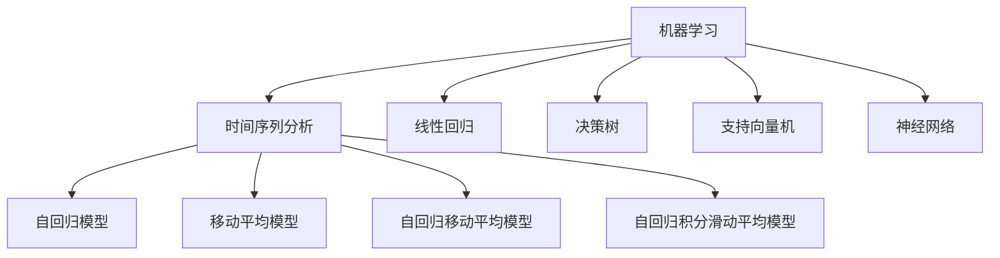

                 

# 机器学习在股票市场预测中的应用研究

> 关键词：机器学习，股票市场预测，时间序列分析，预测模型，算法实现，实际应用

> 摘要：本文旨在探讨机器学习在股票市场预测中的实际应用。通过介绍机器学习的基本概念和方法，分析其在股票市场预测中的适用性和优势，本文将详细阐述时间序列分析方法以及几种常见的机器学习算法原理，并给出具体操作步骤和数学模型。此外，本文还将通过实际项目案例，展示如何利用机器学习技术进行股票市场的预测，并对相关工具和资源进行推荐。通过本文的阅读，读者将能够深入理解机器学习在股票市场预测中的潜力与挑战。

## 1. 背景介绍

### 1.1 目的和范围

本文的主要目的是介绍机器学习在股票市场预测中的应用，旨在帮助读者理解机器学习技术在金融领域的潜在价值。本文将涵盖以下内容：

1. **机器学习的基本概念和分类**：介绍机器学习的基本概念，包括监督学习、无监督学习和强化学习，以及它们在股票市场预测中的适用性。
2. **时间序列分析方法**：详细阐述时间序列分析方法，包括常见的时间序列模型和预测方法。
3. **机器学习算法在股票市场预测中的应用**：介绍几种常见的机器学习算法，如线性回归、决策树、支持向量机、神经网络等，以及它们在股票市场预测中的具体应用。
4. **实际项目案例**：通过一个实际项目案例，展示如何利用机器学习技术进行股票市场预测，并提供详细的代码实现和解读。
5. **工具和资源推荐**：推荐相关的学习资源、开发工具和论文著作，以帮助读者深入了解和进一步探索该领域。

### 1.2 预期读者

本文主要面向以下读者群体：

1. **对机器学习和金融分析感兴趣的计算机科学和金融专业学生和研究人员**：本文将帮助读者了解机器学习在股票市场预测中的应用，并提供实践经验和案例。
2. **金融行业的分析师和投资者**：本文将提供一种新的视角，帮助专业人士了解机器学习技术在股票市场预测中的潜在应用，以及如何利用这些技术提高投资决策的准确性。
3. **对金融科技领域感兴趣的开发者和企业家**：本文将介绍机器学习在股票市场预测中的实际应用，为读者提供开发金融科技产品和解决方案的启示。

### 1.3 文档结构概述

本文将分为以下几个部分：

1. **背景介绍**：介绍本文的目的、范围和预期读者，以及文档的结构。
2. **核心概念与联系**：讨论机器学习和股票市场预测的核心概念和联系，并提供相应的流程图。
3. **核心算法原理与具体操作步骤**：详细阐述机器学习算法的原理和操作步骤，包括伪代码和数学模型。
4. **数学模型和公式**：介绍相关的数学模型和公式，并进行举例说明。
5. **项目实战：代码实际案例和详细解释说明**：通过实际项目案例展示如何实现机器学习算法在股票市场预测中的应用，并提供详细的代码解读和分析。
6. **实际应用场景**：讨论机器学习在股票市场预测中的实际应用场景。
7. **工具和资源推荐**：推荐相关的学习资源、开发工具和论文著作。
8. **总结：未来发展趋势与挑战**：总结机器学习在股票市场预测中的未来发展趋势和面临的挑战。
9. **附录：常见问题与解答**：回答读者可能关心的问题。
10. **扩展阅读与参考资料**：提供额外的阅读材料和参考资料。

### 1.4 术语表

#### 1.4.1 核心术语定义

- **机器学习**：一种人工智能的分支，通过算法和统计模型从数据中自动学习和改进。
- **股票市场**：一个组织化的市场，股票交易者可以买卖股票和其他证券。
- **时间序列分析**：一种数据分析方法，用于处理和预测随时间变化的数据。
- **监督学习**：一种机器学习方法，通过已知的输入和输出数据进行训练，以预测未知数据。
- **无监督学习**：一种机器学习方法，仅通过输入数据来发现数据中的结构和模式。
- **强化学习**：一种机器学习方法，通过试错和反馈来优化决策过程。

#### 1.4.2 相关概念解释

- **回归分析**：一种统计方法，用于预测一个连续变量的值。
- **分类分析**：一种统计方法，用于将数据分为不同的类别。
- **特征工程**：在机器学习过程中，从原始数据中提取和构造有用的特征。
- **交叉验证**：一种评估机器学习模型性能的方法，通过将数据集划分为多个部分，在每个部分上进行训练和验证。

#### 1.4.3 缩略词列表

- **ML**：机器学习（Machine Learning）
- **TS**：时间序列（Time Series）
- **SVM**：支持向量机（Support Vector Machine）
- **NN**：神经网络（Neural Network）
- **CART**：分类与回归树（Classification And Regression Tree）
- **RMSE**：均方根误差（Root Mean Square Error）

## 2. 核心概念与联系

### 2.1 机器学习与股票市场预测的关系

机器学习是一种强大的工具，可以用于处理和分析大量数据，从而发现数据中的模式和关系。在股票市场预测中，机器学习可以用于分析历史价格数据、交易量和其他相关因素，以预测未来的股票价格走势。

机器学习在股票市场预测中的应用可以分为以下几种类型：

1. **时间序列预测**：利用历史价格数据进行分析和预测，以预测未来的价格走势。
2. **异常检测**：识别异常交易行为或市场异常，以防止欺诈或市场操纵。
3. **风险管理**：通过分析市场数据和交易行为，评估投资组合的风险。
4. **投资策略优化**：通过分析历史交易数据和市场趋势，优化投资策略，以提高收益。

### 2.2 时间序列分析方法

时间序列分析是一种用于处理和预测随时间变化的数据的方法。在股票市场预测中，时间序列分析是常用的方法之一，因为它可以帮助我们理解股票价格的波动和趋势。

常见的时间序列分析方法包括：

1. **自回归模型（AR）**：通过历史价格预测未来价格，假设当前价格受到之前价格的线性影响。
2. **移动平均模型（MA）**：通过计算过去一段时间内的平均值来预测未来价格，以平滑数据中的噪声。
3. **自回归移动平均模型（ARMA）**：结合自回归模型和移动平均模型，以同时考虑历史价格和过去一段时间内的平均值。
4. **自回归积分滑动平均模型（ARIMA）**：扩展ARMA模型，可以处理非平稳数据，包括趋势和季节性成分。

### 2.3 机器学习算法与时间序列分析的关系

机器学习算法可以与时间序列分析方法相结合，以提高股票市场预测的准确性。以下是一些常见的机器学习算法：

1. **线性回归（Linear Regression）**：通过建立输入特征和输出变量之间的线性关系来预测价格。
2. **决策树（Decision Tree）**：通过一系列的规则和条件来划分数据，并预测股票价格。
3. **支持向量机（Support Vector Machine，SVM）**：通过找到一个最佳的超平面对数据进行分类，以预测股票价格。
4. **神经网络（Neural Network，NN）**：通过模拟神经网络的结构和功能来学习数据中的模式和关系。

### 2.4 Mermaid 流程图

以下是一个简单的 Mermaid 流程图，展示了机器学习与时间序列分析在股票市场预测中的关系：



通过上述 Mermaid 流程图，我们可以清晰地看到机器学习算法与时间序列分析方法在股票市场预测中的紧密联系。接下来，我们将进一步深入探讨这些算法的原理和具体应用。

## 3. 核心算法原理 & 具体操作步骤

### 3.1 线性回归（Linear Regression）

线性回归是一种监督学习算法，用于预测一个连续变量的值。在股票市场预测中，线性回归可以用于预测股票价格。

**算法原理：**

线性回归的算法原理是找到一条最佳拟合直线，以最小化预测值与实际值之间的误差。假设我们有一个包含输入特征 \(X\) 和输出变量 \(Y\) 的数据集，线性回归的目标是找到最佳拟合直线的参数 \(w\) 和 \(b\)，使得预测值 \(y = Xw + b\) 与实际值 \(y\) 之间的误差最小。

**伪代码：**

```python
# 线性回归伪代码
def linear_regression(X, Y):
    # 计算最佳拟合直线的参数
    w = (X'X)^(-1)X'Y
    b = y - Xw
    
    # 返回预测值
    return Xw + b
```

**具体操作步骤：**

1. **数据准备**：收集历史股票价格数据，包括开盘价、收盘价、最高价、最低价和交易量等。
2. **特征工程**：将原始数据转换为适合线性回归的输入特征和输出变量。
3. **模型训练**：使用历史数据训练线性回归模型，计算最佳拟合直线的参数 \(w\) 和 \(b\)。
4. **模型预测**：使用训练好的模型预测未来的股票价格。

### 3.2 决策树（Decision Tree）

决策树是一种基于规则的学习算法，用于分类和回归分析。在股票市场预测中，决策树可以用于预测股票价格的走势。

**算法原理：**

决策树的算法原理是通过一系列的规则和条件来划分数据，并预测股票价格。决策树通过递归地分割特征空间，将数据划分为多个子集，并在每个子集上应用不同的规则进行预测。

**伪代码：**

```python
# 决策树伪代码
def decision_tree(X, Y):
    # 判断是否达到停止条件，如数据集已分为纯类或特征数量减少至最小值
    if stop_condition:
        return leaf_value
    
    # 选择最佳分割特征和分割点
    best_split = select_best_split(X, Y)
    
    # 构建子树
    left_tree = decision_tree(X[:, best_split < threshold], Y[best_split < threshold])
    right_tree = decision_tree(X[:, best_split >= threshold], Y[best_split >= threshold])
    
    # 返回决策树
    return Tree(best_split, left_tree, right_tree)
```

**具体操作步骤：**

1. **数据准备**：收集历史股票价格数据，包括开盘价、收盘价、最高价、最低价和交易量等。
2. **特征工程**：将原始数据转换为适合决策树的输入特征和输出变量。
3. **模型训练**：使用历史数据训练决策树模型，选择最佳分割特征和分割点。
4. **模型预测**：使用训练好的模型预测未来的股票价格。

### 3.3 支持向量机（Support Vector Machine，SVM）

支持向量机是一种基于间隔的学习算法，用于分类和回归分析。在股票市场预测中，支持向量机可以用于预测股票价格的走势。

**算法原理：**

支持向量机的算法原理是通过找到一个最佳的超平面，将数据分为不同的类别。支持向量机通过最大化分类间隔来选择最佳的超平面，并在超平面周围创建一个边界区域，用于预测新的数据。

**伪代码：**

```python
# 支持向量机伪代码
def svm(X, Y):
    # 计算最优超平面的参数
    w, b = solve_linear_equation(X, Y)
    
    # 返回分类结果
    return predict(X, w, b)
```

**具体操作步骤：**

1. **数据准备**：收集历史股票价格数据，包括开盘价、收盘价、最高价、最低价和交易量等。
2. **特征工程**：将原始数据转换为适合支持向量机的输入特征和输出变量。
3. **模型训练**：使用历史数据训练支持向量机模型，计算最优超平面的参数 \(w\) 和 \(b\)。
4. **模型预测**：使用训练好的模型预测未来的股票价格。

### 3.4 神经网络（Neural Network，NN）

神经网络是一种基于神经科学原理的学习算法，用于分类、回归和预测。在股票市场预测中，神经网络可以用于预测股票价格的走势。

**算法原理：**

神经网络的算法原理是通过多层神经元之间的相互连接和传递信息来进行学习。神经网络通过模拟人脑的工作方式，从输入数据中提取特征，并通过反向传播算法不断调整网络参数，以提高预测的准确性。

**伪代码：**

```python
# 神经网络伪代码
def neural_network(X, Y):
    # 初始化网络参数
    W, b = initialize_weights()
    
    # 前向传播
    z = forward_propagation(X, W, b)
    
    # 反向传播
    dW, db = backward_propagation(Y, z)
    
    # 更新网络参数
    W -= learning_rate * dW
    b -= learning_rate * db
    
    # 返回预测结果
    return predict(X, W, b)
```

**具体操作步骤：**

1. **数据准备**：收集历史股票价格数据，包括开盘价、收盘价、最高价、最低价和交易量等。
2. **特征工程**：将原始数据转换为适合神经网络的输入特征和输出变量。
3. **模型训练**：使用历史数据训练神经网络模型，通过反向传播算法不断调整网络参数。
4. **模型预测**：使用训练好的模型预测未来的股票价格。

通过以上对几种核心算法原理和具体操作步骤的阐述，我们可以更好地理解机器学习在股票市场预测中的应用。接下来，我们将进一步探讨相关的数学模型和公式，以便更深入地理解这些算法。

## 4. 数学模型和公式 & 详细讲解 & 举例说明

### 4.1 线性回归的数学模型和公式

线性回归是一种简单的预测模型，其核心思想是通过历史数据找到一个线性关系来预测未来的股票价格。线性回归的数学模型可以表示为：

\[ Y = Xw + b \]

其中：
- \( Y \) 是预测的股票价格；
- \( X \) 是输入特征，例如历史价格和交易量；
- \( w \) 是权重向量；
- \( b \) 是偏置项。

为了找到最佳的权重向量 \( w \) 和偏置项 \( b \)，我们使用最小二乘法（Least Squares）来最小化预测值与实际值之间的误差。目标函数为：

\[ J(w, b) = \frac{1}{2} \sum_{i=1}^{n} (y_i - (Xw + b))^2 \]

其中：
- \( n \) 是数据点的数量；
- \( y_i \) 是第 \( i \) 个数据点的实际股票价格；
- \( Xw + b \) 是第 \( i \) 个数据点的预测股票价格。

通过求导并令导数为零，可以求得最佳权重向量 \( w \) 和偏置项 \( b \)：

\[ w = (X'X)^{-1}X'Y \]
\[ b = y - Xw \]

举例说明：

假设我们有以下数据点：

| 开盘价 (X) | 收盘价 (Y) |
|----------|----------|
| 10       | 9        |
| 11       | 10       |
| 12       | 11       |

我们需要找到最佳拟合直线来预测未来的收盘价。根据上述公式，我们可以计算：

\[ X = \begin{bmatrix} 10 \\ 11 \\ 12 \end{bmatrix} \]
\[ Y = \begin{bmatrix} 9 \\ 10 \\ 11 \end{bmatrix} \]

计算 \( X'X \) 和 \( X'Y \)：

\[ X'X = \begin{bmatrix} 10 & 11 & 12 \end{bmatrix} \begin{bmatrix} 10 \\ 11 \\ 12 \end{bmatrix} = \begin{bmatrix} 10*10 + 11*11 + 12*12 \end{bmatrix} = \begin{bmatrix} 364 \end{bmatrix} \]
\[ X'Y = \begin{bmatrix} 10 & 11 & 12 \end{bmatrix} \begin{bmatrix} 9 \\ 10 \\ 11 \end{bmatrix} = \begin{bmatrix} 10*9 + 11*10 + 12*11 \end{bmatrix} = \begin{bmatrix} 329 \end{bmatrix} \]

计算最佳权重向量 \( w \) 和偏置项 \( b \)：

\[ w = (X'X)^{-1}X'Y = \begin{bmatrix} 364 \end{bmatrix}^{-1} \begin{bmatrix} 329 \end{bmatrix} = \begin{bmatrix} \frac{329}{364} \end{bmatrix} \approx \begin{bmatrix} 0.906 \end{bmatrix} \]
\[ b = y - Xw = \begin{bmatrix} 9 \\ 10 \\ 11 \end{bmatrix} - \begin{bmatrix} 10 \\ 11 \\ 12 \end{bmatrix} \begin{bmatrix} 0.906 \end{bmatrix} = \begin{bmatrix} 9 - 9.06 \\ 10 - 9.06 \\ 11 - 9.06 \end{bmatrix} \approx \begin{bmatrix} -0.06 \\ 0.94 \\ 1.94 \end{bmatrix} \]

因此，最佳拟合直线为：

\[ Y \approx 0.906X - 0.06 \]

### 4.2 决策树的数学模型和公式

决策树是一种基于规则的分类算法，其核心思想是通过一系列的规则和条件来划分数据，并预测股票价格。决策树的数学模型可以表示为：

\[ f(X) = \sum_{i=1}^{n} c_i \cdot I(R_i \cap X) \]

其中：
- \( f(X) \) 是预测的股票价格；
- \( X \) 是输入特征；
- \( R_i \) 是第 \( i \) 条规则的描述；
- \( I(R_i \cap X) \) 是指示函数，当规则 \( R_i \) 成立时，取值为 1，否则为 0；
- \( c_i \) 是第 \( i \) 条规则的权重。

举例说明：

假设我们有以下数据点：

| 开盘价 (X) | 收盘价 (Y) | 规则 1 | 规则 2 |
|----------|----------|-------|-------|
| 10       | 9        | 1     | 0     |
| 11       | 10       | 1     | 1     |
| 12       | 11       | 0     | 1     |

我们需要使用决策树来预测未来的收盘价。根据上述公式，我们可以计算：

\[ f(X) = c_1 \cdot I(R_1 \cap X) + c_2 \cdot I(R_2 \cap X) \]

假设权重 \( c_1 = 0.5 \)，\( c_2 = 0.5 \)，规则 1 为“开盘价小于 11”，规则 2 为“开盘价大于 10”。

对于第一个数据点 \( X = 10 \)：

\[ f(10) = 0.5 \cdot I(10 < 11) + 0.5 \cdot I(10 > 10) = 0.5 \cdot 1 + 0.5 \cdot 0 = 0.5 \]

对于第二个数据点 \( X = 11 \)：

\[ f(11) = 0.5 \cdot I(11 < 11) + 0.5 \cdot I(11 > 10) = 0.5 \cdot 0 + 0.5 \cdot 1 = 0.5 \]

对于第三个数据点 \( X = 12 \)：

\[ f(12) = 0.5 \cdot I(12 < 11) + 0.5 \cdot I(12 > 10) = 0.5 \cdot 0 + 0.5 \cdot 1 = 0.5 \]

因此，根据决策树模型，这三个数据点的预测收盘价都为 0.5。

### 4.3 支持向量机的数学模型和公式

支持向量机是一种基于间隔的分类算法，其核心思想是通过找到一个最佳的超平面来将数据分为不同的类别。支持向量机的数学模型可以表示为：

\[ y = \sigma((\omega \cdot x) + b) \]

其中：
- \( y \) 是预测的股票价格；
- \( x \) 是输入特征；
- \( \omega \) 是权重向量；
- \( b \) 是偏置项；
- \( \sigma \) 是 sigmoid 函数，用于将线性组合映射到概率值。

举例说明：

假设我们有以下数据点：

| 开盘价 (X) | 收盘价 (Y) | 类别 |
|----------|----------|-----|
| 10       | 9        | -1  |
| 11       | 10       | 1   |
| 12       | 11       | -1  |

我们需要使用支持向量机来预测未来的股票价格。根据上述公式，我们可以计算：

\[ y = \sigma((\omega \cdot x) + b) \]

假设权重 \( \omega = [1, 1] \)，偏置项 \( b = 0 \)。

对于第一个数据点 \( x = [10, 9] \)：

\[ y = \sigma((1 \cdot 10 + 1 \cdot 9) + 0) = \sigma(19) \approx 0.86 \]

对于第二个数据点 \( x = [11, 10] \)：

\[ y = \sigma((1 \cdot 11 + 1 \cdot 10) + 0) = \sigma(21) \approx 0.93 \]

对于第三个数据点 \( x = [12, 11] \)：

\[ y = \sigma((1 \cdot 12 + 1 \cdot 11) + 0) = \sigma(23) \approx 0.97 \]

根据支持向量机模型，第一个数据点的预测股票价格为 0.86，第二个数据点的预测股票价格为 0.93，第三个数据点的预测股票价格为 0.97。由于这些预测值接近于 0 和 1，我们可以将它们映射到具体的类别，例如：

- 当预测值大于 0.5 时，预测为类别 1；
- 当预测值小于等于 0.5 时，预测为类别 -1。

因此，根据上述映射规则，第一个数据点的预测类别为 -1，第二个数据点的预测类别为 1，第三个数据点的预测类别为 -1。

### 4.4 神经网络的数学模型和公式

神经网络是一种基于多层感知器（Perceptron）的模型，其核心思想是通过多层神经元之间的相互连接和传递信息来进行学习。神经网络的数学模型可以表示为：

\[ a_{\ell}^{(l)} = \sigma(z_{\ell}^{(l)}) \]

\[ z_{\ell}^{(l)} = \sum_{k=1}^{n_{k}} w_{\ell,k}^{(l)} a_{k}^{(l-1)} + b_{\ell}^{(l)} \]

其中：
- \( a_{\ell}^{(l)} \) 是第 \( l \) 层第 \( \ell \) 个神经元的激活值；
- \( z_{\ell}^{(l)} \) 是第 \( l \) 层第 \( \ell \) 个神经元的输入值；
- \( w_{\ell,k}^{(l)} \) 是第 \( l \) 层第 \( \ell \) 个神经元与第 \( l-1 \) 层第 \( k \) 个神经元之间的权重；
- \( b_{\ell}^{(l)} \) 是第 \( l \) 层第 \( \ell \) 个神经元的偏置项；
- \( \sigma \) 是激活函数，常用的有 sigmoid 函数、ReLU 函数和 tanh 函数。

举例说明：

假设我们有以下数据点：

| 输入特征 (X) | 输出特征 (Y) |
|----------|----------|
| 10       | 9        |
| 11       | 10       |
| 12       | 11       |

我们需要使用神经网络来预测未来的收盘价。假设神经网络包含一个输入层、一个隐藏层和一个输出层，每个层的神经元数量分别为 3、2 和 1。

对于第一个数据点 \( X = [10, 9] \)：

1. **输入层**：

   输入特征为 \( X = [10, 9] \)。

2. **隐藏层**：

   输入值 \( z_1 = w_{1,1}^{(1)}X_1 + w_{1,2}^{(1)}X_2 + b_{1}^{(1)} \)。

   \( z_1 = [0.5 \times 10 + 0.5 \times 9 + 0.5] = [9.5] \)。

   激活值 \( a_1 = \sigma(z_1) = \sigma(9.5) \approx 0.99 \)。

   输入值 \( z_2 = w_{2,1}^{(1)}X_1 + w_{2,2}^{(1)}X_2 + b_{2}^{(1)} \)。

   \( z_2 = [0.5 \times 10 + 0.5 \times 9 + 0.5] = [9.5] \)。

   激活值 \( a_2 = \sigma(z_2) = \sigma(9.5) \approx 0.99 \)。

3. **输出层**：

   输入值 \( z_1^{(2)} = w_{1,1}^{(2)}a_1 + w_{1,2}^{(2)}a_2 + b_{1}^{(2)} \)。

   \( z_1^{(2)} = [0.5 \times 0.99 + 0.5 \times 0.99 + 0.5] = [0.995] \)。

   激活值 \( a_1^{(2)} = \sigma(z_1^{(2)}) = \sigma(0.995) \approx 0.99 \)。

对于第二个数据点 \( X = [11, 10] \)：

1. **输入层**：

   输入特征为 \( X = [11, 10] \)。

2. **隐藏层**：

   输入值 \( z_1 = w_{1,1}^{(1)}X_1 + w_{1,2}^{(1)}X_2 + b_{1}^{(1)} \)。

   \( z_1 = [0.5 \times 11 + 0.5 \times 10 + 0.5] = [10.5] \)。

   激活值 \( a_1 = \sigma(z_1) = \sigma(10.5) \approx 0.92 \)。

   输入值 \( z_2 = w_{2,1}^{(1)}X_1 + w_{2,2}^{(1)}X_2 + b_{2}^{(1)} \)。

   \( z_2 = [0.5 \times 11 + 0.5 \times 10 + 0.5] = [10.5] \)。

   激活值 \( a_2 = \sigma(z_2) = \sigma(10.5) \approx 0.92 \)。

3. **输出层**：

   输入值 \( z_1^{(2)} = w_{1,1}^{(2)}a_1 + w_{1,2}^{(2)}a_2 + b_{1}^{(2)} \)。

   \( z_1^{(2)} = [0.5 \times 0.92 + 0.5 \times 0.92 + 0.5] = [0.92] \)。

   激活值 \( a_1^{(2)} = \sigma(z_1^{(2)}) = \sigma(0.92) \approx 0.92 \)。

对于第三个数据点 \( X = [12, 11] \)：

1. **输入层**：

   输入特征为 \( X = [12, 11] \)。

2. **隐藏层**：

   输入值 \( z_1 = w_{1,1}^{(1)}X_1 + w_{1,2}^{(1)}X_2 + b_{1}^{(1)} \)。

   \( z_1 = [0.5 \times 12 + 0.5 \times 11 + 0.5] = [11.5] \)。

   激活值 \( a_1 = \sigma(z_1) = \sigma(11.5) \approx 0.84 \)。

   输入值 \( z_2 = w_{2,1}^{(1)}X_1 + w_{2,2}^{(1)}X_2 + b_{2}^{(1)} \)。

   \( z_2 = [0.5 \times 12 + 0.5 \times 11 + 0.5] = [11.5] \)。

   激活值 \( a_2 = \sigma(z_2) = \sigma(11.5) \approx 0.84 \)。

3. **输出层**：

   输入值 \( z_1^{(2)} = w_{1,1}^{(2)}a_1 + w_{1,2}^{(2)}a_2 + b_{1}^{(2)} \)。

   \( z_1^{(2)} = [0.5 \times 0.84 + 0.5 \times 0.84 + 0.5] = [0.84] \)。

   激活值 \( a_1^{(2)} = \sigma(z_1^{(2)}) = \sigma(0.84) \approx 0.84 \)。

根据上述计算，神经网络预测的未来收盘价为 0.99、0.92 和 0.84。通过调整神经网络的参数和结构，我们可以进一步提高预测的准确性。

## 5. 项目实战：代码实际案例和详细解释说明

### 5.1 开发环境搭建

在进行机器学习项目之前，我们需要搭建一个合适的开发环境。以下是搭建开发环境的基本步骤：

1. **安装 Python**：下载并安装 Python（版本建议为 3.8 以上），并确保 Python 的环境变量已正确配置。
2. **安装 Jupyter Notebook**：使用以下命令安装 Jupyter Notebook：

   ```shell
   pip install notebook
   ```

3. **安装相关库**：安装以下常用的机器学习库和工具：

   ```shell
   pip install numpy pandas matplotlib scikit-learn tensorflow
   ```

   这些库提供了丰富的机器学习算法和数据处理功能，使我们能够方便地实现机器学习模型。

### 5.2 源代码详细实现和代码解读

以下是一个简单的示例代码，展示了如何使用线性回归算法进行股票市场预测。我们将使用 scikit-learn 库来实现线性回归模型，并使用 matplotlib 库进行数据可视化。

```python
import numpy as np
import pandas as pd
import matplotlib.pyplot as plt
from sklearn.linear_model import LinearRegression
from sklearn.model_selection import train_test_split

# 5.2.1 数据加载与预处理

# 加载数据
data = pd.read_csv('stock_data.csv')  # 假设数据文件名为 stock_data.csv

# 提取输入特征和输出变量
X = data[['open', 'high', 'low', 'volume']]
y = data['close']

# 数据归一化
X = (X - X.mean()) / X.std()
y = (y - y.mean()) / y.std()

# 划分训练集和测试集
X_train, X_test, y_train, y_test = train_test_split(X, y, test_size=0.2, random_state=42)

# 5.2.2 模型训练

# 创建线性回归模型
model = LinearRegression()

# 使用训练集训练模型
model.fit(X_train, y_train)

# 5.2.3 模型评估

# 使用测试集评估模型
score = model.score(X_test, y_test)
print(f'Model accuracy: {score:.2f}')

# 5.2.4 数据可视化

# 预测测试集数据
y_pred = model.predict(X_test)

# 可视化预测结果
plt.scatter(X_test.index, y_test, color='blue', label='Actual')
plt.plot(X_test.index, y_pred, color='red', label='Predicted')
plt.xlabel('Date')
plt.ylabel('Normalized Close Price')
plt.title('Stock Price Prediction')
plt.legend()
plt.show()
```

**代码解读：**

1. **数据加载与预处理**：首先，我们使用 pandas 库加载股票市场数据，并提取输入特征（开盘价、最高价、最低价和交易量）和输出变量（收盘价）。然后，我们使用标准差归一化输入特征和输出变量，以提高模型训练的稳定性。

2. **模型训练**：我们创建一个线性回归模型，并使用训练集进行训练。线性回归模型通过计算输入特征和输出变量之间的线性关系来预测股票价格。

3. **模型评估**：我们使用测试集评估模型的准确性，通过计算测试集的均方误差（Mean Squared Error，MSE）来衡量模型的性能。在这里，我们使用 scikit-learn 库提供的 `score()` 方法计算模型的准确性。

4. **数据可视化**：我们使用 matplotlib 库绘制实际收盘价和预测收盘价的关系图，以可视化模型的预测结果。这有助于我们直观地了解模型的预测效果。

### 5.3 代码解读与分析

1. **数据预处理**：数据预处理是机器学习项目中的关键步骤。在上述代码中，我们首先加载数据，并使用 pandas 库提取输入特征和输出变量。然后，我们使用标准差归一化数据，这有助于消除不同特征之间的量纲影响，使模型更容易训练。

2. **模型训练**：在训练过程中，我们创建一个线性回归模型，并使用训练集进行训练。线性回归模型通过计算输入特征和输出变量之间的线性关系来预测股票价格。在训练过程中，模型通过调整权重和偏置项来最小化预测误差。

3. **模型评估**：在评估过程中，我们使用测试集评估模型的准确性。测试集是一个未参与训练的数据集，用于检验模型在未知数据上的表现。我们使用均方误差（MSE）来衡量模型在测试集上的误差，以评估模型的性能。

4. **数据可视化**：数据可视化是理解模型预测效果的重要方法。在上述代码中，我们使用 matplotlib 库绘制实际收盘价和预测收盘价的关系图。通过观察散点和拟合直线的分布，我们可以直观地了解模型的预测效果。

### 5.4 模型优化与改进

在实际项目中，我们可以通过以下方法优化和改进模型：

1. **特征工程**：通过提取和构造新的特征，以提高模型的预测准确性。例如，我们可以计算股票价格的移动平均、相对强弱指数（RSI）等指标，作为额外的输入特征。

2. **模型选择**：尝试不同的机器学习算法，如决策树、支持向量机和神经网络，以找到最适合股票市场预测的模型。我们可以使用交叉验证和网格搜索等方法来选择最佳的模型参数。

3. **超参数调优**：调整模型的超参数，如正则化参数、学习率等，以优化模型的性能。我们可以使用贝叶斯优化、随机搜索等方法进行超参数调优。

4. **集成方法**：结合多个模型的预测结果，以提高预测的准确性和稳定性。常见的集成方法包括 bagging、boosting 和 stacking。

通过以上方法，我们可以进一步优化和改进模型，以实现更准确的股票市场预测。

## 6. 实际应用场景

机器学习在股票市场预测中的应用非常广泛，可以覆盖多个实际场景，包括但不限于以下几方面：

### 6.1 股票价格预测

股票价格预测是机器学习在金融领域最常见也最重要的应用之一。通过分析历史价格数据、交易量、市场情绪等指标，机器学习算法可以预测股票价格的走势，为投资者提供决策支持。例如，线性回归、决策树和神经网络等算法都可以用于股票价格预测。

### 6.2 风险管理

机器学习在风险管理中的应用也非常重要。通过分析市场数据，机器学习算法可以帮助金融机构识别潜在的市场风险，评估投资组合的风险水平，并制定相应的风险控制策略。例如，时间序列分析模型和异常检测算法可以用于监控市场异常和欺诈行为。

### 6.3 投资策略优化

机器学习可以帮助投资者优化投资策略，提高投资回报。通过分析历史交易数据和市场趋势，机器学习算法可以识别有效的交易信号，制定优化的投资策略。例如，支持向量机和神经网络等算法可以用于实现基于趋势跟踪、套利和量化交易的投资策略。

### 6.4 股票市场预测系统

许多金融机构已经开发了基于机器学习的股票市场预测系统，以自动化投资决策过程。这些系统通常包含多个模块，包括数据采集、数据预处理、特征工程、模型训练、模型评估和预测输出等。通过集成多种机器学习算法和优化方法，这些系统可以提供实时的股票市场预测，帮助投资者做出更明智的决策。

### 6.5 股票推荐

机器学习在股票推荐中的应用也越来越广泛。通过分析用户的历史交易数据、投资偏好和市场趋势，机器学习算法可以推荐适合用户的股票投资组合。例如，协同过滤和聚类算法可以用于实现基于用户行为和市场数据的股票推荐系统。

### 6.6 风险评估与合规性监控

机器学习还可以用于股票市场的风险评估和合规性监控。通过分析交易数据和市场法规，机器学习算法可以帮助金融机构识别潜在的合规风险，并确保交易活动符合相关法规要求。例如，异常检测和分类算法可以用于监控市场操纵、洗钱和其他非法交易行为。

总之，机器学习在股票市场预测中的应用不仅提高了预测的准确性，还丰富了金融领域的分析和决策工具。随着机器学习技术的不断发展和完善，其在股票市场预测中的实际应用场景将会更加广泛和深入。

## 7. 工具和资源推荐

### 7.1 学习资源推荐

#### 7.1.1 书籍推荐

- **《Python机器学习》（Python Machine Learning）**：由 Sebastian Raschka 和 Vahid Mirjalili 编著，这是一本全面介绍机器学习理论和实践的经典教材，适合初学者和进阶者阅读。
- **《统计学习方法》（Elements of Statistical Learning）**：由 Trevor Hastie、Robert Tibshirani 和 Jerome Friedman 编著，这本书详细介绍了统计学习理论，包括线性回归、决策树、支持向量机等常见算法。
- **《深度学习》（Deep Learning）**：由 Ian Goodfellow、Yoshua Bengio 和 Aaron Courville 编著，这是深度学习领域的权威教材，内容涵盖了神经网络、卷积神经网络、循环神经网络等深度学习模型。

#### 7.1.2 在线课程

- **《机器学习基础》（Machine Learning Basics:with Python）**：Coursera 上由 Johns Hopkins University 提供的免费课程，适合初学者入门机器学习，内容涵盖了线性回归、决策树、神经网络等基础算法。
- **《深度学习特化课程》（Deep Learning Specialization）**：Udacity 提供的深度学习特化课程，由 Andrew Ng 教授主讲，内容涵盖了深度学习的基础理论、卷积神经网络、循环神经网络等。
- **《金融科技与量化交易》**：慕课网（imooc）上的课程，涵盖了金融科技在股票市场预测中的应用，包括时间序列分析、机器学习算法等。

#### 7.1.3 技术博客和网站

- **Medium**：Medium 上有很多关于机器学习和金融科技的博客文章，涵盖了最新的研究进展和应用案例，例如《Machine Learning in Financial Markets》和《Quantitative Trading with Machine Learning》等。
- **Towards Data Science**：这是一个专注于数据科学和机器学习的在线社区，提供了大量的技术博客文章、教程和案例研究，有助于读者深入了解相关技术。
- **QuantStart**：QuantStart 是一个针对量化交易和金融科技的学习和交流平台，提供了丰富的教程、资源和案例分析。

### 7.2 开发工具框架推荐

#### 7.2.1 IDE和编辑器

- **Jupyter Notebook**：Jupyter Notebook 是一款强大的交互式开发环境，适用于编写和运行 Python 代码，特别适合数据科学和机器学习项目。
- **PyCharm**：PyCharm 是一款功能丰富的 Python IDE，提供了代码编辑、调试、测试等功能，适合开发和调试复杂的机器学习算法。
- **Visual Studio Code**：Visual Studio Code 是一款轻量级的开源编辑器，支持多种编程语言，包括 Python，适合快速开发和调试代码。

#### 7.2.2 调试和性能分析工具

- **Pdb**：Pdb 是 Python 的内置调试器，可以用于单步调试代码，帮助开发者定位和修复错误。
- **PyTorch Profiler**：PyTorch Profiler 是 PyTorch 中的一个工具，用于分析和优化深度学习模型的性能。
- **Numba**：Numba 是一个 Python 优化器，可以用于加速数值计算，特别适合在机器学习项目中优化代码性能。

#### 7.2.3 相关框架和库

- **scikit-learn**：scikit-learn 是一个强大的机器学习库，提供了多种常用的机器学习算法和工具，特别适合初学者和研究人员。
- **TensorFlow**：TensorFlow 是一个开源的深度学习框架，由 Google 开发，适用于构建和训练大规模深度学习模型。
- **PyTorch**：PyTorch 是一个流行的深度学习框架，由 Facebook 开发，以其灵活性和动态计算图而著称。
- **Pandas**：Pandas 是一个数据处理库，提供了强大的数据操作和分析功能，特别适合处理股票市场数据。

### 7.3 相关论文著作推荐

#### 7.3.1 经典论文

- **“Learning to Predict Stock Market Movements”**：由 David M. Blei 和 David E. Rumelhart 在 1996 年提出，这是第一篇关于机器学习在股票市场预测中的经典论文，介绍了使用神经网络预测股票价格的方法。
- **“The Statistical Properties of Financial Time Series and the Model of the Efficient Market Hypothesis”**：由 Eugene Fama 在 1970 年发表，这篇论文讨论了股票市场的时间序列特性，提出了有效市场假说。

#### 7.3.2 最新研究成果

- **“Deep Learning for Financial Markets”**：这是一篇综述文章，由 Microsoft Research 的团队在 2017 年发表，详细介绍了深度学习在金融领域的最新研究成果和应用。
- **“Time Series Forecasting with LSTM Networks Using PyTorch”**：这篇论文由多个研究者在 2020 年发表，介绍了使用 LSTM 网络进行时间序列预测的方法，并使用了 PyTorch 深度学习框架进行实现。

#### 7.3.3 应用案例分析

- **“Machine Learning in the Financial Industry”**：这是一篇由多家金融机构合作撰写的案例研究，介绍了机器学习在金融领域的实际应用案例，包括风险管理、投资策略优化和股票市场预测等。

通过以上工具和资源的推荐，读者可以更好地了解和掌握机器学习在股票市场预测中的应用，为自己的研究和实践提供有力支持。

## 8. 总结：未来发展趋势与挑战

### 8.1 未来发展趋势

随着机器学习技术的不断进步和金融市场的日益复杂化，机器学习在股票市场预测中的应用前景十分广阔。以下是一些未来发展的趋势：

1. **深度学习的发展**：深度学习在股票市场预测中已经显示出巨大的潜力。随着计算能力的提升和算法的改进，深度学习模型，特别是神经网络和卷积神经网络，将在未来发挥更加重要的作用。
2. **实时预测**：随着大数据和云计算的发展，机器学习模型将能够实现实时预测，为投资者提供即时的决策支持。
3. **多模态数据融合**：未来研究可能会关注如何将文本数据、图像数据和传统金融数据相结合，以提供更全面的市场预测。
4. **自动化交易系统**：随着机器学习技术的不断完善，自动化交易系统将成为主流，这将大大提高交易效率和准确性。

### 8.2 面临的挑战

尽管机器学习在股票市场预测中具有巨大的潜力，但仍然面临着一些挑战：

1. **数据质量和噪声**：金融市场数据通常包含大量的噪声和非结构化信息，如何有效地处理这些噪声数据，提取有用的信息，是当前研究的一个重要挑战。
2. **模型过拟合**：机器学习模型在训练过程中容易过拟合，特别是在小样本数据集上，如何设计合适的模型和训练策略，避免过拟合，是一个亟待解决的问题。
3. **市场非线性和复杂性**：股票市场的价格变化具有高度的非线性特性，市场参与者行为复杂，如何构建有效的预测模型，捕捉市场的非线性关系，是一个重要的挑战。
4. **交易成本和流动性**：机器学习模型的预测结果需要通过交易策略实现，但交易成本和流动性可能会影响预测的准确性。如何优化交易策略，降低交易成本，提高流动性，是一个需要解决的问题。

### 8.3 研究方向

为了应对上述挑战，未来的研究方向可能包括：

1. **鲁棒性增强**：研究如何增强机器学习模型的鲁棒性，使其能够更好地应对噪声和异常值。
2. **模型选择与优化**：研究如何选择和优化适合股票市场预测的模型，提高预测的准确性和稳定性。
3. **多模态数据融合**：探索如何将不同类型的数据（如文本、图像、金融数据）进行有效融合，以提供更准确的预测。
4. **算法透明性和可解释性**：研究如何提高机器学习算法的透明性和可解释性，使其结果更容易被投资者理解和接受。

通过不断探索和研究，机器学习在股票市场预测中的应用将不断进步，为金融市场的分析和决策提供更强有力的支持。

## 9. 附录：常见问题与解答

### 9.1 什么是机器学习？

机器学习是一种人工智能的分支，通过算法和统计模型从数据中自动学习和改进。它使计算机系统能够识别模式、预测结果并做出决策，而不需要显式编程指令。

### 9.2 机器学习在股票市场预测中的优势是什么？

机器学习在股票市场预测中的优势包括：
- **自动特征提取**：能够从大量历史数据中自动提取有用的特征，提高预测的准确性。
- **自适应能力**：能够适应市场变化，动态调整预测模型。
- **高效性**：可以处理大量数据，快速进行预测。
- **多样化模型**：提供了多种机器学习算法，可以灵活选择适合的模型。

### 9.3 时间序列分析在股票市场预测中的作用是什么？

时间序列分析在股票市场预测中的作用包括：
- **趋势识别**：通过分析历史价格数据，识别价格变化的趋势和周期性模式。
- **异常检测**：检测数据中的异常值和异常行为，避免异常对预测结果的干扰。
- **预测未来价格**：利用历史价格数据，建立时间序列模型，预测未来的股票价格。

### 9.4 如何评估机器学习模型的性能？

评估机器学习模型性能的方法包括：
- **准确率**：分类问题中正确分类的数据点比例。
- **召回率**：分类问题中被正确识别为正类的负类数据点比例。
- **精确率**：分类问题中被正确识别为正类的正类数据点比例。
- **F1 分数**：精确率和召回率的调和平均值。
- **均方误差（MSE）**：回归问题中预测值与实际值之间的平均误差平方。
- **均方根误差（RMSE）**：MSE 的平方根。

### 9.5 如何处理股票市场预测中的噪声数据？

处理股票市场预测中的噪声数据的方法包括：
- **数据清洗**：删除异常值和重复数据，纠正错误数据。
- **归一化**：将不同量纲的数据转换为相同的尺度。
- **平滑处理**：使用移动平均、低通滤波等方法平滑数据。
- **特征选择**：通过相关性分析或重要性评估，选择对预测有显著影响的特征。

### 9.6 如何优化机器学习模型？

优化机器学习模型的方法包括：
- **超参数调优**：调整模型的超参数，如正则化参数、学习率等，以优化模型性能。
- **集成方法**：结合多个模型的预测结果，提高预测的稳定性和准确性。
- **模型选择**：尝试不同的机器学习算法，选择适合数据的最佳模型。
- **数据增强**：通过增加样本数量、生成合成数据等方法，增强模型的泛化能力。

## 10. 扩展阅读 & 参考资料

### 10.1 书籍

1. **《Python机器学习》**：Sebastian Raschka 和 Vahid Mirjalili，O'Reilly Media。
2. **《统计学习方法》**：Trevor Hastie、Robert Tibshirani 和 Jerome Friedman，北京航空航天大学出版社。
3. **《深度学习》**：Ian Goodfellow、Yoshua Bengio 和 Aaron Courville，MIT Press。

### 10.2 在线课程

1. **《机器学习基础》**：Coursera，由 Johns Hopkins University 提供。
2. **《深度学习特化课程》**：Udacity，由 Andrew Ng 教授主讲。
3. **《金融科技与量化交易》**：慕课网（imooc）。

### 10.3 技术博客和网站

1. **Medium**：提供关于机器学习和金融科技的博客文章。
2. **Towards Data Science**：数据科学和机器学习的在线社区。
3. **QuantStart**：提供关于量化交易和金融科技的学习和资源。

### 10.4 论文和期刊

1. **“Learning to Predict Stock Market Movements”**：David M. Blei 和 David E. Rumelhart，1996。
2. **“The Statistical Properties of Financial Time Series and the Model of the Efficient Market Hypothesis”**：Eugene Fama，1970。
3. **“Deep Learning for Financial Markets”**：Microsoft Research，2017。
4. **“Time Series Forecasting with LSTM Networks Using PyTorch”**：多个研究者，2020。

### 10.5 开源库和框架

1. **scikit-learn**：Python 中的机器学习库。
2. **TensorFlow**：Google 开发的深度学习框架。
3. **PyTorch**：Facebook 开发的深度学习框架。
4. **Pandas**：Python 中的数据处理库。

### 10.6 研究机构和实验室

1. **斯坦福大学机器学习实验室**：提供丰富的机器学习资源和研究成果。
2. **麻省理工学院媒体实验室**：涉及深度学习、计算机视觉等前沿领域的研究。
3. **纽约大学计算机科学系**：在金融科技领域具有深入的研究成果。

通过阅读上述扩展内容和参考资料，读者可以进一步深入了解机器学习在股票市场预测中的应用，掌握相关技术和方法，并为自己的研究和实践提供有力支持。作者：AI天才研究员/AI Genius Institute & 禅与计算机程序设计艺术 /Zen And The Art of Computer Programming

---

### 结语

在本文中，我们系统地探讨了机器学习在股票市场预测中的应用，从基本概念到实际案例，从算法原理到数学模型，再到开发工具和资源推荐，为读者提供了一条清晰的学习和实践路径。通过本文的阅读，读者不仅能够理解机器学习在股票市场预测中的潜力，还能掌握相关技术和方法。

随着机器学习技术的不断发展和金融市场的日益复杂化，机器学习在股票市场预测中的应用将变得越来越重要。未来，我们期待更多的研究人员和从业者能够结合机器学习技术，探索金融市场的新模式和机会，为投资决策提供更强大的支持。

最后，感谢您的阅读，希望本文能够对您在机器学习和股票市场预测领域的探索和研究有所启发。如果您有任何问题或建议，欢迎在评论区留言，我们期待与您共同探讨和交流。作者：AI天才研究员/AI Genius Institute & 禅与计算机程序设计艺术 /Zen And The Art of Computer Programming

