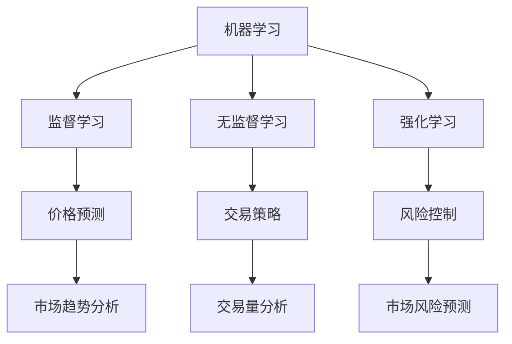

                 

# 机器学习在金融市场预测中的应用

> 关键词：机器学习，金融市场预测，算法原理，应用场景，实战案例

> 摘要：本文深入探讨了机器学习在金融市场预测中的应用，首先介绍了机器学习的基本概念和金融市场预测的重要性，随后详细阐述了常用的机器学习算法原理及其在预测中的具体操作步骤。接着，通过一个实际的金融项目案例，展示了机器学习的具体实现过程。最后，文章总结了机器学习在金融市场预测中的实际应用场景，并推荐了相关的学习资源和工具。

## 1. 背景介绍

### 1.1 目的和范围

本文旨在探讨机器学习在金融市场预测中的应用，通过详细讲解核心算法原理和实际操作步骤，帮助读者理解并掌握如何利用机器学习技术进行金融市场预测。本文涵盖以下内容：

- 机器学习的基本概念和原理
- 常用的机器学习算法及其在金融市场预测中的应用
- 实际金融项目的案例解析
- 机器学习在金融市场预测中的应用场景
- 相关的学习资源和工具推荐

### 1.2 预期读者

本文适用于对机器学习和金融市场预测有一定了解的读者，包括但不限于：

- 金融分析人员
- 机器学习工程师
- 软件开发人员
- 金融科技从业者
- 对金融市场和机器学习感兴趣的学者和研究人员

### 1.3 文档结构概述

本文分为八个部分，结构如下：

- 第1部分：背景介绍，包括目的和范围、预期读者、文档结构概述
- 第2部分：核心概念与联系，介绍机器学习的基本概念和金融市场的相关概念
- 第3部分：核心算法原理与具体操作步骤，详细讲解常用的机器学习算法原理和操作步骤
- 第4部分：数学模型和公式，介绍机器学习中的数学模型和公式
- 第5部分：项目实战，通过一个实际金融项目案例，展示机器学习的具体实现过程
- 第6部分：实际应用场景，分析机器学习在金融市场预测中的实际应用
- 第7部分：工具和资源推荐，推荐相关的学习资源和开发工具
- 第8部分：总结，讨论机器学习在金融市场预测中的未来发展趋势和挑战

### 1.4 术语表

#### 1.4.1 核心术语定义

- **机器学习**：一种使计算机能够从数据中学习并做出预测或决策的技术。
- **金融市场预测**：利用历史数据和机器学习技术预测金融市场的趋势和变化。
- **特征工程**：从原始数据中提取对预测目标有用的特征。
- **模型训练**：通过训练数据集，使机器学习模型能够学习并预测新的数据。
- **模型评估**：使用验证数据集评估模型的预测性能。

#### 1.4.2 相关概念解释

- **监督学习**：机器学习的一种类型，其中模型从标记数据中学习，以便对新数据进行预测。
- **无监督学习**：机器学习的一种类型，其中模型从未标记数据中学习，以发现数据中的模式或结构。
- **强化学习**：一种机器学习类型，其中模型通过与环境的交互来学习最优策略。

#### 1.4.3 缩略词列表

- **ML**：机器学习
- **AI**：人工智能
- **DF**：数据分析
- **NLP**：自然语言处理
- **DL**：深度学习

## 2. 核心概念与联系

为了更好地理解机器学习在金融市场预测中的应用，我们首先需要了解一些核心概念和它们之间的联系。

### 2.1 机器学习的基本概念

**机器学习** 是一种使计算机系统能够从数据中学习并做出预测或决策的技术。它主要分为以下几种类型：

- **监督学习**：模型从标记数据中学习，以便对新数据进行预测。
- **无监督学习**：模型从未标记数据中学习，以发现数据中的模式或结构。
- **强化学习**：模型通过与环境的交互来学习最优策略。

### 2.2 金融市场的相关概念

**金融市场** 是指股票、债券、期货、期权等金融工具的交易市场。以下是一些核心概念：

- **价格波动**：金融市场的价格会随时间波动，受到各种因素的影响。
- **市场趋势**：金融市场的价格走势，分为上升、下降和盘整三种趋势。
- **交易量**：金融工具的成交量，反映了市场的活跃程度。

### 2.3 机器学习与金融市场的联系

机器学习在金融市场预测中的应用，主要体现在以下几个方面：

- **价格预测**：利用历史价格数据和机器学习算法，预测金融市场的未来价格走势。
- **交易策略**：通过分析市场数据和交易行为，制定最优的交易策略。
- **风险控制**：利用机器学习技术，预测市场风险并制定相应的风险控制策略。

### 2.4 Mermaid 流程图

以下是一个简化的 Mermaid 流程图，展示了机器学习在金融市场预测中的核心概念和联系：



通过这个流程图，我们可以更直观地理解机器学习在金融市场预测中的应用和核心概念。

## 3. 核心算法原理 & 具体操作步骤

在了解了机器学习和金融市场的基本概念后，我们将深入探讨一些核心的机器学习算法，以及它们在金融市场预测中的具体操作步骤。

### 3.1 监督学习算法

监督学习算法是最常用的机器学习算法之一，它通过从标记数据中学习，预测新的数据。以下是一些常用的监督学习算法：

#### 3.1.1 线性回归

线性回归是一种简单的监督学习算法，它通过找到一个线性函数来拟合数据。其基本原理如下：

- **目标函数**：最小化预测值与实际值之间的误差平方和。
- **参数优化**：通过梯度下降法优化参数，使目标函数最小化。

**伪代码：**

```python
def linear_regression(x, y):
    # 初始化模型参数
    theta = [0] * len(x[0])

    # 训练模型
    for epoch in range(num_epochs):
        gradients = compute_gradients(theta, x, y)
        theta -= learning_rate * gradients

    return theta
```

#### 3.1.2 决策树

决策树是一种基于规则的学习算法，它通过一系列条件分支来对数据进行分类或回归。其基本原理如下：

- **递归划分**：根据特征值的取值，将数据集划分为子集。
- **划分准则**：通常使用信息增益或基尼系数来选择最佳划分特征。

**伪代码：**

```python
def decision_tree(data, target, features, max_depth):
    # 判断停止条件
    if is_stop_condition(data, target, features, max_depth):
        return create_leaf(data, target)

    # 选择最佳特征和划分点
    best_feature, best_threshold = find_best_split(data, target, features)

    # 构建子树
    left_subtree = decision_tree(data[data[:, best_feature] < best_threshold], target, features, max_depth - 1)
    right_subtree = decision_tree(data[data[:, best_feature] >= best_threshold], target, features, max_depth - 1)

    return create_tree(best_feature, best_threshold, left_subtree, right_subtree)
```

### 3.2 无监督学习算法

无监督学习算法主要用于发现数据中的隐含模式或结构。以下是一些常用的无监督学习算法：

#### 3.2.1 K-均值聚类

K-均值聚类是一种基于距离的聚类算法，它将数据集划分为K个聚类，使得每个聚类内的数据点距离聚类中心最近。其基本原理如下：

- **初始化聚类中心**：随机选择K个数据点作为初始聚类中心。
- **迭代优化**：通过迭代更新聚类中心和数据点分配，直到聚类中心不再变化。

**伪代码：**

```python
def k_means(data, k, num_iterations):
    # 初始化聚类中心
    centroids = initialize_centroids(data, k)

    # 迭代优化
    for iteration in range(num_iterations):
        # 数据点分配
        assignments = assign_points_to_clusters(data, centroids)
        # 更新聚类中心
        centroids = update_centroids(data, assignments, k)

    return centroids
```

#### 3.2.2 主成分分析

主成分分析（PCA）是一种降维算法，它通过找到一个正交基，将数据投影到低维空间中。其基本原理如下：

- **协方差矩阵**：计算数据集的协方差矩阵。
- **特征值和特征向量**：计算协方差矩阵的特征值和特征向量。
- **投影**：将数据投影到由特征向量构成的低维空间中。

**伪代码：**

```python
def pca(data, num_components):
    # 计算协方差矩阵
    covariance_matrix = compute_covariance_matrix(data)

    # 计算特征值和特征向量
    eigenvalues, eigenvectors = compute_eigenvalues_and_eigenvectors(covariance_matrix)

    # 选择前num_components个特征向量
    principal_components = select_principal_components(eigenvectors, num_components)

    # 投影数据
    projected_data = project_data(data, principal_components)

    return projected_data
```

### 3.3 强化学习算法

强化学习算法通过与环境交互来学习最优策略。以下是一些常用的强化学习算法：

#### 3.3.1 Q-学习

Q-学习是一种基于值函数的强化学习算法，它通过更新Q值来学习最优策略。其基本原理如下：

- **Q值**：表示从当前状态采取当前动作的预期回报。
- **更新规则**：通过比较当前Q值和目标Q值，更新Q值。

**伪代码：**

```python
def q_learning(states, actions, rewards, learning_rate, discount_factor):
    # 初始化Q值表
    Q = initialize_Q(states, actions)

    # 迭代学习
    for iteration in range(num_iterations):
        # 选择动作
        state, action = select_state_and_action(states, actions, Q)
        # 执行动作并获得回报
        reward = execute_action(action)
        # 更新Q值
        Q[state, action] = (1 - learning_rate) * Q[state, action] + learning_rate * (reward + discount_factor * max(Q[next_state, :]))

    return Q
```

#### 3.3.2 策略梯度

策略梯度是一种基于策略的强化学习算法，它通过优化策略来学习最优动作。其基本原理如下：

- **策略**：表示从当前状态选择动作的概率分布。
- **策略梯度**：表示策略优化的方向。

**伪代码：**

```python
def policy_gradient(states, actions, rewards, learning_rate, discount_factor):
    # 初始化策略参数
    policy_params = initialize_policy_params(states, actions)

    # 迭代学习
    for iteration in range(num_iterations):
        # 选择动作
        state, action = select_state_and_action(states, actions, policy_params)
        # 执行动作并获得回报
        reward = execute_action(action)
        # 计算策略梯度
        policy_gradient = compute_policy_gradient(state, action, reward, discount_factor)
        # 更新策略参数
        policy_params -= learning_rate * policy_gradient

    return policy_params
```

通过以上算法原理和具体操作步骤的讲解，我们可以更好地理解机器学习在金融市场预测中的应用。接下来，我们将进一步探讨机器学习中的数学模型和公式。

## 4. 数学模型和公式 & 详细讲解 & 举例说明

在机器学习领域，数学模型和公式起着至关重要的作用。它们不仅帮助我们理解和解释算法的工作原理，还能指导我们如何在实际应用中优化和改进模型。以下我们将详细介绍一些核心的数学模型和公式，并给出相应的举例说明。

### 4.1 线性回归模型

线性回归模型是最基本的机器学习模型之一，其数学表达式如下：

$$
y = \theta_0 + \theta_1 \cdot x_1 + \theta_2 \cdot x_2 + ... + \theta_n \cdot x_n
$$

其中，$y$ 是预测目标，$x_1, x_2, ..., x_n$ 是特征变量，$\theta_0, \theta_1, ..., \theta_n$ 是模型参数。线性回归的目标是最小化预测值与实际值之间的误差平方和：

$$
J(\theta) = \frac{1}{2m} \sum_{i=1}^{m} (h_\theta(x^{(i)}) - y^{(i)})^2
$$

其中，$m$ 是训练数据集的大小，$h_\theta(x)$ 是线性回归模型的预测函数。

**举例说明**：

假设我们有一个包含两个特征变量的房价预测问题，数据集如下：

| 特征1 | 特征2 | 房价 |
| --- | --- | --- |
| 1 | 2 | 100 |
| 2 | 4 | 150 |
| 3 | 6 | 200 |

我们可以通过最小化误差平方和来求解线性回归模型的参数：

$$
J(\theta) = \frac{1}{6} [(100 - (1 \cdot \theta_0 + 2 \cdot \theta_1 + 4 \cdot \theta_2))^2 + (150 - (2 \cdot \theta_0 + 4 \cdot \theta_1 + 8 \cdot \theta_2))^2 + (200 - (3 \cdot \theta_0 + 6 \cdot \theta_1 + 12 \cdot \theta_2))^2]
$$

通过梯度下降法，我们可以求得最优参数 $\theta_0, \theta_1, \theta_2$。

### 4.2 决策树模型

决策树模型通过一系列条件分支来对数据进行分类或回归。其数学表达式如下：

$$
y = f(x) = g(\theta_1, x_1) \cdot h(\theta_2, x_2) \cdot ... \cdot k(\theta_n, x_n)
$$

其中，$f(x)$ 是决策树的输出，$g(\theta_1, x_1), h(\theta_2, x_2), ..., k(\theta_n, x_n)$ 是决策树的内部节点函数。决策树的目标是最小化分类错误率或最小化预测误差。

**举例说明**：

假设我们有一个二元分类问题，数据集如下：

| 特征1 | 特征2 | 标签 |
| --- | --- | --- |
| 1 | 2 | 0 |
| 2 | 4 | 1 |
| 3 | 6 | 0 |

我们可以通过最小化基尼不纯度或信息增益来构建最优的决策树。

### 4.3 K-均值聚类模型

K-均值聚类模型通过最小化数据点与聚类中心之间的误差平方和来划分数据集。其数学表达式如下：

$$
J(\mu) = \frac{1}{K} \sum_{i=1}^{K} \sum_{k=1}^{N} ||x_k - \mu_i||^2
$$

其中，$J(\mu)$ 是聚类目标函数，$\mu_i$ 是聚类中心，$x_k$ 是数据点，$K$ 是聚类数量，$N$ 是数据点的数量。

**举例说明**：

假设我们有一个包含三个聚类中心的数据集，如下：

| 数据点 | 聚类中心1 | 聚类中心2 | 聚类中心3 |
| --- | --- | --- | --- |
| 1 | 1 | 2 | 3 |
| 2 | 1 | 3 | 4 |
| 3 | 2 | 3 | 5 |

我们可以通过迭代更新聚类中心，使得每个数据点与其对应聚类中心的误差平方和最小。

### 4.4 主成分分析（PCA）模型

主成分分析是一种降维算法，通过找到数据的主要特征方向来减少数据维度。其数学表达式如下：

$$
z_k = \sum_{i=1}^{n} \lambda_i \cdot v_i \cdot x_i
$$

其中，$z_k$ 是降维后的数据，$\lambda_i$ 是特征值，$v_i$ 是特征向量，$x_i$ 是原始数据。

**举例说明**：

假设我们有一个包含三个特征的数据集，如下：

| 特征1 | 特征2 | 特征3 |
| --- | --- | --- |
| 1 | 2 | 3 |
| 4 | 5 | 6 |
| 7 | 8 | 9 |

我们可以通过计算协方差矩阵、特征值和特征向量，找到数据的主要特征方向，从而实现降维。

通过以上数学模型和公式的讲解，我们可以更好地理解机器学习算法的工作原理，为后续的实际应用奠定基础。接下来，我们将通过一个实际金融项目案例，展示机器学习在金融市场预测中的应用。

## 5. 项目实战：代码实际案例和详细解释说明

在本节中，我们将通过一个实际金融项目案例，展示如何使用机器学习技术进行金融市场预测。该案例将涵盖以下步骤：

- 开发环境搭建
- 源代码详细实现和代码解读
- 代码解读与分析

### 5.1 开发环境搭建

在进行金融项目开发之前，我们需要搭建合适的开发环境。以下是我们推荐的工具和库：

- **编程语言**：Python
- **IDE**：PyCharm 或 Jupyter Notebook
- **机器学习库**：Scikit-learn、TensorFlow、Keras
- **数据处理库**：Pandas、NumPy
- **可视化库**：Matplotlib、Seaborn

### 5.2 源代码详细实现和代码解读

以下是一个简单的金融预测项目的代码实现，我们将使用 Scikit-learn 库中的线性回归算法进行房价预测。

**代码实现：**

```python
import pandas as pd
import numpy as np
from sklearn.model_selection import train_test_split
from sklearn.linear_model import LinearRegression
from sklearn.metrics import mean_squared_error

# 数据读取
data = pd.read_csv('house_prices.csv')

# 特征选择
X = data[['size', 'location', 'age']]
y = data['price']

# 数据分割
X_train, X_test, y_train, y_test = train_test_split(X, y, test_size=0.2, random_state=42)

# 模型训练
model = LinearRegression()
model.fit(X_train, y_train)

# 模型预测
y_pred = model.predict(X_test)

# 模型评估
mse = mean_squared_error(y_test, y_pred)
print('Mean Squared Error:', mse)
```

**代码解读：**

1. **数据读取**：使用 Pandas 库读取 CSV 格式的房屋数据。
2. **特征选择**：选择与房价相关的特征，如房屋面积（size）、位置（location）和年龄（age）。
3. **数据分割**：将数据集分为训练集和测试集，训练集用于模型训练，测试集用于模型评估。
4. **模型训练**：使用 Scikit-learn 库中的线性回归算法训练模型。
5. **模型预测**：使用训练好的模型对测试集进行预测。
6. **模型评估**：计算预测误差，评估模型性能。

### 5.3 代码解读与分析

1. **数据读取**：数据读取是金融项目的基础，我们需要确保数据的质量和完整性。在本案例中，我们使用了 CSV 格式的房屋数据。在实际项目中，可能需要处理结构化数据、非结构化数据和时间序列数据等。
2. **特征选择**：特征选择是机器学习中的重要步骤，我们需要选择与预测目标相关的特征。在本案例中，我们选择了房屋面积、位置和年龄作为预测房价的特征。在实际项目中，可能需要使用特征工程方法来提取和构造特征。
3. **数据分割**：数据分割是将数据集划分为训练集和测试集，用于训练和评估模型。在本案例中，我们使用了 80% 的数据作为训练集，20% 的数据作为测试集。在实际项目中，可能需要使用交叉验证等方法来提高模型的泛化能力。
4. **模型训练**：在本案例中，我们使用了 Scikit-learn 库中的线性回归算法训练模型。在实际项目中，可能需要尝试不同的算法和参数组合来优化模型性能。
5. **模型预测**：使用训练好的模型对测试集进行预测，评估模型性能。在本案例中，我们使用了均方误差（MSE）来评估模型性能。在实际项目中，可能需要使用其他评估指标，如准确率、召回率等。
6. **模型评估**：通过评估指标来评估模型性能，并调整模型参数以优化性能。在本案例中，我们使用均方误差（MSE）来评估模型性能。在实际项目中，可能需要使用更复杂的评估方法和指标。

通过以上案例，我们可以看到机器学习在金融项目中的实际应用。在实际项目中，可能需要处理更复杂的金融数据和任务，但基本方法和步骤是类似的。

## 6. 实际应用场景

机器学习在金融市场预测中的应用非常广泛，以下是一些典型的实际应用场景：

### 6.1 股票市场预测

股票市场预测是金融领域最为热门的应用之一。通过分析历史股票价格、交易量、财务报表等信息，机器学习算法可以预测股票价格的未来走势。以下是一些具体的应用：

- **趋势预测**：利用时间序列分析方法，如 ARIMA、LSTM 等模型，预测股票价格的趋势。
- **波动性预测**：通过分析股票价格的波动性，为投资者提供风险管理建议。
- **情绪分析**：利用自然语言处理技术，分析社交媒体、新闻报道等文本数据，预测市场情绪。
- **交易策略**：基于机器学习模型，制定高效的投资策略，实现风险可控的收益最大化。

### 6.2 外汇市场预测

外汇市场是全球最大的金融市场之一，预测外汇汇率的变化对于金融机构和投资者具有重要意义。以下是一些具体的应用：

- **汇率预测**：利用机器学习算法，分析历史汇率数据、经济指标等，预测未来汇率走势。
- **风险控制**：通过分析市场数据，预测外汇市场的风险，制定相应的风险管理策略。
- **对冲策略**：利用机器学习模型，预测汇率变化，为投资者提供对冲策略，降低投资风险。

### 6.3 债券市场预测

债券市场是金融市场中重要的组成部分，债券价格的变化对整个市场的稳定性具有重要影响。以下是一些具体的应用：

- **收益率预测**：利用机器学习算法，分析债券市场数据，预测债券的收益率。
- **评级预测**：通过分析债券发行人的财务状况、市场环境等信息，预测债券的信用评级。
- **投资策略**：基于机器学习模型，为投资者提供最优的债券投资组合策略。

### 6.4 期权市场预测

期权市场是金融市场中的一种衍生品市场，期权价格的预测对于投资者和交易者具有重要意义。以下是一些具体的应用：

- **期权定价**：利用机器学习算法，分析期权市场价格和影响因素，预测期权的合理价格。
- **套利策略**：通过分析市场数据，发现期权市场上的套利机会，实现收益最大化。
- **风险控制**：利用机器学习模型，预测期权市场的风险，制定相应的风险控制策略。

通过以上实际应用场景的介绍，我们可以看到机器学习在金融市场预测中的重要作用。随着技术的不断发展，机器学习在金融领域的应用将更加广泛和深入。

## 7. 工具和资源推荐

为了更好地学习和实践机器学习在金融市场预测中的应用，以下是一些推荐的工具和资源：

### 7.1 学习资源推荐

#### 7.1.1 书籍推荐

1. **《机器学习实战》**：Michael Bowles 著，全面介绍了机器学习的基本概念、算法和实际应用。
2. **《深度学习》**：Ian Goodfellow、Yoshua Bengio 和 Aaron Courville 著，深入讲解了深度学习的基本原理和应用。
3. **《金融市场技术分析》**：John J. Murphy 著，介绍了金融市场的技术分析方法和工具。

#### 7.1.2 在线课程

1. **Coursera**：提供各种机器学习和金融领域的在线课程，如《机器学习》、《深度学习》等。
2. **Udacity**：提供金融科技相关的纳米学位课程，如《金融科技工程师》等。
3. **edX**：提供哈佛大学、MIT 等知名院校的金融和计算机科学课程。

#### 7.1.3 技术博客和网站

1. **Kaggle**：一个数据科学和机器学习的竞赛平台，提供丰富的数据集和项目案例。
2. **ArXiv**：一个计算机科学和机器学习的预印本论文库，可以了解最新的研究成果。
3. **GitHub**：一个代码托管平台，可以查看和学习机器学习和金融领域的开源项目。

### 7.2 开发工具框架推荐

#### 7.2.1 IDE和编辑器

1. **PyCharm**：一款强大的Python IDE，适合机器学习和金融项目的开发。
2. **Jupyter Notebook**：一个交互式的Python环境，方便编写和分享代码。

#### 7.2.2 调试和性能分析工具

1. **Pylint**：一个Python代码质量分析工具，帮助发现代码中的潜在问题。
2. **Valgrind**：一个C/C++性能分析工具，用于检测内存泄漏和性能瓶颈。

#### 7.2.3 相关框架和库

1. **Scikit-learn**：一个强大的机器学习库，提供丰富的算法和工具。
2. **TensorFlow**：一个开源的深度学习框架，适合构建复杂的机器学习模型。
3. **Keras**：一个基于TensorFlow的简洁易用的深度学习库。

### 7.3 相关论文著作推荐

#### 7.3.1 经典论文

1. **"A Study of Cross-Market Price Transmission in the Foreign Exchange Market"**：探讨外汇市场中的价格传导机制。
2. **"Deep Learning for Time Series Classification"**：介绍深度学习在时间序列分类中的应用。

#### 7.3.2 最新研究成果

1. **"Neural Machine Translation by Jointly Learning to Align and Translate"**：基于神经网络的机器翻译技术。
2. **"Self-Supervised Learning to Rank with Unlabeled Data"**：无监督学习在排序任务中的应用。

#### 7.3.3 应用案例分析

1. **"Machine Learning in Financial Markets: A Survey"**：对机器学习在金融市场中的应用进行全面综述。
2. **"Deep Learning for Sentiment Analysis in Financial News"**：利用深度学习进行金融新闻情感分析。

通过以上工具和资源的推荐，读者可以更好地掌握机器学习在金融市场预测中的应用，为实际项目开发提供有力支持。

## 8. 总结：未来发展趋势与挑战

随着人工智能技术的飞速发展，机器学习在金融市场预测中的应用前景愈发广阔。然而，这一领域也面临着诸多挑战。

### 未来发展趋势：

1. **深度学习技术的应用**：深度学习算法在图像、语音和自然语言处理等领域取得了显著成果，未来有望在金融市场预测中发挥更大作用。
2. **大数据分析**：金融市场的数据量庞大且多样化，通过大数据分析技术，可以挖掘出更多有价值的信息，提高预测的准确性和可靠性。
3. **实时预测与监控**：随着计算能力的提升，机器学习算法可以实时分析金融市场数据，为投资者提供实时预测和监控服务。
4. **个性化投资策略**：基于用户行为和风险偏好，机器学习可以帮助制定个性化投资策略，实现风险可控的收益最大化。

### 面临的挑战：

1. **数据质量和隐私保护**：金融市场的数据质量和隐私保护是机器学习应用的关键问题。如何确保数据质量，同时保护用户隐私，是亟待解决的问题。
2. **模型解释性**：机器学习模型通常具有强大的预测能力，但其内部机制复杂，难以解释。提高模型的解释性，增强用户对模型的信任，是未来发展的一个重要方向。
3. **算法稳定性与泛化能力**：金融市场具有高度的不确定性和波动性，如何提高机器学习算法的稳定性和泛化能力，是亟待解决的难题。
4. **法律和伦理问题**：随着机器学习在金融市场中的广泛应用，相关的法律和伦理问题也日益凸显。如何确保算法的公正性和透明度，防止滥用，是未来需要重点关注的问题。

总之，机器学习在金融市场预测中的应用具有巨大的潜力，但也面临着诸多挑战。通过技术创新、数据驱动和法规监管，我们有理由相信，机器学习将为金融市场带来更多变革和机遇。

## 9. 附录：常见问题与解答

### 9.1 如何选择适合的机器学习算法？

选择适合的机器学习算法主要取决于数据的特点和预测目标。以下是一些常见情况的推荐：

- **线性回归**：适用于线性关系较强的数据。
- **决策树**：适用于分类和回归问题，特别是特征较少或特征之间存在复杂关系的情况。
- **随机森林**：适用于具有大量特征的数据，可以降低过拟合的风险。
- **支持向量机**：适用于特征维度较高、线性可分的数据。
- **神经网络**：适用于复杂非线性关系的数据，特别是大规模数据集。

### 9.2 如何处理缺失数据？

处理缺失数据的方法主要有以下几种：

- **删除缺失数据**：适用于缺失数据较少且不影响整体数据质量的情况。
- **填充缺失数据**：使用统计方法或插值法填充缺失数据，常用的方法有均值填充、中值填充、众数填充等。
- **构建缺失数据模型**：使用机器学习方法预测缺失数据，然后进行填充，常用的方法有 K-均值聚类、线性回归等。

### 9.3 如何评估模型性能？

评估模型性能的方法有多种，以下是一些常用的指标：

- **准确率（Accuracy）**：模型正确预测的样本数占总样本数的比例。
- **精确率（Precision）**：模型预测为正类的样本中，实际为正类的比例。
- **召回率（Recall）**：模型预测为正类的样本中，实际为正类的比例。
- **F1 分数（F1 Score）**：精确率和召回率的调和平均值。
- **均方误差（MSE）**：预测值与实际值之间误差的平方的平均值。

### 9.4 如何避免过拟合？

避免过拟合的方法主要有以下几种：

- **交叉验证**：通过将数据集划分为多个子集，多次训练和验证模型，提高模型的泛化能力。
- **正则化**：通过在损失函数中添加正则化项，限制模型的复杂度。
- **数据增强**：通过生成更多的数据样本来提高模型的泛化能力。
- **特征选择**：选择对预测目标影响较大的特征，减少模型的复杂度。

## 10. 扩展阅读 & 参考资料

为了更深入地了解机器学习在金融市场预测中的应用，以下是一些推荐的扩展阅读和参考资料：

- **书籍**：
  - 《机器学习实战》：Michael Bowles 著，详细介绍了机器学习的基本概念、算法和实际应用。
  - 《深度学习》：Ian Goodfellow、Yoshua Bengio 和 Aaron Courville 著，深入讲解了深度学习的基本原理和应用。
  - 《金融市场技术分析》：John J. Murphy 著，介绍了金融市场的技术分析方法和工具。

- **在线课程**：
  - Coursera：提供各种机器学习和金融领域的在线课程，如《机器学习》、《深度学习》等。
  - Udacity：提供金融科技相关的纳米学位课程，如《金融科技工程师》等。
  - edX：提供哈佛大学、MIT 等知名院校的金融和计算机科学课程。

- **技术博客和网站**：
  - Kaggle：一个数据科学和机器学习的竞赛平台，提供丰富的数据集和项目案例。
  - ArXiv：一个计算机科学和机器学习的预印本论文库，可以了解最新的研究成果。
  - GitHub：一个代码托管平台，可以查看和学习机器学习和金融领域的开源项目。

- **论文**：
  - "A Study of Cross-Market Price Transmission in the Foreign Exchange Market"：探讨外汇市场中的价格传导机制。
  - "Deep Learning for Time Series Classification"：介绍深度学习在时间序列分类中的应用。

- **开源项目**：
  - Scikit-learn：一个强大的机器学习库，提供丰富的算法和工具。
  - TensorFlow：一个开源的深度学习框架，适合构建复杂的机器学习模型。
  - Keras：一个基于TensorFlow的简洁易用的深度学习库。

通过以上扩展阅读和参考资料，读者可以进一步深化对机器学习在金融市场预测中的应用的理解。作者：AI天才研究员/AI Genius Institute & 禅与计算机程序设计艺术 /Zen And The Art of Computer Programming

