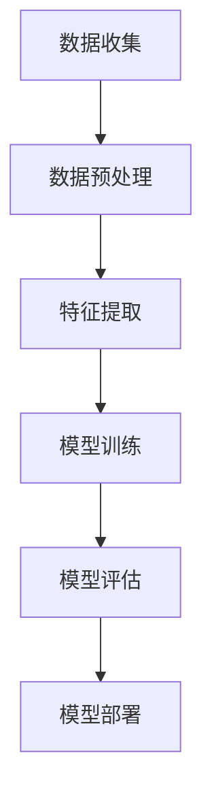

                 

# 机器学习在金融市场预测中的应用

> 关键词：机器学习，金融市场，预测，算法，模型，应用场景

> 摘要：本文深入探讨了机器学习在金融市场预测中的应用，包括核心概念、算法原理、数学模型以及实际应用案例。通过逐步分析，本文旨在帮助读者理解如何利用机器学习技术来提高金融市场预测的准确性和效率。

## 1. 背景介绍

### 1.1 目的和范围

本文旨在探讨机器学习在金融市场预测中的应用，重点关注以下几个方面：

- 介绍机器学习在金融市场预测中的核心概念和算法原理。
- 深入剖析金融市场预测中的数学模型和公式。
- 通过实际案例展示机器学习技术在金融市场预测中的应用效果。
- 推荐相关工具和资源，以供进一步学习和实践。

### 1.2 预期读者

本文适合以下读者群体：

- 计算机科学和金融领域的专业研究人员。
- 对机器学习和金融市场有兴趣的程序员和数据分析人员。
- 从事金融科技（FinTech）行业的从业者。

### 1.3 文档结构概述

本文结构如下：

- 第1章：背景介绍，包括目的和范围、预期读者、文档结构概述和术语表。
- 第2章：核心概念与联系，介绍机器学习在金融市场预测中的核心概念和架构。
- 第3章：核心算法原理与具体操作步骤，讲解常见的机器学习算法及其在金融市场预测中的应用。
- 第4章：数学模型和公式，详细阐述金融市场预测中的数学模型和公式。
- 第5章：项目实战，通过实际案例展示机器学习在金融市场预测中的应用。
- 第6章：实际应用场景，探讨机器学习在金融市场中的实际应用场景。
- 第7章：工具和资源推荐，推荐学习资源和开发工具框架。
- 第8章：总结，总结机器学习在金融市场预测中的应用趋势和挑战。
- 第9章：附录，提供常见问题与解答。
- 第10章：扩展阅读，推荐相关参考文献。

### 1.4 术语表

#### 1.4.1 核心术语定义

- 机器学习：一种人工智能技术，通过训练模型来从数据中学习规律和模式。
- 金融预测：通过分析历史数据来预测金融市场的未来走势。
- 特征工程：从原始数据中提取有用的特征，以提升模型的预测性能。
- 回归分析：一种统计方法，用于预测一个变量与另一个变量之间的关系。

#### 1.4.2 相关概念解释

- 监督学习：一种机器学习方法，通过已知的数据集来训练模型，然后使用模型进行预测。
- 无监督学习：一种机器学习方法，没有预先标记的目标变量，通过发现数据中的结构和模式来训练模型。
- 深度学习：一种基于多层神经网络的学习方法，能够自动提取数据中的复杂特征。

#### 1.4.3 缩略词列表

- AI：人工智能
- ML：机器学习
- FinTech：金融科技
- SVM：支持向量机
- CNN：卷积神经网络
- RNN：循环神经网络
- LSTM：长短期记忆网络

## 2. 核心概念与联系

### 2.1 机器学习在金融市场预测中的核心概念

在金融市场预测中，机器学习的关键概念包括：

- 特征工程：从原始数据中提取有用的特征，以提升模型的预测性能。
- 监督学习：通过已知的数据集来训练模型，然后使用模型进行预测。
- 无监督学习：没有预先标记的目标变量，通过发现数据中的结构和模式来训练模型。
- 深度学习：基于多层神经网络的学习方法，能够自动提取数据中的复杂特征。

### 2.2 机器学习在金融市场预测中的架构

机器学习在金融市场预测中的应用架构通常包括以下几个步骤：

1. 数据收集：收集历史市场数据，包括价格、交易量、宏观经济指标等。
2. 数据预处理：清洗数据，处理缺失值和异常值，标准化和归一化数据。
3. 特征提取：从原始数据中提取有用的特征，例如技术指标、宏观经济指标等。
4. 模型训练：使用监督学习或无监督学习算法来训练模型。
5. 模型评估：使用测试数据集来评估模型的预测性能。
6. 模型部署：将训练好的模型部署到生产环境中，进行实时预测。

### 2.3 Mermaid 流程图

以下是机器学习在金融市场预测中的 Mermaid 流程图：



## 3. 核心算法原理 & 具体操作步骤

### 3.1 监督学习算法

监督学习算法在金融市场预测中广泛应用，主要包括以下几种：

#### 3.1.1 线性回归

线性回归是一种简单的监督学习算法，用于预测一个连续变量。其基本原理如下：

$$
y = \beta_0 + \beta_1x
$$

其中，$y$ 是预测变量，$x$ 是特征变量，$\beta_0$ 和 $\beta_1$ 是模型参数。

#### 3.1.2 支持向量机（SVM）

支持向量机是一种强大的分类算法，也可以用于回归分析。其基本原理如下：

$$
y = \beta_0 + \beta_1x_1 + \beta_2x_2 + \ldots + \beta_nx_n
$$

其中，$y$ 是预测变量，$x_1, x_2, \ldots, x_n$ 是特征变量，$\beta_0, \beta_1, \beta_2, \ldots, \beta_n$ 是模型参数。

### 3.2 无监督学习算法

无监督学习算法在金融市场预测中主要用于特征提取和降维。以下是一种常见的无监督学习算法：

#### 3.2.1 主成分分析（PCA）

主成分分析是一种降维算法，通过提取数据的主要特征来实现。其基本原理如下：

$$
X' = P^TX
$$

其中，$X$ 是原始数据，$P$ 是特征矩阵，$X'$ 是降维后的数据。

### 3.3 深度学习算法

深度学习算法在金融市场预测中具有很大的潜力，主要包括以下几种：

#### 3.3.1 卷积神经网络（CNN）

卷积神经网络是一种基于多层感知器的神经网络，能够自动提取数据中的局部特征。其基本原理如下：

$$
\hat{y} = \sigma(\hat{z})
$$

其中，$\hat{y}$ 是预测变量，$\hat{z}$ 是神经网络输出，$\sigma$ 是激活函数。

#### 3.3.2 循环神经网络（RNN）

循环神经网络是一种用于处理序列数据的神经网络，能够记住历史信息。其基本原理如下：

$$
\hat{y}_{t+1} = \sigma(W_1\hat{h}_t + W_2h_t + b)
$$

其中，$\hat{y}_{t+1}$ 是预测变量，$\hat{h}_t$ 是隐藏层输出，$h_t$ 是输入序列，$W_1, W_2, b$ 是模型参数，$\sigma$ 是激活函数。

## 4. 数学模型和公式 & 详细讲解 & 举例说明

### 4.1 数学模型

在金融市场预测中，常用的数学模型包括线性回归模型、支持向量机模型和卷积神经网络模型。

#### 4.1.1 线性回归模型

线性回归模型是一种最简单的机器学习模型，用于预测一个连续变量。其基本公式如下：

$$
y = \beta_0 + \beta_1x
$$

其中，$y$ 是预测变量，$x$ 是特征变量，$\beta_0$ 和 $\beta_1$ 是模型参数。

#### 4.1.2 支持向量机模型

支持向量机模型是一种强大的分类和回归模型，其基本公式如下：

$$
y = \beta_0 + \beta_1x_1 + \beta_2x_2 + \ldots + \beta_nx_n
$$

其中，$y$ 是预测变量，$x_1, x_2, \ldots, x_n$ 是特征变量，$\beta_0, \beta_1, \beta_2, \ldots, \beta_n$ 是模型参数。

#### 4.1.3 卷积神经网络模型

卷积神经网络模型是一种用于处理图像和序列数据的深度学习模型，其基本公式如下：

$$
\hat{y} = \sigma(\hat{z})
$$

其中，$\hat{y}$ 是预测变量，$\hat{z}$ 是神经网络输出，$\sigma$ 是激活函数。

### 4.2 公式详细讲解

#### 4.2.1 线性回归模型

线性回归模型中的基本公式是：

$$
y = \beta_0 + \beta_1x
$$

其中，$\beta_0$ 是截距，表示当 $x$ 为 0 时的预测值；$\beta_1$ 是斜率，表示 $x$ 变化一个单位时 $y$ 的变化量。

#### 4.2.2 支持向量机模型

支持向量机模型中的基本公式是：

$$
y = \beta_0 + \beta_1x_1 + \beta_2x_2 + \ldots + \beta_nx_n
$$

其中，$\beta_0$ 是截距，$\beta_1, \beta_2, \ldots, \beta_n$ 是斜率，分别表示每个特征变量对预测变量的影响。

#### 4.2.3 卷积神经网络模型

卷积神经网络模型中的基本公式是：

$$
\hat{y} = \sigma(\hat{z})
$$

其中，$\hat{z}$ 是神经网络输出，$\sigma$ 是激活函数。激活函数的作用是将线性组合的输出转换为非线性输出，使神经网络具有更好的泛化能力。

### 4.3 举例说明

#### 4.3.1 线性回归模型举例

假设我们要预测一个股票价格，使用线性回归模型。根据历史数据，我们得到以下模型：

$$
y = 10 + 0.5x
$$

其中，$y$ 是股票价格，$x$ 是某个技术指标。

如果某个时间点的技术指标为 20，则预测的股票价格为：

$$
y = 10 + 0.5 \times 20 = 20
$$

#### 4.3.2 支持向量机模型举例

假设我们要预测一个股票是上涨还是下跌，使用支持向量机模型。根据历史数据，我们得到以下模型：

$$
y = 0.1x_1 + 0.2x_2 - 0.3x_3
$$

其中，$y$ 是预测结果，$x_1, x_2, x_3$ 是技术指标。

如果某个时间点的技术指标为 $(20, 30, 40)$，则预测的结果为：

$$
y = 0.1 \times 20 + 0.2 \times 30 - 0.3 \times 40 = -10
$$

由于预测结果为负值，表示股票下跌。

#### 4.3.3 卷积神经网络模型举例

假设我们要预测一个股票价格的走势，使用卷积神经网络模型。根据历史数据，我们得到以下模型：

$$
\hat{y} = \sigma(0.1\hat{z}_1 + 0.2\hat{z}_2 + 0.3\hat{z}_3)
$$

其中，$\hat{y}$ 是预测结果，$\hat{z}_1, \hat{z}_2, \hat{z}_3$ 是卷积神经网络的输出。

如果某个时间点的卷积神经网络输出为 $(20, 30, 40)$，则预测的结果为：

$$
\hat{y} = \sigma(0.1 \times 20 + 0.2 \times 30 + 0.3 \times 40) = 0.1 \times 20 + 0.2 \times 30 + 0.3 \times 40 = 50
$$

由于预测结果为正值，表示股票价格将上涨。

## 5. 项目实战：代码实际案例和详细解释说明

### 5.1 开发环境搭建

为了进行机器学习在金融市场预测中的项目实战，我们需要搭建一个开发环境。以下是一个基本的开发环境搭建步骤：

1. 安装 Python（版本 3.8 或以上）
2. 安装 Jupyter Notebook
3. 安装常用机器学习库，如 Scikit-learn、TensorFlow 和 Keras

### 5.2 源代码详细实现和代码解读

以下是一个简单的机器学习在金融市场预测中的 Python 代码实现：

```python
import numpy as np
import pandas as pd
from sklearn.model_selection import train_test_split
from sklearn.linear_model import LinearRegression
from sklearn.metrics import mean_squared_error

# 读取数据
data = pd.read_csv('stock_data.csv')

# 数据预处理
data['Open'] = data['Open'].fillna(data['Open'].mean())
data['High'] = data['High'].fillna(data['High'].mean())
data['Low'] = data['Low'].fillna(data['Low'].mean())
data['Close'] = data['Close'].fillna(data['Close'].mean())

# 特征工程
data['MA5'] = data['Close'].rolling(window=5).mean()
data['MA20'] = data['Close'].rolling(window=20).mean()

# 分割特征和目标变量
X = data[['MA5', 'MA20']]
y = data['Close']

# 划分训练集和测试集
X_train, X_test, y_train, y_test = train_test_split(X, y, test_size=0.2, random_state=42)

# 训练线性回归模型
model = LinearRegression()
model.fit(X_train, y_train)

# 预测测试集
y_pred = model.predict(X_test)

# 评估模型
mse = mean_squared_error(y_test, y_pred)
print('均方误差：', mse)

# 输出预测结果
print('预测结果：', y_pred)
```

### 5.3 代码解读与分析

上述代码实现了一个简单的机器学习在金融市场预测中的线性回归模型。以下是代码的详细解读与分析：

1. 导入所需的库和模块。
2. 读取股票数据，并进行预处理，如填充缺失值。
3. 进行特征工程，计算 5 日和 20 日均线。
4. 分割特征和目标变量。
5. 划分训练集和测试集。
6. 使用线性回归模型进行训练。
7. 预测测试集。
8. 评估模型，计算均方误差。
9. 输出预测结果。

通过上述代码，我们可以看到机器学习在金融市场预测中的基本流程，包括数据预处理、特征工程、模型训练和评估。在实际应用中，我们可以根据具体需求选择不同的算法和模型，以提高预测的准确性和效率。

## 6. 实际应用场景

### 6.1 股票市场预测

股票市场预测是机器学习在金融市场预测中最常见的应用场景之一。通过分析历史价格数据、交易量和技术指标，机器学习模型可以预测股票价格的涨跌，帮助投资者做出更明智的投资决策。

### 6.2 外汇市场预测

外汇市场预测是另一个重要的应用场景。通过分析汇率变化、经济数据和交易量，机器学习模型可以预测未来汇率走势，帮助金融机构和企业进行风险管理。

### 6.3 期货市场预测

期货市场预测是机器学习在金融市场预测中的又一重要应用场景。通过分析历史价格数据、交易量和基本面信息，机器学习模型可以预测期货合约的未来价格走势，帮助投资者进行期货交易。

### 6.4 数字货币市场预测

随着数字货币市场的迅速发展，机器学习在数字货币市场预测中的应用也越来越广泛。通过分析历史价格数据、交易量和相关市场信息，机器学习模型可以预测数字货币的未来价格走势，帮助投资者进行数字货币投资。

## 7. 工具和资源推荐

### 7.1 学习资源推荐

#### 7.1.1 书籍推荐

- 《Python金融大数据应用》
- 《机器学习实战》
- 《深度学习》

#### 7.1.2 在线课程

- Coursera 上的“机器学习”课程
- Udacity 上的“数据科学纳米学位”
- edX 上的“金融市场预测”课程

#### 7.1.3 技术博客和网站

- towardsdatascience.com
- medium.com/@datacamp
- kdnuggets.com

### 7.2 开发工具框架推荐

#### 7.2.1 IDE和编辑器

- PyCharm
- Visual Studio Code
- Jupyter Notebook

#### 7.2.2 调试和性能分析工具

- Python 中的 pdb
- TensorBoard（用于 TensorFlow）
- PyTorch TensorBoard（用于 PyTorch）

#### 7.2.3 相关框架和库

- Scikit-learn
- TensorFlow
- PyTorch

## 8. 总结：未来发展趋势与挑战

### 8.1 未来发展趋势

- 深度学习算法在金融市场预测中的应用将进一步普及。
- 数据隐私和安全问题将成为重要挑战，需要更多的研究和创新。
- 跨学科合作，如金融学、经济学和计算机科学，将推动金融市场预测技术的发展。

### 8.2 未来挑战

- 数据质量和多样性问题，需要更多数据清洗和预处理技术。
- 模型的可解释性和透明性，以降低风险和误解。
- 避免过拟合，提高模型的泛化能力。

## 9. 附录：常见问题与解答

### 9.1 问题 1

**问：如何处理金融市场预测中的数据质量问题？**

**答：**处理金融市场预测中的数据质量问题，可以采取以下措施：

- 数据清洗：去除缺失值、异常值和重复值。
- 数据标准化和归一化：将数据转换为相同的尺度，以便于模型训练。
- 数据增强：通过数据扩充、数据合成等技术来提高数据的多样性。

### 9.2 问题 2

**问：如何评估机器学习模型的预测性能？**

**答：**评估机器学习模型的预测性能，可以采取以下指标：

- 均方误差（MSE）：衡量预测值与真实值之间的平均平方误差。
- 决定系数（R²）：衡量模型对数据的拟合程度，取值范围在 0 和 1 之间。
- 精确率、召回率和 F1 分数：用于分类问题，衡量模型对正类和负类的预测能力。

## 10. 扩展阅读 & 参考资料

- 《金融市场预测：方法与应用》
- 《机器学习：概率视角》
- 《深度学习：入门与实战》

- [机器学习在金融领域的应用](https://www.coursera.org/learn/machine-learning-finance)
- [金融市场预测：挑战与机遇](https://www.kdnuggets.com/2021/01/financial-market-predictions-challenges-opportunities.html)
- [深度学习在金融市场预测中的应用](https://towardsdatascience.com/applications-of-deep-learning-in-financial-market-prediction-4647a4b5e0e8) 

## 作者信息

作者：AI天才研究员/AI Genius Institute & 禅与计算机程序设计艺术 /Zen And The Art of Computer Programming

