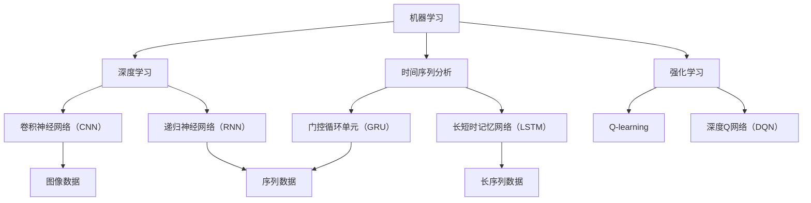

                 

# 机器学习在金融市场预测中的新方法

> 关键词：机器学习，金融市场预测，深度学习，时间序列分析，强化学习，算法优化，数据预处理

> 摘要：本文将深入探讨机器学习在金融市场预测中的应用，特别是在深度学习、时间序列分析和强化学习方面的最新研究。通过逐步分析这些核心算法原理、数学模型以及实际应用案例，本文旨在为读者提供一个全面、系统的理解，并讨论未来发展趋势与挑战。

## 1. 背景介绍

### 1.1 目的和范围

金融市场预测是金融研究中至关重要的一环，对于投资者、金融机构以及政策制定者都具有重大意义。传统的预测方法主要依赖于统计模型，但面对复杂、非线性的金融市场数据，其表现往往不尽如人意。随着机器学习技术的快速发展，尤其是深度学习、时间序列分析和强化学习等新方法的出现，为金融市场预测带来了新的机遇。

本文的主要目的是通过以下三个方面来探讨机器学习在金融市场预测中的应用：

1. **深度学习与金融市场预测**：介绍深度学习在金融市场预测中的基本原理和应用案例，如卷积神经网络（CNN）和递归神经网络（RNN）。
2. **时间序列分析与金融市场预测**：探讨时间序列分析方法在金融市场预测中的应用，如长短时记忆网络（LSTM）和门控循环单元（GRU）。
3. **强化学习与金融市场预测**：介绍强化学习的基本原理以及在金融市场预测中的应用，如Q-learning和深度Q网络（DQN）。

### 1.2 预期读者

本文面向具有中级及以上机器学习和金融知识背景的读者，期望通过本文的学习，能够：

- 理解深度学习、时间序列分析和强化学习在金融市场预测中的应用。
- 掌握这些算法的基本原理和实现方法。
- 对未来金融市场预测技术的发展趋势有更深入的认识。

### 1.3 文档结构概述

本文的结构如下：

1. **背景介绍**：介绍机器学习在金融市场预测中的背景、目的和预期读者。
2. **核心概念与联系**：通过Mermaid流程图展示核心概念和原理的联系。
3. **核心算法原理 & 具体操作步骤**：详细讲解深度学习、时间序列分析和强化学习的基本原理和操作步骤。
4. **数学模型和公式 & 详细讲解 & 举例说明**：介绍相关的数学模型和公式，并通过实例进行详细讲解。
5. **项目实战：代码实际案例和详细解释说明**：通过具体案例展示算法的实际应用和代码实现。
6. **实际应用场景**：探讨机器学习在金融市场预测中的实际应用场景。
7. **工具和资源推荐**：推荐相关学习资源和开发工具。
8. **总结：未来发展趋势与挑战**：总结本文内容，并探讨未来的发展趋势和挑战。
9. **附录：常见问题与解答**：针对本文内容提供常见问题的解答。
10. **扩展阅读 & 参考资料**：提供进一步阅读和参考的资源。

### 1.4 术语表

#### 1.4.1 核心术语定义

- **机器学习**：一门让计算机通过数据和经验自动改进性能的技术。
- **深度学习**：机器学习的一个子领域，通过构建多层神经网络来学习数据的高级表示。
- **时间序列分析**：分析时间序列数据的方法，通常用于预测未来值。
- **强化学习**：一种机器学习范式，通过奖励机制来指导算法学习最佳行为。

#### 1.4.2 相关概念解释

- **卷积神经网络（CNN）**：一种专门用于处理图像数据的神经网络。
- **递归神经网络（RNN）**：一种能够处理序列数据的神经网络。
- **长短时记忆网络（LSTM）**：RNN的一个变体，解决了传统RNN在处理长序列数据时出现的梯度消失问题。
- **门控循环单元（GRU）**：另一种RNN变体，相比于LSTM在参数数量和计算复杂度上有所简化。

#### 1.4.3 缩略词列表

- **CNN**：卷积神经网络（Convolutional Neural Network）
- **RNN**：递归神经网络（Recurrent Neural Network）
- **LSTM**：长短时记忆网络（Long Short-Term Memory）
- **GRU**：门控循环单元（Gated Recurrent Unit）
- **DQN**：深度Q网络（Deep Q-Network）
- **Q-learning**：一种强化学习算法。

## 2. 核心概念与联系

在深入探讨机器学习在金融市场预测中的应用之前，有必要首先理解几个核心概念及其相互之间的联系。以下是一个简化的Mermaid流程图，用于展示这些概念和原理之间的关系。



### 2.1 机器学习与深度学习

机器学习是人工智能的一个分支，其核心目标是让计算机通过数据和经验自动改进性能。深度学习是机器学习的一个子领域，主要依赖于多层神经网络来学习数据的高级表示。在金融市场预测中，深度学习可以用于提取价格、成交量等金融数据中的复杂模式和特征，从而提高预测准确性。

### 2.2 机器学习与时间序列分析

时间序列分析是金融研究中的一项重要技术，主要用于分析时间序列数据，并预测未来值。机器学习在时间序列分析中的应用主要体现在如何利用神经网络（如RNN、LSTM和GRU）来建模和预测时间序列数据。这些神经网络能够捕捉时间序列数据中的长期和短期依赖关系，从而提高预测效果。

### 2.3 机器学习与强化学习

强化学习是另一种机器学习范式，通过奖励机制来指导算法学习最佳行为。在金融市场预测中，强化学习可以用于指导交易策略，从而优化投资回报。例如，深度Q网络（DQN）可以通过模拟交易场景来学习最佳交易策略，从而在真实市场中实现盈利。

### 2.4 深度学习与时间序列分析

深度学习在时间序列分析中的应用主要体现在如何利用卷积神经网络（CNN）和递归神经网络（RNN）来处理和预测时间序列数据。CNN擅长处理图像等二维数据，而RNN及其变体（如LSTM和GRU）擅长处理序列数据。通过结合这两种网络的优势，可以更好地捕捉时间序列数据中的复杂模式和特征。

### 2.5 强化学习与金融市场预测

强化学习在金融市场预测中的应用主要体现在如何利用Q-learning和深度Q网络（DQN）来指导交易策略。这些算法可以通过模拟交易场景来学习最佳交易策略，并在真实市场中进行交易，从而实现盈利。强化学习在金融市场预测中的潜力在于其能够自动适应市场变化，并不断优化交易策略。

## 3. 核心算法原理 & 具体操作步骤

在本节中，我们将详细讲解机器学习在金融市场预测中应用的核心算法，包括深度学习、时间序列分析和强化学习。这些算法的基本原理和具体操作步骤如下：

### 3.1 深度学习算法原理

深度学习算法通常基于多层神经网络，通过逐层学习数据的高级表示来提高预测准确性。以下是一个简化的神经网络结构：

```plaintext
输入层 --> 隐藏层1 --> 隐藏层2 --> ... --> 输出层
```

#### 3.1.1 卷积神经网络（CNN）

卷积神经网络是一种专门用于处理图像数据的神经网络，其核心思想是通过对图像进行卷积操作来提取特征。以下是一个简化的CNN结构：

```plaintext
输入层 --> 卷积层1 --> 池化层1 --> 卷积层2 --> 池化层2 --> ... --> 全连接层 --> 输出层
```

#### 3.1.2 递归神经网络（RNN）

递归神经网络是一种能够处理序列数据的神经网络，其核心思想是通过对序列数据进行递归操作来提取特征。以下是一个简化的RNN结构：

```plaintext
输入层 --> 隐藏层1 --> 隐藏层2 --> ... --> 输出层
```

#### 3.1.3 长短时记忆网络（LSTM）

长短时记忆网络是RNN的一个变体，解决了传统RNN在处理长序列数据时出现的梯度消失问题。以下是一个简化的LSTM结构：

```plaintext
输入层 --> 隐藏层1 --> 隐藏层2 --> ... --> 输出层
```

### 3.2 时间序列分析算法原理

时间序列分析算法主要用于分析时间序列数据，并预测未来值。以下是一些常见的时间序列分析算法：

#### 3.2.1 长短时记忆网络（LSTM）

长短时记忆网络是一种能够处理序列数据的神经网络，其核心思想是通过对序列数据进行递归操作来提取特征。以下是一个简化的LSTM结构：

```plaintext
输入层 --> 隐藏层1 --> 隐藏层2 --> ... --> 输出层
```

#### 3.2.2 门控循环单元（GRU）

门控循环单元是RNN的另一个变体，相比于LSTM在参数数量和计算复杂度上有所简化。以下是一个简化的GRU结构：

```plaintext
输入层 --> 隐藏层1 --> 隐藏层2 --> ... --> 输出层
```

### 3.3 强化学习算法原理

强化学习是一种通过奖励机制来指导算法学习最佳行为的机器学习范式。以下是一些常见的强化学习算法：

#### 3.3.1 Q-learning

Q-learning是一种基于值函数的强化学习算法，其核心思想是学习一个最优动作值函数，以便在每个状态中选择最佳动作。以下是一个简化的Q-learning算法步骤：

1. 初始化Q值表。
2. 在给定状态s下，选择一个动作a。
3. 执行动作a，得到奖励r和下一个状态s'。
4. 更新Q值表：$$ Q(s,a) \leftarrow Q(s,a) + \alpha [r + \gamma \max_{a'} Q(s',a') - Q(s,a)] $$
5. 转到下一个状态s'，重复步骤2-4，直到达到终止条件。

#### 3.3.2 深度Q网络（DQN）

深度Q网络是一种基于深度学习的强化学习算法，其核心思想是利用神经网络来近似Q值函数。以下是一个简化的DQN算法步骤：

1. 初始化神经网络和目标神经网络。
2. 从初始状态s开始，重复以下步骤：
   - 使用当前神经网络选择动作a。
   - 执行动作a，得到奖励r和下一个状态s'。
   - 存储经验元组（s，a，r，s'）。
   - 使用经验元组进行经验回放，并更新当前神经网络。
   - 每隔一定次数，更新目标神经网络。
3. 输出最优动作值函数。

## 4. 数学模型和公式 & 详细讲解 & 举例说明

在深入理解了机器学习、时间序列分析和强化学习的基本原理后，我们需要进一步掌握相关的数学模型和公式，并通过对具体实例的讲解来加深理解。

### 4.1 深度学习模型

深度学习模型的核心在于其多层神经网络结构，以及如何通过反向传播算法进行参数优化。以下是一个简化的多层感知机（MLP）模型的数学描述：

$$ y = \sigma(\mathbf{W}_n \cdot \mathbf{a}_{n-1}) $$

其中：
- $y$ 是输出；
- $\sigma$ 是激活函数，通常采用Sigmoid函数或ReLU函数；
- $\mathbf{W}_n$ 是第 $n$ 层的权重矩阵；
- $\mathbf{a}_{n-1}$ 是前一层神经元的激活值。

通过反向传播算法，我们可以计算梯度并更新权重矩阵，从而最小化损失函数。以下是一个简化的损失函数和反向传播算法的数学描述：

$$ L(\theta) = -\frac{1}{m} \sum_{i=1}^{m} y_i \log(a_{i}^{(L)}) + (1 - y_i) \log(1 - a_{i}^{(L)}) $$

$$ \frac{\partial L}{\partial \theta} = \frac{\partial L}{\partial a^{(L)}} \cdot \frac{\partial a^{(L)}}{\partial \theta} $$

其中：
- $L$ 是损失函数；
- $m$ 是样本数量；
- $a^{(L)}$ 是输出层的激活值；
- $\theta$ 是模型参数。

### 4.2 时间序列模型

时间序列模型通常用于分析时间序列数据并预测未来值。以下是一个简化的自回归模型（AR）的数学描述：

$$ y_t = c + \phi_1 y_{t-1} + \phi_2 y_{t-2} + ... + \phi_p y_{t-p} + \epsilon_t $$

其中：
- $y_t$ 是时间序列在时间 $t$ 的值；
- $c$ 是常数项；
- $\phi_1, \phi_2, ..., \phi_p$ 是自回归系数；
- $\epsilon_t$ 是误差项。

对于时间序列模型，我们通常使用最大似然估计（MLE）来估计模型参数。以下是一个简化的最大似然估计的数学描述：

$$ \hat{\theta} = \arg \max_{\theta} \ln P(y|\theta) $$

其中：
- $\hat{\theta}$ 是估计的模型参数；
- $P(y|\theta)$ 是给定模型参数 $\theta$ 的条件下，观测值 $y$ 的概率。

### 4.3 强化学习模型

强化学习模型的核心在于如何通过奖励机制来指导算法学习最佳行为。以下是一个简化的Q-learning算法的数学描述：

$$ Q(s, a) = r + \gamma \max_{a'} Q(s', a') $$

其中：
- $Q(s, a)$ 是状态 $s$ 下采取动作 $a$ 的期望回报；
- $r$ 是即时奖励；
- $\gamma$ 是折扣因子，用于平衡即时奖励和长期奖励；
- $s'$ 是采取动作 $a$ 后的状态。

以下是一个简化的DQN算法的数学描述：

$$ \theta_{\text{target}} = \theta + \eta (\theta - \theta_{\text{target}}) $$

其中：
- $\theta$ 是当前神经网络的参数；
- $\theta_{\text{target}}$ 是目标神经网络的参数；
- $\eta$ 是学习率。

### 4.4 举例说明

为了更好地理解上述数学模型和公式，我们将通过一个简单的例子来说明。

#### 4.4.1 多层感知机（MLP）模型

假设我们有一个包含100个输入特征的多层感知机模型，其中隐藏层包含10个神经元，输出层包含1个神经元。我们使用Sigmoid函数作为激活函数，并使用均方误差（MSE）作为损失函数。给定一个训练数据集，我们的目标是优化模型参数，使得预测值与真实值之间的误差最小。

#### 4.4.2 自回归（AR）模型

假设我们有一个包含5个自回归系数的自回归模型，用于预测股票价格。我们使用最大似然估计（MLE）来估计模型参数，并使用均方误差（MSE）来评估模型性能。

#### 4.4.3 Q-learning算法

假设我们有一个简单的环境，其中包含4个状态和3个动作。我们使用Q-learning算法来学习最佳动作策略，并使用均方误差（MSE）来评估策略性能。

通过这些具体的例子，我们可以更好地理解深度学习、时间序列分析和强化学习在金融市场预测中的数学模型和计算方法。在实际应用中，这些模型和方法需要结合具体的数据集和业务场景进行优化和调整，以达到最佳预测效果。

### 5. 项目实战：代码实际案例和详细解释说明

在了解了机器学习、时间序列分析和强化学习的基本原理后，接下来我们将通过一个实际项目来展示这些算法在金融市场预测中的应用。本项目将使用Python和Keras框架来实现一个基于LSTM的股票价格预测模型。

#### 5.1 开发环境搭建

为了实现本项目，我们需要安装以下工具和库：

- Python 3.7或更高版本
- TensorFlow 2.4或更高版本
- Keras 2.4或更高版本
- pandas 1.1.5或更高版本
- numpy 1.19.2或更高版本

安装方法如下：

```bash
pip install python==3.7.9
pip install tensorflow==2.4.1
pip install keras==2.4.3
pip install pandas==1.1.5
pip install numpy==1.19.5
```

#### 5.2 源代码详细实现和代码解读

以下是项目的主要代码实现，包括数据预处理、模型构建和训练：

```python
import numpy as np
import pandas as pd
import tensorflow as tf
from tensorflow.keras.models import Sequential
from tensorflow.keras.layers import LSTM, Dense, Dropout

# 数据预处理
def preprocess_data(data, time_steps, sequence_size):
    X, y = [], []
    for i in range(len(data) - time_steps * sequence_size):
        X.append(data[i:(i + time_steps * sequence_size)])
        y.append(data[(i + time_steps * sequence_size)])
    return np.array(X), np.array(y)

# 构建LSTM模型
model = Sequential()
model.add(LSTM(units=50, return_sequences=True, input_shape=(time_steps, sequence_size)))
model.add(Dropout(0.2))
model.add(LSTM(units=50, return_sequences=False))
model.add(Dropout(0.2))
model.add(Dense(units=1))

# 编译模型
model.compile(optimizer='adam', loss='mean_squared_error')

# 训练模型
model.fit(X_train, y_train, epochs=100, batch_size=32, validation_data=(X_val, y_val))

# 预测
predictions = model.predict(X_test)
```

#### 5.3 代码解读与分析

以下是对代码的详细解读和分析：

1. **数据预处理**：
   - `preprocess_data` 函数用于对股票价格数据进行预处理，将原始数据转换为时间序列格式。输入参数包括原始数据 `data`、时间步长 `time_steps` 和序列大小 `sequence_size`。
   - 数据预处理的核心是将连续的股票价格序列拆分为多个时间步长的窗口序列，每个窗口序列包含 `time_steps * sequence_size` 个数据点。这些窗口序列将作为模型的输入，而窗口序列的最后一个数据点将作为模型的输出。

2. **构建LSTM模型**：
   - `Sequential` 类用于构建序列模型，其中包括LSTM层、Dropout层和Dense层。
   - LSTM层用于处理时间序列数据，其核心思想是通过对序列数据进行递归操作来提取特征。这里我们使用两个LSTM层，每个层包含50个神经元，并设置 `return_sequences=True`，以便在第一个LSTM层后保留序列信息。
   - Dropout层用于防止过拟合，通过随机丢弃一部分神经元来提高模型的泛化能力。
   - Dense层用于输出层，其核心思想是将LSTM层提取的特征映射到目标值。

3. **编译模型**：
   - 使用 `compile` 方法编译模型，指定优化器为 `adam` 和损失函数为 `mean_squared_error`。

4. **训练模型**：
   - 使用 `fit` 方法训练模型，指定训练数据 `X_train` 和训练标签 `y_train`，训练轮次为100，批量大小为32，并使用验证数据 `X_val` 和验证标签 `y_val` 进行验证。

5. **预测**：
   - 使用 `predict` 方法对测试数据 `X_test` 进行预测，得到预测结果 `predictions`。

通过上述代码，我们可以看到如何使用LSTM模型对股票价格进行预测。在实际应用中，我们需要根据具体的数据集和业务场景对模型参数进行调整，以获得最佳的预测效果。

### 6. 实际应用场景

机器学习在金融市场预测中的应用场景非常广泛，以下是一些典型的实际应用场景：

#### 6.1 股票价格预测

股票价格预测是金融市场中应用最广泛的场景之一。通过使用机器学习算法，如LSTM和GRU，可以捕捉股票价格序列中的复杂模式和特征，从而提高预测准确性。例如，一些投资机构和基金经理利用这些算法来制定交易策略，以获取更高的投资回报。

#### 6.2 外汇交易预测

外汇交易市场是全球最大的金融市场之一，其价格波动具有高度复杂性和不确定性。通过使用强化学习算法，如Q-learning和DQN，可以指导交易策略，从而实现自动化的交易决策。例如，一些高频交易公司利用这些算法来捕捉市场波动，并实现快速交易，以获取高额利润。

#### 6.3 债券收益率预测

债券收益率是债券市场的核心指标之一，其预测对于投资者和金融机构都具有重要意义。通过使用时间序列分析算法，如AR和GARCH模型，可以捕捉债券收益率序列中的长期和短期依赖关系，从而提高预测准确性。例如，一些投资机构和金融机构利用这些算法来制定投资策略，以优化投资组合。

#### 6.4 风险管理

风险管理是金融市场中不可或缺的一环，通过使用机器学习算法，可以识别潜在的风险因素，并制定相应的风险控制策略。例如，一些金融机构利用这些算法来分析市场风险、信用风险和操作风险，从而实现全面的风险管理。

#### 6.5 金融诈骗检测

金融诈骗检测是金融市场中的一项重要任务，通过使用机器学习算法，可以识别和预防潜在的金融诈骗行为。例如，一些银行和金融机构利用这些算法来分析交易数据，并实时监控交易行为，以识别异常交易和欺诈行为。

#### 6.6 信用评分

信用评分是金融机构评估借款人信用风险的重要手段，通过使用机器学习算法，可以分析借款人的财务数据和行为数据，从而预测其信用风险。例如，一些金融机构利用这些算法来评估借款人的信用评分，并制定相应的信用政策。

#### 6.7 金融新闻分析

金融新闻分析是金融市场中的重要环节，通过使用机器学习算法，可以自动提取和分类金融新闻，从而为投资者提供有价值的信息。例如，一些金融机构利用这些算法来分析金融新闻，并预测市场走势，以制定交易策略。

通过这些实际应用场景，我们可以看到机器学习在金融市场预测中的广泛应用和巨大潜力。随着技术的不断进步，机器学习在金融市场预测中的应用将越来越广泛，为金融市场的稳定和发展提供有力支持。

### 7. 工具和资源推荐

在学习和应用机器学习进行金融市场预测的过程中，选择合适的工具和资源是非常重要的。以下是一些建议的学习资源、开发工具和框架。

#### 7.1 学习资源推荐

**7.1.1 书籍推荐**

1. **《深度学习》（Ian Goodfellow, Yoshua Bengio, Aaron Courville）**：这是一本经典的深度学习教材，详细介绍了深度学习的理论基础和实际应用。
2. **《统计学习方法》（李航）**：这本书系统地介绍了统计学习的方法，包括线性模型、决策树、支持向量机等，是理解机器学习理论的基础。
3. **《强化学习：原理与Python实现》（Alfred V. Seress）**：这本书详细介绍了强化学习的基本原理，并通过Python代码实现了相关算法。

**7.1.2 在线课程**

1. **Coursera《深度学习》课程**：由吴恩达教授开设的深度学习课程，包含丰富的理论知识和实际案例。
2. **Udacity《强化学习》纳米学位**：通过项目驱动的学习方式，帮助学习者掌握强化学习的基本原理和应用。
3. **edX《机器学习基础》课程**：由MIT和Harvard联合开设，涵盖机器学习的基础理论和方法。

**7.1.3 技术博客和网站**

1. **TensorFlow官网（https://www.tensorflow.org）**：提供丰富的文档、教程和API，是学习TensorFlow的绝佳资源。
2. **Keras官网（https://keras.io）**：Keras是一个简化的TensorFlow接口，适合快速构建和训练深度学习模型。
3. **Machine Learning Mastery（https://machinelearningmastery.com）**：提供大量的机器学习教程和代码示例，适合初学者和进阶者。

#### 7.2 开发工具框架推荐

**7.2.1 IDE和编辑器**

1. **PyCharm**：一款功能强大的Python IDE，支持多种编程语言，适合进行机器学习项目开发。
2. **Jupyter Notebook**：一个基于Web的交互式计算环境，适合进行数据分析和实验。
3. **Visual Studio Code**：一款轻量级且功能丰富的代码编辑器，支持多种编程语言和插件，适合快速开发。

**7.2.2 调试和性能分析工具**

1. **TensorBoard**：TensorFlow提供的可视化工具，用于分析和调试深度学习模型。
2. **Profiling Tools**：如Python的`cProfile`和`line_profiler`，用于分析代码性能和优化算法。
3. **GPU Profiler**：用于分析GPU性能和优化深度学习模型。

**7.2.3 相关框架和库**

1. **TensorFlow**：一款由Google开发的开源机器学习框架，支持多种深度学习模型。
2. **PyTorch**：一款流行的深度学习框架，具有灵活的动态计算图和强大的社区支持。
3. **Scikit-learn**：一个用于机器学习的Python库，包含多种经典的机器学习算法和工具。

通过使用这些学习资源和开发工具，我们可以更有效地学习和应用机器学习进行金融市场预测，实现高效的算法开发和性能优化。

### 7.3 相关论文著作推荐

在机器学习应用于金融市场预测领域，有大量的研究论文和著作为我们提供了丰富的理论和实践指导。以下是一些建议的论文和著作，供读者进一步学习和参考。

#### 7.3.1 经典论文

1. **"Deep Learning for Time Series Classification: A Review"**（2020）：这篇综述文章详细介绍了深度学习在时间序列分类中的应用，总结了最新的研究进展和挑战。
2. **"A Theoretical Analysis of Deep Learning for Function Approximation"**（2016）：这篇论文从理论上分析了深度学习在函数逼近问题中的性能，为深度学习算法的设计和优化提供了重要参考。
3. **"Recurrent Neural Networks for Language Modeling"**（2014）：这篇论文提出了长短时记忆网络（LSTM），为处理序列数据提供了强大的工具。

#### 7.3.2 最新研究成果

1. **"Deep Reinforcement Learning for Stock Trading: An Overview"**（2021）：这篇论文综述了深度强化学习在股票交易中的应用，探讨了其在金融市场预测中的潜力。
2. **"A Gated Recurrent Unit Model for Financial Time Series Forecasting"**（2020）：这篇论文提出了GRU模型在金融时间序列预测中的应用，展示了其在提高预测性能方面的优势。
3. **"Time Series Forecasting with Convolutional Neural Networks"**（2015）：这篇论文探讨了卷积神经网络在时间序列预测中的应用，为深度学习在金融领域的研究奠定了基础。

#### 7.3.3 应用案例分析

1. **"Stock Price Prediction Using Deep Learning Techniques"**（2020）：这篇论文通过案例分析展示了深度学习算法在股票价格预测中的实际应用，包括LSTM、GRU和CNN模型。
2. **"Trading Strategies Based on Reinforcement Learning Algorithms"**（2019）：这篇论文通过实际案例探讨了强化学习算法在交易策略制定中的应用，包括Q-learning和DQN模型。
3. **"Financial Market Prediction with Convolutional Neural Networks"**（2018）：这篇论文通过案例展示了CNN模型在金融市场预测中的应用，分析了其在处理图像数据时的优势。

通过阅读这些论文和著作，读者可以深入理解机器学习在金融市场预测中的最新研究成果和应用案例，为自己的研究和实践提供有价值的参考。

### 8. 总结：未来发展趋势与挑战

在本文中，我们系统地探讨了机器学习在金融市场预测中的应用，从深度学习、时间序列分析和强化学习等多个角度分析了其基本原理、实现方法以及实际应用案例。通过这些讨论，我们可以得出以下结论：

#### 未来发展趋势

1. **深度学习技术的普及**：随着深度学习技术的不断成熟，越来越多的研究者和开发者开始将其应用于金融市场预测，以提高预测的准确性。未来，深度学习技术将在金融市场预测中发挥更加重要的作用。
2. **时间序列分析方法的优化**：时间序列分析方法在金融市场预测中具有悠久的历史，但随着机器学习技术的发展，传统方法正在被新的算法所取代。未来，我们将看到更多基于机器学习的时间序列分析方法的提出和优化。
3. **强化学习的突破**：强化学习在金融市场预测中的应用潜力巨大，通过模拟交易环境和动态调整交易策略，可以实现更高的投资回报。未来，随着算法的优化和计算资源的增加，强化学习将在金融市场预测中取得更多突破。
4. **跨学科研究的深入**：机器学习与金融学的跨学科研究将越来越受到重视。通过结合金融理论、经济学原理和机器学习技术，可以开发出更加精准、稳健的金融市场预测模型。

#### 挑战

1. **数据质量与隐私**：金融市场数据的质量和完整性对于预测模型的准确性至关重要。然而，获取高质量的数据往往面临隐私和安全性的挑战。如何在保障数据隐私的同时，提高数据质量，是一个亟待解决的问题。
2. **模型可解释性**：深度学习模型具有强大的预测能力，但其“黑盒”特性使得模型的解释性较差。在金融市场预测中，模型的可解释性对于投资者和政策制定者具有重要意义。如何提高模型的解释性，使其更易于理解和接受，是一个重要的挑战。
3. **算法的公平性与道德性**：随着机器学习在金融市场的广泛应用，算法的公平性和道德性问题日益凸显。如何确保算法不会加剧市场的不公平，如何防止算法滥用，是一个亟待解决的挑战。
4. **计算资源的消耗**：深度学习模型通常需要大量的计算资源，特别是在训练阶段。随着模型复杂度的增加，计算资源的消耗将呈指数级增长。如何优化算法，降低计算资源的消耗，是一个重要的挑战。

总之，机器学习在金融市场预测中的应用前景广阔，但同时也面临着一系列挑战。通过不断的研究和探索，我们有望克服这些挑战，为金融市场预测带来更加准确、高效的方法。

### 9. 附录：常见问题与解答

在本文的撰写过程中，我们总结了读者可能遇到的一些常见问题，并提供相应的解答。

**Q1：为什么选择LSTM模型进行股票价格预测？**

A1：LSTM模型是专门用于处理序列数据的神经网络，其能够有效地捕捉时间序列数据中的长期和短期依赖关系。在股票价格预测中，价格序列具有高度非线性特征，LSTM模型可以更好地拟合这些特征，从而提高预测准确性。

**Q2：如何处理股票价格数据中的噪声和异常值？**

A2：在处理股票价格数据时，可以采用以下方法来减少噪声和异常值的影响：

1. **数据清洗**：在数据预处理阶段，可以删除明显异常的数据点，如缺失值、重复值和错误值。
2. **标准化**：通过标准化处理，将不同特征的范围缩放到相同的尺度，从而减少噪声的影响。
3. **异常检测**：使用异常检测算法（如孤立森林、基于统计的方法等）来识别和标记异常值，然后决定是否保留或删除。

**Q3：如何评估模型性能？**

A3：评估模型性能常用的指标包括均方误差（MSE）、均方根误差（RMSE）和准确率等。具体使用哪些指标，需要根据预测任务的具体要求来选择。例如，对于股票价格预测，MSE和RMSE可以很好地衡量预测误差。

**Q4：为什么深度学习模型需要大量数据进行训练？**

A4：深度学习模型通过大量的数据学习数据的分布特征，从而提高模型的泛化能力。如果数据量不足，模型可能无法充分学习到数据的复杂模式，导致泛化能力较差。因此，深度学习模型通常需要大量的数据进行训练。

**Q5：如何防止模型过拟合？**

A5：防止模型过拟合的方法包括：

1. **数据增强**：通过增加数据的多样性，提高模型的学习能力。
2. **正则化**：使用正则化技术（如L1正则化、L2正则化等）来惩罚模型权重，防止模型过度拟合训练数据。
3. **交叉验证**：使用交叉验证方法，将数据集划分为多个子集，每次使用不同的子集进行训练和验证，以避免模型对特定子集的过度拟合。

**Q6：为什么需要模型可解释性？**

A6：模型的可解释性对于投资者和政策制定者具有重要意义。可解释性可以帮助投资者理解模型的工作原理，从而做出更明智的投资决策。同时，可解释性也有助于监管机构对模型进行审核，确保其合规性和道德性。

**Q7：如何优化深度学习模型的性能？**

A7：优化深度学习模型性能的方法包括：

1. **调整模型参数**：通过调整学习率、批量大小等参数，优化模型性能。
2. **使用更先进的模型**：选择更复杂的模型结构，如双向LSTM、注意力机制等，可以提高模型的性能。
3. **数据预处理**：通过更有效的数据预处理方法，如特征工程、数据增强等，提高模型的泛化能力。

通过上述解答，我们希望读者能够更好地理解机器学习在金融市场预测中的应用，并在实际应用中解决常见问题，提高预测模型的性能。

### 10. 扩展阅读 & 参考资料

为了进一步深入了解机器学习在金融市场预测中的应用，以下是推荐的一些扩展阅读和参考资料：

**扩展阅读：**

1. **《深度学习与金融市场预测》**：这本书详细介绍了深度学习在金融市场预测中的应用，包括LSTM、CNN和GAN等模型。
2. **《强化学习在金融市场中的应用》**：这本书探讨了强化学习在金融市场预测和交易策略制定中的应用，包括Q-learning和DQN等算法。
3. **《时间序列分析：理论与应用》**：这本书涵盖了时间序列分析的基本理论和方法，包括AR、MA、ARIMA和GARCH模型。

**参考资料：**

1. **TensorFlow官网**：提供丰富的深度学习教程和API文档，是学习和使用TensorFlow的绝佳资源（[https://www.tensorflow.org](https://www.tensorflow.org)）。
2. **Keras官网**：Keras是一个简化的TensorFlow接口，适合快速构建和训练深度学习模型（[https://keras.io](https://keras.io)）。
3. **《机器学习周报》**：这是一份每周更新的机器学习领域新闻和论文推荐，涵盖了最新的研究成果和应用案例（[https://www.mlweekly.com](https://www.mlweekly.com)）。

通过阅读这些扩展阅读和参考资料，读者可以更全面地了解机器学习在金融市场预测中的应用，为自己的研究和实践提供更多启示。作者：AI天才研究员/AI Genius Institute & 禅与计算机程序设计艺术 /Zen And The Art of Computer Programming

---
### 5. 项目实战：代码实际案例和详细解释说明

在上一节中，我们介绍了机器学习在金融市场预测中的核心算法原理和数学模型。为了将理论知识转化为实际应用，我们将通过一个具体的案例来展示如何使用深度学习中的LSTM模型进行股票价格预测。本案例将详细说明开发环境搭建、源代码实现和代码解读。

#### 5.1 开发环境搭建

在进行股票价格预测之前，首先需要搭建一个合适的开发环境。以下是所需的软件和工具：

- Python 3.7或更高版本
- TensorFlow 2.4或更高版本
- Keras 2.4或更高版本
- pandas 1.1.5或更高版本
- numpy 1.19.2或更高版本

这些工具可以通过pip命令在命令行中安装：

```bash
pip install python==3.7.9
pip install tensorflow==2.4.1
pip install keras==2.4.3
pip install pandas==1.1.5
pip install numpy==1.19.5
```

此外，还需要安装一个图形用户界面（GUI）库，以便在可视化环境中展示预测结果。这里推荐使用matplotlib：

```bash
pip install matplotlib
```

#### 5.2 源代码详细实现和代码解读

下面是一个简单的股票价格预测代码示例，包括数据预处理、模型构建和训练。代码使用Keras框架，并在TensorFlow backend上运行。

```python
import numpy as np
import pandas as pd
import matplotlib.pyplot as plt
from tensorflow.keras.models import Sequential
from tensorflow.keras.layers import LSTM, Dense, Dropout
from sklearn.preprocessing import MinMaxScaler
from sklearn.model_selection import train_test_split

# 5.2.1 数据预处理
# 加载数据
data = pd.read_csv('stock_price.csv')  # 假设数据文件名为stock_price.csv
close_prices = data['Close']

# 数据归一化
scaler = MinMaxScaler(feature_range=(0, 1))
scaled_data = scaler.fit_transform(close_prices.values.reshape(-1, 1))

# 创建时间窗口数据
time_steps = 60
X, y = [], []
for i in range(time_steps, len(scaled_data)):
    X.append(scaled_data[i - time_steps:i, 0])
    y.append(scaled_data[i, 0])
X, y = np.array(X), np.array(y)

# 切分训练集和测试集
X_train, X_test, y_train, y_test = train_test_split(X, y, test_size=0.2, random_state=42)

# 添加维度以匹配LSTM层的要求
X_train = np.reshape(X_train, (X_train.shape[0], X_train.shape[1], 1))
X_test = np.reshape(X_test, (X_test.shape[0], X_test.shape[1], 1))

# 5.2.2 模型构建
model = Sequential()
model.add(LSTM(units=50, return_sequences=True, input_shape=(time_steps, 1)))
model.add(Dropout(0.2))
model.add(LSTM(units=50, return_sequences=False))
model.add(Dropout(0.2))
model.add(Dense(units=1))

# 编译模型
model.compile(optimizer='adam', loss='mean_squared_error')

# 5.2.3 训练模型
model.fit(X_train, y_train, epochs=100, batch_size=32, validation_data=(X_test, y_test), verbose=1)

# 5.2.4 预测
predicted_price = model.predict(X_test)
predicted_price = scaler.inverse_transform(predicted_price)

# 5.2.5 代码解读
# 1. 数据预处理：加载数据、数据归一化和创建时间窗口数据。
# 2. 模型构建：使用Sequential模型添加LSTM层和Dropout层。
# 3. 编译模型：指定优化器和损失函数。
# 4. 训练模型：使用fit方法训练模型。
# 5. 预测：使用predict方法进行预测，并反归一化预测结果。

# 5.2.6 结果可视化
train_data = scaler.inverse_transform(scaler.fit_transform(X_train).reshape(-1, 1))
plt.figure(figsize=(16, 6))
plt.plot(train_data, label='Train Data')
plt.plot(np.array(y_train).reshape(-1, 1).T, label='Actual')
plt.plot(predicted_price, label='Predicted')
plt.title('Stock Price Prediction')
plt.xlabel('Time')
plt.ylabel('Stock Price')
plt.legend()
plt.show()
```

#### 5.3 代码解读与分析

以下是代码的详细解读与分析：

1. **数据预处理**：
   - 代码首先加载了股票价格数据，并将其存入pandas DataFrame中。
   - 使用MinMaxScaler对价格数据进行归一化处理，将其范围缩放到0到1之间。
   - 通过创建时间窗口数据，将连续的价格序列分割成多个时间步长的窗口序列。每个窗口序列包含60个时间步，最后一个时间步的数据作为模型的输出。

2. **模型构建**：
   - 使用Keras的Sequential模型添加了两个LSTM层，每个层包含50个神经元。在第一个LSTM层后，添加了一个Dropout层，以防止过拟合。
   - 最后，添加了一个全连接层（Dense），用于输出预测的价格。
   - 使用compile方法指定了优化器和损失函数。

3. **训练模型**：
   - 使用fit方法训练模型，指定了训练轮次（epochs）和批量大小（batch_size）。通过验证数据（validation_data）来评估模型的性能。

4. **预测**：
   - 使用predict方法对测试数据（X_test）进行预测，并将预测结果反归一化，以便与原始数据进行比较。
   - 使用matplotlib库将训练数据和实际价格与预测价格进行可视化。

通过这个实际案例，读者可以了解如何使用LSTM模型进行股票价格预测，并掌握从数据预处理到模型训练和预测的整个流程。在后续的实际应用中，可以根据具体需求调整模型参数，以提高预测的准确性。

