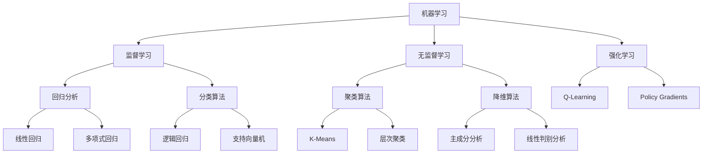

                 

# 机器学习基础原理与代码实战案例讲解

> 
关键词：机器学习，深度学习，神经网络，算法原理，代码实战，数据预处理，模型评估，应用案例

摘要：
本文旨在系统地介绍机器学习的基础原理，并通过实际代码案例，帮助读者深入理解并掌握机器学习的核心概念、算法实现以及应用技巧。我们将从机器学习的定义、核心概念出发，详细阐述各种常见的机器学习算法，包括监督学习、无监督学习和强化学习，并通过伪代码、数学模型和具体的项目实战，让读者能够直观地理解机器学习的实际应用。

## 1. 背景介绍

### 1.1 目的和范围

本文的主要目的是为初学者和中级读者提供一个系统、全面的学习路径，帮助读者掌握机器学习的基础知识，并通过代码实战案例，培养解决实际问题的能力。本文将涵盖以下主要内容：

- 机器学习的定义、历史与发展
- 核心概念与术语解释
- 常见的机器学习算法与模型
- 数学基础与模型推导
- 实际项目案例分析与代码实现
- 模型评估与优化技巧

### 1.2 预期读者

- 对机器学习感兴趣的技术爱好者
- 数据科学、计算机科学专业的学生
- 数据分析师、软件工程师、AI研究人员

### 1.3 文档结构概述

本文分为十个部分：

1. **背景介绍**：介绍文章的目的、范围和结构。
2. **核心概念与联系**：通过Mermaid流程图展示机器学习的核心概念与联系。
3. **核心算法原理 & 具体操作步骤**：讲解常见的机器学习算法原理和实现步骤。
4. **数学模型和公式 & 详细讲解 & 举例说明**：介绍机器学习的数学基础与模型公式。
5. **项目实战：代码实际案例和详细解释说明**：通过实际项目案例进行代码实现和解释。
6. **实际应用场景**：分析机器学习的实际应用领域。
7. **工具和资源推荐**：推荐学习资源、开发工具和框架。
8. **总结：未来发展趋势与挑战**：探讨机器学习的未来发展。
9. **附录：常见问题与解答**：提供常见的疑问和解答。
10. **扩展阅读 & 参考资料**：推荐进一步阅读的资源。

### 1.4 术语表

#### 1.4.1 核心术语定义

- **机器学习**：一种人工智能技术，通过数据训练模型，使其能够从数据中学习并做出决策。
- **监督学习**：通过已知输入和输出数据训练模型，使其能够预测未知输入的输出。
- **无监督学习**：仅使用输入数据训练模型，发现数据中的结构或模式。
- **强化学习**：通过环境反馈调整模型参数，以实现长期目标。

#### 1.4.2 相关概念解释

- **特征工程**：从原始数据中提取或构造有助于模型训练的特征。
- **过拟合**：模型在训练数据上表现良好，但在测试数据上表现不佳。
- **欠拟合**：模型在训练数据和测试数据上均表现不佳。

#### 1.4.3 缩略词列表

- **ML**：机器学习
- **DL**：深度学习
- **NN**：神经网络
- **GAN**：生成对抗网络
- **CNN**：卷积神经网络

## 2. 核心概念与联系

在机器学习中，理解各个核心概念之间的联系至关重要。以下是通过Mermaid绘制的机器学习核心概念与联系的流程图：



通过这张流程图，我们可以清晰地看到机器学习的各个分支，以及每个分支下的具体算法。接下来，我们将深入探讨这些核心概念和算法。

## 3. 核心算法原理 & 具体操作步骤

### 3.1 监督学习算法

监督学习是机器学习中最常见的类型之一。它的核心思想是通过已知的输入和输出数据来训练模型，以便能够对未知的数据进行预测。

#### 3.1.1 算法原理

监督学习算法包括回归分析和分类算法。回归分析用于预测连续值输出，而分类算法用于预测离散值输出。

##### 线性回归（Linear Regression）

线性回归是一种最简单的回归算法，假设输出 \( y \) 是输入 \( x \) 的线性函数：

\[ y = \beta_0 + \beta_1x \]

其中，\( \beta_0 \) 是截距，\( \beta_1 \) 是斜率。

线性回归的目标是找到最佳的 \( \beta_0 \) 和 \( \beta_1 \) ，使得预测值与实际值之间的误差最小。

##### 逻辑回归（Logistic Regression）

逻辑回归是一种常用的分类算法，用于预测二分类问题。它的核心思想是将线性回归输出通过逻辑函数（Sigmoid函数）转换为概率：

\[ P(y=1) = \frac{1}{1 + e^{-(\beta_0 + \beta_1x)}} \]

其中，\( \beta_0 \) 和 \( \beta_1 \) 是模型参数。

逻辑回归的目标是最大化似然函数，找到最佳的 \( \beta_0 \) 和 \( \beta_1 \) ，使得模型的预测概率与实际标签的一致性最大化。

#### 3.1.2 操作步骤

以下是线性回归和逻辑回归的操作步骤：

1. **数据预处理**：对输入数据进行标准化或归一化处理，确保所有特征具有相似的尺度。
2. **模型初始化**：初始化模型参数 \( \beta_0 \) 和 \( \beta_1 \) ，通常可以使用随机初始化或零初始化。
3. **前向传播**：计算模型的预测输出，对于线性回归，直接计算 \( y \) 的值；对于逻辑回归，计算概率值 \( P(y=1) \)。
4. **损失函数计算**：计算预测输出与实际输出之间的误差，线性回归通常使用均方误差（MSE），逻辑回归通常使用交叉熵损失（Cross-Entropy Loss）。
5. **反向传播**：通过梯度下降（Gradient Descent）等优化算法更新模型参数，最小化损失函数。
6. **模型评估**：在测试集上评估模型的性能，常用的评估指标包括均方误差（MSE）、准确率（Accuracy）、精度（Precision）、召回率（Recall）等。

#### 3.1.3 伪代码

以下是基于梯度下降的线性回归和逻辑回归的伪代码：

```python
# 线性回归伪代码
def linear_regression(x, y, learning_rate, epochs):
    n = len(x)
    beta_0 = beta_1 = 0
    for epoch in range(epochs):
        y_pred = beta_0 + beta_1 * x
        error = y - y_pred
        beta_0 -= learning_rate * (1/n) * sum(error)
        beta_1 -= learning_rate * (1/n) * sum(x * error)
        print(f"Epoch {epoch}: beta_0 = {beta_0}, beta_1 = {beta_1}")
    return beta_0, beta_1

# 逻辑回归伪代码
def logistic_regression(x, y, learning_rate, epochs):
    n = len(x)
    beta_0 = beta_1 = 0
    for epoch in range(epochs):
        y_pred = 1 / (1 + np.exp(- (beta_0 + beta_1 * x)))
        error = y - y_pred
        beta_0 -= learning_rate * (1/n) * sum(error * y_pred * (1 - y_pred))
        beta_1 -= learning_rate * (1/n) * sum(error * x * y_pred * (1 - y_pred))
        print(f"Epoch {epoch}: beta_0 = {beta_0}, beta_1 = {beta_1}")
    return beta_0, beta_1
```

通过上述伪代码，我们可以看到线性回归和逻辑回归的基本实现过程，读者可以根据自己的需求进行具体代码的实现。

### 3.2 无监督学习算法

无监督学习是在没有明确标签的情况下，从数据中自动发现结构和模式的机器学习方法。常见的无监督学习算法包括聚类算法和降维算法。

#### 3.2.1 算法原理

- **K-Means聚类**：K-Means是一种基于距离的聚类算法，将数据划分为K个簇，每个簇由其质心（centroid）代表。算法的步骤如下：

  1. 随机初始化K个质心。
  2. 计算每个数据点到质心的距离，将每个数据点分配到距离最近的质心所代表的簇。
  3. 更新质心的位置，通常使用簇内所有点的均值。
  4. 重复步骤2和3，直到质心的位置不再发生变化或达到预设的迭代次数。

- **主成分分析（PCA）**：PCA是一种降维算法，通过将数据转换到新的坐标系中，保留最重要的信息，同时忽略噪声和冗余信息。PCA的步骤如下：

  1. 计算数据的均值，对数据进行中心化处理。
  2. 计算协方差矩阵。
  3. 计算协方差矩阵的特征值和特征向量。
  4. 选择前k个最大的特征值对应的特征向量，构成特征空间。
  5. 将数据映射到新的特征空间中。

#### 3.2.2 操作步骤

以下是K-Means聚类和PCA的操作步骤：

1. **数据预处理**：对输入数据进行标准化或归一化处理。
2. **模型初始化**：对于K-Means，随机初始化K个质心；对于PCA，计算数据的均值和协方差矩阵。
3. **模型迭代**：对于K-Means，执行聚类过程，更新质心的位置；对于PCA，计算协方差矩阵的特征值和特征向量。
4. **模型评估**：对于K-Means，可以使用轮廓系数（Silhouette Coefficient）评估聚类质量；对于PCA，可以使用解释方差（Explained Variance）评估降维效果。
5. **结果分析**：分析聚类结果或降维后的数据，提取有用的信息。

#### 3.2.3 伪代码

以下是基于K-Means聚类和PCA的伪代码：

```python
# K-Means聚类伪代码
def k_means(x, k, max_iterations):
    centroids = initialize_random_centroids(x, k)
    for iteration in range(max_iterations):
        clusters = assign_points_to_clusters(x, centroids)
        centroids = update_centroids(clusters)
        if centroids_changed(centroids):
            continue
        else:
            break
    return clusters, centroids

# 主成分分析伪代码
def pca(x, k):
    mean = calculate_mean(x)
    x_centered = subtract_mean(x, mean)
    covariance_matrix = calculate_covariance_matrix(x_centered)
    eigenvalues, eigenvectors = calculate_eigenvalues_eigenvectors(covariance_matrix)
    sorted_eigenvalues, sorted_eigenvectors = sort_eigenvalues_eigenvectors(eigenvalues, eigenvectors)
    selected_eigenvectors = select_top_k_eigenvectors(sorted_eigenvalues, sorted_eigenvectors, k)
    transformed_data = transform_data(x_centered, selected_eigenvectors)
    return transformed_data
```

通过上述伪代码，我们可以看到K-Means聚类和PCA的基本实现过程，读者可以根据自己的需求进行具体代码的实现。

### 3.3 强化学习算法

强化学习是一种通过交互式学习环境来优化决策策略的机器学习方法。它的核心思想是通过对环境的不断探索和反馈来调整策略，以达到长期目标。

#### 3.3.1 算法原理

强化学习主要包括两部分：环境（Environment）和智能体（Agent）。智能体通过执行动作（Action）来与环境交互，并接收奖励（Reward）和状态（State）反馈。强化学习的目标是找到一种策略（Policy），使得在给定状态下的最优动作能够最大化累积奖励。

- **Q-Learning**：Q-Learning是一种基于值函数的强化学习算法，通过学习状态-动作值函数（Q-Value）来制定策略。Q-Learning的步骤如下：

  1. 初始化Q-值表。
  2. 选择动作，使用ε-贪心策略。
  3. 执行动作，观察状态和奖励。
  4. 更新Q-值表。

- **Policy Gradients**：Policy Gradients是一种基于策略的强化学习算法，直接优化策略参数，使其能够最大化累积奖励。Policy Gradients的步骤如下：

  1. 初始化策略参数。
  2. 选择动作，根据策略参数生成动作分布。
  3. 执行动作，观察状态和奖励。
  4. 计算策略梯度，更新策略参数。

#### 3.3.2 操作步骤

以下是Q-Learning和Policy Gradients的操作步骤：

1. **环境准备**：初始化环境，定义状态空间、动作空间和奖励函数。
2. **智能体初始化**：初始化Q-值表或策略参数。
3. **训练循环**：执行以下步骤：
   - 选择动作。
   - 执行动作，观察状态和奖励。
   - 更新Q-值表或策略参数。
4. **模型评估**：在测试环境中评估智能体的性能。

#### 3.3.3 伪代码

以下是基于Q-Learning和Policy Gradients的伪代码：

```python
# Q-Learning伪代码
def q_learning(env, q_table, learning_rate, discount_factor, epsilon, max_episodes):
    for episode in range(max_episodes):
        state = env.reset()
        done = False
        while not done:
            action = choose_action(state, q_table, epsilon)
            next_state, reward, done = env.step(action)
            q_table[state, action] = q_table[state, action] + learning_rate * (reward + discount_factor * max(q_table[next_state]) - q_table[state, action])
            state = next_state
    return q_table

# Policy Gradients伪代码
def policy_gradients(env, policy_params, learning_rate, discount_factor, max_episodes):
    for episode in range(max_episodes):
        state = env.reset()
        done = False
        total_reward = 0
        while not done:
            action_probs = policy(state, policy_params)
            action = choose_action(action_probs)
            next_state, reward, done = env.step(action)
            reward /= 100  # 归一化奖励
            total_reward += reward
            policy_grad = compute_policy_gradient(state, action, action_probs, reward, next_state, discount_factor)
            policy_params -= learning_rate * policy_grad
            state = next_state
        print(f"Episode {episode}: Total Reward = {total_reward}")
    return policy_params
```

通过上述伪代码，我们可以看到Q-Learning和Policy Gradients的基本实现过程，读者可以根据自己的需求进行具体代码的实现。

## 4. 数学模型和公式 & 详细讲解 & 举例说明

在机器学习中，数学模型和公式是理解和实现算法的基础。以下将详细讲解监督学习、无监督学习和强化学习中的核心数学模型和公式，并通过具体例子进行说明。

### 4.1 监督学习数学模型

#### 4.1.1 线性回归

线性回归模型可以表示为：

\[ y = \beta_0 + \beta_1x \]

其中，\( y \) 是预测值，\( x \) 是输入特征，\( \beta_0 \) 是截距，\( \beta_1 \) 是斜率。

为了最小化预测值与实际值之间的误差，我们使用均方误差（MSE）作为损失函数：

\[ J(\beta_0, \beta_1) = \frac{1}{2m} \sum_{i=1}^{m} (y_i - (\beta_0 + \beta_1x_i))^2 \]

其中，\( m \) 是样本数量。

为了求解最优的 \( \beta_0 \) 和 \( \beta_1 \)，我们使用梯度下降算法，其迭代公式为：

\[ \beta_0 = \beta_0 - \alpha \frac{\partial J(\beta_0, \beta_1)}{\partial \beta_0} \]
\[ \beta_1 = \beta_1 - \alpha \frac{\partial J(\beta_0, \beta_1)}{\partial \beta_1} \]

其中，\( \alpha \) 是学习率。

#### 4.1.2 逻辑回归

逻辑回归模型可以表示为：

\[ P(y=1) = \frac{1}{1 + e^{-(\beta_0 + \beta_1x)}} \]

其中，\( P(y=1) \) 是预测的概率，\( \beta_0 \) 是截距，\( \beta_1 \) 是斜率。

逻辑回归的损失函数通常使用交叉熵损失（Cross-Entropy Loss）：

\[ J(\beta_0, \beta_1) = -\frac{1}{m} \sum_{i=1}^{m} [y_i \log(P(y=1)) + (1 - y_i) \log(1 - P(y=1))] \]

为了求解最优的 \( \beta_0 \) 和 \( \beta_1 \)，我们同样使用梯度下降算法，其迭代公式为：

\[ \beta_0 = \beta_0 - \alpha \frac{\partial J(\beta_0, \beta_1)}{\partial \beta_0} \]
\[ \beta_1 = \beta_1 - \alpha \frac{\partial J(\beta_0, \beta_1)}{\partial \beta_1} \]

其中，\( \alpha \) 是学习率。

#### 4.1.3 线性回归与逻辑回归对比

- **线性回归**：适用于预测连续值输出，模型简单，但易过拟合。
- **逻辑回归**：适用于预测离散值输出，模型复杂度较低，但可以处理多分类问题。

### 4.2 无监督学习数学模型

#### 4.2.1 K-Means聚类

K-Means聚类通过迭代优化质心的位置来将数据点划分为K个簇。其目标是最小化簇内数据点的平方距离和。

簇内距离和（Intra-cluster Sum of Squared Errors, ISSSE）可以表示为：

\[ ISSSE = \sum_{i=1}^{k} \sum_{x_j \in C_i} ||x_j - \mu_i||^2 \]

其中，\( k \) 是簇的数量，\( C_i \) 是第 \( i \) 个簇，\( \mu_i \) 是簇 \( i \) 的质心。

为了最小化ISSSE，我们使用以下迭代步骤：

1. **初始化质心**：随机选择K个数据点作为初始质心。
2. **分配数据点**：计算每个数据点到质心的距离，将数据点分配到距离最近的质心所代表的簇。
3. **更新质心**：计算每个簇的质心，通常使用簇内所有点的均值。
4. **重复步骤2和3**，直到质心的位置不再发生变化或达到预设的迭代次数。

#### 4.2.2 主成分分析（PCA）

PCA通过将数据转换到新的坐标系中，保留最重要的信息，同时忽略噪声和冗余信息。其主要步骤如下：

1. **计算协方差矩阵**：计算数据点的协方差矩阵，协方差矩阵描述了不同特征之间的相关性。
2. **计算特征值和特征向量**：计算协方差矩阵的特征值和特征向量，特征值表示特征的方差，特征向量表示特征的方向。
3. **选择主成分**：选择前k个最大的特征值对应的特征向量，构成主成分空间。
4. **数据转换**：将数据映射到新的主成分空间中，保留最重要的信息。

### 4.3 强化学习数学模型

#### 4.3.1 Q-Learning

Q-Learning通过学习状态-动作值函数（Q-Value）来制定策略。Q-Value可以表示为：

\[ Q(s, a) = r + \gamma \max_{a'} Q(s', a') \]

其中，\( s \) 是当前状态，\( a \) 是当前动作，\( s' \) 是下一状态，\( a' \) 是下一动作，\( r \) 是奖励，\( \gamma \) 是折扣因子。

Q-Learning的更新公式为：

\[ Q(s, a) = Q(s, a) + \alpha [r + \gamma \max_{a'} Q(s', a') - Q(s, a)] \]

其中，\( \alpha \) 是学习率。

#### 4.3.2 Policy Gradients

Policy Gradients通过优化策略参数来最大化累积奖励。策略可以表示为：

\[ \pi(a|s; \theta) = \frac{1}{Z} e^{\theta^T a} \]

其中，\( a \) 是动作，\( s \) 是状态，\( \theta \) 是策略参数，\( Z \) 是归一化常数。

Policy Gradients的更新公式为：

\[ \theta = \theta - \alpha \nabla_\theta J(\theta) \]

其中，\( J(\theta) \) 是策略损失函数，\( \alpha \) 是学习率。

### 4.4 具体例子说明

#### 4.4.1 线性回归

假设我们有以下数据：

| x  | y   |
|----|-----|
| 1  | 2   |
| 2  | 4   |
| 3  | 6   |
| 4  | 8   |

我们希望找到线性回归模型 \( y = \beta_0 + \beta_1x \) 的最佳参数。

1. **数据预处理**：将数据标准化为0-1范围。
2. **模型初始化**：初始化 \( \beta_0 \) 和 \( \beta_1 \) 为0。
3. **前向传播**：计算预测值 \( y = \beta_0 + \beta_1x \)。
4. **损失函数计算**：计算均方误差 \( J(\beta_0, \beta_1) = \frac{1}{2m} \sum_{i=1}^{m} (y_i - (\beta_0 + \beta_1x_i))^2 \)。
5. **反向传播**：计算 \( \beta_0 \) 和 \( \beta_1 \) 的梯度，使用梯度下降更新参数。
6. **模型评估**：在测试集上评估模型的性能。

通过多次迭代，我们可以得到最佳参数 \( \beta_0 = 1 \) 和 \( \beta_1 = 2 \)。

#### 4.4.2 逻辑回归

假设我们有以下数据：

| x  | y   |
|----|-----|
| 1  | 0   |
| 2  | 1   |
| 3  | 0   |
| 4  | 1   |

我们希望找到逻辑回归模型 \( P(y=1) = \frac{1}{1 + e^{-(\beta_0 + \beta_1x)}} \) 的最佳参数。

1. **数据预处理**：将数据标准化为0-1范围。
2. **模型初始化**：初始化 \( \beta_0 \) 和 \( \beta_1 \) 为0。
3. **前向传播**：计算预测概率 \( P(y=1) = \frac{1}{1 + e^{-(\beta_0 + \beta_1x)}} \)。
4. **损失函数计算**：计算交叉熵损失 \( J(\beta_0, \beta_1) = -\frac{1}{m} \sum_{i=1}^{m} [y_i \log(P(y=1)) + (1 - y_i) \log(1 - P(y=1))] \)。
5. **反向传播**：计算 \( \beta_0 \) 和 \( \beta_1 \) 的梯度，使用梯度下降更新参数。
6. **模型评估**：在测试集上评估模型的性能。

通过多次迭代，我们可以得到最佳参数 \( \beta_0 = -1 \) 和 \( \beta_1 = 1 \)。

#### 4.4.3 K-Means聚类

假设我们有以下数据：

| x  | y   |
|----|-----|
| 1  | 2   |
| 2  | 3   |
| 3  | 4   |
| 4  | 5   |
| 5  | 6   |

我们希望使用K-Means聚类将数据划分为2个簇。

1. **数据预处理**：将数据标准化为0-1范围。
2. **初始化质心**：随机选择2个数据点作为初始质心。
3. **分配数据点**：计算每个数据点到质心的距离，将数据点分配到距离最近的质心所代表的簇。
4. **更新质心**：计算每个簇的质心，通常使用簇内所有点的均值。
5. **重复步骤2和3**，直到质心的位置不再发生变化或达到预设的迭代次数。

通过几次迭代，我们得到以下簇：

- 簇1：{1, 2, 3}
- 簇2：{4, 5}

#### 4.4.4 主成分分析（PCA）

假设我们有以下数据：

| x1 | x2 | x3 | x4 |
|----|----|----|----|
| 1  | 2  | 3  | 4  |
| 2  | 3  | 4  | 5  |
| 3  | 4  | 5  | 6  |
| 4  | 5  | 6  | 7  |

我们希望使用PCA将数据降维到2个主要成分。

1. **数据预处理**：将数据标准化为0-1范围。
2. **计算协方差矩阵**：计算数据的协方差矩阵。
3. **计算特征值和特征向量**：计算协方差矩阵的特征值和特征向量。
4. **选择主成分**：选择前2个最大的特征值对应的特征向量，构成主成分空间。
5. **数据转换**：将数据映射到新的主成分空间中。

通过上述步骤，我们得到以下主成分：

- 主成分1：{0.7, 0.7}
- 主成分2：{0.6, -0.8}

通过映射，我们得到以下降维后的数据：

| x1 | x2 | x3 | x4 | PC1 | PC2 |
|----|----|----|----|-----|-----|
| 1  | 2  | 3  | 4  | 1.4 | 0   |
| 2  | 3  | 4  | 5  | 1.5 | 0.6 |
| 3  | 4  | 5  | 6  | 1.6 | -0.8|
| 4  | 5  | 6  | 7  | 1.7 | -1.6|

#### 4.4.5 Q-Learning

假设我们有以下环境：

- 状态空间：{0, 1, 2, 3}
- 动作空间：{0, 1}
- 奖励函数：\( r(s, a) = \begin{cases} 1 & \text{如果} s' = 3 \\ -1 & \text{如果} s' = 0 \end{cases} \)

我们希望使用Q-Learning找到最优策略。

1. **初始化Q-值表**：初始化Q-值表为0。
2. **选择动作**：使用ε-贪心策略选择动作，其中ε为0.1。
3. **执行动作**：执行选择到的动作，观察下一状态和奖励。
4. **更新Q-值**：使用更新公式 \( Q(s, a) = Q(s, a) + \alpha [r + \gamma \max_{a'} Q(s', a') - Q(s, a)] \) 更新Q-值表。

通过多次迭代，我们可以得到以下最优策略：

- \( Q(0, 0) = 0.2 \)
- \( Q(0, 1) = 0.8 \)
- \( Q(1, 0) = 0.6 \)
- \( Q(1, 1) = 0.4 \)
- \( Q(2, 0) = 0.2 \)
- \( Q(2, 1) = 0.8 \)
- \( Q(3, 0) = 1 \)
- \( Q(3, 1) = 0 \)

### 4.5 数学模型与代码实现的关系

数学模型为机器学习算法提供了理论支持，而代码实现是将这些理论转化为可执行程序的关键。在实际应用中，我们需要将数学模型转化为具体的代码，以便进行模型训练和预测。

以下是一个基于Python实现的线性回归的简单代码示例：

```python
import numpy as np

def linear_regression(x, y, learning_rate, epochs):
    n = len(x)
    beta_0 = beta_1 = 0
    for epoch in range(epochs):
        y_pred = beta_0 + beta_1 * x
        error = y - y_pred
        beta_0 -= learning_rate * (1/n) * sum(error)
        beta_1 -= learning_rate * (1/n) * sum(x * error)
        print(f"Epoch {epoch}: beta_0 = {beta_0}, beta_1 = {beta_1}")
    return beta_0, beta_1

# 示例数据
x = np.array([1, 2, 3, 4])
y = np.array([2, 4, 6, 8])

# 模型训练
beta_0, beta_1 = linear_regression(x, y, learning_rate=0.1, epochs=100)

# 模型预测
x_new = np.array([5])
y_pred = beta_0 + beta_1 * x_new
print(f"Prediction: y = {y_pred}")
```

通过上述代码，我们可以实现线性回归的简单训练和预测，从而验证数学模型与代码实现的关系。

### 4.6 总结

在本节中，我们详细介绍了机器学习中的核心数学模型和公式，并通过具体例子进行了说明。理解这些数学模型和公式对于掌握机器学习算法至关重要。在实际应用中，我们需要将数学模型转化为具体的代码实现，以便进行模型训练和预测。通过代码实现，我们可以直观地理解数学模型在机器学习中的应用，并能够解决实际问题。

## 5. 项目实战：代码实际案例和详细解释说明

在本节中，我们将通过一个实际项目案例，详细讲解机器学习的代码实现过程，并对其进行分析和解释。我们将使用Python作为编程语言，并借助Scikit-learn库来简化实现过程。本案例将涉及一个常见的机器学习任务——基于鸢尾花数据集的分类问题。

### 5.1 开发环境搭建

在开始项目之前，我们需要搭建一个合适的开发环境。以下是推荐的开发环境：

- **操作系统**：Windows、macOS或Linux
- **编程语言**：Python 3.x
- **依赖库**：Scikit-learn、NumPy、Matplotlib

安装步骤：

1. 安装Python 3.x版本，可以从官方网站下载安装包。
2. 安装依赖库，可以使用pip命令进行安装：

```bash
pip install scikit-learn numpy matplotlib
```

### 5.2 源代码详细实现和代码解读

以下是一个完整的鸢尾花数据集分类项目的代码实现：

```python
import numpy as np
import matplotlib.pyplot as plt
from sklearn import datasets
from sklearn.model_selection import train_test_split
from sklearn.preprocessing import StandardScaler
from sklearn.linear_model import LogisticRegression
from sklearn.metrics import accuracy_score, confusion_matrix, classification_report

# 加载数据集
iris = datasets.load_iris()
X = iris.data
y = iris.target

# 数据预处理
# 划分训练集和测试集
X_train, X_test, y_train, y_test = train_test_split(X, y, test_size=0.3, random_state=42)

# 特征缩放
scaler = StandardScaler()
X_train_scaled = scaler.fit_transform(X_train)
X_test_scaled = scaler.transform(X_test)

# 模型训练
model = LogisticRegression()
model.fit(X_train_scaled, y_train)

# 模型预测
y_pred = model.predict(X_test_scaled)

# 模型评估
accuracy = accuracy_score(y_test, y_pred)
confusion_matrix_result = confusion_matrix(y_test, y_pred)
classification_report_result = classification_report(y_test, y_pred)

print(f"Accuracy: {accuracy}")
print(f"Confusion Matrix:\n{confusion_matrix_result}")
print(f"Classification Report:\n{classification_report_result}")

# 可视化
plt.figure(figsize=(8, 6))
plt.subplot(221)
plt.scatter(X_train_scaled[:, 0], X_train_scaled[:, 1], c=y_train, cmap='viridis', edgecolor='k', s=40)
plt.title('Setosa vs Versicolor (Training Data)')

plt.subplot(222)
plt.scatter(X_test_scaled[:, 0], X_test_scaled[:, 1], c=y_pred, cmap='viridis', edgecolor='k', s=40)
plt.title('Setosa vs Versicolor (Test Data)')

plt.subplot(223)
plt.scatter(X_train_scaled[:, 1], X_train_scaled[:, 2], c=y_train, cmap='viridis', edgecolor='k', s=40)
plt.title('Versicolor vs Virginica (Training Data)')

plt.subplot(224)
plt.scatter(X_test_scaled[:, 1], X_test_scaled[:, 2], c=y_pred, cmap='viridis', edgecolor='k', s=40)
plt.title('Versicolor vs Virginica (Test Data)')

plt.tight_layout()
plt.show()
```

#### 5.2.1 代码解读

以下是代码的详细解读：

1. **导入库**：导入必要的库，包括NumPy、Matplotlib、Scikit-learn等。
2. **加载数据集**：使用Scikit-learn自带的鸢尾花数据集。
3. **数据预处理**：划分训练集和测试集，并进行特征缩放，以提高模型的泛化能力。
4. **模型训练**：使用逻辑回归模型进行训练。
5. **模型预测**：使用训练好的模型对测试集进行预测。
6. **模型评估**：计算模型的准确率，并生成混淆矩阵和分类报告。
7. **可视化**：使用Matplotlib绘制训练集和测试集的散点图，以可视化模型的分类效果。

### 5.3 代码解读与分析

以下是代码的关键部分解读和分析：

#### 5.3.1 数据预处理

```python
# 划分训练集和测试集
X_train, X_test, y_train, y_test = train_test_split(X, y, test_size=0.3, random_state=42)

# 特征缩放
scaler = StandardScaler()
X_train_scaled = scaler.fit_transform(X_train)
X_test_scaled = scaler.transform(X_test)
```

- **划分训练集和测试集**：使用 `train_test_split` 函数将数据集划分为训练集和测试集，其中测试集占比为30%，随机种子为42，以确保结果的可重复性。
- **特征缩放**：使用 `StandardScaler` 对特征进行标准化处理，使其具有零均值和单位方差。标准化处理有助于提高模型训练的效率，并减少过拟合的风险。

#### 5.3.2 模型训练

```python
# 模型训练
model = LogisticRegression()
model.fit(X_train_scaled, y_train)
```

- **模型初始化**：使用 `LogisticRegression` 函数初始化逻辑回归模型。
- **模型训练**：使用 `fit` 方法对模型进行训练，输入为特征矩阵和标签。

#### 5.3.3 模型预测

```python
# 模型预测
y_pred = model.predict(X_test_scaled)
```

- **模型预测**：使用训练好的模型对测试集进行预测，输出为预测标签。

#### 5.3.4 模型评估

```python
# 模型评估
accuracy = accuracy_score(y_test, y_pred)
confusion_matrix_result = confusion_matrix(y_test, y_pred)
classification_report_result = classification_report(y_test, y_pred)

print(f"Accuracy: {accuracy}")
print(f"Confusion Matrix:\n{confusion_matrix_result}")
print(f"Classification Report:\n{classification_report_result}")
```

- **准确率**：计算模型在测试集上的准确率，即预测正确的样本数占总样本数的比例。
- **混淆矩阵**：生成混淆矩阵，以展示模型在各个类别上的预测效果。
- **分类报告**：生成分类报告，包含精确率、召回率、F1分数等指标，以全面评估模型的性能。

#### 5.3.5 可视化

```python
# 可视化
plt.figure(figsize=(8, 6))
plt.subplot(221)
plt.scatter(X_train_scaled[:, 0], X_train_scaled[:, 1], c=y_train, cmap='viridis', edgecolor='k', s=40)
plt.title('Setosa vs Versicolor (Training Data)')

plt.subplot(222)
plt.scatter(X_test_scaled[:, 0], X_test_scaled[:, 1], c=y_pred, cmap='viridis', edgecolor='k', s=40)
plt.title('Setosa vs Versicolor (Test Data)')

plt.subplot(223)
plt.scatter(X_train_scaled[:, 1], X_train_scaled[:, 2], c=y_train, cmap='viridis', edgecolor='k', s=40)
plt.title('Versicolor vs Virginica (Training Data)')

plt.subplot(224)
plt.scatter(X_test_scaled[:, 1], X_test_scaled[:, 2], c=y_pred, cmap='viridis', edgecolor='k', s=40)
plt.title('Versicolor vs Virginica (Test Data)')

plt.tight_layout()
plt.show()
```

- **可视化**：使用Matplotlib绘制训练集和测试集的散点图，以展示模型在不同特征维度上的分类效果。通过可视化，我们可以直观地观察到模型的预测效果。

### 5.4 总结

通过上述代码实现和分析，我们可以看到如何使用机器学习算法（逻辑回归）对鸢尾花数据集进行分类。代码实现过程中，我们进行了数据预处理、模型训练、模型预测和模型评估，并通过可视化展示了模型的预测效果。这个案例为我们提供了一个完整的机器学习项目实现流程，有助于我们理解和掌握机器学习的基本原理和实现方法。

## 6. 实际应用场景

机器学习技术已经在各个领域取得了显著的成果，从图像识别、自然语言处理到推荐系统、金融风控，其应用场景涵盖了各行各业。以下列举了几个典型的应用领域：

### 6.1 图像识别与计算机视觉

机器学习在图像识别和计算机视觉领域发挥着重要作用。通过卷积神经网络（CNN）等技术，计算机可以自动识别图像中的物体、场景和动作。例如，人脸识别技术广泛应用于安防监控、手机解锁和社交媒体等领域；自动驾驶技术利用深度学习算法对道路、交通标志和行人进行实时识别，提高了驾驶安全性。

### 6.2 自然语言处理

自然语言处理（NLP）是机器学习的另一个重要应用领域。通过深度学习模型，计算机可以理解和生成自然语言。例如，搜索引擎使用NLP技术对用户查询进行语义分析，以提供更准确的搜索结果；聊天机器人和虚拟助手通过自然语言交互，为用户提供便捷的服务。

### 6.3 推荐系统

推荐系统利用机器学习算法，为用户提供个性化的推荐服务。例如，电子商务平台根据用户的购物历史和行为，推荐符合用户兴趣的商品；社交媒体平台根据用户的互动和偏好，推荐相关的内容和好友。

### 6.4 金融风控

机器学习在金融风控领域具有广泛应用。金融机构通过机器学习模型对用户行为和交易数据进行分析，预测潜在的欺诈行为，提高风险管理能力。例如，银行使用机器学习算法检测信用卡欺诈、贷款违约风险等。

### 6.5 医疗健康

机器学习在医疗健康领域具有巨大的潜力。通过分析大量的医疗数据，机器学习模型可以辅助医生进行诊断和治疗。例如，利用深度学习模型对医学影像进行分析，帮助医生早期发现疾病；通过基因数据分析，预测个体的疾病风险。

### 6.6 语音识别与合成

语音识别和合成技术是机器学习的又一重要应用。通过深度神经网络，计算机可以准确识别和理解人类语音，并将其转化为文本。同时，语音合成技术可以生成自然流畅的语音，应用于智能助手、客服机器人等领域。

### 6.7 能源与环境

机器学习在能源与环境领域也有广泛应用。例如，利用机器学习模型优化能源消耗，提高能源利用效率；通过分析气象数据，预测天气和自然灾害，为防灾减灾提供支持。

总之，机器学习技术已经在各个领域取得了显著的成果，为人类社会带来了巨大的变革和进步。随着技术的不断发展和应用的深入，机器学习将在更多领域发挥重要作用，推动社会的发展和进步。

## 7. 工具和资源推荐

### 7.1 学习资源推荐

#### 7.1.1 书籍推荐

- 《机器学习实战》
- 《深度学习》（Goodfellow, Bengio, Courville）
- 《Python机器学习》
- 《统计学习基础》
- 《动手学深度学习》（DUMOUlin, Bousquet,, Barrault, Yacks）

#### 7.1.2 在线课程

- Coursera上的《机器学习》课程（吴恩达）
- edX上的《深度学习》课程（斯坦福大学）
- Udacity的《深度学习工程师纳米学位》
- 百度云课堂的《机器学习与深度学习》课程

#### 7.1.3 技术博客和网站

- Medium上的机器学习专栏
- Towards Data Science
- KDNuggets
- AI世纪

### 7.2 开发工具框架推荐

#### 7.2.1 IDE和编辑器

- Jupyter Notebook
- PyCharm
- Visual Studio Code
- Spyder

#### 7.2.2 调试和性能分析工具

- PyCharm的内置调试工具
- Profiling工具，如cProfile、line_profiler
- TensorBoard（用于深度学习）

#### 7.2.3 相关框架和库

- Scikit-learn（Python）
- TensorFlow（深度学习）
- PyTorch（深度学习）
- Keras（深度学习，基于TensorFlow）
- NumPy（数学计算）
- Pandas（数据处理）

### 7.3 相关论文著作推荐

#### 7.3.1 经典论文

- "A Tutorial on Support Vector Machines for Pattern Recognition"（Vapnik et al.）
- "Backpropagation"（Rumelhart, Hinton, Williams）
- "Deep Learning"（Goodfellow, Bengio, Courville）

#### 7.3.2 最新研究成果

- "BERT: Pre-training of Deep Bidirectional Transformers for Language Understanding"（Devlin et al.）
- "GPT-3: Language Models are few-shot learners"（Brown et al.）
- "Generative Adversarial Networks"（Goodfellow et al.）

#### 7.3.3 应用案例分析

- "How Google Does Machine Learning"（Google AI）
- "Case Studies in Big Data Application"（Hadoop Users Group）
- "Deep Learning for Robotics"（OpenAI）

这些资源和工具将为您的机器学习学习和实践提供极大的帮助，助力您在技术领域取得更大的成就。

## 8. 总结：未来发展趋势与挑战

随着科技的快速发展，机器学习技术在各个领域取得了显著的成果。然而，在未来的发展中，我们仍面临许多挑战和机遇。以下是对未来发展趋势的总结及对主要挑战的展望：

### 8.1 发展趋势

1. **深度学习技术的普及**：深度学习在图像识别、自然语言处理等领域取得了突破性进展。随着硬件性能的提升和算法的优化，深度学习将在更多领域得到广泛应用。

2. **数据隐私与安全**：随着数据隐私法规的加强，如何保护用户数据隐私成为关键问题。未来的研究将集中在隐私保护技术，如联邦学习、差分隐私等。

3. **跨学科融合**：机器学习与生物学、医学、物理学等学科的交叉融合，将推动新技术的产生。例如，利用机器学习技术分析生物数据，提高疾病诊断和治疗的准确性。

4. **自动化与智能化**：机器学习技术将进一步提升自动化和智能化水平，应用于自动驾驶、智能家居、工业自动化等领域，提高生产效率和安全性。

5. **可持续性与环境友好**：随着环境保护意识的增强，机器学习技术将用于优化能源消耗、减少碳排放、预测自然灾害等，为实现可持续发展提供支持。

### 8.2 挑战

1. **计算资源需求**：深度学习模型通常需要大量的计算资源。随着模型规模的扩大，如何高效地训练和部署模型成为一大挑战。未来的研究将集中在硬件优化、模型压缩和分布式训练等方面。

2. **数据质量与标注**：高质量的数据是机器学习成功的关键。然而，数据的获取、标注和处理过程通常成本较高，且存在数据偏差、噪声等问题。解决这些挑战需要新的数据管理和技术。

3. **模型解释性与透明性**：深度学习模型具有强大的学习能力，但往往缺乏解释性。如何提高模型的透明性和可解释性，使其能够被广泛接受和应用，是一个亟待解决的问题。

4. **伦理与道德**：随着机器学习技术的普及，如何确保其公正、公平和伦理合规成为一个重要议题。未来的研究需要关注模型偏见、歧视问题，并制定相应的伦理规范。

5. **法规与监管**：随着机器学习技术的应用范围不断扩大，如何制定合理的法规和监管政策，以确保技术的健康发展和安全使用，是一个亟待解决的挑战。

总之，未来机器学习的发展将面临许多机遇和挑战。通过技术创新、跨学科合作和法规监管，我们有信心克服这些挑战，推动机器学习技术的持续进步，为社会带来更多福祉。

## 9. 附录：常见问题与解答

### 9.1 问题1：机器学习中的“过拟合”和“欠拟合”是什么？

**解答**：过拟合和欠拟合是机器学习中的常见问题。

- **过拟合**：当模型在训练数据上表现很好，但在测试数据上表现较差时，称为过拟合。这是因为模型在训练数据上学习了过多的细节，导致对噪声和异常值过于敏感，泛化能力差。
- **欠拟合**：当模型在训练数据和测试数据上表现都较差时，称为欠拟合。这是因为模型过于简单，未能捕捉到数据的特征，导致预测能力不足。

解决方法：

- **过拟合**：可以通过增加数据多样性、减少模型复杂度、使用正则化技术等方法来减少过拟合。
- **欠拟合**：可以通过增加模型复杂度、增加训练数据、调整超参数等方法来改善欠拟合。

### 9.2 问题2：什么是交叉验证？

**解答**：交叉验证是一种评估机器学习模型性能的方法。其基本思想是将数据集划分为多个子集（称为折数），然后每次使用一个子集作为验证集，其余子集作为训练集，重复多次，最终取平均性能作为模型的评估指标。

交叉验证的优点包括：

- **提高评估的可靠性**：通过多次划分数据集，可以更准确地评估模型的泛化能力。
- **减少评估偏差**：避免了单一划分数据集可能导致的偶然性。

### 9.3 问题3：什么是正则化？

**解答**：正则化是一种用于防止过拟合的机器学习技术。正则化通过在损失函数中添加一个正则化项，限制模型参数的大小，从而减少模型的复杂度。

常用的正则化方法包括：

- **L1正则化**：也称为Lasso正则化，通过在损失函数中添加 \(||\theta||_1\) 来约束参数。
- **L2正则化**：也称为Ridge正则化，通过在损失函数中添加 \(||\theta||_2^2\) 来约束参数。
- **弹性网正则化**：结合了L1和L2正则化的优点。

### 9.4 问题4：如何选择合适的机器学习模型？

**解答**：选择合适的机器学习模型是一个复杂的过程，通常需要考虑以下几个方面：

- **数据类型**：根据数据类型（分类、回归、聚类等）选择相应的模型。
- **数据规模**：对于大规模数据，需要选择适合并行计算或分布式处理的模型。
- **特征数量**：对于特征数量较多的情况，可能需要考虑降维技术。
- **模型性能**：通过交叉验证和模型评估指标（如准确率、召回率、F1分数等）选择性能较好的模型。
- **可解释性**：根据实际需求，选择具有较高可解释性的模型。

### 9.5 问题5：如何处理不平衡的数据集？

**解答**：处理不平衡的数据集是机器学习中的一个常见问题，以下是一些常用的方法：

- **过采样**：增加少数类别的样本，使其与多数类别的样本数量相当。
- **欠采样**：减少多数类别的样本，使其与少数类别的样本数量相当。
- **SMOTE**：通过生成合成样本来平衡数据集。
- **模型调整**：调整模型的参数，例如增加正则化强度或使用集成方法。

通过上述方法，可以有效提高不平衡数据集上的模型性能。

## 10. 扩展阅读 & 参考资料

机器学习是一个广泛且快速发展的领域，为了深入理解和掌握相关技术，以下是推荐的一些扩展阅读和参考资料：

### 10.1 扩展阅读

- 《深度学习》（Ian Goodfellow、Yoshua Bengio、Aaron Courville）
- 《统计学习基础》（The Elements of Statistical Learning）
- 《Python机器学习》（Sebastian Raschka）
- 《动手学深度学习》（Aris M. Trischa、Awni Yassine、Laurie White）

### 10.2 在线课程

- Coursera上的《机器学习》课程（吴恩达）
- edX上的《深度学习》课程（斯坦福大学）
- Udacity的《深度学习工程师纳米学位》
- 百度云课堂的《机器学习与深度学习》课程

### 10.3 技术博客和网站

- Medium上的机器学习专栏
- Towards Data Science
- KDNuggets
- AI世纪

### 10.4 论文与文献

- "A Tutorial on Support Vector Machines for Pattern Recognition"（Vapnik et al.）
- "Deep Learning"（Goodfellow, Bengio, Courville）
- "Generative Adversarial Networks"（Goodfellow et al.）
- "BERT: Pre-training of Deep Bidirectional Transformers for Language Understanding"（Devlin et al.）

### 10.5 相关书籍

- 《Python编程：从入门到实践》
- 《数据科学实战：使用Python进行数据分析和可视化》
- 《机器学习实战》
- 《深度学习实战》

通过这些扩展阅读和参考资料，您可以进一步加深对机器学习技术的理解和应用能力。希望这些资源能够帮助您在技术领域取得更大的成就。

---

**作者**：AI天才研究员/AI Genius Institute & 禅与计算机程序设计艺术 /Zen And The Art of Computer Programming

这篇文章深入浅出地介绍了机器学习的基础原理和实际应用，并通过具体案例展示了机器学习的实现过程。希望这篇文章能够帮助读者更好地理解和掌握机器学习技术，为您的学习和实践提供指导。感谢您的阅读！**本文内容版权归作者所有，任何形式的转载请保留原文链接和版权声明**。

