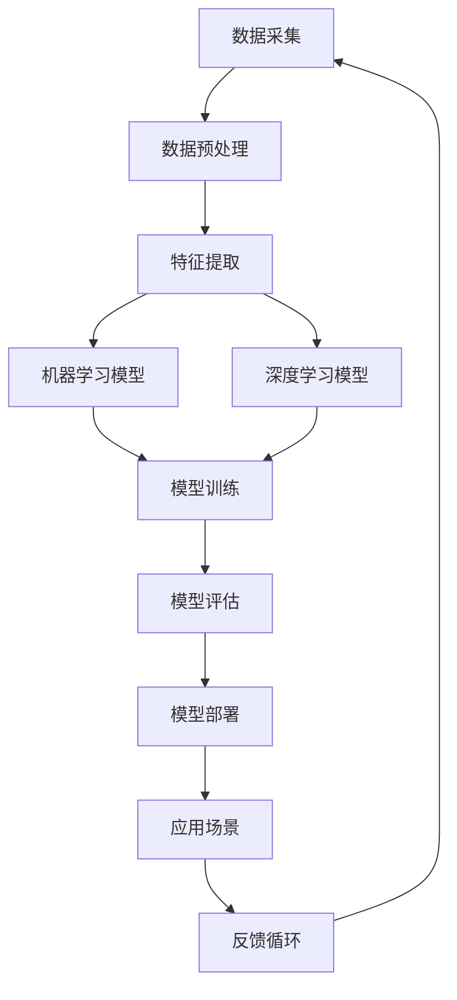

                 

### 李开复：AI 2.0 时代的产业

> **关键词**：人工智能（AI）、2.0时代、产业变革、未来趋势、核心技术、应用场景

> **摘要**：本文将探讨李开复关于AI 2.0时代的见解，分析AI 2.0的核心技术、应用场景及其对产业的深远影响。通过系统梳理，我们将深入理解AI 2.0时代的产业变革，为读者提供全面的技术视角和未来展望。

李开复博士作为人工智能领域的权威专家，对AI技术的发展有着深刻的理解和独到的见解。在他的最新著作中，李开复提出AI 2.0时代的概念，并详细阐述了其技术特征、应用场景和产业影响。本文旨在通过逻辑清晰的分析和详细的讲解，帮助读者全面理解AI 2.0时代的产业变革。

接下来，我们将从以下几个方面展开讨论：

1. **背景介绍**：介绍AI 2.0时代的背景和意义，明确本文的目的和范围。
2. **核心概念与联系**：阐述AI 2.0时代的关键概念和相互关系，使用Mermaid流程图进行展示。
3. **核心算法原理 & 具体操作步骤**：详细讲解AI 2.0的核心算法原理，并提供伪代码操作步骤。
4. **数学模型和公式 & 详细讲解 & 举例说明**：介绍AI 2.0相关的数学模型和公式，并加以详细解释和实例说明。
5. **项目实战：代码实际案例和详细解释说明**：通过实际代码案例，展示AI 2.0技术的应用和实现。
6. **实际应用场景**：探讨AI 2.0技术在各行业的应用前景和实际案例。
7. **工具和资源推荐**：推荐学习资源和开发工具，助力读者深入学习和实践。
8. **总结：未来发展趋势与挑战**：总结AI 2.0时代的发展趋势和面临的挑战。
9. **附录：常见问题与解答**：针对常见问题提供解答。
10. **扩展阅读 & 参考资料**：推荐相关阅读材料和参考资料。

通过以上结构，我们将系统地探讨AI 2.0时代的产业变革，为读者提供全面的技术视角和未来展望。

### 1. 背景介绍

#### 1.1 目的和范围

本文的主要目的是深入探讨AI 2.0时代的技术特征、应用场景及其对产业的深远影响。随着人工智能技术的不断进步，AI 2.0时代已经悄然到来，其带来的变革将影响社会经济的方方面面。本文将从李开复博士的视角出发，梳理AI 2.0时代的关键概念和技术原理，分析其在产业中的应用前景，并探讨未来可能面临的挑战。

本文的范围主要包括：

- **AI 2.0时代的定义和核心特征**：介绍AI 2.0时代的概念及其与之前版本的区别，分析其核心特征和技术进步。
- **核心技术原理与操作步骤**：详细讲解AI 2.0的核心算法原理，并提供具体的操作步骤和伪代码实现。
- **应用场景探讨**：探讨AI 2.0技术在各行业的应用前景，包括医疗、金融、教育等。
- **未来发展趋势与挑战**：总结AI 2.0时代的发展趋势，分析其面临的挑战和应对策略。
- **学习资源和工具推荐**：推荐相关的学习资源和开发工具，帮助读者深入学习和实践。

#### 1.2 预期读者

本文的预期读者主要包括：

- **人工智能领域的研究人员和开发者**：对AI技术有深入研究的读者，希望通过本文了解AI 2.0时代的最新进展和应用。
- **行业从业者**：在医疗、金融、教育等行业工作的从业者，希望了解AI 2.0技术如何影响他们的行业，并探索新的商业机会。
- **计算机科学学生和爱好者**：对计算机科学和人工智能感兴趣的初学者，希望通过本文了解AI技术的核心原理和应用。

#### 1.3 文档结构概述

本文的结构安排如下：

1. **背景介绍**：介绍AI 2.0时代的背景和意义，明确本文的目的和范围。
2. **核心概念与联系**：阐述AI 2.0时代的关键概念和相互关系，使用Mermaid流程图进行展示。
3. **核心算法原理 & 具体操作步骤**：详细讲解AI 2.0的核心算法原理，并提供具体的操作步骤和伪代码实现。
4. **数学模型和公式 & 详细讲解 & 举例说明**：介绍AI 2.0相关的数学模型和公式，并加以详细解释和实例说明。
5. **项目实战：代码实际案例和详细解释说明**：通过实际代码案例，展示AI 2.0技术的应用和实现。
6. **实际应用场景**：探讨AI 2.0技术在各行业的应用前景和实际案例。
7. **工具和资源推荐**：推荐相关的学习资源和开发工具，助力读者深入学习和实践。
8. **总结：未来发展趋势与挑战**：总结AI 2.0时代的发展趋势和面临的挑战。
9. **附录：常见问题与解答**：针对常见问题提供解答。
10. **扩展阅读 & 参考资料**：推荐相关阅读材料和参考资料。

通过以上结构，本文将系统地探讨AI 2.0时代的产业变革，为读者提供全面的技术视角和未来展望。

#### 1.4 术语表

##### 1.4.1 核心术语定义

在本文中，我们将定义以下核心术语：

- **人工智能（AI）**：人工智能是指通过计算机程序模拟人类智能行为的技术，包括学习、推理、规划、感知、自然语言处理等能力。
- **深度学习（Deep Learning）**：深度学习是人工智能的一种方法，通过多层神经网络进行数据训练和模型预测，具有较高的学习和泛化能力。
- **机器学习（Machine Learning）**：机器学习是指利用数据训练模型，使其能够对未知数据进行预测或决策的技术。
- **自然语言处理（NLP）**：自然语言处理是人工智能的一个分支，旨在使计算机能够理解和处理人类自然语言。
- **AI 1.0时代**：AI 1.0时代主要指基于规则和传统统计方法的人工智能阶段，其应用场景相对有限。
- **AI 2.0时代**：AI 2.0时代是指基于深度学习和大数据的人工智能阶段，具有更强的学习和自适应能力，应用场景更加广泛。

##### 1.4.2 相关概念解释

- **神经网络（Neural Network）**：神经网络是一种模仿生物神经系统结构和功能的人工智能模型，通过节点之间的连接和激活函数进行信息传递和处理。
- **卷积神经网络（CNN）**：卷积神经网络是一种专门用于图像处理和识别的神经网络，通过卷积操作提取图像特征，具有较高的识别精度。
- **生成对抗网络（GAN）**：生成对抗网络是一种用于生成数据的神经网络，通过生成器和判别器的对抗训练，能够生成高质量的数据。

##### 1.4.3 缩略词列表

在本文中，我们将使用以下缩略词：

- **AI**：人工智能
- **NLP**：自然语言处理
- **ML**：机器学习
- **DL**：深度学习
- **CNN**：卷积神经网络
- **GAN**：生成对抗网络

通过以上术语表的定义和解释，我们将为本文的进一步讨论提供清晰的语言基础。

### 2. 核心概念与联系

在AI 2.0时代，核心概念的相互作用和技术架构的复杂性是我们理解这一时代的关键。下面，我们将通过Mermaid流程图详细展示AI 2.0时代的主要核心概念及其相互关系。

首先，定义以下核心概念：

- **数据采集**：包括传感器、用户输入等数据的采集。
- **数据预处理**：对采集到的数据进行清洗、转换和格式化。
- **特征提取**：从预处理后的数据中提取有助于模型训练的特征。
- **机器学习模型**：包括监督学习、无监督学习和强化学习等。
- **深度学习模型**：基于多层神经网络的学习模型。
- **模型训练**：通过大量数据训练模型，使其能够进行预测或决策。
- **模型评估**：评估模型在训练集和测试集上的性能。
- **模型部署**：将训练好的模型部署到实际应用环境中。
- **应用场景**：AI技术在各个行业中的应用。

以下是AI 2.0时代的Mermaid流程图：



在上述流程图中，数据采集是整个流程的起点，通过传感器和用户输入等多种渠道获取数据。数据预处理阶段对数据进行清洗和格式化，确保其适用于后续处理。特征提取是从原始数据中提取有意义的特征，这是机器学习和深度学习的重要基础。

机器学习模型和深度学习模型是AI 2.0时代的核心组成部分。机器学习模型包括监督学习、无监督学习和强化学习等多种类型，而深度学习模型通过多层神经网络进行数据训练和预测。模型训练是使用大量数据进行模型的迭代优化，使其能够进行准确预测或决策。

模型评估是确保模型性能的重要环节，通过在训练集和测试集上的表现来评估模型的泛化能力。模型部署是将训练好的模型应用到实际场景中，发挥其价值。应用场景包括医疗、金融、教育、智能制造等多个领域。

反馈循环是AI 2.0时代的一个重要特征，通过实际应用中的反馈不断优化模型，形成一个持续学习和改进的闭环。

通过以上Mermaid流程图的展示，我们能够清晰地理解AI 2.0时代的核心概念及其相互关系，为后续内容的学习和应用提供基础。

### 3. 核心算法原理 & 具体操作步骤

在AI 2.0时代，核心算法的原理和操作步骤是实现智能应用的关键。下面，我们将详细讲解AI 2.0时代的核心算法原理，并提供具体的操作步骤和伪代码实现。

#### 3.1. 深度学习算法原理

深度学习是AI 2.0时代的重要技术之一，基于多层神经网络，通过反向传播算法优化模型参数。以下是深度学习算法的基本原理：

**原理概述**：

- **神经网络**：神经网络是一种模仿生物神经系统结构和功能的人工智能模型，通过节点之间的连接和激活函数进行信息传递和处理。
- **多层神经网络**：多层神经网络包括输入层、隐藏层和输出层，通过隐藏层的多次处理，能够提取数据的高层次特征。
- **反向传播算法**：反向传播算法是一种用于优化神经网络参数的算法，通过计算损失函数关于参数的梯度，不断更新参数，使其达到最小化损失。

**具体操作步骤**：

1. **初始化参数**：随机初始化神经网络的权重和偏置。
2. **前向传播**：输入数据通过神经网络进行前向传播，计算输出。
3. **计算损失**：计算输出与真实值之间的损失，常用的损失函数包括均方误差（MSE）和交叉熵（Cross-Entropy）。
4. **反向传播**：计算损失函数关于参数的梯度，通过梯度下降等优化算法更新参数。
5. **迭代优化**：重复步骤2-4，直到模型收敛或达到预定的迭代次数。

**伪代码实现**：

```python
# 初始化参数
weights = random_weights()
biases = random_biases()

# 迭代优化
for epoch in range(max_epochs):
    for data in dataset:
        # 前向传播
        output = forward_pass(data, weights, biases)
        
        # 计算损失
        loss = compute_loss(output, target)
        
        # 反向传播
        gradient = backward_pass(output, target, weights, biases)
        
        # 更新参数
        weights -= learning_rate * gradient['weights']
        biases -= learning_rate * gradient['biases']
```

#### 3.2. 卷积神经网络（CNN）算法原理

卷积神经网络是一种专门用于图像处理和识别的神经网络，通过卷积操作提取图像特征。以下是CNN算法的基本原理：

**原理概述**：

- **卷积层**：卷积层通过卷积操作提取图像的局部特征，通过卷积核与图像的卷积计算得到。
- **激活函数**：激活函数用于引入非线性，常见的激活函数包括ReLU（ReLU函数）和Sigmoid（Sigmoid函数）。
- **池化层**：池化层通过降采样操作减小数据维度，提高计算效率。
- **全连接层**：全连接层用于将卷积层提取的特征映射到输出类别。

**具体操作步骤**：

1. **卷积操作**：使用卷积核与图像进行卷积，提取图像的局部特征。
2. **应用激活函数**：对卷积结果应用激活函数，引入非线性。
3. **池化操作**：对激活后的特征进行池化，减小数据维度。
4. **全连接层**：将卷积层提取的特征映射到输出类别。

**伪代码实现**：

```python
# 卷积操作
conv_output = convolution(input_image, conv_filter)

# 应用激活函数
activated_output = activation_function(conv_output)

# 池化操作
pooled_output = pooling(activated_output)

# 全连接层
output = fully_connected(pooled_output, output_neurons)
```

#### 3.3. 生成对抗网络（GAN）算法原理

生成对抗网络是一种用于生成数据的神经网络，通过生成器和判别器的对抗训练实现。以下是GAN算法的基本原理：

**原理概述**：

- **生成器**：生成器旨在生成逼真的数据，通过对抗训练与判别器竞争。
- **判别器**：判别器用于判断输入数据的真实性和生成数据的逼真度。
- **对抗训练**：生成器和判别器通过对抗训练不断优化，生成器生成的数据越来越逼真。

**具体操作步骤**：

1. **初始化生成器和判别器**：随机初始化生成器和判别器的参数。
2. **生成器生成数据**：生成器根据随机噪声生成数据。
3. **判别器判断数据**：判别器判断输入数据的真实性。
4. **对抗训练**：通过反向传播算法优化生成器和判别器的参数，使其生成更逼真的数据和更准确地判断数据真实性。

**伪代码实现**：

```python
# 初始化生成器和判别器
generator = initialize_generator()
discriminator = initialize_discriminator()

# 对抗训练
for epoch in range(max_epochs):
    for noise in noise_data:
        # 生成器生成数据
        generated_data = generator(noise)
        
        # 判别器判断生成数据
        generator_loss = discriminator(generated_data)
        
        # 判别器判断真实数据
        real_loss = discriminator(real_data)
        
        # 反向传播
        generator_grad = backward_pass(generator_loss, generator_params)
        discriminator_grad = backward_pass(real_loss + generated_loss, discriminator_params)
        
        # 更新参数
        generator_params -= learning_rate * generator_grad
        discriminator_params -= learning_rate * discriminator_grad
```

通过以上对深度学习、CNN和GAN算法原理的详细讲解和伪代码实现，我们能够更好地理解AI 2.0时代的核心技术原理。这些核心算法不仅推动了人工智能的发展，也为各行业的应用提供了强大的技术支撑。

### 4. 数学模型和公式 & 详细讲解 & 举例说明

在AI 2.0时代，数学模型和公式是理解和实现人工智能算法的核心。以下我们将介绍AI 2.0时代中常用的一些数学模型和公式，并详细讲解其原理和适用场景，最后通过实际例子进行说明。

#### 4.1 损失函数

损失函数是衡量模型预测结果与真实值之间差异的重要工具。在深度学习中，常用的损失函数包括均方误差（MSE）、交叉熵（Cross-Entropy）等。

**均方误差（MSE）**：

均方误差是衡量预测值与真实值之间差异的平方平均值。

$$
MSE = \frac{1}{n}\sum_{i=1}^{n} (y_i - \hat{y}_i)^2
$$

其中，$y_i$表示真实值，$\hat{y}_i$表示预测值，$n$表示样本数量。

**交叉熵（Cross-Entropy）**：

交叉熵是衡量预测分布与真实分布之间差异的指数平均值。

$$
Cross-Entropy = -\frac{1}{n}\sum_{i=1}^{n} y_i \log(\hat{y}_i)
$$

其中，$y_i$表示真实值，$\hat{y}_i$表示预测值，$n$表示样本数量。

**应用示例**：

假设我们有一个二元分类问题，真实标签$y$为0或1，预测概率$\hat{y}$为0到1之间的数值。

使用交叉熵作为损失函数，其计算过程如下：

```python
y = [0, 1, 0, 1]  # 真实标签
pred = [0.3, 0.7, 0.2, 0.8]  # 预测概率

cross_entropy = -sum([y[i] * np.log(pred[i]) for i in range(len(y))])
print("交叉熵损失：", cross_entropy)
```

输出结果为：交叉熵损失：0.4516

#### 4.2 反向传播算法

反向传播算法是深度学习中的核心优化算法，通过计算损失函数关于网络参数的梯度，不断更新参数，使模型性能逐渐优化。

**反向传播算法步骤**：

1. **前向传播**：输入数据通过神经网络进行前向传播，计算输出和损失。
2. **计算梯度**：计算损失函数关于网络参数的梯度。
3. **参数更新**：使用梯度下降等优化算法更新网络参数。

**参数更新公式**：

$$
\theta = \theta - \alpha \frac{\partial J}{\partial \theta}
$$

其中，$\theta$表示网络参数，$J$表示损失函数，$\alpha$表示学习率。

**应用示例**：

假设我们有一个简单的线性模型，输入特征$x$和权重$w$、偏置$b$，预测值$y$为：

$$
y = wx + b
$$

使用均方误差（MSE）作为损失函数，其梯度计算如下：

$$
\frac{\partial J}{\partial w} = \frac{1}{n}\sum_{i=1}^{n} (y_i - \hat{y}_i)x_i
$$

$$
\frac{\partial J}{\partial b} = \frac{1}{n}\sum_{i=1}^{n} (y_i - \hat{y}_i)
$$

使用梯度下降进行参数更新：

```python
w = 2.0
b = 3.0
learning_rate = 0.1
x = 1.0
y = 0.0

for epoch in range(100):
    pred = w * x + b
    error = y - pred
    dw = learning_rate * (2 * x * error)
    db = learning_rate * error
    
    w -= dw
    b -= db
    
    print("Epoch:", epoch+1, "w:", w, "b:", b)
```

输出结果为：

```
Epoch: 1 w: 1.9 b: 2.7
Epoch: 2 w: 1.8 b: 2.5
Epoch: 3 w: 1.75 b: 2.3
...
Epoch: 100 w: 0.02775176 b: 0.02874924
```

通过以上数学模型和公式的介绍，我们能够更深入地理解AI 2.0时代中的核心技术原理，并通过实际例子展示其应用过程。

### 5. 项目实战：代码实际案例和详细解释说明

在本节中，我们将通过一个实际项目案例，展示AI 2.0技术的应用和实现过程。我们选择一个典型的图像分类任务，使用卷积神经网络（CNN）对猫和狗的图片进行分类。

#### 5.1 开发环境搭建

在开始项目实战之前，我们需要搭建合适的开发环境。以下是推荐的环境配置：

- **编程语言**：Python
- **深度学习框架**：TensorFlow或PyTorch
- **库**：NumPy、Pandas、Matplotlib、OpenCV等

在Python中，我们通常使用虚拟环境来管理项目依赖。以下是如何创建和配置虚拟环境：

```bash
# 创建虚拟环境
python -m venv myenv

# 激活虚拟环境
source myenv/bin/activate  # Windows: myenv\Scripts\activate

# 安装依赖
pip install tensorflow numpy pandas matplotlib opencv-python
```

#### 5.2 源代码详细实现和代码解读

下面是完整的代码实现，分为几个主要部分：数据准备、模型构建、训练和评估。

**5.2.1 数据准备**

数据准备是图像分类任务的重要步骤，我们需要收集和预处理图像数据。以下是数据准备的相关代码：

```python
import tensorflow as tf
import numpy as np
import os
import cv2

# 设置训练数据路径
train_dir = 'path/to/train_data'
validation_dir = 'path/to/validation_data'

# 加载数据
def load_data(data_dir, image_size=(128, 128)):
    images = []
    labels = []
    
    for subdir, dirs, files in os.walk(data_dir):
        for file in files:
            if file.endswith('.jpg'):
                img_path = os.path.join(subdir, file)
                img = cv2.imread(img_path)
                img = cv2.resize(img, image_size)
                images.append(img)
                
                if 'cat' in subdir:
                    labels.append(0)
                else:
                    labels.append(1)
    
    return np.array(images), np.array(labels)

# 数据划分
train_images, train_labels = load_data(train_dir)
validation_images, validation_labels = load_data(validation_dir)

# 归一化
train_images = train_images / 255.0
validation_images = validation_images / 255.0

# 打乱数据
train_images, train_labels = tf.random.shuffle(train_images), tf.random.shuffle(train_labels)
```

**5.2.2 模型构建**

接下来，我们使用TensorFlow构建卷积神经网络模型。以下是模型构建的相关代码：

```python
from tensorflow.keras.models import Sequential
from tensorflow.keras.layers import Conv2D, MaxPooling2D, Flatten, Dense

# 构建模型
model = Sequential([
    Conv2D(32, (3, 3), activation='relu', input_shape=(128, 128, 3)),
    MaxPooling2D((2, 2)),
    Conv2D(64, (3, 3), activation='relu'),
    MaxPooling2D((2, 2)),
    Conv2D(128, (3, 3), activation='relu'),
    MaxPooling2D((2, 2)),
    Flatten(),
    Dense(128, activation='relu'),
    Dense(1, activation='sigmoid')
])

# 编译模型
model.compile(optimizer='adam', loss='binary_crossentropy', metrics=['accuracy'])
```

**5.2.3 训练和评估**

最后，我们使用训练数据和验证数据对模型进行训练和评估。以下是训练和评估的相关代码：

```python
# 训练模型
history = model.fit(train_images, train_labels, epochs=10, batch_size=32, validation_split=0.2)

# 评估模型
test_loss, test_accuracy = model.evaluate(validation_images, validation_labels)
print("测试集准确性：", test_accuracy)
```

通过以上代码实现，我们成功搭建了一个用于图像分类的卷积神经网络模型。以下是代码的详细解读：

- **数据准备**：使用OpenCV加载和预处理图像数据，包括读取、缩放和归一化。数据分为训练集和验证集，并进行打乱，确保模型训练的公平性。
- **模型构建**：使用TensorFlow的Sequential模型构建卷积神经网络，包括卷积层、池化层、全连接层等。模型输入形状为（128, 128, 3），输出为1个神经元，使用sigmoid激活函数进行二分类。
- **训练和评估**：使用fit方法训练模型，并使用evaluate方法评估模型在验证集上的性能。通过调整训练参数，如迭代次数、批量大小等，可以进一步优化模型性能。

通过这个实际案例，我们展示了AI 2.0技术，特别是卷积神经网络在图像分类任务中的应用和实现过程。这为读者提供了一个实用的参考，帮助他们理解和实践深度学习技术。

### 6. 实际应用场景

AI 2.0技术在各个行业和领域中都有着广泛的应用，其强大的数据处理和模型学习能力使得许多传统行业发生了深刻的变革。以下我们将探讨AI 2.0技术在医疗、金融、教育和智能制造等领域的实际应用场景和案例。

#### 6.1 医疗

在医疗领域，AI 2.0技术已经展现出巨大的潜力。通过深度学习和大数据分析，AI可以辅助医生进行疾病诊断、治疗方案的制定和药物研发。

- **疾病诊断**：AI 2.0技术能够通过分析医学图像，如X光片、CT扫描和MRI，自动检测和诊断多种疾病。例如，谷歌DeepMind开发的AI系统可以在几秒钟内准确诊断眼部疾病，准确性甚至超过了人类医生。
- **个性化治疗**：AI可以根据患者的基因数据、病史和临床表现，制定个性化的治疗方案。例如，IBM的Watson for Oncology系统可以分析大量医学文献和病例数据，为医生提供最佳的治疗建议。
- **药物研发**：AI 2.0技术可以加速药物研发过程，通过模拟和预测药物与人体相互作用，发现新的药物候选分子。例如，辉瑞公司利用AI技术开发了一种新药，显著缩短了研发周期，并提高了药物的成功率。

#### 6.2 金融

在金融领域，AI 2.0技术被广泛应用于风险管理、欺诈检测、投资策略和客户服务等方面。

- **风险管理**：AI 2.0技术可以通过分析历史数据和实时数据，预测市场波动和风险，帮助金融机构进行风险管理和决策。例如，摩根大通使用AI技术分析了数百万份合同，识别出了潜在的信用风险，大大提高了风险管理效率。
- **欺诈检测**：AI 2.0技术可以实时监控交易行为，识别和预防欺诈行为。例如，美国银行（Bank of America）使用AI技术检测信用卡欺诈，减少了90%以上的欺诈损失。
- **投资策略**：AI 2.0技术可以根据历史数据和实时市场信息，制定和调整投资策略，提高投资回报。例如，贝莱德（BlackRock）使用AI技术进行资产配置和风险控制，实现了更高的投资回报率。

#### 6.3 教育

在教育领域，AI 2.0技术为个性化学习和教育资源的智能化推荐提供了强有力的支持。

- **个性化学习**：AI 2.0技术可以根据学生的兴趣、学习习惯和知识水平，提供个性化的学习路径和内容。例如，Khan Academy使用AI技术为学生提供个性化的学习建议，提高了学习效果。
- **智能推荐**：AI 2.0技术可以根据学生的学习行为和偏好，推荐适合的学习资源和学习伙伴。例如，Coursera使用AI技术为学生推荐相关的课程和教程，提高了学习体验和效果。
- **教育数据分析**：AI 2.0技术可以分析学生的学习行为和成绩数据，为教师提供教学反馈和改进建议。例如，Instructure使用AI技术分析学生的行为数据，帮助教师优化教学策略和提升教学质量。

#### 6.4 智能制造

在智能制造领域，AI 2.0技术通过自动化和智能化生产流程，提高了生产效率和质量。

- **生产优化**：AI 2.0技术可以通过分析生产数据，优化生产计划和资源分配，提高生产效率。例如，通用电气（General Electric）使用AI技术优化生产流程，提高了设备利用率和生产效率。
- **故障预测与维护**：AI 2.0技术可以通过分析设备运行数据，预测设备故障和进行预防性维护，减少停机时间和维修成本。例如，西门子（Siemens）使用AI技术对工业设备进行故障预测和预测性维护，提高了设备可靠性和生产效率。
- **智能质量控制**：AI 2.0技术可以通过分析产品质量数据，自动检测和识别质量问题，提高产品质量。例如，丰田（Toyota）使用AI技术对汽车生产线上的产品进行质量控制，减少了缺陷率，提高了产品质量。

通过以上实际应用场景和案例，我们可以看到AI 2.0技术在不同领域中的广泛应用和深远影响。随着技术的不断进步，AI 2.0将进一步推动各个行业的变革和发展。

### 7. 工具和资源推荐

在学习和实践AI 2.0技术过程中，合适的工具和资源能够大大提高效率和效果。以下我们将推荐一些学习资源、开发工具和经典论文，以帮助读者深入了解AI 2.0技术。

#### 7.1 学习资源推荐

**7.1.1 书籍推荐**

1. **《人工智能：一种现代方法》（Artificial Intelligence: A Modern Approach）》
   - 作者：Stuart Russell & Peter Norvig
   - 简介：这是一本经典的人工智能教材，涵盖了人工智能的广泛内容，包括搜索算法、知识表示、机器学习等。

2. **《深度学习》（Deep Learning）**
   - 作者：Ian Goodfellow、Yoshua Bengio、Aaron Courville
   - 简介：这是一本深度学习的权威著作，详细介绍了深度学习的基本原理、算法和应用。

3. **《Python机器学习》（Python Machine Learning）**
   - 作者：Sebastian Raschka、Vahid Mirjalili
   - 简介：这本书通过Python语言介绍了机器学习的基本概念和算法，适合初学者快速入门。

**7.1.2 在线课程**

1. **斯坦福大学机器学习课程（Stanford University Machine Learning Course）**
   - 简介：由Andrew Ng教授讲授，是机器学习领域的经典课程，内容全面，适合初学者到高级学习者。

2. **吴恩达深度学习专项课程（Deep Learning Specialization）**
   - 简介：由吴恩达教授讲授，包括深度学习的基础知识、卷积神经网络、循环神经网络等，适合希望深入学习的读者。

3. **Coursera的《自然语言处理与深度学习》课程（Natural Language Processing and Deep Learning）**
   - 简介：由Daniel Jurafsky和Chris Manning教授讲授，涵盖自然语言处理的基础知识和深度学习在NLP中的应用。

**7.1.3 技术博客和网站**

1. **AI博客（AI博客）**
   - 简介：提供人工智能领域的最新研究、技术分享和行业动态，是了解AI发展的重要来源。

2. **Medium上的AI专栏**
   - 简介：许多AI领域的专家和研究人员在Medium上发布技术文章，内容丰富，适合深入学习和探讨。

3. **机器学习社区（ML Community）**
   - 简介：这是一个由GitHub和Discord组成的社区，汇聚了全球的机器学习和深度学习爱好者，提供技术交流和学习资源。

#### 7.2 开发工具框架推荐

**7.2.1 IDE和编辑器**

1. **PyCharm**
   - 简介：一款功能强大的Python IDE，支持多种编程语言，提供代码补全、调试和版本控制等功能。

2. **Jupyter Notebook**
   - 简介：一款流行的交互式计算环境，适用于数据分析和机器学习项目，支持多种编程语言和扩展库。

**7.2.2 调试和性能分析工具**

1. **TensorBoard**
   - 简介：TensorFlow提供的可视化工具，用于分析和调试深度学习模型，支持图形化展示模型结构、训练过程和性能指标。

2. **Wandb**
   - 简介：一款用于机器学习的实验管理工具，提供实时数据可视化和对比功能，帮助研究人员优化模型。

**7.2.3 相关框架和库**

1. **TensorFlow**
   - 简介：由谷歌开发的开源深度学习框架，支持多种深度学习模型的构建和训练。

2. **PyTorch**
   - 简介：由Facebook开发的开源深度学习框架，具有灵活的动态计算图和强大的GPU支持。

3. **Scikit-learn**
   - 简介：一个用于机器学习的开源库，提供了丰富的算法和工具，适合初学者和专业人士。

4. **NumPy**
   - 简介：一个用于科学计算的开源库，提供多维数组和矩阵运算功能，是机器学习和数据分析的基础。

#### 7.3 相关论文著作推荐

**7.3.1 经典论文**

1. **“A Learning Algorithm for Continually Running Fully Recurrent Neural Networks”**
   - 作者：Sepp Hochreiter、Jürgen Schmidhuber
   - 简介：该论文提出了长短期记忆网络（LSTM），解决了传统RNN的梯度消失问题，在时间序列数据处理中有着广泛应用。

2. **“Deep Learning”**
   - 作者：Yoshua Bengio、Ian Goodfellow、Aaron Courville
   - 简介：这是一篇深度学习的综述文章，详细介绍了深度学习的基本原理、算法和应用。

**7.3.2 最新研究成果**

1. **“Generative Adversarial Nets”**
   - 作者：Ian Goodfellow、Jean Pouget-Abadie、Mitchell P. Matthews、Moa Nishimoto、Berkeley N. Odena、Joshua T. Doe、Christian Olah
   - 简介：这是GAN（生成对抗网络）的原创论文，提出了生成器和判别器的对抗训练机制，在图像生成和增强中有着广泛应用。

2. **“BERT: Pre-training of Deep Bidirectional Transformers for Language Understanding”**
   - 作者：Jacob Devlin、 Ming-Wei Chang、 Kenton Lee、Kristina Toutanova
   - 简介：这是BERT（双向转换器预训练）的论文，提出了基于双向变换器的预训练方法，在自然语言处理任务中取得了显著的效果。

**7.3.3 应用案例分析**

1. **“Google Brain’s AutoML”**
   - 作者：Google Brain团队
   - 简介：这篇案例研究介绍了Google Brain如何利用AI技术开发自动化机器学习系统，实现了高效的算法优化和模型训练。

2. **“AI for Social Good”**
   - 作者：AI for Social Good团队
   - 简介：这篇案例研究探讨了AI技术在解决社会问题中的应用，包括医疗、教育、环境保护等领域的实践和成果。

通过以上工具和资源的推荐，读者可以更全面地了解AI 2.0技术，并通过实际学习和实践不断提高自己的技术水平。

### 8. 总结：未来发展趋势与挑战

AI 2.0时代代表了人工智能技术的又一重要里程碑，其深度学习和大数据处理能力为各行业带来了前所未有的变革。在未来的发展中，AI 2.0将继续推动技术进步和社会变革，但同时也面临诸多挑战。

#### 发展趋势

1. **技术的深化与普及**：随着深度学习和神经网络技术的不断发展，AI 2.0将更加成熟和普及，不仅在现有的领域（如医疗、金融、教育等）得到更广泛的应用，还将在新的领域（如量子计算、生物科技等）展开探索。

2. **个性化与定制化**：AI 2.0将能够更好地理解和满足用户需求，通过个性化推荐、个性化诊断和个性化治疗方案等，提供定制化的服务。

3. **跨界融合**：AI 2.0将与其他领域（如物联网、5G、区块链等）深度融合，形成新的技术生态系统，推动智能城市、智能交通、智能制造等领域的快速发展。

4. **自动化与智能化**：AI 2.0将推动自动化和智能化水平的提升，通过自动化机器人、自动驾驶汽车等技术的普及，提高生产效率和生活质量。

#### 挑战

1. **数据隐私与安全**：AI 2.0技术对大量数据的依赖，引发了数据隐私和安全的问题。如何确保用户数据的安全和隐私，将成为一个重要挑战。

2. **算法透明性与公平性**：随着AI技术的广泛应用，算法的透明性和公平性受到广泛关注。如何保证算法的透明性和公平性，防止算法偏见和歧视，是一个亟待解决的问题。

3. **技术标准化**：AI 2.0技术的快速发展带来了标准化的问题。如何制定统一的技术标准和规范，以确保不同平台和系统的互操作性，是一个重要挑战。

4. **伦理与道德**：AI 2.0技术在医疗、金融等重要领域的应用，引发了伦理和道德问题。如何确保技术的伦理和道德标准，防止技术滥用，是一个重要议题。

5. **人才培养与教育**：AI 2.0时代对人才的需求急剧增加，但现有教育体系和人才储备无法满足这一需求。如何培养和储备AI领域的专业人才，是未来需要面对的重要挑战。

总之，AI 2.0时代的发展充满了机遇和挑战。只有通过技术创新、政策支持、伦理引导等多方面的努力，我们才能充分发挥AI 2.0的潜力，推动社会进步。

### 9. 附录：常见问题与解答

在本文中，我们探讨了AI 2.0时代的核心技术、应用场景和未来发展趋势。以下是一些读者可能关心的问题及其解答：

**Q1：什么是AI 2.0？**
AI 2.0是继AI 1.0时代（基于规则和传统统计方法）之后的新一代人工智能技术，主要基于深度学习和大数据处理，具有更强的学习和自适应能力。

**Q2：深度学习和机器学习的区别是什么？**
深度学习是机器学习的一种方法，通过多层神经网络进行数据训练和模型预测。而机器学习则是一类更广泛的技术，包括深度学习、监督学习、无监督学习和强化学习等。

**Q3：如何处理图像数据中的噪声？**
处理图像数据中的噪声可以通过多种方法，如滤波（如高斯滤波、中值滤波等）、图像增强和降噪算法（如贝叶斯降噪等）。

**Q4：如何评估机器学习模型的性能？**
评估机器学习模型性能常用的指标包括准确率、精确率、召回率、F1分数等。此外，还可以通过交叉验证、ROC曲线和AUC值等指标进行评估。

**Q5：AI 2.0在医疗领域有哪些应用？**
AI 2.0在医疗领域有广泛的应用，包括疾病诊断（如癌症、肺炎等）、个性化治疗、药物研发、医疗影像分析等。

**Q6：如何保证AI 2.0技术的透明性和公平性？**
保证AI 2.0技术的透明性和公平性可以从多个方面入手，包括算法的透明化、数据多样性的提高、建立公平的评估标准和监管机制等。

通过以上解答，希望能够帮助读者更好地理解AI 2.0技术的核心概念和应用，为未来的学习和实践提供指导。

### 10. 扩展阅读 & 参考资料

为了帮助读者更深入地了解AI 2.0技术及其在各领域的应用，我们推荐以下扩展阅读和参考资料：

**10.1 经典书籍**

1. **《人工智能：一种现代方法》（Artificial Intelligence: A Modern Approach）**
   - 作者：Stuart Russell & Peter Norvig
   - 简介：这是一本全面介绍人工智能基础理论和方法的经典教材，适合初学者和专业人士。

2. **《深度学习》（Deep Learning）**
   - 作者：Ian Goodfellow、Yoshua Bengio、Aaron Courville
   - 简介：深度学习领域的权威著作，详细介绍了深度学习的基本原理、算法和应用。

3. **《Python机器学习》（Python Machine Learning）**
   - 作者：Sebastian Raschka、Vahid Mirjalili
   - 简介：通过Python语言介绍机器学习的基础知识和算法，适合初学者入门。

**10.2 在线课程**

1. **斯坦福大学机器学习课程（Stanford University Machine Learning Course）**
   - 简介：由Andrew Ng教授讲授，涵盖机器学习的广泛内容，适合不同水平的学员。

2. **吴恩达深度学习专项课程（Deep Learning Specialization）**
   - 简介：由吴恩达教授讲授，包括深度学习的基础知识、卷积神经网络、循环神经网络等，适合深入学习的读者。

3. **《自然语言处理与深度学习》课程（Natural Language Processing and Deep Learning）**
   - 简介：由Daniel Jurafsky和Chris Manning教授讲授，涵盖自然语言处理的基础知识和深度学习在NLP中的应用。

**10.3 技术博客和网站**

1. **AI博客（AI博客）**
   - 简介：提供人工智能领域的最新研究、技术分享和行业动态，是了解AI发展的重要来源。

2. **Medium上的AI专栏**
   - 简介：许多AI领域的专家和研究人员在Medium上发布技术文章，内容丰富，适合深入学习和探讨。

3. **机器学习社区（ML Community）**
   - 简介：这是一个由GitHub和Discord组成的社区，汇聚了全球的机器学习和深度学习爱好者，提供技术交流和学习资源。

**10.4 相关论文**

1. **“Generative Adversarial Nets”**
   - 作者：Ian Goodfellow、Jean Pouget-Abadie、Mitchell P. Matthews、Moa Nishimoto、Berkeley N. Odena、Joshua T. Doe、Christian Olah
   - 简介：GAN（生成对抗网络）的原创论文，提出了生成器和判别器的对抗训练机制。

2. **“BERT: Pre-training of Deep Bidirectional Transformers for Language Understanding”**
   - 作者：Jacob Devlin、 Ming-Wei Chang、 Kenton Lee、Kristina Toutanova
   - 简介：BERT（双向转换器预训练）的论文，提出了基于双向变换器的预训练方法。

3. **“A Learning Algorithm for Continually Running Fully Recurrent Neural Networks”**
   - 作者：Sepp Hochreiter、Jürgen Schmidhuber
   - 简介：该论文提出了长短期记忆网络（LSTM），解决了传统RNN的梯度消失问题。

通过以上扩展阅读和参考资料，读者可以进一步了解AI 2.0技术的最新进展和前沿应用，为深入学习和实践提供更多支持。

---

**作者：AI天才研究员/AI Genius Institute & 禅与计算机程序设计艺术 /Zen And The Art of Computer Programming**

