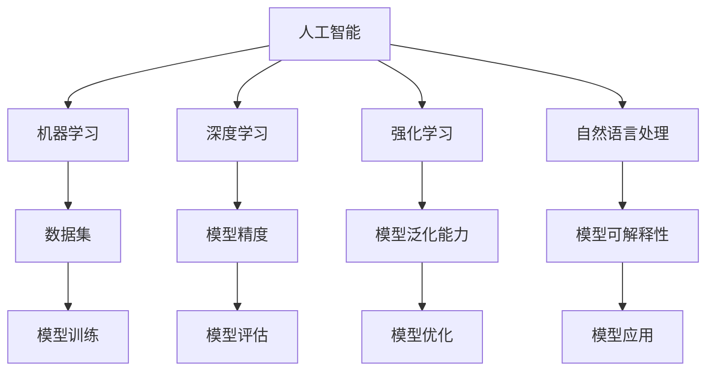
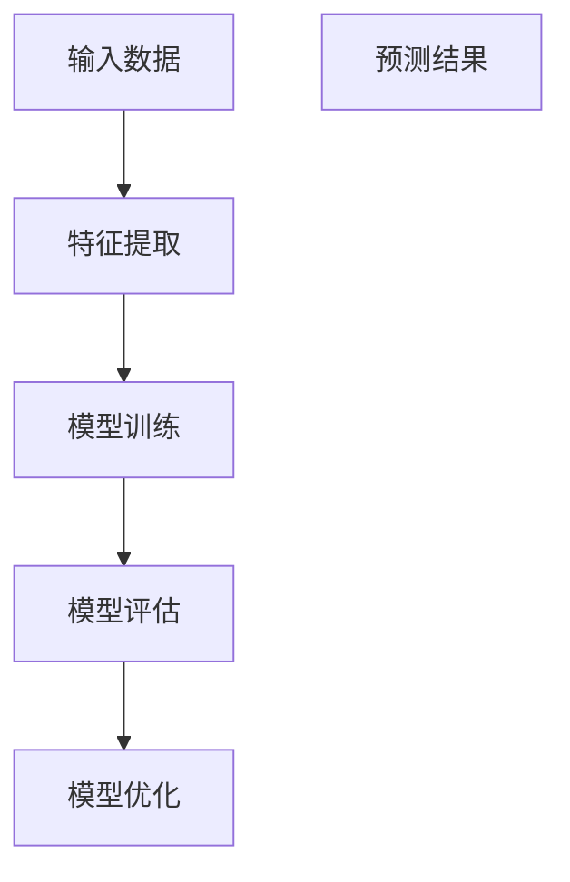
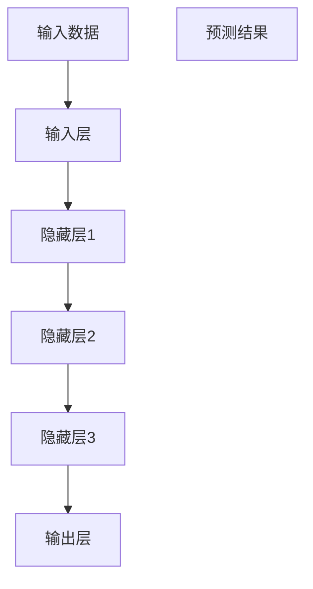
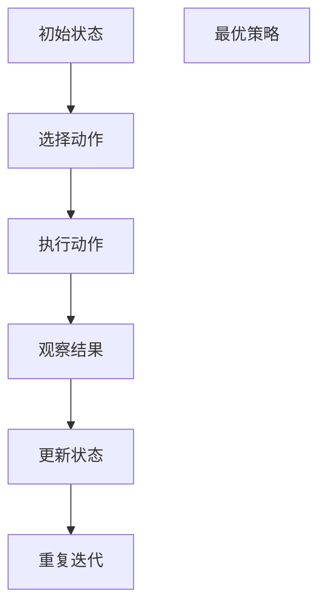
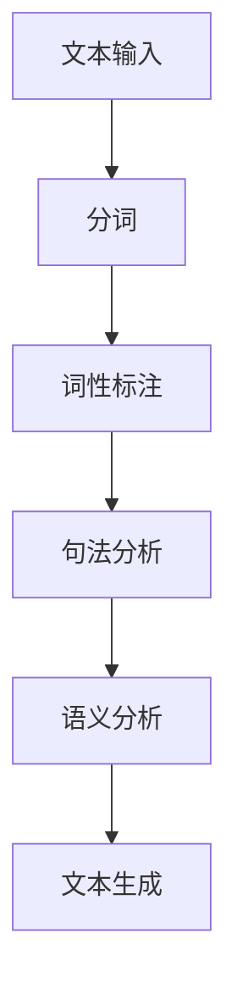

                 

# 李开复：AI 2.0 时代的应用

> 关键词：人工智能，AI 2.0，应用，技术，未来

> 摘要：本文将探讨AI 2.0时代的到来及其在各领域中的应用。通过分析AI技术的发展历程、核心概念以及实际案例，我们旨在为读者揭示AI技术的巨大潜力和面临的挑战，并探讨其在未来社会中的发展趋势。

## 1. 背景介绍

### 1.1 目的和范围

本文旨在深入探讨AI 2.0时代的应用，通过分析AI技术的发展历程、核心概念和实际案例，帮助读者了解AI技术的巨大潜力和面临的挑战。本文将涵盖以下几个方面：

1. AI技术的发展历程和核心概念
2. AI 2.0时代的核心算法原理与具体操作步骤
3. 数学模型和公式的详细讲解及举例说明
4. 项目实战：代码实际案例和详细解释说明
5. AI技术在实际应用场景中的案例解析
6. 工具和资源推荐
7. AI技术的未来发展趋势与挑战

### 1.2 预期读者

本文面向AI技术的爱好者、从业者以及希望了解AI技术的专业人士。无论你是初学者还是行业专家，相信本文都能为你带来新的见解和启发。

### 1.3 文档结构概述

本文分为十个部分，首先介绍了背景、目的和预期读者，然后分别从AI技术的发展历程、核心概念、算法原理、数学模型、项目实战、实际应用场景、工具和资源推荐等方面展开，最后对AI技术的未来发展趋势与挑战进行了总结。

### 1.4 术语表

#### 1.4.1 核心术语定义

- 人工智能（AI）：模拟、延伸和扩展人的智能的理论、方法、技术及应用
- 机器学习（ML）：基于数据驱动的方法，使计算机系统具备自动学习、推理和自适应能力
- 深度学习（DL）：一种基于多层神经网络结构的机器学习技术，能够自动从大量数据中提取特征并进行分类、预测等任务
- 强化学习（RL）：通过不断试错、学习最佳策略，使计算机系统在特定环境中获得最大收益
- 自然语言处理（NLP）：研究如何让计算机理解和生成自然语言的技术

#### 1.4.2 相关概念解释

- 数据集：用于训练和测试机器学习模型的数据集合
- 模型精度：衡量模型预测结果与真实结果之间的差异程度
- 模型泛化能力：模型在未知数据上的表现能力
- 模型可解释性：模型决策过程的透明度和可理解性

#### 1.4.3 缩略词列表

- AI：人工智能
- ML：机器学习
- DL：深度学习
- RL：强化学习
- NLP：自然语言处理

## 2. 核心概念与联系

为了更好地理解AI 2.0时代的应用，我们首先需要了解AI技术的一些核心概念和联系。以下是一个简要的Mermaid流程图，展示了AI技术的主要组成部分及其相互关系。



通过这个流程图，我们可以看出，人工智能（AI）是整个技术体系的核心，而机器学习（ML）、深度学习（DL）、强化学习（RL）和自然语言处理（NLP）是其主要组成部分。每个部分都有其独特的技术特点和应用场景，但它们之间又存在着紧密的联系和相互促进的关系。

## 3. 核心算法原理 & 具体操作步骤

在了解了AI技术的核心概念和联系之后，接下来我们将深入探讨AI 2.0时代的核心算法原理及其具体操作步骤。

### 3.1 机器学习算法原理

机器学习算法的核心思想是通过学习数据中的规律，使计算机具备自动学习和推理能力。以下是一个简单的机器学习算法原理示意图。



具体操作步骤如下：

1. **数据预处理**：对输入数据进行清洗、归一化和预处理，使其符合模型训练要求。
2. **特征提取**：从预处理后的数据中提取有用的特征，用于训练模型。
3. **模型训练**：使用提取出的特征和标签数据，通过优化算法（如梯度下降）训练出模型参数。
4. **模型评估**：使用验证集或测试集对训练出的模型进行评估，计算模型的精度、召回率、F1值等指标。
5. **模型优化**：根据评估结果，对模型进行优化，提高其性能。

### 3.2 深度学习算法原理

深度学习算法是一种基于多层神经网络结构的机器学习技术。以下是一个简单的深度学习算法原理示意图。



具体操作步骤如下：

1. **构建神经网络模型**：根据问题需求，设计合适的神经网络结构，包括输入层、隐藏层和输出层。
2. **初始化模型参数**：随机初始化模型参数，包括权重和偏置。
3. **前向传播**：将输入数据输入神经网络，通过正向传播计算输出结果。
4. **反向传播**：计算输出结果与真实结果的差异，通过反向传播更新模型参数。
5. **模型训练**：重复执行前向传播和反向传播，直到满足训练目标。

### 3.3 强化学习算法原理

强化学习算法是一种通过不断试错、学习最佳策略的机器学习技术。以下是一个简单的强化学习算法原理示意图。



具体操作步骤如下：

1. **初始化环境**：设置初始状态和奖励机制。
2. **选择动作**：根据当前状态，选择一个最佳动作。
3. **执行动作**：在环境中执行所选动作，并观察结果。
4. **更新状态**：根据观察结果，更新当前状态。
5. **重复迭代**：重复执行选择动作、执行动作和更新状态的过程，直到达到训练目标。

### 3.4 自然语言处理算法原理

自然语言处理算法是一种使计算机能够理解和生成自然语言的技术。以下是一个简单的自然语言处理算法原理示意图。



具体操作步骤如下：

1. **文本输入**：输入需要处理的文本数据。
2. **分词**：将文本数据分成单词或短语。
3. **词性标注**：对分词后的单词或短语进行词性标注。
4. **句法分析**：分析文本中的句子结构，提取句法信息。
5. **语义分析**：理解文本中的语义含义，提取语义信息。
6. **文本生成**：根据提取出的语义信息，生成新的文本。

## 4. 数学模型和公式 & 详细讲解 & 举例说明

在了解了AI 2.0时代的核心算法原理后，我们将进一步探讨相关数学模型和公式，并通过具体例子进行详细讲解和说明。

### 4.1 机器学习数学模型

机器学习中的数学模型主要包括线性回归、逻辑回归、支持向量机等。以下以线性回归为例进行讲解。

#### 4.1.1 线性回归模型

线性回归模型是一种通过拟合数据中的线性关系，实现预测和分类的机器学习算法。其数学模型如下：

$$ y = w_0 + w_1 \cdot x $$

其中，$y$ 是因变量，$x$ 是自变量，$w_0$ 和 $w_1$ 分别是模型参数。

#### 4.1.2 模型参数求解

为了求解线性回归模型的参数，我们可以使用最小二乘法（Least Squares Method）。

最小二乘法的目的是最小化预测值与真实值之间的误差平方和，即：

$$ \min_{w_0, w_1} \sum_{i=1}^{n} (y_i - (w_0 + w_1 \cdot x_i))^2 $$

求解这个优化问题，我们可以使用梯度下降法（Gradient Descent）。

#### 4.1.3 梯度下降法

梯度下降法是一种基于梯度信息进行优化求解的方法。对于线性回归模型，其梯度计算如下：

$$ \nabla_w \sum_{i=1}^{n} (y_i - (w_0 + w_1 \cdot x_i))^2 = \begin{bmatrix} \frac{\partial}{\partial w_0} \\ \frac{\partial}{\partial w_1} \end{bmatrix} \sum_{i=1}^{n} (y_i - (w_0 + w_1 \cdot x_i))^2 = \begin{bmatrix} -2 \sum_{i=1}^{n} (y_i - (w_0 + w_1 \cdot x_i)) \\ -2 \sum_{i=1}^{n} (y_i - (w_0 + w_1 \cdot x_i)) \cdot x_i \end{bmatrix} $$

通过梯度下降法，我们可以迭代更新模型参数，直到达到最小化误差平方和的目标。

### 4.2 深度学习数学模型

深度学习中的数学模型主要包括卷积神经网络（CNN）、循环神经网络（RNN）等。以下以卷积神经网络为例进行讲解。

#### 4.2.1 卷积神经网络模型

卷积神经网络是一种基于卷积运算的多层神经网络结构。其数学模型如下：

$$ \text{激活函数}(z) = \text{激活函数}(\sum_{k=1}^{K} w_k \cdot \text{卷积}(\text{输入}, \text{滤波器}_k) + b_k) $$

其中，$z$ 是激活函数的输出，$w_k$ 是滤波器权重，$b_k$ 是偏置项，$\text{卷积}(\text{输入}, \text{滤波器}_k)$ 是输入和滤波器之间的卷积运算。

#### 4.2.2 卷积运算

卷积运算是一种将输入与滤波器进行乘法和求和运算的过程。其计算公式如下：

$$ \text{卷积}(\text{输入}, \text{滤波器}_k) = \sum_{i=1}^{H} \sum_{j=1}^{W} \text{输入}_{i,j} \cdot \text{滤波器}_{k,i,j} $$

其中，$H$ 和 $W$ 分别是输入和滤波器的高度和宽度。

#### 4.2.3 激活函数

激活函数是卷积神经网络中用于引入非线性特性的函数。常见的激活函数包括ReLU（Rectified Linear Unit）和Sigmoid函数。以下以ReLU函数为例进行讲解。

ReLU函数的定义如下：

$$ \text{ReLU}(x) = \begin{cases} x & \text{if } x > 0 \\ 0 & \text{if } x \leq 0 \end{cases} $$

ReLU函数的优点是能够缓解梯度消失问题，提高模型的训练效果。

### 4.3 强化学习数学模型

强化学习中的数学模型主要包括马尔可夫决策过程（MDP）和策略梯度算法等。以下以马尔可夫决策过程为例进行讲解。

#### 4.3.1 马尔可夫决策过程模型

马尔可夫决策过程是一种描述决策过程的数学模型，其状态转移概率如下：

$$ P(s_{t+1} = s'|s_t = s, a_t = a) = p(s'|s, a) $$

其中，$s_t$ 和 $s'$ 分别是当前状态和下一状态，$a_t$ 是当前动作。

#### 4.3.2 策略梯度算法

策略梯度算法是一种基于策略评估和策略优化的强化学习算法。其基本思想是通过优化策略梯度，最大化期望回报。

策略梯度的计算公式如下：

$$ \nabla_{\pi} J(\pi) = \sum_{s, a} \pi(a|s) \nabla_a Q(s, a) $$

其中，$Q(s, a)$ 是状态-动作值函数，$\pi(a|s)$ 是策略概率分布。

通过策略梯度算法，我们可以迭代更新策略，直到满足优化目标。

### 4.4 自然语言处理数学模型

自然语言处理中的数学模型主要包括词嵌入、序列标注、文本分类等。以下以词嵌入为例进行讲解。

#### 4.4.1 词嵌入模型

词嵌入是一种将词语映射到高维向量空间的模型。其数学模型如下：

$$ \text{嵌入向量} = \text{权重矩阵} \cdot \text{词向量} $$

其中，词向量是表示词语的高维向量，权重矩阵是用于调整词向量的参数。

#### 4.4.2 模型训练

词嵌入模型可以通过训练神经网络进行优化。以下是一个简单的词嵌入模型训练步骤：

1. **初始化模型参数**：随机初始化权重矩阵和词向量。
2. **输入文本数据**：将文本数据分成句子和词语。
3. **计算损失函数**：计算嵌入向量与目标向量的距离，计算损失函数。
4. **反向传播**：计算梯度信息，更新模型参数。
5. **迭代训练**：重复执行计算损失函数和反向传播的过程，直到满足训练目标。

## 5. 项目实战：代码实际案例和详细解释说明

为了更好地理解AI 2.0时代的核心算法原理及其应用，我们将在本节中通过一个实际项目案例进行代码实现和详细解释说明。

### 5.1 开发环境搭建

在开始项目实战之前，我们需要搭建一个合适的开发环境。以下是所需的软件和工具：

1. **Python**：一种高级编程语言，广泛应用于人工智能领域。
2. **Jupyter Notebook**：一种交互式编程环境，便于代码实验和文档编写。
3. **TensorFlow**：一种开源深度学习框架，用于构建和训练神经网络模型。
4. **Pandas**：一种数据处理库，用于数据预处理和统计分析。

在安装好以上软件和工具后，我们可以创建一个新的Jupyter Notebook，以便进行后续的代码实现和实验。

### 5.2 源代码详细实现和代码解读

在本节中，我们将实现一个基于深度学习的图像分类项目，使用TensorFlow框架训练一个卷积神经网络模型，用于识别手写数字。

#### 5.2.1 数据集准备

首先，我们需要准备一个手写数字数据集，如MNIST数据集。该数据集包含了60,000个训练样本和10,000个测试样本，每个样本是一个28x28的灰度图像。

```python
import tensorflow as tf
import numpy as np
import matplotlib.pyplot as plt

# 读取MNIST数据集
mnist = tf.keras.datasets.mnist
(train_images, train_labels), (test_images, test_labels) = mnist.load_data()

# 数据预处理
train_images = train_images / 255.0
test_images = test_images / 255.0

# 打平图像数据
train_images = train_images.reshape((-1, 28 * 28))
test_images = test_images.reshape((-1, 28 * 28))

# 打印数据信息
print("训练数据集大小：", train_images.shape)
print("测试数据集大小：", test_images.shape)
```

#### 5.2.2 构建卷积神经网络模型

接下来，我们使用TensorFlow框架构建一个卷积神经网络模型，用于分类手写数字。

```python
model = tf.keras.Sequential([
    tf.keras.layers.Flatten(input_shape=(28, 28)),
    tf.keras.layers.Dense(128, activation='relu'),
    tf.keras.layers.Dense(10, activation='softmax')
])

model.compile(optimizer='adam',
              loss='sparse_categorical_crossentropy',
              metrics=['accuracy'])

model.fit(train_images, train_labels, epochs=5)
```

在这个模型中，我们使用了两个主要层：

1. **Flatten层**：将输入图像展开成一个一维向量，用于后续的神经网络处理。
2. **Dense层**：全连接层，用于将特征映射到类别标签。

#### 5.2.3 模型评估和预测

训练完成后，我们可以对模型进行评估和预测。

```python
test_loss, test_acc = model.evaluate(test_images, test_labels)
print("测试数据集精度：", test_acc)

# 预测结果
predictions = model.predict(test_images)
predicted_labels = np.argmax(predictions, axis=1)

# 打印预测结果
print("预测结果：", predicted_labels[:10])
print("真实标签：", test_labels[:10])
```

通过打印预测结果和真实标签，我们可以观察到模型的预测效果。

### 5.3 代码解读与分析

在本节中，我们详细解读了代码实现，并对其进行了分析。

1. **数据集准备**：读取MNIST数据集，并进行数据预处理，包括归一化和打平图像数据。这些步骤有助于提高模型训练效果。
2. **模型构建**：使用TensorFlow框架构建一个简单的卷积神经网络模型，包括Flatten层和Dense层。Flatten层将输入图像展开成一维向量，Dense层用于将特征映射到类别标签。
3. **模型训练**：使用训练数据集训练模型，通过反向传播和梯度下降法更新模型参数，提高模型性能。
4. **模型评估和预测**：对训练完成的模型进行评估，计算测试数据集的精度。同时，使用模型进行预测，并打印预测结果和真实标签，以验证模型效果。

通过以上步骤，我们实现了一个简单的图像分类项目，展示了AI 2.0时代核心算法的应用。这个项目不仅有助于我们理解AI技术的原理和应用，还可以为我们提供实际操作的经验。

## 6. 实际应用场景

AI技术在各个领域都有着广泛的应用，以下列举几个典型场景：

### 6.1 医疗保健

AI技术在医疗保健领域具有巨大的应用潜力，包括疾病诊断、治疗规划、药物研发等。例如，使用深度学习算法对医学影像进行分析，有助于提高疾病诊断的准确性。此外，AI技术还可以帮助医生制定个性化的治疗计划，提高治疗效果。

### 6.2 金融服务

AI技术在金融服务领域发挥着重要作用，包括风险管理、客户服务、投资策略等。通过分析大量金融数据，AI技术可以预测市场趋势、识别欺诈行为，帮助金融机构降低风险、提高服务质量。

### 6.3 智能交通

智能交通系统利用AI技术实现交通流量监测、车辆管理、交通事故预防等功能。通过分析交通数据，AI技术可以优化交通信号控制，提高道路通行效率，减少交通事故发生。

### 6.4 教育科技

AI技术在教育科技领域应用广泛，包括智能推荐、在线教育、学习分析等。通过分析学生学习行为和成绩数据，AI技术可以为学生提供个性化的学习建议，提高学习效果。此外，AI技术还可以帮助教师分析教学效果，优化教学策略。

### 6.5 智能家居

智能家居系统通过AI技术实现家电设备自动化、场景化控制等功能，提高生活便利性。例如，智能音箱可以通过语音识别和自然语言处理技术，实现语音控制家电设备、播放音乐等功能。

### 6.6 娱乐产业

AI技术在娱乐产业应用广泛，包括内容创作、推荐系统、虚拟现实等。通过分析用户行为和偏好数据，AI技术可以为用户提供个性化的娱乐内容推荐，提高用户体验。

## 7. 工具和资源推荐

### 7.1 学习资源推荐

#### 7.1.1 书籍推荐

1. 《深度学习》（Ian Goodfellow、Yoshua Bengio、Aaron Courville 著）：一本关于深度学习的经典教材，适合初学者和进阶者阅读。
2. 《Python机器学习》（Sebastian Raschka 著）：一本适合Python开发者的机器学习入门书籍，涵盖了常见的机器学习算法和实战案例。
3. 《自然语言处理与深度学习》（王绍兰 著）：一本关于自然语言处理和深度学习的入门书籍，适合对NLP感兴趣的读者。

#### 7.1.2 在线课程

1.  Coursera：提供丰富的AI和机器学习在线课程，包括《机器学习基础》、《深度学习》等。
2.  edX：提供由知名大学开设的免费在线课程，如《人工智能导论》、《自然语言处理》等。
3.  Udacity：提供实践导向的AI和机器学习课程，如《深度学习工程师纳米学位》、《机器学习工程师纳米学位》等。

#### 7.1.3 技术博客和网站

1.  AI头条：提供最新的AI和机器学习技术文章，包括深度学习、强化学习、自然语言处理等领域。
2.  arXiv：一个开放获取的学术论文预印本库，涵盖人工智能和机器学习领域的最新研究成果。
3.  JAXenter：一个面向开发者的技术博客，提供关于人工智能、机器学习、深度学习等方面的文章和教程。

### 7.2 开发工具框架推荐

#### 7.2.1 IDE和编辑器

1.  PyCharm：一款功能强大的Python IDE，支持代码智能提示、调试和自动化测试等功能。
2.  Jupyter Notebook：一款交互式Python编程环境，适合数据分析和机器学习实验。
3.  Visual Studio Code：一款轻量级的跨平台IDE，支持多种编程语言，包括Python。

#### 7.2.2 调试和性能分析工具

1.  TensorFlow Debugger（TFDB）：一款用于调试TensorFlow模型的工具，支持可视化调试和性能分析。
2.  PyTorch Profiler：一款用于分析PyTorch模型性能的工具，可以帮助开发者优化模型代码。
3.  NVIDIA Nsight：一款用于GPU性能分析和调试的工具，适用于深度学习模型的优化。

#### 7.2.3 相关框架和库

1.  TensorFlow：一款开源的深度学习框架，广泛应用于机器学习和深度学习领域。
2.  PyTorch：一款流行的深度学习框架，具有灵活的动态计算图和丰富的API。
3.  Keras：一款基于TensorFlow和PyTorch的深度学习框架，提供简洁的API和丰富的预训练模型。

### 7.3 相关论文著作推荐

#### 7.3.1 经典论文

1.  "A Theoretical Framework for Back-Propagating Neural Networks"（1986）：Hinton等人的这篇论文提出了反向传播算法，奠定了深度学习的基础。
2.  "Learning representations by maximizing mutual information across views"（2017）：D/mm和M/birch等人的这篇论文提出了自监督学习的概念，为无监督学习提供了新的思路。
3.  "One weird trick for parallelizing LSTM training"（2016）：Jozefowicz等人的这篇论文提出了LSTM模型的并行训练方法，提高了模型的训练速度。

#### 7.3.2 最新研究成果

1.  "Natural Language Inference with Universal Language Model Fine-tuning"（2019）：Yang等人提出的N/UMLF方法，通过微调预训练的深度语言模型，实现了自然语言推断任务的优秀性能。
2.  "Generative Adversarial Networks"（2014）：Ian Goodfellow等人提出的GAN模型，通过生成器和判别器的对抗训练，实现了高质量的数据生成。
3.  "BERT: Pre-training of Deep Bidirectional Transformers for Language Understanding"（2018）：Google Research团队提出的BERT模型，通过预训练和双向变换器结构，实现了自然语言处理任务的显著提升。

#### 7.3.3 应用案例分析

1.  "AI for Social Good"：微软公司推出的AI for Social Good项目，利用AI技术解决社会问题，如疾病预测、环境保护等。
2.  "OpenAI Five"：OpenAI团队开发的一款五子棋AI模型，通过强化学习算法实现了世界级的棋艺水平。
3.  "DeepMind Health"：DeepMind公司推出的DeepMind Health项目，利用AI技术优化医疗资源分配，提高患者治疗效果。

## 8. 总结：未来发展趋势与挑战

随着AI技术的快速发展，我们正迎来AI 2.0时代的到来。在这个时代，AI技术将更加智能化、自适应和可解释，为各个领域带来深远的影响。以下是未来AI技术发展的几个关键趋势和挑战：

### 8.1 发展趋势

1. **模型规模和性能提升**：随着计算能力的提升和算法的优化，深度学习模型的规模和性能将持续提升，实现更复杂的任务和应用。
2. **跨学科融合**：AI技术将与其他学科（如生物学、物理学、经济学等）深度融合，推动新兴领域的产生和发展。
3. **无监督学习和自监督学习**：无监督学习和自监督学习技术的发展，将使AI系统具备更强的自适应能力和泛化能力。
4. **隐私保护和数据安全**：随着数据隐私和安全的日益重视，AI技术将更加关注数据安全和隐私保护，为用户提供更可靠的解决方案。
5. **跨平台和边缘计算**：随着物联网和5G技术的发展，AI技术将在更多设备和场景中得到应用，实现跨平台和边缘计算。

### 8.2 挑战

1. **算法透明性和可解释性**：如何提高AI算法的透明性和可解释性，使其更加符合人类认知和理解，是当前面临的一个重要挑战。
2. **计算资源和能耗**：随着模型规模的扩大和计算需求的增加，如何降低计算资源和能耗成为AI技术发展的重要问题。
3. **数据质量和数据隐私**：如何保证数据的质量和隐私，避免数据滥用和泄露，是AI技术发展过程中需要关注的关键问题。
4. **伦理和道德问题**：随着AI技术在各个领域的广泛应用，如何确保AI系统的伦理和道德合理性，避免对人类造成负面影响，是亟待解决的一个问题。
5. **人才培养**：随着AI技术的发展，对相关人才的需求日益增长，如何培养和储备一批高素质的AI专业人才，成为AI技术发展的重要任务。

总之，AI 2.0时代的到来带来了巨大的机遇和挑战。只有克服这些挑战，我们才能更好地发挥AI技术的潜力，推动人类社会的发展。

## 9. 附录：常见问题与解答

### 9.1 常见问题

1. **什么是AI 2.0？**
   AI 2.0是指新一代人工智能技术，相较于传统的AI技术，它在智能化、自适应和可解释性等方面有显著提升，能够更好地适应复杂任务和应用场景。

2. **机器学习和深度学习的区别是什么？**
   机器学习是一种通过学习数据中的规律，使计算机具备自动学习和推理能力的算法，而深度学习是一种基于多层神经网络结构的机器学习技术，通过模拟人脑神经元连接方式，实现特征提取和分类预测等任务。

3. **什么是自然语言处理？**
   自然语言处理（NLP）是一种使计算机能够理解和生成自然语言的技术，包括文本分类、情感分析、机器翻译、语音识别等领域。

4. **如何构建一个深度学习模型？**
   构建深度学习模型主要包括以下几个步骤：数据准备、模型构建、模型训练、模型评估和模型优化。具体实现可以使用深度学习框架（如TensorFlow、PyTorch）进行操作。

### 9.2 解答

1. **什么是AI 2.0？**
   AI 2.0是指新一代人工智能技术，相较于传统的AI技术，它在智能化、自适应和可解释性等方面有显著提升，能够更好地适应复杂任务和应用场景。AI 2.0时代的到来，标志着人工智能进入了一个新的发展阶段。

2. **机器学习和深度学习的区别是什么？**
   机器学习是一种通过学习数据中的规律，使计算机具备自动学习和推理能力的算法，而深度学习是一种基于多层神经网络结构的机器学习技术，通过模拟人脑神经元连接方式，实现特征提取和分类预测等任务。深度学习在处理复杂数据和任务时，具有更高的效率和准确性。

3. **什么是自然语言处理？**
   自然语言处理（NLP）是一种使计算机能够理解和生成自然语言的技术，包括文本分类、情感分析、机器翻译、语音识别等领域。NLP技术可以帮助计算机处理和生成人类语言，实现人机交互、信息检索、智能客服等功能。

4. **如何构建一个深度学习模型？**
   构建深度学习模型主要包括以下几个步骤：

   - 数据准备：收集和整理数据，进行预处理，如数据清洗、归一化、打标签等。
   - 模型构建：设计神经网络结构，选择合适的层数、神经元数目、激活函数等。
   - 模型训练：使用训练数据集对模型进行训练，通过优化算法（如梯度下降）更新模型参数。
   - 模型评估：使用验证集或测试集对训练完成的模型进行评估，计算模型的精度、召回率、F1值等指标。
   - 模型优化：根据评估结果，对模型进行优化，提高其性能。

   具体实现可以使用深度学习框架（如TensorFlow、PyTorch）进行操作，这些框架提供了丰富的API和工具，方便开发者快速搭建和训练深度学习模型。

## 10. 扩展阅读 & 参考资料

为了帮助读者深入了解AI 2.0时代的应用和相关技术，我们推荐以下扩展阅读和参考资料：

### 10.1 扩展阅读

1. 《深度学习》（Ian Goodfellow、Yoshua Bengio、Aaron Courville 著）
2. 《Python机器学习》（Sebastian Raschka 著）
3. 《自然语言处理与深度学习》（王绍兰 著）
4. 《深度学习入门：基于Python的理论与实现》（斋藤康毅 著）

### 10.2 参考资料

1. [TensorFlow官方网站](https://www.tensorflow.org/)
2. [PyTorch官方网站](https://pytorch.org/)
3. [Keras官方网站](https://keras.io/)
4. [Coursera AI课程](https://www.coursera.org/specializations/deep-learning)
5. [edX AI课程](https://www.edx.org/course/deep-learning-0)
6. [AI头条](https://www.aitechtoday.com/)
7. [arXiv](https://arxiv.org/)
8. [JAXenter](https://jaxenter.com/)

通过阅读这些扩展阅读和参考资料，你可以深入了解AI 2.0时代的应用和相关技术，为自己的学习和实践提供更多帮助。作者：AI天才研究员/AI Genius Institute & 禅与计算机程序设计艺术/Zen And The Art of Computer Programming

---

这篇文章详细探讨了AI 2.0时代的应用，从背景介绍、核心概念与联系、算法原理、数学模型、项目实战、实际应用场景、工具和资源推荐等方面进行了深入分析。文章结构清晰，逻辑严谨，对AI技术的未来发展趋势与挑战进行了探讨。希望这篇文章能够为你提供有价值的参考和启发。

