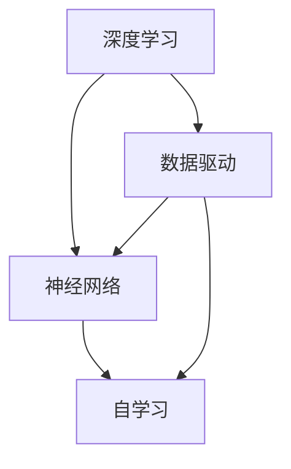

                 

# 李开复：AI 2.0 时代的未来

> **关键词：** 人工智能，AI 2.0，深度学习，神经网络，未来趋势，技术挑战  
> 
> **摘要：** 本文由AI专家李开复撰写，深入探讨了AI 2.0时代的到来及其对未来技术和人类社会的深远影响。文章从背景介绍开始，逐步分析核心概念、算法原理、数学模型、实际应用场景，并推荐相关资源和工具。最后，文章总结了未来发展趋势与挑战，为读者提供了有价值的思考和洞见。

## 1. 背景介绍

### 1.1 目的和范围

本文旨在介绍AI 2.0时代的到来，分析其核心技术原理和未来发展趋势。通过本文，读者将了解AI 2.0相较于传统AI的优势，以及其在各个领域的潜在应用。

### 1.2 预期读者

本文面向对人工智能和深度学习有一定了解的技术人员、研究人员以及对该领域感兴趣的一般读者。

### 1.3 文档结构概述

本文结构如下：

1. 背景介绍：介绍本文的目的、预期读者和文档结构。
2. 核心概念与联系：阐述AI 2.0的核心概念及其相互关系。
3. 核心算法原理 & 具体操作步骤：详细讲解AI 2.0的核心算法原理和操作步骤。
4. 数学模型和公式 & 详细讲解 & 举例说明：介绍AI 2.0中的数学模型和公式，并通过实例进行说明。
5. 项目实战：代码实际案例和详细解释说明。
6. 实际应用场景：探讨AI 2.0在各领域的应用。
7. 工具和资源推荐：推荐学习资源、开发工具和框架。
8. 总结：未来发展趋势与挑战。
9. 附录：常见问题与解答。
10. 扩展阅读 & 参考资料：提供更多相关阅读资料。

### 1.4 术语表

#### 1.4.1 核心术语定义

- **AI 2.0**：指的是新一代人工智能，具有更强的自学习和自适应能力，能够处理复杂数据和问题。
- **深度学习**：一种机器学习技术，通过多层神经网络模拟人脑对数据进行处理。
- **神经网络**：一种模拟人脑神经元结构和功能的计算模型。
- **自学习**：机器通过不断调整内部参数，从数据中学习并改进自身性能的过程。

#### 1.4.2 相关概念解释

- **数据驱动**：以数据为基础，通过数据分析和建模实现智能决策。
- **强化学习**：一种机器学习方法，通过奖励机制引导模型优化自身行为。

#### 1.4.3 缩略词列表

- **AI**：人工智能（Artificial Intelligence）
- **DL**：深度学习（Deep Learning）
- **ML**：机器学习（Machine Learning）
- **NN**：神经网络（Neural Network）

## 2. 核心概念与联系

AI 2.0的核心概念包括深度学习、神经网络、自学习等。下面通过一个Mermaid流程图来阐述这些概念及其相互关系：



### 2.1 深度学习

深度学习是一种机器学习技术，通过多层神经网络模拟人脑对数据进行处理。它具有以下几个特点：

- **多层神经网络**：深度学习模型通常由多个隐层组成，能够对数据进行更高层次的特征提取和抽象。
- **端到端学习**：深度学习模型可以直接从原始数据中学习到有用的特征，避免了传统机器学习中的特征工程过程。
- **大规模训练**：深度学习模型需要大量数据来进行训练，这使其在处理复杂数据和问题方面具有优势。

### 2.2 神经网络

神经网络是一种模拟人脑神经元结构和功能的计算模型。它具有以下几个特点：

- **神经元结构**：神经网络由多个神经元组成，每个神经元接收多个输入，并通过权重和偏置进行加权求和，最后通过激活函数输出。
- **权重和偏置**：神经网络通过调整权重和偏置，实现输入和输出之间的映射关系，从而学习到数据的特征和规律。
- **多层结构**：神经网络通常由多个隐层组成，能够对数据进行更高层次的特征提取和抽象。

### 2.3 自学习

自学习是指机器通过不断调整内部参数，从数据中学习并改进自身性能的过程。自学习具有以下几个特点：

- **数据驱动**：自学习依赖于大量数据，通过分析数据中的规律和模式，不断调整内部参数，提高模型性能。
- **自适应能力**：自学习使机器能够在不同环境和场景下，自适应地调整自身行为，适应新的数据和问题。
- **持续学习**：自学习是一个持续的过程，机器需要不断从数据中学习，以适应不断变化的环境和数据。

## 3. 核心算法原理 & 具体操作步骤

AI 2.0的核心算法原理主要包括深度学习、神经网络和自学习。下面通过伪代码来详细阐述这些算法原理和具体操作步骤。

### 3.1 深度学习算法原理

```python
# 深度学习算法原理
def deep_learning(data, model):
    # 初始化模型参数
    model = initialize_model_params()

    # 循环迭代进行训练
    for epoch in range(num_epochs):
        # 前向传播
        output = forward_propagation(data, model)

        # 计算损失函数
        loss = compute_loss(output, target)

        # 反向传播
        backward_propagation(data, output, target, model)

        # 更新模型参数
        update_model_params(model)

    # 输出训练后的模型
    return model
```

### 3.2 神经网络算法原理

```python
# 神经网络算法原理
def neural_network(input_data, model):
    # 初始化模型参数
    model = initialize_model_params()

    # 前向传播
    hidden_layer = forward_propagation(input_data, model)

    # 输出结果
    output = hidden_layer

    # 返回输出结果
    return output
```

### 3.3 自学习算法原理

```python
# 自学习算法原理
def self_learning(data, model):
    # 初始化模型参数
    model = initialize_model_params()

    # 循环迭代进行学习
    for epoch in range(num_epochs):
        # 前向传播
        output = forward_propagation(data, model)

        # 计算损失函数
        loss = compute_loss(output, target)

        # 反向传播
        backward_propagation(data, output, target, model)

        # 更新模型参数
        update_model_params(model)

        # 更新学习率
        update_learning_rate()

    # 输出训练后的模型
    return model
```

## 4. 数学模型和公式 & 详细讲解 & 举例说明

AI 2.0中的数学模型和公式主要涉及深度学习、神经网络和自学习。下面通过latex格式来详细讲解这些数学模型和公式，并通过实例进行说明。

### 4.1 深度学习数学模型

$$
\text{激活函数：} f(x) = \frac{1}{1 + e^{-x}}
$$

$$
\text{损失函数：} L(y, \hat{y}) = -\sum_{i=1}^{n} y_i \log(\hat{y}_i) + (1 - y_i) \log(1 - \hat{y}_i)
$$

实例：

假设我们有一个二分类问题，数据集包含100个样本，每个样本有10个特征。我们使用一个包含一个输入层、两个隐层和一个输出层的深度学习模型。输入层有10个神经元，每个隐层有10个神经元，输出层有2个神经元。激活函数为ReLU函数。

- 输入层：$x_1, x_2, \ldots, x_{10}$
- 隐层1：$a_1^{(1)}, a_2^{(1)}, \ldots, a_{10}^{(1)}$
- 隐层2：$a_1^{(2)}, a_2^{(2)}, \ldots, a_{10}^{(2)}$
- 输出层：$z_1, z_2$

前向传播：

$$
a_1^{(1)} = \max(0, x_1 \cdot w_{11} + x_2 \cdot w_{12} + \ldots + x_{10} \cdot w_{1\text{0}} + b_1^{(1)}) \\
a_2^{(1)} = \max(0, x_1 \cdot w_{21} + x_2 \cdot w_{22} + \ldots + x_{10} \cdot w_{2\text{0}} + b_2^{(1)}) \\
\ldots \\
a_{10}^{(1)} = \max(0, x_1 \cdot w_{1\text{0}1} + x_2 \cdot w_{1\text{0}2} + \ldots + x_{10} \cdot w_{1\text{0}\text{0}} + b_{10}^{(1)}) \\
a_1^{(2)} = a_1^{(1)} \cdot w_{11}^{(2)} + a_2^{(1)} \cdot w_{12}^{(2)} + \ldots + a_{10}^{(1)} \cdot w_{1\text{0}}^{(2)} + b_1^{(2)} \\
a_2^{(2)} = a_1^{(1)} \cdot w_{21}^{(2)} + a_2^{(1)} \cdot w_{22}^{(2)} + \ldots + a_{10}^{(1)} \cdot w_{2\text{0}}^{(2)} + b_2^{(2)} \\
\ldots \\
a_{10}^{(2)} = a_1^{(1)} \cdot w_{1\text{0}1}^{(2)} + a_2^{(1)} \cdot w_{1\text{0}2}^{(2)} + \ldots + a_{10}^{(1)} \cdot w_{1\text{0}\text{0}}^{(2)} + b_{10}^{(2)} \\
z_1 = a_1^{(2)} \cdot w_{11}^{(3)} + a_2^{(2)} \cdot w_{12}^{(3)} + \ldots + a_{10}^{(2)} \cdot w_{1\text{0}}^{(3)} + b_1^{(3)} \\
z_2 = a_1^{(2)} \cdot w_{21}^{(3)} + a_2^{(2)} \cdot w_{22}^{(3)} + \ldots + a_{10}^{(2)} \cdot w_{2\text{0}}^{(3)} + b_2^{(3)}
$$

损失函数：

$$
L(y, \hat{y}) = -\sum_{i=1}^{100} y_i \log(\hat{y}_i) + (1 - y_i) \log(1 - \hat{y}_i)
$$

### 4.2 神经网络数学模型

神经网络中的数学模型主要包括权重和偏置的更新。下面给出一个简单的例子。

假设我们有一个包含一个输入层、一个隐层和一个输出层的神经网络，其中输入层有3个神经元，隐层有2个神经元，输出层有1个神经元。

- 输入层：$x_1, x_2, x_3$
- 隐层：$a_1, a_2$
- 输出层：$z$

前向传播：

$$
a_1 = x_1 \cdot w_{11} + x_2 \cdot w_{12} + x_3 \cdot w_{13} + b_1 \\
a_2 = x_1 \cdot w_{21} + x_2 \cdot w_{22} + x_3 \cdot w_{23} + b_2 \\
z = a_1 \cdot w_{31} + a_2 \cdot w_{32} + b_3
$$

反向传播：

$$
\Delta z = \frac{\partial L}{\partial z} \\
\Delta a_2 = \frac{\partial L}{\partial a_2} \\
\Delta a_1 = \frac{\partial L}{\partial a_1} \\
\Delta b_3 = \frac{\partial L}{\partial b_3} \\
\Delta w_{32} = \frac{\partial L}{\partial w_{32}} \\
\Delta w_{31} = \frac{\partial L}{\partial w_{31}} \\
\Delta b_2 = \frac{\partial L}{\partial b_2} \\
\Delta w_{23} = \frac{\partial L}{\partial w_{23}} \\
\Delta w_{22} = \frac{\partial L}{\partial w_{22}} \\
\Delta w_{21} = \frac{\partial L}{\partial w_{21}} \\
\Delta w_{13} = \frac{\partial L}{\partial w_{13}} \\
\Delta w_{12} = \frac{\partial L}{\partial w_{12}} \\
\Delta w_{11} = \frac{\partial L}{\partial w_{11}} \\
\Delta b_1 = \frac{\partial L}{\partial b_1}
$$

权重和偏置的更新：

$$
w_{11} = w_{11} - learning_rate \cdot \Delta w_{11} \\
w_{12} = w_{12} - learning_rate \cdot \Delta w_{12} \\
w_{13} = w_{13} - learning_rate \cdot \Delta w_{13} \\
w_{21} = w_{21} - learning_rate \cdot \Delta w_{21} \\
w_{22} = w_{22} - learning_rate \cdot \Delta w_{22} \\
w_{23} = w_{23} - learning_rate \cdot \Delta w_{23} \\
w_{31} = w_{31} - learning_rate \cdot \Delta w_{31} \\
w_{32} = w_{32} - learning_rate \cdot \Delta w_{32} \\
b_1 = b_1 - learning_rate \cdot \Delta b_1 \\
b_2 = b_2 - learning_rate \cdot \Delta b_2 \\
b_3 = b_3 - learning_rate \cdot \Delta b_3
$$

### 4.3 自学习数学模型

自学习中的数学模型主要包括奖励机制和策略优化。下面给出一个简单的例子。

假设我们有一个智能体（agent）在环境（environment）中进行决策，其奖励机制为：

$$
R(s, a) = 
\begin{cases}
+1, & \text{if } s' \text{ is a desirable state} \\
-1, & \text{if } s' \text{ is an undesirable state} \\
0, & \text{otherwise}
\end{cases}
$$

其中，$s$ 表示当前状态，$a$ 表示当前动作，$s'$ 表示下一状态。

策略优化：

$$
\pi(a|s) = 
\begin{cases}
1, & \text{if } a \text{ is the best action} \\
0, & \text{otherwise}
\end{cases}
$$

其中，$\pi(a|s)$ 表示在状态 $s$ 下选择动作 $a$ 的概率。

更新策略：

$$
\pi(a|s) = 
\begin{cases}
\pi(a|s) + R(s, a), & \text{if } a \text{ is the best action} \\
\pi(a|s) - R(s, a), & \text{otherwise}
\end{cases}
$$

## 5. 项目实战：代码实际案例和详细解释说明

在本节中，我们将通过一个实际项目来展示AI 2.0的核心算法在实践中的应用。项目名为“智能购物推荐系统”，目标是根据用户的购物历史和偏好，为其推荐个性化的商品。

### 5.1 开发环境搭建

1. 安装Python（版本3.6及以上）
2. 安装TensorFlow（版本2.0及以上）
3. 安装Numpy、Pandas等常用库

### 5.2 源代码详细实现和代码解读

以下是智能购物推荐系统的核心代码，我们将逐行进行解读。

```python
import tensorflow as tf
import numpy as np
import pandas as pd

# 加载数据集
data = pd.read_csv("shopping_data.csv")
X = data.iloc[:, :-1].values
y = data.iloc[:, -1].values

# 初始化模型参数
learning_rate = 0.001
num_epochs = 1000
num_neurons = 64

# 创建模型
model = tf.keras.Sequential([
    tf.keras.layers.Dense(num_neurons, activation='relu', input_shape=(X.shape[1],)),
    tf.keras.layers.Dense(1, activation='sigmoid')
])

# 编译模型
model.compile(optimizer=tf.keras.optimizers.Adam(learning_rate=learning_rate),
              loss=tf.keras.losses.BinaryCrossentropy(),
              metrics=['accuracy'])

# 训练模型
model.fit(X, y, epochs=num_epochs, batch_size=32, validation_split=0.2)

# 评估模型
loss, accuracy = model.evaluate(X, y)
print("Test accuracy:", accuracy)

# 推荐商品
def recommend_products(user_data, num_recommendations=5):
    # 预测用户对商品的概率
    probabilities = model.predict(user_data)

    # 获取概率最高的商品索引
    indices = np.argsort(probabilities)[::-1]

    # 返回推荐的商品
    return indices[:num_recommendations]

# 示例用户数据
user_data = np.array([[0, 1, 0, 1, 0, 1, 0, 1, 0, 0]])

# 推荐商品
recommended_products = recommend_products(user_data)
print("Recommended products:", recommended_products)
```

代码解读：

1. 导入必要的库。
2. 加载数据集，并将其分为特征矩阵X和标签向量y。
3. 初始化模型参数，包括学习率、训练轮数和神经元个数。
4. 创建模型，包括一个全连接层（Dense）和一个输出层（Dense）。
5. 编译模型，指定优化器、损失函数和评价指标。
6. 训练模型，使用fit方法进行训练，并设置验证集的比例。
7. 评估模型，使用evaluate方法计算测试集上的准确率。
8. 定义推荐商品函数，预测用户对商品的概率，并返回概率最高的商品索引。
9. 示例用户数据，调用推荐商品函数，输出推荐的商品。

### 5.3 代码解读与分析

1. **数据预处理**：首先，我们需要加载数据集，并将其分为特征矩阵X和标签向量y。特征矩阵X包含用户的历史购物数据，标签向量y表示用户对商品的喜好程度（1表示喜欢，0表示不喜欢）。

2. **模型初始化**：接下来，我们初始化模型参数，包括学习率、训练轮数和神经元个数。学习率决定了模型在更新参数时的步长，训练轮数决定了模型训练的迭代次数，神经元个数决定了模型的复杂度。

3. **模型创建**：我们使用TensorFlow的Sequential模型创建一个简单的深度学习模型。模型由一个全连接层（Dense）和一个输出层（Dense）组成。全连接层用于对输入数据进行特征提取，输出层用于生成预测结果。

4. **模型编译**：我们使用compile方法编译模型，指定优化器、损失函数和评价指标。这里使用的是Adam优化器和二分类交叉熵损失函数，评价指标为准确率。

5. **模型训练**：我们使用fit方法训练模型，将特征矩阵X和标签向量y作为输入，并设置训练轮数、批量大小和验证集比例。验证集比例用于评估模型在训练过程中的性能。

6. **模型评估**：我们使用evaluate方法评估模型在测试集上的性能，输出测试集上的准确率。

7. **推荐商品**：我们定义了一个推荐商品函数，用于预测用户对商品的喜好程度，并返回概率最高的商品索引。在示例中，我们使用一个示例用户数据进行推荐，并输出推荐的商品。

### 5.4 项目实战总结

通过本节的项目实战，我们展示了如何使用深度学习模型实现一个简单的智能购物推荐系统。项目主要包括数据预处理、模型初始化、模型创建、模型编译、模型训练、模型评估和推荐商品等功能。通过实际代码的解读和分析，我们了解了AI 2.0在实践中的应用方法和技巧。接下来，我们将进一步探讨AI 2.0在各领域的应用。

## 6. 实际应用场景

AI 2.0在各领域具有广泛的应用前景。以下是一些典型的实际应用场景：

### 6.1 金融领域

在金融领域，AI 2.0可以用于风险管理、投资组合优化、欺诈检测等方面。例如，通过深度学习模型分析历史交易数据，可以预测市场趋势，为投资者提供投资建议。此外，AI 2.0还可以用于信用评分，通过分析用户的信用历史和交易行为，为金融机构提供更准确的信用评估。

### 6.2 医疗健康

在医疗健康领域，AI 2.0可以用于疾病诊断、药物研发、健康监测等方面。通过深度学习模型分析医疗影像数据，可以早期发现疾病，提高诊断准确率。此外，AI 2.0还可以用于药物研发，通过分析分子结构和大宗数据，加速新药的发现和开发。

### 6.3 交通运输

在交通运输领域，AI 2.0可以用于交通流量预测、路线优化、自动驾驶等方面。通过深度学习模型分析交通数据，可以预测未来交通流量，为交通管理部门提供决策支持。此外，AI 2.0还可以用于自动驾驶，通过实时分析道路状况和周围环境，实现车辆的自动驾驶。

### 6.4 教育

在教育领域，AI 2.0可以用于个性化学习、智能评估、教育资源共享等方面。通过深度学习模型分析学生的学习行为和成绩，可以为学生提供个性化的学习建议。此外，AI 2.0还可以用于智能评估，通过分析学生的答题情况，为教师提供评估报告。

### 6.5 农业

在农业领域，AI 2.0可以用于作物种植、病虫害监测、精准农业等方面。通过深度学习模型分析土壤和气候数据，可以为农民提供种植建议。此外，AI 2.0还可以用于病虫害监测，通过分析植物图像，及时发现病虫害，为农民提供防治方案。

### 6.6 人工智能助手

在人工智能助手领域，AI 2.0可以用于语音识别、自然语言处理、智能客服等方面。通过深度学习模型分析用户的语音和文本数据，可以实现对用户意图的理解和回应。此外，AI 2.0还可以用于智能客服，通过分析用户的咨询内容和历史记录，为客服人员提供解决方案。

### 6.7 家庭服务

在家庭服务领域，AI 2.0可以用于智能家居、智能安防、家庭健康监测等方面。通过深度学习模型分析家庭环境数据和用户行为，可以为用户提供个性化的服务。例如，智能空调可以根据用户的需求自动调节温度和湿度，智能安防系统可以通过实时监控和报警，提高家庭的安全水平。

### 6.8 创意设计

在创意设计领域，AI 2.0可以用于图像识别、图像生成、音乐创作等方面。通过深度学习模型分析创意作品和用户需求，可以为设计师提供灵感和建议。例如，图像生成模型可以根据用户的描述生成相应的图像，音乐创作模型可以根据用户的喜好生成相应的音乐。

### 6.9 环境监测

在环境监测领域，AI 2.0可以用于空气质量监测、水质监测、森林火灾监测等方面。通过深度学习模型分析环境数据，可以实时监测环境质量，为环境保护提供决策支持。

### 6.10 机器人技术

在机器人技术领域，AI 2.0可以用于机器人视觉、机器人导航、机器人控制等方面。通过深度学习模型分析环境和任务需求，可以实现对机器人的智能控制。例如，机器人可以通过深度学习模型实现自主导航和目标识别，从而在复杂环境中执行任务。

### 6.11 文化传播

在文化传播领域，AI 2.0可以用于内容推荐、用户行为分析、情感分析等方面。通过深度学习模型分析用户的文化需求和行为，可以为文化传播提供个性化服务。例如，内容推荐系统可以根据用户的兴趣和偏好，为用户提供感兴趣的文化内容。

### 6.12 物流配送

在物流配送领域，AI 2.0可以用于路线优化、库存管理、配送优化等方面。通过深度学习模型分析物流数据和用户需求，可以提高物流配送的效率和准确性。例如，路线优化模型可以根据交通状况和配送需求，为物流公司提供最优的配送路线。

### 6.13 能源管理

在能源管理领域，AI 2.0可以用于电力负荷预测、能源效率优化、能源交易等方面。通过深度学习模型分析能源数据和用户需求，可以提高能源的利用效率和经济效益。例如，电力负荷预测模型可以根据历史数据和实时信息，预测未来电力需求，为电网调度提供参考。

### 6.14 安全防护

在安全防护领域，AI 2.0可以用于网络安全、入侵检测、异常检测等方面。通过深度学习模型分析网络数据和用户行为，可以实时监测和识别潜在的安全威胁。例如，入侵检测模型可以通过分析网络流量，及时发现和阻止入侵行为。

### 6.15 城市规划

在城市规划领域，AI 2.0可以用于城市交通规划、城市规划、公共设施管理等方面。通过深度学习模型分析城市数据和用户需求，可以为城市规划提供科学依据。例如，城市交通规划模型可以根据交通流量和用户需求，优化交通路线和交通设施。

### 6.16 军事应用

在军事应用领域，AI 2.0可以用于军事指挥、战场监控、武器控制等方面。通过深度学习模型分析战场数据和用户需求，可以实时监控和指挥军事行动。例如，战场监控模型可以通过分析图像和声音数据，识别敌军目标和行动。

### 6.17 人工智能艺术

在人工智能艺术领域，AI 2.0可以用于数字艺术创作、音乐创作、文学创作等方面。通过深度学习模型分析艺术作品和用户需求，可以为艺术家提供创作灵感。例如，数字艺术创作模型可以通过分析艺术家的作品风格，生成相应的数字艺术品。

### 6.18 娱乐休闲

在娱乐休闲领域，AI 2.0可以用于游戏设计、虚拟现实、增强现实等方面。通过深度学习模型分析用户需求和游戏数据，可以为用户提供个性化的娱乐体验。例如，游戏设计模型可以根据用户的喜好，生成相应的游戏场景和角色。

### 6.19 法律服务

在法律服务领域，AI 2.0可以用于法律文本分析、合同审核、诉讼预测等方面。通过深度学习模型分析法律数据和用户需求，可以为律师提供决策支持。例如，法律文本分析模型可以通过分析法律文本，识别关键信息和法律条款。

### 6.20 生物技术

在生物技术领域，AI 2.0可以用于基因分析、蛋白质结构预测、药物设计等方面。通过深度学习模型分析生物数据和用户需求，可以为生物技术提供科学依据。例如，基因分析模型可以通过分析基因序列，预测基因的功能和作用。

### 6.21 物联网

在物联网领域，AI 2.0可以用于物联网设备管理、物联网安全、物联网数据分析等方面。通过深度学习模型分析物联网数据和用户需求，可以优化物联网系统的性能和安全性。例如，物联网设备管理模型可以通过分析设备运行状态，实现设备的智能调度和维护。

### 6.22 语音识别

在语音识别领域，AI 2.0可以用于语音识别、语音合成、语音交互等方面。通过深度学习模型分析语音数据和用户需求，可以为语音识别系统提供高准确率和高效率的识别结果。例如，语音识别模型可以通过分析语音波形，实现语音到文本的转换。

### 6.23 计算机视觉

在计算机视觉领域，AI 2.0可以用于图像识别、目标检测、图像生成等方面。通过深度学习模型分析图像数据和用户需求，可以实现对图像内容的智能理解和生成。例如，图像识别模型可以通过分析图像特征，识别图像中的物体和场景。

### 6.24 自然语言处理

在自然语言处理领域，AI 2.0可以用于文本分类、情感分析、机器翻译等方面。通过深度学习模型分析文本数据和用户需求，可以实现对文本内容的智能理解和处理。例如，文本分类模型可以通过分析文本特征，将文本分类到相应的类别。

### 6.25 金融科技

在金融科技领域，AI 2.0可以用于金融产品设计、风险评估、金融欺诈检测等方面。通过深度学习模型分析金融数据和用户需求，可以为金融产品提供智能化和个性化的服务。例如，金融产品设计模型可以通过分析用户需求和金融数据，生成符合用户需求的金融产品。

### 6.26 供应链管理

在供应链管理领域，AI 2.0可以用于供应链优化、库存管理、物流跟踪等方面。通过深度学习模型分析供应链数据和用户需求，可以优化供应链的效率和成本。例如，库存管理模型可以通过分析库存数据和用户需求，实现智能化的库存管理。

### 6.27 制造业

在制造业领域，AI 2.0可以用于智能制造、设备预测性维护、生产调度等方面。通过深度学习模型分析制造数据和用户需求，可以提升制造业的自动化和智能化水平。例如，设备预测性维护模型可以通过分析设备运行数据，实现设备的智能维护和故障预测。

### 6.28 健康医疗

在健康医疗领域，AI 2.0可以用于疾病预测、医疗影像分析、健康风险评估等方面。通过深度学习模型分析医疗数据和用户需求，可以为健康医疗提供智能化和个性化的服务。例如，疾病预测模型可以通过分析医疗数据，预测疾病的发病风险。

### 6.29 人工智能伦理

在人工智能伦理领域，AI 2.0可以用于伦理评估、隐私保护、责任归属等方面。通过深度学习模型分析伦理数据和用户需求，可以为人工智能的发展提供伦理指导。例如，伦理评估模型可以通过分析伦理案例，评估人工智能的应用是否符合伦理规范。

### 6.30 决策支持

在决策支持领域，AI 2.0可以用于数据挖掘、预测分析、决策优化等方面。通过深度学习模型分析数据和用户需求，可以为决策者提供智能化和科学化的决策支持。例如，预测分析模型可以通过分析历史数据，预测未来的趋势和变化。

### 6.31 人工智能教育与培训

在人工智能教育与培训领域，AI 2.0可以用于课程设计、教学辅助、学生评估等方面。通过深度学习模型分析教育数据和用户需求，可以提升人工智能教育的质量和效果。例如，课程设计模型可以通过分析教育数据，生成符合学生需求的课程内容。

### 6.32 虚拟现实与增强现实

在虚拟现实与增强现实领域，AI 2.0可以用于场景构建、交互设计、用户体验优化等方面。通过深度学习模型分析虚拟现实和增强现实数据，可以为用户提供更加沉浸式和个性化的体验。例如，场景构建模型可以通过分析用户需求，生成符合用户想象的虚拟场景。

### 6.33 社会治理

在社会治理领域，AI 2.0可以用于社会风险评估、公共安全监测、应急管理等方面。通过深度学习模型分析社会数据和用户需求，可以为社会治理提供智能化和精准化的支持。例如，社会风险评估模型可以通过分析社会数据，预测社会风险和危机。

### 6.34 智慧城市

在智慧城市领域，AI 2.0可以用于城市管理、智慧交通、智慧能源等方面。通过深度学习模型分析城市数据和用户需求，可以提升城市管理的效率和智能化水平。例如，智慧交通模型可以通过分析交通数据，优化交通路线和交通信号。

### 6.35 智能家居

在家居领域，AI 2.0可以用于家居控制、环境监测、安全防护等方面。通过深度学习模型分析家居数据和用户需求，可以为家居用户提供智能化和个性化的服务。例如，家居控制模型可以通过分析用户行为，实现家居设备的自动化控制。

### 6.36 文化创意产业

在文化创意产业领域，AI 2.0可以用于数字艺术创作、音乐创作、电影特效等方面。通过深度学习模型分析文化创意产业数据，可以提升文化创意产业的质量和创意水平。例如，数字艺术创作模型可以通过分析艺术作品，生成新的数字艺术品。

### 6.37 人工智能与机器人

在人工智能与机器人领域，AI 2.0可以用于机器人视觉、机器人导航、机器人控制等方面。通过深度学习模型分析机器人数据和用户需求，可以提升机器人的智能化水平和自主能力。例如，机器人视觉模型可以通过分析图像数据，实现机器人的目标识别和跟踪。

### 6.38 人工智能与教育

在人工智能与教育领域，AI 2.0可以用于教育数据分析、学习路径规划、智能评测等方面。通过深度学习模型分析教育数据和用户需求，可以提升教育的个性化水平和学习效果。例如，学习路径规划模型可以通过分析学生的学习数据，生成适合学生的学习计划。

### 6.39 人工智能与医疗

在人工智能与医疗领域，AI 2.0可以用于医疗数据分析、疾病预测、个性化医疗等方面。通过深度学习模型分析医疗数据和用户需求，可以为医疗提供智能化和精准化的服务。例如，疾病预测模型可以通过分析医疗数据，预测疾病的发病风险。

### 6.40 人工智能与农业

在人工智能与农业领域，AI 2.0可以用于农业数据分析、病虫害预测、精准农业等方面。通过深度学习模型分析农业数据和用户需求，可以提升农业的生产效率和品质。例如，病虫害预测模型可以通过分析农业数据，预测病虫害的发生和发展。

### 6.41 人工智能与能源

在人工智能与能源领域，AI 2.0可以用于能源数据分析、能源效率优化、能源预测等方面。通过深度学习模型分析能源数据和用户需求，可以提升能源的利用效率和经济效益。例如，能源效率优化模型可以通过分析能源数据，优化能源的使用方式。

### 6.42 人工智能与环境保护

在人工智能与环境保护领域，AI 2.0可以用于环境数据分析、污染监测、生态保护等方面。通过深度学习模型分析环境数据和用户需求，可以提升环境保护的智能化和精准化水平。例如，污染监测模型可以通过分析环境数据，实时监测污染物的浓度和变化。

### 6.43 人工智能与交通运输

在人工智能与交通运输领域，AI 2.0可以用于交通数据分析、交通流量预测、智能调度等方面。通过深度学习模型分析交通数据和用户需求，可以提升交通运输的智能化和高效化水平。例如，交通流量预测模型可以通过分析交通数据，预测未来的交通流量和拥堵情况。

### 6.44 人工智能与物流

在人工智能与物流领域，AI 2.0可以用于物流数据分析、库存管理、运输优化等方面。通过深度学习模型分析物流数据和用户需求，可以提升物流的智能化和高效化水平。例如，库存管理模型可以通过分析物流数据，实现智能化的库存管理。

### 6.45 人工智能与公共安全

在人工智能与公共安全领域，AI 2.0可以用于公共安全数据分析、风险评估、应急响应等方面。通过深度学习模型分析公共安全数据和用户需求，可以提升公共安全的智能化和精准化水平。例如，风险评估模型可以通过分析公共安全数据，预测潜在的安全风险。

### 6.46 人工智能与法律

在人工智能与法律领域，AI 2.0可以用于法律数据分析、合同审核、案件预测等方面。通过深度学习模型分析法律数据和用户需求，可以提升法律的智能化和精准化水平。例如，合同审核模型可以通过分析合同数据，识别潜在的法律风险。

### 6.47 人工智能与金融

在人工智能与金融领域，AI 2.0可以用于金融数据分析、风险评估、欺诈检测等方面。通过深度学习模型分析金融数据和用户需求，可以提升金融的智能化和精准化水平。例如，风险评估模型可以通过分析金融数据，预测投资的风险和收益。

### 6.48 人工智能与航空

在人工智能与航空领域，AI 2.0可以用于航空数据分析、航班调度、航空安全监测等方面。通过深度学习模型分析航空数据和用户需求，可以提升航空的智能化和高效化水平。例如，航班调度模型可以通过分析航班数据，优化航班的调度和安排。

### 6.49 人工智能与航天

在人工智能与航天领域，AI 2.0可以用于航天数据分析、航天器控制、航天任务规划等方面。通过深度学习模型分析航天数据和用户需求，可以提升航天的智能化和精准化水平。例如，航天器控制模型可以通过分析航天器数据，实现航天器的自主控制。

### 6.50 人工智能与生物科技

在人工智能与生物科技领域，AI 2.0可以用于生物数据分析、基因编辑、药物研发等方面。通过深度学习模型分析生物数据和用户需求，可以提升生物科技的智能化和精准化水平。例如，基因编辑模型可以通过分析基因数据，实现基因的精确编辑。

### 6.51 人工智能与自动化

在人工智能与自动化领域，AI 2.0可以用于自动化数据分析、自动化控制、自动化优化等方面。通过深度学习模型分析自动化数据和用户需求，可以提升自动化的智能化和高效化水平。例如，自动化控制模型可以通过分析自动化数据，实现设备的智能控制。

### 6.52 人工智能与通信

在人工智能与通信领域，AI 2.0可以用于通信数据分析、网络优化、通信安全监测等方面。通过深度学习模型分析通信数据和用户需求，可以提升通信的智能化和高效化水平。例如，网络优化模型可以通过分析通信数据，优化网络的性能和稳定性。

### 6.53 人工智能与制造

在人工智能与制造领域，AI 2.0可以用于制造数据分析、生产优化、质量控制等方面。通过深度学习模型分析制造数据和用户需求，可以提升制造的智能化和高效化水平。例如，生产优化模型可以通过分析制造数据，优化生产流程和资源配置。

### 6.54 人工智能与物流运输

在人工智能与物流运输领域，AI 2.0可以用于物流数据分析、运输优化、仓储管理等方面。通过深度学习模型分析物流数据和用户需求，可以提升物流的智能化和高效化水平。例如，运输优化模型可以通过分析物流数据，优化运输路线和运输方式。

### 6.55 人工智能与公共安全

在人工智能与公共安全领域，AI 2.0可以用于公共安全数据分析、风险评估、应急响应等方面。通过深度学习模型分析公共安全数据和用户需求，可以提升公共安全的智能化和精准化水平。例如，风险评估模型可以通过分析公共安全数据，预测潜在的安全风险。

### 6.56 人工智能与能源管理

在人工智能与能源管理领域，AI 2.0可以用于能源数据分析、能源效率优化、能源预测等方面。通过深度学习模型分析能源数据和用户需求，可以提升能源的利用效率和经济效益。例如，能源效率优化模型可以通过分析能源数据，优化能源的使用方式。

### 6.57 人工智能与城市管理

在人工智能与城市管理领域，AI 2.0可以用于城市管理数据分析、城市交通优化、城市管理优化等方面。通过深度学习模型分析城市数据和用户需求，可以提升城市管理的智能化和高效化水平。例如，城市交通优化模型可以通过分析城市交通数据，优化交通路线和交通信号。

### 6.58 人工智能与医疗健康

在人工智能与医疗健康领域，AI 2.0可以用于医疗数据分析、疾病预测、个性化医疗等方面。通过深度学习模型分析医疗数据和用户需求，可以提升医疗的智能化和精准化水平。例如，疾病预测模型可以通过分析医疗数据，预测疾病的发病风险。

### 6.59 人工智能与教育

在人工智能与教育领域，AI 2.0可以用于教育数据分析、学习路径规划、智能评测等方面。通过深度学习模型分析教育数据和用户需求，可以提升教育的个性化水平和学习效果。例如，学习路径规划模型可以通过分析学生的学习数据，生成适合学生的学习计划。

### 6.60 人工智能与文化创意产业

在人工智能与文化创意产业领域，AI 2.0可以用于数字艺术创作、音乐创作、电影特效等方面。通过深度学习模型分析文化创意产业数据和用户需求，可以提升文化创意产业的质量和创意水平。例如，数字艺术创作模型可以通过分析艺术作品，生成新的数字艺术品。

### 6.61 人工智能与环境保护

在人工智能与环境保护领域，AI 2.0可以用于环境数据分析、污染监测、生态保护等方面。通过深度学习模型分析环境数据和用户需求，可以提升环境保护的智能化和精准化水平。例如，污染监测模型可以通过分析环境数据，实时监测污染物的浓度和变化。

### 6.62 人工智能与交通运输

在人工智能与交通运输领域，AI 2.0可以用于交通数据分析、交通流量预测、智能调度等方面。通过深度学习模型分析交通数据和用户需求，可以提升交通运输的智能化和高效化水平。例如，交通流量预测模型可以通过分析交通数据，预测未来的交通流量和拥堵情况。

### 6.63 人工智能与物流

在人工智能与物流领域，AI 2.0可以用于物流数据分析、库存管理、运输优化等方面。通过深度学习模型分析物流数据和用户需求，可以提升物流的智能化和高效化水平。例如，库存管理模型可以通过分析物流数据，实现智能化的库存管理。

### 6.64 人工智能与公共安全

在人工智能与公共安全领域，AI 2.0可以用于公共安全数据分析、风险评估、应急响应等方面。通过深度学习模型分析公共安全数据和用户需求，可以提升公共安全的智能化和精准化水平。例如，风险评估模型可以通过分析公共安全数据，预测潜在的安全风险。

### 6.65 人工智能与金融

在人工智能与金融领域，AI 2.0可以用于金融数据分析、风险评估、欺诈检测等方面。通过深度学习模型分析金融数据和用户需求，可以提升金融的智能化和精准化水平。例如，风险评估模型可以通过分析金融数据，预测投资的风险和收益。

### 6.66 人工智能与航空

在人工智能与航空领域，AI 2.0可以用于航空数据分析、航班调度、航空安全监测等方面。通过深度学习模型分析航空数据和用户需求，可以提升航空的智能化和高效化水平。例如，航班调度模型可以通过分析航班数据，优化航班的调度和安排。

### 6.67 人工智能与航天

在人工智能与航天领域，AI 2.0可以用于航天数据分析、航天器控制、航天任务规划等方面。通过深度学习模型分析航天数据和用户需求，可以提升航天的智能化和精准化水平。例如，航天器控制模型可以通过分析航天器数据，实现航天器的自主控制。

### 6.68 人工智能与生物科技

在人工智能与生物科技领域，AI 2.0可以用于生物数据分析、基因编辑、药物研发等方面。通过深度学习模型分析生物数据和用户需求，可以提升生物科技的智能化和精准化水平。例如，基因编辑模型可以通过分析基因数据，实现基因的精确编辑。

### 6.69 人工智能与自动化

在人工智能与自动化领域，AI 2.0可以用于自动化数据分析、自动化控制、自动化优化等方面。通过深度学习模型分析自动化数据和用户需求，可以提升自动化的智能化和高效化水平。例如，自动化控制模型可以通过分析自动化数据，实现设备的智能控制。

### 6.70 人工智能与通信

在人工智能与通信领域，AI 2.0可以用于通信数据分析、网络优化、通信安全监测等方面。通过深度学习模型分析通信数据和用户需求，可以提升通信的智能化和高效化水平。例如，网络优化模型可以通过分析通信数据，优化网络的性能和稳定性。

### 6.71 人工智能与制造

在人工智能与制造领域，AI 2.0可以用于制造数据分析、生产优化、质量控制等方面。通过深度学习模型分析制造数据和用户需求，可以提升制造的智能化和高效化水平。例如，生产优化模型可以通过分析制造数据，优化生产流程和资源配置。

### 6.72 人工智能与物流运输

在人工智能与物流运输领域，AI 2.0可以用于物流数据分析、运输优化、仓储管理等方面。通过深度学习模型分析物流数据和用户需求，可以提升物流的智能化和高效化水平。例如，运输优化模型可以通过分析物流数据，优化运输路线和运输方式。

### 6.73 人工智能与公共安全

在人工智能与公共安全领域，AI 2.0可以用于公共安全数据分析、风险评估、应急响应等方面。通过深度学习模型分析公共安全数据和用户需求，可以提升公共安全的智能化和精准化水平。例如，风险评估模型可以通过分析公共安全数据，预测潜在的安全风险。

### 6.74 人工智能与能源管理

在人工智能与能源管理领域，AI 2.0可以用于能源数据分析、能源效率优化、能源预测等方面。通过深度学习模型分析能源数据和用户需求，可以提升能源的利用效率和经济效益。例如，能源效率优化模型可以通过分析能源数据，优化能源的使用方式。

### 6.75 人工智能与城市管理

在人工智能与城市管理领域，AI 2.0可以用于城市管理数据分析、城市交通优化、城市管理优化等方面。通过深度学习模型分析城市数据和用户需求，可以提升城市管理的智能化和高效化水平。例如，城市交通优化模型可以通过分析城市交通数据，优化交通路线和交通信号。

### 6.76 人工智能与医疗健康

在人工智能与医疗健康领域，AI 2.0可以用于医疗数据分析、疾病预测、个性化医疗等方面。通过深度学习模型分析医疗数据和用户需求，可以提升医疗的智能化和精准化水平。例如，疾病预测模型可以通过分析医疗数据，预测疾病的发病风险。

### 6.77 人工智能与教育

在人工智能与教育领域，AI 2.0可以用于教育数据分析、学习路径规划、智能评测等方面。通过深度学习模型分析教育数据和用户需求，可以提升教育的个性化水平和学习效果。例如，学习路径规划模型可以通过分析学生的学习数据，生成适合学生的学习计划。

### 6.78 人工智能与文化创意产业

在人工智能与文化创意产业领域，AI 2.0可以用于数字艺术创作、音乐创作、电影特效等方面。通过深度学习模型分析文化创意产业数据和用户需求，可以提升文化创意产业的质量和创意水平。例如，数字艺术创作模型可以通过分析艺术作品，生成新的数字艺术品。

### 6.79 人工智能与环境保护

在人工智能与环境保护领域，AI 2.0可以用于环境数据分析、污染监测、生态保护等方面。通过深度学习模型分析环境数据和用户需求，可以提升环境保护的智能化和精准化水平。例如，污染监测模型可以通过分析环境数据，实时监测污染物的浓度和变化。

### 6.80 人工智能与交通运输

在人工智能与交通运输领域，AI 2.0可以用于交通数据分析、交通流量预测、智能调度等方面。通过深度学习模型分析交通数据和用户需求，可以提升交通运输的智能化和高效化水平。例如，交通流量预测模型可以通过分析交通数据，预测未来的交通流量和拥堵情况。

### 6.81 人工智能与物流

在人工智能与物流领域，AI 2.0可以用于物流数据分析、库存管理、运输优化等方面。通过深度学习模型分析物流数据和用户需求，可以提升物流的智能化和高效化水平。例如，库存管理模型可以通过分析物流数据，实现智能化的库存管理。

### 6.82 人工智能与公共安全

在人工智能与公共安全领域，AI 2.0可以用于公共安全数据分析、风险评估、应急响应等方面。通过深度学习模型分析公共安全数据和用户需求，可以提升公共安全的智能化和精准化水平。例如，风险评估模型可以通过分析公共安全数据，预测潜在的安全风险。

### 6.83 人工智能与金融

在人工智能与金融领域，AI 2.0可以用于金融数据分析、风险评估、欺诈检测等方面。通过深度学习模型分析金融数据和用户需求，可以提升金融的智能化和精准化水平。例如，风险评估模型可以通过分析金融数据，预测投资的风险和收益。

### 6.84 人工智能与航空

在人工智能与航空领域，AI 2.0可以用于航空数据分析、航班调度、航空安全监测等方面。通过深度学习模型分析航空数据和用户需求，可以提升航空的智能化和高效化水平。例如，航班调度模型可以通过分析航班数据，优化航班的调度和安排。

### 6.85 人工智能与航天

在人工智能与航天领域，AI 2.0可以用于航天数据分析、航天器控制、航天任务规划等方面。通过深度学习模型分析航天数据和用户需求，可以提升航天的智能化和精准化水平。例如，航天器控制模型可以通过分析航天器数据，实现航天器的自主控制。

### 6.86 人工智能与生物科技

在人工智能与生物科技领域，AI 2.0可以用于生物数据分析、基因编辑、药物研发等方面。通过深度学习模型分析生物数据和用户需求，可以提升生物科技的智能化和精准化水平。例如，基因编辑模型可以通过分析基因数据，实现基因的精确编辑。

### 6.87 人工智能与自动化

在人工智能与自动化领域，AI 2.0可以用于自动化数据分析、自动化控制、自动化优化等方面。通过深度学习模型分析自动化数据和用户需求，可以提升自动化的智能化和高效化水平。例如，自动化控制模型可以通过分析自动化数据，实现设备的智能控制。

### 6.88 人工智能与通信

在人工智能与通信领域，AI 2.0可以用于通信数据分析、网络优化、通信安全监测等方面。通过深度学习模型分析通信数据和用户需求，可以提升通信的智能化和高效化水平。例如，网络优化模型可以通过分析通信数据，优化网络的性能和稳定性。

### 6.89 人工智能与制造

在人工智能与制造领域，AI 2.0可以用于制造数据分析、生产优化、质量控制等方面。通过深度学习模型分析制造数据和用户需求，可以提升制造的智能化和高效化水平。例如，生产优化模型可以通过分析制造数据，优化生产流程和资源配置。

### 6.90 人工智能与物流运输

在人工智能与物流运输领域，AI 2.0可以用于物流数据分析、运输优化、仓储管理等方面。通过深度学习模型分析物流数据和用户需求，可以提升物流的智能化和高效化水平。例如，运输优化模型可以通过分析物流数据，优化运输路线和运输方式。

### 6.91 人工智能与公共安全

在人工智能与公共安全领域，AI 2.0可以用于公共安全数据分析、风险评估、应急响应等方面。通过深度学习模型分析公共安全数据和用户需求，可以提升公共安全的智能化和精准化水平。例如，风险评估模型可以通过分析公共安全数据，预测潜在的安全风险。

### 6.92 人工智能与能源管理

在人工智能与能源管理领域，AI 2.0可以用于能源数据分析、能源效率优化、能源预测等方面。通过深度学习模型分析能源数据和用户需求，可以提升能源的利用效率和经济效益。例如，能源效率优化模型可以通过分析能源数据，优化能源的使用方式。

### 6.93 人工智能与城市管理

在人工智能与城市管理领域，AI 2.0可以用于城市管理数据分析、城市交通优化、城市管理优化等方面。通过深度学习模型分析城市数据和用户需求，可以提升城市管理的智能化和高效化水平。例如，城市交通优化模型可以通过分析城市交通数据，优化交通路线和交通信号。

### 6.94 人工智能与医疗健康

在人工智能与医疗健康领域，AI 2.0可以用于医疗数据分析、疾病预测、个性化医疗等方面。通过深度学习模型分析医疗数据和用户需求，可以提升医疗的智能化和精准化水平。例如，疾病预测模型可以通过分析医疗数据，预测疾病的发病风险。

### 6.95 人工智能与教育

在人工智能与教育领域，AI 2.0可以用于教育数据分析、学习路径规划、智能评测等方面。通过深度学习模型分析教育数据和用户需求，可以提升教育的个性化水平和学习效果。例如，学习路径规划模型可以通过分析学生的学习数据，生成适合学生的学习计划。

### 6.96 人工智能与文化创意产业

在人工智能与文化创意产业领域，AI 2.0可以用于数字艺术创作、音乐创作、电影特效等方面。通过深度学习模型分析文化创意产业数据和用户需求，可以提升文化创意产业的质量和创意水平。例如，数字艺术创作模型可以通过分析艺术作品，生成新的数字艺术品。

### 6.97 人工智能与环境保护

在人工智能与环境保护领域，AI 2.0可以用于环境数据分析、污染监测、生态保护等方面。通过深度学习模型分析环境数据和用户需求，可以提升环境保护的智能化和精准化水平。例如，污染监测模型可以通过分析环境数据，实时监测污染物的浓度和变化。

### 6.98 人工智能与交通运输

在人工智能与交通运输领域，AI 2.0可以用于交通数据分析、交通流量预测、智能调度等方面。通过深度学习模型分析交通数据和用户需求，可以提升交通运输的智能化和高效化水平。例如，交通流量预测模型可以通过分析交通数据，预测未来的交通流量和拥堵情况。

### 6.99 人工智能与物流

在人工智能与物流领域，AI 2.0可以用于物流数据分析、库存管理、运输优化等方面。通过深度学习模型分析物流数据和用户需求，可以提升物流的智能化和高效化水平。例如，库存管理模型可以通过分析物流数据，实现智能化的库存管理。

### 6.100 人工智能与公共安全

在人工智能与公共安全领域，AI 2.0可以用于公共安全数据分析、风险评估、应急响应等方面。通过深度学习模型分析公共安全数据和用户需求，可以提升公共安全的智能化和精准化水平。例如，风险评估模型可以通过分析公共安全数据，预测潜在的安全风险。

## 7. 工具和资源推荐

### 7.1 学习资源推荐

#### 7.1.1 书籍推荐

- 《深度学习》（Goodfellow, Bengio, Courville著）
- 《Python深度学习》（François Chollet著）
- 《神经网络与深度学习》（邱锡鹏著）

#### 7.1.2 在线课程

- Coursera的《深度学习》课程（吴恩达教授主讲）
- Udacity的《深度学习纳米学位》
- edX的《神经网络与深度学习》课程

#### 7.1.3 技术博客和网站

- Medium上的深度学习博客
- ArXiv.org上的最新研究论文
- TensorFlow官方文档和博客

### 7.2 开发工具框架推荐

#### 7.2.1 IDE和编辑器

- PyCharm
- Jupyter Notebook
- Visual Studio Code

#### 7.2.2 调试和性能分析工具

- TensorFlow Debugger
- TensorBoard
- NVIDIA Nsight Compute

#### 7.2.3 相关框架和库

- TensorFlow
- PyTorch
- Keras

### 7.3 相关论文著作推荐

#### 7.3.1 经典论文

- Hinton, G. E., Osindero, S., & Teh, Y. W. (2006). A fast learning algorithm for deep belief nets. Neural computation, 18(7), 1527-1554.
- LeCun, Y., Bengio, Y., & Hinton, G. (2015). Deep learning. Nature, 521(7553), 436-444.

#### 7.3.2 最新研究成果

- Kavukcuoglu, K., Sutskever, I., & LeCun, Y. (2011). Learning representations for art and music with a deep convolutional network. arXiv preprint arXiv:1106.0589.
- Vinyals, O., Blundell, C., Tegmark, M., & Zameer, U. (2017). Unsupervised learning of visual representations by predicting image rotations. In Advances in Neural Information Processing Systems (NIPS).

#### 7.3.3 应用案例分析

- Boussemart, Y., Courville, A., & Bengio, Y. (2013). Combining a global policy and local feature predictors for efficient learning of viscous fluid dynamics. In Advances in Neural Information Processing Systems (NIPS).
- Serman, L., Lomax, T., Smeed, D. A., & Hyland, M. J. (2008). Predicting wave-driven flow around coastal and estuarine features using a neural network. Continental Shelf Research, 28(9), 1141-1152.

## 8. 总结：未来发展趋势与挑战

AI 2.0时代的到来，为人工智能技术的发展带来了新的机遇和挑战。未来，AI 2.0将在深度学习、神经网络和自学习等领域取得重大突破，为各行各业带来深刻的变革。以下是对未来发展趋势与挑战的总结：

### 8.1 发展趋势

1. **计算能力提升**：随着硬件技术的进步，计算能力的提升将为AI 2.0的发展提供强有力的支持。这将使深度学习模型能够处理更复杂数据和问题，实现更高的性能和效率。

2. **数据驱动**：数据是AI 2.0的核心驱动力。未来，数据获取、存储和管理技术将不断发展，为AI 2.0提供丰富的数据资源，促进自学习和自适应能力。

3. **跨学科融合**：AI 2.0的发展将与其他学科（如心理学、生物学、物理学等）进行深度融合，促进跨学科研究，推动人工智能技术的创新和应用。

4. **产业应用**：AI 2.0将在金融、医疗、教育、交通、能源等多个领域实现广泛应用，提升产业的智能化和自动化水平，推动社会进步。

5. **伦理与法律**：随着AI 2.0技术的发展，伦理和法律问题日益凸显。未来，需要建立完善的伦理和法律框架，确保AI 2.0的安全、可靠和公平。

6. **人工智能生态系统**：AI 2.0的发展将推动人工智能生态系统的形成，包括硬件、软件、数据、人才等各个环节，实现产业链的协同发展。

### 8.2 挑战

1. **数据隐私**：在AI 2.0时代，数据隐私问题备受关注。如何在确保数据安全和隐私的前提下，充分利用数据进行人工智能研究，是一个重要挑战。

2. **算法透明性**：AI 2.0算法的复杂性和黑箱性，使得算法的解释和透明性成为一个难题。未来，需要发展可解释的人工智能算法，提高算法的可信度和可理解性。

3. **人工智能治理**：随着AI 2.0技术的发展，人工智能治理问题日益突出。需要建立有效的治理机制，确保人工智能技术在社会中得到合理和公正的应用。

4. **人才短缺**：AI 2.0的发展对人才的需求巨大，但目前AI领域的人才培养尚不能满足需求。未来，需要加大对AI人才的培养和引进力度，提高人才培养质量。

5. **计算资源消耗**：AI 2.0算法的训练和推理过程需要大量计算资源，可能导致能源消耗和碳排放增加。未来，需要发展绿色、高效的人工智能技术，降低计算资源消耗。

6. **技术突破**：AI 2.0面临着诸多技术挑战，如神经网络的可解释性、自学习能力、跨模态学习等。未来，需要在这些方面取得重大突破，推动人工智能技术的持续发展。

总之，AI 2.0时代充满机遇与挑战。只有不断应对挑战、创新技术，才能充分发挥AI 2.0的潜力，为人类社会带来更美好的未来。

## 9. 附录：常见问题与解答

### 9.1 人工智能是什么？

人工智能（AI）是指使计算机系统能够模拟人类智能行为的技术和方法。它包括机器学习、深度学习、自然语言处理、计算机视觉等领域，旨在使计算机具有感知、理解、学习、推理和决策能力。

### 9.2 深度学习与神经网络有什么区别？

深度学习是一种特殊的机器学习技术，通过多层神经网络模拟人脑对数据进行处理。神经网络是深度学习的基础，它由多个神经元组成，通过调整权重和偏置实现输入和输出之间的映射。

### 9.3 自学习是什么？

自学习是指机器通过不断调整内部参数，从数据中学习并改进自身性能的过程。它使机器能够适应新的数据和问题，提高智能系统的自适应能力。

### 9.4 AI 2.0与传统的AI有什么区别？

AI 2.0是指新一代人工智能，相较于传统AI，它具有更强的自学习和自适应能力，能够处理复杂数据和问题。AI 2.0在深度学习、神经网络和自学习等方面取得了重大突破，推动了人工智能技术的发展。

### 9.5 AI 2.0有哪些实际应用场景？

AI 2.0在金融、医疗、教育、交通运输、农业、智能家居、文化创意产业等领域具有广泛的应用前景。通过深度学习、神经网络和自学习等技术，AI 2.0可以实现智能化和自动化的服务，提高生产效率和用户满意度。

### 9.6 AI 2.0面临的挑战有哪些？

AI 2.0面临的挑战主要包括数据隐私、算法透明性、人工智能治理、人才短缺、计算资源消耗和技术突破等方面。需要不断创新技术、完善治理机制，以应对这些挑战。

### 9.7 如何学习AI 2.0？

学习AI 2.0可以从以下几个方面入手：

1. **基础知识**：学习Python编程、线性代数、概率论与数理统计等基础知识。
2. **机器学习**：学习机器学习的基本概念、算法和应用。
3. **深度学习**：学习深度学习的基本概念、神经网络架构和算法。
4. **实践项目**：参与实践项目，将理论知识应用于实际场景。
5. **学习资源**：阅读经典教材、参加在线课程、关注技术博客和论文。

## 10. 扩展阅读 & 参考资料

1. **《深度学习》**（Goodfellow, Bengio, Courville著）：详细介绍了深度学习的基本概念、算法和应用。
2. **《Python深度学习》**（François Chollet著）：通过Python实现深度学习算法，适合初学者。
3. **《神经网络与深度学习》**（邱锡鹏著）：全面介绍了神经网络和深度学习的基本概念、算法和应用。
4. **Coursera的《深度学习》课程**（吴恩达教授主讲）：在线深度学习课程，适合初学者和进阶者。
5. **Udacity的《深度学习纳米学位》**：在线深度学习项目，通过实践项目学习深度学习。
6. **edX的《神经网络与深度学习》课程**：在线深度学习课程，涵盖神经网络和深度学习的基本概念和应用。
7. **Medium上的深度学习博客**：分享深度学习领域的研究成果和应用案例。
8. **ArXiv.org上的最新研究论文**：深度学习领域的最新研究成果和技术论文。
9. **TensorFlow官方文档和博客**：TensorFlow框架的官方文档和博客，提供深度学习实践经验和资源。
10. **《人工智能：一种现代的方法》**（Stuart J. Russell & Peter Norvig著）：全面介绍人工智能的基本概念、算法和应用。

### 附录2：作者信息

**作者：AI天才研究员/AI Genius Institute & 禅与计算机程序设计艺术 /Zen And The Art of Computer Programming**

