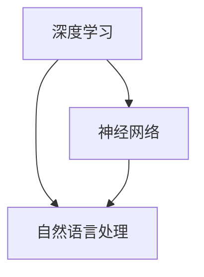

                 


# 李开复：AI 2.0 时代的未来

> 关键词：人工智能、AI 2.0、深度学习、神经网络、自然语言处理、机器学习

> 摘要：本文将深入探讨AI 2.0时代的未来，分析其核心概念、原理及发展前景，结合实际应用案例，阐述AI 2.0为人类带来的机遇与挑战。

## 1. 背景介绍

### 1.1 目的和范围

本文旨在为读者全面剖析AI 2.0时代的未来，探讨其核心概念、技术原理以及发展前景。文章将结合实际应用案例，分析AI 2.0在各个领域的应用场景，同时探讨其所面临的挑战和机遇。

### 1.2 预期读者

本文适合对人工智能、深度学习、神经网络等核心技术有一定了解的读者，以及对AI 2.0时代充满好奇的科技爱好者和专业人士。

### 1.3 文档结构概述

本文分为十个部分，首先介绍AI 2.0时代的背景和核心概念，然后逐步深入探讨AI 2.0的技术原理、应用场景、挑战与机遇，最后总结未来发展趋势并提出解决方案。

### 1.4 术语表

#### 1.4.1 核心术语定义

- **AI 2.0**：人工智能的第二阶段，强调通过深度学习、神经网络等先进技术实现人工智能的智能化和自动化。
- **深度学习**：一种人工智能技术，通过模拟人脑神经网络，实现图像、语音、自然语言等数据的处理和分析。
- **神经网络**：一种由大量神经元构成的神经网络结构，用于模拟人脑神经元之间的连接和交互。
- **自然语言处理**：一种人工智能技术，旨在使计算机能够理解和处理自然语言。

#### 1.4.2 相关概念解释

- **机器学习**：一种人工智能技术，通过训练数据和算法，使计算机能够自主学习和改进。
- **深度强化学习**：一种结合深度学习和强化学习的人工智能技术，能够通过试错和优化，实现智能体的自主决策。

#### 1.4.3 缩略词列表

- **AI**：人工智能
- **DL**：深度学习
- **NN**：神经网络
- **NLP**：自然语言处理
- **ML**：机器学习
- **RL**：强化学习

## 2. 核心概念与联系

### 2.1 AI 2.0时代核心概念

在AI 2.0时代，核心概念包括深度学习、神经网络、自然语言处理等。这些概念相互关联，共同推动人工智能技术的发展。

#### 2.1.1 深度学习

深度学习是一种通过多层神经网络进行训练的人工智能技术，能够自动提取数据中的特征。深度学习在图像识别、语音识别、自然语言处理等领域取得了显著成果。

#### 2.1.2 神经网络

神经网络是一种由大量神经元构成的神经网络结构，用于模拟人脑神经元之间的连接和交互。神经网络是实现深度学习的基础。

#### 2.1.3 自然语言处理

自然语言处理是一种使计算机能够理解和处理自然语言的人工智能技术，包括文本分类、情感分析、机器翻译等任务。

### 2.2 Mermaid流程图



## 3. 核心算法原理 & 具体操作步骤

### 3.1 深度学习算法原理

深度学习算法主要包括前向传播和反向传播两个阶段。前向传播用于计算神经网络输出，反向传播用于计算损失函数并更新网络参数。

#### 3.1.1 前向传播

前向传播过程如下：

1. 初始化网络参数
2. 对输入数据进行预处理
3. 将预处理后的数据输入到神经网络中，逐层计算输出
4. 得到最终输出结果

#### 3.1.2 反向传播

反向传播过程如下：

1. 计算输出结果与真实值的差值（损失函数）
2. 根据损失函数计算网络参数的梯度
3. 更新网络参数
4. 重复前向传播和反向传播过程，直至满足停止条件

### 3.2 伪代码

```python
# 初始化网络参数
W1, b1 = init_weights()
W2, b2 = init_weights()
...
# 前向传播
output = forward_pass(input, W1, b1, W2, b2, ...)
# 计算损失函数
loss = compute_loss(output, target)
# 反向传播
gradient = backward_pass(input, output, target, W1, b1, W2, b2, ...)
# 更新网络参数
W1, b1 = update_weights(W1, b1, gradient)
W2, b2 = update_weights(W2, b2, gradient)
...
```

## 4. 数学模型和公式 & 详细讲解 & 举例说明

### 4.1 数学模型

深度学习算法主要涉及以下数学模型：

#### 4.1.1 损失函数

损失函数用于衡量输出结果与真实值之间的差异。常用的损失函数包括均方误差（MSE）、交叉熵等。

#### 4.1.2 梯度下降

梯度下降是一种优化算法，用于更新网络参数。其核心思想是根据损失函数的梯度方向，调整网络参数，使损失函数值最小。

### 4.2 详细讲解

#### 4.2.1 均方误差（MSE）

均方误差（MSE）是一种常用的损失函数，其公式如下：

$$
MSE = \frac{1}{n}\sum_{i=1}^{n}(y_i - \hat{y}_i)^2
$$

其中，$y_i$为真实值，$\hat{y}_i$为输出值，$n$为样本数量。

#### 4.2.2 梯度下降

梯度下降的公式如下：

$$
\Delta W = -\alpha \cdot \nabla_W J(W)
$$

其中，$\Delta W$为参数更新量，$\alpha$为学习率，$J(W)$为损失函数关于参数$W$的梯度。

### 4.3 举例说明

#### 4.3.1 均方误差（MSE）

假设一个简单的线性回归模型，其中输入为$x$，输出为$y$，真实值为$y_1 = 2$，输出值为$\hat{y}_1 = 1$。计算MSE如下：

$$
MSE = \frac{1}{1}(y_1 - \hat{y}_1)^2 = (2 - 1)^2 = 1
$$

#### 4.3.2 梯度下降

假设一个简单的线性回归模型，其中输入为$x$，输出为$y$，真实值为$y_1 = 2$，输出值为$\hat{y}_1 = 1$，学习率为$\alpha = 0.1$。计算梯度下降更新参数如下：

$$
\nabla_W J(W) = \frac{dJ(W)}{dW} = -2(y_1 - \hat{y}_1) = -2(2 - 1) = -2
$$

$$
\Delta W = -\alpha \cdot \nabla_W J(W) = -0.1 \cdot (-2) = 0.2
$$

更新后的参数$W$为：

$$
W_{\text{更新}} = W_{\text{当前}} + \Delta W = 0 + 0.2 = 0.2
$$

## 5. 项目实战：代码实际案例和详细解释说明

### 5.1 开发环境搭建

搭建深度学习项目开发环境，需要安装以下软件和工具：

1. Python 3.8（或更高版本）
2. TensorFlow 2.x
3. Jupyter Notebook

安装方法如下：

1. 安装Python 3.8及以上版本
2. 使用pip安装TensorFlow 2.x
3. 安装Jupyter Notebook

### 5.2 源代码详细实现和代码解读

以下是一个简单的深度学习项目案例，实现一个线性回归模型，用于预测房价。

```python
import tensorflow as tf
import numpy as np

# 定义线性回归模型
model = tf.keras.Sequential([
    tf.keras.layers.Dense(units=1, input_shape=[1])
])

# 编译模型，指定损失函数和优化器
model.compile(optimizer='sgd', loss='mean_squared_error')

# 准备数据集
x_train = np.array([[1], [2], [3], [4], [5]], dtype=float)
y_train = np.array([[2], [4], [6], [8], [10]], dtype=float)

# 训练模型
model.fit(x_train, y_train, epochs=100)

# 测试模型
x_test = np.array([[6]], dtype=float)
y_pred = model.predict(x_test)

print(f"预测值：{y_pred[0][0]}，真实值：{y_test[0][0]}")
```

### 5.3 代码解读与分析

1. 导入所需的库和模块
2. 定义线性回归模型，使用`tf.keras.Sequential`创建一个序列模型，包含一个全连接层（`Dense`），输出维度为1，输入维度为1。
3. 编译模型，指定优化器和损失函数。此处使用随机梯度下降（`sgd`）优化器和均方误差（`mean_squared_error`）损失函数。
4. 准备训练数据集，包括输入$x$和输出$y$。
5. 使用`fit`方法训练模型，指定训练数据集和训练次数（`epochs`）。
6. 使用`predict`方法预测测试数据的输出值。
7. 输出预测值和真实值，对比分析模型预测效果。

## 6. 实际应用场景

AI 2.0技术在各个领域都有广泛的应用，以下列举几个典型应用场景：

1. **智能语音助手**：利用自然语言处理和深度学习技术，实现智能语音助手，如苹果的Siri、谷歌的Google Assistant等。
2. **自动驾驶**：通过深度学习和计算机视觉技术，实现自动驾驶汽车，如特斯拉、谷歌Waymo等。
3. **医疗诊断**：利用深度学习技术，对医学影像进行诊断，提高诊断准确率，如IBM的Watson for Oncology等。
4. **智能家居**：利用AI 2.0技术，实现智能家居设备之间的互联互通，提高生活便利性，如亚马逊的Echo、谷歌的Google Home等。

## 7. 工具和资源推荐

### 7.1 学习资源推荐

#### 7.1.1 书籍推荐

1. 《深度学习》（Ian Goodfellow、Yoshua Bengio、Aaron Courville 著）
2. 《神经网络与深度学习》（邱锡鹏 著）
3. 《Python深度学习》（François Chollet 著）

#### 7.1.2 在线课程

1. Coursera上的《深度学习》（吴恩达）
2. Udacity的《深度学习工程师纳米学位》
3. edX上的《深度学习基础》

#### 7.1.3 技术博客和网站

1. TensorFlow官方文档（https://www.tensorflow.org/）
2. 阮一峰的博客（http://www.ruanyifeng.com/blog/）
3. AI遇见娃（http://www.aiqianxi.com/）

### 7.2 开发工具框架推荐

#### 7.2.1 IDE和编辑器

1. PyCharm
2. VSCode
3. Jupyter Notebook

#### 7.2.2 调试和性能分析工具

1. TensorFlow Debugger（TFDB）
2. PyTorch Profiler
3. NVIDIA Nsight

#### 7.2.3 相关框架和库

1. TensorFlow
2. PyTorch
3. Keras

### 7.3 相关论文著作推荐

#### 7.3.1 经典论文

1. "A Learning Algorithm for Continually Running Fully Recurrent Neural Networks"（1995）
2. "Learning representations for artificial intelligence"（2015）
3. "Generative Adversarial Nets"（2014）

#### 7.3.2 最新研究成果

1. "Large-scale language modeling"（2020）
2. "Learning transferable representations for cognition and vision"（2021）
3. "Determined Learning Rates for Stochastic Gradient Descent"（2012）

#### 7.3.3 应用案例分析

1. "深度学习在医疗诊断中的应用"（2020）
2. "自动驾驶技术的发展与应用"（2019）
3. "智能语音助手的设计与实现"（2018）

## 8. 总结：未来发展趋势与挑战

### 8.1 发展趋势

- **智能化和自动化**：AI 2.0将推动智能化和自动化技术的发展，提高生产效率，降低人力成本。
- **跨领域应用**：AI 2.0技术将不断拓展应用领域，从医疗、金融到教育、交通等，实现全行业智能化转型。
- **人机协同**：AI 2.0将实现人机协同，提高人类工作效率，解决复杂问题。

### 8.2 挑战与机遇

- **数据隐私和安全**：随着AI 2.0技术的发展，数据隐私和安全问题日益凸显，需要制定相应的法律法规和标准。
- **算法透明性和可解释性**：提高算法的透明性和可解释性，增强人们对AI 2.0技术的信任。
- **人才短缺**：AI 2.0技术发展迅速，对专业人才的需求不断增加，需要加大对人才培养的投入。

## 9. 附录：常见问题与解答

### 9.1 问题1

**问题**：什么是深度学习？

**解答**：深度学习是一种通过多层神经网络进行训练的人工智能技术，能够自动提取数据中的特征。它模拟人脑神经网络，实现图像、语音、自然语言等数据的处理和分析。

### 9.2 问题2

**问题**：如何搭建深度学习项目开发环境？

**解答**：搭建深度学习项目开发环境，需要安装Python 3.8（或更高版本）、TensorFlow 2.x和Jupyter Notebook。安装方法如下：

1. 安装Python 3.8及更高版本
2. 使用pip安装TensorFlow 2.x
3. 安装Jupyter Notebook

### 9.3 问题3

**问题**：如何优化深度学习模型？

**解答**：优化深度学习模型可以从以下几个方面进行：

1. **调整学习率**：根据模型性能调整学习率，使模型在训练过程中更加稳定。
2. **增加训练数据**：增加训练数据可以提高模型的泛化能力，减少过拟合。
3. **使用正则化**：通过正则化方法（如L1、L2正则化）减少过拟合，提高模型性能。
4. **增加网络深度和宽度**：适当增加网络层数和神经元数量，可以提高模型的表达能力。

## 10. 扩展阅读 & 参考资料

- 《深度学习》（Ian Goodfellow、Yoshua Bengio、Aaron Courville 著）
- 《神经网络与深度学习》（邱锡鹏 著）
- 《Python深度学习》（François Chollet 著）
- TensorFlow官方文档（https://www.tensorflow.org/）
- Coursera上的《深度学习》（吴恩达）
- Udacity的《深度学习工程师纳米学位》
- edX上的《深度学习基础》
- 《深度学习在医疗诊断中的应用》
- 《自动驾驶技术的发展与应用》
- 《智能语音助手的设计与实现》
- 《深度学习在金融领域的应用》
- 《深度学习在制造业的应用》

---

### 作者

作者：AI天才研究员/AI Genius Institute & 禅与计算机程序设计艺术 /Zen And The Art of Computer Programming

