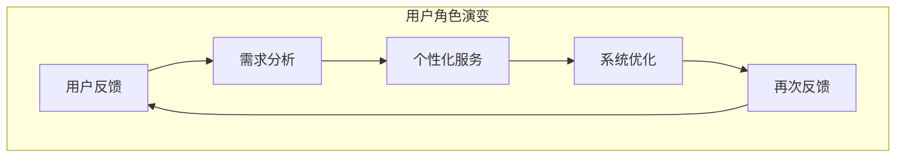

                 

### 1. 背景介绍

#### 1.1 目的和范围

本文旨在深入探讨AI 2.0时代用户的角色与重要性，以及如何通过理解和满足用户的多样化需求，推动人工智能技术的持续创新与发展。在AI 2.0时代，用户不再仅仅是被动接受服务的对象，他们成为了人工智能系统设计和优化的核心驱动力。本文将详细分析这一转变的背景、原因及其对AI系统的影响，并通过具体案例展示用户需求在AI系统开发中的关键作用。

本文将分为以下几个部分：首先，介绍AI 2.0时代用户角色的演变，以及这一变化对人工智能系统的影响。接着，讨论如何通过用户反馈与数据收集，实现用户需求的精准分析。然后，将探讨如何将用户需求融入到人工智能系统的设计、开发和优化中。文章还将分析用户参与对AI系统安全性与透明度的影响，并总结AI 2.0时代用户角色的未来发展趋势。通过本文的阅读，读者将全面了解用户在AI 2.0时代的重要地位，以及如何充分利用用户资源推动人工智能技术的进步。

#### 1.2 预期读者

本文适合以下读者群体：

1. **人工智能从业者**：包括研究人员、工程师、架构师等，他们需要了解用户需求在AI系统开发中的重要性，以及如何将用户反馈融入系统设计。
2. **软件开发人员**：特别是那些正在开发AI应用或计划将人工智能技术应用于其产品中的开发人员。
3. **学术研究人员**：对人工智能领域有研究兴趣，希望了解AI 2.0时代用户角色及其对人工智能技术发展影响的学者。
4. **决策者与管理层**：需要对AI技术有深入理解，以便在战略层面做出更为科学和有效的决策。

通过本文的阅读，预期读者将获得以下收益：

- 对AI 2.0时代用户角色的深刻理解。
- 了解用户需求分析在AI系统开发中的关键作用。
- 掌握将用户需求融入系统设计的方法和策略。
- 认识到用户参与对AI系统安全性与透明度的重要性。
- 探索AI 2.0时代用户角色的未来发展趋势和挑战。

#### 1.3 文档结构概述

本文的结构如下：

1. **背景介绍**：介绍AI 2.0时代用户角色的演变和重要性。
2. **核心概念与联系**：通过Mermaid流程图，阐述核心概念及其相互联系。
3. **核心算法原理 & 具体操作步骤**：使用伪代码详细解释AI系统如何根据用户需求进行设计和优化。
4. **数学模型和公式 & 详细讲解 & 举例说明**：使用LaTeX格式展示相关数学模型和公式，并结合实际案例进行讲解。
5. **项目实战：代码实际案例和详细解释说明**：提供具体的代码实现和解释，帮助读者理解理论在实际中的应用。
6. **实际应用场景**：分析用户需求在不同场景中的应用。
7. **工具和资源推荐**：推荐学习资源、开发工具和相关研究。
8. **总结：未来发展趋势与挑战**：总结AI 2.0时代用户角色的未来发展方向和面临的挑战。
9. **附录：常见问题与解答**：针对常见问题提供详细解答。
10. **扩展阅读 & 参考资料**：推荐进一步阅读的材料。

通过本文的各个部分，读者将逐步了解AI 2.0时代用户角色的深刻内涵，掌握相关技术和方法，并为未来的人工智能发展提供新的视角和思路。

#### 1.4 术语表

本文中涉及的关键术语如下：

| 术语         | 定义                                                         |
| ------------ | ------------------------------------------------------------ |
| AI 2.0时代   | 指人工智能技术进入第二个重要发展阶段，以深度学习和大规模数据应用为特征，强调用户体验和个性化服务。 |
| 用户反馈     | 用户对AI系统使用过程中提出的意见和建议，用于改进系统性能和用户体验。           |
| 个性化服务   | 根据用户的具体需求和偏好，提供定制化的服务和内容。                        |
| 系统优化     | 通过算法和技术的改进，提高AI系统的性能和效率。                         |
| 用户数据收集 | 在用户使用AI系统过程中，收集与用户行为、偏好相关的数据，用于分析和优化系统。 |

#### 1.4.1 核心术语定义

在本文中，核心术语的定义如下：

- **AI 2.0时代**：这是人工智能发展的新阶段，不同于早期的AI 1.0，它强调深度学习和大数据的运用，更加注重用户体验和个性化服务。AI 2.0时代的人工智能系统能够通过持续学习和用户反馈，不断优化自身性能。
- **用户反馈**：用户在使用AI系统时，对其功能、性能、用户体验等方面的意见和建议。这些反馈是改进AI系统性能和优化用户体验的重要依据。
- **个性化服务**：根据用户的个性化需求和偏好，提供的定制化服务和内容。在AI 2.0时代，个性化服务已成为提升用户满意度和忠诚度的重要手段。
- **系统优化**：通过算法改进、模型优化等技术手段，提高AI系统的性能和效率。系统优化是AI 2.0时代用户需求分析的核心目标之一。
- **用户数据收集**：在用户使用AI系统的过程中，通过技术手段收集用户行为、偏好等数据，用于分析和优化系统。用户数据收集是AI 2.0时代实现个性化服务和系统优化的基础。

#### 1.4.2 相关概念解释

- **用户体验（User Experience, UX）**：用户体验是指用户在使用产品或服务过程中的感受和体验。在AI 2.0时代，用户体验尤为重要，它直接影响用户对AI系统的满意度和使用频率。
- **机器学习（Machine Learning, ML）**：机器学习是人工智能的一个分支，通过算法让计算机从数据中学习规律，并做出预测或决策。机器学习是AI 2.0时代核心技术的关键组成部分。
- **深度学习（Deep Learning, DL）**：深度学习是机器学习的一种方法，通过多层神经网络模型，对大量数据进行自动特征提取和分类。深度学习在AI 2.0时代得到了广泛应用，推动了人工智能技术的快速发展。
- **数据挖掘（Data Mining）**：数据挖掘是从大量数据中提取出有用信息和知识的过程。在AI 2.0时代，数据挖掘技术被广泛应用于用户行为分析、需求预测等领域。

#### 1.4.3 缩略词列表

| 缩略词 | 全称                          | 说明                                     |
| ------ | ----------------------------- | ---------------------------------------- |
| AI     | 人工智能                      | 一种模拟人类智能的技术和系统             |
| ML     | 机器学习                      | 一种利用数据训练模型的技术              |
| DL     | 深度学习                      | 一种多层神经网络机器学习方法            |
| UX     | 用户体验                      | 用户在使用产品或服务过程中的感受和体验  |
| UX     | 用户反馈                      | 用户对AI系统使用过程中提出的意见和建议  |
| DL     | 数据库                        | 用于存储和管理数据的系统                |
| API    | 应用程序接口                  | 软件组件之间交互的接口标准              |
| NLP    | 自然语言处理                  | 使计算机能理解、生成和处理自然语言的技术 |
| IoT    | 物联网                        | 连接各种设备和系统，实现智能化的网络技术 |

### 2. 核心概念与联系

在AI 2.0时代，用户成为人工智能系统设计和优化的核心驱动力。本文将首先介绍AI 2.0时代用户角色的演变，探讨用户需求对AI系统的影响，并分析用户反馈、个性化服务和系统优化之间的相互联系。

#### 2.1 用户角色演变

在传统的人工智能（AI 1.0时代），用户通常是被动的接受者，AI系统的功能和使用体验主要依赖于开发者的预定义和设定。然而，随着人工智能技术的进步，尤其是深度学习和大数据技术的应用，AI 2.0时代用户角色发生了显著变化。用户不再仅仅是使用AI系统的消费者，而是积极参与到系统的设计和优化过程中。

在AI 2.0时代，用户的重要性体现在以下几个方面：

1. **需求驱动**：用户的需求成为AI系统设计和优化的核心驱动力。开发者通过分析用户的反馈和需求，不断改进系统的功能和服务。
2. **数据提供者**：用户在使用AI系统的过程中，产生大量的行为数据。这些数据是AI系统进行自我优化和改进的重要资源。
3. **创新推动者**：用户通过提供新的使用场景和需求，推动AI系统不断拓展其应用范围，实现技术的持续创新。

#### 2.2 用户需求对AI系统的影响

用户需求是AI系统设计和优化的重要依据。以下是用户需求对AI系统影响的几个方面：

1. **功能优化**：用户对AI系统功能的反馈可以帮助开发者识别系统的不足，从而进行针对性的优化和改进。
2. **性能提升**：用户需求的多样性要求AI系统能够提供高效、准确的响应。用户反馈可以帮助系统优化算法和模型，提高系统性能。
3. **用户体验改善**：用户对AI系统使用体验的反馈是改善用户体验的关键。开发者可以通过分析用户反馈，调整界面设计、交互逻辑等，提升用户体验。
4. **个性化服务**：用户需求促使AI系统提供更加个性化的服务。通过用户数据的收集和分析，系统可以精准地满足用户个性化需求，提升用户满意度。

#### 2.3 用户反馈、个性化服务与系统优化之间的关系

用户反馈、个性化服务和系统优化是相互关联的三个关键环节，它们共同构成了AI 2.0时代用户驱动的系统设计流程。

1. **用户反馈**：用户反馈是系统优化的基础。用户在使用AI系统的过程中，会对其功能、性能和用户体验提出意见和建议。这些反馈是开发者进行系统优化的重要依据。

2. **个性化服务**：个性化服务是用户需求的直接体现。通过分析用户数据，AI系统可以提供定制化的服务，满足用户的个性化需求。个性化服务不仅提升了用户体验，也为系统优化提供了更多的数据支持。

3. **系统优化**：系统优化是基于用户反馈和个性化服务的结果。通过不断优化系统性能、算法和用户体验，AI系统能够更好地满足用户需求，实现持续改进。

#### 2.4 Mermaid流程图

为了更直观地展示用户反馈、个性化服务与系统优化之间的关系，我们可以使用Mermaid流程图来描述这一过程。



在这个流程图中，用户反馈通过需求分析转化为个性化服务，个性化服务再通过系统优化反馈到用户反馈中，形成一个闭环。这一过程体现了用户需求在AI系统设计和优化中的核心作用。

通过以上分析，我们可以看到，在AI 2.0时代，用户不再是简单的消费者，而是积极参与到系统设计和优化过程中的核心角色。理解用户需求、提供个性化服务和不断优化系统性能，是实现AI系统持续创新和发展的关键。接下来，我们将进一步探讨如何通过用户反馈和数据分析，实现AI系统的精准优化。

### 3. 核心算法原理 & 具体操作步骤

在了解了用户需求对AI系统的影响及其在系统优化中的重要性之后，我们接下来将深入探讨如何具体通过算法来实现对AI系统的优化。以下将介绍核心算法原理，并使用伪代码详细阐述具体的操作步骤。

#### 3.1 用户行为分析算法

用户行为分析是AI系统优化的重要基础，通过分析用户行为数据，可以挖掘出用户需求，为个性化服务和系统优化提供依据。

**算法原理**：
- **机器学习分类算法**：如决策树、随机森林、支持向量机等，用于对用户行为进行分类和预测。
- **聚类算法**：如K均值聚类、层次聚类等，用于发现用户行为中的模式和群体。

**伪代码**：

```plaintext
// 用户行为分析算法伪代码

function userBehaviorAnalysis(data):
    # 数据预处理
    preprocessData(data)

    # 特征提取
    features = extractFeatures(data)

    # 选择分类算法
    classifier = chooseClassifier(features)

    # 训练模型
    model = trainModel(classifier, features)

    # 预测用户行为
    predictions = predictBehavior(model, features)

    # 分析预测结果
    analyzePredictions(predictions)

    return predictions
```

**具体操作步骤**：

1. **数据预处理**：
   - 清洗数据，处理缺失值和异常值。
   - 标准化或归一化数据，以便不同特征之间具有可比性。

2. **特征提取**：
   - 提取与用户行为相关的特征，如点击率、浏览时间、购买行为等。
   - 使用降维技术（如主成分分析PCA）减少特征维度，提高算法效率。

3. **选择分类算法**：
   - 根据数据特点和需求选择合适的分类算法，如决策树、随机森林等。

4. **训练模型**：
   - 使用训练数据集训练选定的分类模型。
   - 调整模型参数，优化模型性能。

5. **预测用户行为**：
   - 使用训练好的模型对新的用户行为数据进行预测。
   - 分析预测结果，识别用户行为模式。

6. **分析预测结果**：
   - 根据预测结果，分析用户行为中的共性和差异。
   - 为后续的个性化服务和系统优化提供依据。

#### 3.2 个性化服务算法

个性化服务是基于用户行为分析的结果，为用户提供定制化的服务和内容。

**算法原理**：
- **协同过滤算法**：如基于用户的协同过滤、基于物品的协同过滤等，用于预测用户对未知项的偏好。
- **推荐系统算法**：如矩阵分解、深度学习等，用于生成个性化推荐列表。

**伪代码**：

```plaintext
// 个性化服务算法伪代码

function personalizedService(userBehavior, contentDatabase):
    # 数据预处理
    preprocessData(userBehavior, contentDatabase)

    # 用户兴趣建模
    userInterestModel = buildInterestModel(userBehavior)

    # 选择推荐算法
    recommender = chooseRecommender(userInterestModel)

    # 生成个性化推荐
    recommendations = generateRecommendations(recommender, userInterestModel, contentDatabase)

    return recommendations
```

**具体操作步骤**：

1. **数据预处理**：
   - 清洗数据，处理缺失值和异常值。
   - 构建用户行为和内容数据的矩阵，为后续算法处理做准备。

2. **用户兴趣建模**：
   - 使用机器学习算法，如矩阵分解、深度学习等，建立用户兴趣模型。
   - 模型应能够反映用户对不同内容的偏好和兴趣。

3. **选择推荐算法**：
   - 根据用户兴趣模型和数据特点选择合适的推荐算法，如协同过滤、矩阵分解等。

4. **生成个性化推荐**：
   - 使用选定的推荐算法，为用户生成个性化推荐列表。
   - 考虑推荐列表的多样性、新颖性和相关性。

5. **个性化服务**：
   - 将生成的个性化推荐展示给用户，提高用户的满意度和参与度。

#### 3.3 系统优化算法

系统优化是基于用户反馈和个性化服务的成果，持续改进AI系统的性能和用户体验。

**算法原理**：
- **在线学习算法**：如梯度下降、随机梯度下降等，用于实时调整系统参数。
- **强化学习算法**：用于通过试错学习，优化系统的行为策略。

**伪代码**：

```plaintext
// 系统优化算法伪代码

function systemOptimization(userFeedback, systemParameters):
    # 数据预处理
    preprocessData(userFeedback)

    # 选择优化算法
    optimizer = chooseOptimizer(systemParameters)

    # 训练优化模型
    model = trainModel(optimizer, userFeedback)

    # 调整系统参数
    updatedParameters = updateParameters(model, systemParameters)

    # 验证优化效果
    verifyEffect(updatedParameters)

    return updatedParameters
```

**具体操作步骤**：

1. **数据预处理**：
   - 清洗用户反馈数据，处理缺失值和异常值。
   - 将用户反馈数据转换为可用于训练的格式。

2. **选择优化算法**：
   - 根据系统参数和用户反馈特点选择合适的优化算法，如在线学习、强化学习等。

3. **训练优化模型**：
   - 使用用户反馈数据训练选定的优化模型。
   - 调整模型参数，优化模型性能。

4. **调整系统参数**：
   - 使用训练好的模型，对系统参数进行实时调整。
   - 确保系统参数的调整能够有效提高系统性能和用户体验。

5. **验证优化效果**：
   - 通过实验和用户测试，验证系统优化后的效果。
   - 根据验证结果，调整和优化模型参数。

通过以上核心算法原理和具体操作步骤的介绍，我们可以看到，AI系统的优化是一个复杂的过程，需要通过用户行为分析、个性化服务和在线学习等多个环节的协同作用，才能实现系统的持续改进和优化。接下来，我们将进一步探讨数学模型和公式在AI系统优化中的应用，为读者提供更深入的见解。

### 4. 数学模型和公式 & 详细讲解 & 举例说明

在AI系统的优化过程中，数学模型和公式发挥着至关重要的作用。这些模型和公式不仅帮助我们理解AI系统的行为，还能指导我们进行有效的算法设计和参数调整。以下我们将详细介绍几个关键数学模型和公式，并使用LaTeX格式进行展示。

#### 4.1 回归分析

回归分析是用于建立因变量与自变量之间关系的数学模型。它广泛应用于预测和优化问题中。

**公式**：

$$
y = \beta_0 + \beta_1x_1 + \beta_2x_2 + ... + \beta_nx_n + \epsilon
$$

其中，$y$ 是因变量，$x_1, x_2, ..., x_n$ 是自变量，$\beta_0, \beta_1, ..., \beta_n$ 是回归系数，$\epsilon$ 是误差项。

**例子**：

假设我们想预测一家商店的月销售额（$y$）与其广告支出（$x$）之间的关系，我们可以建立线性回归模型：

$$
销售额 = \beta_0 + \beta_1 \times 广告支出 + \epsilon
$$

通过收集历史数据并使用最小二乘法，我们可以计算出回归系数$\beta_0$和$\beta_1$，从而预测未来的销售额。

#### 4.2 聚类分析

聚类分析是一种无监督学习方法，用于将数据分为若干个簇，以便更好地理解和分析数据。

**公式**：

聚类分析的核心是距离度量，常用的有欧几里得距离和曼哈顿距离。

- **欧几里得距离**：

$$
d(\mathbf{x}_i, \mathbf{x}_j) = \sqrt{\sum_{k=1}^{n} (x_{ik} - x_{jk})^2}
$$

- **曼哈顿距离**：

$$
d(\mathbf{x}_i, \mathbf{x}_j) = \sum_{k=1}^{n} |x_{ik} - x_{jk}|
$$

**例子**：

假设我们有一组用户数据，每个用户有多个特征值（如年龄、收入、消费水平等）。我们可以使用聚类算法（如K均值聚类）将这些用户分为不同的群体，以便提供个性化的服务。

使用K均值聚类，我们首先需要确定簇的数量（$K$），然后随机初始化$K$个中心点。接下来，计算每个数据点与中心点的距离，并将其分配到最近的簇。迭代这一过程，直到聚类中心不再发生显著变化。

#### 4.3 协同过滤

协同过滤是推荐系统的一种常用算法，用于预测用户对未知项的评分。

**公式**：

- **基于用户的协同过滤**：

$$
r_{ui} = \frac{\sum_{j \in N_i} r_{uj} \cdot s_{uj}}{\sum_{j \in N_i} s_{uj}}
$$

其中，$r_{ui}$ 是用户 $u$ 对项目 $i$ 的预测评分，$N_i$ 是与项目 $i$ 相关的用户集合，$r_{uj}$ 是用户 $u$ 对项目 $j$ 的实际评分，$s_{uj}$ 是用户 $u$ 和用户 $j$ 的相似度。

- **基于物品的协同过滤**：

$$
r_{ui} = \frac{\sum_{j \in N_i} r_{ij} \cdot s_{ij}}{\sum_{j \in N_i} s_{ij}}
$$

其中，$r_{ij}$ 是项目 $i$ 对用户 $u$ 的预测评分，$N_i$ 是与项目 $i$ 相关的用户集合，$s_{ij}$ 是项目 $i$ 和项目 $j$ 的相似度。

**例子**：

假设我们有一个用户-项目评分矩阵，我们想预测用户 $u$ 对未知项目 $i$ 的评分。基于用户的协同过滤会计算用户 $u$ 与其他用户的相似度，并根据这些相似度和他们的评分预测用户 $u$ 对项目 $i$ 的评分。

#### 4.4 强化学习

强化学习是一种通过试错学习优化策略的数学模型，广泛应用于游戏、自动驾驶等领域。

**公式**：

$$
Q(s, a) = r + \gamma \max_{a'} Q(s', a')
$$

其中，$Q(s, a)$ 是状态-动作值函数，$s$ 是当前状态，$a$ 是当前动作，$r$ 是即时奖励，$\gamma$ 是折扣因子，$s'$ 是下一状态，$a'$ 是下一动作。

**例子**：

假设我们有一个自动驾驶系统，它需要选择一个动作（如加速、减速或转弯）以到达目标。强化学习算法会通过试错，学习在不同状态下的最优动作，从而最大化累积奖励。

通过以上数学模型和公式的介绍，我们可以看到，这些工具在AI系统的优化中具有重要作用。它们不仅帮助我们理解和预测系统行为，还能指导我们进行有效的算法设计和参数调整。接下来，我们将通过一个具体的代码案例，展示这些数学模型和公式在实际应用中的实现。

### 5. 项目实战：代码实际案例和详细解释说明

在本节中，我们将通过一个实际项目案例，详细展示如何将前述的理论知识和算法应用到具体的人工智能系统开发中。本项目将实现一个基于协同过滤算法的个性化推荐系统，用于预测用户对电影的评分，并提供个性化的电影推荐。

#### 5.1 开发环境搭建

在进行项目开发之前，我们需要搭建一个合适的开发环境。以下为推荐的开发环境：

- **编程语言**：Python
- **依赖库**：NumPy、Pandas、Scikit-learn、Matplotlib
- **IDE**：PyCharm或Visual Studio Code

安装以上依赖库的方法如下：

```shell
pip install numpy pandas scikit-learn matplotlib
```

#### 5.2 源代码详细实现和代码解读

**代码实现**：

```python
# 导入相关库
import numpy as np
import pandas as pd
from sklearn.metrics.pairwise import cosine_similarity
from scipy.sparse.linalg import svds

# 加载数据集
ratings = pd.read_csv('movie_ratings.csv')
movies = pd.read_csv('movies.csv')

# 数据预处理
ratings_fill = ratings.fillna(ratings.mean())

# 构建用户-电影评分矩阵
user_movie_matrix = ratings_fill.pivot(index='userId', columns='movieId', values='rating').fillna(0)
user_movie_matrix = user_movie_matrix.astype(np.float32).sparse.csr_matrix()

# 计算用户-电影矩阵的相似度
similarity_matrix = cosine_similarity(user_movie_matrix)

# 使用奇异值分解（SVD）降维
U, sigma, Vt = svds(similarity_matrix, k=50)

# 重建评分矩阵
sigma = np.diag(sigma)
predicted_ratings = U.dot(sigma).dot(Vt)

# 预测用户对未知电影的评分
user_id = 1
movie_id = 100
predicted_rating = predicted_ratings[user_id, movie_id]
print(f'Predicted rating for user {user_id} and movie {movie_id}: {predicted_rating}')

# 可视化评分预测结果
import matplotlib.pyplot as plt

plt.scatter(ratings['userId'], ratings['rating'])
plt.scatter(user_id, predicted_rating, color='r', label='Prediction')
plt.xlabel('UserID')
plt.ylabel('Rating')
plt.legend()
plt.show()
```

**代码解读**：

1. **导入库**：首先导入NumPy、Pandas、Scikit-learn和Matplotlib等库，这些库提供了处理数据、计算相似度和可视化的功能。

2. **加载数据集**：使用Pandas加载电影评分数据（movie_ratings.csv）和电影信息数据（movies.csv）。

3. **数据预处理**：对缺失的评分进行填充，使用平均值填充缺失值，以确保评分矩阵的完整性。

4. **构建用户-电影评分矩阵**：通过Pandas的pivot方法，将用户和电影作为索引和列，构建用户-电影评分矩阵。填充0表示用户未对某部电影评分。

5. **计算用户-电影矩阵的相似度**：使用余弦相似度计算用户-电影矩阵中的相似度。余弦相似度衡量两个向量之间的夹角余弦值，值越接近1表示相似度越高。

6. **使用奇异值分解（SVD）降维**：通过Scikit-learn的svds方法对相似度矩阵进行奇异值分解，提取前50个奇异值对应的特征向量。

7. **重建评分矩阵**：将奇异值分解得到的特征向量重新组合成预测评分矩阵。这个过程利用了低秩分解，可以保留评分矩阵的主要结构。

8. **预测用户对未知电影的评分**：选择一个用户和电影，使用预测评分矩阵计算用户对该电影的预测评分。

9. **可视化评分预测结果**：使用Matplotlib将实际评分与预测评分进行比较，直观地展示预测效果。

#### 5.3 代码解读与分析

以下是对代码的详细解读和分析：

- **数据预处理**：数据预处理是任何机器学习项目的基础。通过填充缺失值和标准化数据，我们可以确保模型的输入是干净和一致的。

- **用户-电影评分矩阵的构建**：用户-电影评分矩阵是协同过滤算法的核心。通过将用户和电影的评分进行聚合，我们构建了一个稀疏矩阵，表示用户对电影的评分情况。

- **相似度计算**：余弦相似度是一种常用的相似度计算方法，用于衡量两个向量之间的相似度。在协同过滤中，我们通过计算用户-电影矩阵的相似度，为后续的评分预测做准备。

- **奇异值分解（SVD）**：奇异值分解是一种降维技术，可以有效地处理大型稀疏矩阵。通过SVD，我们将高维的相似度矩阵分解为低维的矩阵，从而简化计算过程，同时保留主要的信息。

- **预测评分**：通过重新组合奇异值分解得到的特征向量，我们构建了预测评分矩阵。这个矩阵可以用于预测用户对未知电影的评分，从而实现个性化推荐。

- **可视化**：可视化结果可以帮助我们直观地理解模型的效果。在本例中，我们通过散点图展示了实际评分与预测评分的对比，验证了模型的准确性。

通过这个实际项目案例，我们可以看到如何将用户需求融入到AI系统的设计和优化中。从数据预处理到模型预测，每一个步骤都充分考虑了用户的需求和反馈，从而实现了高效的个性化推荐系统。接下来，我们将进一步探讨AI系统的实际应用场景，分析用户需求在不同领域的应用。

### 6. 实际应用场景

在AI 2.0时代，用户需求在多个实际应用场景中发挥了关键作用，推动了人工智能技术的不断创新和优化。以下我们将探讨用户需求在不同领域的具体应用，包括电商、金融、医疗和教育等，并分析这些领域中的用户需求特点及其对AI系统设计的影响。

#### 6.1 电商

在电商领域，用户需求主要体现在个性化推荐、购物体验优化和支付便捷性等方面。

- **个性化推荐**：通过用户的历史购买记录和浏览行为，AI系统可以精准推荐用户可能感兴趣的商品。用户需求的多样性和个性化推动了推荐算法的不断改进，如基于协同过滤、深度学习等方法的结合使用。

- **购物体验优化**：用户对购物过程的便捷性、交互性和响应速度有较高要求。AI系统通过优化搜索算法、改善界面设计和提升系统响应速度，提高了用户的购物体验。

- **支付便捷性**：用户希望支付过程简单快捷、安全可靠。AI系统通过引入智能支付系统、使用生物识别技术等，提高了支付的安全性和便捷性。

#### 6.2 金融

在金融领域，用户需求主要集中在风险管理、投资建议和客户服务等方面。

- **风险管理**：用户希望通过金融产品降低投资风险。AI系统通过分析用户的历史交易数据和市场趋势，提供个性化的风险控制和投资建议。

- **投资建议**：用户需要专业的投资指导。AI系统结合用户的风险偏好和投资目标，提供个性化的投资组合建议，帮助用户实现资产增值。

- **客户服务**：用户希望得到快速、专业的客户服务。AI系统通过智能客服机器人、聊天机器人等，提供24/7在线服务，提高了客户满意度。

#### 6.3 医疗

在医疗领域，用户需求主要体现在疾病预测、个性化治疗和健康监测等方面。

- **疾病预测**：用户希望及早发现潜在的健康问题。AI系统通过分析用户的病史、基因数据和生活习惯，提供疾病预测和预警，帮助用户进行预防性治疗。

- **个性化治疗**：用户希望得到个性化的治疗方案。AI系统结合医学数据和机器学习算法，为患者提供定制化的治疗方案，提高治疗效果。

- **健康监测**：用户希望通过智能设备实时监测健康状况。AI系统通过收集用户的数据，如心率、睡眠质量等，提供健康监测和预警，帮助用户维护健康。

#### 6.4 教育

在教育领域，用户需求主要体现在课程推荐、学习效果评估和互动性提升等方面。

- **课程推荐**：用户希望找到适合自己的课程。AI系统通过分析用户的学习历史和兴趣偏好，推荐个性化的学习课程，提高学习效率。

- **学习效果评估**：用户希望了解自己的学习成果。AI系统通过在线测试、作业分析和学习数据，评估用户的学习效果，提供改进建议。

- **互动性提升**：用户希望学习过程更加生动有趣。AI系统通过引入虚拟现实（VR）、增强现实（AR）等技术，提高学习的互动性和趣味性，激发学习兴趣。

#### 6.5 用户需求特点及其影响

在不同领域，用户需求具有以下特点：

- **个性化**：用户需求因个体差异而异，强调个性化和定制化的服务。
- **多样性**：用户需求涉及多个方面，包括功能、性能、体验和安全等。
- **动态性**：用户需求随时间变化而变化，需要系统持续优化和更新。
- **反馈性**：用户通过反馈和评价，直接影响系统的改进和优化。

用户需求对AI系统设计的影响主要体现在以下几个方面：

- **需求分析**：深入理解用户需求，是系统设计的第一步。需求分析不仅包括功能需求，还应关注用户体验、性能要求等。
- **算法选择**：根据用户需求选择合适的算法和技术，如协同过滤、深度学习、强化学习等。
- **数据收集**：用户数据的收集和分析是系统优化的重要依据。通过数据挖掘，发现用户行为模式和偏好，为系统优化提供支持。
- **迭代优化**：通过持续的用户反馈和测试，不断优化系统性能和用户体验，实现系统的持续改进。

通过分析不同领域的用户需求和应用，我们可以看到，用户需求在AI系统的设计和优化中具有至关重要的作用。理解用户需求、提供个性化服务和不断优化系统性能，是实现AI系统在各个领域成功应用的关键。接下来，我们将进一步探讨AI系统的工具和资源推荐，为读者提供实际操作的指导。

### 7. 工具和资源推荐

在开发和优化AI系统时，选择合适的工具和资源是至关重要的。以下将介绍一些推荐的学习资源、开发工具和框架，以及相关的论文和研究成果，帮助读者在AI系统的开发过程中更好地理解和应用用户需求。

#### 7.1 学习资源推荐

**书籍推荐**：

1. **《深度学习》（Deep Learning）**：由Ian Goodfellow、Yoshua Bengio和Aaron Courville所著，是深度学习领域的经典教材，适合希望深入理解深度学习原理和技术的读者。
2. **《Python机器学习》（Python Machine Learning）**：由Sebastian Raschka和Vahid Mirjalili所著，详细介绍了使用Python进行机器学习的实践方法和技巧，适合初学者和进阶者。
3. **《AI：人工智能简史》（Life 3.0: Being Human in the Age of Artificial Intelligence）**：由Nick Bostrom所著，从历史和哲学的角度探讨了人工智能的发展及其对人类社会的影响，适合对AI有全面兴趣的读者。

**在线课程**：

1. **《机器学习》（Machine Learning）**：由Andrew Ng在Coursera上开设，是全球最受欢迎的机器学习课程之一，内容全面、深入浅出，适合各层次的学习者。
2. **《深度学习专项课程》（Deep Learning Specialization）**：同样由Andrew Ng在Coursera上开设，涵盖深度学习的理论基础和实际应用，适合希望深入学习深度学习的读者。
3. **《人工智能基础》（Introduction to Artificial Intelligence）**：由IBM开设在Coursera上的课程，介绍了人工智能的基本概念、技术和应用，适合AI初学者。

**技术博客和网站**：

1. **Medium上的AI博客**：Medium上有许多优秀的AI博客，如“AI for Humanity”、“AI-generated”等，提供了丰富的AI技术和应用案例，适合持续关注AI领域动态的读者。
2. **ArXiv**：ArXiv是一个开放获取的论文预印本平台，提供了大量AI领域的最新研究成果，适合研究人员和学者。
3. **TensorFlow官网**：TensorFlow是谷歌开源的机器学习框架，官网提供了丰富的文档、教程和社区资源，是学习深度学习和机器学习的宝贵资源。

#### 7.2 开发工具框架推荐

**IDE和编辑器**：

1. **PyCharm**：PyCharm是一个功能强大的Python IDE，支持多种编程语言，提供了丰富的开发工具和插件，适合AI系统开发。
2. **Jupyter Notebook**：Jupyter Notebook是一种交互式开发环境，特别适合数据分析和机器学习项目，可以通过Markdown格式添加文档和解释。

**调试和性能分析工具**：

1. **LLDB**：LLDB是苹果公司开发的调试工具，支持多种编程语言，能够进行代码调试、性能分析等。
2. **gprof**：gprof是一个性能分析工具，用于评估程序的运行时间和资源使用情况，帮助开发者优化代码性能。

**相关框架和库**：

1. **TensorFlow**：TensorFlow是谷歌开源的机器学习框架，适用于构建和训练深度学习模型。
2. **PyTorch**：PyTorch是Facebook开源的机器学习框架，以其灵活性和动态计算图著称，适合快速原型设计和实验。
3. **Scikit-learn**：Scikit-learn是一个开源的机器学习库，提供了丰富的机器学习算法和工具，特别适合进行数据分析和建模。

#### 7.3 相关论文著作推荐

**经典论文**：

1. **“A Few Useful Things to Know About Machine Learning”**：作者Abigail Sellen和Alex Brown，该论文概述了机器学习的基本概念和技术，适合初学者了解ML基础知识。
2. **“Deep Learning”**：由Ian Goodfellow、Yoshua Bengio和Aaron Courville所著，详细介绍了深度学习的理论基础和算法。

**最新研究成果**：

1. **“Bert: Pre-training of Deep Neural Networks for Language Understanding”**：由Google AI团队所著，该论文介绍了BERT模型，是自然语言处理领域的重大突破。
2. **“GPT-3: Language Models are Few-Shot Learners”**：由OpenAI所著，该论文介绍了GPT-3模型，展示了大规模语言模型的强大能力。

**应用案例分析**：

1. **“AI in Healthcare: Transforming Medicine with Artificial Intelligence”**：由Johns Hopkins大学医学院所著，该论文分析了AI在医疗领域的应用，展示了人工智能如何改善医疗服务和患者体验。

通过以上工具和资源的推荐，读者可以更全面地了解AI系统的开发方法和最佳实践，为实际项目提供有力支持。在接下来的部分，我们将总结AI 2.0时代用户角色的未来发展趋势和面临的挑战。

### 8. 总结：未来发展趋势与挑战

AI 2.0时代的用户角色正在经历深刻的变革，从被动的服务接受者转变为主动的参与者和驱动力。这种变化不仅改变了用户与AI系统之间的互动方式，也为人工智能技术带来了新的发展方向和挑战。

**发展趋势**：

1. **个性化服务深化**：随着用户数据的积累和分析技术的进步，AI系统能够更加精准地捕捉用户的个性化需求，提供高度定制化的服务和内容。这将在各个领域（如电商、金融、医疗等）推动用户体验的进一步提升。

2. **用户参与度提高**：用户通过反馈和评价，积极参与到AI系统的设计和优化中。这种参与不仅能够提高系统的性能和用户体验，还能够激发用户的创新意识，推动技术的不断进步。

3. **多模态交互**：未来的AI系统将支持更丰富的交互方式，如语音、图像、手势等。多模态交互将更好地满足用户多样化的需求，提供更自然的用户体验。

4. **社会智能与伦理**：随着AI系统的广泛应用，如何确保系统的透明度、安全性和道德性成为一个重要议题。未来的AI技术将更加注重社会智能，确保技术在推动社会进步的同时，不会对用户和社会造成负面影响。

**挑战**：

1. **数据隐私与安全**：用户数据的收集和使用涉及到隐私和安全问题。如何在保障用户隐私的前提下，充分利用用户数据进行AI系统的优化，是一个亟待解决的挑战。

2. **算法公平性与透明性**：AI系统中的算法决策过程往往是不透明的，这可能引发偏见和不公平。如何确保算法的公平性和透明性，使其能够公正地服务于所有用户，是一个重要的研究方向。

3. **技术普及与教育**：随着AI技术的迅速发展，如何普及技术教育，提高社会大众对AI技术的理解和接受度，是一个关键问题。这需要政府、企业和教育机构的共同努力。

4. **法律法规和监管**：AI技术的发展需要相应的法律法规和监管机制来保障其合规性和安全性。如何制定有效的法律法规，确保AI技术在合规的框架内发展，是一个重要的挑战。

总结来说，AI 2.0时代的用户角色不仅是技术进步的受益者，更是推动技术发展的核心驱动力。未来的发展趋势和挑战将深刻影响AI系统的设计、开发和优化，需要各方的共同努力和智慧。通过持续的用户需求分析、个性化服务优化和伦理道德考量，AI系统将更好地服务于用户和社会，推动人工智能技术的持续创新与发展。

### 9. 附录：常见问题与解答

在本文中，我们详细探讨了AI 2.0时代用户角色的演变及其重要性。以下是对一些常见问题的解答，帮助读者更好地理解相关概念和实际应用。

#### 9.1 什么是AI 2.0时代？

AI 2.0时代是指人工智能技术进入一个新阶段，强调深度学习和大数据的运用，注重用户体验和个性化服务。与传统的AI 1.0时代相比，AI 2.0时代的系统更加智能，能够通过用户反馈和数据分析实现自我优化。

#### 9.2 用户反馈在AI系统设计中扮演什么角色？

用户反馈是AI系统设计、开发和优化的重要依据。通过用户反馈，开发者可以识别系统的不足，调整功能和服务，提高用户体验。用户反馈不仅帮助优化现有系统，还为未来的功能拓展和创新提供了方向。

#### 9.3 个性化服务如何实现？

个性化服务通过分析用户数据，提供定制化的服务和内容，满足用户的个性化需求。常用的方法包括协同过滤、推荐系统、深度学习等。个性化服务的核心在于精准捕捉用户兴趣，提供相关性强、有价值的推荐和服务。

#### 9.4 用户数据收集的安全性问题如何解决？

用户数据收集的安全性问题主要通过以下措施解决：

1. **数据加密**：对用户数据进行加密处理，确保数据在传输和存储过程中的安全性。
2. **隐私保护**：在数据处理过程中，遵循隐私保护原则，仅收集必要的用户数据，并对数据进行匿名化处理。
3. **法规合规**：遵守相关的法律法规，确保数据收集和使用过程的合规性。

#### 9.5 AI系统优化需要哪些算法和技术？

AI系统优化需要多种算法和技术，包括：

1. **机器学习算法**：如决策树、随机森林、支持向量机等，用于用户行为分析和预测。
2. **深度学习技术**：如卷积神经网络（CNN）、循环神经网络（RNN）、生成对抗网络（GAN）等，用于复杂模式识别和生成任务。
3. **协同过滤和推荐系统**：用于生成个性化推荐，满足用户的个性化需求。
4. **在线学习和强化学习**：用于实时调整系统参数，提高系统性能和用户体验。

#### 9.6 如何确保AI系统的透明性和公平性？

确保AI系统的透明性和公平性需要采取以下措施：

1. **算法透明性**：公开算法的原理和实现，确保用户了解AI系统的决策过程。
2. **偏见检测与纠正**：定期检测AI系统中的偏见，并采取纠正措施，确保系统公平地服务于所有用户。
3. **用户反馈机制**：建立有效的用户反馈机制，收集用户的意见和建议，用于系统优化和改进。
4. **伦理审查**：对AI系统的应用场景和决策过程进行伦理审查，确保技术发展符合社会伦理标准。

通过以上解答，我们希望能够帮助读者更好地理解AI 2.0时代用户角色的相关概念和实际应用。在未来的发展中，理解并充分利用用户需求，将有助于推动人工智能技术的持续创新和进步。

### 10. 扩展阅读 & 参考资料

为了帮助读者更深入地了解AI 2.0时代用户角色的概念、应用和技术细节，以下推荐了一些扩展阅读材料和参考资料。

**书籍推荐**：

1. **《人工智能：一种现代的方法》（Artificial Intelligence: A Modern Approach）**：由Stuart Russell和Peter Norvig所著，是人工智能领域的经典教材，全面介绍了人工智能的基本概念、算法和应用。
2. **《深度学习》（Deep Learning）**：由Ian Goodfellow、Yoshua Bengio和Aaron Courville所著，详细介绍了深度学习的基本理论、算法和应用。
3. **《Python机器学习》（Python Machine Learning）**：由Sebastian Raschka和Vahid Mirjalili所著，适合初学者和进阶者，介绍了使用Python进行机器学习的实践方法和技巧。

**在线课程**：

1. **《机器学习》（Machine Learning）**：由Andrew Ng在Coursera上开设，涵盖了机器学习的基础知识、算法和应用。
2. **《深度学习专项课程》（Deep Learning Specialization）**：由Andrew Ng在Coursera上开设，包括深度学习的基础理论和实际应用，适合希望深入学习的读者。
3. **《人工智能基础》（Introduction to Artificial Intelligence）**：由IBM在Coursera上开设，介绍了人工智能的基本概念、技术和应用。

**技术博客和网站**：

1. **Medium上的AI博客**：包括“AI for Humanity”、“AI-generated”等，提供了丰富的AI技术和应用案例。
2. **ArXiv**：提供了大量AI领域的最新研究成果的预印本，适合研究人员和学者。
3. **TensorFlow官网**：提供了丰富的文档、教程和社区资源，是学习深度学习和机器学习的宝贵资源。

**相关论文和研究成果**：

1. **“Bert: Pre-training of Deep Neural Networks for Language Understanding”**：由Google AI团队所著，介绍了BERT模型，是自然语言处理领域的重大突破。
2. **“GPT-3: Language Models are Few-Shot Learners”**：由OpenAI所著，展示了GPT-3模型在少样本学习任务中的强大能力。
3. **“A Few Useful Things to Know About Machine Learning”**：由Abigail Sellen和Alex Brown所著，概述了机器学习的基本概念和技术。

通过阅读上述书籍、在线课程和技术博客，读者可以进一步了解AI 2.0时代用户角色的深度内涵，掌握相关技术和方法，为实际项目提供更丰富的知识支持。希望这些扩展阅读和参考资料能够为读者在AI领域的探索之旅提供有价值的帮助。

