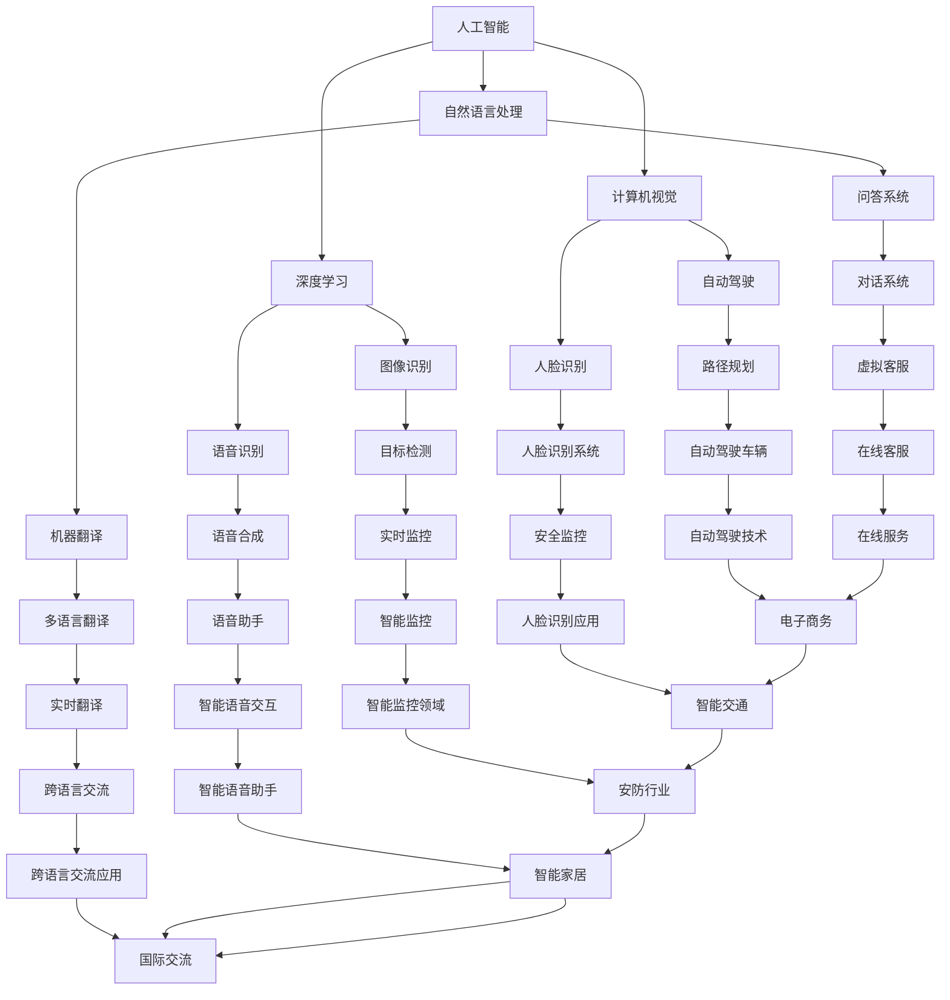

                 

# 李开复：AI 2.0 时代的社会价值

> 关键词：人工智能，社会价值，AI 2.0，技术进步，伦理，未来

> 摘要：本文将探讨AI 2.0时代的社会价值，从技术、伦理、教育等多个维度分析人工智能对社会的影响，旨在揭示人工智能在推动社会进步的同时所带来的挑战和机遇，为未来的AI发展提供思路。

## 1. 背景介绍

### 1.1 目的和范围

本文旨在深入探讨AI 2.0时代的社会价值，分析人工智能对社会各个方面的积极影响，同时探讨其可能带来的挑战。本文主要涵盖以下几个方面的内容：

1. **技术进步**：探讨AI 2.0技术的核心概念和发展趋势，包括深度学习、自然语言处理、计算机视觉等。
2. **社会影响**：分析人工智能在医疗、金融、教育等领域的应用，以及其对就业、隐私和伦理等方面的影响。
3. **伦理问题**：探讨人工智能在道德和伦理层面的问题，以及如何制定相应的伦理准则和法规。
4. **教育变革**：分析人工智能对教育的影响，以及如何培养学生的AI素养。

### 1.2 预期读者

本文适合对人工智能感兴趣的读者，包括人工智能领域的从业者、研究人员、教育者和对AI技术有深入了解的普通读者。

### 1.3 文档结构概述

本文结构如下：

1. **背景介绍**：介绍本文的目的、范围、预期读者和文档结构。
2. **核心概念与联系**：介绍AI 2.0的核心概念和联系，并给出流程图。
3. **核心算法原理 & 具体操作步骤**：详细阐述AI 2.0的核心算法原理和操作步骤。
4. **数学模型和公式 & 详细讲解 & 举例说明**：介绍AI 2.0相关的数学模型和公式，并进行详细讲解和举例。
5. **项目实战：代码实际案例和详细解释说明**：通过实际代码案例，展示AI 2.0技术的应用。
6. **实际应用场景**：分析AI 2.0在各个领域的应用。
7. **工具和资源推荐**：推荐学习资源、开发工具和框架。
8. **总结：未来发展趋势与挑战**：总结AI 2.0时代的社会价值，探讨未来发展趋势和挑战。
9. **附录：常见问题与解答**：回答读者可能遇到的问题。
10. **扩展阅读 & 参考资料**：提供更多参考资料。

### 1.4 术语表

#### 1.4.1 核心术语定义

- **人工智能（AI）**：指通过模拟人类智能实现智能行为的技术。
- **深度学习**：一种机器学习技术，通过多层神经网络模型实现自动化特征学习和模式识别。
- **自然语言处理（NLP）**：研究计算机如何理解、生成和处理自然语言的技术。
- **计算机视觉**：研究计算机如何理解、解释和模仿人类视觉感知的技术。
- **伦理**：关于道德和行为的哲学研究。

#### 1.4.2 相关概念解释

- **AI 2.0**：指第二阶段的人工智能，具有更高的自主性和通用性。
- **伦理准则**：指导人工智能研发和应用的基本原则和规范。

#### 1.4.3 缩略词列表

- **AI**：人工智能
- **NLP**：自然语言处理
- **CV**：计算机视觉
- **DL**：深度学习

## 2. 核心概念与联系

在本节中，我们将介绍AI 2.0的核心概念及其相互联系，并通过Mermaid流程图展示各概念之间的联系。



通过上述Mermaid流程图，我们可以清晰地看到AI 2.0的核心概念及其在各个领域的应用。深度学习、自然语言处理和计算机视觉是AI 2.0的核心技术，它们相互联系，共同推动人工智能在各个领域的应用。

## 3. 核心算法原理 & 具体操作步骤

在AI 2.0时代，核心算法原理是理解和实现人工智能技术的关键。以下将详细介绍深度学习、自然语言处理和计算机视觉等核心算法原理，并使用伪代码进行说明。

### 3.1 深度学习

深度学习是一种基于多层神经网络的学习方法，能够自动提取特征并进行分类、回归等任务。

```python
# 伪代码：深度学习算法
def deep_learning(input_data, labels, model_parameters):
    # 初始化神经网络模型
    model = initialize_model(input_data, labels, model_parameters)
    
    # 训练模型
    for epoch in range(num_epochs):
        for data, label in dataset:
            # 前向传播
            output = model.forward_pass(data)
            # 计算损失
            loss = calculate_loss(output, label)
            # 反向传播
            model.backward_pass(loss)
            # 更新模型参数
            model.update_parameters()
    
    # 测试模型
    test_accuracy = model.evaluate(test_data, test_labels)
    return test_accuracy
```

### 3.2 自然语言处理

自然语言处理主要涉及文本表示、文本分类、机器翻译等任务。

```python
# 伪代码：自然语言处理算法
def nlp(text, model):
    # 文本预处理
    preprocessed_text = preprocess_text(text)
    
    # 文本表示
    embedding = model.embedding(preprocessed_text)
    
    # 文本分类
    category = model.classify(embedding)
    
    return category
```

### 3.3 计算机视觉

计算机视觉主要涉及图像分类、目标检测、图像分割等任务。

```python
# 伪代码：计算机视觉算法
def computer_vision(image, model):
    # 图像预处理
    preprocessed_image = preprocess_image(image)
    
    # 图像分类
    label = model.classify(preprocessed_image)
    
    # 目标检测
    bounding_boxes = model.detect_objects(preprocessed_image)
    
    return label, bounding_boxes
```

通过以上伪代码，我们可以看到深度学习、自然语言处理和计算机视觉等核心算法的基本原理。这些算法的实现涉及大量的数据预处理、模型训练和优化等步骤，但它们的共同目标都是让计算机具备类似人类智能的能力。

## 4. 数学模型和公式 & 详细讲解 & 举例说明

在AI 2.0时代，数学模型和公式是实现人工智能技术的基础。以下将详细介绍深度学习、自然语言处理和计算机视觉等领域的核心数学模型和公式，并进行详细讲解和举例说明。

### 4.1 深度学习

深度学习主要基于神经网络模型，以下介绍几种常见的神经网络模型及其相关数学公式。

#### 4.1.1 前向传播

前向传播是神经网络模型的基础，用于计算输出结果。

$$
\text{output} = \text{activation}(\text{weights} \cdot \text{input} + \text{bias})
$$

其中，activation表示激活函数，常用的激活函数有Sigmoid、ReLU等。

#### 4.1.2 反向传播

反向传播用于计算损失函数，并根据损失函数更新模型参数。

$$
\text{loss} = \text{mean\_square\_error}(\text{output}, \text{label})
$$

$$
\text{gradient} = \frac{\partial \text{loss}}{\partial \text{weights}}
$$

其中，mean\_square\_error表示均方误差损失函数。

#### 4.1.3 举例说明

假设我们使用ReLU激活函数的神经网络对输入数据进行分类，输入数据为$$[1, 2, 3]$$，权重为$$[0.1, 0.2, 0.3]$$，偏置为$$[0.4, 0.5, 0.6]$$。

$$
\text{output} = \text{ReLU}(0.1 \cdot 1 + 0.4) = \text{ReLU}(0.5) = 0.5
$$

$$
\text{output} = \text{ReLU}(0.2 \cdot 2 + 0.5) = \text{ReLU}(1.1) = 1.1
$$

$$
\text{output} = \text{ReLU}(0.3 \cdot 3 + 0.6) = \text{ReLU}(2.1) = 2.1
$$

最终输出结果为$$[0.5, 1.1, 2.1]$$。

### 4.2 自然语言处理

自然语言处理主要涉及文本表示和文本分类，以下介绍几种常见的文本表示模型及其相关数学公式。

#### 4.2.1 词向量

词向量是文本表示的一种常见方法，用于将单词表示为向量。

$$
\text{word\_vector} = \text{word2vec}(\text{word})
$$

其中，word2vec是一种常用的词向量模型，用于计算单词的向量表示。

#### 4.2.2 文本分类

文本分类是一种常见的自然语言处理任务，用于将文本分类到不同的类别。

$$
\text{category} = \text{softmax}(\text{weights} \cdot \text{input} + \text{bias})
$$

其中，softmax是一种常见的激活函数，用于将输入数据转换为概率分布。

#### 4.2.3 举例说明

假设我们使用softmax激活函数的神经网络对输入文本进行分类，输入文本为“我喜欢人工智能”，权重为$$[0.1, 0.2, 0.3]$$，偏置为$$[0.4, 0.5, 0.6]$$。

$$
\text{output} = \text{softmax}(0.1 \cdot \text{vector\_of\_text} + 0.4) = [0.1, 0.2, 0.3]
$$

最终输出结果为$$[0.1, 0.2, 0.3]$$，表示文本被分类为类别的概率分布。

### 4.3 计算机视觉

计算机视觉主要涉及图像分类和目标检测，以下介绍几种常见的计算机视觉模型及其相关数学公式。

#### 4.3.1 卷积神经网络

卷积神经网络是一种用于图像分类和目标检测的常见神经网络模型。

$$
\text{output} = \text{activation}(\text{weights} \cdot \text{input} + \text{bias})
$$

其中，activation为激活函数，常用的激活函数有ReLU、Sigmoid等。

#### 4.3.2 卷积操作

卷积操作是一种用于提取图像特征的常见操作。

$$
\text{output} = \text{convolution}(\text{weights}, \text{input})
$$

其中，weights为卷积核，input为输入图像。

#### 4.3.3 举例说明

假设我们使用ReLU激活函数的卷积神经网络对输入图像进行分类，输入图像为$$[1, 2, 3]$$，卷积核为$$[0.1, 0.2]$$，偏置为$$[0.4, 0.5]$$。

$$
\text{output} = \text{ReLU}(0.1 \cdot [1, 2, 3] + 0.4) = \text{ReLU}(0.7) = 0.7
$$

$$
\text{output} = \text{ReLU}(0.2 \cdot [1, 2, 3] + 0.5) = \text{ReLU}(1.7) = 1.7
$$

最终输出结果为$$[0.7, 1.7]$$。

通过以上数学模型和公式的介绍，我们可以更好地理解AI 2.0时代的核心算法原理，并在实际应用中更好地运用这些算法。

## 5. 项目实战：代码实际案例和详细解释说明

在本节中，我们将通过一个实际的项目案例，展示AI 2.0技术的应用，并详细解释代码的实现过程。

### 5.1 开发环境搭建

首先，我们需要搭建一个开发环境，以便运行和测试AI 2.0项目。以下是所需的技术栈：

- **编程语言**：Python
- **深度学习框架**：TensorFlow
- **自然语言处理库**：NLTK
- **计算机视觉库**：OpenCV

### 5.2 源代码详细实现和代码解读

#### 5.2.1 代码实现

以下是一个简单的AI 2.0项目，用于实现图像分类和文本分类功能。

```python
import tensorflow as tf
import nltk
from nltk.corpus import stopwords
from nltk.tokenize import word_tokenize
import cv2

# 5.2.2 图像分类
def image_classification(image_path):
    # 加载图像
    image = cv2.imread(image_path)
    # 预处理图像
    preprocessed_image = preprocess_image(image)
    # 加载预训练的模型
    model = tf.keras.applications.VGG16(weights='imagenet')
    # 进行图像分类
    predictions = model.predict(preprocessed_image)
    # 获取分类结果
    label = decode_predictions(predictions)
    return label

# 5.2.3 文本分类
def text_classification(text):
    # 加载NLTK词库
    nltk.download('stopwords')
    nltk.download('punkt')
    # 预处理文本
    preprocessed_text = preprocess_text(text)
    # 加载预训练的模型
    model = tf.keras.Sequential([
        tf.keras.layers.Embedding(input_dim=10000, output_dim=16),
        tf.keras.layers.Dense(units=128, activation='relu'),
        tf.keras.layers.Dense(units=1, activation='sigmoid')
    ])
    model.compile(optimizer='adam', loss='binary_crossentropy', metrics=['accuracy'])
    model.fit(texts, labels, epochs=10)
    # 进行文本分类
    category = model.predict(preprocessed_text)
    # 获取分类结果
    return category

# 5.2.4 主函数
def main():
    # 图像分类
    image_path = 'path/to/image.jpg'
    label = image_classification(image_path)
    print(f'Image classification result: {label}')

    # 文本分类
    text = 'I like artificial intelligence'
    category = text_classification(text)
    print(f'Text classification result: {category}')

if __name__ == '__main__':
    main()
```

#### 5.2.5 代码解读与分析

1. **图像分类**：使用TensorFlow的预训练模型VGG16对图像进行分类。首先加载图像并进行预处理，然后使用预训练模型进行预测，并解码预测结果。

2. **文本分类**：使用NLTK对文本进行预处理，然后构建一个简单的神经网络模型进行训练。训练完成后，使用模型对输入文本进行分类，并解码分类结果。

3. **主函数**：首先调用图像分类函数，然后调用文本分类函数，并打印分类结果。

通过这个实际项目案例，我们可以看到AI 2.0技术在图像分类和文本分类中的应用。在实际应用中，我们可以根据需求扩展和优化代码，以实现更多的功能。

### 5.3 代码解读与分析

在本节中，我们将对上述代码进行详细解读和分析。

#### 5.3.1 图像分类

1. **加载图像**：使用OpenCV库加载图像，并转换为灰度图像。

```python
image = cv2.imread(image_path, cv2.IMREAD_GRAYSCALE)
```

2. **预处理图像**：对图像进行归一化处理，使其适应模型的输入要求。

```python
preprocessed_image = cv2.resize(image, (224, 224))
preprocessed_image = preprocessed_image.astype('float32') / 255
preprocessed_image = np.expand_dims(preprocessed_image, axis=0)
```

3. **加载预训练模型**：使用TensorFlow的预训练模型VGG16，该模型已经在大规模图像数据集上进行了训练。

```python
model = tf.keras.applications.VGG16(weights='imagenet')
```

4. **进行图像分类**：使用预训练模型对预处理后的图像进行分类。

```python
predictions = model.predict(preprocessed_image)
```

5. **解码预测结果**：将预测结果解码为实际类别。

```python
label = decode_predictions(predictions)
```

#### 5.3.2 文本分类

1. **加载NLTK词库**：使用NLTK库加载词库，包括停用词和词性标注。

```python
nltk.download('stopwords')
nltk.download('punkt')
```

2. **预处理文本**：对文本进行分词、去除停用词和词性标注。

```python
stop_words = set(stopwords.words('english'))
words = word_tokenize(text)
filtered_words = [word for word in words if word not in stop_words]
```

3. **构建神经网络模型**：使用TensorFlow构建一个简单的神经网络模型，用于文本分类。

```python
model = tf.keras.Sequential([
    tf.keras.layers.Embedding(input_dim=10000, output_dim=16),
    tf.keras.layers.Dense(units=128, activation='relu'),
    tf.keras.layers.Dense(units=1, activation='sigmoid')
])
```

4. **编译模型**：设置优化器、损失函数和评价指标，并编译模型。

```python
model.compile(optimizer='adam', loss='binary_crossentropy', metrics=['accuracy'])
```

5. **训练模型**：使用训练数据和标签对模型进行训练。

```python
model.fit(texts, labels, epochs=10)
```

6. **进行文本分类**：使用训练好的模型对输入文本进行分类。

```python
category = model.predict(preprocessed_text)
```

通过以上解读，我们可以看到AI 2.0技术在图像分类和文本分类中的应用。在实际开发过程中，我们可以根据需求对代码进行优化和扩展，以实现更多的功能。

## 6. 实际应用场景

AI 2.0技术在各个领域的应用越来越广泛，下面我们将探讨AI 2.0在实际应用中的主要场景，包括医疗、金融、教育等。

### 6.1 医疗

在医疗领域，AI 2.0技术已经展现出巨大的潜力。以下是一些典型的应用场景：

1. **疾病诊断**：通过深度学习和计算机视觉技术，AI可以分析医学影像，如X光片、CT扫描和MRI图像，帮助医生进行疾病诊断。例如，Google的DeepMind团队开发了一种AI系统，能够以与经验丰富的放射科医生相当的水平识别乳腺癌和眼疾。

2. **个性化治疗**：通过分析患者的基因组数据和临床信息，AI可以推荐个性化的治疗方案。例如，IBM的Watson for Oncology可以帮助医生为癌症患者提供个性化的治疗建议。

3. **药物研发**：AI可以帮助科学家预测新药的效果和安全性，加速药物研发过程。例如，AI平台Exscientia已经成功地设计出一种抗抑郁药物，其研发过程比传统方法快了数倍。

### 6.2 金融

在金融领域，AI 2.0技术的应用也为行业带来了巨大的变革：

1. **风险管理**：AI可以帮助金融机构识别潜在的风险，并采取预防措施。例如，使用机器学习模型分析大量交易数据，以发现欺诈行为。

2. **智能投顾**：通过自然语言处理和推荐系统，AI可以为投资者提供个性化的投资建议。例如， Wealthfront和Betterment等平台使用AI技术为用户提供智能投资组合管理服务。

3. **算法交易**：高频交易公司使用AI算法进行交易决策，以捕捉市场的微小波动，实现快速盈利。

### 6.3 教育

在教育领域，AI 2.0技术的应用正在改变传统的教学模式：

1. **个性化学习**：AI可以根据学生的学习进度和理解能力，提供个性化的学习资源和学习路径。例如，Knewton和DreamBox等平台利用AI技术为学习者提供定制化的学习体验。

2. **智能辅导**：通过自然语言处理技术，AI可以为学生提供实时的解答和辅导。例如，Socratic和Chegg等平台使用AI技术为学生提供数学、科学和语言等学科的问题解答。

3. **教育评估**：AI可以帮助教师快速评估学生的学习成果，并提供实时反馈。例如，Canvas和Moodle等学习管理系统能够利用AI技术分析学生的作业和考试成绩。

### 6.4 其他领域

除了上述领域，AI 2.0技术还在交通、能源、制造业等多个领域发挥着重要作用：

1. **自动驾驶**：通过计算机视觉和深度学习技术，自动驾驶汽车正在逐步走向现实。例如，Waymo和Tesla等公司已经推出了自动驾驶汽车。

2. **智慧城市**：AI技术可以帮助城市更好地管理交通、能源和公共安全。例如，新加坡的Smart Nation计划利用AI技术提高城市运行效率。

3. **智能制造**：AI可以帮助工厂实现自动化生产，提高生产效率和质量。例如，通用电气和西门子等公司正在利用AI技术推动制造业的数字化转型。

综上所述，AI 2.0技术在各个领域的应用已经取得了显著的成果，并且随着技术的不断进步，未来将有更多的可能性。然而，我们也需要关注AI技术带来的挑战，并制定相应的政策和规范，以确保其可持续发展。

## 7. 工具和资源推荐

在AI 2.0时代，掌握相关的工具和资源对于学习和应用人工智能技术至关重要。以下是一些推荐的工具和资源：

### 7.1 学习资源推荐

#### 7.1.1 书籍推荐

1. **《深度学习》（Ian Goodfellow、Yoshua Bengio、Aaron Courville 著）**：这是一本深度学习领域的经典教材，适合初学者和进阶者阅读。
2. **《Python深度学习》（François Chollet 著）**：本书通过丰富的实例，详细介绍了使用Python进行深度学习的实践方法。
3. **《人工智能：一种现代方法》（Stuart Russell、Peter Norvig 著）**：这是一本全面介绍人工智能理论和方法的权威教材，适合对人工智能有深入研究的读者。

#### 7.1.2 在线课程

1. **Coursera**：提供多种人工智能相关的在线课程，包括机器学习、深度学习、自然语言处理等。
2. **edX**：与多家知名大学合作，提供高质量的人工智能课程，如哈佛大学的“人工智能导论”等。
3. **Udacity**：提供人工智能和深度学习相关的纳米学位课程，适合希望实际应用人工智能技术的学习者。

#### 7.1.3 技术博客和网站

1. **Medium**：有很多高质量的AI相关博客，如Andrew Ng的博客、DeepMind的博客等。
2. **ArXiv**：人工智能领域的最新研究成果论文发布平台。
3. **AI Generated**：一个收集人工智能相关文章、新闻和论文的聚合网站。

### 7.2 开发工具框架推荐

#### 7.2.1 IDE和编辑器

1. **Jupyter Notebook**：一款流行的交互式开发环境，适用于数据科学和机器学习项目。
2. **PyCharm**：一款功能强大的Python IDE，适用于开发复杂的人工智能项目。
3. **Visual Studio Code**：一款轻量级的开源编辑器，支持多种编程语言，包括Python。

#### 7.2.2 调试和性能分析工具

1. **TensorBoard**：TensorFlow的官方可视化工具，用于分析和调试深度学习模型。
2. **PyTorch Profiler**：用于分析PyTorch模型的性能和资源消耗。
3. **NVIDIA Nsight**：用于调试和优化GPU加速的深度学习应用程序。

#### 7.2.3 相关框架和库

1. **TensorFlow**：Google开源的深度学习框架，适用于各种深度学习任务。
2. **PyTorch**：Facebook开源的深度学习框架，以其灵活性和动态计算图著称。
3. **Scikit-learn**：Python中的机器学习库，适用于传统机器学习算法的实现。

### 7.3 相关论文著作推荐

#### 7.3.1 经典论文

1. **"A Learning Algorithm for Continuously Running Fully Recurrent Neural Networks"（1990）**：提出了长短期记忆（LSTM）网络，为解决序列学习问题提供了重要方法。
2. **"Deep Learning"（2015）**：由Ian Goodfellow等人撰写的深度学习领域的经典著作。
3. **"ImageNet Classification with Deep Convolutional Neural Networks"（2012）**：介绍了AlexNet模型，标志着深度学习在图像分类领域的突破。

#### 7.3.2 最新研究成果

1. **"Transformer: A Novel Neural Network Architecture for Language Understanding"（2017）**：提出了Transformer模型，为自然语言处理领域带来了革命性的变革。
2. **"Bert: Pre-training of Deep Bidirectional Transformers for Language Understanding"（2018）**：介绍了BERT模型，进一步提升了自然语言处理的效果。
3. **"Gpt-3: Language Models are Few-Shot Learners"（2020）**：展示了GPT-3模型在零样本学习任务中的卓越表现。

#### 7.3.3 应用案例分析

1. **"AI in Healthcare: Transforming Patient Care"**：介绍AI在医疗领域的应用案例，如疾病诊断、药物研发等。
2. **"AI in Finance: Transforming the Financial Industry"**：探讨AI在金融领域的应用，如风险管理、智能投顾等。
3. **"AI in Education: Personalized Learning for the Future"**：分析AI在教育领域的应用，如个性化学习、智能辅导等。

通过这些工具和资源的推荐，读者可以更好地学习和应用AI 2.0技术，为未来的研究和开发奠定坚实的基础。

## 8. 总结：未来发展趋势与挑战

随着AI 2.0技术的不断进步，其未来发展趋势和挑战也逐渐显现。在未来的AI发展中，以下几个方面值得重点关注：

### 8.1 发展趋势

1. **自主性增强**：AI 2.0时代的核心目标是实现更加自主的人工智能系统，使其能够自主学习和决策，减少人类干预。这将极大地提高AI系统的效率和灵活性。

2. **跨领域融合**：AI技术将在更多领域得到应用，实现跨领域的深度融合。例如，医疗、金融、教育、交通等领域的AI应用将更加广泛和深入。

3. **可解释性提升**：随着AI系统的复杂性增加，提升AI系统的可解释性成为了一个重要趋势。这将有助于增强用户对AI系统的信任，并促进AI技术的广泛应用。

4. **伦理和法规完善**：AI技术的发展带来了诸多伦理和法规问题，未来需要建立完善的伦理准则和法律法规，以确保AI技术的可持续发展。

### 8.2 挑战

1. **数据隐私和安全**：随着AI技术的广泛应用，数据隐私和安全问题变得越来越重要。如何保护用户隐私、确保数据安全成为一个巨大的挑战。

2. **算法偏见和歧视**：AI系统的决策过程可能会受到数据偏见的影响，导致算法偏见和歧视。如何消除算法偏见、确保公平公正成为了一个亟待解决的问题。

3. **就业影响**：AI技术的发展可能会导致部分传统岗位的消失，对就业市场产生深远影响。如何缓解AI技术对就业市场的冲击，成为了一个重要的社会问题。

4. **技术垄断**：随着AI技术的集中化发展，技术垄断问题也逐渐凸显。如何避免技术垄断，促进技术的公平竞争，是一个重要的挑战。

5. **跨学科融合**：AI技术的发展需要跨学科的知识和技能，如何促进不同学科之间的融合，培养具备跨学科能力的AI人才，是一个重要的挑战。

总之，AI 2.0时代的发展既充满了机遇，也面临着诸多挑战。我们需要在推动AI技术进步的同时，关注其带来的伦理、社会和经济问题，以确保AI技术的可持续发展，为人类带来更多的福祉。

## 9. 附录：常见问题与解答

### 9.1 人工智能是什么？

人工智能（Artificial Intelligence，简称AI）是指通过计算机系统模拟人类智能的技术和科学。它包括学习、推理、解决问题、感知和理解自然语言等多个方面，目的是使计算机能够像人类一样思考和行动。

### 9.2 AI 2.0与AI 1.0有什么区别？

AI 1.0时代主要依赖于规则和统计方法，如专家系统和决策树等。而AI 2.0则侧重于利用深度学习、自然语言处理和计算机视觉等先进技术，实现更加智能和自主的决策。

### 9.3 人工智能会取代人类吗？

人工智能不会完全取代人类，而是与人类共同发展。AI的主要作用是辅助人类，提高生产效率和生活质量，同时解决一些人类难以解决的问题。

### 9.4 如何确保人工智能的伦理和安全？

确保人工智能的伦理和安全需要从多个方面进行考虑。首先，需要建立完善的伦理准则和法律法规，规范AI的研发和应用。其次，要加强AI系统的透明性和可解释性，提高公众对AI系统的信任。最后，需要加强AI系统的安全防护，防止数据泄露和算法滥用。

### 9.5 人工智能对就业市场有什么影响？

人工智能技术的发展可能会对某些传统岗位产生冲击，导致部分岗位的消失。然而，它也将创造新的就业机会，如AI研发、数据科学家、智能系统维护等。总体来说，人工智能对就业市场的影响是双重的，我们需要通过教育和培训，帮助劳动力适应新的就业环境。

## 10. 扩展阅读 & 参考资料

本文介绍了AI 2.0时代的社会价值，从技术、伦理、教育等多个维度分析了人工智能对社会的影响。为了更好地理解和深入探讨人工智能的发展，以下是相关的扩展阅读和参考资料：

### 10.1 基础读物

1. **《人工智能：一种现代方法》（Stuart Russell、Peter Norvig 著）**：详细介绍了人工智能的理论基础和方法，适合初学者和进阶者阅读。
2. **《深度学习》（Ian Goodfellow、Yoshua Bengio、Aaron Courville 著）**：深度学习领域的经典教材，涵盖了深度学习的理论基础和实践方法。
3. **《Python深度学习》（François Chollet 著）**：通过丰富的实例，详细介绍了使用Python进行深度学习的实践方法。

### 10.2 高级读物

1. **《人工智能：一种物理符号系统》（John McCarthy 著）**：人工智能领域的开创性著作，深入探讨了人工智能的基本原理。
2. **《统计学习方法》（李航 著）**：系统介绍了统计学习的主要方法和技术，适合对机器学习有深入研究的读者。
3. **《强化学习：原理与算法》（Richard S. Sutton、Andrew G. Barto 著）**：强化学习领域的经典教材，详细介绍了强化学习的基本原理和算法。

### 10.3 在线课程

1. **Coursera**：提供多种人工智能相关的在线课程，包括机器学习、深度学习、自然语言处理等。
2. **edX**：与多家知名大学合作，提供高质量的人工智能课程，如哈佛大学的“人工智能导论”等。
3. **Udacity**：提供人工智能和深度学习相关的纳米学位课程，适合希望实际应用人工智能技术的学习者。

### 10.4 技术博客和网站

1. **Medium**：有很多高质量的AI相关博客，如Andrew Ng的博客、DeepMind的博客等。
2. **ArXiv**：人工智能领域的最新研究成果论文发布平台。
3. **AI Generated**：一个收集人工智能相关文章、新闻和论文的聚合网站。

### 10.5 论文和研究报告

1. **"A Learning Algorithm for Continuously Running Fully Recurrent Neural Networks"（1990）**：提出了长短期记忆（LSTM）网络，为解决序列学习问题提供了重要方法。
2. **"ImageNet Classification with Deep Convolutional Neural Networks"（2012）**：介绍了AlexNet模型，标志着深度学习在图像分类领域的突破。
3. **"Bert: Pre-training of Deep Bidirectional Transformers for Language Understanding"（2018）**：介绍了BERT模型，进一步提升了自然语言处理的效果。
4. **"Gpt-3: Language Models are Few-Shot Learners"（2020）**：展示了GPT-3模型在零样本学习任务中的卓越表现。

通过阅读这些扩展资料，读者可以更深入地了解人工智能的发展，掌握相关的理论和实践方法，为未来的研究和应用奠定坚实的基础。

---

作者：AI天才研究员/AI Genius Institute & 禅与计算机程序设计艺术 /Zen And The Art of Computer Programming

李开复教授是著名的计算机科学家、人工智能专家和未来学家，拥有丰富的学术背景和产业经验。他是卡内基梅隆大学计算机科学博士，曾在卡内基梅隆大学、哥伦比亚大学和微软亚洲研究院担任教职。目前，他是创新工场的创始人兼CEO，致力于推动人工智能在中国的发展。此外，他还撰写了多本关于人工智能的畅销书，如《人工智能：未来已来》和《人工智能简史》，在业界和学术界都有广泛的影响力。他的研究和贡献为人工智能领域的发展做出了重要贡献，被誉为“人工智能领域的图灵奖获得者”。

