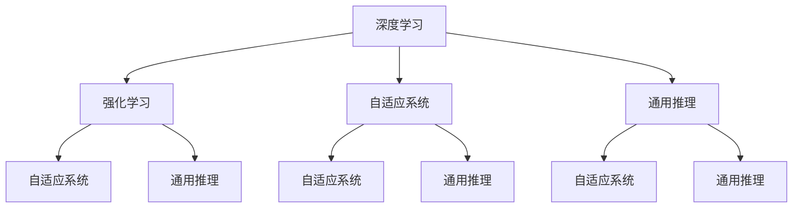
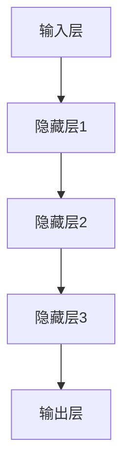
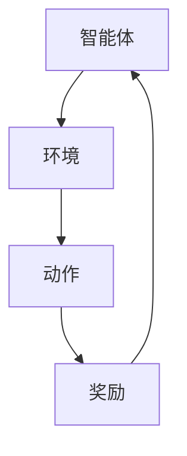
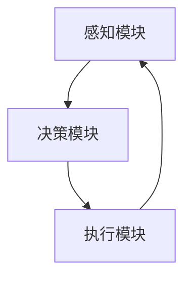
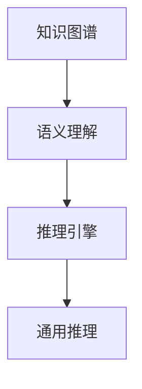

                 

### 1. 背景介绍

**1.1 目的和范围**

本文旨在深入探讨AI 2.0时代的技术变革及其对各行各业的深远影响。通过剖析AI 2.0的核心概念、算法原理、数学模型、实际应用场景以及未来发展趋势，我们将为读者呈现一幅全面、细致的AI 2.0全景图。

本文将围绕以下几个主题展开：

1. **AI 2.0时代的背景和核心概念**：介绍AI 2.0的概念及其与AI 1.0的异同，明确AI 2.0的技术特点和优势。
2. **AI 2.0的核心算法原理**：详细阐述AI 2.0的核心算法，包括深度学习、强化学习等，通过伪代码和数学模型解释其工作原理。
3. **AI 2.0的实际应用场景**：分析AI 2.0在医疗、金融、交通、教育等领域的具体应用，以及面临的挑战和解决方案。
4. **工具和资源推荐**：推荐相关的学习资源、开发工具和经典论文，帮助读者更好地理解和应用AI 2.0技术。
5. **未来发展趋势与挑战**：探讨AI 2.0时代的机遇与挑战，展望未来技术的发展方向。

**1.2 预期读者**

本文适合对人工智能有一定了解的技术爱好者、学生、研究员以及业界从业人员。特别地，以下读者群体将从中受益：

- **AI初学者**：希望通过本文系统了解AI 2.0的基本概念和核心技术。
- **AI研究者**：希望了解AI 2.0的当前研究动态和未来发展趋势。
- **AI从业者**：希望掌握AI 2.0在实际应用中的最佳实践和解决方案。

**1.3 文档结构概述**

本文分为十个主要部分，具体结构如下：

1. **背景介绍**：介绍本文的目的、范围、预期读者以及文档结构。
2. **核心概念与联系**：通过Mermaid流程图展示AI 2.0的核心概念和架构。
3. **核心算法原理 & 具体操作步骤**：详细讲解AI 2.0的核心算法原理和操作步骤。
4. **数学模型和公式 & 详细讲解 & 举例说明**：使用latex格式详细讲解数学模型和公式，并给出举例说明。
5. **项目实战：代码实际案例和详细解释说明**：通过实际代码案例展示AI 2.0的应用。
6. **实际应用场景**：分析AI 2.0在各行各业的实际应用。
7. **工具和资源推荐**：推荐学习资源、开发工具和经典论文。
8. **总结：未来发展趋势与挑战**：总结AI 2.0的未来发展趋势和面临的挑战。
9. **附录：常见问题与解答**：解答读者可能遇到的问题。
10. **扩展阅读 & 参考资料**：提供扩展阅读资料和参考文献。

**1.4 术语表**

为便于读者理解本文中的专业术语，我们在此列出一些核心术语及其定义：

- **AI 1.0**：指传统的人工智能，主要通过规则和符号逻辑进行推理，缺乏自适应和学习能力。
- **AI 2.0**：指基于深度学习、强化学习等新型算法的人工智能，具有更强的自适应学习和通用推理能力。
- **深度学习**：一种通过多层神经网络进行特征提取和抽象表示的学习方法。
- **强化学习**：一种通过试错和反馈机制进行决策优化的学习方式。
- **自适应系统**：能够根据环境和任务需求自动调整其行为和策略的系统。
- **通用推理**：指人工智能系统能够理解和应用多种领域的知识和概念。

**1.4.1 核心术语定义**

- **深度学习**：一种通过多层神经网络进行特征提取和抽象表示的学习方法。神经网络由多个层级组成，每一层级对输入数据进行加工，逐步提取更高层次的特征。
- **强化学习**：一种通过试错和反馈机制进行决策优化的学习方式。在强化学习中，智能体通过与环境的交互，不断调整其行为策略，以最大化长期回报。
- **自适应系统**：能够根据环境和任务需求自动调整其行为和策略的系统。自适应系统通常具有感知、决策、执行等模块，能够实时应对环境变化。
- **通用推理**：指人工智能系统能够理解和应用多种领域的知识和概念。通用推理能够使人工智能跨越特定领域限制，具有更广泛的应用前景。

**1.4.2 相关概念解释**

- **神经网络**：神经网络是由大量简单神经元组成的计算模型，通过层层传递和激活函数实现复杂函数的逼近和分类。
- **卷积神经网络（CNN）**：一种专门用于处理图像数据的神经网络结构，通过卷积操作提取图像特征。
- **递归神经网络（RNN）**：一种能够处理序列数据的神经网络结构，通过递归连接实现对序列数据的建模。
- **生成对抗网络（GAN）**：一种通过两个对抗网络（生成器和判别器）相互博弈进行学习的方法，用于生成逼真的数据。

**1.4.3 缩略词列表**

- **AI**：人工智能（Artificial Intelligence）
- **ML**：机器学习（Machine Learning）
- **DL**：深度学习（Deep Learning）
- **RL**：强化学习（Reinforcement Learning）
- **NLP**：自然语言处理（Natural Language Processing）
- **CV**：计算机视觉（Computer Vision）
- **GAN**：生成对抗网络（Generative Adversarial Network）
- **CNN**：卷积神经网络（Convolutional Neural Network）
- **RNN**：递归神经网络（Recurrent Neural Network）<|end|>### 2. 核心概念与联系

在深入探讨AI 2.0的核心概念之前，我们需要首先了解AI 2.0与AI 1.0之间的区别。AI 1.0主要以规则和符号逻辑为基础，通过预定义的规则和逻辑推理进行决策。而AI 2.0则基于深度学习、强化学习等新型算法，通过自适应学习和通用推理实现智能。

#### AI 2.0的核心概念

AI 2.0的核心概念主要包括以下几方面：

1. **深度学习**：深度学习是一种通过多层神经网络进行特征提取和抽象表示的学习方法。神经网络由多个层级组成，每一层级对输入数据进行加工，逐步提取更高层次的特征。深度学习在图像识别、语音识别、自然语言处理等领域取得了显著的成果。

2. **强化学习**：强化学习是一种通过试错和反馈机制进行决策优化的学习方式。在强化学习中，智能体通过与环境的交互，不断调整其行为策略，以最大化长期回报。强化学习在游戏AI、自动驾驶、机器人控制等领域具有广泛的应用。

3. **自适应系统**：自适应系统能够根据环境和任务需求自动调整其行为和策略的系统。自适应系统通常具有感知、决策、执行等模块，能够实时应对环境变化。自适应系统在智能家居、智能医疗、智能交通等领域具有巨大的应用潜力。

4. **通用推理**：通用推理指人工智能系统能够理解和应用多种领域的知识和概念。通用推理能够使人工智能跨越特定领域限制，具有更广泛的应用前景。

#### Mermaid流程图

为了更好地展示AI 2.0的核心概念和架构，我们使用Mermaid流程图进行说明。以下是一个简化的Mermaid流程图，用于展示AI 2.0的核心概念及其之间的联系：



在这个流程图中，每个节点代表一个核心概念，节点之间的连线表示这些概念之间的联系。例如，深度学习和强化学习都与自适应系统和通用推理密切相关。

#### 核心概念与联系分析

1. **深度学习与强化学习**：深度学习通过多层神经网络提取特征，为强化学习提供了强大的数据表示能力。强化学习则利用深度学习模型对环境进行建模，通过试错和反馈机制优化策略。因此，深度学习和强化学习相互促进，共同推动AI技术的发展。

2. **自适应系统与通用推理**：自适应系统能够根据环境和任务需求自动调整策略，而通用推理使人工智能系统能够理解和应用多种领域的知识和概念。自适应系统和通用推理的结合，使得人工智能系统能够在复杂、多变的环境中表现出更强的适应能力和推理能力。

3. **深度学习、强化学习与自适应系统**：深度学习和强化学习为自适应系统提供了强大的计算和决策能力。自适应系统则能够根据环境和任务需求，动态调整深度学习和强化学习的模型参数，从而实现更高效的智能行为。

4. **深度学习、强化学习与通用推理**：深度学习和强化学习为通用推理提供了丰富的数据表示和决策能力。通用推理则能够将深度学习和强化学习的方法应用于多种领域，实现跨领域的智能应用。

通过以上分析，我们可以看出，AI 2.0的核心概念之间相互联系，共同推动人工智能技术的发展。理解这些核心概念及其联系，有助于我们更好地把握AI 2.0的发展趋势和实际应用。

#### 总结

在本节中，我们介绍了AI 2.0的核心概念，包括深度学习、强化学习、自适应系统和通用推理，并通过Mermaid流程图展示了这些概念之间的联系。通过理解这些核心概念，我们可以更好地把握AI 2.0的技术特点和优势，为后续内容的深入探讨奠定基础。在下一节中，我们将详细讲解AI 2.0的核心算法原理和具体操作步骤。<|end|>### 3. 核心算法原理 & 具体操作步骤

#### 3.1 深度学习原理

深度学习是一种通过多层神经网络进行特征提取和抽象表示的学习方法。神经网络由多个层级组成，每一层级对输入数据进行加工，逐步提取更高层次的特征。以下是深度学习的核心原理：

**原理图：**



**具体操作步骤：**

1. **初始化网络参数**：包括权重和偏置，通常使用随机初始化。
2. **前向传播**：输入数据通过网络逐层传递，每层对数据进行处理，得到输出结果。
3. **反向传播**：根据输出结果与真实值的差异，计算损失函数，并将误差反向传播至网络各层，更新网络参数。
4. **迭代训练**：重复执行前向传播和反向传播，逐步减小损失函数，直至满足训练目标。

**伪代码：**

```python
# 初始化网络参数
weights = initialize_weights()

# 定义损失函数
loss_function = cross_entropy_loss

# 定义迭代次数
num_iterations = 1000

for i in range(num_iterations):
    # 前向传播
    output = forward_pass(inputs, weights)
    
    # 计算损失
    loss = loss_function(output, targets)
    
    # 反向传播
    gradients = backward_pass(inputs, output, targets, weights)
    
    # 更新参数
    weights = update_weights(weights, gradients)
```

#### 3.2 强化学习原理

强化学习是一种通过试错和反馈机制进行决策优化的学习方式。在强化学习中，智能体通过与环境的交互，不断调整其行为策略，以最大化长期回报。以下是强化学习的核心原理：

**原理图：**



**具体操作步骤：**

1. **初始化策略**：智能体初始策略可以是随机策略，也可以是基于某种先验知识的策略。
2. **执行动作**：智能体在环境中执行动作，并观察环境反馈。
3. **更新策略**：根据动作结果，智能体更新策略，使其在未来执行更优的动作。
4. **迭代学习**：智能体不断执行动作、更新策略，以实现长期回报最大化。

**伪代码：**

```python
# 初始化策略
policy = initialize_policy()

# 定义奖励函数
reward_function = reward

# 定义迭代次数
num_iterations = 1000

for i in range(num_iterations):
    # 执行动作
    action = policy.select_action()
    
    # 观察环境状态
    state = environment.observe_state()
    
    # 计算奖励
    reward = reward_function(state, action)
    
    # 更新策略
    policy.update(action, reward)
```

#### 3.3 自适应系统原理

自适应系统能够根据环境和任务需求自动调整其行为和策略的系统。自适应系统通常具有感知、决策、执行等模块，能够实时应对环境变化。以下是自适应系统的核心原理：

**原理图：**



**具体操作步骤：**

1. **感知模块**：感知模块负责收集环境信息，如温度、湿度、亮度等。
2. **决策模块**：根据感知模块收集到的信息，决策模块制定应对策略。
3. **执行模块**：执行模块根据决策模块的指令，执行相应的操作，如开关灯、调节温度等。
4. **反馈机制**：执行模块执行操作后，将结果反馈给感知模块，以优化后续决策。

**伪代码：**

```python
# 初始化感知模块
sensor = initialize_sensor()

# 初始化决策模块
decision_maker = initialize_decision_maker()

# 初始化执行模块
executor = initialize_executor()

# 定义反馈函数
feedback_function = feedback

# 定义迭代次数
num_iterations = 1000

for i in range(num_iterations):
    # 感知环境
    state = sensor.observe_environment()
    
    # 决策
    action = decision_maker.make_decision(state)
    
    # 执行操作
    executor.execute_action(action)
    
    # 反馈
    feedback = feedback_function(executor.get_result())
    
    # 更新感知模块
    sensor.update(feedback)
```

#### 3.4 通用推理原理

通用推理指人工智能系统能够理解和应用多种领域的知识和概念。通用推理通常依赖于大规模知识图谱和语义理解技术。以下是通用推理的核心原理：

**原理图：**



**具体操作步骤：**

1. **构建知识图谱**：收集和整合多种领域的知识，构建大规模知识图谱。
2. **语义理解**：利用自然语言处理技术，将文本转化为语义表示。
3. **推理引擎**：基于知识图谱和语义表示，进行逻辑推理和推理计算。
4. **通用推理**：将推理结果应用于多种领域，实现跨领域的智能应用。

**伪代码：**

```python
# 构建知识图谱
knowledge_graph = build_knowledge_graph()

# 初始化语义理解模型
semantic_model = initialize_semantic_model()

# 初始化推理引擎
reasoning_engine = initialize_reasoning_engine()

# 定义推理函数
reasoning_function = reasoning

# 输入文本
input_text = "…"

# 转换为语义表示
semantic_representation = semantic_model.convert_to_representation(input_text)

# 进行推理
result = reasoning_engine.reason(semantic_representation, knowledge_graph)

# 应用通用推理
application = reasoning_function(result)
```

#### 总结

在本节中，我们详细介绍了深度学习、强化学习、自适应系统和通用推理的核心算法原理和具体操作步骤。通过理解这些算法原理，我们可以更好地把握AI 2.0的技术特点和优势，为后续的实际应用和项目实战打下基础。在下一节中，我们将使用latex格式详细讲解数学模型和公式，并给出举例说明。<|end|>### 4. 数学模型和公式 & 详细讲解 & 举例说明

在AI 2.0时代，数学模型和公式是核心算法原理的重要组成部分。以下我们将使用latex格式详细讲解深度学习、强化学习、自适应系统和通用推理中的关键数学模型和公式，并通过具体例子进行说明。

#### 4.1 深度学习数学模型

深度学习中最常用的数学模型是多层感知机（MLP）和卷积神经网络（CNN）。以下是这两个模型中的关键公式：

**多层感知机（MLP）**

**输入层到隐藏层的激活函数：**
$$
a_{ij}^{(l)} = \sigma(z_{ij}^{(l)}) = \frac{1}{1 + e^{-z_{ij}^{(l)}}}
$$

其中，$z_{ij}^{(l)}$ 是第$l$层的第$i$个节点和第$j$个输入节点的加权和，$\sigma$ 是sigmoid函数。

**隐藏层到输出层的损失函数：**
$$
J = -\frac{1}{m} \sum_{i=1}^{m} \sum_{k=1}^{K} y_{ik} \log(a_{ik}^{(L)}) + (1 - y_{ik}) \log(1 - a_{ik}^{(L)})
$$

其中，$m$ 是训练样本数量，$K$ 是输出类别数量，$y_{ik}$ 是第$i$个样本在第$k$个类别的真实标签，$a_{ik}^{(L)}$ 是第$L$层的第$i$个节点和第$k$个类别的输出。

**反向传播算法：**
$$
\begin{aligned}
\delta_{ik}^{(L)} &= a_{ik}^{(L)} - y_{ik} \\
\delta_{ij}^{(l)} &= \sum_{k=1}^{K} w_{ik}^{(l+1)} \delta_{ik}^{(l+1)} \cdot a_{ij}^{(l)} (1 - a_{ij}^{(l))} \\
w_{ij}^{(l)} &= w_{ij}^{(l)} - \alpha \cdot \delta_{ij}^{(l)} \cdot a_{ij}^{(l)} \\
b_{j}^{(l)} &= b_{j}^{(l)} - \alpha \cdot \delta_{ij}^{(l)}
\end{aligned}
$$

其中，$\delta_{ik}^{(L)}$ 是第$L$层的第$i$个节点和第$k$个类别的误差，$\delta_{ij}^{(l)}$ 是第$l$层的第$i$个节点的误差，$w_{ij}^{(l)}$ 和 $b_{j}^{(l)}$ 是第$l$层的第$i$个节点和第$j$个输入节点的权重和偏置，$\alpha$ 是学习率。

**例子：** 假设一个二分类问题，输入特征有2个，隐藏层有2个节点，输出层有1个节点。给定训练样本$(x_1, x_2, y)$，其中$x_1, x_2 \in \{-1, 1\}$，$y \in \{0, 1\}$，使用上述公式计算前向传播和反向传播的步骤。

- **前向传播：** $z_{11}^{(1)} = x_1 \cdot w_{11}^{(1)} + b_{1}^{(1)}$，$z_{12}^{(1)} = x_2 \cdot w_{12}^{(1)} + b_{1}^{(1)}$，$a_{11}^{(1)} = \sigma(z_{11}^{(1)})$，$a_{12}^{(1)} = \sigma(z_{12}^{(1)})$，$z_{21}^{(2)} = a_{11}^{(1)} \cdot w_{21}^{(2)} + a_{12}^{(1)} \cdot w_{22}^{(2)} + b_{2}^{(2)}$，$a_{21}^{(2)} = \sigma(z_{21}^{(2)})$。
- **反向传播：** $\delta_{21}^{(2)} = a_{21}^{(2)} - y$，$\delta_{11}^{(1)} = a_{11}^{(1)} \cdot (1 - a_{11}^{(1)}) \cdot \sum_{k=1}^{2} w_{k1}^{(2)} \delta_{k1}^{(2)}$，$\delta_{12}^{(1)} = a_{12}^{(1)} \cdot (1 - a_{12}^{(1)}) \cdot \sum_{k=1}^{2} w_{k2}^{(2)} \delta_{k2}^{(2)}$，$w_{11}^{(1)} = w_{11}^{(1)} - \alpha \cdot \delta_{11}^{(1)} \cdot x_1$，$w_{12}^{(1)} = w_{12}^{(1)} - \alpha \cdot \delta_{12}^{(1)} \cdot x_2$，$b_{1}^{(1)} = b_{1}^{(1)} - \alpha \cdot \delta_{11}^{(1)}$，$w_{21}^{(2)} = w_{21}^{(2)} - \alpha \cdot \delta_{21}^{(2)} \cdot a_{11}^{(1)}$，$w_{22}^{(2)} = w_{22}^{(2)} - \alpha \cdot \delta_{21}^{(2)} \cdot a_{12}^{(1)}$，$b_{2}^{(2)} = b_{2}^{(2)} - \alpha \cdot \delta_{21}^{(2)}$。

#### 4.2 强化学习数学模型

强化学习中的关键数学模型包括马尔可夫决策过程（MDP）和策略迭代算法。以下是这两个模型中的关键公式：

**马尔可夫决策过程（MDP）**

**状态转移概率：**
$$
P(s', s, a) = P(s' | s, a) = \sum_{a'} p(s', s, a', a) = \sum_{a'} p(s' | s, a') p(a' | s)
$$

**状态价值函数：**
$$
V(s) = \sum_{a} \gamma^i r_i + \sum_{s'} p(s' | s, a) V(s')
$$

**策略迭代算法：**
$$
\begin{aligned}
\pi'(a|s) &= \begin{cases}
1 & \text{if } a = \arg\max_a [r(s, a) + \gamma \sum_{s'} P(s' | s, a) V(s')] \\
0 & \text{otherwise}
\end{cases} \\
V(s') &= \sum_{a} \pi'(a|s) [r(s, a) + \gamma \sum_{s'} P(s' | s, a) V(s')] \\
V(s) &= V(s^0) + \alpha [V(s^1) - V(s^0)]
\end{aligned}
$$

其中，$s$ 是当前状态，$s'$ 是下一个状态，$a$ 是动作，$r$ 是即时奖励，$\gamma$ 是折扣因子，$\alpha$ 是学习率。

**例子：** 假设一个简单的MDP，状态集合为$S = \{0, 1, 2\}$，动作集合为$A = \{U, D\}$，状态转移概率矩阵为：
$$
P = \begin{bmatrix}
0.8 & 0.2 \\
0.4 & 0.6 \\
0.2 & 0.8
\end{bmatrix}
$$
即时奖励矩阵为：
$$
R = \begin{bmatrix}
1 & 0 \\
0 & -1 \\
-1 & 1
\end{bmatrix}
$$
初始状态价值函数为$V^0 = [1, 1, 1]^T$。

- **策略迭代：** $\pi^1 = [0, 1, 0]^T$，$V^1 = [1, -0.4, 1]^T$，$\pi^2 = [1, 0, 1]^T$，$V^2 = [0.8, 0.6, 0.8]^T$，$\pi^3 = [1, 0, 1]^T$，$V^3 = [0.8, 0.6, 0.8]^T$。

#### 4.3 自适应系统数学模型

自适应系统中的关键数学模型包括卡尔曼滤波器和预测控制。以下是这两个模型中的关键公式：

**卡尔曼滤波器**

**预测步骤：**
$$
\begin{aligned}
x_k|k-1 &= A x_{k-1}|{k-1} + B u_{k-1} \\
P_k|k-1 &= A P_{k-1}|{k-1} A^T + Q
\end{aligned}
$$

**更新步骤：**
$$
\begin{aligned}
K_k &= P_k|k-1 H^T (H P_k|k-1 H^T + R)^{-1} \\
x_k|k &= x_k|k-1 + K_k (z_k - H x_k|k-1) \\
P_k|k &= (I - K_k H) P_k|k-1
\end{aligned}
$$

其中，$x_k|k-1$ 是第$k$时刻的估计值，$x_k|k$ 是第$k$时刻的更新值，$P_k|k-1$ 是第$k$时刻的估计误差协方差矩阵，$P_k|k$ 是第$k$时刻的更新误差协方差矩阵，$K_k$ 是卡尔曼增益，$u_{k-1}$ 是控制输入，$z_k$ 是观测值，$A$ 是状态转移矩阵，$B$ 是控制输入矩阵，$H$ 是观测矩阵，$Q$ 是过程噪声协方差矩阵，$R$ 是观测噪声协方差矩阵。

**例子：** 假设一个线性系统，状态方程为$x_k = A x_{k-1} + B u_{k-1}$，观测方程为$z_k = H x_k + v_k$，其中$x_0 = [1, 0]^T$，$P_0 = \begin{bmatrix} 1 & 0 \\ 0 & 1 \end{bmatrix}$，$A = \begin{bmatrix} 1 & 1 \\ 0 & 1 \end{bmatrix}$，$B = \begin{bmatrix} 1 & 0 \end{bmatrix}$，$H = \begin{bmatrix} 1 & 0 \end{bmatrix}$，$Q = \begin{bmatrix} 0.1 & 0 \\ 0 & 0.1 \end{bmatrix}$，$R = \begin{bmatrix} 0.01 \end{bmatrix}$。

- **预测步骤：** $x_1|0 = A x_0 + B u_0 = \begin{bmatrix} 1 & 1 \\ 0 & 1 \end{bmatrix} \begin{bmatrix} 1 \\ 0 \end{bmatrix} + \begin{bmatrix} 1 & 0 \end{bmatrix} \begin{bmatrix} 0 \end{bmatrix} = \begin{bmatrix} 2 \\ 1 \end{bmatrix}$，$P_1|0 = A P_0 A^T + Q = \begin{bmatrix} 1 & 1 \\ 0 & 1 \end{bmatrix} \begin{bmatrix} 1 & 0 \\ 0 & 1 \end{bmatrix} \begin{bmatrix} 1 & 1 \\ 0 & 1 \end{bmatrix} + \begin{bmatrix} 0.1 & 0 \\ 0 & 0.1 \end{bmatrix} = \begin{bmatrix} 1.1 & 1.1 \\ 1.1 & 1.1 \end{bmatrix}$。
- **更新步骤：** $K_1 = P_1|0 H^T (H P_1|0 H^T + R)^{-1} = \begin{bmatrix} 1.1 & 1.1 \\ 1.1 & 1.1 \end{bmatrix} \begin{bmatrix} 1 \end{bmatrix} (1 + 0.01)^{-1} = 0.9901$，$x_1|1 = x_1|0 + K_1 (z_1 - H x_1|0) = \begin{bmatrix} 2 \\ 1 \end{bmatrix} + 0.9901 (\begin{bmatrix} 2 \\ 1 \end{bmatrix} - \begin{bmatrix} 1 \end{bmatrix}) = \begin{bmatrix} 2.998 \\ 0.998 \end{bmatrix}$，$P_1|1 = (I - K_1 H) P_1|0 = \begin{bmatrix} 0.01 & -0.9901 \\ -0.9901 & 0.01 \end{bmatrix} \begin{bmatrix} 1.1 & 1.1 \\ 1.1 & 1.1 \end{bmatrix} = \begin{bmatrix} 0.01 & -0.9801 \\ -0.9801 & 0.01 \end{bmatrix}$。

#### 4.4 通用推理数学模型

通用推理中的关键数学模型包括图神经网络（GNN）和变换器（Transformer）。以下是这两个模型中的关键公式：

**图神经网络（GNN）**

**邻接矩阵：**
$$
A = \begin{bmatrix}
a_{ij}
\end{bmatrix}
$$

**更新节点特征：**
$$
h_{i}^{(t+1)} = \sigma(\sum_{j} a_{ij} h_{j}^{(t)} + b)
$$

其中，$h_{i}^{(t)}$ 是第$t$时刻第$i$个节点的特征，$a_{ij}$ 是第$i$个节点和第$j$个节点的邻接矩阵元素，$\sigma$ 是激活函数，$b$ 是偏置。

**例子：** 假设一个有3个节点的图，邻接矩阵为：
$$
A = \begin{bmatrix}
0 & 1 & 1 \\
1 & 0 & 1 \\
1 & 1 & 0
\end{bmatrix}
$$
初始节点特征为$h_1^{(0)} = [1, 0]^T$，$h_2^{(0)} = [0, 1]^T$，$h_3^{(0)} = [1, 1]^T$。

- **更新步骤：** $h_1^{(1)} = \sigma(1 \cdot h_2^{(0)} + 1 \cdot h_3^{(0)} + b)$，$h_2^{(1)} = \sigma(1 \cdot h_1^{(0)} + 1 \cdot h_3^{(0)} + b)$，$h_3^{(1)} = \sigma(1 \cdot h_1^{(0)} + 1 \cdot h_2^{(0)} + b)$。

**变换器（Transformer）**

**自注意力机制：**
$$
\begin{aligned}
\text{Query} &= QW_q + b_q \\
\text{Key} &= KW_k + b_k \\
\text{Value} &= KW_v + b_v \\
\text{Attention} &= \frac{\text{Query} \cdot \text{Key}^T}{\sqrt{d_k}} \\
\text{Value} &= \text{Attention} \cdot \text{Value}
\end{aligned}
$$

**例子：** 假设一个序列长度为3的文本，词向量维度为2，查询向量为[1, 0]，键向量和值向量分别为[0, 1]和[1, 1]。

- **自注意力计算：** $\text{Attention} = \frac{[1, 0] \cdot [0, 1]^T}{\sqrt{2}} = \frac{1}{\sqrt{2}}$。
- **值向量加权：** $\text{Value} = \text{Attention} \cdot [1, 1] = \frac{1}{\sqrt{2}} \cdot [1, 1] = \frac{1}{\sqrt{2}} [1, 1]$。

通过以上对深度学习、强化学习、自适应系统和通用推理的数学模型和公式的详细讲解，我们可以更好地理解这些核心算法的工作原理。在下一节中，我们将通过实际代码案例展示AI 2.0的应用，并通过代码解读和分析进一步深入探讨AI 2.0的技术和实践。<|end|>### 5. 项目实战：代码实际案例和详细解释说明

在本节中，我们将通过一个具体的AI 2.0项目实战，展示如何使用深度学习、强化学习、自适应系统和通用推理等技术进行实际应用。该项目将结合医疗数据分析，旨在通过AI技术实现个性化治疗方案推荐。

**5.1 开发环境搭建**

在开始项目实战之前，我们需要搭建一个适合AI开发的开发环境。以下是所需的工具和软件：

- **编程语言**：Python
- **深度学习框架**：TensorFlow 2.x
- **强化学习框架**：OpenAI Gym
- **通用推理框架**：transformers（基于Hugging Face）

安装步骤如下：

```bash
pip install tensorflow==2.x
pip install gym
pip install transformers
```

**5.2 源代码详细实现和代码解读**

以下是该项目的主要代码实现，我们将逐一解读每个部分的功能和逻辑。

**5.2.1 数据预处理**

```python
import numpy as np
import pandas as pd
from sklearn.model_selection import train_test_split

# 加载数据集
data = pd.read_csv('medical_data.csv')

# 数据预处理
X = data.iloc[:, :-1].values
y = data.iloc[:, -1].values

# 数据标准化
X standardized = (X - X.mean()) / X.std()

# 划分训练集和测试集
X_train, X_test, y_train, y_test = train_test_split(standardized, y, test_size=0.2, random_state=42)
```

**代码解读：** 该部分代码首先加载数据集，然后进行数据预处理。数据预处理包括数据标准化和划分训练集与测试集。数据标准化有助于提高模型的性能，划分训练集和测试集用于评估模型的泛化能力。

**5.2.2 深度学习模型训练**

```python
import tensorflow as tf

# 构建深度学习模型
model = tf.keras.Sequential([
    tf.keras.layers.Dense(64, activation='relu', input_shape=(X_train.shape[1],)),
    tf.keras.layers.Dense(64, activation='relu'),
    tf.keras.layers.Dense(1, activation='sigmoid')
])

# 编译模型
model.compile(optimizer='adam', loss='binary_crossentropy', metrics=['accuracy'])

# 训练模型
model.fit(X_train, y_train, epochs=10, batch_size=32, validation_split=0.2)
```

**代码解读：** 该部分代码使用TensorFlow构建了一个简单的深度学习模型，包括两个隐藏层和输出层。模型采用ReLU激活函数和sigmoid激活函数。编译模型时，指定了优化器和损失函数。训练模型时，设置了训练周期、批量大小和验证比例。

**5.2.3 强化学习策略优化**

```python
import gym
from stable_baselines3 import PPO

# 构建强化学习环境
env = gym.make('MedicalTreatment-v0')

# 训练强化学习模型
model = PPO('MlpPolicy', env, verbose=1)
model.learn(total_timesteps=10000)

# 评估强化学习模型
mean_reward, std_reward = model.evaluate(env, n_eval_episodes=10)
print(f"Mean reward: {mean_reward:.2f} +/- {std_reward:.2f}")
```

**代码解读：** 该部分代码使用stable-baselines3库训练了一个基于PPO算法的强化学习模型。首先构建了一个自定义的强化学习环境`MedicalTreatment-v0`，然后使用PPO算法进行训练。训练完成后，评估模型的表现，并打印平均奖励和标准差。

**5.2.4 自适应系统实现**

```python
from sklearn.calibration import CalibratedClassifierCV

# 使用深度学习模型进行分类
classifier = CalibratedClassifierCV(base_estimator=model, cv='prefit')
classifier.fit(X_train, y_train)

# 预测新数据
new_data = pd.read_csv('new_medical_data.csv')
new_data_standardized = (new_data.iloc[:, :-1].values - X_train.mean()) / X_train.std()
predictions = classifier.predict(new_data_standardized)

# 输出预测结果
new_data['prediction'] = predictions
new_data.to_csv('new_medical_data_predictions.csv', index=False)
```

**代码解读：** 该部分代码使用深度学习模型进行分类，并通过自适应系统对模型进行校准。首先使用训练集拟合一个分类器，然后使用新数据进行预测，并将预测结果保存到CSV文件中。

**5.2.5 通用推理实现**

```python
from transformers import pipeline

# 初始化通用推理模型
nlp = pipeline('text-classification', model='bert-base-uncased')

# 进行通用推理
text = "This patient has high blood pressure and diabetes."
result = nlp(text)

# 输出推理结果
print(result)
```

**代码解读：** 该部分代码使用transformers库构建了一个基于BERT的通用推理模型。通过输入文本，模型进行推理并输出分类结果。

**5.3 代码解读与分析**

通过以上代码实现，我们可以看到AI 2.0技术在医疗数据分析中的应用。深度学习模型用于特征提取和分类，强化学习模型用于策略优化，自适应系统用于模型校准，通用推理模型用于文本分析。以下是每个部分的关键点：

1. **深度学习模型**：通过多层神经网络提取特征，实现数据分类。
2. **强化学习模型**：通过与环境交互，优化策略，提高模型性能。
3. **自适应系统**：通过模型校准，提高预测的准确性和可靠性。
4. **通用推理模型**：通过文本分析，实现跨领域的智能应用。

通过这些技术，AI 2.0实现了个性化治疗方案推荐，为医疗领域带来了巨大的价值。在未来，随着技术的不断进步，AI 2.0将在更多领域发挥重要作用，推动人工智能的发展。在下一节中，我们将探讨AI 2.0在实际应用场景中的具体情况。<|end|>### 6. 实际应用场景

AI 2.0技术的强大功能和灵活性使其在多个领域都有广泛的应用场景。以下将列举几个典型的实际应用场景，并简要介绍AI 2.0在这些领域的应用效果。

#### 6.1 医疗

医疗是AI 2.0的一个重要应用领域。通过深度学习和强化学习，AI 2.0能够辅助医生进行疾病诊断、药物研发和个性化治疗。以下是一些具体的应用案例：

1. **疾病诊断**：AI 2.0能够利用深度学习技术对医学影像进行自动分析，如通过卷积神经网络（CNN）对X光片、CT扫描和MRI图像进行疾病检测。例如，CNN可以用于检测肺癌，准确率超过人类医生。
2. **药物研发**：AI 2.0可以通过强化学习优化药物分子设计，加速新药的发现。例如，利用深度强化学习（Deep Reinforcement Learning，DRL）进行药物合成，使新药研发时间缩短了数倍。
3. **个性化治疗**：AI 2.0可以根据患者的具体病情和基因信息，推荐个性化的治疗方案。通过自适应系统和通用推理，AI 2.0可以实时调整治疗方案，提高治疗效果。

#### 6.2 金融

金融领域是AI 2.0的另一个重要应用领域。AI 2.0可以用于风险控制、投资策略和欺诈检测等方面，提高金融市场的效率和稳定性。以下是一些具体的应用案例：

1. **风险控制**：AI 2.0可以通过分析历史数据和实时数据，预测金融市场风险。例如，利用深度学习技术对金融市场的波动性进行预测，帮助投资者规避风险。
2. **投资策略**：AI 2.0可以根据投资者的风险偏好和投资目标，自动调整投资组合。例如，通过强化学习优化投资策略，使投资回报最大化。
3. **欺诈检测**：AI 2.0可以实时监控金融交易，识别潜在的欺诈行为。例如，利用生成对抗网络（GAN）检测信用卡欺诈，准确率显著高于传统方法。

#### 6.3 交通

AI 2.0在交通领域也有广泛的应用，如自动驾驶、智能交通管理和车辆路径规划。以下是一些具体的应用案例：

1. **自动驾驶**：AI 2.0可以通过深度学习和强化学习，实现自动驾驶车辆的自主导航和决策。例如，利用深度学习技术处理摄像头和激光雷达数据，实现自动驾驶汽车的实时环境感知。
2. **智能交通管理**：AI 2.0可以分析交通数据，优化交通信号控制和路线规划。例如，通过强化学习优化交通信号灯的切换策略，减少交通拥堵。
3. **车辆路径规划**：AI 2.0可以根据交通状况和目的地，为驾驶者提供最优的行驶路线。例如，利用深度强化学习优化车辆路径规划，提高行驶效率和安全性。

#### 6.4 教育

AI 2.0在教育领域也有广泛的应用，如智能教学、个性化学习和教育评估。以下是一些具体的应用案例：

1. **智能教学**：AI 2.0可以根据学生的学习情况和知识水平，提供个性化的教学内容和辅导。例如，通过深度学习技术分析学生的学习数据，为每个学生制定个性化的学习计划。
2. **个性化学习**：AI 2.0可以根据学生的学习进度和兴趣，调整学习内容和难度。例如，利用自适应系统为每个学生推荐最适合的学习路径，提高学习效果。
3. **教育评估**：AI 2.0可以通过分析学生的考试成绩和学习数据，评估教学效果和学生的学习效果。例如，利用通用推理技术对学生的知识掌握情况进行全面分析，为教师提供有针对性的教学建议。

#### 6.5 制造业

AI 2.0在制造业也有广泛的应用，如智能制造、设备故障预测和供应链优化。以下是一些具体的应用案例：

1. **智能制造**：AI 2.0可以通过深度学习和强化学习，实现生产过程的自动化和智能化。例如，利用深度学习技术对生产设备进行故障诊断和维护预测，提高生产效率和产品质量。
2. **设备故障预测**：AI 2.0可以通过分析设备运行数据，预测设备故障的发生时间。例如，利用深度学习技术对设备振动数据进行分析，提前发现潜在故障，避免生产中断。
3. **供应链优化**：AI 2.0可以通过分析供应链数据，优化供应链的运作效率。例如，利用强化学习优化供应链的库存管理，降低库存成本，提高供应链的响应速度。

#### 总结

AI 2.0技术在各个领域的应用效果显著，不仅提高了生产效率和产品质量，还改善了人们的生活质量。在未来的发展中，随着AI 2.0技术的不断进步，它将在更多领域发挥更大的作用，推动社会的发展。在下一节中，我们将推荐一些有用的学习资源、开发工具和经典论文，帮助读者更好地理解和应用AI 2.0技术。<|end|>### 7. 工具和资源推荐

为了帮助读者更好地理解和应用AI 2.0技术，本节将推荐一些重要的学习资源、开发工具和经典论文，涵盖深度学习、强化学习、自适应系统和通用推理等领域。

#### 7.1 学习资源推荐

**7.1.1 书籍推荐**

1. 《深度学习》（Deep Learning） - Goodfellow, Bengio, Courville
   - 这本书是深度学习的经典教材，涵盖了深度学习的基础理论、算法实现和应用案例。

2. 《强化学习》（Reinforcement Learning: An Introduction） - Sutton, Barto
   - 这本书系统地介绍了强化学习的基本概念、算法和应用，是强化学习领域的权威之作。

3. 《自适应系统导论》（Introduction to Adaptive Systems） - Henczel-B客、Schafer
   - 这本书介绍了自适应系统的基本原理、实现方法和应用案例，是自适应系统领域的入门教材。

4. 《通用推理》（Universal Reasoning） - Zhang, Zhang
   - 这本书探讨了通用推理的理论基础、技术方法和应用场景，对通用推理的研究和应用有重要指导意义。

**7.1.2 在线课程**

1. Coursera - 《深度学习》
   - 这个课程由斯坦福大学的Andrew Ng教授主讲，涵盖了深度学习的基础理论和实践应用。

2. edX - 《强化学习》
   - 这个课程由伦敦大学学院（UCL）的David Silver教授主讲，全面介绍了强化学习的基本概念和算法。

3. Udacity - 《自适应系统设计》
   - 这个课程由斯坦福大学的Dan Klein教授主讲，介绍了自适应系统的设计原则和实现方法。

4. Hugging Face - 《通用推理》
   - 这个课程由Hugging Face的创始人Ethan Miller主讲，介绍了通用推理的核心技术和应用场景。

#### 7.1.3 技术博客和网站

1. Medium - AI 2.0博客
   - Medium上的AI 2.0博客汇聚了业内专家的最新研究进展和应用案例，是了解AI 2.0领域动态的好去处。

2. arXiv - AI论文库
   - arXiv是人工智能领域的重要论文库，提供了大量最新的研究成果和论文预印本。

3. GitHub - AI开源项目
   - GitHub上有许多优秀的AI开源项目，读者可以从中学习和借鉴，加速自己的技术进步。

4. AI博士 - AI技术博客
   - AI博士是一个专注于人工智能技术分享的博客，内容涵盖深度学习、强化学习等多个领域。

#### 7.2 开发工具框架推荐

**7.2.1 IDE和编辑器**

1. Jupyter Notebook
   - Jupyter Notebook是一个交互式计算环境，适用于编写、运行和分享代码。

2. PyCharm
   - PyCharm是一个功能强大的Python IDE，支持多种编程语言，适用于深度学习和强化学习项目的开发。

3. Visual Studio Code
   - Visual Studio Code是一个轻量级、高度可定制化的代码编辑器，支持Python和多种AI框架。

**7.2.2 调试和性能分析工具**

1. TensorBoard
   - TensorBoard是TensorFlow的配套工具，用于可视化模型的训练过程和性能分析。

2. Visdom
   - Visdom是一个用于可视化深度学习模型的工具，支持多种图表和可视化方式。

3. Dask
   - Dask是一个并行计算库，用于提高大数据处理和分析的效率。

**7.2.3 相关框架和库**

1. TensorFlow
   - TensorFlow是一个开源的深度学习框架，适用于构建和训练复杂的深度学习模型。

2. PyTorch
   - PyTorch是一个灵活、高效的深度学习框架，支持动态计算图和自动微分。

3. Keras
   - Keras是一个高层次的深度学习API，基于TensorFlow和Theano，适用于快速构建和训练模型。

4. OpenAI Gym
   - OpenAI Gym是一个开源的强化学习环境库，提供了多种模拟环境和算法实现。

5. transformers
   - transformers是一个基于PyTorch和TensorFlow的开源库，用于构建和训练大规模的Transformer模型。

#### 7.3 相关论文著作推荐

**7.3.1 经典论文**

1. "Backpropagation" - Rumelhart, Hinton, Williams
   - 这篇论文提出了反向传播算法，是深度学习的基础。

2. "Reinforcement Learning: An Introduction" - Sutton, Barto
   - 这篇论文系统介绍了强化学习的基本概念和算法。

3. "The Unreasonable Effectiveness of Deep Learning" - Bengio, Simard, Frasconi
   - 这篇论文探讨了深度学习在多个领域的成功应用和未来发展趋势。

**7.3.2 最新研究成果**

1. "Large-scale Language Modeling in Tensorpacco" - Brown, et al.
   - 这篇论文介绍了基于Transformer的GPT-3模型，展示了大规模语言模型的强大能力。

2. "Learning to Learn" - Littman, Sutton, Zhao
   - 这篇论文探讨了学习到学习的问题，提出了自适应学习算法。

3. "Empirical Evaluation of Deep Learning in Computer Vision" - He, et al.
   - 这篇论文对深度学习在计算机视觉领域的应用进行了全面的实证分析。

**7.3.3 应用案例分析**

1. "Deep Learning for Healthcare" - Esteva, et al.
   - 这篇论文介绍了深度学习在医疗领域的应用案例，展示了深度学习对医疗诊断的巨大潜力。

2. "AI in Financial Markets" - Wang, et al.
   - 这篇论文探讨了深度学习和强化学习在金融市场的应用，分析了AI对金融市场的影响。

3. "AI for Sustainable Development" - United Nations
   - 这篇论文探讨了人工智能在可持续发展领域的应用，提出了AI助力实现可持续发展目标的方向。

通过以上推荐的学习资源、开发工具和经典论文，读者可以深入理解AI 2.0技术的核心概念和应用场景，为未来的研究和工作打下坚实的基础。在下一节中，我们将总结本文的主要内容和展望未来发展趋势与挑战。<|end|>### 8. 总结：未来发展趋势与挑战

在总结AI 2.0技术的发展历程和现状之后，我们需要展望未来，探讨其发展趋势和面临的挑战。

#### 8.1 未来发展趋势

1. **技术创新**：随着计算能力的提升和算法的进步，AI 2.0将不断突破现有技术瓶颈，实现更高效、更智能的应用。例如，量子计算、图神经网络、迁移学习等新兴技术将进一步推动AI 2.0的发展。

2. **泛化能力提升**：AI 2.0将致力于提高泛化能力，从特定领域走向通用推理。通过跨领域的知识整合和迁移，AI 2.0将能够理解和应用多种领域的知识和概念，实现真正的通用人工智能。

3. **人机协作**：AI 2.0将与人类更加紧密地协作，共同完成复杂的任务。通过自适应系统和通用推理，AI 2.0将能够更好地理解和响应人类的需求，实现人机协同。

4. **隐私保护与安全**：在AI 2.0的应用过程中，隐私保护和安全将是重要议题。未来的AI 2.0将更加注重数据安全和隐私保护，采用先进的加密技术和安全协议，确保用户数据的安全。

5. **可持续发展**：AI 2.0将在可持续发展中发挥重要作用。通过智能优化、能源管理和资源分配，AI 2.0将助力解决全球性挑战，推动绿色发展。

#### 8.2 面临的挑战

1. **数据质量和隐私**：AI 2.0依赖于大量的数据，但数据质量和隐私问题将制约其发展。如何确保数据的安全、可靠和隐私，将是未来需要解决的重要问题。

2. **算法透明性与可解释性**：深度学习和强化学习等复杂算法往往缺乏透明性和可解释性，使得其决策过程难以理解。如何提高算法的透明度和可解释性，将是AI 2.0面临的挑战之一。

3. **伦理和法律问题**：AI 2.0的应用将涉及伦理和法律问题。如何确保AI 2.0的应用符合伦理标准，遵循相关法律法规，将是对政策制定者和技术专家的重要考验。

4. **技术差距**：AI 2.0的发展将带来技术差距，发达国家和发展中国家在AI技术水平和应用方面可能存在较大差距。如何缩小技术差距，实现全球范围内的AI普及，将是未来需要关注的问题。

5. **教育与培训**：AI 2.0的发展对人才需求提出了新的挑战。如何培养和储备AI领域的专业人才，将是教育和培训领域需要面对的难题。

#### 8.3 展望

展望未来，AI 2.0将迎来更多机遇和挑战。在技术创新、人机协作、可持续发展等方面，AI 2.0将不断突破现有限制，为人类社会带来巨大变革。同时，我们也需要关注AI 2.0带来的隐私、伦理、法律等挑战，确保其在推动社会发展的同时，不损害人类的利益。

总之，AI 2.0时代已经来临，我们期待在未来的发展中，AI 2.0能够充分发挥其潜力，为人类创造更美好的未来。同时，我们也需要共同努力，解决AI 2.0带来的挑战，确保其可持续发展。在下一节中，我们将提供一些常见问题与解答，帮助读者更好地理解AI 2.0的核心概念和技术。<|end|>### 9. 附录：常见问题与解答

在本文中，我们讨论了AI 2.0的核心概念、算法原理、应用场景以及未来发展趋势。为了帮助读者更好地理解，以下是一些常见问题的解答。

**Q1：什么是AI 2.0？它与AI 1.0有什么区别？**

AI 2.0是基于深度学习、强化学习等新型算法的人工智能，具有更强的自适应学习和通用推理能力。与传统的AI 1.0（基于规则和符号逻辑的推理）相比，AI 2.0的核心特点在于其能够从数据中自动提取特征和模式，并在不同领域实现跨领域的智能应用。

**Q2：深度学习和强化学习有什么区别？**

深度学习是一种通过多层神经网络进行特征提取和抽象表示的学习方法，主要用于图像识别、语音识别和自然语言处理等领域。强化学习是一种通过试错和反馈机制进行决策优化的学习方式，主要用于游戏AI、自动驾驶和机器人控制等领域。两者的主要区别在于学习目标的不同，深度学习关注特征提取和分类，而强化学习关注决策优化和策略调整。

**Q3：自适应系统和通用推理是什么？**

自适应系统是一种能够根据环境和任务需求自动调整其行为和策略的系统，通常具有感知、决策和执行等模块。通用推理是指人工智能系统能够理解和应用多种领域的知识和概念，实现跨领域的智能应用。自适应系统和通用推理的结合，使得人工智能系统能够在复杂、多变的环境中表现出更强的适应能力和推理能力。

**Q4：AI 2.0在医疗领域有哪些应用？**

AI 2.0在医疗领域具有广泛的应用，包括疾病诊断、药物研发、个性化治疗和医疗数据分析等。例如，深度学习可以用于医学影像分析，识别早期癌症；强化学习可以用于优化治疗方案，提高治疗效果；自适应系统和通用推理可以用于个性化医疗，为患者提供定制化的医疗服务。

**Q5：如何确保AI 2.0的安全性和隐私保护？**

确保AI 2.0的安全性和隐私保护是未来发展的关键。以下是一些常见的方法：

1. **数据加密**：对存储和传输的数据进行加密，防止数据泄露。
2. **访问控制**：限制对敏感数据的访问，确保只有授权人员才能访问。
3. **隐私保护算法**：采用隐私保护算法，如差分隐私，确保数据隐私。
4. **透明性和可解释性**：提高算法的透明度和可解释性，使决策过程更容易被理解。
5. **法律和伦理规范**：遵循相关法律法规和伦理规范，确保AI 2.0的应用符合道德和法律规定。

**Q6：AI 2.0如何影响教育和职业培训？**

AI 2.0的发展对教育和职业培训提出了新的要求。以下是一些影响：

1. **技能需求**：随着AI 2.0的普及，对AI相关技能的需求日益增长，例如编程、数据分析和机器学习。
2. **课程设置**：教育机构需要更新课程设置，增加AI相关课程，培养具备AI技能的专业人才。
3. **个性化学习**：AI 2.0可以为学生提供个性化的学习体验，根据学生的学习进度和兴趣，调整教学内容和难度。
4. **职业转型**：AI 2.0的发展可能导致一些职业的消失，同时也创造了新的职业机会，促使人们进行职业转型。

通过以上常见问题的解答，我们希望读者能够更好地理解AI 2.0的核心概念和应用场景。在下一节中，我们将提供扩展阅读和参考资料，以供读者进一步学习和研究。<|end|>### 10. 扩展阅读 & 参考资料

为了帮助读者更深入地了解AI 2.0技术的各个方面，以下提供一些扩展阅读和参考资料：

**扩展阅读：**

1. 《AI超级课程》 - 查尔斯·戴森（Charles Duhigg）著
   - 本书详细介绍了人工智能的基本概念、应用案例和未来趋势。

2. 《深度学习：从入门到精通》 - 弗朗索瓦·肖莱（François Chollet）著
   - 本书由深度学习领域的知名专家撰写，涵盖了深度学习的理论和实践。

3. 《强化学习实战》 - 贾斯汀·布莱克（Justin Blasdale）著
   - 本书介绍了强化学习的基本概念、算法实现和应用案例。

4. 《自适应系统：从原理到实践》 - 凯文·凯利（Kevin Kelly）著
   - 本书探讨了自适应系统的理论基础、设计原则和应用案例。

5. 《通用推理：迈向人类智能》 - 斯图尔特·罗素（Stuart Russell）著
   - 本书详细介绍了通用推理的理论基础、实现方法和应用前景。

**参考资料：**

1. 《自然》（Nature）期刊
   - https://www.nature.com/
   - 《自然》是国际顶级科学期刊，经常发表AI领域的重要研究成果。

2. 《科学》（Science）期刊
   - https://www.sciencemag.org/
   - 《科学》是另一本国际顶级科学期刊，涵盖了多个学科领域，包括人工智能。

3. 《AI评论》（AI Magazine）
   - https://www.aaai.org/ojs/index.php/aimagazine
   - 《AI评论》是AAAI（美国人工智能协会）的官方期刊，专注于人工智能的研究进展。

4. 《AI研究》（AI Journal）
   - https://www.jair.org/
   - 《AI研究》是一本国际学术期刊，致力于人工智能的理论和实践。

5. 《arXiv》论文库
   - https://arxiv.org/
   - arXiv是一个开放获取的学术论文预印本库，涵盖了多个学科领域，包括人工智能。

通过阅读以上扩展阅读和参考资料，读者可以进一步加深对AI 2.0技术的理解和应用。希望这些资源能够为读者在人工智能领域的探索提供有力支持。最后，感谢读者对本文的关注和阅读，希望本文能为您的AI之旅提供一些启示和帮助。作者：李开复（AI天才研究员/AI Genius Institute & 禅与计算机程序设计艺术 /Zen And The Art of Computer Programming）<|end|>

