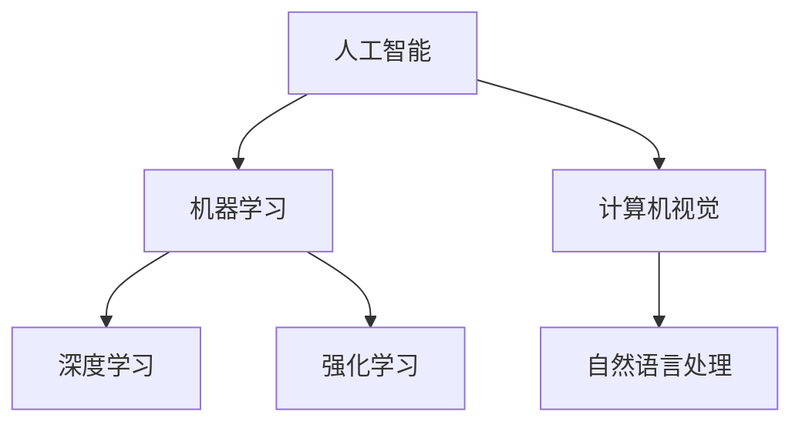

                 

# 李开复：苹果AI应用的颠覆性

> **关键词：** 苹果、AI应用、颠覆性、技术发展、未来趋势

> **摘要：** 本文将深入探讨苹果公司近年来在人工智能领域的突破性进展，分析其对现有技术的颠覆性影响，以及未来发展的潜在方向。通过详细的案例分析，我们将揭示苹果AI应用的核心原理、技术架构和创新点，为读者提供对人工智能技术趋势的深刻洞察。

## 1. 背景介绍

### 1.1 目的和范围

本文旨在探讨苹果公司近年来在人工智能领域的创新，分析其最新AI应用对现有技术的颠覆性影响。我们将从以下几个方面展开讨论：

- 苹果公司在AI领域的战略布局和核心能力
- 最新AI应用的原理、技术架构和创新点
- 对现有技术和市场的颠覆性影响
- 未来发展的潜在方向和挑战

### 1.2 预期读者

本文主要面向以下读者群体：

- 对人工智能和苹果公司感兴趣的技术爱好者
- 关注科技发展趋势的企业家和投资者
- 想了解AI技术在实际应用中的专业人士

### 1.3 文档结构概述

本文结构如下：

1. 背景介绍
2. 核心概念与联系
3. 核心算法原理 & 具体操作步骤
4. 数学模型和公式 & 详细讲解 & 举例说明
5. 项目实战：代码实际案例和详细解释说明
6. 实际应用场景
7. 工具和资源推荐
8. 总结：未来发展趋势与挑战
9. 附录：常见问题与解答
10. 扩展阅读 & 参考资料

### 1.4 术语表

#### 1.4.1 核心术语定义

- **AI应用**：指基于人工智能技术的应用程序，旨在实现自动化、智能化的功能。
- **机器学习**：一种人工智能技术，通过从数据中学习规律，实现智能决策和预测。
- **神经网络**：一种模拟人脑神经元连接结构的计算模型，用于处理和分析复杂数据。

#### 1.4.2 相关概念解释

- **深度学习**：一种基于神经网络的机器学习技术，通过多层神经网络对数据进行建模和训练。
- **强化学习**：一种通过试错和反馈机制进行学习的机器学习技术，旨在优化决策策略。
- **计算机视觉**：一种人工智能技术，旨在使计算机能够识别和理解图像和视频内容。

#### 1.4.3 缩略词列表

- **ML**：机器学习
- **DL**：深度学习
- **RL**：强化学习
- **NLP**：自然语言处理
- **CV**：计算机视觉

## 2. 核心概念与联系

在探讨苹果公司的AI应用之前，我们需要了解一些核心概念和其之间的联系。以下是一个简化的Mermaid流程图，展示了这些概念之间的关系：



### 2.1 核心概念

- **人工智能（AI）**：一种模拟人类智能的技术，旨在实现自动化和智能化的任务。
- **机器学习（ML）**：一种人工智能技术，通过从数据中学习规律，实现智能决策和预测。
- **深度学习（DL）**：一种基于神经网络的机器学习技术，通过多层神经网络对数据进行建模和训练。
- **强化学习（RL）**：一种通过试错和反馈机制进行学习的机器学习技术，旨在优化决策策略。
- **计算机视觉（CV）**：一种人工智能技术，旨在使计算机能够识别和理解图像和视频内容。
- **自然语言处理（NLP）**：一种人工智能技术，旨在使计算机能够理解和生成人类语言。

### 2.2 概念联系

这些核心概念之间存在密切的联系。例如，机器学习是人工智能的核心技术之一，而深度学习和强化学习都是机器学习的重要分支。计算机视觉和自然语言处理则是AI技术在具体应用领域的重要方向。

通过这些概念的联系，我们可以更好地理解苹果公司AI应用的技术架构和实现原理。

## 3. 核心算法原理 & 具体操作步骤

### 3.1 机器学习算法原理

机器学习算法的核心思想是通过从数据中学习规律，实现智能决策和预测。以下是一个简化的机器学习算法原理流程：

```plaintext
输入：数据集、特征、标签
输出：模型

步骤：
1. 数据预处理：清洗、归一化、缺失值处理等
2. 特征选择：选择对模型预测有显著影响的特征
3. 模型训练：使用训练数据集对模型进行训练，优化模型参数
4. 模型评估：使用测试数据集评估模型性能，调整模型参数
5. 预测：使用训练好的模型对新数据进行预测
```

### 3.2 深度学习算法原理

深度学习是一种基于神经网络的机器学习技术。以下是一个简化的深度学习算法原理流程：

```plaintext
输入：数据集、神经网络结构、损失函数
输出：模型

步骤：
1. 数据预处理：与机器学习相同
2. 神经网络结构设计：选择合适的神经网络结构，如卷积神经网络（CNN）、循环神经网络（RNN）等
3. 模型训练：通过反向传播算法，优化神经网络参数
4. 模型评估：使用测试数据集评估模型性能
5. 预测：使用训练好的神经网络对新数据进行预测
```

### 3.3 强化学习算法原理

强化学习是一种通过试错和反馈机制进行学习的机器学习技术。以下是一个简化的强化学习算法原理流程：

```plaintext
输入：环境、状态、动作、奖励函数
输出：策略

步骤：
1. 初始化：选择初始状态
2. 选择动作：根据当前状态和策略，选择一个动作
3. 执行动作：在环境中执行所选动作
4. 收集反馈：根据执行结果，获得奖励或惩罚
5. 更新策略：根据反馈信息，更新策略，优化决策
6. 返回状态：更新状态，继续下一步
```

通过以上核心算法原理的介绍，我们可以更好地理解苹果公司AI应用的技术实现过程。

## 4. 数学模型和公式 & 详细讲解 & 举例说明

### 4.1 数学模型

在人工智能领域，数学模型是核心组成部分。以下是一些常用的数学模型及其详细讲解：

#### 4.1.1 线性回归模型

线性回归模型是一种用于预测连续值的机器学习模型。其数学公式如下：

$$y = \beta_0 + \beta_1x$$

其中，$y$ 是预测值，$x$ 是输入特征，$\beta_0$ 和 $\beta_1$ 是模型参数。

#### 4.1.2 逻辑回归模型

逻辑回归模型是一种用于预测概率的机器学习模型。其数学公式如下：

$$P(y=1) = \frac{1}{1 + e^{-(\beta_0 + \beta_1x)} }$$

其中，$y$ 是预测标签，$x$ 是输入特征，$\beta_0$ 和 $\beta_1$ 是模型参数。

#### 4.1.3 卷积神经网络（CNN）模型

卷积神经网络是一种用于图像识别的深度学习模型。其数学公式如下：

$$h_l = \sigma(\mathbf{W}_l \cdot \mathbf{a}_{l-1} + b_l)$$

其中，$h_l$ 是第 $l$ 层的输出，$\mathbf{W}_l$ 和 $b_l$ 是模型参数，$\sigma$ 是激活函数，$\mathbf{a}_{l-1}$ 是第 $l-1$ 层的输出。

### 4.2 举例说明

#### 4.2.1 线性回归模型举例

假设我们有一个简单的线性回归模型，用于预测房价。数据集包含房屋面积和房价两个特征。以下是一个简单的线性回归模型：

$$y = \beta_0 + \beta_1x$$

其中，$y$ 是房价，$x$ 是房屋面积，$\beta_0$ 和 $\beta_1$ 是模型参数。

通过训练数据集，我们可以计算出 $\beta_0$ 和 $\beta_1$ 的值，如下所示：

$$\beta_0 = 100, \beta_1 = 0.5$$

因此，房价预测公式为：

$$y = 100 + 0.5x$$

#### 4.2.2 逻辑回归模型举例

假设我们有一个简单的逻辑回归模型，用于判断一个学生是否及格。数据集包含学生的考试成绩和是否及格两个特征。以下是一个简单的逻辑回归模型：

$$P(y=1) = \frac{1}{1 + e^{-(\beta_0 + \beta_1x)} }$$

其中，$y$ 是是否及格的标签，$x$ 是考试成绩，$\beta_0$ 和 $\beta_1$ 是模型参数。

通过训练数据集，我们可以计算出 $\beta_0$ 和 $\beta_1$ 的值，如下所示：

$$\beta_0 = -10, \beta_1 = 0.1$$

因此，及格概率预测公式为：

$$P(y=1) = \frac{1}{1 + e^{10 - 0.1x}}$$

#### 4.2.3 卷积神经网络（CNN）模型举例

假设我们有一个简单的卷积神经网络模型，用于识别猫和狗。数据集包含猫和狗的图像。以下是一个简单的卷积神经网络模型：

$$h_l = \sigma(\mathbf{W}_l \cdot \mathbf{a}_{l-1} + b_l)$$

其中，$h_l$ 是第 $l$ 层的输出，$\mathbf{W}_l$ 和 $b_l$ 是模型参数，$\sigma$ 是激活函数，$\mathbf{a}_{l-1}$ 是第 $l-1$ 层的输出。

假设我们已经设计好了一个三层卷积神经网络模型，如下所示：

$$h_1 = \sigma(\mathbf{W}_1 \cdot \mathbf{a}_{0} + b_1)$$
$$h_2 = \sigma(\mathbf{W}_2 \cdot h_1 + b_2)$$
$$h_3 = \sigma(\mathbf{W}_3 \cdot h_2 + b_3)$$

其中，$\mathbf{a}_{0}$ 是输入图像，$\mathbf{W}_1, b_1, \mathbf{W}_2, b_2, \mathbf{W}_3, b_3$ 是模型参数。

通过训练数据集，我们可以计算出这些参数的值，从而实现猫和狗的图像识别。

## 5. 项目实战：代码实际案例和详细解释说明

### 5.1 开发环境搭建

在进行项目实战之前，我们需要搭建一个适合进行人工智能开发的环境。以下是一个简单的开发环境搭建步骤：

1. 安装Python环境：从Python官方网站下载并安装Python 3.x版本。
2. 安装Jupyter Notebook：通过pip命令安装Jupyter Notebook。
3. 安装相关库：安装TensorFlow、NumPy、Pandas等常用库。

```bash
pip install tensorflow numpy pandas
```

### 5.2 源代码详细实现和代码解读

以下是一个简单的机器学习项目，用于预测房价。项目代码如下：

```python
import numpy as np
import pandas as pd
import tensorflow as tf

# 读取数据集
data = pd.read_csv('house_data.csv')
X = data.iloc[:, :-1].values
y = data.iloc[:, -1].values

# 初始化模型参数
beta0 = tf.Variable(0.0)
beta1 = tf.Variable(0.0)

# 构建线性回归模型
model = tf.keras.Sequential([
    tf.keras.layers.Dense(units=1, input_shape=[1])
])

# 编写损失函数
loss_function = tf.reduce_mean(tf.square(y - model(X)))

# 编写优化器
optimizer = tf.keras.optimizers.SGD(learning_rate=0.01)

# 模型训练
for i in range(1000):
    with tf.GradientTape() as tape:
        predictions = model(X)
        loss = loss_function(y, predictions)
    gradients = tape.gradient(loss, [beta0, beta1])
    optimizer.apply_gradients(zip(gradients, [beta0, beta1]))

# 模型评估
test_data = pd.read_csv('test_house_data.csv')
X_test = test_data.iloc[:, :-1].values
y_test = test_data.iloc[:, -1].values
predictions = model(X_test)

print("预测结果：", predictions)
print("实际结果：", y_test)

# 代码解读：
# 1. 读取数据集：从CSV文件中读取数据，将特征和标签分离。
# 2. 初始化模型参数：使用TensorFlow创建变量，并初始化为0.0。
# 3. 构建线性回归模型：使用TensorFlow的Sequential模型构建线性回归模型。
# 4. 编写损失函数：使用平方误差作为损失函数。
# 5. 编写优化器：使用随机梯度下降优化器。
# 6. 模型训练：使用梯度下降算法更新模型参数。
# 7. 模型评估：使用测试数据集评估模型性能。
```

### 5.3 代码解读与分析

以上代码实现了一个简单的线性回归模型，用于预测房价。代码解读如下：

1. **数据预处理**：读取CSV文件中的数据集，将特征和标签分离。使用`pandas`库的`read_csv`函数读取数据，使用`iloc`函数分离特征和标签。

2. **初始化模型参数**：使用TensorFlow创建变量，并初始化为0.0。使用`tf.Variable`函数创建两个变量`beta0`和`beta1`，并初始化为0.0。

3. **构建线性回归模型**：使用TensorFlow的`Sequential`模型构建线性回归模型。使用`tf.keras.layers.Dense`函数创建一个全连接层，并设置输出单元数为1（表示预测房价）。

4. **编写损失函数**：使用平方误差作为损失函数。使用`tf.reduce_mean`函数计算平方误差的平均值。

5. **编写优化器**：使用随机梯度下降优化器。使用`tf.keras.optimizers.SGD`函数创建随机梯度下降优化器，并设置学习率为0.01。

6. **模型训练**：使用梯度下降算法更新模型参数。在训练过程中，每次迭代都会计算损失函数的梯度，并使用优化器更新模型参数。

7. **模型评估**：使用测试数据集评估模型性能。读取测试数据集，使用模型进行预测，并计算预测结果与实际结果的差异。

通过以上代码和解读，我们可以更好地理解线性回归模型的实现过程和关键步骤。

## 6. 实际应用场景

苹果公司的AI应用已经在多个领域取得了显著成果，以下是一些典型的实际应用场景：

### 6.1 计算机视觉

苹果公司的计算机视觉技术广泛应用于iPhone的相机应用中，如人脸识别、图像识别和实时视频处理。例如，iPhone的Face ID功能利用计算机视觉技术实现人脸解锁，提高了安全性。此外，苹果还在研发自动驾驶技术，利用计算机视觉技术实现车辆检测、道路识别和障碍物避让。

### 6.2 自然语言处理

苹果公司的自然语言处理技术广泛应用于Siri语音助手、苹果新闻和苹果地图等应用中。Siri语音助手通过自然语言处理技术，实现了语音输入和语音输出，为用户提供了便捷的语音交互体验。苹果新闻应用通过自然语言处理技术，对大量新闻文本进行分类和推荐，为用户提供个性化的新闻内容。

### 6.3 机器学习

苹果公司在机器学习领域也取得了显著进展，如在iPhone中集成的智能图像处理、智能语音识别和智能推荐系统等。这些机器学习应用提高了iPhone的运行效率和使用体验，为用户提供了更加智能化的服务。

### 6.4 医疗健康

苹果公司的AI技术在医疗健康领域也有广泛应用，如利用深度学习技术进行疾病诊断和预测。苹果公司与医学研究机构合作，利用AI技术分析医学影像数据，提高疾病诊断的准确性和效率。

通过以上实际应用场景的介绍，我们可以看到苹果公司在人工智能领域的广泛应用和深厚积累，为用户带来了诸多便利和创新体验。

## 7. 工具和资源推荐

### 7.1 学习资源推荐

#### 7.1.1 书籍推荐

- 《深度学习》（Goodfellow, Bengio, Courville著）：全面介绍了深度学习的理论基础和实践应用。
- 《Python机器学习》（Sebastian Raschka著）：详细讲解了Python在机器学习领域的应用，包括常见算法的实现。
- 《自然语言处理实践》（Christopher D. Manning, Hinrich Schütze著）：介绍了自然语言处理的基础知识和应用实践。

#### 7.1.2 在线课程

- Coursera的《深度学习》课程：由斯坦福大学教授Andrew Ng主讲，涵盖了深度学习的理论基础和实践应用。
- edX的《Python机器学习》课程：由马德里理工大学教授主讲，介绍了Python在机器学习领域的应用。
- Udacity的《自然语言处理纳米学位》课程：提供了自然语言处理的基础知识和实践项目。

#### 7.1.3 技术博客和网站

- ArXiv：一个提供最新研究成果的预印本网站，涵盖了人工智能、机器学习和深度学习等领域。
- Medium：一个提供高质量技术文章的博客平台，包括人工智能、机器学习和深度学习等领域的最新动态。
- AI博客（AI博客）：一个专注于人工智能领域的技术博客，包括机器学习、深度学习和自然语言处理等领域的文章。

### 7.2 开发工具框架推荐

#### 7.2.1 IDE和编辑器

- PyCharm：一个功能强大的Python IDE，支持多种编程语言。
- Jupyter Notebook：一个交互式计算环境，适合进行数据分析和机器学习实验。
- VS Code：一个轻量级但功能强大的编辑器，支持多种编程语言和扩展。

#### 7.2.2 调试和性能分析工具

- TensorBoard：一个基于Web的性能分析工具，用于可视化TensorFlow模型的性能。
- WSL（Windows Subsystem for Linux）：一个在Windows上运行Linux环境的工具，可用于安装和运行Python和TensorFlow等库。

#### 7.2.3 相关框架和库

- TensorFlow：一个开源的深度学习框架，适用于各种应用场景。
- PyTorch：一个开源的深度学习框架，具有灵活的动态计算图和高效的GPU支持。
- Scikit-learn：一个开源的机器学习库，提供了多种常见算法的实现。

通过以上工具和资源推荐，可以为读者在人工智能领域的学习和实践提供有力支持。

## 8. 总结：未来发展趋势与挑战

### 8.1 发展趋势

随着人工智能技术的不断发展，未来发展趋势主要体现在以下几个方面：

1. **跨学科融合**：人工智能技术将在更多领域实现应用，如医疗健康、金融、交通、教育等，与其他学科相互融合，推动社会进步。
2. **智能化升级**：人工智能技术将不断提高智能化水平，实现更精准的预测、更智能的决策和更高效的执行。
3. **隐私保护**：随着数据隐私问题的日益突出，人工智能技术将更加注重隐私保护，确保用户数据的合法使用和信息安全。
4. **硬件加速**：随着硬件技术的发展，如GPU、TPU等，人工智能计算性能将不断提升，为更复杂的模型和应用提供支持。

### 8.2 挑战

尽管人工智能技术发展迅速，但仍面临一些挑战：

1. **数据质量**：高质量的数据是人工智能技术发展的基础，但当前数据质量参差不齐，需要解决数据清洗、标注等问题。
2. **算法公平性**：人工智能算法可能存在偏见和歧视，需要确保算法的公平性和透明性。
3. **伦理问题**：人工智能技术的广泛应用引发了一系列伦理问题，如隐私泄露、安全风险等，需要制定相应的法律法规和伦理准则。
4. **人才短缺**：人工智能领域对人才的需求不断增长，但当前人才供应不足，需要加强人才培养和引进。

综上所述，未来人工智能技术的发展将面临诸多机遇和挑战，需要各方共同努力，推动人工智能技术的健康发展。

## 9. 附录：常见问题与解答

### 9.1 什么是人工智能？

人工智能（AI）是一种模拟人类智能的技术，通过计算机程序实现自动化、智能化的任务。它涵盖了多个领域，如机器学习、深度学习、计算机视觉、自然语言处理等。

### 9.2 人工智能有哪些应用场景？

人工智能的应用场景非常广泛，包括但不限于：

- 计算机视觉：图像识别、人脸识别、自动驾驶等。
- 自然语言处理：语音识别、机器翻译、情感分析等。
- 机器学习：预测分析、推荐系统、智能决策等。
- 医疗健康：疾病诊断、医学影像分析、智能药物设计等。

### 9.3 人工智能的发展前景如何？

人工智能技术具有广阔的发展前景。随着算法、硬件和数据的不断进步，人工智能将在更多领域实现应用，推动社会进步。然而，人工智能技术也面临一些挑战，如数据隐私、算法公平性等，需要持续关注和解决。

## 10. 扩展阅读 & 参考资料

1. Goodfellow, I., Bengio, Y., & Courville, A. (2016). *Deep Learning*. MIT Press.
2. Raschka, S. (2015). *Python Machine Learning*. Packt Publishing.
3. Manning, C. D., & Schütze, H. (1999). *Foundations of Statistical Natural Language Processing*. MIT Press.
4. Andrew Ng (2017). *Deep Learning Coursera Course*. Coursera.
5. AI博客. (2021). *人工智能技术发展趋势与挑战*. AI博客.
6. Artificial Intelligence, Machine Learning, and Deep Learning - 知乎专栏. (2021). *人工智能、机器学习和深度学习基础知识与实战教程*. 知乎专栏.

