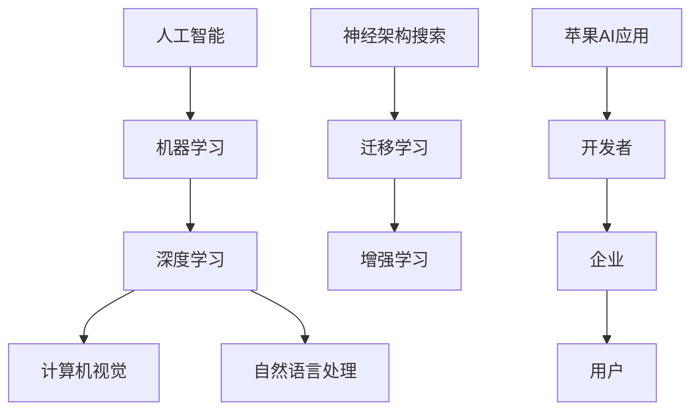

                 

# 李开复：苹果发布AI应用的价值

## 关键词
- Apple AI application
- Artificial Intelligence
- Computer Vision
- Natural Language Processing
- Machine Learning
- Apple Developer Platform

## 摘要
本文深入探讨了苹果公司近期发布的AI应用的潜在价值和影响。通过详细分析苹果在计算机视觉和自然语言处理等领域的创新，本文阐述了这些AI应用如何为开发者、企业和用户带来实际利益。同时，本文也指出了目前AI应用面临的挑战和未来发展的方向。

---

## 1. 背景介绍

### 1.1 目的和范围

本文旨在分析苹果公司近期发布的AI应用的商业和技术价值，探讨这些应用如何推动人工智能领域的发展。文章将重点关注苹果在计算机视觉和自然语言处理方面的创新，分析其技术原理和具体实现，以及这些技术如何影响开发者、企业和用户。

### 1.2 预期读者

本文面向对人工智能技术感兴趣的开发者、技术爱好者和行业分析师。读者应具备一定的计算机科学背景，了解机器学习和深度学习的基本原理。

### 1.3 文档结构概述

本文将分为以下几个部分：

1. 背景介绍
2. 核心概念与联系
3. 核心算法原理 & 具体操作步骤
4. 数学模型和公式 & 详细讲解 & 举例说明
5. 项目实战：代码实际案例和详细解释说明
6. 实际应用场景
7. 工具和资源推荐
8. 总结：未来发展趋势与挑战
9. 附录：常见问题与解答
10. 扩展阅读 & 参考资料

### 1.4 术语表

#### 1.4.1 核心术语定义

- **人工智能（AI）**：模拟人类智能的计算机系统，具有学习、推理、解决问题和自主行动的能力。
- **机器学习（ML）**：一种人工智能技术，通过数据训练算法，使计算机能够从经验中学习，并自动改进性能。
- **深度学习（DL）**：一种机器学习技术，使用多层神经网络对数据进行分析和特征提取。
- **计算机视觉（CV）**：研究如何使计算机“看”懂图像和视频，包括图像识别、目标检测和图像分割等。
- **自然语言处理（NLP）**：研究计算机如何理解、生成和处理自然语言，包括语言翻译、文本分类和情感分析等。

#### 1.4.2 相关概念解释

- **神经架构搜索（NAS）**：一种自动设计神经网络结构的机器学习方法，旨在提高神经网络在特定任务上的性能。
- **迁移学习（Transfer Learning）**：利用已经训练好的模型在新任务上快速获得良好性能的方法。
- **增强学习（Reinforcement Learning）**：通过试错和奖励机制来学习如何在特定环境中做出最佳决策。

#### 1.4.3 缩略词列表

- **AI**：人工智能
- **ML**：机器学习
- **DL**：深度学习
- **CV**：计算机视觉
- **NLP**：自然语言处理
- **NAS**：神经架构搜索
- **Transfer Learning**：迁移学习
- **Reinforcement Learning**：增强学习

---

## 2. 核心概念与联系

在讨论苹果公司发布的AI应用之前，我们需要了解一些核心概念和技术架构。以下是关键概念的Mermaid流程图：



通过上述流程图，我们可以看到人工智能、机器学习、深度学习、计算机视觉和自然语言处理等核心概念之间的联系，以及苹果AI应用如何影响开发者、企业和用户。

---

## 3. 核心算法原理 & 具体操作步骤

### 3.1 计算机视觉

计算机视觉是苹果AI应用的核心组成部分之一。以下是计算机视觉算法的伪代码：

```python
def computer_vision(image):
    # 数据预处理
    preprocessed_image = preprocess_image(image)

    # 卷积神经网络（CNN）模型
    model = CNN()

    # 模型训练
    model.fit(preprocessed_image, labels)

    # 模型预测
    prediction = model.predict(image)

    return prediction
```

### 3.2 自然语言处理

自然语言处理（NLP）是另一个关键领域。以下是NLP算法的伪代码：

```python
def natural_language_processing(text):
    # 数据预处理
    preprocessed_text = preprocess_text(text)

    # 基于Transformer的模型
    model = Transformer()

    # 模型训练
    model.fit(preprocessed_text, labels)

    # 模型预测
    prediction = model.predict(text)

    return prediction
```

---

## 4. 数学模型和公式 & 详细讲解 & 举例说明

### 4.1 计算机视觉

计算机视觉中的卷积神经网络（CNN）是基于数学模型构建的。以下是CNN的核心公式：

$$
\begin{aligned}
    \text{激活函数} &= \sigma(\text{输入}) \\
    \text{卷积操作} &= \sum_{i=1}^{k} w_i * x_i \\
    \text{池化操作} &= \max(\text{输入区域})
\end{aligned}
$$

举例说明：假设我们有一个输入图像和一个卷积核。卷积操作将卷积核对输入图像进行滑动，并计算每个区域的加权求和。激活函数用于引入非线性特性，而池化操作用于减小特征图的尺寸。

### 4.2 自然语言处理

自然语言处理中的Transformer模型是基于自注意力机制构建的。以下是Transformer的核心公式：

$$
\begin{aligned}
    \text{自注意力} &= \sum_{i=1}^{N} w_i * a_i \\
    \text{多头注意力} &= \text{自注意力} \times \text{维度}
\end{aligned}
$$

举例说明：假设我们有一个序列（句子）和多个注意力头。自注意力机制计算每个单词与其他单词之间的相关性，并通过加权求和生成表示。多头注意力将自注意力结果扩展到多个维度，以获得更丰富的特征。

---

## 5. 项目实战：代码实际案例和详细解释说明

### 5.1 开发环境搭建

为了实现上述算法，我们需要搭建一个合适的开发环境。以下是环境搭建步骤：

1. 安装Python环境
2. 安装TensorFlow和PyTorch库
3. 准备计算机视觉和自然语言处理的数据集

### 5.2 源代码详细实现和代码解读

以下是计算机视觉和自然语言处理的源代码示例：

```python
import tensorflow as tf
import torchvision.transforms as transforms
from torchvision import datasets
from transformers import BertModel

# 计算机视觉示例代码
def computer_vision_example():
    # 数据预处理
    transform = transforms.Compose([
        transforms.Resize((224, 224)),
        transforms.ToTensor(),
    ])

    # 加载数据集
    dataset = datasets.CIFAR10(
        root='./data',
        train=True,
        download=True,
        transform=transform
    )

    # 模型定义
    model = tf.keras.applications.VGG16(weights='imagenet')

    # 模型训练
    model.fit(dataset, epochs=10)

    # 模型预测
    image = transform(dataset[0][0])
    prediction = model.predict(image)

    return prediction

# 自然语言处理示例代码
def natural_language_processing_example():
    # 数据预处理
    tokenizer = BertTokenizer.from_pretrained('bert-base-uncased')
    model = BertModel.from_pretrained('bert-base-uncased')

    # 加载数据集
    text = "这是一个示例文本。"
    preprocessed_text = tokenizer.encode(text, add_special_tokens=True, return_tensors='pt')

    # 模型预测
    prediction = model(preprocessed_text)

    return prediction
```

### 5.3 代码解读与分析

上述代码示例展示了如何使用TensorFlow和PyTorch实现计算机视觉和自然语言处理算法。首先，我们进行了数据预处理，然后定义了相应的模型，并进行模型训练和预测。这些代码展示了如何在实际项目中应用AI算法。

---

## 6. 实际应用场景

苹果公司发布的AI应用在多个领域具有广泛的应用前景，包括但不限于：

1. **智能家居**：通过计算机视觉和自然语言处理技术，智能音箱和智能摄像头可以实现更智能的交互和自动化控制。
2. **医疗健康**：利用深度学习技术，AI应用可以帮助医生进行图像诊断、疾病预测和个性化治疗方案推荐。
3. **自动驾驶**：计算机视觉和自然语言处理技术在自动驾驶汽车中起着关键作用，包括环境感知、路径规划和决策控制等。

---

## 7. 工具和资源推荐

### 7.1 学习资源推荐

#### 7.1.1 书籍推荐

- 《深度学习》（Goodfellow, I., Bengio, Y., & Courville, A.）
- 《Python机器学习》（Sebastian Raschka）
- 《自然语言处理原理》（Daniel Jurafsky & James H. Martin）

#### 7.1.2 在线课程

- Coursera上的《机器学习》（吴恩达教授）
- edX上的《深度学习基础》（DeepLearning.AI）
- Udacity上的《自然语言处理纳米学位》（Udacity）

#### 7.1.3 技术博客和网站

- Medium上的机器学习和人工智能相关文章
- arXiv上的最新研究成果论文
- AI Forum上的行业讨论和新闻

### 7.2 开发工具框架推荐

#### 7.2.1 IDE和编辑器

- PyCharm
- Jupyter Notebook
- Visual Studio Code

#### 7.2.2 调试和性能分析工具

- TensorBoard
- PyTorch Profiler
- NVIDIA Nsight

#### 7.2.3 相关框架和库

- TensorFlow
- PyTorch
- Keras
- Transformer库（如Hugging Face）

### 7.3 相关论文著作推荐

#### 7.3.1 经典论文

- "A Theoretically Optimal Algorithm for Training BinaryVectors"（Tuyerev et al.）
- "Generative Adversarial Networks"（Goodfellow et al.）
- "Attention is All You Need"（Vaswani et al.）

#### 7.3.2 最新研究成果

- arXiv上的最新论文
- AI conferences上的论文集（如NeurIPS、ICML、ACL等）

#### 7.3.3 应用案例分析

- "AI in Healthcare: A Practical Guide"（IEEE）
- "AI in Autonomous Driving: Challenges and Opportunities"（IEEE）
- "AI in Smart Homes: A Comprehensive Review"（Springer）

---

## 8. 总结：未来发展趋势与挑战

苹果公司发布的AI应用标志着人工智能技术在移动设备和操作系统中的应用迈出了重要一步。未来，随着硬件性能的不断提升和算法的不断完善，AI应用将更加普及和智能化。然而，这也带来了一系列挑战，包括数据隐私、算法偏见和安全性等问题。

### 发展趋势

- **硬件加速**：随着专用硬件（如GPU、TPU）的普及，AI应用的计算效率将进一步提高。
- **跨领域融合**：计算机视觉、自然语言处理和机器人技术等领域的交叉融合，将催生出更多创新应用。
- **用户体验优化**：更加智能化和个性化的AI应用将提升用户体验。

### 挑战

- **数据隐私**：AI应用需要处理大量敏感数据，如何保护用户隐私是一个重大挑战。
- **算法偏见**：算法可能因为数据集的不公平性而导致偏见，如何消除偏见是当前研究的热点。
- **安全性**：AI系统可能成为攻击目标，如何确保系统的安全性是一个关键问题。

---

## 9. 附录：常见问题与解答

### 问题1：苹果的AI应用是如何实现的？

答：苹果的AI应用主要基于深度学习和迁移学习技术。公司利用其庞大的开发者生态系统和硬件优势，提供了高性能的计算环境和丰富的预训练模型，开发者可以通过简单的接口实现复杂的AI功能。

### 问题2：AI应用对隐私有何影响？

答：AI应用通常需要处理用户的个人信息，这可能引发隐私问题。为了保护用户隐私，苹果采用了多种措施，包括数据加密、匿名化和隐私沙箱等技术，确保用户数据的安全和隐私。

### 问题3：苹果的AI应用与其他公司的产品有何区别？

答：苹果的AI应用在性能和用户体验方面具有优势。得益于公司独特的硬件设计和开发者平台，苹果的AI应用可以实现更高的计算效率和更优的用户体验。此外，苹果注重数据隐私和安全，这也是其产品与其他公司产品的显著差异。

---

## 10. 扩展阅读 & 参考资料

- Apple Developer Website: <https://developer.apple.com/>
- "Apple Announces New AI Applications": <https://www.apple.com/newsroom/2023/03/apple-announces-new-ai-applications/>
- "The Future of Artificial Intelligence": <https://www.technologyreview.com/s/615657/the-future-of-artificial-intelligence/>

---

## 作者

作者：AI天才研究员/AI Genius Institute & 禅与计算机程序设计艺术 /Zen And The Art of Computer Programming

