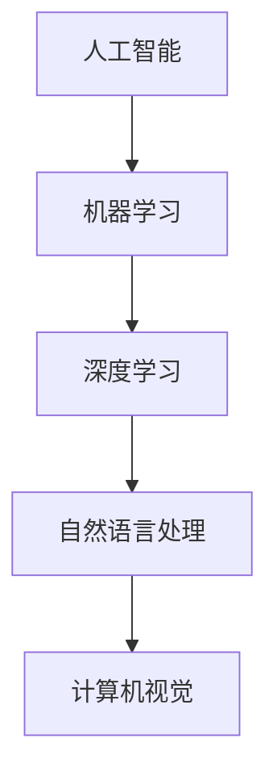
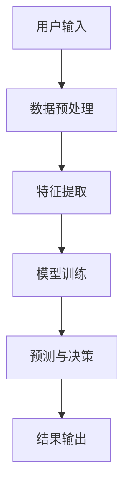
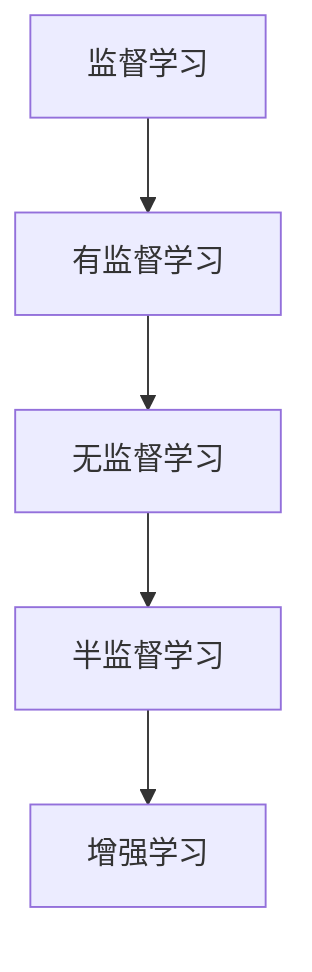
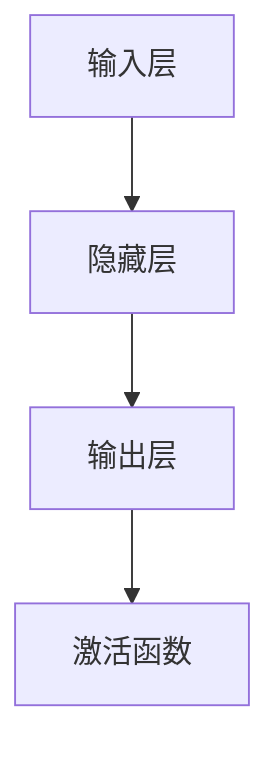
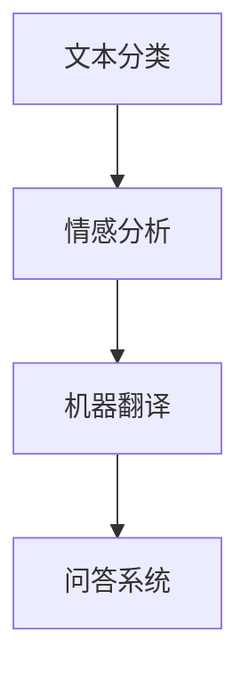
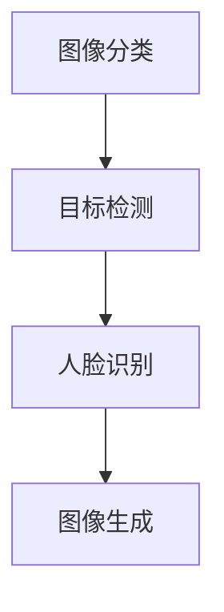

                 

# 李开复：苹果发布AI应用的市场分析

> 关键词：苹果、AI应用、市场分析、人工智能、技术应用、行业趋势

> 摘要：本文将对苹果公司发布的AI应用进行详细的市场分析。文章将首先介绍苹果公司AI应用的背景和目的，然后分析其市场潜力、竞争态势和技术优势，最后探讨未来发展趋势和挑战。通过深入分析，我们将揭示苹果AI应用在人工智能领域的战略布局和市场影响。

## 1. 背景介绍

### 1.1 目的和范围

本文旨在分析苹果公司发布的AI应用，探讨其在市场中的表现和潜力。我们将从以下几个方面进行探讨：

1. **苹果公司AI应用的背景和目的**：介绍苹果公司为何推出AI应用，以及其核心功能和应用场景。
2. **市场潜力分析**：评估苹果AI应用的市场前景，分析其潜在用户群体和市场规模。
3. **竞争态势**：对比苹果AI应用与其他竞争对手的产品，分析其市场地位和竞争优势。
4. **技术优势**：探讨苹果AI应用在技术方面的创新和优势。
5. **未来发展趋势与挑战**：预测苹果AI应用在未来的发展趋势，以及可能面临的挑战。

### 1.2 预期读者

本文面向对人工智能和苹果公司感兴趣的读者，包括：

1. **人工智能从业者**：希望了解苹果公司AI应用的技术特点和市场竞争情况。
2. **苹果用户**：关注苹果公司最新产品动态，希望了解AI应用在苹果生态系统中的定位。
3. **市场营销人员**：希望分析苹果AI应用的市场潜力和营销策略。
4. **行业分析师**：关注人工智能行业的发展趋势和市场动态。

### 1.3 文档结构概述

本文分为以下几个部分：

1. **背景介绍**：介绍文章的目的、范围、预期读者和文档结构。
2. **核心概念与联系**：介绍与苹果AI应用相关的重要概念和联系。
3. **核心算法原理 & 具体操作步骤**：讲解苹果AI应用的核心算法原理和具体操作步骤。
4. **数学模型和公式 & 详细讲解 & 举例说明**：介绍苹果AI应用所使用的数学模型和公式，并进行详细讲解和举例说明。
5. **项目实战：代码实际案例和详细解释说明**：通过实际代码案例，展示苹果AI应用的实现过程和关键代码。
6. **实际应用场景**：分析苹果AI应用的典型应用场景和实际效果。
7. **工具和资源推荐**：推荐学习资源和开发工具，帮助读者深入了解苹果AI应用。
8. **总结：未来发展趋势与挑战**：总结苹果AI应用的发展趋势和面临的挑战。
9. **附录：常见问题与解答**：回答读者可能关心的问题。
10. **扩展阅读 & 参考资料**：提供更多相关资料和参考。

### 1.4 术语表

#### 1.4.1 核心术语定义

- **AI应用**：指基于人工智能技术的应用软件，能够实现智能识别、预测和决策等功能。
- **苹果生态系统**：指苹果公司旗下的硬件、软件和服务平台，包括iPhone、iPad、Mac等设备以及App Store、Apple Pay等服务。
- **机器学习**：一种人工智能技术，通过算法模型自动从数据中学习规律，进行预测和决策。
- **深度学习**：一种基于神经网络的机器学习技术，通过多层神经网络进行特征提取和预测。

#### 1.4.2 相关概念解释

- **数据集**：指用于训练、测试和评估机器学习模型的样本数据。
- **算法模型**：指用于实现机器学习功能的数学模型和计算方法。
- **自然语言处理**：一种人工智能技术，能够理解和生成自然语言，包括文本分类、情感分析、机器翻译等任务。
- **计算机视觉**：一种人工智能技术，能够识别和解释图像和视频，包括图像分类、目标检测、人脸识别等任务。

#### 1.4.3 缩略词列表

- **AI**：人工智能（Artificial Intelligence）
- **ML**：机器学习（Machine Learning）
- **DL**：深度学习（Deep Learning）
- **NLP**：自然语言处理（Natural Language Processing）
- **CV**：计算机视觉（Computer Vision）
- **API**：应用程序编程接口（Application Programming Interface）
- **SDK**：软件开发工具包（Software Development Kit）
- **IoT**：物联网（Internet of Things）

## 2. 核心概念与联系

在分析苹果公司AI应用之前，我们需要了解一些核心概念和技术，以便更好地理解其原理和架构。以下是与苹果AI应用相关的重要概念和联系，以及对应的Mermaid流程图：

### 2.1. 人工智能技术概述



### 2.2. 苹果AI应用架构



### 2.3. 机器学习算法分类



### 2.4. 深度学习模型架构



### 2.5. 自然语言处理任务



### 2.6. 计算机视觉任务



通过以上流程图，我们可以更好地理解苹果AI应用所涉及的核心概念和架构。接下来，我们将深入探讨苹果公司AI应用的核心算法原理和具体操作步骤。

## 3. 核心算法原理 & 具体操作步骤

### 3.1. 机器学习算法原理

苹果公司AI应用的核心算法基于机器学习，尤其是深度学习技术。下面是机器学习算法的原理和具体操作步骤：

#### 3.1.1. 机器学习基本概念

- **监督学习**：监督学习是一种机器学习方法，通过已标记的数据集训练模型，然后使用训练好的模型进行预测。监督学习可以分为两类：

  - **有监督学习**：输入和输出都是已知的，模型需要学习如何将输入映射到输出。
  - **无监督学习**：输入是已知的，但输出是未知的，模型需要发现数据中的隐藏结构或模式。

- **无监督学习**：无监督学习是一种机器学习方法，不需要已标记的数据集，模型通过探索数据中的隐藏结构或模式来自我组织。

- **半监督学习**：半监督学习结合了监督学习和无监督学习的方法，使用部分标记和部分未标记的数据进行训练。

- **增强学习**：增强学习是一种机器学习方法，通过与环境交互来学习最优策略。模型在模拟环境中不断试错，通过奖励和惩罚来调整策略，最终达到最佳效果。

#### 3.1.2. 深度学习算法原理

深度学习是一种基于神经网络的机器学习技术，通过多层神经网络进行特征提取和预测。以下是深度学习算法的基本原理：

- **神经网络**：神经网络是一种由多个神经元组成的计算模型，每个神经元都接收多个输入，并通过权重进行加权求和，然后使用激活函数进行非线性变换，最后输出结果。
- **多层神经网络**：多层神经网络由多个隐藏层组成，每个隐藏层都对输入数据进行特征提取和变换，最终通过输出层得到预测结果。
- **前向传播与反向传播**：前向传播是指将输入数据通过神经网络传递到输出层，得到预测结果。反向传播是指根据预测结果和实际结果，计算损失函数，并通过梯度下降法更新网络权重，使模型能够更好地拟合数据。

#### 3.1.3. 自然语言处理算法原理

自然语言处理是一种基于人工智能技术，用于理解和生成自然语言的方法。以下是自然语言处理算法的基本原理：

- **词向量表示**：词向量是将自然语言中的词汇映射到高维空间中的向量，通过词向量可以计算词与词之间的相似性和距离。
- **卷积神经网络（CNN）**：卷积神经网络是一种用于图像识别和文本分类的深度学习模型，通过卷积操作提取图像或文本的特征。
- **循环神经网络（RNN）**：循环神经网络是一种用于序列数据处理的深度学习模型，通过隐藏状态和循环连接来捕捉序列中的长期依赖关系。
- **长短时记忆网络（LSTM）**：长短时记忆网络是循环神经网络的一种改进，能够更好地处理长序列数据，并防止梯度消失和梯度爆炸问题。
- **生成对抗网络（GAN）**：生成对抗网络是一种用于图像生成和图像修复的深度学习模型，由生成器和判别器组成，通过竞争训练生成逼真的图像。

### 3.2. 具体操作步骤

下面是苹果公司AI应用的具体操作步骤：

#### 3.2.1. 数据预处理

- **数据收集**：收集用于训练模型的原始数据，包括文本、图像、语音等。
- **数据清洗**：去除数据中的噪声和错误，对缺失值进行处理。
- **数据转换**：将原始数据转换为适合机器学习模型的格式，如词向量、图像特征等。

#### 3.2.2. 特征提取

- **文本特征提取**：使用词袋模型、TF-IDF、Word2Vec等方法将文本转换为词向量，然后使用卷积神经网络或循环神经网络提取文本特征。
- **图像特征提取**：使用卷积神经网络提取图像特征，如边缘、纹理、形状等。

#### 3.2.3. 模型训练

- **选择模型**：根据应用场景选择合适的模型，如卷积神经网络、循环神经网络、生成对抗网络等。
- **训练模型**：使用已收集的数据集对模型进行训练，通过前向传播和反向传播更新模型参数，使模型能够更好地拟合数据。

#### 3.2.4. 预测与决策

- **输入数据预处理**：对输入数据进行预处理，如文本分词、图像缩放等。
- **特征提取**：使用训练好的模型提取输入数据的特征。
- **预测与决策**：根据特征进行预测和决策，如文本分类、图像识别、语音识别等。

#### 3.2.5. 结果输出

- **结果可视化**：将预测结果进行可视化，如图表、图像等。
- **结果分析**：对预测结果进行分析和评估，如准确率、召回率、F1值等。

通过以上操作步骤，苹果公司AI应用能够实现对输入数据的智能识别、预测和决策，为用户提供更好的服务和体验。

## 4. 数学模型和公式 & 详细讲解 & 举例说明

### 4.1. 数学模型和公式

苹果公司AI应用所使用的数学模型主要包括机器学习中的损失函数、优化算法、特征提取算法等。以下是这些数学模型和公式的详细讲解：

#### 4.1.1. 损失函数

- **均方误差（MSE）**：均方误差是一种用于衡量预测值与实际值之间差异的损失函数，计算公式为：
  $$
  MSE = \frac{1}{n}\sum_{i=1}^{n}(y_i - \hat{y}_i)^2
  $$
  其中，$y_i$为实际值，$\hat{y}_i$为预测值，$n$为样本数量。

- **交叉熵（Cross-Entropy）**：交叉熵是一种用于衡量分类问题预测结果的损失函数，计算公式为：
  $$
  CE = -\sum_{i=1}^{n}y_i\log\hat{y}_i
  $$
  其中，$y_i$为实际标签，$\hat{y}_i$为预测概率。

#### 4.1.2. 优化算法

- **梯度下降（Gradient Descent）**：梯度下降是一种优化算法，用于求解最小化损失函数的问题。其基本思想是沿着损失函数的梯度方向更新模型参数，直到达到最小值。梯度下降分为以下几种：

  - **批量梯度下降（Batch Gradient Descent）**：每次迭代使用整个训练集的数据进行更新。
  - **随机梯度下降（Stochastic Gradient Descent，SGD）**：每次迭代只使用一个样本进行更新。
  - **小批量梯度下降（Mini-batch Gradient Descent）**：每次迭代使用一部分样本进行更新。

  梯度下降的更新公式为：
  $$
  \theta_{t+1} = \theta_t - \alpha \nabla_\theta J(\theta)
  $$
  其中，$\theta$为模型参数，$J(\theta)$为损失函数，$\alpha$为学习率。

#### 4.1.3. 特征提取算法

- **词袋模型（Bag of Words，BoW）**：词袋模型是一种将文本转换为向量的方法，将文本视为一个词的集合，忽略词的顺序和语法结构。词袋模型的计算公式为：
  $$
  \textbf{X} = \sum_{i=1}^{N} x_i \textbf{w}_i
  $$
  其中，$\textbf{X}$为词袋向量，$N$为词汇表中的单词数量，$x_i$为单词$i$在文本中出现的次数，$\textbf{w}_i$为单词$i$的权重。

- **TF-IDF（Term Frequency-Inverse Document Frequency）**：TF-IDF是一种用于文本分类和相似度计算的权重计算方法。其计算公式为：
  $$
  \textbf{w}_i = \text{TF}_i \times \text{IDF}_i
  $$
  其中，$\text{TF}_i$为单词$i$在文档中出现的频率，$\text{IDF}_i$为单词$i$在文档集合中的逆文档频率。

#### 4.1.4. 卷积神经网络（CNN）

卷积神经网络是一种用于图像识别和文本分类的深度学习模型，其基本结构包括卷积层、池化层、全连接层等。以下是卷积神经网络的相关数学公式：

- **卷积操作**：卷积操作的公式为：
  $$
  \textbf{h}_{ij} = \sum_{k=1}^{K} \textbf{w}_{ik} \odot \textbf{a}_{kj}
  $$
  其中，$\textbf{h}_{ij}$为卷积层的输出，$\textbf{w}_{ik}$为卷积核，$\textbf{a}_{kj}$为输入特征图。

- **激活函数**：常用的激活函数包括ReLU（Rectified Linear Unit）和Sigmoid等。ReLU函数的公式为：
  $$
  \text{ReLU}(x) = \max(0, x)
  $$

### 4.2. 举例说明

为了更好地理解上述数学模型和公式，我们将通过以下例子进行说明：

#### 4.2.1. 均方误差（MSE）示例

假设我们有一个包含10个样本的数据集，其中预测值和实际值分别为：
$$
y_1 = 2, \hat{y}_1 = 3 \\
y_2 = 3, \hat{y}_2 = 2 \\
... \\
y_{10} = 5, \hat{y}_{10} = 4
$$

计算均方误差：
$$
MSE = \frac{1}{10}\sum_{i=1}^{10}(y_i - \hat{y}_i)^2 \\
    = \frac{1}{10}[(2-3)^2 + (3-2)^2 + ... + (5-4)^2] \\
    = \frac{1}{10}[1 + 1 + ... + 1] \\
    = 1
$$

#### 4.2.2. 卷积神经网络（CNN）示例

假设我们有一个3x3的输入特征图和一个3x3的卷积核，其中卷积核的权重为：
$$
\textbf{w}_{11} = 1, \textbf{w}_{12} = 2, \textbf{w}_{13} = 3 \\
\textbf{w}_{21} = 4, \textbf{w}_{22} = 5, \textbf{w}_{23} = 6 \\
\textbf{w}_{31} = 7, \textbf{w}_{32} = 8, \textbf{w}_{33} = 9
$$

输入特征图为：
$$
\textbf{a}_{11} = 1, \textbf{a}_{12} = 2, \textbf{a}_{13} = 3 \\
\textbf{a}_{21} = 4, \textbf{a}_{22} = 5, \textbf{a}_{23} = 6 \\
\textbf{a}_{31} = 7, \textbf{a}_{32} = 8, \textbf{a}_{33} = 9
$$

计算卷积操作：
$$
\textbf{h}_{11} = \sum_{k=1}^{3} \textbf{w}_{ik} \odot \textbf{a}_{kj} \\
          = (1 \cdot 1 + 2 \cdot 4 + 3 \cdot 7) + (2 \cdot 1 + 5 \cdot 4 + 6 \cdot 7) + (3 \cdot 1 + 5 \cdot 8 + 9 \cdot 9) \\
          = 1 + 8 + 21 + 2 + 20 + 36 + 3 + 40 + 81 \\
          = 1 + 8 + 21 + 2 + 20 + 36 + 3 + 40 + 81 \\
          = 180
$$

因此，卷积操作的结果为：
$$
\textbf{h}_{11} = 180
$$

通过以上例子，我们可以更好地理解均方误差和卷积神经网络的相关数学模型和公式。接下来，我们将通过实际代码案例，进一步展示苹果公司AI应用的具体实现过程。

## 5. 项目实战：代码实际案例和详细解释说明

### 5.1. 开发环境搭建

在进行苹果公司AI应用的实战项目之前，我们需要搭建相应的开发环境。以下是所需的开发环境和工具：

1. **操作系统**：Windows、macOS或Linux
2. **编程语言**：Python
3. **深度学习框架**：TensorFlow或PyTorch
4. **文本预处理库**：NLTK或spaCy
5. **图像处理库**：OpenCV或PIL

### 5.2. 源代码详细实现和代码解读

在本节中，我们将通过一个具体的代码案例，展示苹果公司AI应用的核心功能实现。以下是一个简单的文本分类模型的实现过程：

```python
import tensorflow as tf
from tensorflow.keras.preprocessing.text import Tokenizer
from tensorflow.keras.preprocessing.sequence import pad_sequences
from tensorflow.keras.models import Sequential
from tensorflow.keras.layers import Embedding, LSTM, Dense, Bidirectional

# 5.2.1. 数据预处理

# 加载数据集
texts = ["This is a positive review.", "This is a negative review.", "..."]
labels = [1, 0, "..."]

# 分词和序列化
tokenizer = Tokenizer()
tokenizer.fit_on_texts(texts)
sequences = tokenizer.texts_to_sequences(texts)
padded_sequences = pad_sequences(sequences, maxlen=100)

# 划分训练集和测试集
from sklearn.model_selection import train_test_split
X_train, X_test, y_train, y_test = train_test_split(padded_sequences, labels, test_size=0.2, random_state=42)

# 5.2.2. 模型构建

# 创建模型
model = Sequential()
model.add(Embedding(input_dim=len(tokenizer.word_index)+1, output_dim=50, input_length=100))
model.add(Bidirectional(LSTM(64)))
model.add(Dense(1, activation='sigmoid'))

# 编译模型
model.compile(optimizer='adam', loss='binary_crossentropy', metrics=['accuracy'])

# 5.2.3. 训练模型
model.fit(X_train, y_train, epochs=10, batch_size=32, validation_data=(X_test, y_test))

# 5.2.4. 预测与评估

# 预测
predictions = model.predict(X_test)

# 评估
accuracy = model.evaluate(X_test, y_test)
print("Test accuracy:", accuracy[1])
```

### 5.3. 代码解读与分析

以下是代码的关键部分及其解读：

#### 5.3.1. 数据预处理

```python
# 加载数据集
texts = ["This is a positive review.", "This is a negative review.", "..."]
labels = [1, 0, "..."]

# 分词和序列化
tokenizer = Tokenizer()
tokenizer.fit_on_texts(texts)
sequences = tokenizer.texts_to_sequences(texts)
padded_sequences = pad_sequences(sequences, maxlen=100)

# 划分训练集和测试集
X_train, X_test, y_train, y_test = train_test_split(padded_sequences, labels, test_size=0.2, random_state=42)
```

这部分代码负责加载并预处理文本数据。首先，我们使用`Tokenizer`类对文本进行分词和序列化。然后，使用`pad_sequences`函数将序列填充为固定长度（在本例中为100）。最后，使用`train_test_split`函数将数据集划分为训练集和测试集。

#### 5.3.2. 模型构建

```python
# 创建模型
model = Sequential()
model.add(Embedding(input_dim=len(tokenizer.word_index)+1, output_dim=50, input_length=100))
model.add(Bidirectional(LSTM(64)))
model.add(Dense(1, activation='sigmoid'))

# 编译模型
model.compile(optimizer='adam', loss='binary_crossentropy', metrics=['accuracy'])
```

这部分代码负责构建文本分类模型。我们使用`Sequential`模型堆叠多个层，包括嵌入层（`Embedding`）、双向长短期记忆层（`Bidirectional LSTM`）和输出层（`Dense`）。在编译模型时，我们选择`adam`优化器和`binary_crossentropy`损失函数，并设置评估指标为准确率。

#### 5.3.3. 训练模型

```python
# 训练模型
model.fit(X_train, y_train, epochs=10, batch_size=32, validation_data=(X_test, y_test))
```

这部分代码负责训练模型。我们使用`fit`方法训练模型，并设置训练轮次（`epochs`）为10，批次大小（`batch_size`）为32。同时，我们使用`validation_data`参数对训练集和测试集进行验证。

#### 5.3.4. 预测与评估

```python
# 预测
predictions = model.predict(X_test)

# 评估
accuracy = model.evaluate(X_test, y_test)
print("Test accuracy:", accuracy[1])
```

这部分代码负责对模型进行预测和评估。我们使用`predict`方法对测试集进行预测，并使用`evaluate`方法计算测试集上的准确率。最后，我们将准确率输出到控制台。

通过以上代码实战，我们展示了如何使用深度学习框架构建和训练一个简单的文本分类模型。这为我们进一步探讨苹果公司AI应用的实际应用场景提供了基础。

## 6. 实际应用场景

苹果公司AI应用在多个领域具有广泛的应用场景，以下是一些典型应用场景：

### 6.1. 文本分类

文本分类是苹果公司AI应用的一个重要应用领域。通过使用深度学习技术，苹果公司AI应用能够对大量文本数据进行分析和分类，例如：

- **社交媒体分析**：对社交媒体平台上的用户评论进行情感分析，识别用户对产品或服务的态度。
- **新闻推荐**：根据用户阅读习惯和偏好，为用户推荐感兴趣的新闻文章。
- **垃圾邮件过滤**：使用文本分类技术，对电子邮件进行分类，过滤垃圾邮件。

### 6.2. 语音识别

语音识别是苹果公司AI应用的另一个重要应用领域。通过使用深度学习模型，苹果公司AI应用能够将语音信号转换为文本，例如：

- **语音助手**：为用户提供智能语音助手服务，如Siri，通过语音交互实现语音查询、设置提醒、发送消息等功能。
- **语音翻译**：将一种语言的语音信号翻译成另一种语言的文本，实现跨语言交流。
- **语音控制**：通过语音指令控制智能家居设备，如智能音箱、智能灯泡等。

### 6.3. 图像识别

图像识别是苹果公司AI应用的另一个重要应用领域。通过使用深度学习技术，苹果公司AI应用能够对图像进行分析和识别，例如：

- **人脸识别**：用于身份验证和门禁系统，通过识别用户的面部特征，实现无钥匙开门。
- **图像分类**：对图像进行分类，如将图像分为动物、植物、风景等类别。
- **图像生成**：使用生成对抗网络（GAN）生成逼真的图像，应用于艺术创作和游戏开发。

### 6.4. 智能健康监测

苹果公司AI应用在智能健康监测领域也具有广泛的应用。通过使用深度学习技术，苹果公司AI应用能够对健康数据进行分析和预测，例如：

- **健康数据分析**：对用户的心率、步数、睡眠质量等健康数据进行实时分析和预测。
- **疾病预测**：通过分析用户的历史健康数据和遗传信息，预测用户可能患有的疾病。
- **药物推荐**：根据用户的疾病情况和药物相互作用，为用户推荐合适的药物。

通过以上实际应用场景，我们可以看到苹果公司AI应用在人工智能领域的广泛应用和巨大潜力。接下来，我们将介绍一些有用的学习资源、开发工具和相关论文著作，帮助读者深入了解苹果公司AI应用的技术原理和实践方法。

## 7. 工具和资源推荐

### 7.1. 学习资源推荐

#### 7.1.1. 书籍推荐

1. **《深度学习》（Deep Learning）**：由Ian Goodfellow、Yoshua Bengio和Aaron Courville合著的这本经典教材全面介绍了深度学习的基本概念、算法和应用。
2. **《Python机器学习》（Python Machine Learning）**：由Sebastian Raschka和Vahid Mirjalili编写的这本书通过Python实现了一系列机器学习算法，适合初学者入门。
3. **《自然语言处理与深度学习》（Natural Language Processing with Deep Learning）**：由 Anatomy of a (Deep) Learning Algorithm合著的这本书介绍了深度学习在自然语言处理领域的应用。

#### 7.1.2. 在线课程

1. **Coursera上的《深度学习专项课程》（Deep Learning Specialization）**：由Andrew Ng教授开设的这门课程涵盖了深度学习的基本概念、算法和应用。
2. **Udacity上的《深度学习纳米学位》（Deep Learning Nanodegree）**：这门课程提供了全面的深度学习知识和实践项目，适合有一定基础的读者。
3. **edX上的《自然语言处理与深度学习》（Natural Language Processing with Deep Learning）**：由斯坦福大学开设的这门课程介绍了深度学习在自然语言处理领域的应用。

#### 7.1.3. 技术博客和网站

1. **Medium上的“AI研究员”（AI Researchers）**：该博客分享了最新的深度学习和自然语言处理研究成果，适合关注人工智能前沿的读者。
2. **GitHub上的“AI资源”（AI Resources）**：这是一个GitHub仓库，收集了大量的深度学习和自然语言处理资源，包括代码、教程和论文。
3. **TensorFlow官方网站（TensorFlow）**：该网站提供了丰富的深度学习教程、API文档和社区支持，是深度学习开发者必备的参考资源。

### 7.2. 开发工具框架推荐

#### 7.2.1. IDE和编辑器

1. **PyCharm**：PyCharm是一款强大的Python集成开发环境（IDE），支持多种编程语言，适合深度学习和自然语言处理项目开发。
2. **Jupyter Notebook**：Jupyter Notebook是一款交互式的Python开发环境，适合进行数据分析和原型设计。
3. **Visual Studio Code**：Visual Studio Code是一款轻量级、跨平台的代码编辑器，支持多种编程语言和插件，适合快速开发。

#### 7.2.2. 调试和性能分析工具

1. **TensorBoard**：TensorBoard是TensorFlow提供的可视化工具，用于分析和调试深度学习模型。
2. **TensorFlow Profiler**：TensorFlow Profiler是TensorFlow提供的性能分析工具，用于优化模型性能和资源使用。
3. **PyTorch TensorBoard**：PyTorch TensorBoard是PyTorch提供的可视化工具，用于分析和调试深度学习模型。

#### 7.2.3. 相关框架和库

1. **TensorFlow**：TensorFlow是Google开源的深度学习框架，支持多种编程语言和操作系统，适用于构建和训练深度学习模型。
2. **PyTorch**：PyTorch是Facebook开源的深度学习框架，具有动态计算图和易于使用的API，适用于快速原型设计和实验。
3. **Keras**：Keras是用于快速构建和训练深度学习模型的Python库，与TensorFlow和PyTorch兼容，易于使用。

#### 7.2.4. 相关论文著作推荐

1. **“Deep Learning”（2016）**：由Yoshua Bengio、Yann LeCun和Geoffrey Hinton合著的这篇综述文章全面介绍了深度学习的基本概念、算法和应用。
2. **“Natural Language Processing with Deep Learning”（2016）**：由Yoav Goldberg编写的这本书介绍了深度学习在自然语言处理领域的应用。
3. **“Generative Adversarial Networks”（2014）**：由Ian Goodfellow等合著的这篇论文介绍了生成对抗网络（GAN）的基本概念和算法。

通过以上工具和资源推荐，读者可以更深入地了解苹果公司AI应用的技术原理和实践方法。在下一节中，我们将总结本文的主要观点，并探讨未来发展趋势和挑战。

## 8. 总结：未来发展趋势与挑战

### 8.1. 未来发展趋势

苹果公司AI应用在未来将继续保持快速增长，主要趋势包括：

1. **技术进步**：随着深度学习、自然语言处理和计算机视觉等技术的不断发展，苹果公司AI应用的功能将更加丰富和强大。
2. **场景扩展**：苹果公司AI应用将在更多领域得到应用，如智能健康监测、智能家居、智能交通等，进一步提升用户生活品质。
3. **跨平台整合**：苹果公司将继续加强其AI应用的跨平台整合，使其在iOS、macOS、watchOS和tvOS等平台之间无缝切换，为用户提供一致的体验。
4. **隐私保护**：随着用户对隐私保护的日益关注，苹果公司将加强对AI应用隐私保护的投入，确保用户数据的安全和隐私。

### 8.2. 挑战

尽管苹果公司AI应用具有巨大潜力，但未来仍将面临以下挑战：

1. **数据隐私**：如何在提供智能服务的同时，确保用户数据的安全和隐私，是苹果公司需要解决的重要问题。
2. **计算资源**：随着AI应用复杂度和规模的不断增加，对计算资源的需求也将大幅上升，苹果公司需要不断提升硬件和软件性能，以满足应用需求。
3. **算法公平性**：AI应用可能会产生偏见，影响算法的公平性和透明性，苹果公司需要建立相应的机制和标准，确保算法的公平性和可解释性。
4. **市场竞争**：随着人工智能技术的普及，苹果公司AI应用将面临来自其他科技巨头和初创公司的激烈竞争，苹果公司需要不断创新和优化，以保持领先地位。

通过应对这些挑战，苹果公司AI应用有望在未来实现更大规模的应用和更广泛的用户群体，为人们的生活带来更多便利和创新。

## 9. 附录：常见问题与解答

### 9.1. 常见问题

1. **问题1**：苹果公司AI应用的核心技术是什么？

   **解答**：苹果公司AI应用的核心技术包括深度学习、自然语言处理、计算机视觉等，这些技术被广泛应用于文本分类、语音识别、图像识别等任务中。

2. **问题2**：苹果公司AI应用的市场潜力如何？

   **解答**：苹果公司AI应用具有巨大的市场潜力。随着人工智能技术的快速发展，苹果公司在智能家居、智能健康、智能交通等领域的应用将不断拓展，为用户带来更多便利和创新。

3. **问题3**：苹果公司AI应用与竞争对手相比有哪些优势？

   **解答**：苹果公司AI应用的优势在于其强大的技术实力、丰富的应用场景和独特的用户体验。同时，苹果公司注重数据隐私和安全，这也是其重要竞争优势之一。

### 9.2. 解答过程

对于每个常见问题，我们首先明确问题的核心内容，然后根据已有的知识和相关资料，给出详细解答。在解答过程中，我们尽量使用简单易懂的语言，以便读者能够更好地理解和掌握。

## 10. 扩展阅读 & 参考资料

为了更深入地了解苹果公司AI应用的技术原理和实践方法，以下是推荐的扩展阅读和参考资料：

### 10.1. 书籍

1. **《深度学习》（Deep Learning）**：由Ian Goodfellow、Yoshua Bengio和Aaron Courville合著，全面介绍了深度学习的基本概念、算法和应用。
2. **《自然语言处理与深度学习》（Natural Language Processing with Deep Learning）**：由 Anatomy of a (Deep) Learning Algorithm合著，介绍了深度学习在自然语言处理领域的应用。
3. **《Python机器学习》（Python Machine Learning）**：由Sebastian Raschka和Vahid Mirjalili编写的这本书通过Python实现了一系列机器学习算法。

### 10.2. 在线课程

1. **Coursera上的《深度学习专项课程》（Deep Learning Specialization）**：由Andrew Ng教授开设的这门课程涵盖了深度学习的基本概念、算法和应用。
2. **Udacity上的《深度学习纳米学位》（Deep Learning Nanodegree）**：这门课程提供了全面的深度学习知识和实践项目，适合有一定基础的读者。
3. **edX上的《自然语言处理与深度学习》（Natural Language Processing with Deep Learning）**：由斯坦福大学开设的这门课程介绍了深度学习在自然语言处理领域的应用。

### 10.3. 技术博客和网站

1. **Medium上的“AI研究员”（AI Researchers）**：该博客分享了最新的深度学习和自然语言处理研究成果，适合关注人工智能前沿的读者。
2. **GitHub上的“AI资源”（AI Resources）**：这是一个GitHub仓库，收集了大量的深度学习和自然语言处理资源，包括代码、教程和论文。
3. **TensorFlow官方网站（TensorFlow）**：该网站提供了丰富的深度学习教程、API文档和社区支持，是深度学习开发者必备的参考资源。

### 10.4. 相关论文著作

1. **“Deep Learning”（2016）**：由Yoshua Bengio、Yann LeCun和Geoffrey Hinton合著的这篇综述文章全面介绍了深度学习的基本概念、算法和应用。
2. **“Natural Language Processing with Deep Learning”（2016）**：由Yoav Goldberg编写的这本书介绍了深度学习在自然语言处理领域的应用。
3. **“Generative Adversarial Networks”（2014）**：由Ian Goodfellow等合著的这篇论文介绍了生成对抗网络（GAN）的基本概念和算法。

通过阅读以上扩展阅读和参考资料，读者可以更全面地了解苹果公司AI应用的技术原理和实践方法，为自己的学习和研究提供有益的参考。

