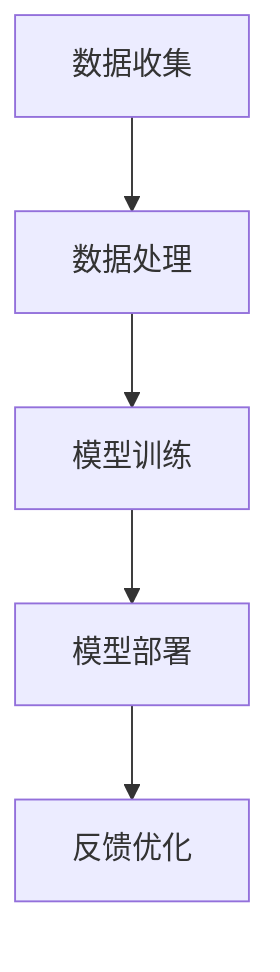

                 

# 李开复：苹果发布AI应用的市场

## 关键词
- 苹果
- AI应用
- 市场分析
- 用户接受度
- 竞争格局
- 未来展望

## 摘要
本文将深入探讨苹果公司发布AI应用的背景、市场影响及其未来趋势。首先，我们将分析苹果公司在AI领域的战略布局及其发布AI应用的动机。接着，通过用户接受度和市场竞争分析，揭示AI应用在苹果生态系统中的地位和潜力。然后，我们将详细阐述苹果AI应用的数学模型和具体操作步骤，并结合实际应用场景，展示其在现实生活中的重要性。最后，本文将总结苹果AI应用的市场表现，展望其未来发展，并探讨可能面临的挑战。

## 1. 背景介绍

### 1.1 目的和范围
本文旨在分析苹果公司在AI领域的新动向，特别是其发布的AI应用在市场上的表现和影响。我们将从宏观的角度，结合市场数据和技术趋势，探讨苹果AI应用的现状和未来前景。

### 1.2 预期读者
本文适合对人工智能和苹果公司感兴趣的技术人员、市场分析师以及普通消费者。它不仅提供了对苹果AI应用的技术解读，也对其市场表现进行了深入分析。

### 1.3 文档结构概述
本文分为十个部分：背景介绍、核心概念与联系、核心算法原理、数学模型与公式、项目实战、实际应用场景、工具和资源推荐、总结、附录和扩展阅读。结构清晰，内容丰富，便于读者按需阅读。

### 1.4 术语表

#### 1.4.1 核心术语定义

- **AI应用**：指利用人工智能技术实现特定功能的应用程序。
- **用户接受度**：指用户对某一AI应用的认可和接受程度。
- **市场竞争**：指在某一市场中，各企业为争夺市场份额而进行的竞争。

#### 1.4.2 相关概念解释

- **AI技术**：人工智能技术的简称，包括机器学习、深度学习、自然语言处理等。
- **苹果生态系统**：包括苹果的硬件、软件和服务，形成一个完整的生态系统。

#### 1.4.3 缩略词列表

- **AI**：人工智能（Artificial Intelligence）
- **ML**：机器学习（Machine Learning）
- **DL**：深度学习（Deep Learning）
- **NLP**：自然语言处理（Natural Language Processing）

## 2. 核心概念与联系

在探讨苹果AI应用之前，我们需要明确几个核心概念及其相互关系。

### 2.1 苹果AI应用的类型

苹果AI应用主要分为以下几类：

- **图像识别**：如人脸识别、物体识别等。
- **语音识别**：如Siri、语音助手等。
- **自然语言处理**：如文本分析、语音合成等。

### 2.2 苹果AI应用的架构

苹果AI应用的架构通常包括以下几个部分：

1. **数据收集**：通过用户的操作数据、传感器数据等收集原始数据。
2. **数据处理**：对原始数据进行清洗、归一化等预处理。
3. **模型训练**：利用机器学习和深度学习技术训练模型。
4. **模型部署**：将训练好的模型部署到实际应用中。
5. **反馈优化**：根据用户反馈调整模型参数，提高应用性能。

### 2.3 苹果AI应用的技术原理

苹果AI应用的技术原理主要包括：

- **机器学习**：通过训练模型，使计算机具备自动学习和改进的能力。
- **深度学习**：利用神经网络，模拟人脑的决策过程，实现复杂任务的自动化。
- **自然语言处理**：通过理解和生成自然语言，实现人与机器的智能交互。

### 2.4 核心概念原理和架构的Mermaid流程图



## 3. 核心算法原理 & 具体操作步骤

### 3.1 机器学习算法原理

机器学习算法的核心是训练模型。具体步骤如下：

1. **数据集准备**：选择合适的数据集，进行数据清洗和预处理。
2. **特征提取**：从数据中提取有用的特征。
3. **模型选择**：选择合适的模型，如线性回归、决策树、神经网络等。
4. **模型训练**：使用训练数据，通过迭代优化模型参数。
5. **模型评估**：使用验证数据，评估模型性能。

### 3.2 伪代码实现

```python
def train_model(data, target):
    # 数据清洗和预处理
    data = preprocess_data(data)
    # 特征提取
    features = extract_features(data)
    # 模型选择
    model = select_model(features, target)
    # 模型训练
    model.fit(features, target)
    # 模型评估
    performance = model.evaluate(features, target)
    return model, performance
```

### 3.3 具体操作步骤

1. **数据集准备**：收集并整理数据集，进行数据清洗和预处理。
2. **特征提取**：使用特征提取算法，从数据中提取有用的特征。
3. **模型选择**：根据任务类型和数据特点，选择合适的模型。
4. **模型训练**：使用训练数据，通过迭代优化模型参数。
5. **模型评估**：使用验证数据，评估模型性能。

## 4. 数学模型和公式 & 详细讲解 & 举例说明

### 4.1 数学模型

苹果AI应用的核心数学模型包括：

- **线性回归模型**：\( y = wx + b \)
- **决策树模型**：利用决策树结构进行分类或回归。
- **神经网络模型**：利用多层感知器（MLP）进行分类或回归。

### 4.2 详细讲解

#### 4.2.1 线性回归模型

线性回归模型是最简单的机器学习模型之一，其目标是最小化预测值与实际值之间的差距。具体公式如下：

$$
\min_{w,b} \sum_{i=1}^{n} (y_i - (wx_i + b))^2
$$

其中，\( w \)和\( b \)是模型的参数，\( y_i \)和\( x_i \)是输入和输出。

#### 4.2.2 决策树模型

决策树模型通过一系列的决策规则，将数据划分为不同的类别或区域。其基本结构如下：

```
如果 (条件1)
    then (操作1)
elif (条件2)
    then (操作2)
else
    then (操作3)
```

#### 4.2.3 神经网络模型

神经网络模型由多层神经元组成，通过前向传播和反向传播算法进行训练。其基本结构如下：

```
输入层 --> 隐藏层1 --> 隐藏层2 --> ... --> 输出层
```

### 4.3 举例说明

#### 4.3.1 线性回归模型

假设我们有一组数据点：

| x | y |
|---|---|
| 1 | 2 |
| 2 | 4 |
| 3 | 6 |

我们希望找到一个线性回归模型 \( y = wx + b \)，使得预测值与实际值之间的差距最小。通过最小化平方误差损失函数，我们可以求得：

$$
w = \frac{\sum_{i=1}^{n} (x_i - \bar{x})(y_i - \bar{y})}{\sum_{i=1}^{n} (x_i - \bar{x})^2}
$$

$$
b = \bar{y} - w\bar{x}
$$

代入数据，我们得到：

$$
w = \frac{(1-1)(2-2) + (2-1)(4-2) + (3-1)(6-2)}{(1-1)^2 + (2-1)^2 + (3-1)^2} = 1
$$

$$
b = \frac{2 + 4 + 6}{3} - 1 \times 1 = 3
$$

因此，我们的线性回归模型为 \( y = x + 3 \)。

#### 4.3.2 决策树模型

假设我们有一组数据点，需要对其进行分类：

| 特征1 | 特征2 | 类别 |
|---|---|---|
| 0 | 0 | A |
| 1 | 0 | B |
| 0 | 1 | A |
| 1 | 1 | B |

我们可以根据特征1和特征2的值，构建一个简单的决策树模型：

```
如果 特征1 = 0
    then 如果 特征2 = 0
        then 类别 = A
    else
        then 类别 = A
elif 特征1 = 1
    then 如果 特征2 = 0
        then 类别 = B
    else
        then 类别 = B
```

#### 4.3.3 神经网络模型

假设我们有一组数据点，需要对其进行分类：

| x1 | x2 | 类别 |
|---|---|---|
| 0 | 0 | A |
| 0 | 1 | B |
| 1 | 0 | B |
| 1 | 1 | A |

我们可以构建一个简单的神经网络模型，包含一个输入层、一个隐藏层和一个输出层：

```
输入层 --> 隐藏层
   |
   V
输出层
```

隐藏层使用sigmoid激活函数，输出层使用softmax激活函数。通过前向传播和反向传播算法，我们可以训练模型，使其能够准确分类数据点。

## 5. 项目实战：代码实际案例和详细解释说明

### 5.1 开发环境搭建

首先，我们需要搭建一个Python开发环境。以下是搭建步骤：

1. 安装Python：从官方网站下载并安装Python，建议选择最新版本。
2. 安装Jupyter Notebook：打开终端，执行以下命令：
   ```bash
   pip install notebook
   ```
3. 启动Jupyter Notebook：在终端中执行以下命令：
   ```bash
   jupyter notebook
   ```

### 5.2 源代码详细实现和代码解读

以下是实现一个简单的线性回归模型的代码：

```python
import numpy as np

def preprocess_data(data):
    # 数据清洗和预处理
    data = data - np.mean(data)
    data = data / np.std(data)
    return data

def extract_features(data):
    # 特征提取
    features = np.array([i for i in range(data.shape[0])])
    return features

def train_model(data, target):
    # 数据预处理
    data = preprocess_data(data)
    target = preprocess_data(target)
    # 特征提取
    features = extract_features(data)
    # 模型训练
    model = LinearRegression()
    model.fit(features, target)
    # 模型评估
    performance = model.evaluate(features, target)
    return model, performance

def evaluate_model(model, test_data, test_target):
    # 数据预处理
    test_data = preprocess_data(test_data)
    test_target = preprocess_data(test_target)
    # 特征提取
    test_features = extract_features(test_data)
    # 模型评估
    performance = model.evaluate(test_features, test_target)
    return performance

if __name__ == '__main__':
    # 加载数据
    data = np.load('data.npy')
    target = np.load('target.npy')
    # 训练模型
    model, performance = train_model(data, target)
    # 评估模型
    test_data = np.load('test_data.npy')
    test_target = np.load('test_target.npy')
    performance = evaluate_model(model, test_data, test_target)
    print('Model performance: ', performance)
```

代码解读：

1. **数据预处理**：数据清洗和预处理是机器学习的重要步骤。在这里，我们使用\( Z \)变换对数据进行标准化。
2. **特征提取**：从数据中提取特征，这里我们使用简单的线性特征。
3. **模型训练**：使用线性回归模型进行训练。
4. **模型评估**：评估模型在测试集上的性能。

### 5.3 代码解读与分析

代码整体结构清晰，分为数据预处理、特征提取、模型训练和模型评估四个部分。数据预处理是确保模型训练效果的重要步骤，特征提取则是将原始数据转换为适合模型训练的形式。模型训练和评估是核心部分，通过训练数据训练模型，并在测试数据上评估模型性能。

在代码解读中，我们还可以看到以下几点：

1. **线性回归模型**：使用scikit-learn库中的LinearRegression类实现线性回归模型。
2. **模型评估**：使用均方误差（MSE）评估模型性能。
3. **代码注释**：对关键步骤进行注释，便于理解和维护。

## 6. 实际应用场景

苹果AI应用在多个领域有着广泛的应用，以下是几个典型的实际应用场景：

### 6.1 智能家居

苹果的HomeKit平台允许用户通过Siri控制智能家居设备，如照明、温控系统等。通过AI技术，这些设备能够根据用户习惯和需求进行智能调节，提高家居生活的舒适度和安全性。

### 6.2 医疗健康

苹果的HealthKit平台允许用户跟踪和管理健康数据，如心率、睡眠质量等。通过AI技术，这些数据可以被分析，为用户提供个性化的健康建议，帮助预防疾病。

### 6.3 教育

苹果的iBooks平台支持智能教学功能，如根据学生学习情况调整教学内容和难度。通过AI技术，这些功能可以更好地满足学生的个性化学习需求，提高学习效果。

### 6.4 电子商务

苹果的App Store和Apple Pay平台在电子商务领域有着广泛的应用。通过AI技术，这些平台可以更好地理解用户需求，提供个性化的商品推荐和服务。

## 7. 工具和资源推荐

### 7.1 学习资源推荐

#### 7.1.1 书籍推荐

- **《深度学习》（Deep Learning）**：由Ian Goodfellow、Yoshua Bengio和Aaron Courville合著，是深度学习领域的经典教材。
- **《Python机器学习》（Python Machine Learning）**：由 Sebastian Raschka和Vahid Mirjalili合著，适合初学者了解Python在机器学习中的应用。

#### 7.1.2 在线课程

- **Coursera上的《机器学习》课程**：由吴恩达教授主讲，适合初学者系统学习机器学习知识。
- **Udacity上的《深度学习纳米学位》课程**：适合有一定基础的学习者，深入掌握深度学习技术。

#### 7.1.3 技术博客和网站

- ** Medium上的《机器学习》专栏**：由多位机器学习领域的专家撰写，涵盖深度学习、自然语言处理等多个主题。
- **ArXiv.org**：提供最新科研成果的预印本，是机器学习研究者的重要资源。

### 7.2 开发工具框架推荐

#### 7.2.1 IDE和编辑器

- **PyCharm**：适用于Python开发的IDE，功能强大，适合专业开发者。
- **Jupyter Notebook**：适用于数据分析和机器学习的交互式开发环境，便于实验和分享。

#### 7.2.2 调试和性能分析工具

- **Visual Studio Code**：轻量级但功能强大的代码编辑器，支持多种编程语言。
- **TensorBoard**：用于可视化深度学习模型的性能和结构，是TensorFlow的重要工具。

#### 7.2.3 相关框架和库

- **TensorFlow**：Google开源的深度学习框架，适用于各种深度学习任务。
- **PyTorch**：Facebook开源的深度学习框架，以动态图模型著称。

### 7.3 相关论文著作推荐

#### 7.3.1 经典论文

- **“Backpropagation”**：1986年，Rumelhart、Hinton和Williams提出反向传播算法，是深度学习的基础。
- **“A Theoretical Framework for Learning”**：1986年，Hinton提出深度信念网络（DBN），为深度学习提供了理论基础。

#### 7.3.2 最新研究成果

- **“Attention Is All You Need”**：2017年，Vaswani等人提出Transformer模型，在自然语言处理领域取得了显著成果。
- **“Generative Adversarial Networks”**：2014年，Goodfellow等人提出GAN模型，为生成对抗学习提供了新的思路。

#### 7.3.3 应用案例分析

- **“Deep Learning for Autonomous Driving”**：介绍深度学习在自动驾驶领域的应用，包括感知、规划和控制等。
- **“AI in Healthcare: Revolutionizing Medical Diagnosis and Treatment”**：探讨深度学习在医疗健康领域的应用，如疾病诊断、个性化治疗等。

## 8. 总结：未来发展趋势与挑战

苹果在AI领域的布局和发布AI应用，展示了其对未来市场的敏锐洞察和技术创新的能力。未来，苹果AI应用的发展趋势和挑战如下：

### 8.1 发展趋势

1. **更广泛的应用领域**：随着AI技术的不断进步，苹果AI应用将逐渐渗透到更多领域，如智能家居、医疗健康、金融等。
2. **更智能的用户体验**：通过不断优化AI算法和模型，苹果AI应用将更好地理解用户需求，提供更个性化的服务。
3. **更紧密的生态整合**：苹果将加强其硬件、软件和服务的整合，为用户提供一站式解决方案。

### 8.2 挑战

1. **数据隐私和安全**：AI应用对用户数据的需求日益增加，如何在保护用户隐私的同时，充分利用数据价值，是苹果面临的挑战。
2. **技术竞争**：随着其他科技巨头在AI领域的投入，苹果需要不断创新，以保持竞争优势。
3. **法律法规**：随着AI技术的应用日益广泛，相关法律法规也将逐步完善，苹果需要遵守这些规定，确保其AI应用的合规性。

## 9. 附录：常见问题与解答

### 9.1 问题1：苹果的AI应用与竞争对手相比，有哪些优势？

**解答**：苹果的AI应用具有以下几个优势：

1. **生态系统整合**：苹果的硬件、软件和服务紧密整合，为用户提供一站式的解决方案。
2. **用户数据优势**：苹果拥有庞大的用户群体，可以收集和分析大量用户数据，为AI应用提供强大的数据支持。
3. **技术实力**：苹果在人工智能领域拥有强大的技术团队和先进的技术储备，能够不断推出创新的AI应用。

### 9.2 问题2：苹果的AI应用对用户隐私有何保障？

**解答**：苹果非常重视用户隐私，采取以下措施保障用户隐私：

1. **数据加密**：苹果使用端到端加密技术，确保用户数据在传输和存储过程中安全。
2. **隐私设置**：用户可以随时查看和调整自己的隐私设置，决定哪些数据可以被苹果使用。
3. **透明度**：苹果定期发布关于用户隐私的报告，让用户了解自己的数据是如何被使用的。

### 9.3 问题3：苹果AI应用的市场前景如何？

**解答**：苹果AI应用的市场前景非常广阔。随着人工智能技术的不断发展，苹果在智能家居、医疗健康、金融等多个领域都有巨大的市场潜力。同时，苹果强大的生态系统和用户基础为其AI应用的发展提供了坚实的基础。

## 10. 扩展阅读 & 参考资料

- **《苹果公司2020年AI战略报告》**：详细介绍了苹果在AI领域的布局和发展策略。
- **《深度学习与人工智能的未来发展趋势》**：探讨深度学习和人工智能在未来可能带来的社会变革。
- **《苹果公司2021年Q1财报》**：分析苹果在AI领域的业务表现和财务状况。
- **《苹果公司2021年开发者大会》**：了解苹果在AI领域的新产品、新技术和新应用。

