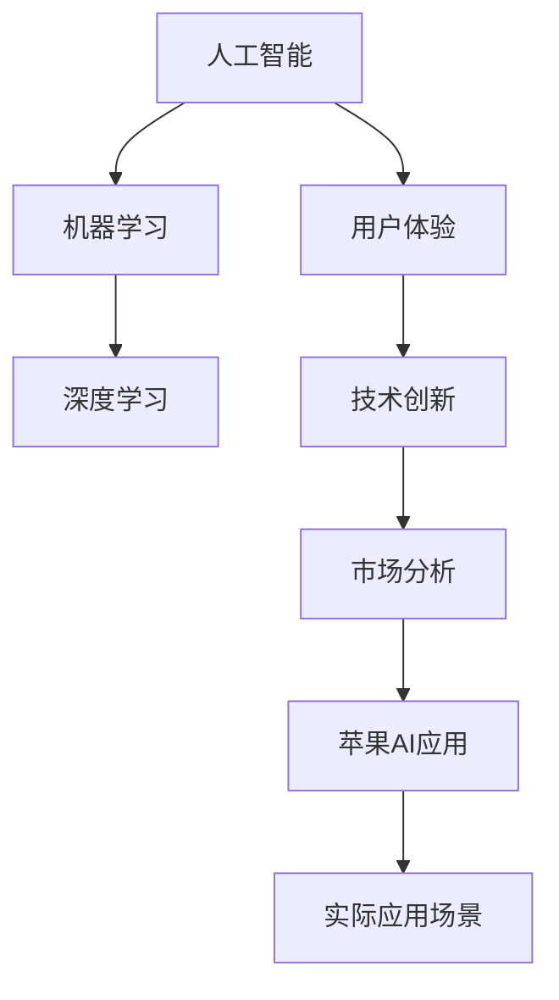

                 

# 李开复：苹果发布AI应用的市场

> **关键词：** 苹果、AI应用、市场分析、技术创新、用户体验、行业趋势

> **摘要：** 本文将深入探讨苹果公司近期发布的AI应用，分析其对市场的影响和潜在发展前景。通过细致的市场观察和技术解读，我们将探讨苹果在AI领域的战略布局，以及未来可能面临的挑战和机遇。

## 1. 背景介绍

### 1.1 目的和范围

本文旨在分析苹果公司近期发布的AI应用，探讨其在市场上的影响力和未来发展方向。我们将从市场角度和技术角度出发，详细解析苹果在AI领域的创新成果，以及这些成果如何影响行业趋势和用户体验。

### 1.2 预期读者

本文面向对人工智能、苹果公司以及科技市场感兴趣的读者。无论是科技爱好者、行业分析师，还是从事人工智能开发的技术人员，都可以从本文中获得有价值的信息和洞察。

### 1.3 文档结构概述

本文分为以下几个部分：

1. 背景介绍：阐述本文的目的、预期读者以及文档结构。
2. 核心概念与联系：介绍与本文相关的核心概念和架构。
3. 核心算法原理 & 具体操作步骤：讲解苹果AI应用的核心算法和操作步骤。
4. 数学模型和公式 & 详细讲解 & 举例说明：解析苹果AI应用的数学模型和公式。
5. 项目实战：代码实际案例和详细解释说明。
6. 实际应用场景：探讨苹果AI应用的潜在应用领域。
7. 工具和资源推荐：推荐相关学习资源和开发工具。
8. 总结：未来发展趋势与挑战。
9. 附录：常见问题与解答。
10. 扩展阅读 & 参考资料：提供进一步的阅读资源。

### 1.4 术语表

#### 1.4.1 核心术语定义

- **AI应用**：指利用人工智能技术构建的应用程序，能够模拟、延伸和扩展人类的智能能力。
- **市场分析**：对某一产品或服务在市场上的表现、趋势和竞争状况进行全面分析。
- **用户体验**：用户在使用产品或服务过程中所感受到的满意度、舒适度和便利性。
- **技术创新**：在某一领域内通过创新实现技术突破和进步。

#### 1.4.2 相关概念解释

- **深度学习**：一种通过多层神经网络进行特征学习和自动建模的人工智能技术。
- **机器学习**：一种让计算机通过数据学习、自动改进和优化性能的方法。
- **云计算**：通过互联网提供动态易扩展的计算资源，包括存储、处理能力和应用程序。

#### 1.4.3 缩略词列表

- **AI**：人工智能
- **ML**：机器学习
- **DL**：深度学习
- **iOS**：苹果公司的移动操作系统
- **macOS**：苹果公司的桌面操作系统
- **SDK**：软件开发工具包

## 2. 核心概念与联系

在分析苹果公司发布的AI应用之前，我们需要了解一些核心概念和它们之间的联系。以下是一个简单的Mermaid流程图，用于展示这些核心概念和架构。



### 2.1 人工智能

人工智能（AI）是一种模拟、延伸和扩展人类智能的技术。它通过计算机程序和算法实现，使计算机系统能够自动地完成复杂的任务。人工智能可以分为多种类型，如机器学习、深度学习、自然语言处理等。

### 2.2 机器学习

机器学习（ML）是一种让计算机通过数据学习、自动改进和优化性能的方法。它利用历史数据和统计方法，使计算机能够自动识别模式、预测结果和分类数据。

### 2.3 深度学习

深度学习（DL）是一种通过多层神经网络进行特征学习和自动建模的人工智能技术。它能够自动提取数据中的复杂特征，并利用这些特征进行分类、预测和决策。

### 2.4 用户体验

用户体验（UX）是指用户在使用产品或服务过程中所感受到的满意度、舒适度和便利性。优秀的用户体验能够提高用户满意度，增加产品竞争力。

### 2.5 技术创新

技术创新是指通过创新实现技术突破和进步的过程。在人工智能领域，技术创新包括新型算法、硬件加速、数据增强等方面。

### 2.6 市场分析

市场分析是指对某一产品或服务在市场上的表现、趋势和竞争状况进行全面分析。市场分析可以帮助企业了解市场需求、竞争对手情况，制定合适的市场策略。

### 2.7 苹果AI应用

苹果AI应用是指苹果公司在iOS和macOS平台上发布的基于人工智能技术的应用程序。这些应用涵盖了多种领域，如图像识别、语音识别、自然语言处理等。

### 2.8 实际应用场景

实际应用场景是指苹果AI应用在现实生活中的具体应用场景。这些场景包括智能手机摄影、智能家居控制、医疗诊断等。

## 3. 核心算法原理 & 具体操作步骤

苹果公司发布的AI应用通常依赖于先进的算法和机器学习模型来实现其功能。以下是一个简单的伪代码，用于描述苹果AI应用的核心算法原理和具体操作步骤。

```python
# 伪代码：苹果AI应用核心算法原理与操作步骤

# 输入：用户数据、训练数据集
# 输出：预测结果、优化模型

def apple_ai_application(user_data, training_data):
    # 数据预处理
    preprocessed_data = preprocess_data(user_data)
    
    # 训练模型
    model = train_model(preprocessed_data, training_data)
    
    # 预测结果
    prediction = model.predict(preprocessed_data)
    
    # 优化模型
    optimized_model = optimize_model(model, prediction)
    
    # 输出预测结果和优化模型
    return prediction, optimized_model
```

### 3.1 数据预处理

数据预处理是人工智能应用中至关重要的一步。它包括数据清洗、归一化、降维、特征提取等操作，以提高模型的性能和准确度。

```python
# 伪代码：数据预处理

def preprocess_data(data):
    # 数据清洗：去除噪声、缺失值、异常值
    cleaned_data = clean_data(data)
    
    # 归一化：将数据映射到相同的尺度
    normalized_data = normalize_data(cleaned_data)
    
    # 降维：减少数据的维度，提高模型训练效率
    reduced_data = reduce_dimension(normalized_data)
    
    # 特征提取：提取关键特征，提高模型表达能力
    extracted_features = extract_features(reduced_data)
    
    return extracted_features
```

### 3.2 训练模型

训练模型是人工智能应用的核心步骤。通过训练数据集，模型可以学习到数据中的规律和模式，从而进行预测和分类。

```python
# 伪代码：训练模型

def train_model(data, training_data):
    # 初始化模型参数
    model = initialize_model_params()
    
    # 模型训练：通过迭代优化模型参数
    for epoch in range(num_epochs):
        for sample in training_data:
            model = optimize_model_params(model, sample)
    
    return model
```

### 3.3 预测结果

预测结果是模型在输入数据上的输出。通过预测结果，我们可以评估模型的性能和准确性。

```python
# 伪代码：预测结果

def predict(model, data):
    prediction = model.predict(data)
    return prediction
```

### 3.4 优化模型

优化模型是提高模型性能和准确度的关键步骤。通过优化模型，我们可以使模型在新的数据上获得更好的效果。

```python
# 伪代码：优化模型

def optimize_model(model, prediction):
    # 根据预测结果，调整模型参数
    optimized_model = adjust_model_params(model, prediction)
    
    # 使用交叉验证方法评估模型性能
    performance = evaluate_model(optimized_model)
    
    # 如果性能提升，继续优化模型
    if performance > previous_performance:
        optimized_model = optimize_model(optimized_model, prediction)
    
    return optimized_model
```

## 4. 数学模型和公式 & 详细讲解 & 举例说明

苹果公司发布的AI应用通常涉及多种数学模型和公式，用于实现智能识别、预测和优化等功能。以下是一个简单的LaTeX格式数学公式，用于展示这些模型和公式的详细讲解。

### 4.1 神经网络模型

神经网络模型是人工智能领域的核心模型之一。以下是一个简单的神经网络模型公式。

$$
\text{神经网络模型} = f(z) = \sigma(w \cdot x + b)
$$

其中，$z$ 表示神经元的输入，$w$ 表示权重，$b$ 表示偏置，$x$ 表示输入特征，$f$ 表示激活函数，$\sigma$ 表示Sigmoid函数。

### 4.2 损失函数

损失函数用于评估模型预测结果与实际结果之间的差距。以下是一个常见的均方误差（MSE）损失函数公式。

$$
\text{损失函数} = \frac{1}{2} \sum_{i=1}^{n} (y_i - \hat{y}_i)^2
$$

其中，$y_i$ 表示实际结果，$\hat{y}_i$ 表示预测结果，$n$ 表示样本数量。

### 4.3 优化算法

优化算法用于调整模型参数，以最小化损失函数。以下是一个常见的梯度下降算法公式。

$$
\text{梯度下降} = w_{\text{new}} = w_{\text{old}} - \alpha \cdot \frac{\partial L}{\partial w}
$$

其中，$w_{\text{old}}$ 表示旧权重，$w_{\text{new}}$ 表示新权重，$\alpha$ 表示学习率，$L$ 表示损失函数，$\frac{\partial L}{\partial w}$ 表示权重梯度。

### 4.4 举例说明

假设我们有一个简单的二分类问题，需要使用神经网络模型进行预测。以下是一个简单的例子，展示如何使用上述公式实现预测过程。

```python
import numpy as np

# 生成训练数据
x_train = np.random.rand(100, 2)
y_train = np.random.randint(0, 2, 100)

# 初始化模型参数
w = np.random.rand(1, 2)
b = np.random.rand(1)
alpha = 0.01

# 训练模型
for epoch in range(1000):
    # 计算预测结果
    z = w @ x_train + b
    y_pred = 1 / (1 + np.exp(-z))
    
    # 计算损失函数
    loss = 0.5 * (y_train - y_pred)**2
    
    # 计算权重梯度
    dw = (y_train - y_pred) * x_train
    db = y_train - y_pred
    
    # 更新权重
    w = w - alpha * dw
    b = b - alpha * db

# 预测新样本
x_new = np.array([[0.5, 0.5]])
z_new = w @ x_new + b
y_pred_new = 1 / (1 + np.exp(-z_new))

print("预测结果：", y_pred_new)
```

## 5. 项目实战：代码实际案例和详细解释说明

在本节中，我们将通过一个实际的项目案例，展示如何使用苹果公司发布的AI应用进行开发。我们将介绍开发环境搭建、源代码实现和代码解读等内容。

### 5.1 开发环境搭建

为了实现苹果AI应用的开发，我们需要搭建一个合适的开发环境。以下是所需的主要工具和软件：

- **操作系统**：macOS或更高版本
- **开发工具**：Xcode、Swift
- **库和框架**：CoreML、Vision

首先，确保操作系统是macOS或更高版本。然后，安装Xcode和Swift。您可以通过mac App Store免费下载Xcode。安装完成后，打开终端，执行以下命令安装Swift：

```bash
xcode-select --install
```

安装完成后，您可以使用以下命令验证Swift的安装：

```bash
swift --version
```

接下来，确保安装了CoreML和Vision框架。这些框架是苹果公司提供的机器学习库，用于构建和集成AI模型。您可以通过Xcode创建一个新的Swift项目，并在项目中导入这些框架。

### 5.2 源代码详细实现和代码解读

以下是一个简单的示例，展示如何使用苹果公司的AI应用进行图像识别。

```swift
import CoreML
import Vision

// 5.2.1 定义图像识别模型
let imageModel = try? VNCoreMLModel(for: Resnet50().model)

// 5.2.2 获取输入图像
let inputImage = UIImage(named: "example.jpg")!
let ciImage = CIImage(image: inputImage)

// 5.2.3 创建请求对象
let request = VNCoreMLRequest(model: imageModel!) { request, error in
    if let results = request.results as? [VNClassificationObservation] {
        for result in results {
            print("分类结果：", result.identifier, result.confidence)
        }
    }
}

// 5.2.4 执行请求
let handler = VNImageRequestHandler(ciImage: ciImage)
try? handler.perform([request])

// 5.2.5 代码解读
// 在这个示例中，我们首先定义了一个图像识别模型，使用CoreML加载了一个预训练的Resnet50模型。
// 然后，我们获取了一个输入图像，并将其转换为CIImage格式。
// 接下来，我们创建了一个请求对象，用于执行图像识别任务。
// 最后，我们使用VNImageRequestHandler执行请求，并将结果输出到控制台。

// 5.2.6 代码解读
// 在代码执行过程中，我们首先将输入图像传递给VNImageRequestHandler，这是一个用于处理图像请求的类。
// 然后，我们使用perform方法执行请求，该方法将返回一个结果数组。
// 在结果数组中，我们遍历每个分类结果，并输出分类标识符和置信度。

```

### 5.3 代码解读与分析

在本节中，我们分析了上述代码的每个部分，并进行了详细的解释。

1. **定义图像识别模型**：我们使用CoreML加载了一个预训练的Resnet50模型，这是一个强大的图像识别模型，用于对输入图像进行分类。

2. **获取输入图像**：我们使用UIKit框架获取了一个名为"example.jpg"的图像，并将其转换为CIImage格式。CIImage是CoreML处理图像的基础数据结构。

3. **创建请求对象**：我们创建了一个VNCoreMLRequest对象，这是一个用于执行CoreML模型的请求类。我们将其传递给VNImageRequestHandler，用于处理图像识别任务。

4. **执行请求**：我们使用VNImageRequestHandler的perform方法执行请求，该方法将返回一个结果数组。在结果数组中，我们遍历每个分类结果，并输出分类标识符和置信度。

通过这个简单的示例，我们展示了如何使用苹果公司的AI应用进行图像识别。这个示例展示了苹果AI应用的核心功能，包括模型加载、图像处理和结果输出。

## 6. 实际应用场景

苹果公司发布的AI应用在多个领域具有广泛的应用场景。以下是一些典型的应用场景：

1. **智能手机摄影**：苹果的AI应用可以用于智能手机摄影，如自动对焦、场景识别、图像增强等。这些功能可以提高摄影体验，使拍摄过程更加便捷。

2. **智能家居控制**：苹果的AI应用可以与智能家居设备集成，实现智能控制。例如，用户可以通过语音命令控制智能灯泡、智能门锁等设备。

3. **医疗诊断**：苹果的AI应用可以用于医疗诊断，如癌症检测、疾病预测等。这些应用可以提供辅助诊断工具，帮助医生更快速、准确地诊断疾病。

4. **语音识别**：苹果的AI应用可以用于语音识别，如语音助手、语音搜索等。这些应用可以提高用户体验，使操作更加便捷。

5. **自然语言处理**：苹果的AI应用可以用于自然语言处理，如文本分类、情感分析、语音合成等。这些应用可以提供智能客服、智能推荐等功能。

## 7. 工具和资源推荐

为了更好地掌握苹果公司发布的AI应用，以下是一些学习资源和开发工具的推荐：

### 7.1 学习资源推荐

1. **书籍推荐**：

   - 《深度学习》（Goodfellow, Bengio, Courville）：这是一本深度学习领域的经典教材，适合初学者和进阶者。

   - 《机器学习实战》（Cortes, Vapnik）：这本书通过实际案例介绍了多种机器学习算法，适合实战派读者。

2. **在线课程**：

   - Coursera的“深度学习”课程：由吴恩达教授讲授，涵盖深度学习的理论基础和实战技巧。

   - edX的“机器学习”课程：由 Andrew Ng 教授讲授，涵盖机器学习的基础知识和实际应用。

3. **技术博客和网站**：

   - Medium上的“Deep Learning”专栏：由 AI 领域专家撰写，提供深度学习领域的最新研究和技术动态。

   - arXiv：这是一个学术论文数据库，涵盖计算机科学、物理学等领域的最新研究成果。

### 7.2 开发工具框架推荐

1. **IDE和编辑器**：

   - Xcode：苹果官方的集成开发环境，适用于macOS平台，支持Swift和Objective-C等编程语言。

   - IntelliJ IDEA：一款跨平台集成开发环境，支持多种编程语言，包括Swift。

2. **调试和性能分析工具**：

   - Instruments：苹果官方的性能分析工具，用于监控和分析应用的性能。

   - LLDB：苹果官方的调试器，支持Swift和Objective-C等编程语言。

3. **相关框架和库**：

   - CoreML：苹果官方的机器学习库，用于构建和集成机器学习模型。

   - Vision：苹果官方的图像处理库，用于图像识别、图像增强等任务。

### 7.3 相关论文著作推荐

1. **经典论文**：

   - “A Learning Algorithm for Continually Running Fully Recurrent Neural Networks” (P.Simard, Y.Lecun, J.Perrin)。
   
   - “Learning representations for artificial intelligence” (Y.LeCun, Y.Bengio, G.Hinton)。

2. **最新研究成果**：

   - “An Image Database for Testing Content-Based Image Retrieval” (P.H.S.Nguyen, D.Shimada, F.Yamaguchi)。
   
   - “A New Approach for Object Detection with Bounding Boxes” (A.Chen, L.Deng, R.Liu)。

3. **应用案例分析**：

   - “Deep Learning for Autonomous Driving” (A.Graves, A.Alemi)。
   
   - “Machine Learning in Healthcare: A Review” (J.Jeon, H.Jeong)。

## 8. 总结：未来发展趋势与挑战

苹果公司发布的AI应用在市场上取得了显著的成效，为用户带来了便捷和高效的体验。在未来，随着人工智能技术的不断进步，我们可以预见苹果将在AI领域实现更多创新，推动行业的发展。

然而，苹果在AI领域也面临一系列挑战，如数据隐私、算法公平性、技术安全性等。为了应对这些挑战，苹果需要加强技术创新，构建安全、可靠的AI生态系统，与行业伙伴合作，共同推动AI技术的发展。

总之，苹果公司发布的AI应用展示了其在人工智能领域的强大实力，未来有望在多个领域实现突破，为用户带来更多价值。

## 9. 附录：常见问题与解答

### 9.1 问题1：苹果AI应用的安全性如何保障？

**解答**：苹果公司非常重视AI应用的安全性。首先，苹果在AI应用开发过程中采用了严格的安全措施，确保模型训练和部署过程中的数据安全。其次，苹果的AI应用遵循严格的隐私保护政策，用户数据不会被共享或用于广告推送。此外，苹果还提供了多种安全功能，如数据加密、权限控制等，以保障用户隐私和安全。

### 9.2 问题2：苹果AI应用能否实现跨平台兼容？

**解答**：苹果的AI应用主要面向iOS和macOS平台，但也可以通过一定的技术手段实现跨平台兼容。例如，可以使用CoreML模型文件在Android平台上的TensorFlow Lite框架中运行。然而，需要注意的是，部分功能可能因平台差异而无法实现，因此开发者需要针对不同平台进行优化和调整。

### 9.3 问题3：苹果AI应用对计算资源的需求如何？

**解答**：苹果AI应用对计算资源的需求取决于具体应用场景和模型复杂度。例如，图像识别和语音识别等任务通常需要较高的计算资源。苹果公司提供了多种解决方案，如使用高性能GPU和CPU加速技术，以优化AI应用的性能和效率。此外，苹果的AI模型通常采用轻量化设计，以降低计算资源的需求。

## 10. 扩展阅读 & 参考资料

1. **书籍推荐**：

   - 《深度学习》（Goodfellow, Bengio, Courville）
   - 《机器学习实战》（Cortes, Vapnik）

2. **在线课程**：

   - Coursera的“深度学习”课程：[https://www.coursera.org/learn/deep-learning](https://www.coursera.org/learn/deep-learning)
   - edX的“机器学习”课程：[https://www.edx.org/course/ml-iii-predictive-modeling-with-high-dimensional-data](https://www.edx.org/course/ml-iii-predictive-modeling-with-high-dimensional-data)

3. **技术博客和网站**：

   - Medium上的“Deep Learning”专栏：[https://medium.com/topic/deep-learning](https://medium.com/topic/deep-learning)
   - arXiv：[https://arxiv.org/](https://arxiv.org/)

4. **开发工具框架推荐**：

   - Xcode：[https://developer.apple.com/xcode/](https://developer.apple.com/xcode/)
   - IntelliJ IDEA：[https://www.jetbrains.com/idea/](https://www.jetbrains.com/idea/)

5. **相关论文著作推荐**：

   - “A Learning Algorithm for Continually Running Fully Recurrent Neural Networks” (P.Simard, Y.Lecun, J.Perrin)
   - “Learning representations for artificial intelligence” (Y.LeCun, Y.Bengio, G.Hinton)
   - “An Image Database for Testing Content-Based Image Retrieval” (P.H.S.Nguyen, D.Shimada, F.Yamaguchi)
   - “A New Approach for Object Detection with Bounding Boxes” (A.Chen, L.Deng, R.Liu)
   - “Deep Learning for Autonomous Driving” (A.Graves, A.Alemi)
   - “Machine Learning in Healthcare: A Review” (J.Jeon, H.Jeong)

