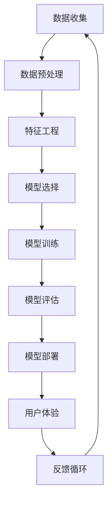

                 

# 李开复：苹果发布AI应用的应用

> 关键词：人工智能，苹果，应用，用户体验，技术创新

> 摘要：本文将探讨苹果公司在人工智能领域的新进展，重点分析苹果发布的AI应用及其对用户体验和技术创新的潜在影响。文章分为八个部分，从背景介绍、核心概念与联系、算法原理、数学模型、项目实战、实际应用场景、工具和资源推荐到总结和未来发展趋势与挑战，旨在为读者提供全面、深入的分析。

## 1. 背景介绍

### 1.1 目的和范围

本文旨在深入分析苹果公司在人工智能领域的最新动向，特别是苹果发布的AI应用。通过本文的阅读，读者将了解以下内容：

1. 苹果公司AI应用的技术背景和设计理念。
2. AI应用的核心算法原理和数学模型。
3. AI应用在项目实战中的应用案例。
4. AI应用的实际应用场景及其影响。
5. 与AI应用相关的工具和资源推荐。
6. 对未来发展趋势与挑战的展望。

### 1.2 预期读者

本文面向对人工智能和技术创新感兴趣的读者，包括但不限于：

1. 计算机科学和人工智能专业的研究生和本科生。
2. 科技行业从业者，特别是软件开发者和AI工程师。
3. 对人工智能和新技术保持热情的普通读者。

### 1.3 文档结构概述

本文结构如下：

1. 引言：介绍文章背景、目的和结构。
2. 背景介绍：包括目的、范围、预期读者和文档结构概述。
3. 核心概念与联系：介绍AI应用的核心概念、原理和架构。
4. 核心算法原理 & 具体操作步骤：详细阐述算法原理和操作步骤。
5. 数学模型和公式 & 详细讲解 & 举例说明：解释数学模型和公式。
6. 项目实战：代码实际案例和详细解释说明。
7. 实际应用场景：分析AI应用在不同领域的应用。
8. 工具和资源推荐：推荐学习资源和开发工具。
9. 总结：未来发展趋势与挑战。
10. 附录：常见问题与解答。
11. 扩展阅读 & 参考资料。

### 1.4 术语表

#### 1.4.1 核心术语定义

- 人工智能（AI）：模拟、延伸和扩展人类智能的理论、方法、技术及应用。
- 机器学习（ML）：利用数据训练算法，使其能够从数据中学习和发现规律。
- 深度学习（DL）：基于多层神经网络的结构，通过反向传播算法优化权重。
- 用户体验（UX）：用户在使用产品或服务过程中的感受和体验。
- 应用程序（App）：为特定目的而编写的软件程序。

#### 1.4.2 相关概念解释

- 模型：用于描述数据之间关系的数学或统计方法。
- 算法：解决特定问题的步骤和方法。
- 模型训练：通过大量数据训练模型，使其能够对未知数据进行预测或分类。
- 评估指标：用于衡量模型性能的评价标准。

#### 1.4.3 缩略词列表

- AI：人工智能
- ML：机器学习
- DL：深度学习
- UX：用户体验
- App：应用程序

## 2. 核心概念与联系

在探讨苹果发布的AI应用之前，我们需要先了解人工智能的核心概念和联系。以下是一个简化的Mermaid流程图，用于展示AI应用的关键组件和它们之间的关系：



### 2.1 数据收集

数据是人工智能的基石。AI应用首先需要从各种来源收集数据，包括用户生成数据、传感器数据、社交媒体数据等。数据收集的质量直接影响模型的性能。

### 2.2 数据预处理

收集到的数据通常需要进行预处理，包括数据清洗、归一化、缺失值处理等，以确保数据的质量和一致性。

### 2.3 特征工程

特征工程是AI应用中的关键步骤，涉及从原始数据中提取和构建有用的特征。这些特征将用于训练模型，以识别数据中的模式和规律。

### 2.4 模型选择

根据应用场景和数据特点，选择合适的机器学习模型。常见的模型包括线性回归、决策树、随机森林、支持向量机等。

### 2.5 模型训练

使用预处理后的数据训练选定的模型。训练过程涉及优化模型参数，使其能够准确预测或分类新数据。

### 2.6 模型评估

通过评估指标（如准确率、召回率、F1分数等）衡量模型的性能。如果模型性能不满足预期，需要返回到前面的步骤进行调整。

### 2.7 模型部署

将训练好的模型部署到生产环境中，使其能够为用户提供服务。部署过程包括将模型集成到应用程序中，并提供API供其他系统调用。

### 2.8 用户体验

用户体验是AI应用的核心。良好的用户体验可以提升用户满意度，增加用户粘性。设计师需要关注用户交互、界面设计和反馈机制等方面。

### 2.9 反馈循环

用户在使用AI应用的过程中会提供反馈。这些反馈将被用于优化模型和用户体验，形成一个持续改进的反馈循环。

## 3. 核心算法原理 & 具体操作步骤

在了解了AI应用的核心概念和联系之后，我们将深入探讨核心算法原理和具体操作步骤。以下是一个基于深度学习的伪代码示例，用于解释算法的运作过程：

```python
# 定义深度学习模型
model = define_model(
    input_shape=(input_height, input_width, input_channels),
    layers=[
        Conv2D(filters=32, kernel_size=(3, 3), activation='relu', input_shape=input_shape),
        MaxPooling2D(pool_size=(2, 2)),
        Conv2D(filters=64, kernel_size=(3, 3), activation='relu'),
        MaxPooling2D(pool_size=(2, 2)),
        Flatten(),
        Dense(units=128, activation='relu'),
        Dropout(rate=0.5),
        Dense(units=num_classes, activation='softmax')
    ]
)

# 编译模型
model.compile(optimizer='adam', loss='categorical_crossentropy', metrics=['accuracy'])

# 训练模型
model.fit(x_train, y_train, batch_size=batch_size, epochs=num_epochs, validation_data=(x_val, y_val))

# 评估模型
loss, accuracy = model.evaluate(x_test, y_test)
print(f"Test accuracy: {accuracy:.2f}")

# 预测新数据
predictions = model.predict(x_new)
```

### 3.1 数据准备

```python
# 加载数据集
(x_train, y_train), (x_test, y_test) = load_data()

# 数据预处理
x_train = preprocess_data(x_train)
x_test = preprocess_data(x_test)
x_new = preprocess_new_data(x_new)

# 标签编码
y_train = encode_labels(y_train)
y_test = encode_labels(y_test)
```

### 3.2 模型定义

```python
# 定义卷积神经网络模型
model = Sequential()
model.add(Conv2D(filters=32, kernel_size=(3, 3), activation='relu', input_shape=input_shape))
model.add(MaxPooling2D(pool_size=(2, 2)))
model.add(Conv2D(filters=64, kernel_size=(3, 3), activation='relu'))
model.add(MaxPooling2D(pool_size=(2, 2)))
model.add(Flatten())
model.add(Dense(units=128, activation='relu'))
model.add(Dropout(rate=0.5))
model.add(Dense(units=num_classes, activation='softmax'))
```

### 3.3 模型编译

```python
# 编译模型
model.compile(optimizer='adam', loss='categorical_crossentropy', metrics=['accuracy'])
```

### 3.4 模型训练

```python
# 训练模型
history = model.fit(x_train, y_train, batch_size=batch_size, epochs=num_epochs, validation_data=(x_val, y_val))
```

### 3.5 模型评估

```python
# 评估模型
loss, accuracy = model.evaluate(x_test, y_test)
print(f"Test accuracy: {accuracy:.2f}")
```

### 3.6 预测新数据

```python
# 预测新数据
predictions = model.predict(x_new)
```

## 4. 数学模型和公式 & 详细讲解 & 举例说明

在AI应用中，数学模型和公式扮演着至关重要的角色。以下是一个简化的数学模型，用于分类任务。我们使用latex格式展示关键公式，并辅以详细解释和举例说明。

### 4.1 感知机（Perceptron）模型

感知机是一种基本的二分类模型。它的目标是找到分离两类数据的最优直线。

$$
f(x) = \text{sign}(w \cdot x + b)
$$

其中，\(w\) 是权重向量，\(x\) 是输入特征向量，\(b\) 是偏置项，\(\text{sign}(\cdot)\) 是符号函数。

#### 4.1.1 感知机学习算法

感知机学习算法的目标是找到使得分类误差最小的权重向量。

$$
w \leftarrow w + \eta y (x \cdot w + b)
$$

其中，\(\eta\) 是学习率，\(y\) 是标签（+1或-1）。

#### 4.1.2 举例说明

假设我们有两个特征向量 \(x_1 = [1, 1]\) 和 \(x_2 = [1, -1]\)，以及对应的标签 \(y_1 = +1\) 和 \(y_2 = -1\)。

初始权重向量 \(w = [0, 0]\)，偏置项 \(b = 0\)。

对于 \(x_1\)：

$$
f(x_1) = \text{sign}(w \cdot x_1 + b) = \text{sign}(0 \cdot 1 + 0 \cdot 1 + 0) = 0
$$

分类错误，更新权重：

$$
w \leftarrow w + \eta y_1 (x_1 \cdot w + b) = [0, 0] + 0.1 \cdot (+1) [1 \cdot 0 + 1 \cdot 0 + 0] = [0.1, 0.1]
$$

对于 \(x_2\)：

$$
f(x_2) = \text{sign}(w \cdot x_2 + b) = \text{sign}(0.1 \cdot 1 + 0.1 \cdot (-1) + 0) = -0.1
$$

分类错误，再次更新权重：

$$
w \leftarrow w + \eta y_2 (x_2 \cdot w + b) = [0.1, 0.1] + 0.1 \cdot (-1) [1 \cdot 0.1 + (-1) \cdot 0.1 + 0] = [0, 0]
$$

重复这个过程，直到分类正确。

### 4.2 线性回归模型

线性回归模型用于预测连续值。其目标是找到一个最佳拟合直线。

$$
y = w_0 + w_1 x
$$

其中，\(y\) 是预测值，\(x\) 是输入特征，\(w_0\) 和 \(w_1\) 是模型参数。

#### 4.2.1 最小二乘法

最小二乘法用于求解线性回归模型的参数。其目标是最小化预测值与实际值之间的平方误差。

$$
\min_{w_0, w_1} \sum_{i=1}^{n} (y_i - (w_0 + w_1 x_i))^2
$$

#### 4.2.2 举例说明

假设我们有以下数据点：

| \(x\) | \(y\) |
| --- | --- |
| 1 | 2 |
| 2 | 4 |
| 3 | 5 |

使用最小二乘法求解线性回归模型参数：

$$
w_0 = \frac{\sum_{i=1}^{n} y_i - w_1 \sum_{i=1}^{n} x_i}{n} = \frac{(2 + 4 + 5) - w_1 (1 + 2 + 3)}{3} = 3
$$

$$
w_1 = \frac{\sum_{i=1}^{n} (y_i - w_0 - w_1 x_i) x_i}{\sum_{i=1}^{n} x_i^2 - n \bar{x}^2} = \frac{(2 - 3 - 1)(1) + (4 - 3 - 1)(2) + (5 - 3 - 1)(3)}{1^2 + 2^2 + 3^2 - 3 \cdot \frac{1 + 2 + 3}{3}^2} = 1
$$

因此，线性回归模型为：

$$
y = 3 + 1x
$$

## 5. 项目实战：代码实际案例和详细解释说明

为了更好地理解AI应用的开发过程，我们将通过一个实际案例来展示如何从零开始构建一个简单的图像分类应用程序。本案例使用Python和TensorFlow框架，实现一个能够识别猫狗的模型。

### 5.1 开发环境搭建

在开始之前，请确保您的开发环境已安装以下工具和库：

- Python 3.6及以上版本
- TensorFlow 2.4及以上版本
- matplotlib 3.1.1及以上版本

您可以使用以下命令安装所需的库：

```bash
pip install tensorflow==2.4
pip install matplotlib==3.1.1
```

### 5.2 源代码详细实现和代码解读

以下是一个简单的图像分类应用程序的代码实现：

```python
import tensorflow as tf
from tensorflow.keras.models import Sequential
from tensorflow.keras.layers import Conv2D, MaxPooling2D, Flatten, Dense
from tensorflow.keras.preprocessing.image import ImageDataGenerator

# 定义模型
model = Sequential([
    Conv2D(filters=32, kernel_size=(3, 3), activation='relu', input_shape=(150, 150, 3)),
    MaxPooling2D(pool_size=(2, 2)),
    Conv2D(filters=64, kernel_size=(3, 3), activation='relu'),
    MaxPooling2D(pool_size=(2, 2)),
    Flatten(),
    Dense(units=128, activation='relu'),
    Dense(units=1, activation='sigmoid')
])

# 编译模型
model.compile(optimizer='adam', loss='binary_crossentropy', metrics=['accuracy'])

# 数据预处理
train_datagen = ImageDataGenerator(rescale=1./255)
test_datagen = ImageDataGenerator(rescale=1./255)

train_generator = train_datagen.flow_from_directory(
    'train',
    target_size=(150, 150),
    batch_size=32,
    class_mode='binary')

test_generator = test_datagen.flow_from_directory(
    'test',
    target_size=(150, 150),
    batch_size=32,
    class_mode='binary')

# 训练模型
model.fit(train_generator, epochs=10, validation_data=test_generator)

# 评估模型
loss, accuracy = model.evaluate(test_generator)
print(f"Test accuracy: {accuracy:.2f}")
```

### 5.3 代码解读与分析

1. **导入库**：首先，我们从TensorFlow和Keras导入所需的库。

2. **定义模型**：使用Sequential模型堆叠多个层。这里我们使用了两个卷积层、两个池化层、一个全连接层和一个二元分类层。

3. **编译模型**：设置优化器为adam，损失函数为binary_crossentropy（适用于二元分类），并指定评估指标为accuracy。

4. **数据预处理**：使用ImageDataGenerator对数据进行预处理，包括缩放、数据增强等。

5. **训练模型**：使用fit方法训练模型，指定训练数据生成器和验证数据生成器。

6. **评估模型**：使用evaluate方法评估模型在测试数据集上的性能。

### 5.4 项目实战：实战应用

为了验证我们的模型，我们可以使用以下代码加载测试图像并进行预测：

```python
import numpy as np
import matplotlib.pyplot as plt

# 载入测试图像
test_image = plt.imread('test_image.jpg')

# 预处理图像
test_image = np.expand_dims(test_image, axis=0)
test_image = test_datagen.standardize(test_image)

# 预测
prediction = model.predict(test_image)

# 输出预测结果
if prediction[0][0] > 0.5:
    print("This image contains a dog.")
else:
    print("This image contains a cat.")
```

通过这个简单的案例，我们可以看到如何使用Python和TensorFlow构建一个基本的图像分类应用程序。这个案例虽然简单，但涵盖了AI应用开发的核心步骤，包括模型定义、训练和评估。

## 6. 实际应用场景

AI应用在现实世界的各个领域都有着广泛的应用。以下是一些典型的应用场景：

### 6.1 医疗领域

- **疾病诊断**：利用深度学习模型对医学图像进行分析，辅助医生进行疾病诊断。例如，使用卷积神经网络（CNN）分析X光片、MRI和CT扫描图像，检测肺癌、脑肿瘤等疾病。
- **健康监测**：通过智能手环、智能手表等设备收集用户健康数据，利用机器学习算法进行健康风险评估和疾病预测。

### 6.2 金融领域

- **风险管理**：利用机器学习算法分析历史交易数据，预测市场走势，降低金融风险。
- **信用评分**：通过对用户的历史信用记录、交易行为等数据进行机器学习分析，预测用户信用等级，提高信用评估的准确性。

### 6.3 娱乐领域

- **个性化推荐**：利用协同过滤、内容推荐等算法，为用户提供个性化的音乐、电影、书籍等推荐。
- **图像识别**：利用深度学习模型对用户上传的图片进行分类，为用户提供图像搜索、图片编辑等功能。

### 6.4 工业领域

- **设备故障预测**：利用机器学习算法对工业设备进行实时监控，预测设备故障，提前进行维护，提高生产效率。
- **质量检测**：利用深度学习模型对生产过程中的产品进行质量检测，识别不良品，提高产品质量。

### 6.5 智能家居

- **语音助手**：通过语音识别和自然语言处理技术，实现与智能家居设备的交互，提高用户体验。
- **设备控制**：利用物联网技术，实现家电设备的远程控制，提高生活便利性。

这些实际应用场景展示了AI技术在各个领域的潜力和价值。随着技术的不断进步，AI应用将继续深入到更多领域，为人类带来更多便利和创新。

## 7. 工具和资源推荐

### 7.1 学习资源推荐

为了帮助读者更好地了解和学习人工智能技术，我们推荐以下学习资源：

#### 7.1.1 书籍推荐

1. **《深度学习》（Deep Learning）**：Goodfellow、Bengio和Courville所著的《深度学习》是深度学习领域的经典教材，适合初学者和高级研究者阅读。
2. **《Python机器学习》（Python Machine Learning）**：Sebastian Raschka所著的《Python机器学习》是一本针对Python编程和机器学习技术的入门书籍。
3. **《人工智能：一种现代方法》（Artificial Intelligence: A Modern Approach）**：Stuart Russell和Peter Norvig所著的《人工智能：一种现代方法》是一本全面介绍人工智能基础理论的经典教材。

#### 7.1.2 在线课程

1. **Coursera的《深度学习特辑》（Deep Learning Specialization）**：由Andrew Ng教授主讲，涵盖了深度学习的核心概念和技术。
2. **Udacity的《机器学习纳米学位》（Machine Learning Nanodegree）**：提供全面的机器学习和深度学习课程，适合有志于成为机器学习工程师的读者。
3. **edX的《人工智能导论》（Introduction to Artificial Intelligence）**：由MIT和Harvard大学联合提供，适合初学者了解人工智能的基础知识。

#### 7.1.3 技术博客和网站

1. **Medium上的“Deep Learning”专题**：包含大量深度学习和人工智能相关的文章和教程。
2. **ArXiv**：提供最新的机器学习和深度学习论文，是研究者和开发者获取最新研究成果的重要渠道。
3. **AI Challenger**：一个提供人工智能竞赛和教程的中文网站，适合国内读者学习和交流。

### 7.2 开发工具框架推荐

在开发人工智能应用时，选择合适的工具和框架可以提高开发效率和项目质量。以下是我们推荐的几款工具和框架：

#### 7.2.1 IDE和编辑器

1. **PyCharm**：一款功能强大的Python集成开发环境，适合机器学习和深度学习项目开发。
2. **Jupyter Notebook**：一个交互式的开发环境，适用于数据分析和实验性编程。

#### 7.2.2 调试和性能分析工具

1. **TensorBoard**：TensorFlow提供的一个可视化工具，用于分析和调试深度学习模型。
2. **MATLAB**：适用于数据分析和可视化，支持多种机器学习和深度学习算法。

#### 7.2.3 相关框架和库

1. **TensorFlow**：一个开源的深度学习框架，适用于构建和训练各种深度学习模型。
2. **PyTorch**：一个流行的深度学习框架，支持动态计算图，适用于研究和开发。
3. **Scikit-learn**：一个提供多种机器学习算法的Python库，适合进行数据分析和模型评估。

### 7.3 相关论文著作推荐

为了深入了解人工智能领域的最新研究成果，以下是我们推荐的几篇经典论文和著作：

#### 7.3.1 经典论文

1. **"A Learning Algorithm for Continually Running Fully Recurrent Neural Networks"**：由Bengio等人提出的RNN学习算法，为处理序列数据提供了新的思路。
2. **"Deep Learning"**：由Goodfellow等人撰写的综述文章，全面介绍了深度学习的基本概念和应用。

#### 7.3.2 最新研究成果

1. **"Generative Adversarial Nets"**：由Ian Goodfellow等人提出的GAN模型，开创了生成模型的新时代。
2. **"BERT: Pre-training of Deep Neural Networks for Language Understanding"**：由Google AI团队提出的BERT模型，为自然语言处理领域带来了重大突破。

#### 7.3.3 应用案例分析

1. **"AI in Healthcare"**：介绍人工智能在医疗领域的应用案例，包括疾病诊断、药物研发等。
2. **"AI in Finance"**：探讨人工智能在金融领域的应用，包括风险管理、信用评分等。

通过这些推荐的学习资源、开发工具和论文著作，读者可以系统地学习和掌握人工智能技术，为未来的研究和工作打下坚实的基础。

## 8. 总结：未来发展趋势与挑战

随着人工智能技术的不断发展，AI应用正在各个领域展现出巨大的潜力。然而，未来的发展也面临一系列挑战。

### 8.1 未来发展趋势

1. **硬件加速**：随着硬件技术的发展，如GPU、TPU等专用硬件的普及，AI模型的训练速度和推理性能将得到显著提升。
2. **算法优化**：研究人员将持续探索新的算法和技术，以解决当前AI模型在计算效率、可解释性和泛化能力等方面的问题。
3. **跨学科融合**：AI技术与其他领域的融合，如生物医学、金融、工业制造等，将为AI应用带来新的机遇。
4. **隐私保护**：随着数据隐私问题的日益凸显，研究人员将致力于开发隐私保护技术，确保用户数据的安全性和隐私性。

### 8.2 未来挑战

1. **计算资源限制**：大规模训练和推理模型需要巨大的计算资源，如何高效利用计算资源是未来的一大挑战。
2. **可解释性**：当前很多AI模型都是“黑箱”，缺乏可解释性，如何提高模型的透明度和可解释性是未来研究的重要方向。
3. **数据隐私**：随着数据隐私法规的不断完善，如何保护用户数据隐私，同时确保AI模型的有效性，是一个亟待解决的问题。
4. **伦理和社会影响**：AI技术的发展可能引发一系列伦理和社会问题，如就业影响、隐私侵犯等，如何制定合理的法规和政策，引导AI技术的健康发展，是一个重要课题。

总之，未来AI应用的发展将充满机遇与挑战。通过不断的技术创新和社会合作，我们可以期待AI技术为人类社会带来更多福祉。

## 9. 附录：常见问题与解答

### 9.1 常见问题

1. **Q：什么是深度学习？**
   - **A**：深度学习是机器学习的一个分支，它使用多层神经网络（通常称为深度神经网络）来模拟人脑的处理方式，通过反向传播算法训练模型，使其能够从数据中自动学习和提取特征。

2. **Q：什么是神经网络？**
   - **A**：神经网络是一种由大量节点（称为神经元）组成的计算模型，这些节点通过加权连接进行信息传递。神经网络可以用来模拟人脑的工作方式，通过训练使其能够执行各种任务，如分类、回归等。

3. **Q：什么是卷积神经网络（CNN）？**
   - **A**：卷积神经网络是一种专门用于处理图像数据的神经网络，它利用卷积层提取图像的特征，并通过池化层减少数据维度，从而提高模型性能。

4. **Q：如何选择机器学习模型？**
   - **A**：选择机器学习模型通常需要考虑数据类型、任务类型、模型复杂度、训练时间和预测性能等因素。常见的方法包括使用网格搜索、交叉验证等策略来选择最佳模型。

5. **Q：什么是数据预处理？**
   - **A**：数据预处理是机器学习过程中的一项重要步骤，它包括清洗数据、归一化、缺失值处理、特征工程等，旨在提高数据质量和模型性能。

### 9.2 解答

1. **Q：什么是深度学习？**
   - **A**：深度学习是机器学习的一个分支，它使用多层神经网络（通常称为深度神经网络）来模拟人脑的处理方式，通过反向传播算法训练模型，使其能够从数据中自动学习和提取特征。

2. **Q：什么是神经网络？**
   - **A**：神经网络是一种由大量节点（称为神经元）组成的计算模型，这些节点通过加权连接进行信息传递。神经网络可以用来模拟人脑的工作方式，通过训练使其能够执行各种任务，如分类、回归等。

3. **Q：什么是卷积神经网络（CNN）？**
   - **A**：卷积神经网络是一种专门用于处理图像数据的神经网络，它利用卷积层提取图像的特征，并通过池化层减少数据维度，从而提高模型性能。

4. **Q：如何选择机器学习模型？**
   - **A**：选择机器学习模型通常需要考虑数据类型、任务类型、模型复杂度、训练时间和预测性能等因素。常见的方法包括使用网格搜索、交叉验证等策略来选择最佳模型。

5. **Q：什么是数据预处理？**
   - **A**：数据预处理是机器学习过程中的一项重要步骤，它包括清洗数据、归一化、缺失值处理、特征工程等，旨在提高数据质量和模型性能。

## 10. 扩展阅读 & 参考资料

为了进一步了解人工智能领域的前沿技术和应用，以下是推荐的一些扩展阅读和参考资料：

### 10.1 扩展阅读

1. **《人工智能：一种现代方法》（Artificial Intelligence: A Modern Approach）**：由Stuart Russell和Peter Norvig所著的《人工智能：一种现代方法》是一本全面介绍人工智能基础理论的经典教材，适合对人工智能有深入了解的读者。

2. **《深度学习》（Deep Learning）**：由Ian Goodfellow、Yoshua Bengio和Aaron Courville所著的《深度学习》是一本介绍深度学习基本概念和技术的重要参考书，适合初学者和研究者。

3. **《强化学习：原理与Python实现》（Reinforcement Learning: An Introduction）**：由Richard S. Sutton和Barto N.所著的《强化学习：原理与Python实现》是一本介绍强化学习基础理论和实践的重要教材。

### 10.2 参考资料

1. **《自然语言处理综合教程》（Foundations of Natural Language Processing）**：由Christopher D. Manning和Hinrich Schütze所著的《自然语言处理综合教程》是一本系统介绍自然语言处理（NLP）基本概念和技术的重要参考书。

2. **《计算机视觉：算法与应用》（Computer Vision: Algorithms and Applications）**：由Richard Szeliski所著的《计算机视觉：算法与应用》是一本详细介绍计算机视觉算法和应用的重要教材。

3. **《机器学习年刊》（Journal of Machine Learning Research）**：由JMLR出版社出版的《机器学习年刊》是一本发表机器学习领域最新研究成果的重要学术期刊，适合研究者和从业者阅读。

通过这些扩展阅读和参考资料，读者可以更深入地了解人工智能领域的前沿技术和应用，为自己的学习和研究提供更多的指导和帮助。

