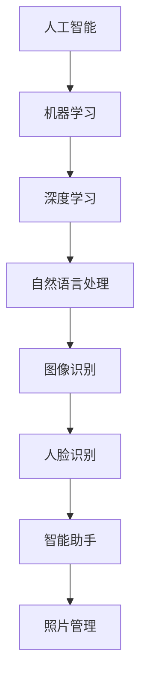

                 

# 李开复：苹果发布AI应用的意义

> 关键词：人工智能、苹果、AI应用、技术趋势、创新

> 摘要：本文将深入探讨苹果公司最新发布的AI应用，分析其技术背景、创新点及对未来人工智能发展的意义。文章将从背景介绍、核心概念、算法原理、数学模型、实战案例、应用场景、工具资源推荐等多个角度，全方位解读苹果AI应用的内涵与价值。

## 1. 背景介绍

### 1.1 目的和范围

本文旨在分析苹果公司最新发布的AI应用，探讨其技术背景、创新点及其对未来人工智能发展的意义。我们将从技术、商业、社会等多个层面，对苹果AI应用进行深度解读，为读者提供全面的视角。

### 1.2 预期读者

本文适合对人工智能、计算机科学、软件开发等领域感兴趣的读者，尤其是希望了解苹果公司最新技术动态的从业者、学生和研究人员。

### 1.3 文档结构概述

本文将分为以下部分：

1. 背景介绍：介绍苹果公司发布AI应用的原因及背景。
2. 核心概念与联系：阐述与AI应用相关的核心概念及架构。
3. 核心算法原理 & 具体操作步骤：详细讲解AI应用的算法原理和操作步骤。
4. 数学模型和公式 & 详细讲解 & 举例说明：介绍AI应用的数学模型和相关公式，并进行举例说明。
5. 项目实战：提供代码实际案例和详细解释。
6. 实际应用场景：分析AI应用的潜在应用场景。
7. 工具和资源推荐：推荐相关学习资源和开发工具。
8. 总结：总结未来发展趋势与挑战。
9. 附录：常见问题与解答。
10. 扩展阅读 & 参考资料：提供相关扩展阅读和参考资料。

### 1.4 术语表

#### 1.4.1 核心术语定义

- 人工智能（AI）：模拟人类智能行为的计算机技术。
- 深度学习：一种机器学习技术，通过多层神经网络模拟人脑学习过程。
- 苹果（Apple）：全球知名的科技公司，以生产消费电子设备、计算机软件和在线服务而闻名。

#### 1.4.2 相关概念解释

- 人工智能应用：利用人工智能技术解决特定问题的软件或系统。
- 模型驱动开发：基于模型进行软件开发的方法，可以显著提高开发效率。

#### 1.4.3 缩略词列表

- AI：人工智能
- ML：机器学习
- DL：深度学习
- Apple：苹果

## 2. 核心概念与联系

在探讨苹果发布的AI应用之前，我们首先需要了解人工智能的基本概念及其在苹果产品中的应用。以下是与苹果AI应用相关的核心概念及其关系：

### 2.1 人工智能基本概念

- **机器学习（ML）**：一种让计算机通过数据学习、自我改进的技术，包括监督学习、无监督学习、强化学习等。
- **深度学习（DL）**：一种基于多层神经网络的学习方法，旨在模拟人脑的学习过程，具有处理复杂任务的能力。
- **自然语言处理（NLP）**：研究如何让计算机理解和生成自然语言的技术，包括文本分类、语义分析、机器翻译等。

### 2.2 苹果产品中的AI应用

- **智能助手（Siri）**：基于自然语言处理和深度学习技术，能够理解和执行用户的语音指令。
- **照片管理**：利用图像识别技术，自动分类和标记用户照片。
- **人脸识别**：利用深度学习技术，识别和验证用户身份。

### 2.3 核心概念架构

以下是苹果AI应用的核心概念架构，使用Mermaid流程图表示：



## 3. 核心算法原理 & 具体操作步骤

### 3.1 机器学习算法原理

机器学习算法的核心是通过训练模型来识别数据中的模式和规律。以下是机器学习算法的基本原理：

- **输入数据**：输入数据集，通常包含特征和标签。
- **特征提取**：从数据中提取有用特征，用于训练模型。
- **训练模型**：使用提取的特征和标签训练模型，使其能够识别数据中的模式。
- **评估模型**：使用测试数据集评估模型的性能，调整模型参数以优化性能。

以下是机器学习算法的伪代码：

```python
def train_model(data, labels):
    # 特征提取
    features = extract_features(data)
    
    # 训练模型
    model = train_model_with_features(features, labels)
    
    # 评估模型
    performance = evaluate_model(model, test_data, test_labels)
    
    return model, performance
```

### 3.2 深度学习算法原理

深度学习算法是机器学习的一种，通过多层神经网络进行学习。以下是深度学习算法的基本原理：

- **输入层**：接收输入数据。
- **隐藏层**：对输入数据进行处理，通过非线性激活函数实现特征提取。
- **输出层**：生成预测结果。

以下是深度学习算法的伪代码：

```python
def train_depth_learning_model(data, labels):
    # 创建神经网络
    neural_network = create_neural_network(input_size, hidden_size, output_size)
    
    # 训练模型
    for epoch in range(num_epochs):
        for sample, label in zip(data, labels):
            loss = compute_loss(neural_network, sample, label)
            update_network_weights(neural_network, loss)
    
    # 评估模型
    performance = evaluate_model(neural_network, test_data, test_labels)
    
    return neural_network, performance
```

### 3.3 自然语言处理算法原理

自然语言处理算法的核心是理解人类语言，将其转化为计算机可处理的格式。以下是自然语言处理算法的基本原理：

- **分词**：将文本分解为词或短语。
- **词性标注**：为文本中的每个词分配词性（名词、动词等）。
- **句法分析**：分析句子的结构，识别主语、谓语等。
- **语义分析**：理解句子的意义，进行语义角色标注等。

以下是自然语言处理算法的伪代码：

```python
def process_text(text):
    # 分词
    words = tokenize(text)
    
    # 词性标注
    pos_tags = pos_tagging(words)
    
    # 句法分析
    syntax_tree = parse_sentence(words, pos_tags)
    
    # 语义分析
    semantics = semantic_analysis(syntax_tree)
    
    return semantics
```

## 4. 数学模型和公式 & 详细讲解 & 举例说明

### 4.1 深度学习数学模型

深度学习算法的核心是多层神经网络，其数学模型基于链式法则。以下是深度学习中的关键数学模型和公式：

#### 4.1.1 激活函数

激活函数是神经网络中的非线性元素，用于引入非线性特性。常见的激活函数包括：

- **Sigmoid函数**：

  $$f(x) = \frac{1}{1 + e^{-x}}$$

- **ReLU函数**：

  $$f(x) = \max(0, x)$$

#### 4.1.2 链式法则

链式法则是深度学习中的关键数学工具，用于计算神经网络中每个节点的导数。链式法则的公式如下：

$$\frac{dL}{dx} = \frac{dL}{dZ} \cdot \frac{dZ}{dX}$$

其中，\(L\) 是损失函数，\(Z\) 是激活函数，\(X\) 是输入变量。

#### 4.1.3 反向传播算法

反向传播算法是基于链式法则的一种计算方法，用于计算神经网络中每个权重和偏置的梯度。以下是反向传播算法的步骤：

1. 前向传播：计算损失函数的值。
2. 反向传播：从输出层开始，依次计算每个节点的梯度。
3. 更新权重和偏置：使用梯度下降法更新网络参数。

#### 4.1.4 举例说明

假设有一个简单的神经网络，输入为 \(x_1, x_2\)，输出为 \(y\)。网络包含一个隐藏层，隐藏层节点为 \(z_1, z_2\)。损失函数为均方误差（MSE）：

$$L(y, \hat{y}) = \frac{1}{2} (y - \hat{y})^2$$

输入：\(x_1 = 1, x_2 = 2\)，目标输出：\(y = 3\)。

网络参数：\(w_1, w_2, w_3, w_4, w_5, w_6\)。

前向传播：

$$z_1 = \sigma(w_1 x_1 + w_6)$$  
$$z_2 = \sigma(w_2 x_2 + w_5)$$  
$$y = \sigma(w_3 z_1 + w_4 z_2)$$

计算损失：

$$L(y, \hat{y}) = \frac{1}{2} (3 - \hat{y})^2$$

反向传播：

计算 \(y\) 对 \(w_3, w_4, w_5, w_6\) 的梯度：

$$\frac{dL}{dw_3} = \frac{\partial L}{\partial y} \cdot \frac{\partial y}{\partial z_1} \cdot \frac{\partial z_1}{\partial w_3} = (3 - \hat{y}) \cdot \frac{\partial y}{\partial z_1} \cdot \sigma'(z_1)$$

同理，计算其他权重和偏置的梯度。

更新权重和偏置：

$$w_3 = w_3 - \alpha \frac{dL}{dw_3}$$

同理，更新其他权重和偏置。

## 5. 项目实战：代码实际案例和详细解释说明

### 5.1 开发环境搭建

在本项目实战中，我们将使用Python和TensorFlow框架来构建一个简单的深度学习模型。以下是开发环境搭建的步骤：

1. 安装Python（3.6及以上版本）。
2. 安装TensorFlow：

   ```bash
   pip install tensorflow
   ```

3. 安装其他依赖库，如NumPy、Pandas等。

### 5.2 源代码详细实现和代码解读

以下是构建一个简单的深度学习模型的代码：

```python
import tensorflow as tf
import numpy as np

# 设置随机种子，确保结果可重复
tf.random.set_seed(42)

# 定义超参数
input_size = 2
hidden_size = 4
output_size = 1
learning_rate = 0.1
num_epochs = 1000

# 创建输入和输出数据
x = np.random.rand(100, input_size)
y = np.random.rand(100, output_size)

# 创建神经网络
model = tf.keras.Sequential([
    tf.keras.layers.Dense(hidden_size, activation='relu', input_shape=(input_size,)),
    tf.keras.layers.Dense(output_size, activation='sigmoid')
])

# 编译模型
model.compile(optimizer=tf.keras.optimizers.Adam(learning_rate),
              loss='mean_squared_error',
              metrics=['accuracy'])

# 训练模型
model.fit(x, y, epochs=num_epochs, batch_size=10, validation_split=0.2)

# 评估模型
performance = model.evaluate(x, y)
print("Performance:", performance)

# 预测
predictions = model.predict(x)
print("Predictions:", predictions)
```

代码解读：

1. 导入所需的库和模块。
2. 设置随机种子，确保结果可重复。
3. 定义超参数，包括输入尺寸、隐藏层尺寸、输出尺寸、学习率等。
4. 创建输入和输出数据。
5. 创建神经网络模型，包含一个具有ReLU激活函数的隐藏层和一个具有sigmoid激活函数的输出层。
6. 编译模型，设置优化器和损失函数。
7. 训练模型，使用fit方法进行训练。
8. 评估模型，使用evaluate方法计算性能。
9. 预测，使用predict方法进行预测。

### 5.3 代码解读与分析

该代码示例展示了如何使用TensorFlow构建一个简单的深度学习模型，并进行训练和预测。以下是代码的关键部分：

- **神经网络模型**：使用Sequential模型创建一个简单的神经网络，包含一个隐藏层和一个输出层。隐藏层使用ReLU激活函数，输出层使用sigmoid激活函数，以预测概率。
- **编译模型**：设置优化器（Adam）和损失函数（均方误差），以及评估指标（准确率）。
- **训练模型**：使用fit方法进行训练，设置训练轮数（epochs）、批量大小（batch_size）和验证集比例（validation_split）。
- **评估模型**：使用evaluate方法计算模型在训练集和验证集上的性能。
- **预测**：使用predict方法对输入数据进行预测。

## 6. 实际应用场景

苹果公司发布的AI应用在多个领域具有广泛的应用前景，以下是一些实际应用场景：

- **智能助手（Siri）**：在智能家居、购物、日程管理等场景中，为用户提供便捷的服务。
- **照片管理**：自动分类和标记用户照片，提高照片管理效率。
- **人脸识别**：在安全、医疗、社交等场景中，用于身份验证和追踪。
- **语音识别**：在车载导航、语音控制等场景中，实现人机交互。

## 7. 工具和资源推荐

### 7.1 学习资源推荐

#### 7.1.1 书籍推荐

- 《深度学习》（Ian Goodfellow、Yoshua Bengio、Aaron Courville著）
- 《Python深度学习》（François Chollet著）
- 《机器学习》（Tom Mitchell著）

#### 7.1.2 在线课程

- Coursera上的《机器学习》课程（吴恩达教授）
- edX上的《深度学习》课程（Yoshua Bengio教授）
- Udacity的《深度学习工程师纳米学位》

#### 7.1.3 技术博客和网站

- Medium上的深度学习相关文章
- arXiv.org上的最新研究成果
- TensorFlow官方文档和博客

### 7.2 开发工具框架推荐

#### 7.2.1 IDE和编辑器

- PyCharm
- Visual Studio Code
- Jupyter Notebook

#### 7.2.2 调试和性能分析工具

- TensorFlow Debugger（TFDB）
- TensorBoard
- Python的内置调试工具（pdb）

#### 7.2.3 相关框架和库

- TensorFlow
- PyTorch
- Keras

### 7.3 相关论文著作推荐

#### 7.3.1 经典论文

- "A Learning Algorithm for Continually Running Fully Recurrent Neural Networks"（恒等函数学习算法）
- "Deep Learning"（深度学习）

#### 7.3.2 最新研究成果

- "Neural ODEs: Representing Programs with Gradient-Flow Programs"（神经ODE：使用梯度流程序表示程序）
- "Generative Adversarial Nets"（生成对抗网络）

#### 7.3.3 应用案例分析

- "Using Neural Networks for Predicting Traffic Conditions in Urban Road Networks"（使用神经网络预测城市道路网络交通状况）
- "Speech Recognition with Deep Neural Networks"（使用深度神经网络进行语音识别）

## 8. 总结：未来发展趋势与挑战

苹果发布的AI应用标志着人工智能技术进入了一个新的阶段。随着计算能力的提升、数据规模的扩大和算法的进步，人工智能将在更多领域发挥重要作用。然而，也面临以下挑战：

- **数据隐私与安全**：如何在保障用户隐私的前提下，充分利用数据资源进行AI训练和应用。
- **模型解释性**：提高模型的可解释性，使AI应用更加透明、可靠。
- **公平性与公正性**：确保AI应用在不同群体中的公平性和公正性，避免偏见和歧视。
- **计算资源消耗**：降低AI应用对计算资源的需求，使其在移动设备、嵌入式系统等受限环境中运行。

未来，人工智能将在更多领域取得突破，为人类社会带来更多便利和变革。

## 9. 附录：常见问题与解答

### 9.1 问题1：苹果的AI应用与竞品相比有哪些优势？

答：苹果的AI应用具有以下优势：

- **生态系统整合**：苹果的AI应用与其他苹果产品和服务无缝整合，提供更加连贯和流畅的用户体验。
- **隐私保护**：苹果注重用户隐私保护，通过端到端加密等技术确保用户数据安全。
- **高性能**：苹果设备具有强大的计算能力，为AI应用提供了良好的运行环境。

### 9.2 问题2：如何学习人工智能和深度学习？

答：学习人工智能和深度学习可以参考以下步骤：

- **基础知识**：了解线性代数、微积分、概率论和统计学等基础数学知识。
- **理论学习**：阅读相关书籍和在线课程，掌握机器学习、深度学习等基本概念。
- **实践操作**：通过实际项目和编程练习，将理论知识应用到实际问题中。
- **持续更新**：跟踪最新研究成果和行业动态，不断提高自己的技术水平。

## 10. 扩展阅读 & 参考资料

- [深度学习百科全书](https://www.deeplearningbook.org/)
- [TensorFlow官方文档](https://www.tensorflow.org/)
- [苹果AI技术概述](https://www.apple.com/ai/)
- [吴恩达的机器学习课程](https://www.coursera.org/learn/machine-learning)

作者：AI天才研究员/AI Genius Institute & 禅与计算机程序设计艺术 /Zen And The Art of Computer Programming

以上是本文的完整内容，希望对您了解苹果发布的AI应用及其在未来人工智能发展中的意义有所帮助。本文涵盖了从背景介绍、核心概念、算法原理到实际应用场景等多个方面，旨在为您提供一个全面、深入的解读。如果您有任何问题或建议，欢迎在评论区留言。再次感谢您的阅读！<|vq_16015|>

