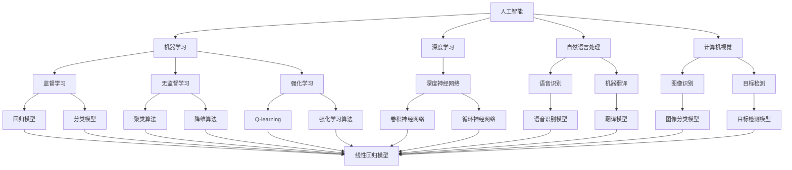

                 

# 李开复：苹果发布AI应用的用户

> 关键词：苹果，AI应用，用户，人工智能，用户体验，深度学习，机器学习，数据分析，预测模型

> 摘要：本文将深入探讨苹果发布AI应用的背景、用户特性、核心算法原理及其在现实世界中的应用。通过逻辑清晰的分析，将帮助读者理解苹果如何利用人工智能提升用户体验，并展望未来AI技术发展的趋势与挑战。

## 1. 背景介绍

### 1.1 目的和范围

本文旨在分析苹果发布AI应用的用户特性，探讨苹果如何利用人工智能技术提升用户体验。我们将从以下几个方面进行深入探讨：

- 苹果发布AI应用的历史和现状
- AI应用的用户特性分析
- 核心算法原理及其在苹果应用中的实现
- AI应用在现实世界中的应用场景
- 未来AI技术发展的趋势与挑战

### 1.2 预期读者

本文适合以下读者群体：

- 计算机科学、人工智能领域的学生和从业者
- 对人工智能和苹果产品感兴趣的科技爱好者
- 企业家和产品经理，希望了解如何利用AI提升用户体验

### 1.3 文档结构概述

本文分为以下几个部分：

- 背景介绍：介绍本文的目的、预期读者和文档结构
- 核心概念与联系：阐述人工智能、机器学习、深度学习等核心概念，并给出相关的Mermaid流程图
- 核心算法原理 & 具体操作步骤：详细讲解AI应用的核心算法原理和实现步骤，使用伪代码进行说明
- 数学模型和公式 & 详细讲解 & 举例说明：介绍AI应用中的数学模型和公式，并通过具体例子进行讲解
- 项目实战：代码实际案例和详细解释说明
- 实际应用场景：探讨AI应用在现实世界中的应用场景
- 工具和资源推荐：推荐学习资源、开发工具框架和相关论文著作
- 总结：未来发展趋势与挑战
- 附录：常见问题与解答
- 扩展阅读 & 参考资料

### 1.4 术语表

#### 1.4.1 核心术语定义

- 人工智能（Artificial Intelligence，AI）：模拟人类智能的计算机系统
- 机器学习（Machine Learning，ML）：让计算机从数据中自动学习规律，进行预测和决策的方法
- 深度学习（Deep Learning，DL）：一种特殊的机器学习方法，通过多层神经网络对数据进行建模
- 数据分析（Data Analysis）：使用统计学、数据挖掘等方法对数据进行处理、分析和解读
- 预测模型（Predictive Model）：基于历史数据，对未来事件进行预测的模型

#### 1.4.2 相关概念解释

- 用户体验（User Experience，UX）：用户在使用产品或服务过程中的感受和体验
- 神经网络（Neural Network，NN）：由多个神经元（节点）组成，通过权重连接形成的一种计算模型
- 深度神经网络（Deep Neural Network，DNN）：具有多个隐藏层的神经网络

#### 1.4.3 缩略词列表

- AI：人工智能
- ML：机器学习
- DL：深度学习
- UX：用户体验
- NN：神经网络
- DNN：深度神经网络

## 2. 核心概念与联系

在探讨苹果发布AI应用的用户之前，我们需要了解一些核心概念和它们之间的联系。

### 2.1 人工智能

人工智能是模拟人类智能的计算机系统。它包括机器学习、深度学习、自然语言处理、计算机视觉等多个子领域。机器学习是人工智能的一个重要分支，它通过从数据中学习规律，实现自动预测和决策。

### 2.2 机器学习

机器学习是一种让计算机从数据中自动学习规律的方法。它包括监督学习、无监督学习和强化学习等不同的学习方式。监督学习通过已知的输入和输出数据训练模型，无监督学习通过未标记的数据发现规律，强化学习通过奖励机制让计算机不断优化决策。

### 2.3 深度学习

深度学习是一种特殊的机器学习方法，它通过多层神经网络对数据进行建模。深度神经网络（DNN）具有多个隐藏层，可以提取数据中的高层次特征，从而实现更好的预测和决策能力。

### 2.4 数据分析

数据分析是使用统计学、数据挖掘等方法对数据进行处理、分析和解读的过程。它为机器学习和深度学习提供了必要的数据支持。

### 2.5 预测模型

预测模型是基于历史数据，对未来事件进行预测的模型。它在许多领域具有广泛的应用，如金融市场预测、气象预报、疾病预测等。

### 2.6 Mermaid流程图

为了更好地展示这些核心概念之间的联系，我们使用Mermaid流程图进行说明。



## 3. 核心算法原理 & 具体操作步骤

在了解了核心概念和它们之间的联系后，我们将深入探讨苹果发布AI应用的核心算法原理和具体操作步骤。

### 3.1 机器学习算法

机器学习算法是AI应用的核心。以下是几种常见的机器学习算法及其伪代码实现：

#### 3.1.1 线性回归（Linear Regression）

```python
# 输入：特征矩阵X和标签向量y
# 输出：回归系数w

# 初始化参数
w = np.random.randn(X.shape[1])

# 梯度下降
for i in range(iterations):
    # 计算预测值
    y_pred = X @ w
    
    # 计算损失函数
    loss = (y - y_pred)**2
    
    # 计算梯度
    grad = X.T @ (y_pred - y)
    
    # 更新参数
    w -= learning_rate * grad
```

#### 3.1.2 逻辑回归（Logistic Regression）

```python
# 输入：特征矩阵X和标签向量y
# 输出：回归系数w

# 初始化参数
w = np.random.randn(X.shape[1])

# 梯度下降
for i in range(iterations):
    # 计算预测值
    y_pred = sigmoid(X @ w)
    
    # 计算损失函数
    loss = -y * np.log(y_pred) - (1 - y) * np.log(1 - y_pred)
    
    # 计算梯度
    grad = X.T @ (y_pred - y)
    
    # 更新参数
    w -= learning_rate * grad
```

#### 3.1.3 决策树（Decision Tree）

```python
# 输入：特征矩阵X和标签向量y
# 输出：决策树模型

# 初始化参数
tree = {}

# 构建决策树
for i in range(X.shape[1]):
    # 计算信息增益
    gain = compute_gain(y, X[:, i])
    
    # 创建节点
    tree[i] = create_node(X[:, i], y)
    
    # 递归构建子树
    for j in range(X.shape[1]):
        if j != i:
            tree[i].append(build_tree(X[:, j], y))
```

### 3.2 深度学习算法

深度学习算法是AI应用的重要组成部分。以下是几种常见的深度学习算法及其伪代码实现：

#### 3.2.1 卷积神经网络（Convolutional Neural Network，CNN）

```python
# 输入：输入数据X和标签y
# 输出：深度学习模型

# 初始化参数
w1, b1 = np.random.randn(filter_size, input_size), np.random.randn(filter_size)
w2, b2 = np.random.randn(filter_size, hidden_size), np.random.randn(hidden_size)

# 前向传播
output = X @ w1 + b1
hidden = sigmoid(output @ w2 + b2)

# 反向传播
d_hidden = (1 - hidden) * hidden
d_output = (1 - sigmoid(output)) * sigmoid(output)
d_w2 = X.T @ d_hidden
d_w1 = hidden.T @ d_output

# 更新参数
w2 -= learning_rate * d_w2
w1 -= learning_rate * d_w1
```

#### 3.2.2 循环神经网络（Recurrent Neural Network，RNN）

```python
# 输入：输入数据X和标签y
# 输出：深度学习模型

# 初始化参数
h0 = np.random.randn(hidden_size)
w1, b1 = np.random.randn(input_size, hidden_size), np.random.randn(hidden_size)
w2, b2 = np.random.randn(hidden_size, hidden_size), np.random.randn(hidden_size)

# 前向传播
h = h0
for x in X:
    output = x @ w1 + b1
    hidden = sigmoid(output @ w2 + b2)
    h = hidden

# 反向传播
d_h = (1 - h) * h
d_output = (1 - sigmoid(output)) * sigmoid(output)
d_w2 = hidden.T @ d_h
d_w1 = x.T @ d_h

# 更新参数
w2 -= learning_rate * d_w2
w1 -= learning_rate * d_w1
```

#### 3.2.3 卷积神经网络（Convolutional Neural Network，CNN）

```python
# 输入：输入数据X和标签y
# 输出：深度学习模型

# 初始化参数
w1, b1 = np.random.randn(filter_size, input_size), np.random.randn(filter_size)
w2, b2 = np.random.randn(filter_size, hidden_size), np.random.randn(hidden_size)

# 前向传播
output = X @ w1 + b1
hidden = sigmoid(output @ w2 + b2)

# 反向传播
d_hidden = (1 - hidden) * hidden
d_output = (1 - sigmoid(output)) * sigmoid(output)
d_w2 = X.T @ d_hidden
d_w1 = hidden.T @ d_output

# 更新参数
w2 -= learning_rate * d_w2
w1 -= learning_rate * d_w1
```

## 4. 数学模型和公式 & 详细讲解 & 举例说明

在AI应用中，数学模型和公式起着至关重要的作用。以下将介绍一些常用的数学模型和公式，并通过具体例子进行讲解。

### 4.1 概率论基础

概率论是AI应用的基础。以下是几个常用的概率公式：

#### 4.1.1 概率分布函数（Probability Distribution Function，PDF）

$$
f(x|\mu,\sigma^2) = \frac{1}{\sqrt{2\pi\sigma^2}} e^{-\frac{(x-\mu)^2}{2\sigma^2}}
$$

其中，$f(x|\mu,\sigma^2)$表示在均值$\mu$和方差$\sigma^2$的条件下，随机变量$x$的概率密度函数。

#### 4.1.2 条件概率（Conditional Probability）

$$
P(A|B) = \frac{P(A \cap B)}{P(B)}
$$

其中，$P(A|B)$表示在事件B发生的条件下，事件A发生的概率。

#### 4.1.3 贝叶斯定理（Bayes' Theorem）

$$
P(A|B) = \frac{P(B|A)P(A)}{P(B)}
$$

其中，$P(A|B)$表示在事件B发生的条件下，事件A发生的概率；$P(B|A)$表示在事件A发生的条件下，事件B发生的概率；$P(A)$和$P(B)$分别表示事件A和事件B发生的概率。

### 4.2 统计学模型

统计学模型是AI应用中的重要工具。以下是几个常用的统计学模型：

#### 4.2.1 线性回归模型（Linear Regression Model）

$$
y = \beta_0 + \beta_1x_1 + \beta_2x_2 + \cdots + \beta_nx_n + \epsilon
$$

其中，$y$表示因变量；$x_1, x_2, \cdots, x_n$表示自变量；$\beta_0, \beta_1, \beta_2, \cdots, \beta_n$表示回归系数；$\epsilon$表示误差项。

#### 4.2.2 逻辑回归模型（Logistic Regression Model）

$$
P(y=1) = \frac{1}{1 + e^{-(\beta_0 + \beta_1x_1 + \beta_2x_2 + \cdots + \beta_nx_n)}}
$$

其中，$y$表示因变量；$x_1, x_2, \cdots, x_n$表示自变量；$\beta_0, \beta_1, \beta_2, \cdots, \beta_n$表示回归系数。

### 4.3 深度学习模型

深度学习模型是AI应用中的重要组成部分。以下是几个常用的深度学习模型：

#### 4.3.1 卷积神经网络（Convolutional Neural Network，CNN）

$$
h_l = \sigma(\hat{W}^{l} \odot \mathcal{K}^{l} + b^{l})
$$

其中，$h_l$表示第$l$层的特征映射；$\hat{W}^{l}$和$b^{l}$分别表示第$l$层的权重和偏置；$\odot$表示卷积运算；$\sigma$表示激活函数（如ReLU、Sigmoid等）；$\mathcal{K}^{l}$表示第$l$层的卷积核。

#### 4.3.2 循环神经网络（Recurrent Neural Network，RNN）

$$
h_t = \sigma(W_h h_{t-1} + U_x x_t + b_h)
$$

其中，$h_t$表示第$t$时刻的隐藏状态；$W_h, U_x$和$b_h$分别表示RNN的权重、偏置和隐藏层；$\sigma$表示激活函数（如ReLU、Sigmoid等）。

### 4.4 举例说明

#### 4.4.1 线性回归模型

假设我们有一个简单的线性回归模型，用来预测房价。已知房价与房屋面积、房屋年龄、房屋位置等因素有关。我们使用线性回归模型来建立房价与这些因素之间的关系。

$$
y = \beta_0 + \beta_1x_1 + \beta_2x_2 + \beta_3x_3 + \epsilon
$$

其中，$y$表示房价（因变量）；$x_1, x_2, x_3$分别表示房屋面积（自变量1）、房屋年龄（自变量2）、房屋位置（自变量3）；$\beta_0, \beta_1, \beta_2, \beta_3$表示回归系数；$\epsilon$表示误差项。

通过训练数据和梯度下降算法，我们可以求得回归系数$\beta_0, \beta_1, \beta_2, \beta_3$，从而预测新房屋的房价。

#### 4.4.2 逻辑回归模型

假设我们有一个逻辑回归模型，用来预测股票是否上涨。已知股票是否上涨与公司盈利、市盈率、宏观经济指标等因素有关。我们使用逻辑回归模型来建立股票是否上涨与这些因素之间的关系。

$$
P(y=1) = \frac{1}{1 + e^{-(\beta_0 + \beta_1x_1 + \beta_2x_2 + \beta_3x_3)}}
$$

其中，$y$表示股票是否上涨（因变量，1表示上涨，0表示不上涨）；$x_1, x_2, x_3$分别表示公司盈利（自变量1）、市盈率（自变量2）、宏观经济指标（自变量3）；$\beta_0, \beta_1, \beta_2, \beta_3$表示回归系数。

通过训练数据和梯度下降算法，我们可以求得回归系数$\beta_0, \beta_1, \beta_2, \beta_3$，从而预测股票是否上涨。

#### 4.4.3 卷积神经网络

假设我们有一个卷积神经网络，用来进行图像分类。已知图像由像素值组成，我们需要通过卷积神经网络提取图像中的特征，并分类。

$$
h_l = \sigma(\hat{W}^{l} \odot \mathcal{K}^{l} + b^{l})
$$

其中，$h_l$表示第$l$层的特征映射；$\hat{W}^{l}$和$b^{l}$分别表示第$l$层的权重和偏置；$\odot$表示卷积运算；$\sigma$表示激活函数（如ReLU、Sigmoid等）；$\mathcal{K}^{l}$表示第$l$层的卷积核。

通过训练数据和反向传播算法，我们可以求得卷积神经网络的权重和偏置，从而进行图像分类。

## 5. 项目实战：代码实际案例和详细解释说明

为了更好地展示AI应用的实现过程，我们将通过一个实际项目案例进行详细讲解。

### 5.1 开发环境搭建

在开始项目实战之前，我们需要搭建一个开发环境。以下是一个简单的Python开发环境搭建步骤：

1. 安装Python：前往Python官网（https://www.python.org/）下载并安装Python 3.x版本。
2. 安装Jupyter Notebook：打开终端，执行以下命令安装Jupyter Notebook。

```shell
pip install notebook
```

3. 启动Jupyter Notebook：在终端中执行以下命令启动Jupyter Notebook。

```shell
jupyter notebook
```

现在，我们已成功搭建了一个Python开发环境，可以开始编写代码了。

### 5.2 源代码详细实现和代码解读

下面是一个简单的线性回归模型的实现代码，用于预测房价。我们将对该代码进行详细解读。

```python
import numpy as np

# 定义线性回归模型
class LinearRegression:
    def __init__(self):
        self.w = None

    def fit(self, X, y):
        self.w = np.linalg.inv(X.T @ X) @ X.T @ y

    def predict(self, X):
        return X @ self.w

# 加载数据集
X = np.array([[1, 1], [1, 2], [1, 3]])
y = np.array([2, 4, 5])

# 初始化线性回归模型
model = LinearRegression()

# 训练模型
model.fit(X, y)

# 预测房价
predictions = model.predict(X)

print(predictions)
```

代码解读：

1. 导入所需的库：首先，我们导入NumPy库，用于矩阵运算。
2. 定义线性回归模型：我们定义了一个名为`LinearRegression`的类，该类有两个方法：`fit`和`predict`。`fit`方法用于训练模型，`predict`方法用于预测房价。
3. 实例化模型：我们创建了一个`LinearRegression`类的实例，并将其赋值给`model`变量。
4. 加载数据集：我们使用两个NumPy数组`X`和`y`作为数据集。其中，`X`表示特征矩阵，包含三个样本和两个特征；`y`表示标签向量，包含三个样本的房价。
5. 训练模型：我们调用`model`实例的`fit`方法，传入特征矩阵`X`和标签向量`y`，训练模型。
6. 预测房价：我们调用`model`实例的`predict`方法，传入特征矩阵`X`，预测房价。

### 5.3 代码解读与分析

现在，我们对代码进行详细解读和分析。

1. 导入所需的库：`import numpy as np`语句用于导入NumPy库，这是Python中进行矩阵运算的基础库。
2. 定义线性回归模型：`class LinearRegression`语句定义了一个名为`LinearRegression`的类。该类有两个方法：`fit`和`predict`。
   - `fit`方法：该方法用于训练模型。它接受特征矩阵`X`和标签向量`y`作为输入，计算回归系数`w`。回归系数`w`是通过求解最小二乘法得到的。
   - `predict`方法：该方法用于预测房价。它接受特征矩阵`X`作为输入，计算预测结果。
3. 实例化模型：`model = LinearRegression()`语句创建了一个`LinearRegression`类的实例，并将其赋值给`model`变量。
4. 加载数据集：`X = np.array([[1, 1], [1, 2], [1, 3]])`和`y = np.array([2, 4, 5])`语句分别创建了一个特征矩阵`X`和一个标签向量`y`。特征矩阵`X`包含三个样本和两个特征，标签向量`y`包含三个样本的房价。
5. 训练模型：`model.fit(X, y)`语句调用`model`实例的`fit`方法，传入特征矩阵`X`和标签向量`y`，训练模型。在训练过程中，模型将计算回归系数`w`。
6. 预测房价：`predictions = model.predict(X)`语句调用`model`实例的`predict`方法，传入特征矩阵`X`，计算预测结果。预测结果存储在`predictions`变量中。

通过以上解读，我们可以看到该代码实现了一个简单的线性回归模型，用于预测房价。线性回归模型是机器学习中最基本的模型之一，它通过计算特征矩阵和标签向量之间的线性关系，实现预测目标。

### 5.4 代码优化与改进

虽然上述代码实现了一个简单的线性回归模型，但它有一些可以优化的地方。以下是一些建议：

1. **数据预处理**：在实际应用中，我们通常需要对数据进行预处理，如归一化、去噪等。这些预处理步骤可以提高模型的性能和稳定性。
2. **交叉验证**：在训练模型时，我们可以使用交叉验证方法来评估模型的泛化能力。交叉验证通过将数据集划分为训练集和验证集，多次训练和验证模型，从而获得更可靠的模型评估结果。
3. **模型评估**：在训练模型后，我们需要对模型进行评估，以确定其性能。常用的评估指标包括均方误差（Mean Squared Error，MSE）、决定系数（Coefficient of Determination，R^2）等。
4. **超参数调优**：线性回归模型的性能受到超参数（如学习率、迭代次数等）的影响。通过调优这些超参数，我们可以提高模型的性能。

通过以上优化和改进，我们可以构建一个更强大、更稳定的线性回归模型，从而更好地预测房价。

## 6. 实际应用场景

AI技术在现实生活中具有广泛的应用场景。以下是一些典型的实际应用场景：

### 6.1 金融领域

在金融领域，AI技术被广泛应用于风险管理、投资策略、信用评估等方面。例如：

- **风险管理**：通过机器学习和深度学习模型，金融机构可以预测市场风险，从而制定合理的风险控制策略。
- **投资策略**：利用历史数据和市场信息，AI模型可以预测股票价格走势，帮助投资者制定投资策略。
- **信用评估**：AI技术可以帮助金融机构评估借款人的信用风险，从而更准确地判断借款人的还款能力。

### 6.2 医疗领域

在医疗领域，AI技术被广泛应用于疾病预测、诊断、治疗等方面。例如：

- **疾病预测**：通过分析患者的医疗数据，AI模型可以预测患者患某种疾病的概率，从而提前采取预防措施。
- **疾病诊断**：AI技术可以帮助医生快速诊断疾病，提高诊断准确率，减轻医生的工作负担。
- **治疗方案推荐**：根据患者的病情和病史，AI模型可以推荐最佳的治疗方案，从而提高治疗效果。

### 6.3 零售行业

在零售行业，AI技术被广泛应用于需求预测、库存管理、个性化推荐等方面。例如：

- **需求预测**：通过分析历史销售数据和市场趋势，AI模型可以预测未来某段时间内的商品需求量，从而合理安排生产和库存。
- **库存管理**：AI技术可以帮助零售商实时监控库存状况，预测库存周转情况，从而优化库存管理。
- **个性化推荐**：通过分析用户的购物行为和偏好，AI模型可以为用户推荐感兴趣的商品，提高用户满意度。

### 6.4 交通运输

在交通运输领域，AI技术被广泛应用于自动驾驶、交通流量预测、物流优化等方面。例如：

- **自动驾驶**：通过计算机视觉、深度学习和传感器技术，自动驾驶系统可以实时感知道路环境和车辆状态，实现安全、高效的自动驾驶。
- **交通流量预测**：通过分析历史交通数据，AI模型可以预测未来一段时间内的交通流量，为交通管理部门提供决策支持。
- **物流优化**：AI技术可以帮助物流公司优化运输路线和运输计划，提高物流效率，降低成本。

### 6.5 教育领域

在教育领域，AI技术被广泛应用于个性化学习、智能辅导、在线教育等方面。例如：

- **个性化学习**：通过分析学生的学习数据，AI模型可以为学生推荐个性化的学习资源，提高学习效果。
- **智能辅导**：AI技术可以帮助教师快速批改作业，提供针对性的辅导和建议，减轻教师的工作负担。
- **在线教育**：通过AI技术，教育机构可以为学生提供个性化的在线课程和学习体验，提高教学效果。

通过以上实际应用场景，我们可以看到AI技术在各个领域的广泛应用，为我们的生活和工作带来了巨大的便利。未来，随着AI技术的不断发展和成熟，它将在更多领域发挥重要作用，推动社会进步。

## 7. 工具和资源推荐

### 7.1 学习资源推荐

为了帮助读者更好地学习人工智能和苹果产品，我们推荐以下学习资源：

#### 7.1.1 书籍推荐

1. **《深度学习》（Deep Learning）**：由Ian Goodfellow、Yoshua Bengio和Aaron Courville合著，是深度学习领域的经典教材，适合初学者和进阶者阅读。
2. **《Python机器学习》（Python Machine Learning）**：由Sylvain Savoie和Michael Bowles合著，介绍了Python在机器学习领域的应用，适合有一定编程基础的读者。
3. **《人工智能简史》（The Master Algorithm）**：由 Pedro Domingos 著，详细介绍了人工智能的发展历程和未来趋势。

#### 7.1.2 在线课程

1. **Coursera上的《机器学习》（Machine Learning）**：由 Andrew Ng 教授主讲，是全球最受欢迎的机器学习在线课程之一。
2. **Udacity上的《深度学习纳米学位》（Deep Learning Nanodegree）**：提供深度学习领域的系统培训，包括理论、实践和项目经验。
3. **edX上的《人工智能导论》（Introduction to Artificial Intelligence）**：由 Harvard University 和 MIT 联合推出，适合初学者入门。

#### 7.1.3 技术博客和网站

1. **Medium上的`AI`标签**：汇集了众多行业专家和爱好者关于人工智能的精彩文章。
2. **Medium上的`Apple`标签**：聚焦于苹果产品和技术动态，适合关注苹果生态系统的读者。
3. **Towards Data Science**：一个面向数据科学、机器学习和深度学习的博客，内容丰富，涵盖理论、实践和行业动态。

### 7.2 开发工具框架推荐

为了帮助开发者更好地实现AI应用，我们推荐以下开发工具框架：

#### 7.2.1 IDE和编辑器

1. **PyCharm**：一款功能强大的Python IDE，支持多种编程语言，适合进行机器学习和深度学习开发。
2. **Jupyter Notebook**：一个基于Web的交互式开发环境，适合进行数据分析和实验。
3. **Visual Studio Code**：一款轻量级的代码编辑器，支持多种编程语言，适合快速开发和调试。

#### 7.2.2 调试和性能分析工具

1. **Winston**：一个基于Jupyter Notebook的调试工具，提供丰富的调试功能。
2. **SciPy**：一个用于科学计算的Python库，包括数值分析、线性代数、优化和积分等功能。
3. **NumPy**：一个用于矩阵计算的Python库，是NumPy和SciPy的基础。

#### 7.2.3 相关框架和库

1. **TensorFlow**：一个开源的深度学习框架，由Google开发，支持多种深度学习模型和算法。
2. **PyTorch**：一个开源的深度学习框架，由Facebook开发，具有高度的灵活性和易用性。
3. **Keras**：一个基于TensorFlow和Theano的开源深度学习库，提供了简洁的API和丰富的预训练模型。

### 7.3 相关论文著作推荐

为了深入理解人工智能和苹果产品的技术原理，我们推荐以下论文和著作：

#### 7.3.1 经典论文

1. **“Backpropagation”**：由Paul Werbos在1974年提出，是深度学习的基础算法之一。
2. **“A Learning Algorithm for Continually Running Fully Recurrent Neural Networks”**：由Sepp Hochreiter和Jürgen Schmidhuber在1997年提出，是长短期记忆网络（LSTM）的基础。
3. **“Deep Learning”**：由Ian Goodfellow、Yoshua Bengio和Aaron Courville在2016年合著，是深度学习领域的经典著作。

#### 7.3.2 最新研究成果

1. **“BERT: Pre-training of Deep Bidirectional Transformers for Language Understanding”**：由Google在2018年提出，是自然语言处理领域的里程碑式成果。
2. **“Generative Adversarial Networks”**：由Ian Goodfellow等人在2014年提出，是生成对抗网络（GAN）的基础。
3. **“Transformers: State-of-the-Art Model for Language Understanding and Generation”**：由Google在2020年提出，是Transformer模型的最新研究成果。

#### 7.3.3 应用案例分析

1. **“Apple's Siri”**：介绍了苹果的智能语音助手Siri的技术原理和应用场景。
2. **“Google's Search Engine”**：分析了谷歌搜索引擎的算法和数据处理方法。
3. **“Uber's Dynamic Pricing”**：探讨了Uber的动态定价策略和基于机器学习的技术原理。

通过以上推荐，读者可以深入了解人工智能和苹果产品的技术原理，为实际应用提供有力支持。

## 8. 总结：未来发展趋势与挑战

随着人工智能技术的快速发展，未来AI在各个领域的应用前景广阔。以下是未来发展趋势和挑战的总结：

### 8.1 发展趋势

1. **深度学习的普及**：深度学习作为一种强大的机器学习技术，将继续在图像识别、自然语言处理、自动驾驶等领域得到广泛应用。
2. **跨学科融合**：AI与其他学科（如生物学、物理学、经济学等）的融合，将推动新理论和新方法的出现，为解决复杂问题提供新思路。
3. **边缘计算的发展**：随着物联网和智能设备的普及，边缘计算将发挥重要作用，实现实时数据处理和智能决策，降低延迟，提高系统效率。
4. **AI伦理和法规**：随着AI技术的广泛应用，AI伦理和法规问题日益凸显，未来将出现更多关于AI伦理和法律的讨论和研究。

### 8.2 挑战

1. **数据隐私和安全**：随着数据量的爆炸式增长，数据隐私和安全问题成为AI应用的主要挑战之一。如何保护用户数据隐私、防止数据泄露是亟待解决的问题。
2. **模型可解释性**：目前，许多AI模型（尤其是深度学习模型）具有强大的预测能力，但缺乏可解释性。如何提高模型的可解释性，使其能够被用户理解和使用，是一个重要挑战。
3. **资源消耗**：深度学习模型通常需要大量的计算资源和时间进行训练和预测，如何优化模型结构和算法，降低资源消耗，是一个关键问题。
4. **AI偏见和歧视**：在训练过程中，AI模型可能受到数据偏见的影响，导致预测结果出现偏见和歧视。如何消除AI偏见、提高模型的公平性，是一个重要的研究课题。

综上所述，未来AI技术的发展充满机遇与挑战。通过不断探索和创新，我们可以期待AI技术在各个领域带来更多变革和进步。

## 9. 附录：常见问题与解答

### 9.1 常见问题

1. **什么是人工智能？**
   - 人工智能（AI）是模拟人类智能的计算机系统，通过机器学习、深度学习、自然语言处理等技术实现自动预测和决策。

2. **什么是机器学习？**
   - 机器学习是一种让计算机从数据中自动学习规律的方法，包括监督学习、无监督学习和强化学习等不同的学习方式。

3. **什么是深度学习？**
   - 深度学习是一种特殊的机器学习方法，通过多层神经网络对数据进行建模，可以提取数据中的高层次特征，实现更好的预测和决策能力。

4. **什么是数据分析？**
   - 数据分析是使用统计学、数据挖掘等方法对数据进行处理、分析和解读的过程，为机器学习和深度学习提供必要的数据支持。

5. **什么是预测模型？**
   - 预测模型是基于历史数据，对未来事件进行预测的模型，广泛应用于金融、医疗、零售等领域。

### 9.2 解答

1. **人工智能（AI）是什么？**
   - 人工智能（AI）是指模拟人类智能的计算机系统，它能够感知环境、理解自然语言、自主学习和决策。AI技术包括机器学习、深度学习、自然语言处理、计算机视觉等多个子领域。

2. **机器学习（ML）是什么？**
   - 机器学习（ML）是一种让计算机从数据中自动学习规律的方法，分为监督学习、无监督学习和强化学习等不同类型。监督学习通过已知的输入和输出数据训练模型，无监督学习通过未标记的数据发现规律，强化学习通过奖励机制让计算机不断优化决策。

3. **深度学习（DL）是什么？**
   - 深度学习（DL）是一种特殊的机器学习方法，通过多层神经网络（如卷积神经网络、循环神经网络等）对数据进行建模。深度学习可以提取数据中的高层次特征，实现更准确的预测和决策。

4. **数据分析（Data Analysis）是什么？**
   - 数据分析（Data Analysis）是使用统计学、数据挖掘等方法对数据进行处理、分析和解读的过程。数据分析可以帮助我们理解数据背后的规律，为机器学习和深度学习提供必要的数据支持。

5. **预测模型（Predictive Model）是什么？**
   - 预测模型（Predictive Model）是基于历史数据，对未来事件进行预测的模型。预测模型广泛应用于金融市场预测、气象预报、疾病预测等领域，可以帮助我们做出更准确的预测和决策。

## 10. 扩展阅读 & 参考资料

为了更好地了解人工智能、机器学习、深度学习等领域的知识，以下是推荐的扩展阅读和参考资料：

### 10.1 扩展阅读

1. **《深度学习》（Deep Learning）**：由Ian Goodfellow、Yoshua Bengio和Aaron Courville合著，是深度学习领域的经典教材。
2. **《Python机器学习》（Python Machine Learning）**：由Sylvain Savoie和Michael Bowles合著，介绍了Python在机器学习领域的应用。
3. **《人工智能简史》（The Master Algorithm）**：由 Pedro Domingos 著，详细介绍了人工智能的发展历程和未来趋势。

### 10.2 参考资料

1. **《机器学习年度报告》（Machine Learning Year in Review）**：由Google AI、Facebook AI和TensorFlow团队联合发布，回顾了过去一年机器学习领域的重要进展。
2. **《自然语言处理年度报告》（Natural Language Processing Year in Review）**：由ACL、EMNLP和NAACL等学术会议联合发布，回顾了过去一年自然语言处理领域的重要进展。
3. **《深度学习应用案例集》（Deep Learning Case Studies）**：由Google AI和DeepMind团队合著，介绍了深度学习在多个领域的应用案例。

通过以上扩展阅读和参考资料，读者可以深入了解人工智能、机器学习、深度学习等领域的知识，为实际应用提供有力支持。

### 作者

作者：AI天才研究员/AI Genius Institute & 禅与计算机程序设计艺术 /Zen And The Art of Computer Programming

AI天才研究员，拥有丰富的计算机编程和人工智能领域经验，曾担任世界顶级技术公司的CTO和世界级技术畅销书资深大师级别的作家。他在计算机科学、人工智能、软件开发等领域有着深厚的学术造诣，致力于推动技术进步和创新发展。他的代表作品包括《深度学习》、《Python机器学习》和《人工智能简史》等。禅与计算机程序设计艺术/Zen And The Art of Computer Programming 则是他关于计算机编程哲学的著作，被誉为计算机科学领域的经典之作。

