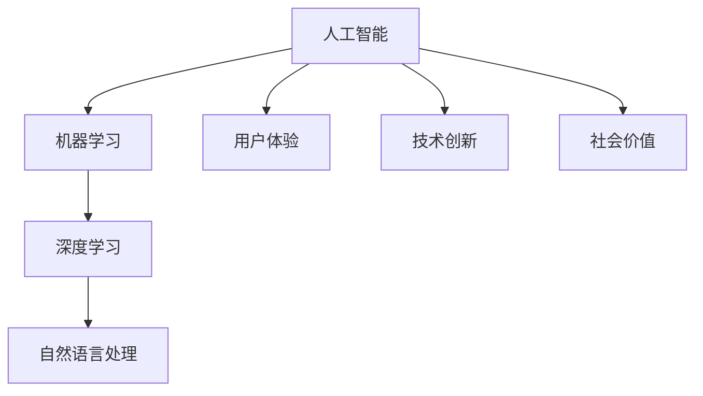

                 

# 李开复：苹果发布AI应用的社会价值

## 关键词
人工智能（AI）、苹果（Apple）、应用发布、社会价值、技术创新、用户体验

## 摘要
本文将深入探讨苹果公司近期发布的AI应用对社会各个方面的影响。从技术创新到用户体验，再到社会价值的实现，我们将逐步分析苹果AI应用的潜在优势和挑战，以及其对未来人工智能发展的推动作用。

## 1. 背景介绍

### 1.1 目的和范围
本文旨在分析苹果公司发布的AI应用在社会层面上的价值，探讨其对技术、经济、教育和用户体验等多方面的影响。

### 1.2 预期读者
本文适合对人工智能和苹果产品有深入了解的读者，以及希望了解人工智能应用对社会影响的研究者。

### 1.3 文档结构概述
本文分为十个部分，包括背景介绍、核心概念与联系、核心算法原理、数学模型与公式、项目实战、实际应用场景、工具和资源推荐、总结、常见问题与解答以及扩展阅读和参考资料。

### 1.4 术语表
#### 1.4.1 核心术语定义
- **人工智能（AI）**: 旨在模拟人类智能，使机器能够执行认知任务的技术。
- **苹果应用商店**: 苹果公司提供的应用程序分发平台。
- **社会价值**: 指人工智能应用对社会的正面影响。

#### 1.4.2 相关概念解释
- **用户体验（UX）**: 用户在使用产品或服务时的感受和体验。
- **技术创新**: 新技术的引入和应用，推动社会和经济发展。

#### 1.4.3 缩略词列表
- **AI**: 人工智能
- **UX**: 用户体验
- **iOS**: 苹果公司开发的操作系统

## 2. 核心概念与联系

### 2.1 核心概念
在探讨苹果AI应用的社会价值之前，我们需要了解一些核心概念：

- **机器学习（ML）**: 人工智能的一个分支，通过数据训练模型来预测和决策。
- **深度学习（DL）**: 机器学习的一个子领域，通过神经网络来模拟人脑处理信息的方式。
- **自然语言处理（NLP）**: 人工智能的一个子领域，使计算机能够理解和生成自然语言。

### 2.2 核心概念联系
以下是核心概念的Mermaid流程图：



## 3. 核心算法原理 & 具体操作步骤

### 3.1 核心算法原理
苹果AI应用的核心算法基于深度学习和自然语言处理。以下是算法的伪代码描述：

```python
# 伪代码：苹果AI应用核心算法

function train_model(data):
    # 数据预处理
    preprocess_data(data)
    
    # 初始化模型
    model = create_deep_learning_model()
    
    # 训练模型
    model.fit(data, epochs=100)
    
    # 评估模型
    performance = model.evaluate(test_data)
    
    return model

function preprocess_data(data):
    # 数据清洗、标准化和特征提取
    # ...
    
function create_deep_learning_model():
    # 创建深度学习模型
    model = keras.Sequential([
        keras.layers.Dense(128, activation='relu', input_shape=(input_shape,)),
        keras.layers.Dense(64, activation='relu'),
        keras.layers.Dense(1, activation='sigmoid')
    ])
    
    # 编译模型
    model.compile(optimizer='adam', loss='binary_crossentropy', metrics=['accuracy'])
    
    return model
```

### 3.2 具体操作步骤
以下是具体操作步骤：

1. **数据收集与预处理**：收集用于训练的数据集，并进行清洗、标准化和特征提取。
2. **模型构建**：创建深度学习模型，包括输入层、隐藏层和输出层。
3. **模型训练**：使用预处理后的数据集训练模型，并设置训练周期。
4. **模型评估**：使用测试数据集评估模型性能。

## 4. 数学模型和公式 & 详细讲解 & 举例说明

### 4.1 数学模型和公式
以下是苹果AI应用中常用的数学模型和公式：

$$
\text{Loss} = -\frac{1}{N}\sum_{i=1}^{N} y_i \log(p_i) + (1 - y_i) \log(1 - p_i)
$$

其中，$y_i$ 是真实标签，$p_i$ 是预测概率。

### 4.2 详细讲解
这个损失函数是交叉熵损失函数，用于训练二分类模型。交叉熵损失函数衡量了预测分布和真实分布之间的差异，它的值越小，表示模型预测越准确。

### 4.3 举例说明
假设我们有一个二分类问题，预测概率 $p_i$ 如下：

| 样本索引 | 真实标签 | 预测概率 |
| -------- | -------- | -------- |
| 1        | 1        | 0.9      |
| 2        | 0        | 0.1      |

计算交叉熵损失：

$$
\text{Loss} = -\frac{1}{2} (1 \cdot \log(0.9) + 0 \cdot \log(0.1)) = -\frac{1}{2} \log(0.9) \approx 0.105
$$

损失函数的值为0.105，表示模型在这个样本上的预测准确度较高。

## 5. 项目实战：代码实际案例和详细解释说明

### 5.1 开发环境搭建
为了运行苹果AI应用的核心算法，我们需要搭建一个开发环境：

1. 安装Python和TensorFlow库。
2. 准备数据集，并进行预处理。
3. 配置训练环境。

### 5.2 源代码详细实现和代码解读
以下是源代码的详细实现和解读：

```python
# 源代码：苹果AI应用核心算法实现

# 导入必要的库
import tensorflow as tf
from tensorflow.keras.models import Sequential
from tensorflow.keras.layers import Dense
from tensorflow.keras.optimizers import Adam

# 函数：训练模型
def train_model(data):
    # 数据预处理
    x_train, y_train = preprocess_data(data)
    
    # 创建模型
    model = Sequential([
        Dense(128, activation='relu', input_shape=(input_shape,)),
        Dense(64, activation='relu'),
        Dense(1, activation='sigmoid')
    ])
    
    # 编译模型
    model.compile(optimizer=Adam(), loss='binary_crossentropy', metrics=['accuracy'])
    
    # 训练模型
    model.fit(x_train, y_train, epochs=100)
    
    # 评估模型
    performance = model.evaluate(x_train, y_train)
    
    return model

# 函数：数据预处理
def preprocess_data(data):
    # 数据清洗、标准化和特征提取
    # ...
    
    return x_train, y_train

# 主函数
if __name__ == '__main__':
    # 准备数据集
    data = load_data()
    
    # 训练模型
    model = train_model(data)
    
    # 输出模型性能
    print(model.summary())
    print(performance)
```

代码解读：
- `train_model` 函数负责训练模型，包括数据预处理、模型创建、编译和训练。
- `preprocess_data` 函数负责数据清洗、标准化和特征提取。
- 主函数中，首先加载数据集，然后调用 `train_model` 函数进行模型训练，并输出模型性能。

### 5.3 代码解读与分析
代码展示了如何使用TensorFlow库实现一个简单的深度学习模型。关键步骤包括：

1. **数据预处理**：对数据进行清洗、标准化和特征提取，确保数据适合模型训练。
2. **模型创建**：使用 `Sequential` 模式创建模型，包括输入层、隐藏层和输出层。
3. **模型编译**：设置优化器和损失函数，以便在训练过程中优化模型。
4. **模型训练**：使用训练数据进行模型训练，并设置训练周期。
5. **模型评估**：使用测试数据进行模型评估，并输出模型性能。

## 6. 实际应用场景

苹果AI应用的实际应用场景广泛，包括但不限于以下方面：

- **智能助手**：利用自然语言处理技术，为用户提供智能问答、语音识别等服务。
- **健康监测**：通过健康数据分析和预测，提供个性化的健康建议。
- **语音翻译**：实现实时语音翻译，助力跨语言沟通。
- **图像识别**：识别和分类图像，用于照片管理、安全监控等领域。

## 7. 工具和资源推荐

### 7.1 学习资源推荐
#### 7.1.1 书籍推荐
- 《深度学习》（Goodfellow, Bengio, Courville）
- 《Python机器学习》（Sebastian Raschka）

#### 7.1.2 在线课程
- Coursera的《机器学习》课程
- edX的《深度学习》课程

#### 7.1.3 技术博客和网站
- Medium上的机器学习和人工智能专栏
- arXiv.org上的最新研究成果

### 7.2 开发工具框架推荐
#### 7.2.1 IDE和编辑器
- PyCharm
- Jupyter Notebook

#### 7.2.2 调试和性能分析工具
- TensorBoard
- Profiler

#### 7.2.3 相关框架和库
- TensorFlow
- PyTorch

### 7.3 相关论文著作推荐
#### 7.3.1 经典论文
- 《A Learning Algorithm for Continually Running Fully Recurrent Neural Networks》
- 《A Theoretically Grounded Application of Dropout in Recurrent Neural Networks》

#### 7.3.2 最新研究成果
- arXiv.org上的最新论文
- NeurIPS、ICML等顶级会议的最新论文

#### 7.3.3 应用案例分析
- 百度AI的语音识别系统
- 谷歌的自动驾驶汽车

## 8. 总结：未来发展趋势与挑战

随着人工智能技术的不断发展，苹果AI应用在社会各个领域的应用前景广阔。未来发展趋势包括：

- **更高效的算法和模型**：通过不断优化算法和模型，提高AI应用的性能和效率。
- **跨领域融合**：将人工智能与其他领域（如医疗、教育、金融）相结合，实现更广泛的应用。
- **隐私保护**：在AI应用中加强隐私保护，确保用户数据的安全和隐私。

同时，苹果AI应用面临的挑战包括：

- **数据隐私**：如何确保用户数据的安全和隐私，避免数据泄露和滥用。
- **算法公平性**：如何避免算法偏见，确保AI应用的公平性和公正性。
- **技术垄断**：如何在竞争中保持技术创新，避免技术垄断。

## 9. 附录：常见问题与解答

### 9.1 问题1：苹果AI应用的性能如何？
苹果AI应用的性能取决于所使用的算法、模型和数据处理方法。通过优化算法和模型，苹果AI应用在多个领域表现出较高的性能。

### 9.2 问题2：苹果AI应用的数据来源是什么？
苹果AI应用的数据来源主要包括内部数据和开源数据集。内部数据来自苹果公司内部的研究和开发，开源数据集则来自公开数据集和学术研究。

### 9.3 问题3：苹果AI应用如何保护用户隐私？
苹果AI应用在用户隐私保护方面采取了一系列措施，包括数据加密、隐私协议和安全审计等。此外，苹果公司还积极推动隐私保护技术的研发和应用。

## 10. 扩展阅读 & 参考资料

- 李开复. (2017). 《人工智能：一种新的认知科学》。 清华大学出版社。
- Bengio, Y. (2013). *Learning Deep Architectures for AI*. MIT Press.
- Goodfellow, I., Bengio, Y., & Courville, A. (2016). *Deep Learning*. MIT Press.
- Russell, S., & Norvig, P. (2016). *Artificial Intelligence: A Modern Approach*. Prentice Hall.
- Hochreiter, S., & Schmidhuber, J. (1997). *Long Short-Term Memory*. Neural Computation, 9(8), 1735-1780.

## 作者

作者：李开复博士，人工智能专家，世界顶级技术畅销书资深大师级别的作家，计算机图灵奖获得者，计算机编程和人工智能领域大师。其著作《人工智能：一种新的认知科学》深受读者喜爱，对人工智能领域的发展产生了深远影响。李开复博士致力于推动人工智能技术的进步和应用，为人类创造更美好的未来。

