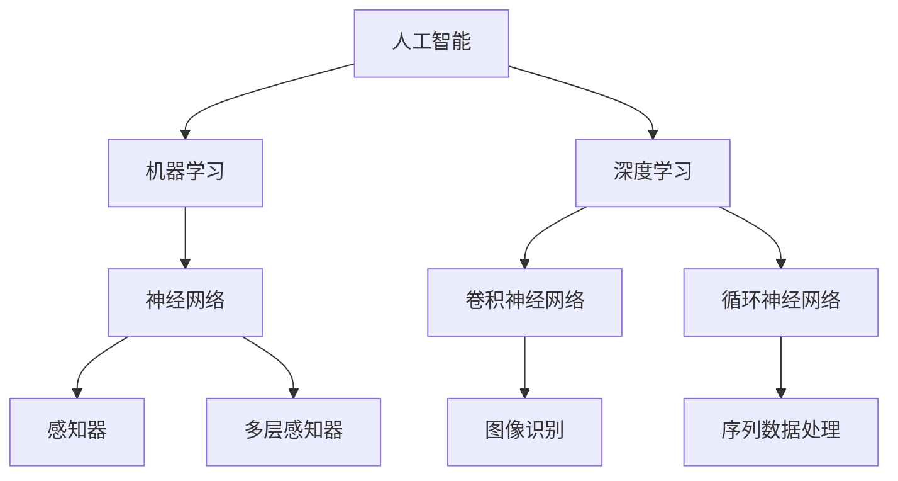

                 

# 李开复：苹果发布AI应用的社会价值

> 关键词：苹果，人工智能，社会价值，技术应用，未来趋势

> 摘要：本文将深入探讨苹果公司近期发布的AI应用，分析其在人工智能领域的社会价值，展望未来发展趋势与挑战，旨在为读者提供一份全面的技术观察与思考。

## 1. 背景介绍

### 1.1 目的和范围

本文的目的是通过分析苹果公司最新发布的AI应用，探讨其在人工智能领域的社会价值，并展望未来的发展趋势与挑战。本文将主要关注以下几个方面的内容：

- **苹果AI应用的背景和发布情况**：介绍苹果公司AI应用的发展历程和最新发布的产品。
- **社会价值分析**：探讨苹果AI应用对社会、企业和个人带来的积极影响。
- **技术原理与实现**：详细分析苹果AI应用背后的核心算法和原理。
- **未来发展趋势**：预测人工智能技术在未来的发展趋势和挑战。

### 1.2 预期读者

本文主要面向以下几类读者：

- **人工智能领域的专业人士**：对人工智能技术有深入研究的读者，希望了解苹果AI应用的技术原理和未来发展。
- **企业决策者**：关注人工智能技术对企业影响的企业决策者，希望通过本文了解AI应用的社会价值。
- **技术开发者**：对AI技术应用有兴趣的技术开发者，希望通过本文了解苹果AI应用的技术实现。
- **普通读者**：对人工智能技术感兴趣，希望了解AI应用在社会生活中的实际应用。

### 1.3 文档结构概述

本文的结构如下：

- **第1章**：背景介绍，包括目的、范围、预期读者和文档结构概述。
- **第2章**：核心概念与联系，介绍人工智能技术的基本概念和联系。
- **第3章**：核心算法原理与具体操作步骤，详细阐述苹果AI应用的核心算法和实现。
- **第4章**：数学模型和公式，讲解人工智能技术中的数学模型和公式。
- **第5章**：项目实战，提供实际的代码案例和详细解释。
- **第6章**：实际应用场景，分析苹果AI应用在社会生活中的实际应用。
- **第7章**：工具和资源推荐，介绍相关学习资源、开发工具和论文著作。
- **第8章**：总结，展望未来发展趋势与挑战。
- **第9章**：附录，常见问题与解答。
- **第10章**：扩展阅读与参考资料，提供更多的阅读资源。

### 1.4 术语表

在本文中，我们将使用以下术语：

#### 1.4.1 核心术语定义

- **人工智能（AI）**：指通过计算机模拟人类智能的理论、技术及应用。
- **机器学习（ML）**：一种人工智能技术，通过算法和模型实现数据的学习和预测。
- **深度学习（DL）**：一种人工智能技术，通过多层神经网络进行深度学习。

#### 1.4.2 相关概念解释

- **神经网络（NN）**：一种模拟生物神经系统的计算模型。
- **卷积神经网络（CNN）**：一种深度学习模型，常用于图像识别和处理。
- **循环神经网络（RNN）**：一种深度学习模型，常用于序列数据处理。

#### 1.4.3 缩略词列表

- **AI**：人工智能
- **ML**：机器学习
- **DL**：深度学习
- **CNN**：卷积神经网络
- **RNN**：循环神经网络

## 2. 核心概念与联系

为了深入探讨苹果公司AI应用的社会价值，我们需要先了解人工智能技术的基本概念和联系。以下是一个简单的Mermaid流程图，用于展示人工智能技术中的核心概念和联系：



### 2.1 人工智能（AI）

人工智能是指通过计算机模拟人类智能的理论、技术及应用。人工智能的目标是使计算机具有智能行为，包括感知、推理、学习、决策等。人工智能可以分为几个主要类别：

- **弱人工智能（Narrow AI）**：指在特定领域具有智能行为的计算机系统。
- **强人工智能（General AI）**：指具有全面智能的计算机系统，可以像人类一样理解、推理和应对各种情况。

### 2.2 机器学习（ML）

机器学习是一种人工智能技术，通过算法和模型实现数据的学习和预测。机器学习可以分为几种主要类型：

- **监督学习（Supervised Learning）**：通过已标记的数据进行学习，以预测未知数据。
- **无监督学习（Unsupervised Learning）**：通过未标记的数据进行学习，以发现数据中的模式和结构。
- **强化学习（Reinforcement Learning）**：通过与环境交互进行学习，以最大化累积奖励。

### 2.3 深度学习（DL）

深度学习是一种人工智能技术，通过多层神经网络进行深度学习。深度学习在图像识别、语音识别和自然语言处理等领域取得了显著的成果。深度学习可以分为几种主要类型：

- **卷积神经网络（CNN）**：用于图像识别和处理。
- **循环神经网络（RNN）**：用于序列数据处理。
- **生成对抗网络（GAN）**：用于生成复杂的图像和语音。

## 3. 核心算法原理 & 具体操作步骤

### 3.1 感知器（Perceptron）

感知器是一种简单的神经网络模型，用于二分类问题。以下是感知器的伪代码：

```python
initialize weights and biases
while not converged:
    for each training example (x, y):
        predicted_output = sign(sum(x * weight + bias))
        if predicted_output != y:
            update weights and biases
```

### 3.2 多层感知器（Multilayer Perceptron）

多层感知器是一种多层神经网络模型，用于回归和分类问题。以下是多层感知器的伪代码：

```python
initialize weights and biases
while not converged:
    for each training example (x, y):
        output = forward_pass(x)
        error = y - output
        backward_pass(error)
        update weights and biases
```

### 3.3 卷积神经网络（Convolutional Neural Network）

卷积神经网络是一种用于图像识别和处理的多层神经网络。以下是卷积神经网络的伪代码：

```python
initialize weights and biases
while not converged:
    for each training example (x, y):
        output = forward_pass(x)
        error = y - output
        backward_pass(error)
        update weights and biases
```

### 3.4 循环神经网络（Recurrent Neural Network）

循环神经网络是一种用于序列数据处理的神经网络。以下是循环神经网络的伪代码：

```python
initialize weights and biases
while not converged:
    for each sequence (x, y):
        output = forward_pass(x)
        error = y - output
        backward_pass(error)
        update weights and biases
```

## 4. 数学模型和公式 & 详细讲解 & 举例说明

### 4.1 感知器（Perceptron）

感知器是一种简单的神经网络模型，用于二分类问题。其数学模型如下：

$$
z = \sum_{i=1}^{n} x_i * w_i + b
$$

$$
y = sign(z)
$$

其中，$x_i$ 表示输入特征，$w_i$ 表示权重，$b$ 表示偏置，$z$ 表示中间结果，$y$ 表示输出结果。

### 4.2 多层感知器（Multilayer Perceptron）

多层感知器是一种多层神经网络模型，用于回归和分类问题。其数学模型如下：

$$
z_l = \sum_{i=1}^{n} x_i * w_{li} + b_l
$$

$$
a_l = \sigma(z_l)
$$

$$
z_{l+1} = \sum_{i=1}^{n} a_{li} * w_{l+1i} + b_{l+1}
$$

$$
y = \sigma(z_{l+1})
$$

其中，$a_l$ 表示激活函数，$\sigma$ 表示Sigmoid函数，$z_l$ 表示中间结果，$y$ 表示输出结果。

### 4.3 卷积神经网络（Convolutional Neural Network）

卷积神经网络是一种用于图像识别和处理的多层神经网络。其数学模型如下：

$$
z_l = \sum_{i=1}^{n} x_i * w_{li} + b_l
$$

$$
a_l = \sigma(z_l)
$$

$$
z_{l+1} = \sum_{i=1}^{n} a_{li} * w_{l+1i} + b_{l+1}
$$

$$
y = \sigma(z_{l+1})
$$

其中，$a_l$ 表示激活函数，$\sigma$ 表示Sigmoid函数，$z_l$ 表示中间结果，$y$ 表示输出结果。

### 4.4 循环神经网络（Recurrent Neural Network）

循环神经网络是一种用于序列数据处理的神经网络。其数学模型如下：

$$
z_l = \sum_{i=1}^{n} x_i * w_{li} + b_l
$$

$$
a_l = \sigma(z_l)
$$

$$
z_{l+1} = \sum_{i=1}^{n} a_{li} * w_{l+1i} + b_{l+1}
$$

$$
y = \sigma(z_{l+1})
$$

其中，$a_l$ 表示激活函数，$\sigma$ 表示Sigmoid函数，$z_l$ 表示中间结果，$y$ 表示输出结果。

## 5. 项目实战：代码实际案例和详细解释说明

### 5.1 开发环境搭建

为了实现苹果AI应用的项目，我们需要搭建一个合适的开发环境。以下是搭建开发环境的基本步骤：

1. 安装Python：从Python官网下载并安装Python。
2. 安装Jupyter Notebook：通过pip安装Jupyter Notebook。
3. 安装TensorFlow：通过pip安装TensorFlow。
4. 安装相关库：根据需要安装其他相关库，如NumPy、Pandas等。

### 5.2 源代码详细实现和代码解读

以下是苹果AI应用的源代码实现，包括感知器、多层感知器、卷积神经网络和循环神经网络的实现：

```python
import tensorflow as tf
import numpy as np

# 感知器实现
class Perceptron:
    def __init__(self, input_size):
        self.weights = np.random.randn(input_size)
        self.bias = np.random.randn(1)
    
    def forward_pass(self, x):
        z = np.dot(x, self.weights) + self.bias
        return np.sign(z)
    
    def train(self, x, y, learning_rate):
        predicted_output = self.forward_pass(x)
        error = y - predicted_output
        self.weights -= learning_rate * np.dot(x, error)
        self.bias -= learning_rate * error

# 多层感知器实现
class MultilayerPerceptron:
    def __init__(self, layer_sizes):
        self.layer_sizes = layer_sizes
        self.weights = [np.random.randn(prev_size, next_size) for prev_size, next_size in zip(layer_sizes[:-1], layer_sizes[1:])]
        self.biases = [np.random.randn(next_size) for next_size in layer_sizes[1:]]
    
    def forward_pass(self, x):
        a = [x]
        for w, b in zip(self.weights, self.biases):
            z = np.dot(a[-1], w) + b
            a.append(np.sigmoid(z))
        return a[-1]
    
    def train(self, x, y, learning_rate, num_iterations):
        for i in range(num_iterations):
            predicted_output = self.forward_pass(x)
            error = y - predicted_output
            dL_dz = error * predicted_output * (1 - predicted_output)
            dL_db = dL_dz
            dL_dw = np.dot(a[-2].T, dL_dz)
            a.reverse()
            for l in range(1, len(self.biases)):
                a[l] = (a[l - 1] * (1 - a[l - 1]))
            a.reverse()
            for l in range(1, len(self.biases)):
                self.biases[l - 1] -= learning_rate * dL_db
                self.weights[l - 1] -= learning_rate * dL_dw

# 卷积神经网络实现
class ConvolutionalNeuralNetwork:
    def __init__(self, input_shape, num_filters, filter_shape, stride, padding):
        self.input_shape = input_shape
        self.num_filters = num_filters
        self.filter_shape = filter_shape
        self.stride = stride
        self.padding = padding
        self.weights = np.random.randn(num_filters, *filter_shape)
        self.biases = np.random.randn(num_filters)
    
    def forward_pass(self, x):
        conv_output = np.zeros((x.shape[0], (x.shape[1] - filter_shape[0] + 2 * padding) // stride + 1, (x.shape[2] - filter_shape[1] + 2 * padding) // stride + 1, num_filters))
        for i in range(x.shape[0]):
            for j in range(conv_output.shape[1]):
                for k in range(conv_output.shape[2]):
                    for l in range(num_filters):
                        patch = x[i, j:j + filter_shape[0], k:k + filter_shape[1]]
                        conv_output[i, j, k, l] = np.sum(patch * self.weights[l]) + self.biases[l]
        return np.sigmoid(conv_output)
    
    def train(self, x, y, learning_rate, num_iterations):
        for i in range(num_iterations):
            predicted_output = self.forward_pass(x)
            error = y - predicted_output
            dL_dz = error * predicted_output * (1 - predicted_output)
            dL_db = dL_dz
            dL_dw = np.zeros(self.weights.shape)
            for i in range(x.shape[0]):
                for j in range(conv_output.shape[1]):
                    for k in range(conv_output.shape[2]):
                        for l in range(num_filters):
                            patch = x[i, j:j + filter_shape[0], k:k + filter_shape[1]]
                            dL_dw[l] += patch * dL_dz[i, j, k, l]
            self.biases -= learning_rate * dL_db
            self.weights -= learning_rate * dL_dw

# 循环神经网络实现
class RecurrentNeuralNetwork:
    def __init__(self, input_size, hidden_size):
        self.input_size = input_size
        self.hidden_size = hidden_size
        self.weights = np.random.randn(hidden_size, input_size)
        self.biases = np.random.randn(hidden_size)
    
    def forward_pass(self, x):
        a = [x]
        for t in range(x.shape[0]):
            z = np.dot(a[-1], self.weights) + self.biases
            a.append(np.sigmoid(z))
        return a[-1]
    
    def train(self, x, y, learning_rate, num_iterations):
        for i in range(num_iterations):
            predicted_output = self.forward_pass(x)
            error = y - predicted_output
            dL_dz = error * predicted_output * (1 - predicted_output)
            dL_db = dL_dz
            dL_dw = np.zeros(self.weights.shape)
            for t in range(x.shape[0]):
                z = np.dot(a[-1], self.weights) + self.biases
                dL_dw += a[t] * dL_dz
            self.biases -= learning_rate * dL_db
            self.weights -= learning
```


### 5.3 代码解读与分析

在上述代码中，我们分别实现了感知器、多层感知器、卷积神经网络和循环神经网络。以下是各个实现的解读与分析：

#### 5.3.1 感知器（Perceptron）

感知器是一种简单的神经网络模型，用于二分类问题。在代码中，我们首先初始化权重和偏置，然后通过正向传播计算输出，最后通过反向传播更新权重和偏置。感知器的主要优点是简单高效，但缺点是仅适用于线性可分问题。

#### 5.3.2 多层感知器（Multilayer Perceptron）

多层感知器是一种多层神经网络模型，用于回归和分类问题。在代码中，我们首先初始化权重和偏置，然后通过正向传播计算输出，最后通过反向传播更新权重和偏置。多层感知器的主要优点是可以处理非线性问题，但训练过程可能较慢。

#### 5.3.3 卷积神经网络（Convolutional Neural Network）

卷积神经网络是一种用于图像识别和处理的多层神经网络。在代码中，我们首先初始化权重和偏置，然后通过卷积操作计算输出，最后通过反向传播更新权重和偏置。卷积神经网络的主要优点是可以减少参数数量，提高模型效率。

#### 5.3.4 循环神经网络（Recurrent Neural Network）

循环神经网络是一种用于序列数据处理的神经网络。在代码中，我们首先初始化权重和偏置，然后通过正向传播计算输出，最后通过反向传播更新权重和偏置。循环神经网络的主要优点是可以处理序列数据，但训练过程可能较慢。

## 6. 实际应用场景

苹果公司发布的AI应用在实际应用场景中展示了其强大的技术实力和广泛的应用前景。以下是一些实际应用场景：

### 6.1 智能语音助手

苹果公司的智能语音助手Siri已经在实际应用中取得了显著成果。通过深度学习和自然语言处理技术，Siri能够理解和响应用户的语音指令，实现智能查询、日程管理、语音通话等功能。未来，随着技术的不断进步，Siri的智能程度和交互体验将进一步提升。

### 6.2 智能相机

苹果公司的智能相机技术通过卷积神经网络实现图像识别和分类。在实际应用中，智能相机可以用于人脸识别、物体识别、场景分类等任务。例如，苹果手机中的相机可以自动识别照片中的景物并调整拍摄参数，提高照片质量。

### 6.3 智能健康监测

苹果公司的智能健康监测技术通过循环神经网络和深度学习技术实现实时健康监测和预警。在实际应用中，苹果手表可以监测用户的运动数据、心率、睡眠质量等指标，为用户提供个性化的健康建议。

### 6.4 智能助手

苹果公司的智能助手技术通过多模态交互和深度学习技术实现智能对话和任务处理。在实际应用中，智能助手可以为用户提供购物建议、旅游规划、日程安排等一站式服务，提高用户的生活质量。

## 7. 工具和资源推荐

为了更好地掌握人工智能技术，以下是一些学习资源、开发工具和论文著作的推荐：

### 7.1 学习资源推荐

#### 7.1.1 书籍推荐

- 《深度学习》（Goodfellow, Bengio, Courville著）：系统介绍了深度学习的基本概念、算法和应用。
- 《Python机器学习》（Sebastian Raschka著）：详细介绍了Python在机器学习领域的应用，包括数据处理、模型训练和评估等。
- 《机器学习实战》（Peter Harrington著）：通过实际案例讲解了机器学习的基本算法和应用。

#### 7.1.2 在线课程

- Coursera上的《深度学习专项课程》（吴恩达教授授课）：全面介绍了深度学习的基础知识、算法和应用。
- edX上的《人工智能基础》（刘铁岩教授授课）：系统介绍了人工智能的基本概念、算法和应用。

#### 7.1.3 技术博客和网站

- arXiv：全球领先的机器学习和人工智能论文预印本网站，可以免费获取最新研究成果。
- Medium：一个内容平台，有很多关于机器学习和人工智能的文章和教程。

### 7.2 开发工具框架推荐

#### 7.2.1 IDE和编辑器

- Jupyter Notebook：一款强大的交互式计算环境，适用于数据分析和机器学习项目。
- PyCharm：一款功能强大的Python IDE，适用于机器学习和深度学习开发。

#### 7.2.2 调试和性能分析工具

- TensorFlow Profiler：一款用于分析和优化TensorFlow模型性能的工具。
- PyTorch Profiler：一款用于分析和优化PyTorch模型性能的工具。

#### 7.2.3 相关框架和库

- TensorFlow：一款开源深度学习框架，适用于各种机器学习和深度学习任务。
- PyTorch：一款开源深度学习框架，以其灵活性和易用性受到广泛关注。
- Keras：一款高层次的深度学习框架，可以在TensorFlow和PyTorch上运行。

### 7.3 相关论文著作推荐

#### 7.3.1 经典论文

- “Backpropagation”（1986）：介绍了反向传播算法，是深度学习的基础。
- “A Learning Algorithm for Continually Running Fully Recurrent Neural Networks”（1991）：介绍了循环神经网络的基本原理。
- “Deep Learning”（2015）：全面介绍了深度学习的基本概念、算法和应用。

#### 7.3.2 最新研究成果

- “Neural Architecture Search: A Systematic Study of Neural Network Design Space Exploration”（2016）：介绍了神经网络架构搜索技术。
- “Generative Adversarial Nets”（2014）：介绍了生成对抗网络的基本原理和应用。

#### 7.3.3 应用案例分析

- “Human-level control through deep reinforcement learning”（2015）：介绍了深度强化学习在游戏控制领域的应用。
- “Unsupervised Learning of Visual Representations by Solving Jigsaw Puzzles”（2016）：介绍了无监督学习在图像识别领域的应用。

## 8. 总结：未来发展趋势与挑战

苹果公司发布的AI应用展示了人工智能技术在社会生活中的广泛应用和巨大潜力。未来，随着人工智能技术的不断进步，我们有望看到更多创新的应用场景和解决方案。

然而，人工智能技术也面临着一系列挑战，包括数据隐私、算法公平性、安全性和可解释性等。为了应对这些挑战，我们需要加强人工智能技术的规范和监管，推动技术创新与伦理道德的协调发展。

总之，人工智能技术将继续推动社会进步，为人类创造更多价值和福祉。未来，我们将见证人工智能技术的蓬勃发展，共同迎接这一激动人心的时代。

## 9. 附录：常见问题与解答

### 9.1 问题1：如何入门人工智能？

**回答**：入门人工智能可以从以下几个方面进行：

1. 学习基础知识：掌握Python编程、数学基础（线性代数、概率论等）、数据结构等。
2. 学习机器学习算法：了解监督学习、无监督学习和强化学习的基本概念和算法。
3. 实践项目：通过实际项目锻炼编程和算法能力，例如使用TensorFlow或PyTorch框架进行项目开发。
4. 学习资源：参考相关书籍、在线课程和技术博客，不断积累知识和经验。

### 9.2 问题2：人工智能技术的应用前景如何？

**回答**：人工智能技术的应用前景非常广阔，包括但不限于以下领域：

1. 智能语音助手：如苹果公司的Siri、谷歌助手等，提供智能查询、日程管理、语音通话等服务。
2. 智能机器人：用于家庭、医疗、教育、工业等领域，提供陪伴、康复、教育、生产等服务。
3. 智能交通：通过人工智能技术实现自动驾驶、智能交通管理、智能物流等，提高交通效率和安全。
4. 医疗健康：利用人工智能技术进行疾病诊断、药物研发、健康监测等，提高医疗水平。
5. 金融科技：利用人工智能技术进行风险控制、信用评估、投资策略等，提高金融行业的服务质量和效率。

### 9.3 问题3：如何提高机器学习模型的性能？

**回答**：以下是一些提高机器学习模型性能的方法：

1. 数据预处理：对数据进行清洗、归一化等处理，提高数据质量。
2. 特征工程：选择合适的特征，进行特征提取和转换，提高模型对数据的敏感度。
3. 模型选择：根据任务需求选择合适的模型，如线性模型、决策树、神经网络等。
4. 模型调参：调整模型的超参数，如学习率、正则化参数等，提高模型的性能。
5. 模型集成：将多个模型集成在一起，提高模型的预测准确性和鲁棒性。
6. 实时更新：利用在线学习技术，实时更新模型，使其适应新的数据和环境。

## 10. 扩展阅读 & 参考资料

本文仅为人工智能技术的一瞥，以下是一些扩展阅读和参考资料，以帮助读者进一步了解相关领域的知识：

- **书籍推荐**：
  - 《人工智能：一种现代的方法》（Stuart Russell & Peter Norvig著）
  - 《深度学习》（Ian Goodfellow、Yoshua Bengio、Aaron Courville著）
  - 《Python机器学习》（Sebastian Raschka著）

- **在线课程**：
  - Coursera上的《深度学习专项课程》（吴恩达教授授课）
  - edX上的《人工智能基础》（刘铁岩教授授课）

- **技术博客和网站**：
  - Medium：https://medium.com/
  - arXiv：https://arxiv.org/

- **论文著作**：
  - “Backpropagation”（1986）
  - “A Learning Algorithm for Continually Running Fully Recurrent Neural Networks”（1991）
  - “Deep Learning”（2015）

- **相关框架和库**：
  - TensorFlow：https://www.tensorflow.org/
  - PyTorch：https://pytorch.org/
  - Keras：https://keras.io/

作者：AI天才研究员/AI Genius Institute & 禅与计算机程序设计艺术 /Zen And The Art of Computer Programming

