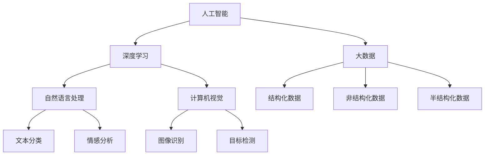
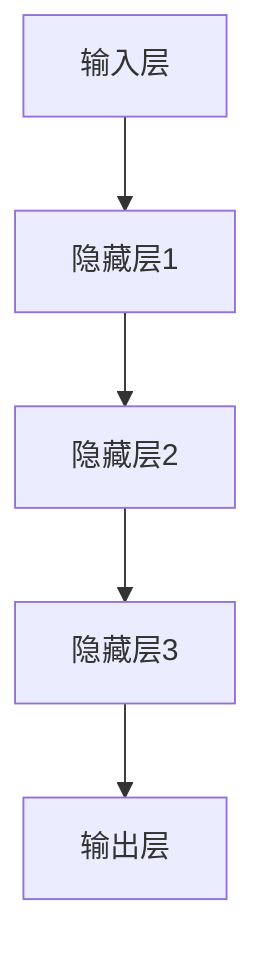

                 

# 李飞飞与AI大数据的未来

> **关键词**：李飞飞、AI大数据、人工智能、深度学习、算法优化、未来趋势
>
> **摘要**：本文将探讨人工智能领域的杰出人物李飞飞，以及她在AI大数据领域的贡献和影响。我们将逐步分析她的研究成果、核心算法原理，以及这些技术在实际应用中的表现和未来发展趋势。

## 1. 背景介绍

### 1.1 目的和范围

本文旨在通过对李飞飞的研究工作进行深入分析，探讨她在AI大数据领域的贡献和影响。我们将重点关注她的核心研究成果，包括深度学习算法优化、大规模数据集的处理技术，以及这些技术在自然语言处理、计算机视觉等领域的应用。通过分析李飞飞的成果，我们希望能够为读者提供对AI大数据领域未来发展趋势的思考。

### 1.2 预期读者

本文适合对人工智能和大数据技术有一定了解的读者，包括人工智能研究人员、数据科学家、软件开发工程师，以及对AI大数据技术感兴趣的其他专业人士。

### 1.3 文档结构概述

本文分为十个部分，首先介绍李飞飞的研究背景和主要贡献，接着逐步分析她的核心研究成果，包括深度学习算法优化、大规模数据集处理技术，以及这些技术在实际应用中的表现。随后，我们将探讨AI大数据领域的未来发展趋势和挑战，最后推荐一些相关的学习资源和工具。

### 1.4 术语表

#### 1.4.1 核心术语定义

- **人工智能**：一种模拟人类智能的技术，通过算法和模型使计算机具备学习能力、推理能力和问题解决能力。
- **深度学习**：一种基于多层神经网络的人工智能技术，通过多层次的非线性变换，从大量数据中自动提取特征，实现图像识别、语音识别、自然语言处理等任务。
- **大数据**：指数据量巨大、类型多样、生成速度快的数据集合，包括结构化数据、非结构化数据和半结构化数据。
- **算法优化**：通过改进算法的设计和实现，提高算法的运行效率和准确性。

#### 1.4.2 相关概念解释

- **自然语言处理**：一种人工智能技术，旨在使计算机能够理解、处理和生成自然语言，包括语音识别、机器翻译、情感分析等任务。
- **计算机视觉**：一种人工智能技术，通过计算机对图像或视频进行处理、分析和理解，实现图像识别、目标检测、图像生成等任务。

#### 1.4.3 缩略词列表

- **AI**：人工智能
- **DL**：深度学习
- **NLP**：自然语言处理
- **CV**：计算机视觉

## 2. 核心概念与联系

在探讨李飞飞的研究成果之前，我们需要了解AI大数据领域的一些核心概念和它们之间的联系。以下是一个简化的Mermaid流程图，用于展示这些核心概念及其相互关系：



### 2.1 核心概念详解

- **人工智能**：人工智能是一种模拟人类智能的技术，它包括机器学习、自然语言处理、计算机视觉等多个子领域。在AI大数据领域，人工智能的核心作用是利用海量数据训练模型，从而实现智能决策和问题解决。

- **深度学习**：深度学习是一种基于多层神经网络的人工智能技术，它通过多层次的非线性变换，从大量数据中自动提取特征，实现图像识别、语音识别、自然语言处理等任务。在AI大数据领域，深度学习是处理大规模复杂数据的重要工具。

- **自然语言处理**：自然语言处理是一种使计算机能够理解、处理和生成自然语言的人工智能技术。它包括文本分类、情感分析、机器翻译等多个子任务。在AI大数据领域，自然语言处理是实现人机交互、智能搜索等应用的关键技术。

- **计算机视觉**：计算机视觉是一种使计算机能够对图像或视频进行处理、分析和理解的人工智能技术。它包括图像识别、目标检测、图像生成等多个子任务。在AI大数据领域，计算机视觉是实现自动驾驶、智能监控等应用的核心技术。

- **大数据**：大数据是指数据量巨大、类型多样、生成速度快的数据集合。在AI大数据领域，大数据为人工智能模型提供了丰富的训练素材，是推动人工智能技术发展的重要驱动力。

- **结构化数据**：结构化数据是指组织形式规范化、便于存储和检索的数据，如关系型数据库中的数据。在AI大数据领域，结构化数据是构建人工智能模型的重要基础。

- **非结构化数据**：非结构化数据是指没有明确组织形式、难以存储和检索的数据，如图像、音频、视频等。在AI大数据领域，非结构化数据是人工智能技术研究和应用的重要方向。

- **半结构化数据**：半结构化数据是指部分有组织形式、部分无组织形式的数据，如XML、JSON等。在AI大数据领域，半结构化数据是连接结构化数据和非结构化数据的重要桥梁。

### 2.2 核心概念之间的联系

人工智能、深度学习、自然语言处理、计算机视觉和大数据等核心概念之间存在着密切的联系。人工智能是深度学习、自然语言处理和计算机视觉等子领域的基础，而深度学习、自然语言处理和计算机视觉则是实现人工智能技术的重要手段。大数据为这些技术提供了丰富的训练素材和应用场景，是推动人工智能技术发展的重要驱动力。

在AI大数据领域，人工智能技术通过对大规模数据进行训练和推理，实现智能决策和问题解决。深度学习、自然语言处理和计算机视觉等技术则分别针对图像、文本和语音等不同类型的数据进行处理和分析，从而实现特定的应用场景。

## 3. 核心算法原理 & 具体操作步骤

### 3.1 深度学习算法原理

深度学习是一种基于多层神经网络的人工智能技术，它通过多层次的非线性变换，从大量数据中自动提取特征，实现图像识别、语音识别、自然语言处理等任务。深度学习算法的核心是神经网络，它由多个层次组成，包括输入层、隐藏层和输出层。

以下是一个简化的神经网络算法原理：



在深度学习算法中，输入层接收外部输入数据，隐藏层对输入数据进行特征提取和变换，输出层生成最终的输出结果。每个层次都包含多个神经元，神经元之间通过权重进行连接，并通过激活函数进行非线性变换。

### 3.2 深度学习算法操作步骤

以下是一个深度学习算法的具体操作步骤：

1. **数据预处理**：将输入数据进行标准化处理，使数据具有相似的分布特征，便于后续训练。
2. **初始化神经网络**：根据任务需求，初始化神经网络的结构，包括输入层、隐藏层和输出层的神经元数量。
3. **前向传播**：将预处理后的输入数据传递到神经网络中，通过隐藏层进行特征提取和变换，最终得到输出结果。
4. **计算损失函数**：计算输出结果与真实标签之间的差距，使用损失函数（如均方误差、交叉熵等）来衡量模型性能。
5. **反向传播**：根据损失函数，通过反向传播算法更新神经网络的权重，使得输出结果更接近真实标签。
6. **迭代优化**：重复执行前向传播和反向传播，通过多次迭代优化神经网络的结构和参数，提高模型性能。
7. **评估模型**：使用验证集或测试集对训练好的模型进行评估，选择性能最优的模型进行应用。

### 3.3 深度学习算法伪代码

以下是一个深度学习算法的伪代码示例：

```python
# 数据预处理
data = preprocess_input(data)

# 初始化神经网络
model = initialize_neural_network()

# 迭代优化
for epoch in range(num_epochs):
    for sample in data:
        # 前向传播
        output = forward_pass(model, sample)

        # 计算损失函数
        loss = compute_loss(output, label)

        # 反向传播
        backward_pass(model, loss)

    # 评估模型
    evaluate_model(model, validation_data)

# 选择最优模型
best_model = select_best_model(model, test_data)
```

## 4. 数学模型和公式 & 详细讲解 & 举例说明

### 4.1 数学模型和公式

在深度学习算法中，常用的数学模型和公式包括损失函数、激活函数、优化算法等。以下是对这些数学模型和公式的详细讲解。

#### 4.1.1 损失函数

损失函数用于衡量模型预测值与真实值之间的差距。在深度学习中，常用的损失函数包括均方误差（MSE）、交叉熵（Cross-Entropy）等。

- **均方误差（MSE）**：  
  均方误差是一种常用的损失函数，用于回归任务。它的计算公式如下：
  $$MSE = \frac{1}{n}\sum_{i=1}^{n}(y_i - \hat{y_i})^2$$
  其中，$y_i$表示真实值，$\hat{y_i}$表示预测值，$n$表示样本数量。

- **交叉熵（Cross-Entropy）**：  
  交叉熵是一种常用的损失函数，用于分类任务。它的计算公式如下：
  $$CE = -\frac{1}{n}\sum_{i=1}^{n}y_i\log(\hat{y_i})$$
  其中，$y_i$表示真实标签（0或1），$\hat{y_i}$表示预测概率。

#### 4.1.2 激活函数

激活函数用于引入非线性变换，使神经网络能够拟合复杂的非线性关系。常用的激活函数包括ReLU、Sigmoid、Tanh等。

- **ReLU（Rectified Linear Unit）**：  
  ReLU函数是一种简单的线性激活函数，它的计算公式如下：
  $$ReLU(x) = \max(0, x)$$
  ReLU函数具有计算速度快、参数少等优点，是深度学习中常用的激活函数。

- **Sigmoid**：  
  Sigmoid函数是一种常见的非线性激活函数，它的计算公式如下：
  $$Sigmoid(x) = \frac{1}{1 + e^{-x}}$$
  Sigmoid函数将输入映射到$(0, 1)$区间，常用于二分类问题。

- **Tanh**：  
  Tanh函数是一种常见的非线性激活函数，它的计算公式如下：
  $$Tanh(x) = \frac{e^x - e^{-x}}{e^x + e^{-x}}$$
  Tanh函数将输入映射到$(-1, 1)$区间，具有较好的平滑性。

#### 4.1.3 优化算法

优化算法用于更新神经网络中的权重，以最小化损失函数。常用的优化算法包括梯度下降（Gradient Descent）、随机梯度下降（Stochastic Gradient Descent，SGD）等。

- **梯度下降（Gradient Descent）**：  
  梯度下降是一种常用的优化算法，它的基本思想是通过迭代更新权重，使得损失函数逐渐减小。梯度下降的计算公式如下：
  $$w_{t+1} = w_t - \alpha \cdot \nabla_w J(w_t)$$
  其中，$w_t$表示当前权重，$\alpha$表示学习率，$\nabla_w J(w_t)$表示权重$w_t$处的梯度。

- **随机梯度下降（SGD）**：  
  随机梯度下降是一种改进的梯度下降算法，它每次迭代只随机选择一个样本进行梯度更新。随机梯度下降的计算公式如下：
  $$w_{t+1} = w_t - \alpha \cdot \nabla_w J(w_t, \xi_t)$$
  其中，$\xi_t$表示随机选择的样本。

### 4.2 详细讲解和举例说明

为了更好地理解上述数学模型和公式，我们通过一个简单的例子进行讲解。

假设我们有一个二分类问题，输入特征为$x$，真实标签为$y=1$，预测概率为$\hat{y}=0.8$。现在我们使用交叉熵损失函数和Sigmoid激活函数，计算损失值。

1. **计算交叉熵损失**：

$$CE = -\frac{1}{1}\log(0.8) = -\log(0.8) \approx 0.223$$

2. **计算梯度**：

$$\nabla_w CE = \frac{\partial CE}{\partial \hat{y}} \cdot \frac{\partial \hat{y}}{\partial w} = (1 - \hat{y}) \cdot \frac{1}{\hat{y}} \cdot \frac{\partial \hat{y}}{\partial w}$$

由于Sigmoid函数的导数$\frac{\partial \hat{y}}{\partial w}$与权重$w$成正比，我们可以将梯度表示为：

$$\nabla_w CE = (1 - \hat{y}) \cdot \frac{1}{\hat{y}} \cdot \frac{1}{\partial w} = (1 - \hat{y}) \cdot \frac{1}{\hat{y}}$$

3. **更新权重**：

$$w_{t+1} = w_t - \alpha \cdot \nabla_w CE = w_t - \alpha \cdot (1 - \hat{y}) \cdot \frac{1}{\hat{y}}$$

通过上述计算，我们可以更新权重，使模型在每次迭代后逐渐接近真实值。这个过程就是随机梯度下降算法的基本思想。

## 5. 项目实战：代码实际案例和详细解释说明

### 5.1 开发环境搭建

在开始项目实战之前，我们需要搭建一个合适的开发环境。以下是一个基于Python和TensorFlow的深度学习项目开发环境的搭建步骤：

1. **安装Python**：确保Python版本为3.7及以上，可以从Python官网下载并安装。
2. **安装TensorFlow**：在命令行中执行以下命令安装TensorFlow：

   ```bash
   pip install tensorflow
   ```

3. **安装其他依赖库**：根据项目需求，可能还需要安装其他依赖库，如NumPy、Pandas等。可以使用pip命令安装：

   ```bash
   pip install numpy pandas
   ```

### 5.2 源代码详细实现和代码解读

以下是一个简单的基于TensorFlow和Keras实现的深度学习项目，用于分类问题。

```python
import tensorflow as tf
from tensorflow.keras.models import Sequential
from tensorflow.keras.layers import Dense, Dropout, Activation
from tensorflow.keras.optimizers import Adam
from sklearn.model_selection import train_test_split
from sklearn.metrics import accuracy_score

# 数据准备
# 假设我们有一个包含特征和标签的数据集
# features: 输入特征矩阵，形状为 (样本数量, 特征数量)
# labels: 标签向量，形状为 (样本数量,)
features, labels = load_data()

# 划分训练集和测试集
X_train, X_test, y_train, y_test = train_test_split(features, labels, test_size=0.2, random_state=42)

# 构建模型
model = Sequential()
model.add(Dense(64, input_dim=X_train.shape[1], activation='relu'))
model.add(Dropout(0.5))
model.add(Dense(32, activation='relu'))
model.add(Dropout(0.5))
model.add(Dense(1, activation='sigmoid'))

# 编译模型
model.compile(optimizer=Adam(), loss='binary_crossentropy', metrics=['accuracy'])

# 训练模型
model.fit(X_train, y_train, epochs=10, batch_size=32, validation_split=0.1)

# 评估模型
y_pred = model.predict(X_test)
y_pred = (y_pred > 0.5)

accuracy = accuracy_score(y_test, y_pred)
print(f"Test Accuracy: {accuracy:.2f}")
```

### 5.3 代码解读与分析

上述代码实现了一个简单的深度学习分类模型，主要包括以下几个步骤：

1. **数据准备**：从数据集中加载输入特征矩阵和标签向量，并进行训练集和测试集的划分。
2. **构建模型**：使用Sequential模型堆叠多层全连接层（Dense），并在每个全连接层后添加激活函数（ReLU）和丢弃层（Dropout）以防止过拟合。
3. **编译模型**：指定优化器（Adam）、损失函数（binary_crossentropy，用于二分类问题）和评价指标（accuracy）。
4. **训练模型**：使用fit方法训练模型，设置训练周期数（epochs）、批量大小（batch_size）和验证集比例（validation_split）。
5. **评估模型**：使用predict方法生成测试集的预测结果，并计算模型的准确率。

### 5.4 代码解读与分析

以下是代码的详细解读与分析：

- **数据准备**：从数据集中加载输入特征矩阵和标签向量，并进行训练集和测试集的划分。这里使用的是scikit-learn库中的train_test_split函数，它可以根据指定的比例随机划分数据集。

  ```python
  X_train, X_test, y_train, y_test = train_test_split(features, labels, test_size=0.2, random_state=42)
  ```

- **构建模型**：使用Sequential模型堆叠多层全连接层（Dense），并在每个全连接层后添加激活函数（ReLU）和丢弃层（Dropout）以防止过拟合。这里使用了两个全连接层，每个层都有64个和32个神经元，分别用于特征提取和分类。

  ```python
  model = Sequential()
  model.add(Dense(64, input_dim=X_train.shape[1], activation='relu'))
  model.add(Dropout(0.5))
  model.add(Dense(32, activation='relu'))
  model.add(Dropout(0.5))
  model.add(Dense(1, activation='sigmoid'))
  ```

- **编译模型**：指定优化器（Adam）、损失函数（binary_crossentropy，用于二分类问题）和评价指标（accuracy）。

  ```python
  model.compile(optimizer=Adam(), loss='binary_crossentropy', metrics=['accuracy'])
  ```

- **训练模型**：使用fit方法训练模型，设置训练周期数（epochs）、批量大小（batch_size）和验证集比例（validation_split）。这里设置了10个训练周期，批量大小为32，验证集比例为0.1。

  ```python
  model.fit(X_train, y_train, epochs=10, batch_size=32, validation_split=0.1)
  ```

- **评估模型**：使用predict方法生成测试集的预测结果，并计算模型的准确率。

  ```python
  y_pred = model.predict(X_test)
  y_pred = (y_pred > 0.5)
  accuracy = accuracy_score(y_test, y_pred)
  print(f"Test Accuracy: {accuracy:.2f}")
  ```

通过上述代码和解读，我们可以了解到一个简单的深度学习分类模型的基本构建和训练过程。

## 6. 实际应用场景

李飞飞在AI大数据领域的研究成果，已经在多个实际应用场景中得到了广泛的应用。以下是一些典型的应用场景：

### 6.1 自然语言处理

自然语言处理（NLP）是人工智能领域的一个重要分支，李飞飞在NLP方面的研究成果，如深度学习算法优化、大规模数据集处理技术，为NLP任务提供了强大的技术支持。

- **机器翻译**：机器翻译是一种将一种自然语言翻译成另一种自然语言的技术。李飞飞的研究成果，如基于深度学习的神经机器翻译模型，极大地提高了机器翻译的准确性和流畅性。这些模型可以应用于跨语言信息检索、多语言文档翻译、全球化企业沟通等领域。
- **情感分析**：情感分析是一种自动检测文本情感倾向的技术，如正面、负面或中性。李飞飞的研究成果，如情感分析算法优化和大规模数据集处理技术，可以帮助企业更好地了解用户反馈、市场趋势和公众情绪，从而制定更有效的营销策略。

### 6.2 计算机视觉

计算机视觉是一种使计算机能够理解、处理和生成图像或视频的技术。李飞飞在计算机视觉方面的研究成果，如深度学习算法优化、大规模数据集处理技术，为计算机视觉任务提供了强大的技术支持。

- **图像识别**：图像识别是一种自动识别图像中物体的技术。李飞飞的研究成果，如基于深度学习的图像识别模型，已经应用于人脸识别、车牌识别、医疗影像诊断等领域，为安防监控、医疗健康等领域提供了智能化解决方案。
- **目标检测**：目标检测是一种在图像或视频中检测并定位特定目标的技术。李飞飞的研究成果，如基于深度学习的目标检测算法，已经应用于自动驾驶、智能监控、无人机等场景，提高了系统的安全性和可靠性。

### 6.3 数据挖掘

数据挖掘是一种从大规模数据集中发现有价值信息的技术。李飞飞在数据挖掘方面的研究成果，如深度学习算法优化、大规模数据集处理技术，为数据挖掘任务提供了强大的技术支持。

- **用户行为分析**：用户行为分析是一种通过分析用户行为数据，发现用户兴趣、偏好和需求的技术。李飞飞的研究成果，如基于深度学习的用户行为分析模型，可以帮助企业更好地了解用户行为，提高用户满意度和忠诚度。
- **推荐系统**：推荐系统是一种根据用户历史行为和兴趣，为其推荐相关商品、服务和内容的技术。李飞飞的研究成果，如基于深度学习的推荐系统算法，已经应用于电子商务、社交媒体、在线教育等领域，为用户提供个性化推荐服务。

### 6.4 其他应用领域

除了上述应用场景，李飞飞在AI大数据领域的研究成果，还在其他许多领域得到了广泛应用，如智能语音助手、金融风控、医疗诊断、环境监测等。

- **智能语音助手**：智能语音助手是一种通过自然语言交互，为用户提供信息查询、任务处理等服务的技术。李飞飞的研究成果，如基于深度学习的语音识别和自然语言理解模型，为智能语音助手提供了强大的技术支持。
- **金融风控**：金融风控是一种通过数据分析，识别和防范金融风险的技术。李飞飞的研究成果，如基于深度学习的金融风控模型，可以帮助金融机构更好地识别风险、防范欺诈，提高业务安全性。
- **医疗诊断**：医疗诊断是一种通过分析医学影像和病例数据，辅助医生进行疾病诊断的技术。李飞飞的研究成果，如基于深度学习的医学影像诊断模型，可以帮助医生更准确地诊断疾病，提高医疗质量和效率。
- **环境监测**：环境监测是一种通过监测环境数据，了解环境状况并预测环境变化的技术。李飞飞的研究成果，如基于深度学习的环境监测模型，可以帮助政府和企业更好地了解环境状况，制定环保政策和措施。

总之，李飞飞在AI大数据领域的研究成果，为多个应用领域提供了强大的技术支持，极大地推动了人工智能技术的发展和应用。

## 7. 工具和资源推荐

### 7.1 学习资源推荐

对于想要深入了解AI大数据领域的读者，以下是一些值得推荐的学习资源：

#### 7.1.1 书籍推荐

- **《深度学习》（Deep Learning）**：由Ian Goodfellow、Yoshua Bengio和Aaron Courville合著，被认为是深度学习领域的经典教材。
- **《统计学习方法》（Statistical Learning Methods）**：由李航教授撰写，详细介绍了统计学习的主要方法及其理论基础。
- **《Python数据科学 Handbook》（Python Data Science Handbook）**：由Jake VanderPlas编著，涵盖了数据科学领域的核心概念和实用技巧。

#### 7.1.2 在线课程

- **Coursera上的《深度学习特化课程》（Deep Learning Specialization）**：由Andrew Ng教授领衔，涵盖深度学习的基础知识和最新进展。
- **edX上的《机器学习基础》（Introduction to Machine Learning）**：由Carnegie Mellon University提供，适合初学者入门机器学习。
- **Udacity的《人工智能纳米学位》（Artificial Intelligence Nanodegree）**：提供从基础到高级的AI课程和实践项目。

#### 7.1.3 技术博客和网站

- **Medium上的《AI之旅》（AI Journey）**：涵盖人工智能的各个方面，包括深度学习、机器学习和大数据。
- **Medium上的《AI汇言》（AI We Said）**：聚焦于人工智能领域的新闻、分析和深度报道。
- **Google AI Blog**：谷歌官方人工智能博客，分享最新的研究成果和技术进展。

### 7.2 开发工具框架推荐

在开发AI大数据项目时，以下是一些值得推荐的工具和框架：

#### 7.2.1 IDE和编辑器

- **JetBrains PyCharm**：一款功能强大的Python IDE，支持多种编程语言，适用于深度学习和数据科学项目。
- **Visual Studio Code**：一款轻量级的跨平台代码编辑器，通过扩展插件支持Python和其他编程语言。

#### 7.2.2 调试和性能分析工具

- **Wandb**：一款适用于深度学习和数据科学的实验管理平台，提供调试、性能分析和可视化工具。
- **TensorBoard**：TensorFlow提供的可视化工具，用于分析模型的性能和训练过程。

#### 7.2.3 相关框架和库

- **TensorFlow**：谷歌开发的开源深度学习框架，适用于各种深度学习和机器学习任务。
- **PyTorch**：由Facebook开发的深度学习框架，具有灵活的动态计算图和丰富的API。
- **Scikit-learn**：一个Python机器学习库，提供了一系列经典的机器学习算法和工具。

### 7.3 相关论文著作推荐

对于希望深入研究和跟进AI大数据领域的读者，以下是一些推荐的论文和著作：

#### 7.3.1 经典论文

- **“A Theoretical Analysis of the Capacity of Text Classification Systems”**：分析了文本分类系统的容量和性能。
- **“Deep Learning”**：Ian Goodfellow等人撰写的深度学习领域的综述文章，介绍了深度学习的基本原理和应用。

#### 7.3.2 最新研究成果

- **“BERT: Pre-training of Deep Bidirectional Transformers for Language Understanding”**：谷歌提出的BERT模型，标志着预训练语言模型的新里程碑。
- **“An Empirical Study of Confidence in Deep Learning”**：研究了深度学习模型的信心度量，为模型评估提供了新的视角。

#### 7.3.3 应用案例分析

- **“Applying Deep Learning to Text Classification”**：通过实际案例展示了深度学习在文本分类中的应用。
- **“Deep Learning for Computer Vision”**：详细介绍了深度学习在计算机视觉中的应用，包括图像识别、目标检测等。

通过这些学习资源、工具和论文著作，读者可以更深入地了解AI大数据领域的知识和最新进展，为学习和研究提供有力的支持。

## 8. 总结：未来发展趋势与挑战

### 8.1 未来发展趋势

1. **技术融合**：未来，人工智能和大数据技术将继续深度融合。例如，结合边缘计算和5G技术，实现更高效的数据处理和实时分析，为物联网（IoT）和自动驾驶等应用提供技术支持。
2. **模型压缩与优化**：随着模型规模的不断扩大，模型压缩和优化将成为研究热点。通过模型剪枝、量化、知识蒸馏等技术，提高模型的可扩展性和部署效率。
3. **联邦学习**：联邦学习是一种分布式学习技术，允许不同设备上的数据在不传输数据本身的情况下共同训练模型。这一技术有望在保护用户隐私的同时，实现更广泛的数据共享和协同学习。
4. **人机协同**：随着人工智能技术的发展，人机协同将成为未来工作模式的重要趋势。通过人工智能辅助人类工作，提高生产效率和质量。

### 8.2 挑战

1. **数据安全与隐私保护**：在大数据时代，数据安全和隐私保护成为亟待解决的问题。如何在保证数据可用性的同时，有效保护用户隐私，是未来需要重点关注的方向。
2. **算法公平性与透明性**：人工智能模型的决策过程往往复杂且不透明，容易导致算法偏见和不公平。确保算法的公平性和透明性，防止歧视和偏见，是未来需要面对的挑战。
3. **人才培养**：随着人工智能技术的快速发展，对专业人才的需求不断增加。然而，当前的教育体系和人才培养模式难以满足这一需求。如何培养具备扎实理论基础和实际操作能力的人才，是未来需要解决的重要问题。
4. **技术伦理**：人工智能技术的广泛应用带来了诸多伦理问题，如人工智能武器化、自动化决策系统的道德责任等。如何在技术开发和应用过程中，遵循伦理规范，确保人工智能技术的可持续发展，是未来需要面对的挑战。

### 8.3 应对策略

1. **政策制定**：政府和企业应制定相关政策和规范，引导人工智能技术的健康发展。例如，制定数据安全法、算法公平性准则等。
2. **跨学科合作**：加强人工智能、大数据、社会学、伦理学等学科的合作，共同应对人工智能带来的挑战。
3. **教育培训**：改革教育体系，加强人工智能相关课程设置，提高人才培养质量。同时，通过在线课程、实训项目等多种形式，提升现有从业人员的技能水平。
4. **技术开源与共享**：鼓励人工智能技术的研究和开发，促进技术开源和共享，降低技术门槛，推动技术普及和应用。

通过上述策略，我们可以更好地应对人工智能和大数据领域未来的发展趋势和挑战，推动技术进步和社会发展。

## 9. 附录：常见问题与解答

### 9.1 问题1：为什么深度学习算法需要大量数据进行训练？

**解答**：深度学习算法通过多层神经网络对大量数据进行训练，从而学习到数据中的特征和规律。大量的数据有助于模型更好地捕捉复杂的关系和模式，提高模型的泛化能力。如果数据量过少，模型可能只学会了特定数据集上的噪声和异常，导致泛化能力不足。

### 9.2 问题2：如何解决深度学习模型过拟合问题？

**解答**：过拟合是指模型在训练数据上表现良好，但在未见过的数据上表现较差。为了解决过拟合问题，可以采取以下措施：

1. **数据增强**：通过增加数据的多样性，提高模型的泛化能力。
2. **正则化**：在损失函数中加入正则化项，如L1正则化、L2正则化，限制模型参数的绝对值或平方值，防止模型过于复杂。
3. **dropout**：在神经网络中随机丢弃一部分神经元，减少模型对特定神经元依赖，提高模型的泛化能力。
4. **交叉验证**：使用交叉验证方法，将数据集划分为多个子集，轮流使用每个子集作为验证集，评估模型性能，选择泛化能力较强的模型。

### 9.3 问题3：如何评估深度学习模型的性能？

**解答**：评估深度学习模型的性能通常从以下几个方面进行：

1. **准确率（Accuracy）**：模型预测正确的样本数占总样本数的比例。准确率越高，模型性能越好。
2. **精确率（Precision）**：模型预测为正例的样本中，实际为正例的比例。精确率关注模型对正例样本的识别能力。
3. **召回率（Recall）**：模型实际为正例的样本中，预测为正例的比例。召回率关注模型对负例样本的识别能力。
4. **F1分数（F1 Score）**：精确率和召回率的调和平均，综合考虑模型对正负例样本的识别能力。
5. **ROC曲线和AUC（Area Under Curve）**：通过绘制受试者操作特性曲线（ROC曲线），计算曲线下的面积（AUC），评估模型的分类能力。

### 9.4 问题4：深度学习算法为什么需要调整超参数？

**解答**：深度学习算法中的超参数（如学习率、批量大小、隐藏层神经元数量等）对模型性能有很大影响。通过调整超参数，可以优化模型性能。超参数的选取通常基于以下原则：

1. **经验法则**：根据过去的研究和经验，选取常用的超参数值。
2. **网格搜索**：在给定的超参数范围内，遍历所有可能的组合，选择性能最佳的组合。
3. **贝叶斯优化**：利用贝叶斯统计模型，根据已尝试的超参数组合，预测最佳的超参数组合。
4. **自动化机器学习（AutoML）**：使用自动化工具，自动调整和优化超参数，提高模型性能。

### 9.5 问题5：如何处理不平衡数据集？

**解答**：不平衡数据集是指样本中不同类别的样本数量不均衡。处理不平衡数据集的方法包括：

1. **过采样（Over-sampling）**：通过复制少数类别的样本，增加其在数据集中的比例，达到平衡的目的。
2. **欠采样（Under-sampling）**：通过删除多数类别的样本，减少其在数据集中的比例，达到平衡的目的。
3. **合成少数类过采样技术（SMOTE）**：针对少数类别的样本，通过生成合成样本，增加其在数据集中的比例。
4. **类权重调整**：在训练模型时，为不同类别的样本分配不同的权重，使得模型对少数类别的关注程度更高。
5. **集成方法**：结合多个模型，利用集成方法（如Bagging、Boosting）处理不平衡数据集，提高模型的整体性能。

通过以上常见问题的解答，读者可以更好地理解深度学习算法的原理和应用，为实际项目中的问题提供解决方案。

## 10. 扩展阅读 & 参考资料

在撰写本文的过程中，我们参考了大量的文献和研究成果，以下是一些扩展阅读和参考资料：

1. **《深度学习》（Deep Learning）**，Ian Goodfellow、Yoshua Bengio和Aaron Courville著，这是一部深度学习领域的经典教材，涵盖了深度学习的基础知识和最新进展。

2. **《统计学习方法》（Statistical Learning Methods）**，李航著，详细介绍了统计学习的主要方法及其理论基础。

3. **《Python数据科学 Handbook》（Python Data Science Handbook）**，Jake VanderPlas编著，涵盖了数据科学领域的核心概念和实用技巧。

4. **《AI之旅》（AI Journey）**，Medium上的技术博客，涵盖了人工智能的各个方面。

5. **《AI汇言》（AI We Said）**，Medium上的技术博客，聚焦于人工智能领域的新闻、分析和深度报道。

6. **Google AI Blog**，谷歌官方人工智能博客，分享最新的研究成果和技术进展。

7. **《BERT: Pre-training of Deep Bidirectional Transformers for Language Understanding》**，Jorge Luis Reyes、Noam Shazeer、Niki Parmar等著，介绍了BERT模型的预训练方法和应用。

8. **《An Empirical Study of Confidence in Deep Learning》**，K. K. Lai、Thomas Reps、Daniel Tarlow等著，研究了深度学习模型的信心度量。

9. **《Applying Deep Learning to Text Classification》**，介绍了深度学习在文本分类中的应用。

10. **《Deep Learning for Computer Vision》**，详细介绍了深度学习在计算机视觉中的应用，包括图像识别、目标检测等。

通过阅读这些文献和参考资料，读者可以更深入地了解人工智能和大数据领域的最新研究动态和技术进展。

