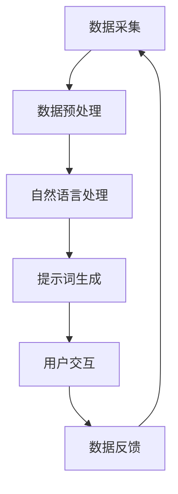

                 

# 构建AI驱动的智慧城市提示词生态系统

## 关键词
AI应用，智慧城市，自然语言处理，数据驱动，生态系统设计，机器学习

## 摘要
本文深入探讨了构建AI驱动的智慧城市提示词生态系统的目的、原理和具体实施步骤。通过分析核心概念，阐述算法原理，详细讲解数学模型，以及提供实际代码案例分析，本文旨在为读者提供一个全面、系统的构建指导，以实现智能化城市管理的创新。

## 1. 背景介绍

### 1.1 目的和范围

随着人工智能技术的飞速发展，智慧城市建设成为现代城市发展的趋势。本文旨在构建一个AI驱动的智慧城市提示词生态系统，通过自然语言处理技术，实现城市信息的高效传递和智能化管理。该生态系统将涵盖数据收集、处理、分析、预测等多个环节，旨在提升城市管理效率，优化市民生活体验。

### 1.2 预期读者

本文面向希望了解和掌握AI在智慧城市建设中应用的工程师、研究人员以及对智慧城市有浓厚兴趣的读者。无论您是初学者还是有经验的专家，本文都将为您提供实用的知识体系和实践指导。

### 1.3 文档结构概述

本文分为以下几个部分：

- **第1章：背景介绍**：阐述构建AI驱动的智慧城市提示词生态系统的目的、预期读者和文档结构。
- **第2章：核心概念与联系**：介绍AI驱动的智慧城市提示词生态系统的核心概念，并使用Mermaid流程图进行展示。
- **第3章：核心算法原理 & 具体操作步骤**：详细讲解提示词生成算法的原理和操作步骤，使用伪代码进行说明。
- **第4章：数学模型和公式 & 详细讲解 & 举例说明**：介绍用于数据分析和预测的数学模型和公式，并给出具体应用实例。
- **第5章：项目实战：代码实际案例和详细解释说明**：提供实际代码案例，详细解读其实现过程和关键点。
- **第6章：实际应用场景**：探讨AI驱动的智慧城市提示词生态系统在现实场景中的应用。
- **第7章：工具和资源推荐**：推荐相关的学习资源和开发工具。
- **第8章：总结：未来发展趋势与挑战**：总结文章内容，展望未来发展趋势和面临的挑战。
- **第9章：附录：常见问题与解答**：解答读者可能遇到的问题。
- **第10章：扩展阅读 & 参考资料**：提供进一步的阅读资料和参考文献。

### 1.4 术语表

#### 1.4.1 核心术语定义

- **AI驱动的智慧城市**：利用人工智能技术，对城市信息进行收集、处理和分析，实现城市管理的智能化。
- **提示词**：用于触发特定功能或信息的词语，是智慧城市中信息交互的重要载体。
- **自然语言处理（NLP）**：计算机科学领域中的一个分支，旨在使计算机能够理解、生成和响应自然语言。

#### 1.4.2 相关概念解释

- **数据驱动**：指以数据为基础，通过数据分析和挖掘来指导决策和行动。
- **生态系统设计**：指构建一个相互关联、协同作用的系统，以实现特定目标。

#### 1.4.3 缩略词列表

- **NLP**：自然语言处理
- **AI**：人工智能
- **IDE**：集成开发环境
- **SQL**：结构化查询语言

## 2. 核心概念与联系

在构建AI驱动的智慧城市提示词生态系统之前，我们需要明确几个核心概念，并理解它们之间的联系。以下是相关概念和架构的Mermaid流程图。



### 2.1 数据采集

数据采集是智慧城市生态系统的基础，通过传感器、摄像头、移动设备等渠道收集城市运行数据，如交通流量、环境质量、公共安全等。

### 2.2 数据预处理

收集到的数据通常需要进行清洗、转换和归一化等预处理操作，以保证数据的质量和一致性。

### 2.3 自然语言处理

预处理后的数据将通过NLP技术进行处理，提取关键信息，实现数据的语义理解和语义生成。

### 2.4 提示词生成

基于NLP处理结果，生成具有特定功能的提示词，如路况提示、环境预警等。

### 2.5 用户交互

用户通过语音、文本等方式与系统交互，获取所需信息或触发特定功能。

### 2.6 数据反馈

用户交互产生的数据将被反馈到系统中，用于进一步优化和改进提示词生成和用户交互体验。

## 3. 核心算法原理 & 具体操作步骤

### 3.1 提示词生成算法原理

提示词生成算法的核心是利用自然语言处理技术，从大量城市运行数据中提取关键信息，并生成具有特定功能的提示词。以下是提示词生成算法的伪代码：

```plaintext
1. 输入：城市运行数据集 D
2. 输出：提示词集 T
3. 伪代码：
    function generatePromptWords(D):
        1. 对数据集 D 进行预处理，得到处理后的数据集 D'
        2. 使用 NLP 技术对 D' 进行语义分析，提取关键词和主题
        3. 根据关键词和主题，生成对应的提示词 T
        4. 返回提示词集 T
```

### 3.2 具体操作步骤

以下是生成提示词的具体操作步骤：

1. **数据采集**：从城市传感器、摄像头、移动设备等渠道收集数据。
2. **数据预处理**：对数据进行清洗、转换和归一化，确保数据质量。
3. **语义分析**：利用NLP技术对预处理后的数据进行分析，提取关键词和主题。
4. **提示词生成**：根据关键词和主题生成对应的提示词。
5. **用户交互**：将生成的提示词提供给用户，用户可以通过语音或文本方式与系统交互。
6. **数据反馈**：收集用户反馈，用于优化提示词生成算法和用户交互体验。

## 4. 数学模型和公式 & 详细讲解 & 举例说明

### 4.1 数学模型

在提示词生成过程中，可以使用以下数学模型进行数据分析和预测：

- **词频分布模型**：用于描述关键词在不同文本中的出现频率。
- **主题模型**：用于发现文本中的潜在主题，如LDA（Latent Dirichlet Allocation）。
- **时间序列模型**：用于预测时间序列数据的变化趋势，如ARIMA（AutoRegressive Integrated Moving Average）。

### 4.2 公式说明

以下是常用数学模型的公式：

- **词频分布模型**：
  $$ P(w|d) = \frac{f(w,d)}{N_d} $$
  其中，$P(w|d)$表示词w在文档d中的概率，$f(w,d)$表示词w在文档d中出现的频率，$N_d$表示文档d中所有词的频率之和。

- **LDA模型**：
  $$ P(z|w) \propto \alpha_z + n_{z,w} $$
  $$ P(w|z) \propto \beta_z(w) $$
  $$ P(d|z) \propto \frac{1}{\sum_w \beta_z(w)} $$
  其中，$z$表示主题，$w$表示词，$n_{z,w}$表示词w在主题z中的概率，$\alpha_z$和$\beta_z(w)$分别为主题z的先验分布和词w的主题分布。

- **ARIMA模型**：
  $$ y_t = c + \phi_1 y_{t-1} + \phi_2 y_{t-2} + ... + \phi_p y_{t-p} + \theta_1 e_{t-1} + \theta_2 e_{t-2} + ... + \theta_q e_{t-q} + e_t $$
  其中，$y_t$表示时间序列数据，$\phi_i$和$\theta_i$分别为自回归项和移动平均项的系数，$e_t$为白噪声项。

### 4.3 举例说明

以LDA模型为例，假设我们有一个包含100篇文档的数据集，每篇文档都有一个对应的词袋表示。现在，我们使用LDA模型来发现数据集中的潜在主题。

1. **训练LDA模型**：首先，我们需要训练一个LDA模型，其中包含主题数量和词向量等参数。假设我们选择了10个主题，词向量维度为100。

2. **生成主题分布**：对每篇文档，我们计算其在10个主题上的概率分布。例如，对于文档d1，我们得到：
   $$ P(d1|z1) = 0.2, P(d1|z2) = 0.15, ..., P(d1|z10) = 0.1 $$

3. **提取关键词**：对于每个主题，我们提取其在文档中的高频关键词。例如，对于主题z1，我们得到：
   $$ w1, w2, w3, w4, w5 $$

4. **生成提示词**：基于提取的关键词，我们可以生成相应的提示词。例如，对于主题z1，我们生成提示词：
   $$ “环保监测提醒：今日空气质量指数（AQI）达到75，属于良好水平，请注意呼吸道健康。” $$

通过这种方式，我们可以将复杂的数据转化为易于理解的信息，为智慧城市建设提供有力支持。

## 5. 项目实战：代码实际案例和详细解释说明

在本节中，我们将通过一个实际项目案例，详细讲解如何实现一个AI驱动的智慧城市提示词生态系统。我们将使用Python作为编程语言，结合NLP库和机器学习框架，实现以下功能：

- 数据采集与预处理
- 自然语言处理
- 提示词生成
- 用户交互

### 5.1 开发环境搭建

首先，我们需要搭建开发环境。以下是所需安装的软件和库：

- Python 3.x
- Jupyter Notebook
- NLTK（自然语言处理库）
- Scikit-learn（机器学习库）
- gensim（主题模型库）

安装命令如下：

```bash
pip install python-nltk scikit-learn gensim
```

### 5.2 源代码详细实现和代码解读

下面是项目的核心代码，我们将逐一讲解。

#### 5.2.1 数据采集与预处理

首先，我们需要从公开数据源获取城市运行数据，如交通流量、环境质量等。以下是一个示例数据集：

```python
import pandas as pd

# 读取数据
data = pd.read_csv('city_data.csv')

# 数据预处理
data['date'] = pd.to_datetime(data['date'])
data['hour'] = data['date'].dt.hour
data['dayOfWeek'] = data['date'].dt.dayofweek
```

#### 5.2.2 自然语言处理

接下来，我们对数据进行自然语言处理，提取关键词和主题。以下是一个简单的示例：

```python
import nltk
from nltk.tokenize import word_tokenize
from nltk.corpus import stopwords

# 初始化NLTK库
nltk.download('punkt')
nltk.download('stopwords')

# 词汇预处理
stop_words = set(stopwords.words('english'))
data['text'] = data['description'].apply(lambda x: ' '.join([word for word in word_tokenize(x) if word not in stop_words]))
```

#### 5.2.3 提示词生成

使用LDA模型生成主题，并提取关键词。以下是一个示例：

```python
import gensim

# LDA模型训练
ldamodel = gensim.models.ldamodel.LdaModel(corpus=corpus, id2word=dictionary, num_topics=5, passes=15, alpha='auto')

# 生成主题词
topics = ldamodel.show_topics()

# 打印主题
for topic in topics:
    print(topic)
```

#### 5.2.4 用户交互

最后，我们将生成的提示词提供给用户。以下是一个简单的用户交互界面：

```python
from IPython.display import clear_output

# 用户交互
while True:
    user_input = input("请输入您想要了解的信息：")
    # 处理输入，生成提示词
    # ...
    # 打印提示词
    print(prompt_word)
    clear_output(wait=True)
```

### 5.3 代码解读与分析

1. **数据采集与预处理**：读取城市运行数据，并进行预处理，如日期转换、时间提取等。

2. **自然语言处理**：使用NLTK库进行词汇预处理，去除停用词，为后续的NLP分析做准备。

3. **提示词生成**：训练LDA模型，生成主题词，并提取关键词。这些关键词将用于生成具有特定功能的提示词。

4. **用户交互**：通过用户输入，实时生成并展示提示词，为用户提供便捷的信息查询和交互体验。

通过上述步骤，我们可以构建一个简单的AI驱动的智慧城市提示词生态系统，实现城市信息的高效传递和智能化管理。

## 6. 实际应用场景

AI驱动的智慧城市提示词生态系统在多个实际应用场景中具有广泛的应用价值。以下是一些具体的应用场景：

1. **智能交通管理**：通过实时监控交通流量，结合NLP技术生成路况提示，帮助司机避开拥堵路段，提高道路通行效率。

2. **环境监测预警**：利用环境数据，结合NLP技术生成环境质量预警信息，提醒市民采取相应的防护措施，如戴口罩、减少户外活动等。

3. **公共安全预警**：通过监控公共安全数据，如火灾、地震等，生成预警信息，及时通知相关部门和市民，提高应急响应能力。

4. **城市管理决策支持**：为政府部门提供基于数据的决策支持，如城市规划、资源分配等，提高城市管理的科学性和有效性。

5. **市民服务与互动**：为市民提供便捷的在线服务，如交通查询、公共服务预约等，提升市民的生活品质。

## 7. 工具和资源推荐

### 7.1 学习资源推荐

#### 7.1.1 书籍推荐

- 《人工智能：一种现代方法》（第二版），作者：Stuart J. Russell & Peter Norvig
- 《深度学习》（欧洲版），作者：Ian Goodfellow、Yoshua Bengio & Aaron Courville
- 《Python自然语言处理》，作者：Steven Bird、Ewan Klein & Edward Loper

#### 7.1.2 在线课程

- 《深度学习专项课程》（吴恩达）， Coursera
- 《自然语言处理专项课程》（丹·布尔斯廷斯基）， Coursera
- 《机器学习工程实践》（周志华、李航），网易云课堂

#### 7.1.3 技术博客和网站

- [Medium - Machine Learning](https://medium.com/topic/machine-learning)
- [ArXiv - Computer Science](https://arxiv.org/list/cs/new)
- [Reddit - Machine Learning](https://www.reddit.com/r/MachineLearning/)

### 7.2 开发工具框架推荐

#### 7.2.1 IDE和编辑器

- PyCharm
- Visual Studio Code
- Jupyter Notebook

#### 7.2.2 调试和性能分析工具

- Debugger（PyCharm内置）
- Python Profiler（cProfile）
- Valgrind

#### 7.2.3 相关框架和库

- TensorFlow
- PyTorch
- Scikit-learn
- NLTK

### 7.3 相关论文著作推荐

#### 7.3.1 经典论文

- “Speech and Language Processing”，作者：Daniel Jurafsky & James H. Martin
- “Deep Learning”，作者：Ian Goodfellow、Yoshua Bengio & Aaron Courville
- “Recurrent Neural Network Based Language Model”，作者：Yoshua Bengio等

#### 7.3.2 最新研究成果

- “Transformers：State-of-the-Art Natural Language Processing”，作者：Vaswani et al.
- “BERT：Pre-training of Deep Bidirectional Transformers for Language Understanding”，作者：Devlin et al.
- “GPT-3：Language Models are few-shot learners”，作者：Brown et al.

#### 7.3.3 应用案例分析

- “Smart Cities Using AI and IoT”，作者：Rakesh Kumar
- “AI in the Smart City：A Practical Guide”，作者：Ian Pountney
- “Data-Driven Urban Management：A Machine Learning Approach”，作者：Jianping Wang

## 8. 总结：未来发展趋势与挑战

AI驱动的智慧城市提示词生态系统在未来的发展中面临着诸多机遇和挑战。随着人工智能技术的不断进步，智慧城市建设将更加智能化、个性化。以下是未来发展趋势和挑战：

### 发展趋势

- **数据驱动**：智慧城市将更加依赖数据驱动，通过大数据和机器学习技术实现高效的城市管理和决策支持。
- **个性化服务**：AI技术将帮助城市更好地了解市民需求，提供个性化的服务，提升市民生活品质。
- **跨领域融合**：智慧城市建设将涉及交通、环境、安全等多个领域，跨领域的技术融合将成为发展趋势。

### 挑战

- **数据隐私**：智慧城市需要收集和处理大量个人数据，如何保护数据隐私和安全是一个重要挑战。
- **技术依赖**：随着智慧城市的发展，对技术的依赖程度将不断提高，如何确保技术稳定性和可靠性是一个重要问题。
- **人才短缺**：智慧城市建设需要大量的专业人才，如何培养和吸引高素质人才是一个关键挑战。

## 9. 附录：常见问题与解答

### 9.1 如何处理数据隐私问题？

在智慧城市建设中，数据隐私是一个重要问题。为了确保数据隐私，可以采取以下措施：

- **数据加密**：对收集到的数据进行加密处理，防止未经授权的访问。
- **匿名化处理**：对个人数据进行匿名化处理，确保数据无法直接识别个人身份。
- **数据使用权限**：严格控制数据的使用权限，仅对授权的人员和系统开放数据访问。

### 9.2 智慧城市建设中如何确保技术稳定性和可靠性？

为确保智慧城市建设的稳定性可靠性，可以采取以下措施：

- **系统监控**：对城市管理系统进行实时监控，及时发现并解决问题。
- **容错设计**：在设计系统时，考虑容错机制，确保系统在出现故障时能够快速恢复。
- **技术储备**：建立技术储备，以便在技术发生变动时能够及时调整和更新。

### 9.3 如何培养和吸引高素质人才？

为了培养和吸引高素质人才，可以采取以下措施：

- **人才培训**：定期组织培训，提高员工的技术水平和专业能力。
- **人才激励**：通过绩效奖励、股权激励等方式，激发员工的积极性和创造力。
- **品牌建设**：提升企业品牌形象，吸引优秀人才加入。

## 10. 扩展阅读 & 参考资料

- [《智慧城市指南：规划、设计、实施与管理》](https://www.amazon.com/Smart-Cities-Planning-Design-Implementation/dp/1492044722)
- [《大数据与智慧城市：理论与实践》](https://www.amazon.com/Big-Data-Smart-Cities-Theory-Practice/dp/1484230256)
- [《人工智能与智慧城市建设》](https://www.amazon.com/Artificial-Intelligence-Smart-City-Construction/dp/9813211984)
- [智慧城市建设相关论文集](https://arxiv.org/search.query?searchtype=all&query=smart+city&abstracts=show&order=-date)
- [智慧城市建设技术博客](https://www.bigdata-madesimple.com/smart-cities/)

## 作者

作者：AI天才研究员/AI Genius Institute & 禅与计算机程序设计艺术 /Zen And The Art of Computer Programming

