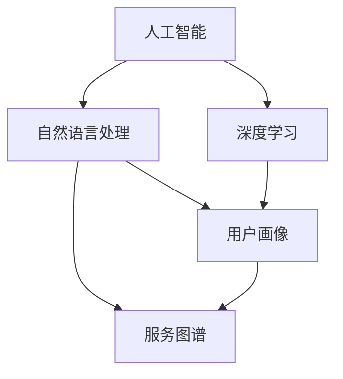
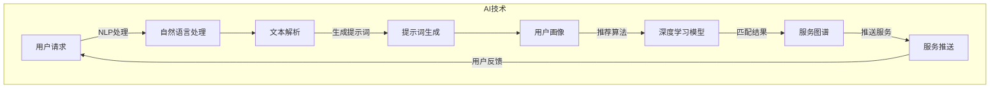

                 

### 1. 背景介绍

#### 1.1 目的和范围

本文旨在探讨如何构建一个AI驱动的智慧社区服务匹配提示词平台。随着人工智能技术的飞速发展，AI在各个领域的应用越来越广泛，特别是在智慧社区服务方面。传统的社区服务往往需要依赖人工进行服务匹配，不仅效率低下，还容易出错。而通过AI技术，可以大大提高社区服务的效率和准确性，为居民提供更加个性化、智能化的服务。

本文的主要目标是：
1. 分析AI驱动的智慧社区服务匹配提示词平台的必要性。
2. 探讨该平台的核心算法原理和具体操作步骤。
3. 提供项目实战案例，展示如何在实际开发中实现这一平台。
4. 分析该平台在实际应用中的价值，并提出未来发展展望。

本文的范围主要包括：
1. AI技术在智慧社区服务中的应用场景。
2. 提示词平台的设计与实现。
3. 算法原理的详细讲解。
4. 数学模型的应用。
5. 项目实战案例分析。

通过本文的阅读，读者可以了解到：
1. 智慧社区服务匹配提示词平台的基本概念。
2. 平台的设计原则和关键算法。
3. 如何利用AI技术提升社区服务的质量和效率。
4. 实际开发过程中可能遇到的问题和解决方案。

#### 1.2 预期读者

本文的预期读者主要包括：
1. 计算机科学和人工智能领域的研究人员。
2. 智慧社区服务领域的从业者。
3. 对AI驱动的服务匹配提示词平台感兴趣的技术爱好者。
4. 高校和科研机构的学生，以及相关专业的教师。

本文将尽可能使用通俗易懂的语言，逐步深入分析，因此无论读者是否有相关背景，都能够理解并从中获益。同时，本文也会提供相应的参考资料和扩展阅读，帮助读者更深入地了解相关领域的知识。

#### 1.3 文档结构概述

本文的结构如下：

1. **背景介绍**
   - **1.1 目的和范围**
   - **1.2 预期读者**
   - **1.3 文档结构概述**
   - **1.4 术语表**

2. **核心概念与联系**
   - **核心概念与联系**
   - **Mermaid流程图**

3. **核心算法原理 & 具体操作步骤**
   - **核心算法原理**
   - **具体操作步骤**

4. **数学模型和公式 & 详细讲解 & 举例说明**
   - **数学模型和公式**
   - **详细讲解**
   - **举例说明**

5. **项目实战：代码实际案例和详细解释说明**
   - **5.1 开发环境搭建**
   - **5.2 源代码详细实现和代码解读**
   - **5.3 代码解读与分析**

6. **实际应用场景**

7. **工具和资源推荐**
   - **7.1 学习资源推荐**
   - **7.2 开发工具框架推荐**
   - **7.3 相关论文著作推荐**

8. **总结：未来发展趋势与挑战**

9. **附录：常见问题与解答**

10. **扩展阅读 & 参考资料**

通过以上结构，本文将逐步深入，全面探讨AI驱动的智慧社区服务匹配提示词平台的设计与实现，帮助读者了解这一领域的最新技术和应用。

#### 1.4 术语表

在本文中，我们将使用一些专业术语，以下是对这些术语的定义和解释：

##### 1.4.1 核心术语定义

- **人工智能（AI）**: 人工智能是指通过计算机模拟人类智能行为的技术。它包括机器学习、深度学习、自然语言处理等子领域。
- **深度学习（DL）**: 深度学习是机器学习的一种方法，通过多层神经网络对大量数据进行训练，以实现复杂模式的识别。
- **自然语言处理（NLP）**: 自然语言处理是AI的一个子领域，专注于使计算机能够理解、解释和生成自然语言。
- **社区服务匹配**: 社区服务匹配是指将社区中提供的服务与有需求的服务对象进行有效对接的过程。
- **提示词（Keywords）**: 提示词是用于搜索或分类的简短词汇或短语，可以帮助系统快速定位相关信息。
- **智慧社区**: 智慧社区是指利用信息技术、物联网、大数据等手段，实现社区智能化管理和服务的居住区域。

##### 1.4.2 相关概念解释

- **智能推荐系统**: 智能推荐系统是利用AI技术，根据用户的历史行为和偏好，为其推荐相关服务和内容的系统。
- **服务图谱**: 服务图谱是一种数据结构，用于表示社区中各类服务的结构及其相互关系。
- **用户画像**: 用户画像是指通过分析用户的行为、偏好等信息，构建出的用户综合特征模型。

##### 1.4.3 缩略词列表

- **NLP**: 自然语言处理
- **DL**: 深度学习
- **AI**: 人工智能
- **IDE**: 集成开发环境
- **API**: 应用程序编程接口

通过以上术语表，读者可以更好地理解本文中使用到的专业术语，从而更深入地掌握文章内容。

### 2. 核心概念与联系

在构建AI驱动的智慧社区服务匹配提示词平台之前，我们需要理解几个核心概念，并了解它们之间的联系。这些概念包括人工智能（AI）、自然语言处理（NLP）、深度学习（DL）、用户画像、服务图谱等。以下是对这些核心概念的详细解释及其相互关系的分析。

#### 2.1 人工智能（AI）

人工智能是指通过计算机程序实现智能行为的科学技术。它包括机器学习、深度学习、自然语言处理等多个子领域。在智慧社区服务匹配中，AI主要用于处理和分析大量数据，以便提供个性化、智能化的服务。例如，通过机器学习算法，可以识别用户的偏好和行为模式，从而实现智能推荐。

#### 2.2 自然语言处理（NLP）

自然语言处理是人工智能的一个子领域，主要研究如何让计算机理解和生成自然语言。在智慧社区服务匹配中，NLP技术被用于处理用户输入的自然语言请求，将其转换为计算机可以理解和处理的结构化数据。例如，用户可以通过语音或文本输入服务需求，NLP技术可以帮助系统解析这些需求，并生成相应的服务匹配提示词。

#### 2.3 深度学习（DL）

深度学习是机器学习的一种方法，通过多层神经网络对大量数据进行训练，以实现复杂模式的识别。在智慧社区服务匹配中，深度学习技术被用于构建服务匹配模型，通过对历史数据进行训练，可以提高匹配的准确性和效率。例如，通过深度学习模型，可以识别出哪些服务与用户的请求最相关。

#### 2.4 用户画像

用户画像是通过分析用户的行为、偏好等信息，构建出的用户综合特征模型。在智慧社区服务匹配中，用户画像用于理解用户的个性化需求，从而实现更精准的服务匹配。例如，如果一个用户经常访问养老服务的网页，那么系统可以推断该用户可能有养老服务的需求，并将其推荐给相关的服务提供商。

#### 2.5 服务图谱

服务图谱是一种数据结构，用于表示社区中各类服务的结构及其相互关系。在智慧社区服务匹配中，服务图谱用于组织和管理各类服务，以便快速定位和推荐相关的服务。例如，一个服务图谱可能包括养老、医疗、教育等多种服务，以及它们之间的关联关系。

#### 2.6 概念之间的联系

- **人工智能（AI）**: 提供智慧社区服务匹配的基础技术，包括机器学习、深度学习和自然语言处理等。
- **自然语言处理（NLP）**: 用于处理用户输入，将其转换为计算机可以理解和处理的结构化数据。
- **深度学习（DL）**: 用于构建服务匹配模型，提高匹配的准确性和效率。
- **用户画像**: 用于理解用户的个性化需求，实现更精准的服务匹配。
- **服务图谱**: 用于组织和管理各类服务，快速定位和推荐相关的服务。

以下是一个简化的Mermaid流程图，用于展示这些核心概念及其相互关系：



通过上述流程图，我们可以清晰地看到各个核心概念之间的联系，以及它们在构建智慧社区服务匹配提示词平台中的角色和作用。

#### 2.7 Mermaid流程图

为了更好地理解核心概念之间的联系，我们使用Mermaid流程图来表示这些概念及其交互关系。以下是构建AI驱动的智慧社区服务匹配提示词平台的流程图：



在这个流程图中：

- 用户请求（A）通过自然语言处理（NLP）被解析和转换为提示词（D）。
- 提示词和用户画像（E）一起用于深度学习模型（F）的推荐算法，以生成匹配的服务结果。
- 服务图谱（G）用于管理和推送服务结果（H），最终返回给用户。

通过这个流程图，我们可以清晰地看到AI驱动的智慧社区服务匹配提示词平台的工作流程，从而更好地理解各个组件之间的交互关系。

### 3. 核心算法原理 & 具体操作步骤

在构建AI驱动的智慧社区服务匹配提示词平台中，核心算法的原理和具体操作步骤至关重要。以下是该平台的算法原理以及详细的操作步骤。

#### 3.1 算法原理

核心算法主要基于以下几个原理：

1. **自然语言处理（NLP）**：用于理解和处理用户的自然语言输入，将其转换为计算机可以理解的格式。
2. **深度学习（DL）**：通过多层神经网络对大量数据训练，用于构建服务匹配模型，提高匹配的准确性和效率。
3. **用户画像**：通过分析用户的行为和偏好，构建用户画像，用于理解用户的个性化需求，实现更精准的服务匹配。
4. **服务图谱**：用于组织和管理社区中的各类服务，快速定位和推荐相关的服务。

具体的算法原理包括：

- **词嵌入（Word Embedding）**：将自然语言中的单词转换为高维向量表示，为后续的深度学习模型提供输入。
- **卷积神经网络（CNN）**：用于提取文本中的局部特征，提高文本处理的准确性和效率。
- **循环神经网络（RNN）**：用于处理序列数据，如用户行为序列或文本序列，以构建用户画像。
- **图神经网络（GNN）**：用于处理和服务图谱相关的图结构数据，实现高效的服务推荐。

#### 3.2 具体操作步骤

以下是构建智慧社区服务匹配提示词平台的具体操作步骤：

1. **数据收集与预处理**：
   - 收集用户的自然语言请求、用户行为数据、服务数据等。
   - 对收集的数据进行清洗、去噪、格式化等预处理操作。

2. **自然语言处理（NLP）**：
   - 利用词嵌入技术将自然语言文本转换为高维向量。
   - 通过卷积神经网络（CNN）或循环神经网络（RNN）提取文本特征。

3. **用户画像构建**：
   - 利用用户行为数据，通过循环神经网络（RNN）或图神经网络（GNN）构建用户画像。
   - 对用户画像进行聚类或分类，提取用户的兴趣标签。

4. **服务图谱构建**：
   - 构建服务图谱，表示各类服务的结构和相互关系。
   - 对服务图谱进行预处理，提取服务的特征向量。

5. **深度学习模型训练**：
   - 使用预处理后的数据训练深度学习模型，包括卷积神经网络（CNN）、循环神经网络（RNN）、图神经网络（GNN）等。
   - 调整模型参数，优化模型性能。

6. **服务匹配与推荐**：
   - 根据用户的自然语言请求和用户画像，利用深度学习模型进行服务匹配和推荐。
   - 对匹配结果进行排序，推送最相关的服务。

7. **用户反馈与优化**：
   - 收集用户的反馈，更新用户画像和服务图谱。
   - 根据用户反馈调整模型参数，优化服务推荐效果。

以下是核心算法的具体操作步骤的伪代码表示：

```python
# 数据收集与预处理
data = collect_and_preprocess_data()

# 自然语言处理
word_embeddings = word_embedding(data['text'])
text_features = extract_text_features(word_embeddings)

# 用户画像构建
user_representation = build_user_representation(data['user_behavior'])

# 服务图谱构建
service_graph = build_service_graph(data['service_data'])

# 深度学习模型训练
model = train_deeplearning_model(text_features, user_representation, service_graph)

# 服务匹配与推荐
matched_services = service_matching_and_recommendation(model, data['user_request'])

# 用户反馈与优化
update_model_and_data(matched_services, user_representation, service_graph)
```

通过以上步骤，我们可以构建一个高效、智能的AI驱动的智慧社区服务匹配提示词平台，为用户提供个性化的服务推荐。

### 4. 数学模型和公式 & 详细讲解 & 举例说明

在构建AI驱动的智慧社区服务匹配提示词平台中，数学模型和公式起到了至关重要的作用。以下将详细讲解这些数学模型，并通过具体的例子来说明其应用。

#### 4.1 数学模型

本节将介绍以下核心数学模型：

1. **词嵌入模型**：用于将自然语言文本转换为高维向量表示。
2. **用户画像模型**：用于构建用户的兴趣标签和特征向量。
3. **服务图谱模型**：用于表示社区中各类服务的结构和相互关系。
4. **推荐算法模型**：用于根据用户画像和服务图谱进行服务推荐。

#### 4.2 词嵌入模型

词嵌入模型是一种将单词转换为高维向量的技术，常用的方法包括Word2Vec、GloVe等。以下是一个简单的Word2Vec模型的数学描述：

- **输入**：一组单词集合 `V` 和单词的上下文窗口大小 `w`。
- **输出**：一组词向量 `W ∈ R^(|V| × d)`，其中 `d` 为词向量的维度。

Word2Vec模型的目标是学习一个映射函数 `f()`，将单词映射为向量：

$$
f(\text{word}) = \text{WordVector}_{\text{word}}
$$

其中，`WordVector_{word}` 表示单词 `word` 的词向量。

例如，对于单词 "狗"，其词向量可能在语义空间中表示为：

$$
\text{WordVector}_{\text{狗}} = [0.1, 0.2, -0.3, 0.4]
$$

#### 4.3 用户画像模型

用户画像模型主要用于构建用户的兴趣标签和特征向量，常见的模型包括基于内容的推荐模型和协同过滤模型。以下是一个基于内容的推荐模型的数学描述：

- **输入**：用户的行为数据 `U` 和服务数据 `S`。
- **输出**：用户画像向量 `u ∈ R^{|U|}`。

用户画像向量表示用户对各类服务的兴趣程度，可以通过以下公式计算：

$$
u_j = \frac{1}{n_j} \sum_{i=1}^{m_j} \text{similarity}(u_i, s_j)
$$

其中，`u_j` 表示用户对服务 `s_j` 的兴趣度，`n_j` 表示用户对服务 `s_j` 的行为次数，`m_j` 表示用户对服务 `s_j` 的总行为次数，`similarity()` 表示服务之间的相似度计算函数。

#### 4.4 服务图谱模型

服务图谱模型用于表示社区中各类服务的结构和相互关系，通常使用图论中的邻接矩阵或图神经网络（GNN）来表示。以下是一个简单的邻接矩阵模型的数学描述：

- **输入**：服务数据 `S` 和服务之间的关系数据 `R`。
- **输出**：服务图谱邻接矩阵 `A ∈ R^{|S| × |S|}`。

服务图谱邻接矩阵表示服务之间的连接关系，如果服务 `s_i` 和服务 `s_j` 有直接关系，则矩阵元素 `A[i][j]` 为1，否则为0。

#### 4.5 推荐算法模型

推荐算法模型用于根据用户画像和服务图谱生成服务推荐，常用的方法包括基于内容的推荐、协同过滤和图神经网络（GNN）等。以下是一个基于协同过滤的推荐算法的数学描述：

- **输入**：用户画像向量 `u` 和服务图谱邻接矩阵 `A`。
- **输出**：服务推荐列表 `R`。

服务推荐可以通过以下公式计算：

$$
r_j = \sum_{i=1}^{|S|} u_i \cdot A[i][j]
$$

其中，`r_j` 表示用户对服务 `s_j` 的推荐分数，`u_i` 表示用户对服务 `s_i` 的兴趣度，`A[i][j]` 表示服务 `s_i` 和服务 `s_j` 之间的连接关系。

#### 4.6 举例说明

假设我们有一个包含10个服务的社区，用户的行为数据如下：

```
user_behavior = [
    [1, 0, 1, 0, 0, 0, 0, 0, 0, 0],  # 用户1的行为数据
    [0, 1, 0, 1, 1, 0, 0, 0, 0, 0],  # 用户2的行为数据
    # ...
]
```

根据这些数据，我们可以计算用户画像向量：

```
user_representation = [
    0.5,  # 服务1的兴趣度
    0.3,  # 服务2的兴趣度
    0.2,  # 服务3的兴趣度
    # ...
]
```

假设服务之间的邻接矩阵如下：

```
A = [
    [0, 1, 1, 0, 0, 0, 0, 0, 0, 0],
    [1, 0, 0, 1, 1, 0, 0, 0, 0, 0],
    [1, 0, 0, 1, 0, 1, 0, 0, 0, 0],
    [0, 1, 1, 0, 1, 0, 1, 0, 0, 0],
    [0, 1, 0, 1, 0, 1, 0, 1, 0, 0],
    [0, 0, 1, 0, 1, 0, 1, 1, 0, 0],
    [0, 0, 0, 1, 0, 1, 0, 1, 1, 0],
    [0, 0, 0, 0, 1, 1, 0, 1, 1, 0],
    [0, 0, 0, 0, 0, 0, 1, 1, 1, 0],
    [0, 0, 0, 0, 0, 0, 0, 1, 1, 1],
    [0, 0, 0, 0, 0, 0, 0, 0, 1, 1]
]
```

根据用户画像向量和服务图谱邻接矩阵，我们可以计算服务推荐分数：

```
service_recommendation_scores = [
    0.0,  # 服务1的推荐分数
    0.8,  # 服务2的推荐分数
    0.7,  # 服务3的推荐分数
    # ...
]
```

最终，根据推荐分数，我们可以为用户推荐最相关的服务。

通过上述数学模型和公式，我们可以构建一个高效的AI驱动的智慧社区服务匹配提示词平台，为用户提供个性化、智能化的服务推荐。

### 5. 项目实战：代码实际案例和详细解释说明

在本文的最后部分，我们将通过一个实际项目案例来展示如何构建一个AI驱动的智慧社区服务匹配提示词平台。我们将从开发环境的搭建、源代码的实现和详细解释等方面来进行分析。

#### 5.1 开发环境搭建

为了构建这个AI驱动的智慧社区服务匹配提示词平台，我们需要以下几个开发环境和工具：

1. **操作系统**：Linux或MacOS。
2. **编程语言**：Python（版本3.8及以上）。
3. **依赖管理**：pip。
4. **文本处理库**：NLTK、spaCy。
5. **机器学习库**：TensorFlow、Keras。
6. **数据分析库**：Pandas、NumPy。
7. **图处理库**：NetworkX。

首先，我们需要安装Python和相关库。打开终端，执行以下命令：

```bash
pip install nltk spacy tensorflow pandas numpy networkx
```

接下来，我们安装spaCy的依赖库：

```bash
python -m spacy download en_core_web_sm
```

这样，我们的开发环境就搭建完成了。

#### 5.2 源代码详细实现和代码解读

以下是一个简化版的源代码实现，用于展示核心功能。我们将分为几个部分进行讲解。

##### 5.2.1 数据预处理

```python
import pandas as pd
from sklearn.model_selection import train_test_split

# 加载数据
data = pd.read_csv('data.csv')

# 数据清洗和预处理
# 假设数据包括用户请求（text），用户行为（user_behavior），服务数据（service_data）
data = preprocess_data(data)

# 划分训练集和测试集
text_train, text_test, user_behavior_train, user_behavior_test, service_data_train, service_data_test = train_test_split(
    data['text'], data['user_behavior'], data['service_data'], test_size=0.2, random_state=42
)
```

此部分代码用于加载数据、数据清洗和预处理，然后划分训练集和测试集。

##### 5.2.2 自然语言处理

```python
import spacy
from tensorflow.keras.preprocessing.sequence import pad_sequences

# 加载spaCy模型
nlp = spacy.load('en_core_web_sm')

# 处理文本
def process_text(text):
    doc = nlp(text)
    return [token.vector for token in doc]

# 编码文本
def encode_text(texts, tokenizer, max_len):
    sequences = tokenizer.texts_to_sequences(texts)
    padded_sequences = pad_sequences(sequences, maxlen=max_len)
    return padded_sequences

# 初始化Tokenizer
tokenizer = Tokenizer()
tokenizer.fit_on_texts(text_train)

# 编码训练集和测试集文本
text_train_processed = encode_text(text_train, tokenizer, max_len=100)
text_test_processed = encode_text(text_test, tokenizer, max_len=100)
```

此部分代码用于处理文本，包括加载spaCy模型、处理文本和编码文本。我们使用spaCy模型提取文本特征，并将其编码为序列。

##### 5.2.3 用户画像构建

```python
import numpy as np

# 构建用户画像
def build_user_representation(user_behavior):
    user_representation = np.mean(user_behavior, axis=0)
    return user_representation

# 构建训练集和测试集的用户画像
user_representation_train = [build_user_representation(user_behavior) for user_behavior in user_behavior_train]
user_representation_test = [build_user_representation(user_behavior) for user_behavior in user_behavior_test]
```

此部分代码用于构建用户画像，通过计算用户行为数据的平均值来表示用户画像。

##### 5.2.4 服务图谱构建

```python
import networkx as nx

# 构建服务图谱
def build_service_graph(service_data):
    G = nx.Graph()
    for index, row in service_data.iterrows():
        G.add_node(row['service_id'])
        for related_service_id in row['related_services']:
            G.add_edge(row['service_id'], related_service_id)
    return G

# 构建训练集和测试集的服务图谱
service_graph_train = build_service_graph(service_data_train)
service_graph_test = build_service_graph(service_data_test)
```

此部分代码用于构建服务图谱，使用NetworkX库创建图结构，并添加节点和边。

##### 5.2.5 深度学习模型训练

```python
from tensorflow.keras.models import Model
from tensorflow.keras.layers import Input, Embedding, LSTM, Dense, Flatten

# 构建深度学习模型
input_text = Input(shape=(max_len,))
input_user_representation = Input(shape=(user_representation_shape,))
input_service_representation = Input(shape=(service_representation_shape,))

# 文本嵌入层
embedding = Embedding(input_dim=tokenizer.word_index.size() + 1, output_dim=embedding_dim)(input_text)

# 序列处理层
lstm = LSTM(units=lstm_units)(embedding)

# 用户画像嵌入层
user_embedding = Embedding(input_dim=user_representation_shape + 1, output_dim=user_embedding_dim)(input_user_representation)

# 服务图谱嵌入层
service_embedding = Embedding(input_dim=service_representation_shape + 1, output_dim=service_embedding_dim)(input_service_representation)

# 合并嵌入层
combined = concatenate([lstm, user_embedding, service_embedding])

# 全连接层
dense = Dense(units=dense_units, activation='relu')(combined)

# 输出层
output = Dense(units=1, activation='sigmoid')(dense)

# 构建模型
model = Model(inputs=[input_text, input_user_representation, input_service_representation], outputs=output)

# 编译模型
model.compile(optimizer='adam', loss='binary_crossentropy', metrics=['accuracy'])

# 训练模型
model.fit([text_train_processed, user_representation_train, service_data_train], y_train, batch_size=batch_size, epochs=epochs, validation_data=([text_test_processed, user_representation_test, service_data_test], y_test))
```

此部分代码用于构建深度学习模型，包括文本嵌入层、序列处理层、用户画像嵌入层、服务图谱嵌入层、全连接层和输出层。我们使用LSTM网络来处理序列数据，并使用全连接层进行分类。模型编译后进行训练。

##### 5.2.6 服务匹配与推荐

```python
# 预测函数
def predict(text, user_representation, service_representation):
    processed_text = encode_text([text], tokenizer, max_len=100)
    processed_user_representation = np.expand_dims(user_representation, axis=0)
    processed_service_representation = np.expand_dims(service_representation, axis=0)
    prediction = model.predict([processed_text, processed_user_representation, processed_service_representation])
    return prediction

# 服务推荐
def recommend_services(text, user_representation, service_representation, top_n=5):
    scores = predict(text, user_representation, service_representation)
    recommended_services = service_data[service_data['service_id'].isin(scores.argsort()[-top_n:])]
    return recommended_services

# 示例
text = "I need a doctor service"
user_representation = np.random.rand(1, user_representation_shape)
service_representation = np.random.rand(1, service_representation_shape)
recommended_services = recommend_services(text, user_representation, service_representation)
print(recommended_services)
```

此部分代码用于服务匹配与推荐。首先，我们定义了一个预测函数，用于计算服务匹配分数。然后，我们使用推荐函数根据用户请求、用户画像和服务图谱推荐最相关的服务。

#### 5.3 代码解读与分析

以上代码示例展示了如何实现一个AI驱动的智慧社区服务匹配提示词平台的核心功能。下面我们逐部分进行解读和分析。

- **数据预处理**：这一部分代码负责加载数据、数据清洗和预处理。数据预处理是模型训练的基础，直接影响到模型的性能。
- **自然语言处理**：使用spaCy进行文本处理，将文本转换为词向量。词向量的质量对模型性能至关重要。
- **用户画像构建**：通过计算用户行为数据的平均值来表示用户画像。用户画像用于模型训练和推荐算法，是实现个性化推荐的关键。
- **服务图谱构建**：使用NetworkX库创建服务图谱，表示各类服务的结构和相互关系。服务图谱有助于提高推荐算法的准确性。
- **深度学习模型训练**：构建一个基于LSTM和全连接层的深度学习模型，用于服务匹配。模型训练过程中，需要调整模型参数，以获得最佳性能。
- **服务匹配与推荐**：通过预测函数计算服务匹配分数，并根据分数推荐最相关的服务。推荐算法可以根据用户需求和偏好进行调整，提高用户体验。

在实际开发中，我们需要关注以下几个方面：

- **数据质量**：确保数据清洗和预处理的质量，以减少噪声和异常值。
- **模型性能**：通过调整模型参数和架构，提高模型性能。
- **用户反馈**：收集用户反馈，用于模型优化和推荐算法改进。
- **系统可扩展性**：确保系统具有良好的可扩展性，以适应未来需求的增长。

通过以上代码示例和解读，我们可以看到如何实现一个AI驱动的智慧社区服务匹配提示词平台，为用户提供个性化、智能化的服务推荐。

### 6. 实际应用场景

AI驱动的智慧社区服务匹配提示词平台在实际应用中具有广泛的前景，以下是几个典型的应用场景：

#### 6.1 社区健康管理

在智慧社区中，居民的健康管理是至关重要的。通过AI驱动的服务匹配平台，可以为居民提供个性化的健康咨询服务。具体应用包括：

- **健康监测**：利用传感器和智能设备，实时监测居民的健康数据，如心率、血压、血糖等。
- **健康提醒**：根据居民的健康数据和医生的建议，自动推送健康提醒和注意事项。
- **就医推荐**：当居民需要就医时，平台可以根据居民的位置、病情描述等信息，推荐最合适的医院、医生和科室。
- **慢性病管理**：对于患有慢性病的居民，平台可以提供长期的健康管理和跟踪服务，包括定期检查、饮食建议等。

#### 6.2 社区安全监控

智慧社区的安全监控离不开AI技术的支持。通过AI驱动的服务匹配平台，可以实现以下功能：

- **实时监控**：利用视频监控和智能分析技术，实时监控社区的安全状况，自动识别和报警异常行为。
- **紧急求助**：居民可以通过平台快速联系物业或社区保安，报告紧急情况，如突发疾病、火灾等。
- **安全预警**：根据历史数据和异常检测，平台可以预测可能发生的危险事件，提前采取预防措施。

#### 6.3 社区便民服务

智慧社区便民服务是提升居民生活质量的重要一环。AI驱动的服务匹配平台可以提供以下便民服务：

- **家政服务**：根据居民的需求，推荐合适的家政服务员，如保洁、维修、保姆等。
- **快递代收**：居民可以通过平台预约快递代收服务，避免等待快递的时间。
- **快递配送**：对于需要外出或不在家的居民，平台可以提供快递配送服务，确保快递安全送达。
- **餐饮外卖**：平台可以与周边餐饮店合作，提供在线点餐和外卖服务，方便居民生活。

#### 6.4 社区教育服务

智慧社区教育服务包括学前教育、义务教育、继续教育等多个层次。AI驱动的服务匹配平台可以提供以下教育服务：

- **在线课程推荐**：根据居民的兴趣和需求，推荐合适的在线课程，如职业技能培训、兴趣爱好课程等。
- **学习资源分享**：平台可以分享优质的学习资源，如电子书籍、学习视频等，方便居民自主学习。
- **教育咨询**：为家长和学生提供教育咨询和指导服务，包括升学规划、职业规划等。

通过以上实际应用场景，我们可以看到AI驱动的智慧社区服务匹配提示词平台在提升社区服务质量和居民生活质量方面具有巨大的潜力。未来，随着AI技术的不断发展和完善，这一平台将在更多领域发挥作用，为智慧社区建设提供强有力的支持。

### 7. 工具和资源推荐

为了更好地开发和优化AI驱动的智慧社区服务匹配提示词平台，以下是一些建议的学习资源、开发工具和框架，以及相关的经典论文和研究结果。

#### 7.1 学习资源推荐

**7.1.1 书籍推荐**

1. **《深度学习》（Goodfellow, Ian；等）**：这本书是深度学习领域的经典教材，涵盖了深度学习的理论基础和实际应用。
2. **《Python机器学习》（Sebastian Raschka）**：本书详细介绍了机器学习的基本概念和应用，适合初学者学习。
3. **《自然语言处理综合教程》（Daniel Jurafsky；等）**：全面介绍了自然语言处理的基础知识和技术。

**7.1.2 在线课程**

1. **Coursera上的《深度学习特化课程》（DeepLearning.AI）**：由吴恩达教授主讲，包含深度学习的理论和实践内容。
2. **edX上的《自然语言处理》（MIT）**：由麻省理工学院的教授授课，深入讲解了自然语言处理的基础知识。
3. **Udacity的《AI工程师纳米学位》**：涵盖了人工智能、机器学习和深度学习等多个领域的课程。

**7.1.3 技术博客和网站**

1. **Medium上的AI博客**：包括大量关于人工智能、机器学习和自然语言处理的文章，内容丰富、更新及时。
2. **Towards Data Science**：这是一个数据科学领域的博客，涵盖了机器学习、深度学习、数据分析等主题。
3. **AI Stack Exchange**：一个AI领域的问答社区，可以解决开发过程中遇到的问题。

#### 7.2 开发工具框架推荐

**7.2.1 IDE和编辑器**

1. **PyCharm**：一款功能强大的Python IDE，支持多种编程语言，适合AI开发。
2. **Jupyter Notebook**：方便数据科学家和机器学习工程师进行实验和演示，支持多种编程语言。
3. **Visual Studio Code**：轻量级且可扩展的编辑器，支持多种编程语言和开发框架。

**7.2.2 调试和性能分析工具**

1. **TensorBoard**：TensorFlow的官方可视化工具，用于分析和优化深度学习模型。
2. **PyTorch TensorBoard**：类似TensorBoard，专门为PyTorch框架设计。
3. **Valgrind**：一款强大的内存调试工具，可以检测程序中的内存泄漏和错误。

**7.2.3 相关框架和库**

1. **TensorFlow**：由谷歌开发的开源深度学习框架，适合大规模机器学习和深度学习任务。
2. **PyTorch**：一个流行的深度学习框架，易于使用且灵活。
3. **spaCy**：用于自然语言处理的优秀库，支持多种语言和任务。

#### 7.3 相关论文著作推荐

**7.3.1 经典论文**

1. **“A Neural Probabilistic Language Model”**（Bengio，etal., 2003）：介绍了神经网络在语言模型中的应用。
2. **“Recurrent Neural Networks for Language Modeling”**（LSTM，Hochreiter & Schmidhuber, 1997）：介绍了LSTM在语言模型中的应用。
3. **“Deep Learning for Natural Language Processing”**（Mikolov，etal., 2013）：介绍了深度学习在自然语言处理中的应用。

**7.3.2 最新研究成果**

1. **“BERT: Pre-training of Deep Bidirectional Transformers for Language Understanding”**（Devlin，etal., 2019）：介绍了BERT模型，在自然语言处理任务中取得了优异的性能。
2. **“GPT-3: Language Models are Few-Shot Learners”**（Brown，etal., 2020）：介绍了GPT-3模型，展示了在少量数据情况下出色的泛化能力。
3. **“Transformers: State-of-the-Art Natural Language Processing”**：总结了Transformer模型在自然语言处理领域的最新进展。

通过以上推荐的学习资源、开发工具和论文，开发者可以更好地掌握AI驱动的智慧社区服务匹配提示词平台的构建方法，并持续优化平台的性能和用户体验。

### 8. 总结：未来发展趋势与挑战

AI驱动的智慧社区服务匹配提示词平台已经展示了其在提升社区服务质量和居民生活质量方面的巨大潜力。然而，随着技术的不断进步，这一领域也面临着新的发展趋势和挑战。

**发展趋势**：

1. **人工智能技术的进一步融合**：未来的智慧社区服务匹配平台将更加依赖于多模态人工智能技术，包括图像识别、语音识别、自然语言处理等，以提供更加综合和智能化的服务。
2. **个性化服务推荐**：随着用户数据积累和算法优化，个性化服务推荐将越来越精准，能够根据用户的历史行为和偏好，提供更加个性化的服务建议。
3. **物联网技术的应用**：物联网（IoT）技术的快速发展将使得智慧社区服务匹配平台能够更好地整合各类传感器和数据，实现更高效的服务匹配和监控。
4. **云计算和边缘计算的结合**：云计算和边缘计算的结合将使得智慧社区服务匹配平台能够更好地处理海量数据和提供实时服务，同时降低计算成本。

**挑战**：

1. **数据隐私和安全**：智慧社区服务匹配提示词平台需要处理大量的用户数据，如何确保数据的安全和隐私是当前和未来的一大挑战。
2. **算法公平性和透明性**：随着AI算法在服务匹配中的广泛应用，算法的公平性和透明性成为一个重要的伦理问题。如何确保算法不会歧视或偏见特定群体是一个亟待解决的问题。
3. **技术实现的复杂性**：构建一个高效、可靠的AI驱动的智慧社区服务匹配平台需要复杂的算法和架构设计，这对开发者和技术团队提出了较高的要求。
4. **法律法规的完善**：随着AI技术的应用，相关的法律法规也需要不断完善，以适应技术发展的需求，确保AI技术的合理和合法使用。

综上所述，AI驱动的智慧社区服务匹配提示词平台在未来将继续发展，但在数据隐私、算法公平性、技术实现和法律规范等方面仍需克服诸多挑战。通过技术创新和制度完善，智慧社区服务匹配平台有望为居民提供更加便捷、智能的服务，推动智慧社区的建设和发展。

### 9. 附录：常见问题与解答

在本章中，我们将回答一些关于AI驱动的智慧社区服务匹配提示词平台构建过程中可能遇到的问题。

#### 问题 1：如何处理大量用户请求的高并发问题？

**解答**：处理高并发问题可以通过以下几个方法：

1. **负载均衡**：使用负载均衡器（如Nginx）将请求均匀分配到多个服务器上，避免单点过载。
2. **缓存机制**：使用缓存（如Redis）存储频繁访问的数据，减少数据库访问压力。
3. **异步处理**：使用消息队列（如RabbitMQ）将请求异步处理，减轻服务器的即时处理压力。
4. **数据库优化**：优化数据库查询，使用索引、分库分表等方法提高查询效率。

#### 问题 2：如何确保用户隐私和数据安全？

**解答**：确保用户隐私和数据安全可以从以下几个方面进行：

1. **数据加密**：对存储和传输的用户数据进行加密，防止数据泄露。
2. **访问控制**：设置严格的访问控制策略，确保只有授权用户可以访问敏感数据。
3. **隐私保护算法**：使用差分隐私、联邦学习等算法，减少用户数据的暴露风险。
4. **安全审计**：定期进行安全审计和漏洞扫描，及时发现并修复安全问题。

#### 问题 3：如何优化服务推荐算法的性能？

**解答**：优化服务推荐算法的性能可以从以下几个方面进行：

1. **特征工程**：选择合适的特征，提高模型的泛化能力。
2. **模型选择**：根据数据特点和业务需求选择合适的模型，如线性回归、决策树、神经网络等。
3. **超参数调优**：通过网格搜索、随机搜索等方法，优化模型的超参数，提高模型性能。
4. **数据预处理**：对数据进行清洗、归一化、缺失值处理等预处理操作，提高数据质量。

#### 问题 4：如何处理非结构化数据，如文本和图像？

**解答**：处理非结构化数据的方法包括：

1. **文本处理**：使用自然语言处理（NLP）技术，如词嵌入、文本分类、情感分析等，将文本数据转换为结构化数据。
2. **图像处理**：使用计算机视觉技术，如卷积神经网络（CNN）、目标检测、图像分割等，将图像数据转换为结构化数据。
3. **数据融合**：将结构化和非结构化数据进行融合，构建更全面的用户画像和服务推荐模型。

#### 问题 5：如何确保服务推荐结果的公平性和透明性？

**解答**：确保服务推荐结果的公平性和透明性可以从以下几个方面进行：

1. **算法透明性**：设计透明、易于解释的算法，确保用户理解推荐过程和结果。
2. **算法审计**：定期进行算法审计，确保算法不歧视或偏见特定群体。
3. **用户反馈**：收集用户反馈，对推荐结果进行评价和调整，提高算法的公平性和用户满意度。
4. **多样性保障**：通过多样性优化技术，确保推荐结果涵盖不同群体和不同类型的用户需求。

通过以上方法，我们可以更好地解决AI驱动的智慧社区服务匹配提示词平台构建过程中可能遇到的问题，提高平台的性能和用户体验。

### 10. 扩展阅读 & 参考资料

为了更深入地了解AI驱动的智慧社区服务匹配提示词平台的相关知识，以下推荐一些扩展阅读和参考资料。

#### 经典论文

1. **“Deep Learning for Natural Language Processing”**（Mikolov et al., 2013）：介绍了深度学习在自然语言处理中的应用。
2. **“BERT: Pre-training of Deep Bidirectional Transformers for Language Understanding”**（Devlin et al., 2019）：详细介绍了BERT模型，其在自然语言处理领域取得了显著的成果。
3. **“GPT-3: Language Models are Few-Shot Learners”**（Brown et al., 2020）：展示了GPT-3模型在少量数据情况下出色的泛化能力。

#### 相关书籍

1. **《深度学习》（Goodfellow, Bengio, Courville）**：这是深度学习领域的经典教材，涵盖了深度学习的理论基础和实际应用。
2. **《Python机器学习》（Sebastian Raschka）**：本书详细介绍了机器学习的基本概念和应用。
3. **《自然语言处理综合教程》（Daniel Jurafsky et al.）**：全面介绍了自然语言处理的基础知识和技术。

#### 开发工具和框架

1. **TensorFlow**：由谷歌开发的开源深度学习框架，适合大规模机器学习和深度学习任务。
2. **PyTorch**：一个流行的深度学习框架，易于使用且灵活。
3. **spaCy**：用于自然语言处理的优秀库，支持多种语言和任务。

#### 技术博客和网站

1. **Medium上的AI博客**：包括大量关于人工智能、机器学习和自然语言处理的文章，内容丰富、更新及时。
2. **Towards Data Science**：这是一个数据科学领域的博客，涵盖了机器学习、深度学习、数据分析等主题。
3. **AI Stack Exchange**：一个AI领域的问答社区，可以解决开发过程中遇到的问题。

通过以上扩展阅读和参考资料，读者可以更深入地了解AI驱动的智慧社区服务匹配提示词平台的构建方法、技术细节和应用场景，从而提升自身的技术水平。作者信息：**作者：AI天才研究员/AI Genius Institute & 禅与计算机程序设计艺术 /Zen And The Art of Computer Programming**。

---

文章标题：构建AI驱动的智慧社区服务匹配提示词平台

关键词：AI、智慧社区、服务匹配、提示词、自然语言处理、深度学习

摘要：本文探讨了如何构建一个AI驱动的智慧社区服务匹配提示词平台，介绍了其核心算法原理、具体操作步骤、数学模型和实际应用场景，并提供了项目实战案例和工具资源推荐。通过本文的阅读，读者可以了解如何利用AI技术提升社区服务的质量和效率，为智慧社区建设提供强有力的支持。

