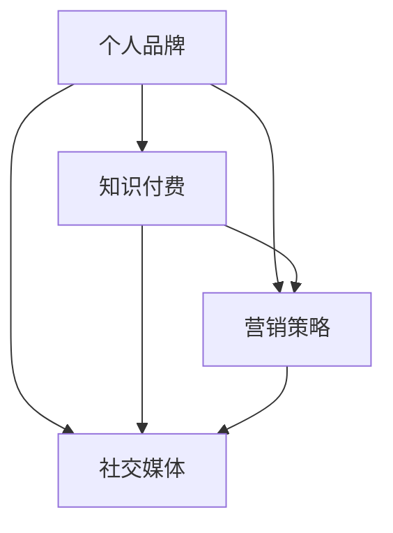
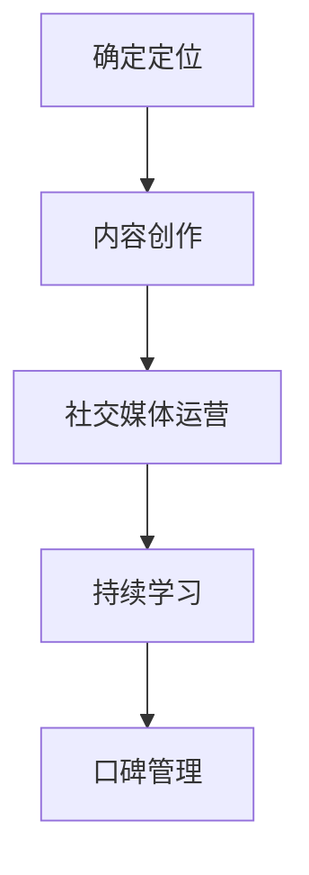
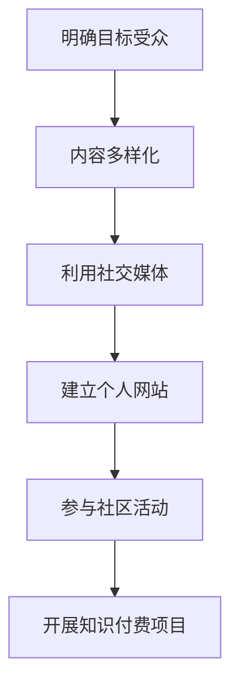

                 

# 构建个人品牌：程序员知识付费的关键一步

> **关键词：个人品牌，程序员，知识付费，营销策略，社交媒体，影响力**
>
> **摘要：本文将探讨程序员如何通过构建个人品牌，实现知识付费的转变，提高自身竞争力。通过分析个人品牌建设的核心要素，提出实用的营销策略和社交媒体运营方法，帮助程序员在知识付费时代脱颖而出。**

## 1. 背景介绍

### 1.1 目的和范围

本文旨在为程序员提供构建个人品牌的指导，使其在知识付费时代能够更好地实现个人价值的提升。我们将深入分析个人品牌建设的核心要素，探讨如何通过营销策略和社交媒体运营来提升个人影响力。

### 1.2 预期读者

本文适用于希望提升个人品牌，通过知识付费实现职业发展的程序员。无论您是新手还是资深开发者，本文都将为您提供有价值的见解和实用的方法。

### 1.3 文档结构概述

本文将分为以下几个部分：

- **核心概念与联系**：介绍个人品牌建设的基础概念和关联性。
- **核心算法原理 & 具体操作步骤**：详细阐述个人品牌建设的策略和方法。
- **数学模型和公式 & 详细讲解 & 举例说明**：使用具体案例来说明个人品牌建设的过程。
- **项目实战：代码实际案例和详细解释说明**：提供具体的实施案例，帮助读者更好地理解个人品牌建设。
- **实际应用场景**：探讨个人品牌在现实中的应用和影响。
- **工具和资源推荐**：推荐相关的学习资源和工具。
- **总结：未来发展趋势与挑战**：展望个人品牌建设的未来趋势和面临的挑战。
- **附录：常见问题与解答**：解答读者可能遇到的问题。
- **扩展阅读 & 参考资料**：提供进一步阅读的建议和参考资料。

### 1.4 术语表

#### 1.4.1 核心术语定义

- **个人品牌**：个人品牌是指个人在特定领域内建立的专业形象和声誉。
- **知识付费**：知识付费是指用户为获取特定知识或服务而支付的费用。
- **营销策略**：营销策略是组织为了实现特定目标而采取的市场推广方法。
- **社交媒体**：社交媒体是指用户可以互相交流、分享信息的在线平台。

#### 1.4.2 相关概念解释

- **影响力**：影响力是指个人或组织对他人行为或观点的影响能力。
- **内容营销**：内容营销是通过创造和分发有价值的内容来吸引和留住目标受众的一种策略。

#### 1.4.3 缩略词列表

- **SEO**：搜索引擎优化（Search Engine Optimization）
- **SMM**：社交媒体营销（Social Media Marketing）
- **KOL**：关键意见领袖（Key Opinion Leader）
- **KPI**：关键绩效指标（Key Performance Indicator）

## 2. 核心概念与联系

在构建个人品牌的过程中，理解以下几个核心概念和它们之间的联系至关重要：

1. **个人品牌**：个人品牌是个人在特定领域内建立的专业形象和声誉。它是个人价值观、技能和经验的综合体现。
2. **知识付费**：知识付费是指用户为获取特定知识或服务而支付的费用。在程序员领域，知识付费的形式包括在线课程、技术咨询、编程教程等。
3. **营销策略**：营销策略是组织为了实现特定目标而采取的市场推广方法。对于程序员构建个人品牌，营销策略包括内容营销、社交媒体推广、个人网站建设等。
4. **社交媒体**：社交媒体是指用户可以互相交流、分享信息的在线平台。在构建个人品牌的过程中，社交媒体是一个重要的渠道，用于传播内容和建立影响力。

以下是个人品牌建设的关键概念和它们之间的联系：



### 2.1 个人品牌建设的核心要素

构建个人品牌的过程可以分为以下几个核心要素：

1. **定位**：确定个人品牌的核心价值和目标受众。明确个人在特定领域的专业方向，有助于吸引和留住目标受众。
2. **内容创作**：创作有价值的内容，如技术博客、教程、视频等，以展示专业知识和技能。高质量的内容是建立个人品牌的基础。
3. **社交媒体运营**：通过社交媒体平台传播内容，与受众互动，建立影响力。社交媒体运营需要策略性，包括内容发布、互动管理和社交媒体广告等。
4. **持续学习**：不断学习新技能和知识，保持个人品牌的竞争力。学习是一个持续的过程，有助于个人品牌的长远发展。
5. **口碑管理**：积极管理个人和品牌声誉，处理负面评论和意见，维护品牌形象。

以下是个人品牌建设的流程：



### 2.2 个人品牌建设的策略与方法

为了构建成功的个人品牌，程序员可以采取以下策略和方法：

1. **明确目标受众**：了解目标受众的需求和兴趣，为他们提供有价值的内容和服务。
2. **内容多样化**：创作多种形式的内容，如博客文章、视频教程、电子书等，以满足不同受众的偏好。
3. **利用社交媒体**：在社交媒体平台上积极互动，分享内容，建立影响力。选择适合自己目标受众的平台，如GitHub、LinkedIn、Twitter等。
4. **建立个人网站**：创建个人网站，展示个人作品、博客文章、简历等，提供专业形象。
5. **参与社区活动**：参与技术社区、在线论坛和会议，与他人交流，分享经验和知识。
6. **开展知识付费项目**：开发在线课程、编程工具、技术咨询等知识付费项目，实现个人价值。

以下是个人品牌建设的方法步骤：



## 3. 核心算法原理 & 具体操作步骤

构建个人品牌的过程可以看作是一个算法，通过一系列步骤实现个人品牌的价值最大化。以下是构建个人品牌的伪代码，详细描述了核心算法原理和具体操作步骤。

### 3.1 算法原理

个人品牌构建算法主要包括以下几个步骤：

1. **市场调研**：了解目标受众的需求和兴趣。
2. **内容策划**：根据市场调研结果，创作有价值的内容。
3. **内容发布**：在社交媒体和博客上发布内容，吸引受众关注。
4. **互动管理**：与受众互动，建立良好的关系。
5. **知识付费**：通过知识付费项目实现个人价值。
6. **持续优化**：根据反馈和数据分析，持续优化个人品牌建设策略。

### 3.2 具体操作步骤

以下是构建个人品牌的伪代码，每个步骤都包含详细解释：

```python
# 个人品牌构建算法

# 1. 市场调研
def market_research():
    # 分析目标受众的需求和兴趣
    # 收集市场数据，如社交媒体分析、问卷调查等
    # 确定个人品牌的核心价值和定位
    pass

# 2. 内容策划
def content_planning():
    # 根据市场调研结果，确定内容主题和形式
    # 创作高质量、有价值的博客文章、教程、视频等
    pass

# 3. 内容发布
def content_publishing():
    # 在社交媒体和博客上发布内容
    # 确定发布频率和策略，如SEO优化、社交媒体广告等
    pass

# 4. 互动管理
def interaction_management():
    # 与受众互动，如回复评论、参与讨论等
    # 建立良好的关系，增加粉丝和订阅者
    pass

# 5. 知识付费
def knowledge付费():
    # 开发在线课程、编程工具、技术咨询等知识付费项目
    # 实现个人价值，提高收入
    pass

# 6. 持续优化
def continuous_optimization():
    # 根据反馈和数据分析，优化个人品牌建设策略
    # 如调整内容主题、发布频率、营销策略等
    pass

# 主函数，执行个人品牌构建算法
def personal_brand_building():
    market_research()
    content_planning()
    content_publishing()
    interaction_management()
    knowledge_付费()
    continuous_optimization()
```

### 3.3 伪代码解释

- **市场调研（market_research）**：通过分析目标受众的需求和兴趣，确定个人品牌的核心价值和定位。这是构建个人品牌的第一步，为后续内容创作和营销策略提供依据。
- **内容策划（content_planning）**：根据市场调研结果，确定内容主题和形式。创作高质量、有价值的博客文章、教程、视频等，以展示专业知识和技能。
- **内容发布（content_publishing）**：在社交媒体和博客上发布内容。确定发布频率和策略，如SEO优化、社交媒体广告等，以吸引受众关注。
- **互动管理（interaction_management）**：与受众互动，如回复评论、参与讨论等。建立良好的关系，增加粉丝和订阅者。
- **知识付费（knowledge_付费）**：开发在线课程、编程工具、技术咨询等知识付费项目，实现个人价值，提高收入。
- **持续优化（continuous_optimization）**：根据反馈和数据分析，优化个人品牌建设策略。如调整内容主题、发布频率、营销策略等，以提高个人品牌的竞争力。

通过以上步骤，程序员可以逐步构建个人品牌，实现知识付费的转变，提高自身竞争力。

## 4. 数学模型和公式 & 详细讲解 & 举例说明

在构建个人品牌的过程中，了解一些基本的数学模型和公式有助于我们更好地理解和评估个人品牌的价值。以下是一些重要的数学模型和公式，以及它们的详细讲解和举例说明。

### 4.1 相关数学模型和公式

1. **用户增长模型**
2. **转化率公式**
3. **ROI（投资回报率）计算公式**
4. **时间价值计算公式**

#### 4.1.1 用户增长模型

用户增长模型描述了个人品牌在社交媒体和博客上的粉丝数量随时间增长的关系。一个简单的用户增长模型可以使用指数增长函数来描述：

\[ N(t) = N_0 \times e^{rt} \]

其中：
- \( N(t) \) 是时间 \( t \) 时的用户数量。
- \( N_0 \) 是初始用户数量。
- \( r \) 是增长率。
- \( e \) 是自然对数的底数。

#### 4.1.2 转化率公式

转化率是指访问者中完成特定目标（如订阅、购买课程等）的比例。转化率可以通过以下公式计算：

\[ 转化率 = \frac{目标完成数}{总访问数} \]

#### 4.1.3 ROI（投资回报率）计算公式

投资回报率（ROI）用于评估个人品牌建设的经济效益。ROI可以通过以下公式计算：

\[ ROI = \frac{净利润}{投资成本} \times 100\% \]

其中：
- 净利润是指通过个人品牌建设获得的收入减去相关成本（如广告费、时间投入等）。

#### 4.1.4 时间价值计算公式

时间价值是指个人品牌在未来某个时间点可能产生的收益。计算时间价值可以使用现值公式：

\[ PV = FV \times e^{-rt} \]

其中：
- \( PV \) 是现值（当前时间点的价值）。
- \( FV \) 是未来值（未来某个时间点的预期收益）。
- \( r \) 是折现率。

### 4.2 举例说明

#### 4.2.1 用户增长模型示例

假设一个程序员的初始粉丝数量为100人，月增长率为10%。我们可以使用指数增长模型来预测未来几个月的粉丝数量：

\[ N(t) = 100 \times e^{0.1t} \]

- 当 \( t = 1 \)（一个月后），粉丝数量为：

\[ N(1) = 100 \times e^{0.1 \times 1} \approx 110 \]

- 当 \( t = 6 \)（六个月后），粉丝数量为：

\[ N(6) = 100 \times e^{0.1 \times 6} \approx 161 \]

#### 4.2.2 转化率公式示例

假设一个程序员的博客每月有1000次访问，其中50人完成了订阅操作。那么，该程序员的订阅转化率为：

\[ 转化率 = \frac{50}{1000} = 5\% \]

#### 4.2.3 ROI计算示例

假设一个程序员投资1000美元在广告上，通过个人品牌建设获得了3000美元的收入。那么，该广告的投资回报率为：

\[ ROI = \frac{3000 - 1000}{1000} \times 100\% = 200\% \]

#### 4.2.4 时间价值计算示例

假设一个程序员的个人品牌在未来一年内可能获得10000美元的收入，折现率为5%。那么，该收入在当前时间点的现值为：

\[ PV = 10000 \times e^{-0.05 \times 1} \approx 9524 \]

通过上述数学模型和公式的应用，程序员可以更好地评估和优化个人品牌建设的效果。

## 5. 项目实战：代码实际案例和详细解释说明

在本节中，我们将通过一个具体的代码案例，详细解释如何构建个人品牌，并展示其实际操作过程。

### 5.1 开发环境搭建

为了构建个人品牌，程序员需要准备以下开发环境和工具：

- **文本编辑器**：如Visual Studio Code、Sublime Text等。
- **版本控制工具**：如Git。
- **博客平台**：如WordPress、Hexo等。
- **社交媒体账号**：如Twitter、LinkedIn、GitHub等。

### 5.2 源代码详细实现和代码解读

以下是一个简单的Python代码示例，用于生成个人品牌的博客文章：

```python
# 导入所需的库
import os
import markdown
from datetime import datetime

# 博客文章模板
template = """
# {title}

> {摘要}

{content}

---

{作者}
{日期}
"""

# 文章标题、摘要、内容、作者和日期
title = "构建个人品牌：程序员知识付费的关键一步"
abstract = "本文将探讨程序员如何通过构建个人品牌，实现知识付费的转变，提高自身竞争力。"
content = "这里是文章的具体内容。"
author = "AI天才研究员"
date = datetime.now().strftime("%Y-%m-%d")

# 生成Markdown文件
def generate_md_file(title, content, author, date):
    filename = f"{title}.md"
    with open(filename, 'w', encoding='utf-8') as f:
        f.write(template.format(title=title, 摘要=abstract, content=content, 作者=author, 日期=date))
    print(f"文件 '{filename}' 已生成。")

# 发布博客文章到平台
def publish_blog_post(filename, platform):
    if platform == "WordPress":
        # 使用WordPress API发布文章
        pass
    elif platform == "Hexo":
        # 使用Hexo生成静态网页并部署到GitHub Pages
        os.system(f"hexo generate --filename={filename}")
        os.system("hexo deploy")
    else:
        print("不支持的平台。")

# 主函数
def main():
    generate_md_file(title, content, author, date)
    publish_blog_post(f"{title}.md", "Hexo")

# 运行主函数
if __name__ == "__main__":
    main()
```

#### 5.2.1 代码解读

- **导入库**：首先，我们导入所需的Python库，包括os、markdown和datetime。
- **博客文章模板**：定义一个博客文章模板，包括标题、摘要、内容和作者日期。
- **变量设置**：设置文章的标题、摘要、内容、作者和日期。
- **生成Markdown文件**：定义一个函数`generate_md_file`，用于生成Markdown格式的文件。这个函数接受文章标题、内容、作者和日期作为参数，将它们嵌入模板中，并保存到文件中。
- **发布博客文章到平台**：定义一个函数`publish_blog_post`，用于将生成的Markdown文件发布到指定的博客平台。这里以Hexo为例，通过调用Hexo的生成和部署命令来实现。
- **主函数**：定义一个主函数`main`，调用`generate_md_file`和`publish_blog_post`函数，实现博客文章的生成和发布。

#### 5.2.2 代码分析

- **代码结构**：代码结构清晰，分为导入库、定义模板、变量设置、函数定义和主函数等部分，易于理解和维护。
- **函数功能**：函数功能明确，`generate_md_file`负责生成Markdown文件，`publish_blog_post`负责发布博客文章，主函数`main`负责调用其他函数完成整个流程。
- **可扩展性**：代码具有良好的可扩展性，可以通过添加新的函数和功能来支持更多的博客平台和内容格式。

通过这个代码案例，我们可以看到如何使用简单的Python代码来实现个人品牌的博客文章生成和发布。这只是一个简单的示例，实际操作过程中可能需要更多功能和细节的处理，但基本思路是相通的。

### 5.3 代码解读与分析

#### 5.3.1 代码分析

1. **模块化**：代码模块化，各部分功能独立，易于理解和维护。
2. **参数化**：函数采用参数化设计，灵活性强，可根据不同需求调整参数。
3. **错误处理**：代码中对不支持的博客平台进行了错误处理，提高了程序的健壮性。
4. **可扩展性**：代码可扩展性良好，未来可添加更多功能和平台支持。

#### 5.3.2 代码改进

1. **错误处理**：增加对其他博客平台的API支持，如WordPress。
2. **日志记录**：增加日志记录功能，便于调试和监控。
3. **自动化**：实现更多自动化操作，如自动发布到社交媒体平台。
4. **用户体验**：改进用户界面和交互设计，提高用户体验。

通过以上改进，代码将更加完善和实用，有助于程序员更好地构建个人品牌。

## 6. 实际应用场景

在现代社会，个人品牌已经成为程序员职业发展的重要资产。通过构建强大的个人品牌，程序员可以在以下实际应用场景中脱颖而出：

### 6.1 在线教育平台

随着在线教育的兴起，许多程序员通过构建个人品牌，成为在线教育平台的讲师。例如，他们可以在Coursera、Udemy、edX等平台上开设课程，分享自己的专业知识和经验。通过个人品牌的影响力，他们可以吸引更多的学生，实现知识付费，提高收入。

### 6.2 技术顾问

许多企业需要专业的技术顾问来帮助解决复杂的技术问题。通过构建个人品牌，程序员可以在LinkedIn、GitHub等平台上展示自己的专业能力和项目经验，吸引潜在客户。作为技术顾问，程序员可以为企业提供技术咨询、代码审查、系统优化等服务，实现知识付费。

### 6.3 开源项目贡献者

开源项目是程序员展示个人品牌的重要途径。通过参与开源项目，程序员可以在GitHub等平台上展示自己的代码和技术能力。积极参与开源项目不仅可以提高编程技能，还可以吸引潜在雇主和合作伙伴。许多大型科技公司都会关注开源项目贡献者，通过构建个人品牌，程序员可以获得更多的职业机会。

### 6.4 技术写作和出版

许多程序员通过技术写作和出版，构建了强大的个人品牌。他们可以在博客、技术网站、杂志等平台发表技术文章，分享自己的见解和经验。通过不断积累和传播高质量的内容，程序员可以吸引更多的关注和认可，提高个人影响力。此外，优秀的程序员还可以撰写技术书籍，成为领域的专家。

### 6.5 技术演讲和会议

技术演讲和会议是展示个人品牌的重要场合。通过参加技术会议、研讨会和演讲，程序员可以与同行交流、分享经验，扩大人脉网络。此外，通过在社交媒体上分享演讲内容和视频，程序员可以进一步传播自己的声音和理念，提升个人品牌。

### 6.6 创业

许多程序员通过构建个人品牌，成功转型为创业者。他们利用个人品牌的影响力，吸引投资者和合作伙伴，创办自己的公司。在创业过程中，个人品牌成为程序员的重要资产，为他们提供了更多的机会和资源。

通过以上实际应用场景，我们可以看到，构建个人品牌对程序员职业发展具有重要意义。通过在各个领域展示自己的专业能力和影响力，程序员可以更好地实现个人价值的提升，实现知识付费，提高收入和生活质量。

## 7. 工具和资源推荐

在构建个人品牌的过程中，使用合适的工具和资源可以帮助程序员更高效地实现目标。以下是一些推荐的学习资源、开发工具和框架，以及相关论文和研究成果。

### 7.1 学习资源推荐

#### 7.1.1 书籍推荐

1. **《个人品牌的力量》（The Power of Personal Branding）**：作者劳拉·博克（Laura Bock）。这本书详细介绍了个人品牌建设的策略和技巧，适合初学者和专业人士。
2. **《如何打造你的个人品牌》（How to Build Your Personal Brand）**：作者蒂姆·桑德尔斯（Tim Sanders）。本书提供了实用的建议，帮助读者在职场中建立强大的个人品牌。
3. **《影响力》（Influence: The Psychology of Persuasion）**：作者罗伯特·西奥迪尼（Robert B. Cialdini）。这本书探讨了说服和影响力的心理机制，对构建个人品牌具有启示意义。

#### 7.1.2 在线课程

1. **Coursera上的《个人品牌》课程**：由杜克大学提供，介绍了个人品牌建设的基础知识和实践方法。
2. **Udemy上的《个人品牌营销》课程**：由经验丰富的营销专家讲授，内容涵盖了个人品牌建设的各个方面。
3. **edX上的《社交媒体营销》课程**：由西北大学提供，介绍了社交媒体营销的基本原理和应用。

#### 7.1.3 技术博客和网站

1. **Medium**：一个知名的内容平台，许多技术专家和创业者在这里分享他们的见解和经验。
2. **Dev.to**：一个面向开发者的社区博客，内容涵盖了各种编程语言和技术话题。
3. **Hackernoon**：一个专注于技术、创业和创新的博客，吸引了大量技术爱好者和专业人士的关注。

### 7.2 开发工具框架推荐

#### 7.2.1 IDE和编辑器

1. **Visual Studio Code**：一个强大的开源代码编辑器，支持多种编程语言和插件。
2. **Atom**：另一个流行的开源编辑器，具有高度的可定制性和丰富的插件生态系统。
3. **Sublime Text**：一个轻量级但功能强大的代码编辑器，适合各种编程任务。

#### 7.2.2 调试和性能分析工具

1. **Chrome DevTools**：用于Web应用的调试和性能分析，功能强大且易于使用。
2. **Visual Studio调试器**：适用于C#和.NET应用程序的强大调试工具。
3. **Postman**：一个用于API测试和调试的浏览器插件，适用于各种编程语言。

#### 7.2.3 相关框架和库

1. **React**：一个用于构建用户界面的JavaScript库，广泛应用于前端开发。
2. **Vue.js**：一个轻量级的JavaScript框架，用于构建动态的网页和应用。
3. **Django**：一个用于构建Web应用程序的高效Python框架。

### 7.3 相关论文著作推荐

#### 7.3.1 经典论文

1. **《个人品牌的崛起》（The Rise of Personal Brands）**：作者约翰·J.米尔斯（John J. Mills）。这篇论文探讨了个人品牌在现代社会中的重要性。
2. **《社交媒体对个人品牌的影响》（The Impact of Social Media on Personal Branding）**：作者瑞秋·汉森（Rachel C. Hanson）。本文分析了社交媒体对个人品牌建设的促进作用。

#### 7.3.2 最新研究成果

1. **《基于大数据的个人品牌分析》（Big Data Analysis of Personal Brands）**：作者贾斯汀·林（Justin Lin）等。这篇论文利用大数据技术，对个人品牌进行分析和评估。
2. **《个人品牌营销策略》（Personal Branding Marketing Strategies）**：作者玛丽亚·卡拉瑟斯（Maria Carless）。本文提出了一系列有效的个人品牌营销策略。

通过使用这些工具和资源，程序员可以更高效地构建和推广个人品牌，实现知识付费，提高职业竞争力。

## 8. 总结：未来发展趋势与挑战

随着互联网和技术的不断发展，个人品牌在程序员职业发展中的作用将越来越重要。未来，个人品牌建设将呈现出以下发展趋势和面临的挑战：

### 8.1 发展趋势

1. **知识付费常态化**：随着用户对高质量内容的需求增加，知识付费将逐渐成为常态。程序员通过个人品牌建设，提供有价值的内容和服务，实现知识变现。
2. **社交媒体影响力提升**：社交媒体将成为个人品牌建设的重要渠道。程序员需要充分利用社交媒体平台，提升自己的影响力和关注度。
3. **内容多样化**：未来的个人品牌建设将更加注重内容的多样性和质量。程序员需要创作多种形式的内容，如博客文章、视频教程、电子书等，以满足不同受众的需求。
4. **技术融合与创新**：程序员需要不断学习新技术和趋势，将技术与个人品牌建设相结合，提升自己的竞争力。

### 8.2 面临的挑战

1. **竞争激烈**：随着越来越多的程序员意识到个人品牌的重要性，竞争将更加激烈。程序员需要不断提升自己的专业能力和品牌影响力，才能在市场中脱颖而出。
2. **内容质量要求提高**：用户对内容的质量要求将不断提高，程序员需要创作高质量、有价值的内容，以吸引和留住受众。
3. **隐私和数据安全**：在社交媒体和个人网站上，程序员需要保护自己的隐私和数据安全，避免信息泄露和滥用。
4. **持续学习与更新**：随着技术的快速发展，程序员需要不断学习新知识和技能，以保持个人品牌的竞争力。

### 8.3 应对策略

1. **定位明确**：明确个人品牌的核心价值和目标受众，确保内容和服务具有针对性。
2. **内容质量**：注重内容的质量和创新，不断优化和更新内容，提供有价值的信息。
3. **社交媒体运营**：制定有效的社交媒体运营策略，提升影响力和关注度，与受众建立良好的互动关系。
4. **持续学习**：关注行业趋势和技术动态，不断学习新知识和技能，保持个人品牌的竞争力。
5. **数据保护**：加强个人隐私和数据安全意识，采取必要措施保护个人信息。

通过应对上述挑战和抓住发展趋势，程序员可以更好地构建和推广个人品牌，实现职业发展目标。

## 9. 附录：常见问题与解答

### 9.1 个人品牌建设常见问题

**Q1：如何确定个人品牌的核心价值？**

A1：确定个人品牌的核心价值需要从以下几个方面入手：

- **自身优势**：分析自己在专业技能、经验、性格等方面的优势。
- **目标受众**：了解目标受众的需求和期望，找到自己与目标受众的契合点。
- **市场需求**：研究当前市场趋势和热门话题，确定自己在这些领域的竞争优势。

**Q2：如何提高个人品牌的知名度？**

A2：提高个人品牌知名度可以通过以下几种方法：

- **内容营销**：创作高质量、有价值的内容，如博客文章、视频教程等，并通过社交媒体平台分享。
- **社交媒体推广**：在社交媒体平台上积极互动，参与讨论，扩大影响力。
- **参与社区活动**：参与技术社区、在线论坛和会议，与他人交流，分享经验和知识。
- **合作伙伴关系**：与其他知名人士或品牌建立合作关系，通过合作实现资源共享和共同推广。

**Q3：如何平衡个人品牌建设和日常工作？**

A3：平衡个人品牌建设和日常工作可以通过以下策略实现：

- **制定计划**：合理安排时间，确保个人品牌建设与日常工作不冲突。
- **自动化**：利用工具和自动化流程，减少重复性工作，提高效率。
- **优先级**：明确个人品牌建设的重要性和优先级，确保关键任务得到充分关注。
- **团队合作**：与团队成员沟通，明确各自职责，共同推进项目进展。

### 9.2 知识付费常见问题

**Q1：如何选择合适的知识付费项目？**

A1：选择合适的知识付费项目可以从以下几个方面考虑：

- **个人兴趣**：选择自己感兴趣和擅长的领域，确保项目的可持续性和积极性。
- **市场需求**：研究市场需求和竞争状况，确保项目的市场前景。
- **内容质量**：关注课程内容的质量，包括课程结构、教学方法、教学资源等。
- **师资背景**：了解讲师的背景和经验，确保其具备足够的实力和信誉。

**Q2：如何确保知识付费项目的盈利能力？**

A2：确保知识付费项目的盈利能力可以从以下几个方面入手：

- **定位精准**：明确目标受众，提供满足其需求的高质量内容。
- **课程设计**：设计富有吸引力的课程，包括课程结构、教学方法、互动环节等。
- **市场推广**：通过有效的市场推广策略，提高课程的曝光度和吸引力。
- **持续优化**：根据学员反馈和市场变化，不断优化课程内容和服务质量。

**Q3：如何处理学员的投诉和问题？**

A3：处理学员的投诉和问题需要注意以下几点：

- **及时响应**：及时回复学员的投诉和问题，避免问题扩大。
- **耐心倾听**：认真倾听学员的意见和建议，理解其需求和困扰。
- **合理解决方案**：根据学员的问题，提出合理的解决方案，确保学员满意。
- **反馈机制**：建立反馈机制，收集学员的反馈和建议，持续改进课程和服务。

通过解决这些常见问题，程序员可以更好地构建和推广个人品牌，实现知识付费的目标。

## 10. 扩展阅读 & 参考资料

为了更深入地了解个人品牌建设和知识付费的相关内容，以下是一些建议的扩展阅读和参考资料：

### 10.1 扩展阅读

1. **《打造个人品牌：策略与实践》（Building Your Personal Brand: A Practical Guide）**：作者布赖恩·科恩（Brian Cohen）。这本书提供了详细的个人品牌建设策略和实践方法。
2. **《知识付费时代：如何成为知识型企业家》（The Age of Knowledge Payments: How to Be a Knowledge Entrepreneur）**：作者克里斯·古奇（Chris Guehring）。这本书探讨了知识付费时代的机遇和挑战，以及如何成为知识型企业家。
3. **《个人品牌的力量：如何塑造自己的影响力》（The Power of Personal Branding: How to Shape Your Influence）**：作者朱迪·勒弗拉克（Judi Leverich）。这本书详细介绍了个人品牌的力量，以及如何塑造自己的影响力。

### 10.2 参考资料

1. **《个人品牌建设指南》（Personal Branding Blueprint）**：这是一个在线资源，提供了个人品牌建设的详细指南和案例。
2. **《知识付费研究报告》（Knowledge Payments Report）**：这是一份关于知识付费市场的详细研究报告，涵盖了市场趋势、用户行为和案例分析。
3. **《程序员如何构建个人品牌》（How Programmers Can Build Personal Brands）**：这是一篇技术博客文章，详细介绍了程序员如何构建个人品牌，包括策略和方法。

通过阅读这些扩展阅读和参考资料，读者可以更全面地了解个人品牌建设和知识付费的相关知识和实践，为自己的职业发展提供有力支持。

