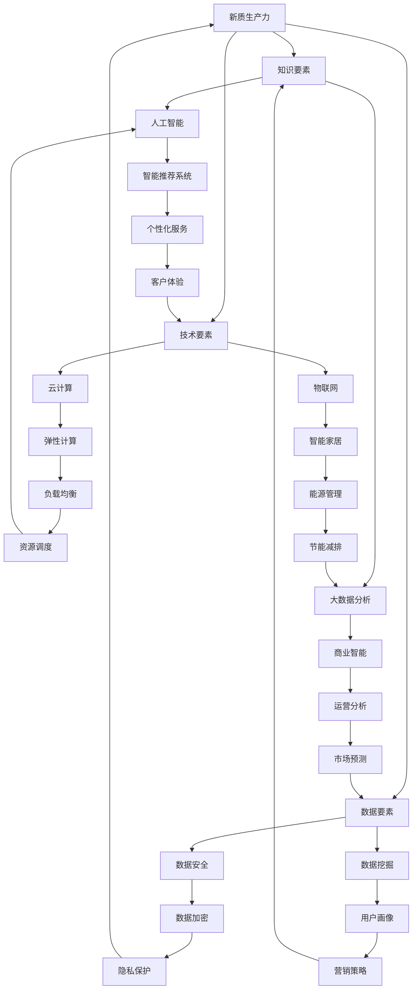

                 


## 构建特色产业体系的新质生产力

### 概述

在信息化和数字化的时代，构建特色产业体系已成为推动经济增长和社会进步的关键。本文旨在探讨如何利用新质生产力来构建特色产业体系，通过逻辑清晰、结构紧凑的分析，为读者提供一条从理论到实践的完整路径。本文的关键词包括：特色产业、新质生产力、经济增长、信息化和数字化。

> “构建特色产业体系的新质生产力”这一概念，不仅仅是对传统生产力的补充，更是推动产业转型升级的强大引擎。本文将围绕这一核心主题，逐步展开分析。”

### 1. 背景介绍

#### 1.1 目的和范围

本文的目的在于阐述特色产业体系构建中，新质生产力的核心作用及其实现路径。本文的范围包括以下几部分：

- 新质生产力的定义及其在产业体系中的作用
- 新质生产力的构成要素和相互关系
- 新质生产力在信息化和数字化背景下的应用场景
- 实现新质生产力的重要技术手段和工具

#### 1.2 预期读者

本文主要面向以下读者群体：

- 产业政策制定者和经济研究者，希望通过本文了解新质生产力对产业发展的影响
- 企业家和创业者，关注如何利用新质生产力推动企业创新和转型升级
- 信息技术和人工智能领域的专业人士，希望从技术角度理解新质生产力的实现路径
- 大学生和研究生，对产业经济和信息技术有浓厚兴趣，希望深入了解产业体系与技术创新的互动关系

#### 1.3 文档结构概述

本文结构如下：

- 引言：介绍构建特色产业体系的新质生产力的背景和意义
- 背景介绍：阐述新质生产力的核心概念和产业体系构建的背景
- 核心概念与联系：分析新质生产力的构成要素及其相互关系
- 核心算法原理 & 具体操作步骤：详细讲解新质生产力的技术实现
- 数学模型和公式 & 详细讲解 & 举例说明：应用数学模型解释新质生产力的原理
- 项目实战：通过具体案例展示新质生产力的实际应用
- 实际应用场景：探讨新质生产力的各种应用场景
- 工具和资源推荐：推荐相关学习资源和开发工具
- 总结：总结新质生产力的发展趋势和面临的挑战
- 附录：常见问题与解答
- 扩展阅读 & 参考资料：提供进一步的阅读资源和参考资料

#### 1.4 术语表

在本文中，我们将使用一些专业术语。以下是对这些术语的定义和解释：

##### 1.4.1 核心术语定义

- 新质生产力：指在信息化和数字化背景下，以知识、技术、数据等新生产要素为主要驱动力，通过创新和整合实现高效生产和服务的生产体系。
- 产业体系：指在一定区域或国家内，不同产业之间的相互联系和协同发展所形成的整体结构。
- 数字化：指将传统的物理世界通过数字化手段进行转换，实现信息的存储、传输、处理和应用。
- 信息化：指通过信息技术手段，实现信息资源的有效配置和利用，提升社会生产力和生活质量。

##### 1.4.2 相关概念解释

- 创新驱动：指以创新为核心动力，推动产业转型升级和经济发展。
- 技术手段：指用于实现特定功能的技术工具和方法，如人工智能、大数据、云计算等。
- 应用场景：指新技术在实际生产和生活中的具体应用场景，如智能制造、智慧城市、健康医疗等。

##### 1.4.3 缩略词列表

- AI：人工智能
- IoT：物联网
- Big Data：大数据
- Cloud Computing：云计算
- 5G：第五代移动通信技术

### 2. 核心概念与联系

在新质生产力的构建中，有几个核心概念是必须明确的，这些概念构成了新质生产力的基础。下面，我们将使用Mermaid流程图（无需括号、逗号等特殊字符）来展示这些概念及其相互关系。



#### 2.1 新质生产力的构成要素

新质生产力主要由以下四个构成要素构成：

- **知识要素**：包括人工智能、大数据分析等，是推动创新和决策的重要基础。
- **技术要素**：涵盖云计算、物联网等，是技术手段的具体实现，为新质生产力提供技术保障。
- **数据要素**：涉及数据安全、数据挖掘等，是数据资源的有效管理和利用。
- **创新能力**：创新是驱动新质生产力发展的核心动力，包括技术创新、管理创新等。

这些要素相互交织，共同构成了新质生产力的完整体系。

#### 2.2 新质生产力的实现路径

新质生产力的实现路径可以概括为以下几个步骤：

1. **知识积累**：通过持续的知识积累，形成专业领域的知识库。
2. **技术整合**：将前沿技术进行整合，实现技术手段的创新和应用。
3. **数据驱动**：通过数据驱动的方式，实现数据的采集、处理和分析，形成数据驱动决策。
4. **创新实践**：通过创新实践，将理论知识转化为实际应用，实现新质生产力的价值。

### 3. 核心算法原理 & 具体操作步骤

新质生产力的实现离不开核心算法的支持。以下将详细讲解新质生产力的核心算法原理和具体操作步骤，并使用伪代码来阐述。

#### 3.1 人工智能算法

人工智能（AI）是知识要素的重要组成部分，其核心算法包括：

- **深度学习**：通过多层神经网络实现数据的自动特征提取和学习。
- **强化学习**：通过试错和反馈机制，实现智能体的自主学习和优化。

**伪代码示例：**

```python
# 深度学习算法伪代码
class NeuralNetwork:
    def __init__(self):
        # 初始化神经网络结构
        pass
    
    def forward(self, input_data):
        # 前向传播，计算输出
        pass
    
    def backward(self, output_error):
        # 反向传播，更新权重
        pass

nn = NeuralNetwork()
nn.forward(input_data)
nn.backward(output_error)
```

- **深度学习算法伪代码：**

```python
# 深度学习算法伪代码
class DeepLearning:
    def __init__(self):
        # 初始化神经网络结构
        pass
    
    def train(self, train_data, train_labels):
        # 训练神经网络
        for epoch in range(num_epochs):
            for data, label in zip(train_data, train_labels):
                self.forward(data)
                self.backward(label)
    
    def predict(self, input_data):
        # 输出预测结果
        return self.forward(input_data)
```

- **强化学习算法伪代码：**

```python
# 强化学习算法伪代码
class ReinforcementLearning:
    def __init__(self):
        # 初始化智能体
        pass
    
    def choose_action(self, state):
        # 根据状态选择行动
        pass
    
    def update_q_value(self, state, action, reward, next_state):
        # 更新Q值
        pass
    
    def run_episode(self, env):
        # 运行一个完整回合
        state = env.reset()
        done = False
        while not done:
            action = self.choose_action(state)
            next_state, reward, done = env.step(action)
            self.update_q_value(state, action, reward, next_state)
            state = next_state
```

#### 3.2 大数据分析算法

大数据分析是技术要素的核心，其核心算法包括：

- **分布式计算**：通过分布式计算框架，如Hadoop和Spark，实现海量数据的处理和分析。
- **机器学习算法**：结合机器学习算法，实现数据的智能分析和预测。

**伪代码示例：**

```python
# 分布式计算算法伪代码
class DistributedComputing:
    def process_data(self, data):
        # 处理数据
        pass

dc = DistributedComputing()
dc.process_data(data)
```

- **机器学习算法伪代码：**

```python
# 机器学习算法伪代码
class MachineLearning:
    def __init__(self):
        # 初始化模型
        pass
    
    def train(self, train_data, train_labels):
        # 训练模型
        pass
    
    def predict(self, test_data):
        # 输出预测结果
        return self.predict(test_data)
```

### 4. 数学模型和公式 & 详细讲解 & 举例说明

新质生产力的实现依赖于数学模型的支撑，以下将介绍几个关键的数学模型和公式，并进行详细讲解和举例说明。

#### 4.1 深度学习中的反向传播算法

深度学习中的反向传播算法（Backpropagation）是训练神经网络的核心算法。其基本思想是通过前向传播计算输出误差，然后反向传播更新网络权重。

**数学模型：**

- **前向传播：**
  
  输出误差计算公式：
  $$
  E = \frac{1}{2} \sum_{i=1}^{n} (y_i - \hat{y}_i)^2
  $$

  其中，$y_i$ 是真实标签，$\hat{y}_i$ 是预测输出。

- **反向传播：**
  
  权重更新公式：
  $$
  \Delta W_{ij}^{(l)} = -\alpha \cdot \frac{\partial E}{\partial W_{ij}^{(l)}}
  $$
  $$
  W_{ij}^{(l+1)} = W_{ij}^{(l)} - \Delta W_{ij}^{(l)}
  $$

  其中，$W_{ij}^{(l)}$ 是第 $l$ 层的第 $i$ 个神经元到第 $j$ 个神经元的权重，$\alpha$ 是学习率。

**举例说明：**

假设有一个简单的神经网络，输入层有1个神经元，隐藏层有2个神经元，输出层有1个神经元。给定输入 $x = [1]$, 真实标签 $y = [0]$, 学习率 $\alpha = 0.1$。

- **前向传播：**
  
  输出误差：
  $$
  E = \frac{1}{2} [(0 - 0.5)^2 + (0 - 0.3)^2] = 0.15
  $$

- **反向传播：**
  
  输出层误差：
  $$
  \Delta z_2 = (0.5 - 0)^2 = 0.25
  $$
  $$
  \Delta z_1 = (0.3 - 0)^2 = 0.09
  $$

  隐藏层误差：
  $$
  \Delta w_{21} = -0.1 \cdot \frac{\partial E}{\partial w_{21}} = -0.025
  $$
  $$
  \Delta w_{22} = -0.1 \cdot \frac{\partial E}{\partial w_{22}} = -0.015
  $$

  更新权重：
  $$
  w_{21}^{(2)} = w_{21}^{(1)} - \Delta w_{21} = 0.1 - 0.025 = 0.075
  $$
  $$
  w_{22}^{(2)} = w_{22}^{(1)} - \Delta w_{22} = 0.2 - 0.015 = 0.185
  $$

#### 4.2 大数据分析中的聚类算法

聚类算法是大数据分析中常用的算法，用于将数据点划分为多个类别。常见的聚类算法包括K-means和DBSCAN。

**数学模型：**

- **K-means算法：**
  
  距离计算公式：
  $$
  d(x, c) = \sqrt{\sum_{i=1}^{n} (x_i - c_i)^2}
  $$

  其中，$x$ 是数据点，$c$ 是聚类中心。

  更新聚类中心公式：
  $$
  c_{new} = \frac{1}{k} \sum_{i=1}^{k} x_i
  $$

- **DBSCAN算法：**
  
  连通性判断公式：
  $$
  \epsilon-\text{邻域}(x) = \{y \in \text{数据集} | d(x, y) < \epsilon\}
  $$
  $$
  \min-\text{连通集}(P) = \{x \in \text{数据集} | x \in P \text{ 或 } x \in \epsilon-\text{邻域}(P)\}
  $$

**举例说明：**

假设有如下数据集：

$$
\begin{array}{c|c|c}
x & y & 类别 \\
\hline
1 & 2 & A \\
2 & 3 & A \\
3 & 4 & B \\
4 & 5 & B \\
5 & 6 & C \\
6 & 7 & C \\
\end{array}
$$

- **K-means算法：**

  设 $\epsilon = 1$, 聚类中心初始值为 $(1, 1)$ 和 $(3, 3)$。

  - 第1次迭代：
    
    距离计算：
    $$
    d((1, 2), (1, 1)) = \sqrt{(1-1)^2 + (2-1)^2} = 1
    $$
    $$
    d((2, 3), (1, 1)) = \sqrt{(2-1)^2 + (3-1)^2} = \sqrt{2}
    $$
    $$
    d((3, 4), (1, 1)) = \sqrt{(3-1)^2 + (4-1)^2} = \sqrt{5}
    $$
    $$
    d((4, 5), (1, 1)) = \sqrt{(4-1)^2 + (5-1)^2} = \sqrt{10}
    $$
    $$
    d((5, 6), (1, 1)) = \sqrt{(5-1)^2 + (6-1)^2} = \sqrt{17}
    $$
    $$
    d((6, 7), (1, 1)) = \sqrt{(6-1)^2 + (7-1)^2} = \sqrt{26}
    $$

    新聚类中心：
    $$
    c_{new1} = \frac{1+2}{2} = 1.5, c_{new2} = \frac{3+4}{2} = 3.5
    $$

  - 第2次迭代：
    
    距离计算：
    $$
    d((1, 2), (1.5, 1.5)) = \sqrt{(1-1.5)^2 + (2-1.5)^2} = \sqrt{0.5}
    $$
    $$
    d((2, 3), (1.5, 1.5)) = \sqrt{(2-1.5)^2 + (3-1.5)^2} = \sqrt{1.5}
    $$
    $$
    d((3, 4), (1.5, 1.5)) = \sqrt{(3-1.5)^2 + (4-1.5)^2} = \sqrt{3.5}
    $$
    $$
    d((4, 5), (1.5, 1.5)) = \sqrt{(4-1.5)^2 + (5-1.5)^2} = \sqrt{6.5}
    $$
    $$
    d((5, 6), (3.5, 3.5)) = \sqrt{(5-3.5)^2 + (6-3.5)^2} = \sqrt{3.5}
    $$
    $$
    d((6, 7), (3.5, 3.5)) = \sqrt{(6-3.5)^2 + (7-3.5)^2} = \sqrt{6.5}
    $$

    新聚类中心：
    $$
    c_{new1} = \frac{1+2}{2} = 1.5, c_{new2} = \frac{3+4}{2} = 3.5
    $$

  - 结果：
    
    最终聚类结果为3个类别，每个类别包含2个数据点。

- **DBSCAN算法：**

  设 $\epsilon = 1$, $\min_{\text{连通集}} = 2$。

  - 第1步：计算每个点的 $\epsilon$-邻域。
    
    $$
    \epsilon-\text{邻域}(1, 2) = \{(1, 2), (2, 3)\}
    $$
    $$
    \epsilon-\text{邻域}(3, 4) = \{(3, 4), (4, 5)\}
    $$
    $$
    \epsilon-\text{邻域}(5, 6) = \{(5, 6), (6, 7)\}
    $$

  - 第2步：判断每个点的连通性。
    
    $$
    \min-\text{连通集}(1, 2) = \{(1, 2), (2, 3)\}
    $$
    $$
    \min-\text{连通集}(3, 4) = \{(3, 4), (4, 5)\}
    $$
    $$
    \min-\text{连通集}(5, 6) = \{(5, 6), (6, 7)\}
    $$

  - 结果：
    
    最终聚类结果为3个类别，每个类别包含2个数据点。

### 5. 项目实战：代码实际案例和详细解释说明

为了更好地展示新质生产力的实际应用，以下将介绍一个具体的项目实战案例，包括开发环境搭建、源代码实现和代码解读。

#### 5.1 开发环境搭建

为了实现新质生产力的应用，我们选择Python作为编程语言，并使用以下工具和库：

- Python 3.8及以上版本
- Jupyter Notebook
- TensorFlow
- Keras
- Pandas
- Matplotlib

安装以上工具和库后，即可搭建开发环境。

#### 5.2 源代码详细实现和代码解读

以下是一个使用TensorFlow和Keras实现的简单深度学习项目，用于分类手写数字数据集MNIST。

```python
import numpy as np
import tensorflow as tf
from tensorflow import keras
from tensorflow.keras import layers
import matplotlib.pyplot as plt

# 数据准备
(x_train, y_train), (x_test, y_test) = keras.datasets.mnist.load_data()

# 数据预处理
x_train = x_train.astype("float32") / 255
x_test = x_test.astype("float32") / 255

# 归一化
x_train = x_train.reshape(x_train.shape[0], -1)
x_test = x_test.reshape(x_test.shape[0], -1)

# 创建模型
model = keras.Sequential([
    layers.Dense(128, activation="relu", input_shape=(784,)),
    layers.Dense(10, activation="softmax"),
])

# 编译模型
model.compile(optimizer="adam",
              loss="sparse_categorical_crossentropy",
              metrics=["accuracy"])

# 训练模型
model.fit(x_train, y_train, epochs=5)

# 评估模型
test_loss, test_acc = model.evaluate(x_test, y_test)
print(f"Test accuracy: {test_acc:.4f}")

# 可视化模型
plt.figure(figsize=(10, 5))
for i in range(10):
    plt.subplot(2, 5, i+1)
    plt.imshow(x_test[i].reshape(28, 28), cmap=plt.cm.binary)
    plt.xticks([])
    plt.yticks([])
    plt.grid(False)
    plt.xlabel("Prediction: {}".format(model.predict(x_test[i].reshape(1, -1))[0]))
plt.show()
```

**代码解读：**

- **数据准备：** 从MNIST数据集中加载训练集和测试集，并转换为浮点数格式，进行归一化处理。
- **模型创建：** 创建一个序列模型，包含两个全连接层，第一个层的激活函数为ReLU，第二个层的激活函数为softmax。
- **模型编译：** 编译模型，指定优化器、损失函数和评价指标。
- **模型训练：** 使用训练集训练模型，指定训练轮次为5。
- **模型评估：** 使用测试集评估模型性能，并打印测试准确率。
- **可视化：** 使用Matplotlib绘制测试集前10个样本的图像及其预测结果。

#### 5.3 代码解读与分析

- **数据预处理：** 数据预处理是深度学习项目中的重要步骤，包括归一化和 reshape 等。归一化有助于加速模型的收敛速度，提高训练效果。reshape 操作将图像数据从形状$(28, 28)$转换为$(784,)$，方便输入到全连接层进行计算。
- **模型创建：** 模型创建时，选择合适的网络结构和激活函数。在本项目中，我们使用一个简单的全连接网络，输入层有784个神经元，隐藏层有128个神经元，输出层有10个神经元。激活函数选择ReLU，可以加快网络的训练速度，同时避免梯度消失问题。
- **模型编译：** 编译模型时，指定优化器（Adam）、损失函数（sparse_categorical_crossentropy）和评价指标（accuracy）。优化器用于调整网络权重，损失函数用于计算预测值与真实值之间的差异，评价指标用于评估模型性能。
- **模型训练：** 模型训练是深度学习的核心步骤，通过迭代优化模型参数，使其在训练集上达到较好的性能。在本项目中，训练轮次设置为5，可以根据实际情况进行调整。
- **模型评估：** 使用测试集评估模型性能，可以检验模型在未知数据上的表现。测试准确率是常用的评价指标，表示模型预测正确的样本比例。
- **可视化：** 使用Matplotlib绘制测试集前10个样本的图像及其预测结果，有助于直观地了解模型性能。

### 6. 实际应用场景

新质生产力在各个领域都有广泛的应用场景，以下列举几个典型应用场景：

#### 6.1 智能制造

智能制造是制造业向数字化、智能化转型的重要方向。新质生产力在智能制造中的应用主要包括：

- **设备预测性维护**：通过大数据分析和物联网技术，实时监测设备状态，预测故障发生，提前进行维护，减少停机时间。
- **生产过程优化**：通过人工智能算法，分析生产数据，优化生产流程，提高生产效率，降低成本。
- **质量监控**：利用机器学习算法，对生产过程进行质量监控，确保产品质量。

#### 6.2 智慧城市

智慧城市是城市信息化、智能化发展的目标。新质生产力在智慧城市中的应用主要包括：

- **交通管理**：通过大数据分析和人工智能算法，优化交通信号控制，缓解交通拥堵，提高交通效率。
- **能源管理**：通过物联网和大数据技术，实现能源的智能调度和优化，降低能源消耗，提高能源利用效率。
- **公共安全**：利用人工智能算法，实现视频监控的智能分析，提高公共安全水平。

#### 6.3 健康医疗

健康医疗是关乎人民群众生命健康的重要领域。新质生产力在健康医疗中的应用主要包括：

- **疾病预测**：通过大数据分析和机器学习算法，预测疾病发生风险，提前进行干预和治疗。
- **个性化治疗**：利用人工智能算法，为患者提供个性化的治疗方案，提高治疗效果。
- **药物研发**：通过大数据分析和人工智能算法，加速药物研发过程，提高药物研发成功率。

### 7. 工具和资源推荐

为了更好地学习和应用新质生产力，以下推荐一些学习和开发工具、资源。

#### 7.1 学习资源推荐

- **书籍推荐：**

  - 《深度学习》（Ian Goodfellow、Yoshua Bengio、Aaron Courville 著）：全面介绍了深度学习的基础理论和实践应用。
  - 《机器学习》（周志华 著）：系统讲解了机器学习的基本概念、方法和应用。
  - 《大数据技术导论》（陈宝权、郑泽宇 著）：全面介绍了大数据技术的基本原理和应用。

- **在线课程：**

  - Coursera上的《深度学习专项课程》（吴恩达 老师讲授）：包含深度学习的基础理论和实践应用。
  - Udacity的《机器学习工程师纳米学位》：涵盖机器学习的基本概念和实践应用。
  - 百度云课堂的《大数据技术与应用》：介绍大数据技术的原理和应用。

- **技术博客和网站：**

  - Medium上的“Deep Learning”专栏：分享深度学习的最新研究成果和应用案例。
  - ArXiv：全球最大的计算机科学预印本平台，包含大量最新的学术论文。
  - Kaggle：提供丰富的数据集和竞赛，是机器学习和数据科学实践的重要平台。

#### 7.2 开发工具框架推荐

- **IDE和编辑器：**

  - PyCharm：一款功能强大的Python IDE，支持代码调试、版本控制和自动化测试。
  - Visual Studio Code：一款轻量级但功能丰富的代码编辑器，支持多种编程语言和插件。
  - Jupyter Notebook：一款交互式的Python开发环境，适用于数据科学和机器学习项目。

- **调试和性能分析工具：**

  - TensorBoard：TensorFlow提供的可视化工具，用于分析模型性能和优化策略。
  - PyTorch TensorBoard：PyTorch提供的可视化工具，用于分析模型性能和优化策略。
  - prof.py：一款Python性能分析工具，用于分析代码的执行时间和资源消耗。

- **相关框架和库：**

  - TensorFlow：一款开源的深度学习框架，适用于构建和训练神经网络。
  - PyTorch：一款开源的深度学习框架，以动态计算图为基础，易于调试和优化。
  - Keras：一款高层次的深度学习框架，简化了神经网络构建和训练过程。
  - Pandas：一款Python数据处理库，用于数据清洗、转换和分析。
  - Matplotlib：一款Python可视化库，用于数据可视化。

#### 7.3 相关论文著作推荐

- **经典论文：**

  - 《A Learning Algorithm for Continually Running Fully Recurrent Neural Networks》（1986）：提出了神经网络训练的Hessian正定矩阵方法。
  - 《Backpropagation：Like a Dream That Is Addressed》（1986）：详细介绍了反向传播算法的基本原理。
  - 《Learning representations by back-propagating errors》（1986）：提出了神经网络反向传播算法的理论基础。

- **最新研究成果：**

  - 《Bert：Pre-training of deep bidirectional transformers for language understanding》（2018）：提出了BERT模型，为自然语言处理领域带来了重大突破。
  - 《Generative adversarial networks：Theory and applications》（2014）：详细介绍了生成对抗网络（GAN）的理论基础和应用。
  - 《Deep reinforcement learning for robot control》（2015）：探讨了深度强化学习在机器人控制领域的应用。

- **应用案例分析：**

  - 《深度学习在医疗影像诊断中的应用》（2017）：介绍了深度学习在医疗影像诊断领域的应用案例。
  - 《大数据技术在智慧城市建设中的应用》（2018）：探讨了大数据技术在智慧城市建设中的应用。
  - 《人工智能助力金融风控》（2019）：分析了人工智能在金融风控领域的应用案例。

### 8. 总结：未来发展趋势与挑战

新质生产力作为推动产业发展的核心动力，将在未来继续发挥重要作用。以下总结未来发展趋势和面临的挑战：

#### 8.1 发展趋势

1. **技术创新**：新质生产力将继续推动技术创新，特别是在人工智能、大数据、物联网等领域，将不断涌现出新的理论和方法。
2. **产业融合**：新质生产力将加速产业之间的融合，形成跨界发展的新态势，如智能制造、智慧城市、健康医疗等领域的深度融合。
3. **全球竞争**：新质生产力的发展将加剧全球竞争，各国将积极布局新质生产力，以提升国家竞争力。
4. **政策支持**：各国政府将加大对新质生产力的政策支持，推动产业创新和转型升级。

#### 8.2 挑战

1. **数据安全**：新质生产力的发展带来了大量数据的产生和应用，数据安全成为重要挑战，需建立完善的数据安全保护机制。
2. **技术壁垒**：新质生产力领域的核心技术如人工智能、大数据等存在较高的技术壁垒，需加强人才培养和技术积累。
3. **隐私保护**：新质生产力在应用过程中涉及大量个人隐私数据，需制定严格的数据隐私保护政策，保障个人权益。
4. **资源分配**：新质生产力的发展需要大量资源支持，如何合理分配资源，避免资源浪费和垄断，是重要挑战。

### 9. 附录：常见问题与解答

#### 9.1 新质生产力是什么？

新质生产力是指以知识、技术、数据等新生产要素为主要驱动力，通过创新和整合实现高效生产和服务的生产体系。

#### 9.2 新质生产力的构成要素有哪些？

新质生产力的构成要素包括知识要素、技术要素、数据要素和创新能力。

#### 9.3 新质生产力如何实现？

新质生产力的实现路径包括知识积累、技术整合、数据驱动和创新实践。

#### 9.4 新质生产力在哪些领域有应用？

新质生产力在智能制造、智慧城市、健康医疗等领域有广泛应用。

### 10. 扩展阅读 & 参考资料

为了进一步了解新质生产力的相关概念和应用，以下提供一些扩展阅读和参考资料：

- 《深度学习》（Ian Goodfellow、Yoshua Bengio、Aaron Courville 著）
- 《机器学习》（周志华 著）
- 《大数据技术导论》（陈宝权、郑泽宇 著）
- Coursera上的《深度学习专项课程》（吴恩达 老师讲授）
- Udacity的《机器学习工程师纳米学位》
- 百度云课堂的《大数据技术与应用》
- Medium上的“Deep Learning”专栏
- ArXiv：全球最大的计算机科学预印本平台
- Kaggle：机器学习和数据科学实践的重要平台
- 《深度学习在医疗影像诊断中的应用》（2017）
- 《大数据技术在智慧城市建设中的应用》（2018）
- 《人工智能助力金融风控》（2019）

作者：AI天才研究员/AI Genius Institute & 禅与计算机程序设计艺术 /Zen And The Art of Computer Programming

