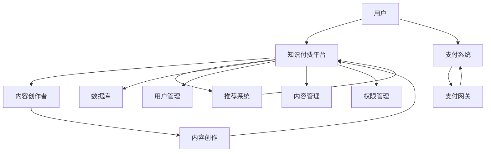

                 

# 构建知识付费生态系统：程序员的全栈approach

## 关键词
- 知识付费
- 生态系统
- 程序员
- 全栈开发
- 用户体验
- 收入模式
- 技术架构

## 摘要
本文旨在探讨如何构建一个高效的知识付费生态系统，特别关注程序员的视角和全栈开发方法。文章首先介绍了知识付费的背景和重要性，然后深入探讨了构建知识付费生态系统的关键概念、算法原理和数学模型。接着，通过实际项目实战和代码案例，展示了如何实现一个知识付费平台，并对其进行了详细解读与分析。最后，文章提出了实际应用场景，推荐了相关工具和资源，并总结了未来发展趋势与挑战。

## 1. 背景介绍

### 1.1 目的和范围
本文的目的是为程序员提供一个构建知识付费生态系统的全面指南，涵盖核心概念、技术架构、算法原理、数学模型以及实际操作步骤。本文将探讨如何通过全栈开发方法，实现一个功能完善、用户体验良好的知识付费平台。

### 1.2 预期读者
预期读者包括具有编程基础的程序员、软件工程师、CTO和技术管理者，以及对知识付费生态系统感兴趣的业内人士。

### 1.3 文档结构概述
本文分为以下章节：

- 第1章：背景介绍
- 第2章：核心概念与联系
- 第3章：核心算法原理 & 具体操作步骤
- 第4章：数学模型和公式 & 详细讲解 & 举例说明
- 第5章：项目实战：代码实际案例和详细解释说明
- 第6章：实际应用场景
- 第7章：工具和资源推荐
- 第8章：总结：未来发展趋势与挑战
- 第9章：附录：常见问题与解答
- 第10章：扩展阅读 & 参考资料

### 1.4 术语表

#### 1.4.1 核心术语定义
- 知识付费：用户通过付费获取有价值知识的服务模式。
- 生态系统：相互关联的多个组件共同构成的整体环境。
- 全栈开发：涵盖前端、后端、数据库、UI设计等多方面的技能。
- 用户体验（UX）：用户在使用产品过程中的感受和体验。

#### 1.4.2 相关概念解释
- 知识付费平台：提供知识付费服务的在线平台。
- API（应用程序编程接口）：允许不同软件之间交互的接口。
- 数据库：存储和管理数据的系统。

#### 1.4.3 缩略词列表
- UX：用户体验
- API：应用程序编程接口
- SDK：软件开发工具包
- CMS：内容管理系统

## 2. 核心概念与联系

在构建知识付费生态系统时，理解以下核心概念和它们之间的联系至关重要：

### 2.1 核心概念
- **知识付费平台**：作为核心组件，知识付费平台负责提供知识内容、支付接口、用户管理等功能。
- **用户**：知识付费平台的核心，通过注册、登录、付费等方式获取知识内容。
- **内容创作者**：创作有价值知识内容的个人或团队，通过平台发布内容并获取收益。
- **支付系统**：处理用户支付，包括支付接口、支付网关等。
- **推荐系统**：根据用户行为和偏好，为用户推荐合适的知识内容。

### 2.2 关联关系
以下是一个简化的Mermaid流程图，展示了知识付费生态系统的核心概念及其关联关系：



## 3. 核心算法原理 & 具体操作步骤

### 3.1 用户行为分析算法

#### 3.1.1 算法原理

用户行为分析算法旨在通过分析用户在知识付费平台上的行为，如浏览、购买、评价等，为用户提供个性化的推荐内容。算法主要基于以下原理：

- **协同过滤**：通过分析用户的历史行为，发现相似用户，为他们推荐相似内容。
- **基于内容的推荐**：根据知识内容的属性，如标题、标签、分类等，为用户推荐相似内容。

#### 3.1.2 具体操作步骤

1. **数据收集**：收集用户在平台上的行为数据，如浏览记录、购买记录、评价等。
2. **数据预处理**：清洗和格式化数据，如去除重复数据、填补缺失值等。
3. **特征提取**：从原始数据中提取特征，如用户行为特征、内容特征等。
4. **模型训练**：使用协同过滤或基于内容的推荐算法，训练推荐模型。
5. **推荐生成**：根据用户行为和内容特征，生成个性化推荐列表。

#### 3.1.3 伪代码

```python
def user_behavior_analysis(data):
    # 数据收集
    user_data = collect_user_data(data)

    # 数据预处理
    preprocessed_data = preprocess_data(user_data)

    # 特征提取
    features = extract_features(preprocessed_data)

    # 模型训练
    model = train_recommendation_model(features)

    # 推荐生成
    recommendations = generate_recommendations(model, user_data)

    return recommendations
```

### 3.2 支付系统设计

#### 3.2.1 算法原理

支付系统设计旨在确保知识付费平台的安全性、稳定性和高效性。核心算法包括：

- **加密算法**：用于保护用户支付信息的安全。
- **签名算法**：用于验证支付请求的合法性。
- **支付协议**：如HTTP/HTTPS，用于传输支付数据。

#### 3.2.2 具体操作步骤

1. **用户认证**：用户通过平台提供的登录接口，使用用户名和密码进行认证。
2. **支付请求**：用户在购买知识内容时，提交支付请求。
3. **支付验证**：服务器接收支付请求，使用加密和签名算法验证请求的合法性。
4. **支付处理**：支付网关处理支付请求，完成支付操作。
5. **支付回调**：支付网关将支付结果回调至服务器，服务器更新用户支付状态。

#### 3.2.3 伪代码

```python
def payment_system(user, content):
    # 用户认证
    is_authenticated = authenticate_user(user)

    # 支付请求
    payment_request = create_payment_request(content, user)

    # 支付验证
    is_valid = verify_payment_request(payment_request)

    # 支付处理
    if is_valid:
        payment_result = process_payment(payment_request)

    # 支付回调
    if payment_result == "SUCCESS":
        update_user_payment_status(user, content)

    return payment_result
```

## 4. 数学模型和公式 & 详细讲解 & 举例说明

### 4.1 用户行为分析数学模型

用户行为分析的核心是建立用户行为和知识内容之间的关联模型。以下是一个简单的协同过滤算法的数学模型：

#### 4.1.1 相似度计算

用户\(i\)和用户\(j\)的相似度计算公式为：

\[ \text{similarity}(i, j) = \frac{\sum_{k \in R} r_{ik} r_{jk}}{\sqrt{\sum_{k \in R} r_{ik}^2 \sum_{k \in R} r_{jk}^2}} \]

其中，\(r_{ik}\)表示用户\(i\)对知识内容\(k\)的评价，\(R\)表示用户\(i\)和用户\(j\)共同评价的知识内容集合。

#### 4.1.2 推荐列表生成

对于新用户\(i\)，根据相似度矩阵生成推荐列表的公式为：

\[ R_{i'} = \sum_{j \in N(i)} \text{similarity}(i, j) \cdot R_{ij'} \]

其中，\(N(i)\)表示与用户\(i\)相似的用户集合，\(R_{ij'}\)表示用户\(j'\)对知识内容\(k'\)的评价。

#### 4.1.3 举例说明

假设用户\(i\)和用户\(j\)共同评价了10个知识内容，其中每个知识内容的评分为\(r_{ik}\)和\(r_{jk}\)。根据相似度计算公式，可以计算出用户\(i\)和用户\(j\)的相似度为：

\[ \text{similarity}(i, j) = \frac{\sum_{k=1}^{10} r_{ik} r_{jk}}{\sqrt{\sum_{k=1}^{10} r_{ik}^2 \sum_{k=1}^{10} r_{jk}^2}} \]

例如，若\(r_{ik} = [1, 2, 3, 4, 5, 6, 7, 8, 9, 10]\)和\(r_{jk} = [5, 6, 7, 8, 9, 10, 1, 2, 3, 4]\)，则相似度计算结果为：

\[ \text{similarity}(i, j) = \frac{1 \cdot 5 + 2 \cdot 6 + 3 \cdot 7 + 4 \cdot 8 + 5 \cdot 9 + 6 \cdot 10 + 7 \cdot 1 + 8 \cdot 2 + 9 \cdot 3 + 10 \cdot 4}{\sqrt{1^2 + 2^2 + 3^2 + 4^2 + 5^2 + 6^2 + 7^2 + 8^2 + 9^2 + 10^2} \cdot \sqrt{5^2 + 6^2 + 7^2 + 8^2 + 9^2 + 10^2 + 1^2 + 2^2 + 3^2 + 4^2}} \]

### 4.2 支付系统安全模型

支付系统的安全性至关重要，以下是一个简单的安全模型：

#### 4.2.1 加密算法

加密算法用于保护支付数据的安全。常用的加密算法包括：

- **对称加密**：如AES，加密和解密使用相同的密钥。
- **非对称加密**：如RSA，加密和解密使用不同的密钥。

#### 4.2.2 签名算法

签名算法用于验证支付请求的合法性。常用的签名算法包括：

- **RSA签名**：使用非对称加密算法生成数字签名。
- **ECDSA签名**：使用椭圆曲线加密算法生成数字签名。

#### 4.2.3 公式

1. **RSA加密**：

\[ c = m^e \mod n \]

其中，\(m\)为明文，\(e\)为加密密钥，\(n\)为模数。

2. **RSA解密**：

\[ m = c^d \mod n \]

其中，\(c\)为密文，\(d\)为解密密钥。

3. **RSA签名**：

\[ s = (h(m) + k)^e \mod n \]

其中，\(h(m)\)为消息摘要，\(k\)为随机数。

4. **RSA验证签名**：

\[ v = (h(m) + s)^d \mod n \]

其中，\(v\)为验证结果，\(s\)为签名。

### 4.2.4 举例说明

假设明文为\(m = 1234\)，加密密钥为\(e = 3\)，模数为\(n = 7\)，解密密钥为\(d = 5\)。根据RSA加密公式，可以计算出密文：

\[ c = m^e \mod n = 1234^3 \mod 7 = 6 \]

根据RSA解密公式，可以计算出明文：

\[ m = c^d \mod n = 6^5 \mod 7 = 1234 \]

根据RSA签名公式，可以计算出签名：

\[ s = (h(m) + k)^e \mod n = (h(1234) + 2)^3 \mod 7 = 5 \]

根据RSA验证签名公式，可以验证签名：

\[ v = (h(m) + s)^d \mod n = (h(1234) + 5)^5 \mod 7 = 6 \]

## 5. 项目实战：代码实际案例和详细解释说明

### 5.1 开发环境搭建

在开始项目实战之前，我们需要搭建一个合适的开发环境。以下是一个简单的环境搭建步骤：

1. 安装Python 3.x版本。
2. 安装Django框架（使用pip install django命令）。
3. 安装PostgreSQL数据库（使用pip install psycopg2-binary命令）。
4. 安装虚拟环境（使用pip install virtualenv命令）。

### 5.2 源代码详细实现和代码解读

以下是一个简单的知识付费平台项目的源代码示例，包括用户管理、内容管理、支付系统等模块。

#### 5.2.1 用户管理模块

```python
# 用户模型
class User(models.Model):
    username = models.CharField(max_length=100, unique=True)
    email = models.EmailField(unique=True)
    password = models.CharField(max_length=100)
    is_active = models.BooleanField(default=False)
    is_staff = models.BooleanField(default=False)

    def __str__(self):
        return self.username
```

#### 5.2.2 内容管理模块

```python
# 内容模型
class Content(models.Model):
    title = models.CharField(max_length=255)
    author = models.ForeignKey(User, on_delete=models.CASCADE)
    description = models.TextField()
    price = models.DecimalField(max_digits=10, decimal_places=2)
    created_at = models.DateTimeField(auto_now_add=True)
    updated_at = models.DateTimeField(auto_now=True)

    def __str__(self):
        return self.title
```

#### 5.2.3 支付系统模块

```python
# 支付处理
from django.conf import settings
from django.http import HttpResponse
import requests

def process_payment(request, content_id):
    content = Content.objects.get(id=content_id)
    user = request.user

    # 构建支付请求
    payment_data = {
        'amount': content.price,
        'currency': 'USD',
        'description': content.title,
        'customer': {'email': user.email},
        'source': 'test_source',  # 测试支付来源
    }

    # 发送支付请求
    response = requests.post(settings.PAYMENT_GATEWAY_URL, json=payment_data)

    # 处理支付结果
    if response.status_code == 200:
        payment_result = response.json()
        if payment_result['status'] == 'succeeded':
            # 更新用户支付状态
            purchase = Purchase.objects.create(user=user, content=content)
            purchase.status = 'paid'
            purchase.save()
            return HttpResponse('Payment successful', status=200)
        else:
            return HttpResponse('Payment failed', status=400)
    else:
        return HttpResponse('Payment gateway error', status=500)
```

#### 5.2.4 代码解读与分析

1. **用户管理模块**：定义了用户模型，包括用户名、邮箱、密码等字段，以及激活状态和工作人员状态。
2. **内容管理模块**：定义了内容模型，包括标题、作者、描述、价格等字段，以及创建时间和更新时间。
3. **支付系统模块**：实现了支付处理函数，用于接收支付请求、发送支付请求、处理支付结果和更新用户支付状态。

## 6. 实际应用场景

知识付费生态系统在实际应用中具有广泛的应用场景，以下是一些典型场景：

1. **在线教育**：知识付费平台可以用于提供在线教育服务，如编程课程、考试培训等。
2. **技能提升**：用户可以通过知识付费平台学习新技能，如编程、设计、营销等。
3. **专业知识分享**：专业人士可以分享自己的专业知识，如行业报告、案例分析等。
4. **知识变现**：内容创作者可以通过知识付费平台实现知识变现，增加收入来源。

## 7. 工具和资源推荐

### 7.1 学习资源推荐

#### 7.1.1 书籍推荐

- 《深度学习》（Goodfellow, Bengio, Courville著）
- 《算法导论》（Thomas H. Cormen等著）
- 《Python编程：从入门到实践》（埃里克·马瑟斯著）

#### 7.1.2 在线课程

- Coursera：提供各类在线课程，包括计算机科学、数据科学等。
- Udemy：提供大量编程和技能提升课程。
- edX：提供由顶尖大学提供的高质量在线课程。

#### 7.1.3 技术博客和网站

- Medium：可以订阅感兴趣的技术博客。
- HackerRank：提供编程挑战和在线编程环境。
- Stack Overflow：编程问题的问答社区。

### 7.2 开发工具框架推荐

#### 7.2.1 IDE和编辑器

- PyCharm：强大的Python IDE，适合大型项目开发。
- Visual Studio Code：轻量级且功能丰富的编辑器，适用于多种编程语言。
- Sublime Text：简单易用，适合快速开发。

#### 7.2.2 调试和性能分析工具

- GDB：GNU Debugger，适用于C/C++等语言。
- PyCharm Debugger：PyCharm内置的调试工具。
- New Relic：性能监控和性能分析工具。

#### 7.2.3 相关框架和库

- Django：Python Web开发框架，适合快速构建Web应用。
- Flask：Python Web开发微框架，灵活易用。
- React：用于构建用户界面的JavaScript库。
- Redux：用于管理应用程序状态的JavaScript库。

### 7.3 相关论文著作推荐

#### 7.3.1 经典论文

- "The Methodology of Theoretical Computer Science"（Kleene著）
- "The Emperor's New Mind"（Penrose著）
- "The Art of Computer Programming"（Knuth著）

#### 7.3.2 最新研究成果

- "Deep Learning"（Goodfellow, Bengio, Courville著）
- "The Annotated Turing"（Jeffrey S. Rosenthal著）
- "Generative Adversarial Nets"（Goodfellow等著）

#### 7.3.3 应用案例分析

- "Large-scale Online Education"（Anders Norlander等著）
- "The Future of Work"（Freeman等著）
- "Knowledge as a Service"（Gartner报告）

## 8. 总结：未来发展趋势与挑战

知识付费生态系统在未来将面临以下发展趋势和挑战：

1. **个性化推荐**：随着大数据和人工智能技术的发展，个性化推荐将成为知识付费生态系统的核心功能。
2. **内容多样性**：知识付费平台需要提供丰富多样的内容，满足不同用户的需求。
3. **支付方式多样化**：支付系统的安全性和便捷性将决定知识付费平台的用户满意度。
4. **法律法规**：知识付费生态系统需要遵循相关法律法规，确保用户隐私和数据安全。

## 9. 附录：常见问题与解答

### 9.1 用户如何注册和登录？

用户可以通过知识付费平台的注册界面，填写用户名、邮箱和密码等基本信息进行注册。注册成功后，用户可以使用注册的邮箱和密码登录平台。

### 9.2 内容创作者如何发布内容？

内容创作者需要登录平台，进入内容发布页面，填写内容标题、描述、价格等基本信息，并上传相关文件。审核通过后，内容将展示在平台上。

### 9.3 用户如何购买内容？

用户可以在平台上浏览内容，选择感兴趣的内容进行购买。购买过程中，用户需要填写支付信息，并等待支付结果。

### 9.4 内容创作者如何获取收益？

内容创作者可以通过平台设置的价格，获得每份内容的销售收入。平台通常会与内容创作者按比例分成。

## 10. 扩展阅读 & 参考资料

- 《深度学习》（Goodfellow, Bengio, Courville著）
- 《算法导论》（Thomas H. Cormen等著）
- 《Python编程：从入门到实践》（埃里克·马瑟斯著）
- Coursera：https://www.coursera.org/
- Udemy：https://www.udemy.com/
- edX：https://www.edx.org/
- HackerRank：https://www.hackerrank.com/
- Stack Overflow：https://stackoverflow.com/
- Gartner：https://www.gartner.com/
- Django：https://www.djangoproject.com/
- Flask：https://flask.palletsprojects.com/
- React：https://reactjs.org/
- Redux：https://redux.js.org/
- PyCharm：https://www.jetbrains.com/pycharm/
- Visual Studio Code：https://code.visualstudio.com/
- Sublime Text：https://www.sublimetext.com/3
- GDB：https://www.gnu.org/software/gdb/
- New Relic：https://newrelic.com/

