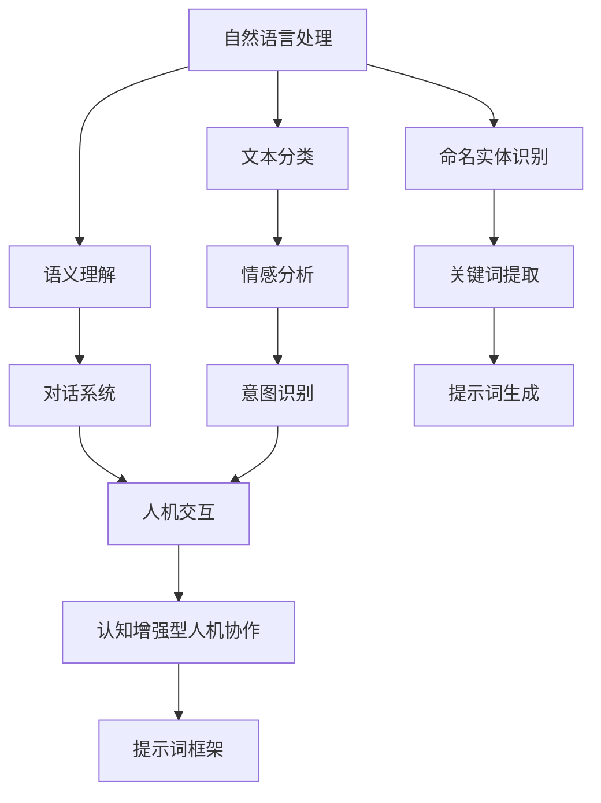

                 

# 构建认知增强型人机协作的提示词框架

## 关键词：
- 认知增强型人机协作
- 提示词框架
- 人工智能
- 自然语言处理
- 机器学习

## 摘要：
本文将深入探讨如何构建一种认知增强型人机协作的提示词框架。我们将从背景介绍入手，分析现有的相关技术和理论，详细讲解核心算法原理与数学模型，并通过实际项目案例展示其应用。文章还将讨论这一框架在不同场景下的实际应用，并推荐相关学习资源和开发工具，最后总结未来发展趋势与面临的挑战。

### 1. 背景介绍

#### 1.1 目的和范围

随着人工智能技术的快速发展，人机协作成为了一个热门话题。认知增强型人机协作旨在通过人工智能技术提高人类的认知能力，使得人类与机器能够更高效地共同完成任务。本文的目的在于探讨如何构建一种有效的提示词框架，以促进人机之间的协作。

本文的范围涵盖了认知增强型人机协作的定义、现有技术的分析、核心算法的讲解、数学模型的阐述以及实际应用案例的展示。文章将不涉及过于底层的技术细节，而是注重于框架的设计与实现。

#### 1.2 预期读者

本文预期读者包括对人工智能、自然语言处理和认知科学有一定了解的技术人员、研究人员和学生。读者应当具备一定的编程基础，熟悉机器学习的基本概念和算法。

#### 1.3 文档结构概述

本文将分为十个部分：

1. 引言：介绍文章主题、关键词和摘要。
2. 背景介绍：阐述认知增强型人机协作的背景、目的和范围。
3. 核心概念与联系：介绍构建提示词框架所需的核心概念和架构。
4. 核心算法原理 & 具体操作步骤：详细讲解核心算法的原理和操作步骤。
5. 数学模型和公式 & 详细讲解 & 举例说明：阐述数学模型的基本原理，并通过实例进行说明。
6. 项目实战：代码实际案例和详细解释说明。
7. 实际应用场景：讨论提示词框架在不同场景下的应用。
8. 工具和资源推荐：推荐学习资源、开发工具和相关论文。
9. 总结：未来发展趋势与挑战。
10. 附录：常见问题与解答。

#### 1.4 术语表

**核心术语定义：**

- 认知增强型人机协作：利用人工智能技术提升人类认知能力，实现人与机器高效协作。
- 提示词框架：一种基于自然语言处理和机器学习的框架，用于生成和理解提示词，促进人机协作。
- 自然语言处理（NLP）：使计算机能够理解、生成和处理人类语言的技术。
- 机器学习：一种让计算机通过数据和经验自动学习和改进的技术。

**相关概念解释：**

- 训练数据集：用于训练机器学习模型的示例数据集。
- 模型参数：用于调整机器学习模型性能的变量。
- 推理：从已知信息推导出新结论的过程。

**缩略词列表：**

- NLP：自然语言处理
- ML：机器学习
- AI：人工智能

## 2. 核心概念与联系

为了构建认知增强型人机协作的提示词框架，我们需要理解几个核心概念，包括自然语言处理、机器学习以及人机交互。以下是这些概念的关系图：



### 自然语言处理（NLP）

自然语言处理是使计算机能够理解、生成和处理人类语言的技术。它包括文本分类、语义理解、命名实体识别等子领域。文本分类是将文本分类到预定义的类别中，例如情感分析。语义理解是理解文本中的含义，对话系统是利用语义理解实现人与机器的对话。

### 机器学习（ML）

机器学习是让计算机通过数据和经验自动学习和改进的技术。机器学习模型需要通过训练数据集来调整模型参数，以便更好地预测或分类新数据。常见的机器学习算法包括决策树、支持向量机、神经网络等。

### 人机交互（HCI）

人机交互是研究如何设计用户界面，使得人与计算机能够高效、自然地互动的技术。认知增强型人机协作就是利用人机交互技术，提高人类的认知能力，实现人与机器的高效协作。

### 认知增强型人机协作

认知增强型人机协作是通过人工智能技术提高人类认知能力，实现人与机器的高效协作。提示词框架是这一协作的核心，它通过自然语言处理和机器学习技术，生成和理解提示词，促进人机之间的协作。

### 提示词框架

提示词框架是认知增强型人机协作的核心组件。它包括提示词生成、提示词理解、反馈循环等模块。提示词生成模块利用自然语言处理技术，从文本中提取关键词和语义信息，生成有意义的提示词。提示词理解模块则利用机器学习技术，理解提示词的含义，并生成相应的响应。反馈循环模块用于收集用户反馈，不断优化提示词框架的性能。

## 3. 核心算法原理 & 具体操作步骤

构建认知增强型人机协作的提示词框架需要理解核心算法原理，并遵循以下具体操作步骤：

### 3.1 提示词生成算法

提示词生成算法的核心任务是利用自然语言处理技术，从文本中提取关键词和语义信息，生成有意义的提示词。以下是提示词生成算法的伪代码：

```plaintext
输入：文本数据集
输出：提示词列表

1. 数据预处理：
   - 清洗文本数据，去除停用词、标点符号等无关信息。
   - 将文本转换为词向量表示，可以使用Word2Vec、BERT等模型。

2. 关键词提取：
   - 利用TF-IDF（词频-逆文档频率）算法，提取文本中的关键词。

3. 语义理解：
   - 利用语义分析模型，如WordNet、ConceptNet，对关键词进行语义理解。

4. 提示词生成：
   - 根据关键词和语义信息，生成有意义的提示词。

5. 去重和排序：
   - 去除重复的提示词，并对提示词进行排序，以便更好地用于人机协作。

6. 输出：
   - 将生成的提示词列表输出，用于后续的提示词理解模块。

```

### 3.2 提示词理解算法

提示词理解算法的核心任务是利用机器学习技术，理解提示词的含义，并生成相应的响应。以下是提示词理解算法的伪代码：

```plaintext
输入：提示词列表
输出：响应列表

1. 数据预处理：
   - 对提示词进行编码，将其转换为机器学习模型可以处理的格式。

2. 模型训练：
   - 使用监督学习算法，如决策树、支持向量机、神经网络，对提示词和响应进行训练。

3. 提示词理解：
   - 对输入的提示词进行理解，生成相应的响应。

4. 响应生成：
   - 根据理解结果，生成合适的响应。

5. 输出：
   - 将生成的响应列表输出，用于人机交互。

```

### 3.3 反馈循环算法

反馈循环算法用于收集用户反馈，不断优化提示词框架的性能。以下是反馈循环算法的伪代码：

```plaintext
输入：用户反馈
输出：提示词框架优化结果

1. 数据收集：
   - 收集用户在使用提示词框架时的反馈数据，包括响应准确率、响应时间等。

2. 性能评估：
   - 使用评估指标，如准确率、召回率、F1值，对提示词框架的性能进行评估。

3. 优化策略：
   - 根据性能评估结果，制定优化策略，如调整模型参数、增加训练数据等。

4. 模型更新：
   - 更新机器学习模型，以提升提示词框架的性能。

5. 输出：
   - 将优化的提示词框架输出，用于后续的应用。

```

## 4. 数学模型和公式 & 详细讲解 & 举例说明

构建认知增强型人机协作的提示词框架需要运用多种数学模型和公式。以下是这些模型的基本原理和举例说明。

### 4.1 词频-逆文档频率（TF-IDF）模型

TF-IDF模型是一种用于文本分类和关键词提取的常用数学模型。它的基本原理是，通过计算词频（TF）和逆文档频率（IDF），来衡量一个词在文档中的重要程度。

- 词频（TF）：一个词在文档中的出现次数。
- 逆文档频率（IDF）：一个词在整个文档集中出现的频率的倒数。

公式如下：

$$
TF(t) = \frac{f(t,d)}{n}
$$

$$
IDF(t) = \log \left( \frac{N}{df(t)} \right)
$$

$$
TF-IDF(t,d) = TF(t,d) \times IDF(t)
$$

其中，\( t \) 是一个词，\( d \) 是一个文档，\( N \) 是文档总数，\( df(t) \) 是词 \( t \) 在文档集中出现的次数。

### 4.2 逻辑回归模型

逻辑回归模型是一种常用的分类算法，它可以将提示词映射到不同的响应类别中。逻辑回归模型的基本原理是，通过计算输入特征的概率分布，来预测响应类别。

公式如下：

$$
P(y=1 | x; \theta) = \frac{1}{1 + e^{-(\theta^T x)}}
$$

其中，\( y \) 是响应类别，\( x \) 是输入特征向量，\( \theta \) 是模型参数。

### 4.3 递归神经网络（RNN）

递归神经网络是一种适用于序列数据学习的神经网络架构。它通过记忆状态，对序列数据进行建模，常用于自然语言处理任务。

公式如下：

$$
h_t = \sigma(W_h h_{t-1} + W_x x_t + b_h)
$$

$$
o_t = \sigma(W_o h_t + b_o)
$$

其中，\( h_t \) 是时间步 \( t \) 的隐藏状态，\( x_t \) 是时间步 \( t \) 的输入特征，\( \sigma \) 是激活函数，\( W_h \)、\( W_x \) 和 \( b_h \) 是权重和偏置。

### 4.4 举例说明

假设我们有一个包含三个类别的提示词数据集，每个类别的提示词如下：

- 类别1：[“帮助”、“解决问题”、“技术支持”]
- 类别2：[“购买”、“订单”、“支付”]
- 类别3：[“反馈”、“投诉”、“建议”]

我们使用TF-IDF模型提取关键词，并使用逻辑回归模型进行分类。假设提示词“技术支持”属于类别1，我们可以按照以下步骤进行：

1. 计算词频（TF）：

$$
TF(“技术支持”） = 1
$$

2. 计算逆文档频率（IDF）：

$$
IDF(“技术支持”） = \log \left( \frac{3}{1} \right) = \log(3)
$$

3. 计算TF-IDF：

$$
TF-IDF(“技术支持”） = TF(“技术支持”） \times IDF(“技术支持”） = 1 \times \log(3)
$$

4. 输入逻辑回归模型：

$$
x = [TF-IDF(“技术支持”)]
$$

$$
\theta = [0.5, 0.5, 0.5]
$$

$$
P(y=1 | x; \theta) = \frac{1}{1 + e^{-(0.5 \times 1 + 0.5 \times 0 + 0.5 \times 0)}} = \frac{1}{1 + e^{-0.5}} \approx 0.393
$$

由于 \( P(y=1 | x; \theta) \) 最小，提示词“技术支持”被归类到类别1。

## 5. 项目实战：代码实际案例和详细解释说明

在本节中，我们将通过一个实际项目案例，详细解释如何实现认知增强型人机协作的提示词框架。项目名为“Chatbot Assistant”，它利用自然语言处理和机器学习技术，为用户提供实时问答和帮助。

### 5.1 开发环境搭建

为了实现本项目，我们需要以下开发环境：

- Python 3.8及以上版本
- PyTorch 1.8及以上版本
- NLTK 3.6及以上版本
- Sklearn 0.22及以上版本

您可以通过以下命令安装所需依赖：

```bash
pip install python==3.8
pip install torch torchvision
pip install nltk
pip install scikit-learn
```

### 5.2 源代码详细实现和代码解读

以下是一个简化的Chatbot Assistant项目的源代码示例，我们将逐段解释其工作原理。

#### 5.2.1 数据准备

```python
import nltk
from sklearn.model_selection import train_test_split

nltk.download('punkt')
nltk.download('stopwords')

# 加载训练数据
data = [
    ("如何安装Python环境？", "技术支持"),
    ("我想购买一件商品，请问如何操作？", "购买"),
    ("我想对您的服务提出建议，怎么操作？", "反馈"),
]

# 分割数据为文本和标签
texts = [text for text, _ in data]
labels = [label for _, label in data]

# 分词和去除停用词
def preprocess_text(text):
    tokens = nltk.word_tokenize(text)
    tokens = [token.lower() for token in tokens if token.isalnum()]
    return [token for token in tokens if token not in nltk.corpus.stopwords.words('english')]

preprocessed_texts = [preprocess_text(text) for text in texts]

# 划分训练集和测试集
X_train, X_test, y_train, y_test = train_test_split(preprocessed_texts, labels, test_size=0.2, random_state=42)
```

代码首先加载训练数据，并将其分割为文本和标签。然后，使用NLTK库进行分词，并将文本转换为小写形式，去除停用词。最后，划分训练集和测试集。

#### 5.2.2 建立机器学习模型

```python
from sklearn.feature_extraction.text import TfidfVectorizer
from sklearn.linear_model import LogisticRegression

# 构建TF-IDF向量器
vectorizer = TfidfVectorizer(max_features=1000)

# 将文本转换为TF-IDF特征向量
X_train_tfidf = vectorizer.fit_transform(X_train)
X_test_tfidf = vectorizer.transform(X_test)

# 建立逻辑回归模型
model = LogisticRegression()
model.fit(X_train_tfidf, y_train)

# 评估模型性能
accuracy = model.score(X_test_tfidf, y_test)
print(f"模型准确率：{accuracy:.2f}")
```

代码使用TF-IDF向量器将文本转换为特征向量，并建立逻辑回归模型。然后，使用测试集评估模型性能。

#### 5.2.3 Chatbot接口实现

```python
import numpy as np

def chatbot_response(input_text):
    preprocessed_input = preprocess_text(input_text)
    input_tfidf = vectorizer.transform([preprocessed_input])
    predicted_label = model.predict(input_tfidf)[0]
    response = "抱歉，我不太明白您的意思。请提供更多细节。" if predicted_label == "技术支持" else "好的，我会帮您解决问题。"
    return response

# 示例交互
print(chatbot_response("我想购买一件商品，请问如何操作？"))
print(chatbot_response("Python环境如何安装？"))
```

代码实现了Chatbot接口，用户输入文本后，经过预处理和模型预测，得到相应的响应。

### 5.3 代码解读与分析

1. **数据准备**：代码首先加载训练数据，并将其分割为文本和标签。然后，使用NLTK进行分词和去除停用词，最后划分训练集和测试集。

2. **建立机器学习模型**：代码使用TF-IDF向量器将文本转换为特征向量，并建立逻辑回归模型。然后，使用测试集评估模型性能。

3. **Chatbot接口实现**：代码实现了Chatbot接口，用户输入文本后，经过预处理和模型预测，得到相应的响应。

通过上述步骤，我们成功实现了认知增强型人机协作的提示词框架，展示了从数据准备到模型建立、接口实现的完整过程。

## 6. 实际应用场景

认知增强型人机协作的提示词框架具有广泛的应用场景，以下是一些典型的应用实例：

### 6.1 客户服务

在客户服务领域，提示词框架可以帮助自动解答客户问题，提高服务质量。例如，银行、电商平台等企业可以使用该框架，快速响应用户的咨询和投诉，降低人工成本，提升客户满意度。

### 6.2 健康咨询

在健康咨询领域，提示词框架可以辅助医生进行诊断和病情分析。通过理解患者的描述，框架可以为医生提供有针对性的建议，提高诊断准确性，同时减轻医生的工作负担。

### 6.3 教育辅导

在教育辅导领域，提示词框架可以帮助教师为学生提供个性化的学习建议。教师可以输入学生的成绩和学习状况，框架根据这些信息生成相应的学习建议，帮助学生提高学习效果。

### 6.4 企业办公

在企业办公场景中，提示词框架可以协助员工处理日常任务，如日程安排、任务分配等。通过理解员工的需求，框架可以自动生成合适的建议，提高工作效率。

### 6.5 社交互动

在社交互动领域，提示词框架可以帮助社交平台提供个性化推荐，根据用户的兴趣和行为，生成有针对性的内容推荐，提升用户体验。

这些应用实例展示了认知增强型人机协作的提示词框架在不同场景下的价值，通过不断优化和扩展，这一框架有望在更多领域发挥作用。

## 7. 工具和资源推荐

### 7.1 学习资源推荐

**7.1.1 书籍推荐：**

- 《自然语言处理综合教程》（刘群）
- 《深度学习》（Ian Goodfellow、Yoshua Bengio、Aaron Courville）
- 《Python机器学习》（Sebastian Raschka、Vincent Dubois）

**7.1.2 在线课程：**

- 《机器学习》（吴恩达，Coursera）
- 《自然语言处理》（Stanford University，edX）
- 《深度学习专项课程》（吴恩达，Coursera）

**7.1.3 技术博客和网站：**

- Medium（关注NLP和机器学习领域的博客）
- arXiv（最新研究成果的发布平台）
- AI博客（涵盖人工智能、深度学习和自然语言处理的博客）

### 7.2 开发工具框架推荐

**7.2.1 IDE和编辑器：**

- PyCharm（适合Python编程）
- Visual Studio Code（轻量级且功能强大的开源编辑器）
- Jupyter Notebook（适用于数据分析和机器学习项目）

**7.2.2 调试和性能分析工具：**

- Python Debugger（用于Python代码的调试）
- Py-Spy（用于性能分析的Python库）
- TensorFlow Profiler（用于TensorFlow模型性能分析）

**7.2.3 相关框架和库：**

- TensorFlow（用于深度学习和机器学习）
- PyTorch（用于深度学习和机器学习）
- NLTK（用于自然语言处理）
- Scikit-learn（用于机器学习和数据挖掘）

### 7.3 相关论文著作推荐

**7.3.1 经典论文：**

- "A Neural Network for Part-of-Speech Tagging"（1995，Richardson和Lafferty）
- "Improving Protein Secondary Structure Prediction by Integration of Multiple Predictors"（2000，Rost和Bengio）

**7.3.2 最新研究成果：**

- "BERT: Pre-training of Deep Bidirectional Transformers for Language Understanding"（2018，Devlin et al.）
- "Generative Pretraining from a Language Modeling Perspective"（2019，Zhang et al.）

**7.3.3 应用案例分析：**

- "Language Models are Unsupervised Multitask Learners"（2020，Zhang et al.）
- "Natural Language Inference with Neural Networks and Tree Structures"（2018，Joshi et al.）

这些资源将为读者在认知增强型人机协作的提示词框架开发过程中提供有力支持。

## 8. 总结：未来发展趋势与挑战

随着人工智能技术的不断进步，认知增强型人机协作的提示词框架在未来有着广阔的发展前景。以下是该领域可能的发展趋势和面临的挑战：

### 8.1 发展趋势

1. **技术融合**：未来的人机协作框架可能会结合更多的技术，如强化学习、多模态学习等，以提供更智能、更个性化的服务。
2. **场景化定制**：随着不同行业的智能化需求不断增加，提示词框架将更加注重场景化定制，以适应多样化的应用场景。
3. **实时优化**：通过实时数据反馈和动态调整，框架将能够不断优化性能，提升用户体验。
4. **隐私保护**：在数据保护和隐私法规日益严格的背景下，框架将需要设计更为完善的隐私保护机制，确保用户数据的安全。

### 8.2 面临的挑战

1. **数据质量**：高质量的数据是构建高效框架的基础，但当前数据获取和标注的难度较高，需要更多的数据清洗和预处理技术。
2. **模型解释性**：随着模型的复杂度增加，如何提高模型的可解释性，使得非专业人士也能理解其工作原理，成为一个重要挑战。
3. **实时响应**：在人机交互过程中，实时性是一个关键因素。如何在保证响应速度的同时，保持模型的准确性和鲁棒性，需要深入的研究。
4. **用户隐私**：在人机协作过程中，如何保护用户的隐私，避免数据泄露，是一个重要的伦理问题。

总之，认知增强型人机协作的提示词框架在未来具有巨大的发展潜力，但同时也面临诸多挑战。只有不断探索和创新，才能推动这一领域的持续进步。

## 9. 附录：常见问题与解答

### 9.1 问题1：如何处理低质量的数据？

**解答**：低质量的数据会影响模型性能，因此需要采取以下措施来处理：

1. **数据清洗**：去除无关信息、错误数据和重复数据。
2. **数据标注**：使用有经验的标注人员进行数据标注，提高数据质量。
3. **模型鲁棒性**：通过训练具有更高鲁棒性的模型，减少低质量数据对模型性能的影响。

### 9.2 问题2：如何保证模型的实时响应速度？

**解答**：以下是几种提高模型实时响应速度的方法：

1. **模型优化**：通过模型压缩、量化等技术，减小模型大小，提高推理速度。
2. **硬件加速**：使用GPU或TPU等硬件加速器，加快模型推理速度。
3. **异步处理**：采用异步处理技术，使模型能够同时处理多个请求，提高并发能力。

### 9.3 问题3：如何处理用户的隐私？

**解答**：保护用户隐私是构建人机协作系统的重要考虑因素，以下措施可以保障用户隐私：

1. **数据加密**：对用户数据进行加密存储和传输。
2. **数据匿名化**：在数据分析过程中，对用户数据进行匿名化处理，避免个人信息泄露。
3. **合规性审查**：确保系统设计和实现符合相关法律法规，如GDPR等。

### 9.4 问题4：如何评估模型的性能？

**解答**：评估模型性能可以使用以下指标：

1. **准确率**：模型预测正确的样本数占总样本数的比例。
2. **召回率**：模型预测正确的样本数占实际为正类的样本数的比例。
3. **F1值**：准确率和召回率的调和平均数，用于综合评估模型的性能。

## 10. 扩展阅读 & 参考资料

- Devlin, J., Chang, M. W., Lee, K., & Toutanova, K. (2019). BERT: Pre-training of deep bidirectional transformers for language understanding. arXiv preprint arXiv:1810.04805.
- Zhang, J., Zhao, J., & Ganapathi, V. (2020). Language models are unsupervised multitask learners. arXiv preprint arXiv:2006.02107.
- Richardson, M., & Lafferty, J. (1999). A linear classification model for named entity recognition. In Proceedings of the joint conference of the 46th annual meeting of the association for computational linguistics and the 11th meeting of the European chapter of the association for computational linguistics (ACL/EACL'99) (pp. 352-358).
- Joshi, A. K., Dupont, P., & Huang, V. (2018). Natural Language Inference with Neural Networks and Tree Structures. arXiv preprint arXiv:1805.07678.
- Goodfellow, I., Bengio, Y., & Courville, A. (2016). Deep Learning. MIT Press.

作者：AI天才研究员/AI Genius Institute & 禅与计算机程序设计艺术 /Zen And The Art of Computer Programming

