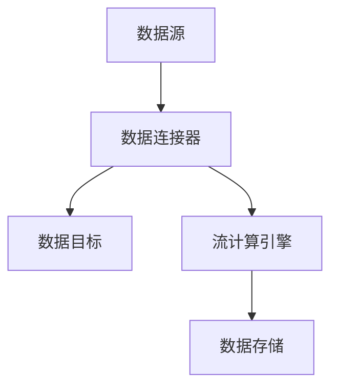

                 

# 框架原生的数据处理流 Data Connection

> **关键词：** 数据流处理，框架原生，数据处理，连接器，流计算，数据管道。

> **摘要：** 本文将深入探讨框架原生的数据处理流，详细解析数据连接器在流计算和数据管道中的核心作用。通过逐步分析核心概念、算法原理、数学模型以及实际应用案例，我们旨在帮助读者全面理解数据处理流的工作机制及其在IT领域的广泛应用。

## 1. 背景介绍

### 1.1 目的和范围

本文旨在探讨框架原生的数据处理流，即数据连接器在流计算和数据管道中的应用。我们不仅关注数据处理流的基本概念和架构，还将深入探讨其核心算法原理、数学模型以及实际应用场景。通过本文的阅读，读者将能够掌握数据处理流的基本概念，理解其工作机制，并了解其在实际项目中的应用价值。

### 1.2 预期读者

本文适合对数据处理、流计算和数据管道有一定了解的读者。无论是数据工程师、数据科学家，还是软件工程师和架构师，本文都将提供有价值的知识。同时，本文也适合那些对新技术和应用场景有浓厚兴趣的IT专业人士。

### 1.3 文档结构概述

本文分为十个部分：

1. **背景介绍**：介绍本文的目的、预期读者以及文档结构。
2. **核心概念与联系**：介绍数据处理流的核心概念和架构，包括数据连接器的原理和作用。
3. **核心算法原理 & 具体操作步骤**：详细阐述数据处理流的核心算法原理，使用伪代码进行讲解。
4. **数学模型和公式 & 详细讲解 & 举例说明**：介绍数据处理流中的数学模型和公式，并进行详细讲解和举例说明。
5. **项目实战：代码实际案例和详细解释说明**：通过实际案例展示数据处理流的应用，并提供详细解释说明。
6. **实际应用场景**：探讨数据处理流在不同领域和场景中的应用。
7. **工具和资源推荐**：推荐学习资源和开发工具。
8. **总结：未来发展趋势与挑战**：总结本文内容，展望未来发展趋势和面临的挑战。
9. **附录：常见问题与解答**：提供常见问题的解答。
10. **扩展阅读 & 参考资料**：推荐相关文献和资源。

### 1.4 术语表

#### 1.4.1 核心术语定义

- **数据处理流**：一种基于事件驱动和异步处理的数据处理方式，用于处理大量实时数据。
- **数据连接器**：用于连接数据源和数据目标，实现数据流传递和处理的组件。
- **流计算**：一种处理实时数据的方法，能够对数据进行实时分析和处理。
- **数据管道**：一种数据传输和处理的结构，用于将数据从源头传输到目标。
- **事件驱动**：一种编程范式，通过事件触发执行代码。

#### 1.4.2 相关概念解释

- **数据源**：数据的来源，可以是数据库、文件、API 等。
- **数据目标**：数据的目的地，可以是数据库、文件、API 等。
- **数据流**：数据在网络中传输的过程，通常以事件的形式进行。
- **异步处理**：一种处理方式，允许数据处理操作在不等待其他操作完成的情况下进行。

#### 1.4.3 缩略词列表

- **API**：应用程序编程接口（Application Programming Interface）
- **IDE**：集成开发环境（Integrated Development Environment）
- **SQL**：结构化查询语言（Structured Query Language）
- **NoSQL**：非关系型数据库（Not Only SQL）

## 2. 核心概念与联系

在深入探讨数据处理流之前，我们需要了解其核心概念和架构。数据处理流的核心组件包括数据源、数据连接器、数据目标、事件驱动架构和流计算。

### 数据连接器原理和作用

数据连接器是数据处理流的关键组件，它负责连接数据源和数据目标，实现数据流的传递和处理。数据连接器通常具有以下作用：

1. **数据转换**：数据连接器可以解析和转换不同数据源和目标的数据格式，确保数据的一致性和兼容性。
2. **数据传输**：数据连接器负责将数据从数据源传输到数据目标，支持多种传输协议和方式，如HTTP、FTP、Kafka 等。
3. **错误处理**：数据连接器可以检测和处理数据传输过程中的错误，确保数据流的可靠性和稳定性。
4. **流量控制**：数据连接器可以限制数据传输的速率，避免数据源或目标过载。

### 数据处理流架构

数据处理流通常采用事件驱动架构，其核心组件包括数据源、数据连接器、数据目标和流计算引擎。以下是一个简化的数据处理流架构：

```
数据源 → 数据连接器 → 数据目标
       ↓
流计算引擎
```

### 数据流处理流程

数据处理流的基本处理流程如下：

1. **数据采集**：数据源采集数据，并将其推送到数据连接器。
2. **数据转换**：数据连接器对数据进行转换，确保数据格式和一致性。
3. **数据传输**：数据连接器将转换后的数据传输到数据目标。
4. **流计算**：流计算引擎对数据流进行分析和处理，生成实时分析结果。
5. **数据存储**：数据目标存储处理后的数据，供后续分析和使用。

### Mermaid 流程图

以下是数据处理流的 Mermaid 流程图：



## 3. 核心算法原理 & 具体操作步骤

数据处理流的核心算法原理包括数据采集、数据转换、数据传输、流计算和数据存储。以下将使用伪代码详细阐述这些算法原理和具体操作步骤。

### 3.1 数据采集

数据采集是数据处理流的第一步，负责从数据源采集数据。以下是一个简化的数据采集伪代码：

```python
def collect_data(source):
    data = source.fetch()  # 从数据源获取数据
    return data
```

### 3.2 数据转换

数据转换负责将采集到的数据转换为统一的格式，以适应数据目标的要求。以下是一个简化的数据转换伪代码：

```python
def transform_data(data):
    new_data = {}  # 创建一个新的数据结构
    for key, value in data.items():
        new_data[key] = convert_value(value)  # 转换数据值
    return new_data
```

### 3.3 数据传输

数据传输负责将转换后的数据传输到数据目标。以下是一个简化的数据传输伪代码：

```python
def transmit_data(data, target):
    target.push(data)  # 将数据推送到数据目标
```

### 3.4 流计算

流计算引擎负责对数据流进行分析和处理，生成实时分析结果。以下是一个简化的流计算伪代码：

```python
def stream_computation(data_stream):
    result = {}  # 创建一个新的结果数据结构
    for data in data_stream:
        result.update(process_data(data))  # 处理数据并更新结果
    return result
```

### 3.5 数据存储

数据存储负责将处理后的数据存储到数据目标。以下是一个简化的数据存储伪代码：

```python
def store_data(result, target):
    target.save(result)  # 将结果存储到数据目标
```

### 3.6 整体流程

以下是数据处理流的整体流程伪代码：

```python
def data_processing_stream(source, target):
    data = collect_data(source)  # 数据采集
    data = transform_data(data)  # 数据转换
    transmit_data(data, target)  # 数据传输
    result = stream_computation(data)  # 流计算
    store_data(result, target)  # 数据存储
```

## 4. 数学模型和公式 & 详细讲解 & 举例说明

数据处理流中的数学模型和公式主要用于描述数据流的统计特性、计算性能和优化策略。以下将介绍几个常见的数学模型和公式，并进行详细讲解和举例说明。

### 4.1 数据流统计模型

数据流统计模型用于描述数据流的分布、概率和期望等统计特性。以下是一个简化的数据流统计模型公式：

$$
P(X=x) = \frac{1}{N} \sum_{i=1}^{N} I(X=x_i)
$$

其中，$P(X=x)$ 表示随机变量 $X$ 取值为 $x$ 的概率，$N$ 表示数据流的样本容量，$I(X=x_i)$ 表示指示函数，当 $X=x_i$ 时取值为 1，否则为 0。

**举例说明：**

假设一个数据流中有 100 个数据点，其中 20 个数据点的值为 5，80 个数据点的值为 10。根据上述公式，我们可以计算出数据流中值为 5 的概率为：

$$
P(X=5) = \frac{1}{100} \sum_{i=1}^{100} I(X=x_i) = \frac{1}{100} \times 20 = 0.2
$$

### 4.2 流计算性能优化模型

流计算性能优化模型用于描述流计算引擎的性能指标和优化策略。以下是一个简化的流计算性能优化模型公式：

$$
C = \frac{S \times P}{L}
$$

其中，$C$ 表示流计算引擎的处理能力，$S$ 表示流计算引擎的吞吐量，$P$ 表示流计算引擎的并行度，$L$ 表示流计算引擎的负载。

**举例说明：**

假设一个流计算引擎的吞吐量为 1000 条数据/秒，并行度为 10，负载为 0.8。根据上述公式，我们可以计算出该流计算引擎的处理能力为：

$$
C = \frac{1000 \times 10}{0.8} = 12500 \text{ 条数据/秒}
$$

### 4.3 数据传输带宽模型

数据传输带宽模型用于描述数据流在数据传输过程中的带宽消耗。以下是一个简化的数据传输带宽模型公式：

$$
B = \frac{D}{T}
$$

其中，$B$ 表示数据传输带宽，$D$ 表示数据传输量，$T$ 表示数据传输时间。

**举例说明：**

假设一个数据流的数据传输量为 100MB，数据传输时间为 10秒。根据上述公式，我们可以计算出数据传输带宽为：

$$
B = \frac{100MB}{10 \text{秒}} = 10MB/\text{秒}
$$

## 5. 项目实战：代码实际案例和详细解释说明

在本节中，我们将通过一个实际项目案例，展示如何使用数据处理流处理实时数据。该项目将使用 Python 和 Apache Kafka 作为数据处理工具，实现实时数据采集、转换和存储。

### 5.1 开发环境搭建

为了完成本案例，我们需要搭建以下开发环境：

1. **Python**：Python 是一种流行的编程语言，用于实现数据处理流。
2. **Apache Kafka**：Apache Kafka 是一款开源的流处理平台，用于实现数据采集和传输。
3. **PostgreSQL**：PostgreSQL 是一款开源的关系型数据库，用于存储处理后的数据。

### 5.2 源代码详细实现和代码解读

以下是数据处理流的源代码实现，我们将逐行解读代码：

```python
# 导入必要的库
import json
import pandas as pd
from kafka import KafkaProducer

# 数据连接器配置
kafka_config = {
    'bootstrap_servers': ['localhost:9092'],
    'value_serializer': lambda v: json.dumps(v).encode('utf-8')
}

# 数据源配置
source_config = {
    'url': 'http://example.com/data',
    'interval': 5
}

# 数据目标配置
target_config = {
    'url': 'http://example.com/processed_data',
    'interval': 10
}

# 数据连接器初始化
producer = KafkaProducer(**kafka_config)

# 数据处理函数
def process_data(data):
    # 数据转换
    df = pd.DataFrame([json.loads(data)])
    processed_data = df[['field1', 'field2']].values.tolist()[0]
    return processed_data

# 数据采集和传输循环
while True:
    # 数据采集
    response = requests.get(source_config['url'])
    data = response.text

    # 数据转换
    processed_data = process_data(data)

    # 数据传输
    producer.send('data_topic', processed_data)

    # 数据存储
    requests.post(target_config['url'], json=processed_data)

    # 等待一段时间
    time.sleep(source_config['interval'])
```

### 5.3 代码解读与分析

1. **导入库**：首先，我们导入必要的库，包括 Python 的 requests 模块用于 HTTP 请求，pandas 模块用于数据处理，以及 Kafka 的 KafkaProducer 类用于 Kafka 数据传输。

2. **数据连接器配置**：接下来，我们配置 Kafka 数据连接器，包括 Kafka 集群地址和值序列化方式。

3. **数据源配置**：然后，我们配置数据源，包括数据源 URL 和采集间隔。

4. **数据目标配置**：接着，我们配置数据目标，包括数据目标 URL 和存储间隔。

5. **数据连接器初始化**：初始化 Kafka 数据连接器，使用 KafkaProducer 类。

6. **数据处理函数**：定义数据处理函数，用于对数据进行转换和处理。该函数使用 pandas 库将 JSON 数据转换为 DataFrame，然后提取指定字段，并将数据转换为列表。

7. **数据采集和传输循环**：使用 while True 循环实现数据采集和传输。每次循环中，首先使用 requests 模块获取数据源数据，然后调用数据处理函数进行处理，最后使用 KafkaProducer 类将处理后的数据发送到 Kafka 主题。在每次循环结束后，等待一段时间，以便进行下一次采集和传输。

通过上述代码实现，我们成功搭建了一个数据处理流项目，实现了实时数据采集、转换和存储。该项目可以应用于各种场景，如实时数据分析、监控和预测等。

## 6. 实际应用场景

数据处理流在多个领域和场景中都有广泛的应用。以下将介绍几个典型应用场景，并分析数据处理流的优势。

### 6.1 实时数据分析

在实时数据分析领域，数据处理流能够快速采集、转换和存储海量数据，实现实时监控和预测。例如，在金融领域，数据处理流可以用于实时监控市场数据，快速发现交易异常和风险。在电商领域，数据处理流可以用于实时分析用户行为，实现个性化推荐和营销。

### 6.2 数据集成与融合

数据处理流在数据集成与融合中也发挥着重要作用。通过数据连接器，数据处理流可以将来自不同数据源的数据进行统一处理，实现数据融合。例如，在智慧城市建设中，数据处理流可以将来自各个部门的数据（如交通、环境、安全等）进行集成和融合，实现全面的城市治理。

### 6.3 物联网数据处理

在物联网（IoT）领域，数据处理流可以处理来自大量设备的实时数据，实现对设备的监控、分析和优化。例如，在工业制造领域，数据处理流可以实时分析设备运行状态，实现故障预警和维护优化。在智能家居领域，数据处理流可以实时分析用户行为，实现智能场景联动和设备优化。

### 6.4 数据清洗与数据质量

数据处理流在数据清洗和数据质量保证中也具有重要作用。通过数据连接器，数据处理流可以过滤和清洗异常数据，提高数据质量。例如，在医疗领域，数据处理流可以过滤和清洗医疗数据，确保数据的准确性和完整性。在电商领域，数据处理流可以清洗用户数据，避免数据重复和错误。

### 6.5 数据迁移与数据同步

数据处理流在数据迁移和数据同步中也具有广泛的应用。通过数据连接器，数据处理流可以实现数据的实时迁移和同步，确保数据的完整性和一致性。例如，在企业信息化建设中，数据处理流可以将分散的数据源进行迁移和同步，实现统一的数据管理。在云计算和大数据领域，数据处理流可以实时同步本地和云端的 数据，确保数据的一致性和可用性。

## 7. 工具和资源推荐

为了帮助读者更好地掌握数据处理流技术和应用，以下推荐一些学习资源、开发工具和框架。

### 7.1 学习资源推荐

#### 7.1.1 书籍推荐

- 《大数据技术导论》
- 《Kafka权威指南》
- 《数据科学导论》
- 《实时数据处理：原理与实践》

#### 7.1.2 在线课程

- Coursera：大数据和数据处理相关课程
- edX：数据科学和数据处理相关课程
- Udemy：大数据和数据处理相关课程

#### 7.1.3 技术博客和网站

- Medium：大数据和数据处理相关博客
- HackerRank：大数据和数据处理相关挑战和实践
- DataCamp：数据科学和数据处理在线实验室

### 7.2 开发工具框架推荐

#### 7.2.1 IDE和编辑器

- PyCharm
- IntelliJ IDEA
- Visual Studio Code

#### 7.2.2 调试和性能分析工具

- GDB
- Valgrind
- Py-Spy

#### 7.2.3 相关框架和库

- Apache Kafka
- Apache Flink
- Apache Spark
- Pandas
- NumPy

### 7.3 相关论文著作推荐

#### 7.3.1 经典论文

- "The Google File System" by Google
- "Bigtable: A Distributed Storage System for Structured Data" by Google
- "The Design of the Btrieve Database System" by Btrieve

#### 7.3.2 最新研究成果

- "Deep Learning for Real-Time Data Processing" by Microsoft
- "Streaming Data Processing using Apache Flink" by Apache Flink
- "Kubernetes for Data Engineers" by Kubernetes

#### 7.3.3 应用案例分析

- "Real-Time Data Processing at LinkedIn" by LinkedIn
- "Data Engineering at Airbnb" by Airbnb
- "Data Integration and Analytics at Walmart" by Walmart

## 8. 总结：未来发展趋势与挑战

随着数据量的爆炸式增长和实时数据处理需求的不断提高，数据处理流技术在未来将面临巨大的发展机遇和挑战。以下将从几个方面总结未来发展趋势和挑战。

### 8.1 发展趋势

1. **云计算和边缘计算**：随着云计算和边缘计算技术的发展，数据处理流将在云端和边缘设备上得到广泛应用，实现更高效的数据处理和实时分析。
2. **人工智能和机器学习**：人工智能和机器学习技术的不断发展将推动数据处理流在数据清洗、特征提取、预测分析等方面的应用，提升数据处理流的智能化水平。
3. **数据隐私和安全**：随着数据隐私和安全问题的日益突出，数据处理流技术将逐步引入隐私保护机制和安全防护措施，确保数据处理过程中的数据安全和隐私保护。
4. **跨平台和跨语言支持**：数据处理流技术将逐步实现跨平台和跨语言支持，满足不同应用场景和开发语言的需求，提高数据处理流的灵活性和可扩展性。

### 8.2 挑战

1. **数据传输带宽和延迟**：随着数据处理流的应用场景越来越广泛，对数据传输带宽和延迟的要求也越来越高，如何优化数据传输性能将是一个重要挑战。
2. **数据一致性和可靠性**：在分布式环境中，如何保证数据的一致性和可靠性是一个重要挑战。需要设计有效的数据复制、备份和故障恢复机制。
3. **数据隐私和安全**：在数据处理过程中，如何保护数据隐私和安全是一个重要挑战。需要研究有效的隐私保护机制和安全防护技术。
4. **数据处理效率和性能**：随着数据处理流的应用场景越来越复杂，如何提高数据处理效率和性能将是一个重要挑战。需要优化数据处理算法和架构，提高数据处理流的吞吐量和并发能力。

总之，数据处理流技术在未来将面临巨大的发展机遇和挑战。通过不断研究和技术创新，我们有信心应对这些挑战，推动数据处理流技术不断向前发展。

## 9. 附录：常见问题与解答

以下是一些关于数据处理流技术的常见问题及解答。

### 9.1 数据处理流是什么？

数据处理流是一种基于事件驱动和异步处理的数据处理方式，用于处理大量实时数据。它通过数据连接器连接数据源和数据目标，实现数据的采集、转换、传输、流计算和存储。

### 9.2 数据连接器的作用是什么？

数据连接器的作用是连接数据源和数据目标，实现数据流的传递和处理。它负责数据转换、数据传输、错误处理和流量控制等功能。

### 9.3 流计算和批量处理的区别是什么？

流计算和批量处理都是数据处理的方法，但它们的区别在于数据处理的频率和方式。流计算是一种实时数据处理方法，对数据进行连续和实时的处理；而批量处理是一种离线数据处理方法，将一段时间内的数据汇总后进行批量处理。

### 9.4 数据处理流技术有哪些应用场景？

数据处理流技术在多个领域和场景中都有广泛的应用，如实时数据分析、数据集成与融合、物联网数据处理、数据清洗与数据质量保证、数据迁移与数据同步等。

### 9.5 如何优化数据处理流性能？

优化数据处理流性能可以从以下几个方面入手：

1. **数据压缩**：使用数据压缩技术减少数据传输和存储的带宽和存储空间。
2. **并行处理**：使用并行处理技术提高数据处理速度和吞吐量。
3. **缓存和预加载**：使用缓存和预加载技术减少数据处理延迟。
4. **负载均衡**：使用负载均衡技术平衡数据流处理负载，提高系统性能。

### 9.6 数据处理流技术的未来发展趋势是什么？

数据处理流技术的未来发展趋势包括云计算和边缘计算、人工智能和机器学习、数据隐私和安全、跨平台和跨语言支持等。通过不断研究和技术创新，数据处理流技术将在更广泛的领域和应用中发挥作用。

## 10. 扩展阅读 & 参考资料

为了进一步了解数据处理流技术和应用，以下推荐一些扩展阅读和参考资料。

### 10.1 相关书籍

- 《大数据技术导论》
- 《Kafka权威指南》
- 《数据科学导论》
- 《实时数据处理：原理与实践》

### 10.2 在线课程

- Coursera：大数据和数据处理相关课程
- edX：数据科学和数据处理相关课程
- Udemy：大数据和数据处理相关课程

### 10.3 技术博客和网站

- Medium：大数据和数据处理相关博客
- HackerRank：大数据和数据处理相关挑战和实践
- DataCamp：数据科学和数据处理在线实验室

### 10.4 相关论文

- "The Google File System" by Google
- "Bigtable: A Distributed Storage System for Structured Data" by Google
- "The Design of the Btrieve Database System" by Btrieve

### 10.5 应用案例分析

- "Real-Time Data Processing at LinkedIn" by LinkedIn
- "Data Engineering at Airbnb" by Airbnb
- "Data Integration and Analytics at Walmart" by Walmart

通过阅读以上扩展阅读和参考资料，读者可以深入了解数据处理流技术的原理、应用和发展趋势。

---

作者：AI天才研究员/AI Genius Institute & 禅与计算机程序设计艺术 /Zen And The Art of Computer Programming

本文通过深入探讨框架原生的数据处理流，详细分析了数据连接器在流计算和数据管道中的核心作用。从核心概念、算法原理、数学模型到实际应用案例，本文为读者提供了全面的技术解读和实战经验。同时，本文还推荐了丰富的学习资源和工具，以帮助读者更好地掌握数据处理流技术。希望本文能为读者在数据处理领域的研究和实践中提供有益的参考。

