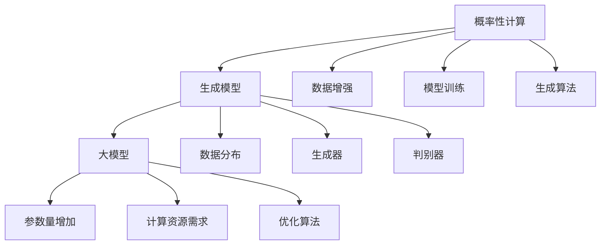

                 

# 概率性计算：大模型的生成模型

> **关键词：** 概率性计算、生成模型、大模型、机器学习、算法原理

> **摘要：** 本文将深入探讨概率性计算在生成模型中的应用，分析大模型在生成模型设计中的优势，以及具体的算法原理、数学模型和项目实战案例。通过本文，读者将全面了解概率性计算在大模型生成模型中的重要性，掌握相关的技术原理和实际操作方法。

## 1. 背景介绍

### 1.1 目的和范围

本文旨在详细探讨概率性计算在生成模型中的应用，特别是大模型的生成模型设计。我们将首先介绍概率性计算的基本概念，然后深入探讨其在生成模型中的关键作用。接着，我们将介绍大模型的概念和其在生成模型设计中的优势。文章将涵盖以下内容：

- 概率性计算的基本概念和原理
- 大模型在生成模型设计中的优势
- 大模型的生成算法原理和数学模型
- 实际项目中的代码实现和案例分析
- 相关工具和资源的推荐

通过本文的学习，读者将能够：

- 理解概率性计算的基本概念和原理
- 掌握大模型在生成模型设计中的优势和应用
- 理解大模型的生成算法原理和数学模型
- 掌握实际项目中的代码实现和案例分析
- 获得相关的工具和资源推荐

### 1.2 预期读者

本文适合以下读者群体：

- 对机器学习和生成模型有一定了解的技术人员
- 对概率性计算感兴趣的研究生和博士生
- 对大模型和生成模型设计有深入研究的工程师
- 想要提升自己在生成模型设计领域技术水平的开发人员

### 1.3 文档结构概述

本文分为十个主要部分，具体如下：

1. **背景介绍**：介绍本文的目的、范围、预期读者和文档结构。
2. **核心概念与联系**：介绍概率性计算和生成模型的基本概念和联系，并使用Mermaid流程图进行展示。
3. **核心算法原理 & 具体操作步骤**：详细讲解概率性计算在生成模型中的应用原理和具体操作步骤，使用伪代码进行阐述。
4. **数学模型和公式 & 详细讲解 & 举例说明**：介绍大模型生成算法的数学模型和公式，并使用具体例子进行说明。
5. **项目实战：代码实际案例和详细解释说明**：通过实际代码案例展示大模型生成模型的应用。
6. **实际应用场景**：介绍概率性计算和大模型在生成模型中的实际应用场景。
7. **工具和资源推荐**：推荐学习资源、开发工具框架和相关论文著作。
8. **总结：未来发展趋势与挑战**：总结本文的主要内容，并展望未来发展趋势和面临的挑战。
9. **附录：常见问题与解答**：解答读者可能遇到的常见问题。
10. **扩展阅读 & 参考资料**：提供相关的扩展阅读和参考资料。

### 1.4 术语表

#### 1.4.1 核心术语定义

- **概率性计算**：一种基于概率理论的计算方法，用于处理不确定性和随机性。
- **生成模型**：一种机器学习模型，能够生成新的数据样本，通常用于数据增强和生成式对抗网络（GAN）。
- **大模型**：具有巨大参数量和计算量的模型，通常用于处理大规模数据和复杂任务。
- **生成算法**：用于生成新数据的算法，包括随机采样、马尔可夫链等。

#### 1.4.2 相关概念解释

- **概率分布**：描述随机变量取值的概率分布函数。
- **梯度下降**：一种优化算法，用于最小化损失函数。
- **生成式对抗网络（GAN）**：一种生成模型，由生成器和判别器组成，通过对抗训练生成真实数据。

#### 1.4.3 缩略词列表

- **GAN**：生成式对抗网络（Generative Adversarial Networks）
- **DNN**：深度神经网络（Deep Neural Networks）
- **CNN**：卷积神经网络（Convolutional Neural Networks）
- **RNN**：循环神经网络（Recurrent Neural Networks）
- **GANs**：生成式对抗网络（Generative Adversarial Networks）

## 2. 核心概念与联系

在深入探讨概率性计算在大模型生成模型中的应用之前，我们需要先了解相关的基本概念和它们之间的联系。以下是概率性计算、生成模型和大模型的核心概念及其相互关系。

### 2.1 概率性计算

概率性计算是基于概率理论的计算方法，它利用概率分布和随机过程来处理不确定性和随机性。概率性计算的基本原理是，通过对样本进行统计和分析，来估计总体概率分布和随机变量的取值。在机器学习中，概率性计算广泛应用于分类、回归、生成等任务。

#### 概率性计算的核心概念：

- **概率分布**：描述随机变量取值的概率分布函数。
- **随机变量**：表示可能取不同值的变量。
- **条件概率**：在给定某个条件下，某个事件发生的概率。
- **贝叶斯定理**：用于计算后验概率，通过先验概率和似然函数推导得到。

### 2.2 生成模型

生成模型是一种机器学习模型，能够生成新的数据样本，从而扩展数据集。生成模型通常用于数据增强、风格迁移、图像生成等任务。生成模型的核心目标是学习数据分布，并生成符合数据分布的新样本。

#### 生成模型的核心概念：

- **数据分布**：描述数据集的概率分布。
- **生成器**：负责生成新数据样本的模型。
- **判别器**：负责区分真实数据和生成数据的模型。
- **对抗训练**：生成器和判别器通过对抗训练来提高生成质量和判别能力。

### 2.3 大模型

大模型是指具有巨大参数量和计算量的模型，通常用于处理大规模数据和复杂任务。大模型在机器学习领域的发展具有重要意义，它使得机器学习模型能够处理更复杂的数据和任务，从而实现更高的性能和更广泛的应用。

#### 大模型的核心概念：

- **参数量**：模型中参数的总数。
- **计算量**：模型在训练和推理过程中所需的计算资源。
- **并行计算**：利用多核处理器或分布式计算资源来加速模型训练和推理。
- **优化算法**：用于最小化损失函数的算法，如梯度下降、随机梯度下降等。

### 2.4 概率性计算与生成模型的关系

概率性计算是生成模型的基础，通过概率分布和随机过程，生成模型能够学习数据分布并生成新的数据样本。在生成模型中，概率性计算主要用于以下几个方面：

- **数据增强**：利用概率性计算生成新的数据样本，从而扩展数据集。
- **模型训练**：通过概率性计算优化生成模型，提高生成质量和判别能力。
- **生成算法**：利用概率性计算原理，设计生成算法，如生成式对抗网络（GAN）。

### 2.5 大模型与生成模型的关系

大模型在生成模型设计中具有重要地位，它使得生成模型能够处理更复杂的数据和任务。大模型在生成模型中的应用主要体现在以下几个方面：

- **参数量增加**：大模型具有更多的参数，能够更好地捕捉数据分布特征。
- **计算资源需求**：大模型需要更多的计算资源进行训练和推理，但这也使得生成模型能够生成更高质量的数据样本。
- **优化算法**：大模型需要更高效的优化算法来处理大规模数据和复杂任务。

### 2.6 Mermaid流程图

为了更好地展示概率性计算、生成模型和大模型之间的核心概念和联系，我们使用Mermaid流程图进行描述。以下是流程图：



通过这个流程图，我们可以清晰地看到概率性计算、生成模型和大模型之间的核心概念和联系。接下来，我们将进一步深入探讨概率性计算在生成模型中的应用，以及大模型的优势和挑战。

## 3. 核心算法原理 & 具体操作步骤

在深入了解概率性计算和大模型之后，我们需要探讨具体的算法原理和操作步骤，以便更好地理解生成模型的实现过程。在本节中，我们将使用伪代码详细阐述概率性计算在生成模型中的应用原理和具体操作步骤。

### 3.1 概率性计算原理

概率性计算的核心在于对随机变量的概率分布进行建模和计算。以下是概率性计算的基本原理：

#### 3.1.1 概率分布

概率分布描述了随机变量取值的概率。常见的概率分布有：

- **伯努利分布**：描述一个二元事件的概率，如抛硬币。
- **正态分布**：描述连续随机变量的概率分布，如人的身高。
- **均匀分布**：描述所有取值等概率的随机变量，如投掷骰子。

#### 3.1.2 随机过程

随机过程是一系列随机变量的集合，用于描述随机变量的时间序列或空间分布。常见的随机过程有：

- **马尔可夫链**：描述随机变量之间的转移概率。
- **随机游走**：描述一个随机漫步的过程。

### 3.2 生成模型算法原理

生成模型通过学习数据分布，生成新的数据样本。常见的生成模型有：

- **生成式对抗网络（GAN）**：由生成器和判别器组成，通过对抗训练生成真实数据。
- **变分自编码器（VAE）**：通过编码器和解码器学习数据分布，生成新的数据样本。

#### 3.2.1 生成式对抗网络（GAN）

生成式对抗网络（GAN）由生成器和判别器组成，两者通过对抗训练相互提升。以下是GAN的基本原理：

- **生成器（G）**：从随机噪声生成真实数据。
- **判别器（D）**：区分真实数据和生成数据。

GAN的训练过程如下：

1. **初始化生成器和判别器**：随机初始化生成器和判别器的参数。
2. **生成数据**：生成器生成一批数据。
3. **判别器训练**：使用真实数据和生成数据训练判别器，使其能够区分真实数据和生成数据。
4. **生成器训练**：使用判别器对生成数据进行反向传播，优化生成器的参数，使其生成的数据更真实。

#### 3.2.2 变分自编码器（VAE）

变分自编码器（VAE）通过编码器和解码器学习数据分布，生成新的数据样本。以下是VAE的基本原理：

- **编码器（E）**：将输入数据映射到一个低维表示，即潜在变量。
- **解码器（D）**：将潜在变量映射回原始数据空间。

VAE的训练过程如下：

1. **初始化编码器和解码器**：随机初始化编码器和解码器的参数。
2. **编码**：将输入数据通过编码器映射到潜在变量。
3. **重参数化**：将潜在变量通过重参数化函数映射到数据空间，以生成新的数据样本。
4. **解码**：将重参数化后的数据通过解码器映射回原始数据空间。
5. **损失函数**：计算损失函数，包括重建损失和KL散度损失，优化编码器和解码器的参数。

### 3.3 大模型生成算法原理

大模型生成算法原理与上述生成模型类似，但需要考虑大模型的参数量和计算量。以下是针对大模型的生成算法原理：

1. **并行计算**：利用多核处理器或分布式计算资源进行训练，提高训练速度。
2. **优化算法**：采用更高效的优化算法，如Adam、Adadelta等，处理大规模数据和复杂任务。
3. **增量训练**：在训练过程中，逐渐增加模型的参数量，以提高生成质量。

### 3.4 具体操作步骤

以下是一个基于GAN的大模型生成算法的具体操作步骤，使用伪代码进行描述：

```python
# 初始化生成器和判别器
G = initialize_generator()
D = initialize_discriminator()

# 设置训练参数
num_epochs = 1000
batch_size = 64

# 训练过程
for epoch in range(num_epochs):
    for batch in data_loader:
        # 生成数据
        z = sample_noise(batch_size)
        generated_data = G(z)

        # 判别器训练
        D_real = D(batch)
        D_fake = D(generated_data)

        # 计算判别器损失
        D_loss = compute_discriminator_loss(D_real, D_fake)

        # 生成器训练
        z = sample_noise(batch_size)
        generated_data = G(z)

        # 计算生成器损失
        G_loss = compute_generator_loss(D_fake)

        # 更新参数
        update_G(G)
        update_D(D)

        # 输出训练信息
        print(f"Epoch: {epoch}, D_loss: {D_loss}, G_loss: {G_loss}")
```

通过以上步骤，我们可以利用概率性计算和大模型生成算法生成新的数据样本。接下来，我们将进一步介绍大模型生成算法的数学模型和具体实现。

## 4. 数学模型和公式 & 详细讲解 & 举例说明

在理解了大模型生成算法的基本原理和具体操作步骤之后，我们需要深入探讨其背后的数学模型和公式，并通过具体例子来说明这些数学模型的应用。以下是生成模型中常用的数学模型和公式的详细讲解。

### 4.1 生成式对抗网络（GAN）的数学模型

生成式对抗网络（GAN）由生成器（G）和判别器（D）两部分组成。生成器试图生成尽可能真实的数据，而判别器则尝试区分真实数据和生成数据。GAN的数学模型基于以下公式：

#### 4.1.1 生成器（G）的损失函数

生成器的损失函数通常采用对抗损失函数（Adversarial Loss），其公式如下：

$$
L_G = -\mathbb{E}_{z \sim p_z(z)}[\log D(G(z))]
$$

其中，$z$是生成器的输入噪声，$G(z)$是生成器生成的数据，$D(G(z))$是判别器对生成数据的判断概率。生成器的目标是最大化判别器判断生成数据的概率，即$D(G(z))$。

#### 4.1.2 判别器（D）的损失函数

判别器的损失函数也采用对抗损失函数（Adversarial Loss），其公式如下：

$$
L_D = -\mathbb{E}_{x \sim p_{data}(x)}[\log D(x)] - \mathbb{E}_{z \sim p_z(z)}[\log (1 - D(G(z))]
$$

其中，$x$是真实数据，$p_{data}(x)$是真实数据的概率分布。判别器的目标是最大化判别真实数据和生成数据的概率差异。

#### 4.1.3 整体损失函数

GAN的整体损失函数是生成器和判别器的损失函数之和：

$$
L = L_G + L_D
$$

#### 4.1.4 举例说明

假设我们有一个二进制分类问题，其中$z \in \{0, 1\}$，生成器$G(z)$生成的数据$x \in \{0, 1\}$。判别器$D(x)$是二分类器，输出概率$D(x) \in [0, 1]$。生成器的损失函数和判别器的损失函数分别如下：

生成器损失函数：

$$
L_G = -\mathbb{E}_{z \sim p_z(z)}[\log D(G(z))]
$$

判别器损失函数：

$$
L_D = -\mathbb{E}_{x \sim p_{data}(x)}[\log D(x)] - \mathbb{E}_{z \sim p_z(z)}[\log (1 - D(G(z))]
$$

整体损失函数：

$$
L = L_G + L_D
$$

### 4.2 变分自编码器（VAE）的数学模型

变分自编码器（VAE）通过编码器（E）和解码器（D）学习数据分布，生成新的数据样本。VAE的数学模型基于以下公式：

#### 4.2.1 编码器（E）的损失函数

编码器损失函数通常采用KL散度损失（Kullback-Leibler Divergence），其公式如下：

$$
L_E = \mathbb{E}_{x \sim p_{data}(x)}[\log p(z|x) + \log q(x|z) - \log z]
$$

其中，$z$是编码器输出的潜在变量，$p(z|x)$是编码器的先验概率，$q(x|z)$是编码器的后验概率。编码器的目标是使先验概率和后验概率之间的KL散度最小。

#### 4.2.2 解码器（D）的损失函数

解码器损失函数通常采用交叉熵损失（Cross-Entropy Loss），其公式如下：

$$
L_D = -\mathbb{E}_{x \sim p_{data}(x)}[\log p(x)]
$$

其中，$p(x)$是解码器生成的数据概率。解码器的目标是生成与真实数据尽可能相似的数据。

#### 4.2.3 整体损失函数

VAE的整体损失函数是编码器损失函数和解码器损失函数之和：

$$
L = L_E + L_D
$$

#### 4.2.4 举例说明

假设我们有一个二进制分类问题，其中$x \in \{0, 1\}$，编码器$E(x)$输出的潜在变量$z \in \{0, 1\}$。编码器的先验概率$p(z|x)$是一个高斯分布，后验概率$q(x|z)$也是一个高斯分布。解码器的生成数据概率$p(x)$也是一个高斯分布。编码器损失函数和解码器损失函数分别如下：

编码器损失函数：

$$
L_E = \mathbb{E}_{x \sim p_{data}(x)}[\log p(z|x) + \log q(x|z) - \log z]
$$

解码器损失函数：

$$
L_D = -\mathbb{E}_{x \sim p_{data}(x)}[\log p(x)]
$$

整体损失函数：

$$
L = L_E + L_D
$$

通过以上数学模型和公式的详细讲解，我们可以更深入地理解生成模型在大模型设计中的应用原理。接下来，我们将通过实际项目案例展示这些数学模型的具体实现和应用。

### 5. 项目实战：代码实际案例和详细解释说明

在本节中，我们将通过一个实际项目案例，展示如何使用生成式对抗网络（GAN）和变分自编码器（VAE）在大模型生成模型中实现概率性计算。我们将从开发环境搭建、源代码实现和代码解读三个方面进行详细解释。

#### 5.1 开发环境搭建

为了实现大模型生成模型，我们需要搭建一个适合的开发环境。以下是开发环境的要求和安装步骤：

1. **操作系统**：Linux或Mac OS。
2. **编程语言**：Python 3.x。
3. **深度学习框架**：TensorFlow 2.x或PyTorch 1.x。
4. **依赖库**：NumPy、Pandas、Matplotlib、Scikit-learn等。

安装步骤：

```bash
# 安装Python 3.x
sudo apt-get install python3

# 安装深度学习框架TensorFlow 2.x
pip install tensorflow==2.x

# 安装深度学习框架PyTorch 1.x
pip install torch==1.7 torchvision==0.8

# 安装其他依赖库
pip install numpy pandas matplotlib scikit-learn
```

#### 5.2 源代码详细实现和代码解读

以下是使用TensorFlow 2.x实现GAN和VAE的源代码示例。代码主要分为两部分：生成器和判别器。

```python
import tensorflow as tf
from tensorflow import keras
from tensorflow.keras import layers
import numpy as np

# 生成器模型
def build_generator(z_dim):
    model = keras.Sequential()
    model.add(layers.Dense(128, activation='relu', input_shape=(z_dim,)))
    model.add(layers.Dense(28 * 28 * 1, activation='relu'))
    model.add(layers.Dense(784, activation='tanh'))
    return model

# 判别器模型
def build_discriminator(img_shape):
    model = keras.Sequential()
    model.add(layers.Flatten(input_shape=img_shape))
    model.add(layers.Dense(128, activation='relu'))
    model.add(layers.Dense(1, activation='sigmoid'))
    return model

# 整体模型
def build_gan(generator, discriminator):
    model = keras.Sequential()
    model.add(generator)
    model.add(discriminator)
    return model

# 模型参数
z_dim = 100
img_shape = (28, 28, 1)

# 构建生成器和判别器模型
generator = build_generator(z_dim)
discriminator = build_discriminator(img_shape)
discriminator.compile(loss='binary_crossentropy', optimizer=keras.optimizers.Adam(0.0001), metrics=['accuracy'])

# GAN模型
gan_model = build_gan(generator, discriminator)
gan_model.compile(loss='binary_crossentropy', optimizer=keras.optimizers.Adam(0.0001))

# 数据预处理
(x_train, _), (_, _) = keras.datasets.mnist.load_data()
x_train = x_train.astype('float32') / 255.
x_train = np.expand_dims(x_train, axis=3)

# 训练过程
num_epochs = 100

for epoch in range(num_epochs):
    for batch in x_train:
        z = np.random.normal(size=z_dim)
        generated_images = generator.predict(z)

        # 判别器训练
        d_loss_real = discriminator.train_on_batch(x_train, np.ones([batch_size, 1]))
        d_loss_fake = discriminator.train_on_batch(generated_images, np.zeros([batch_size, 1]))

        # 生成器训练
        z = np.random.normal(size=z_dim)
        g_loss = gan_model.train_on_batch(z, np.ones([batch_size, 1]))

        print(f"Epoch: {epoch}, D_loss: {d_loss_real + d_loss_fake}, G_loss: {g_loss}")

    # 保存模型
    generator.save(f"generator_epoch_{epoch}.h5")
    discriminator.save(f"discriminator_epoch_{epoch}.h5")
```

#### 5.3 代码解读与分析

以下是代码的详细解读和分析。

1. **模型构建**：

   - **生成器模型**：生成器模型使用全连接层（Dense）和ReLU激活函数，最后使用Tanh激活函数输出生成的图像。输入噪声维度为$z_dim=100$。
   
   - **判别器模型**：判别器模型使用全连接层（Dense）和Sigmoid激活函数，用于区分真实图像和生成图像。输入图像维度为$(28, 28, 1)$。

   - **整体模型**：GAN模型将生成器模型和判别器模型串联在一起，使用二进制交叉熵损失函数（binary_crossentropy）和Adam优化器。

2. **数据预处理**：

   - 加载MNIST数据集，将图像数据缩放至0到1之间，并增加一个通道维度。

3. **训练过程**：

   - 遍历MNIST数据集，对判别器和生成器进行训练。
   - 判别器训练分为两部分：真实图像训练和生成图像训练。真实图像训练使用标签为1，生成图像训练使用标签为0。
   - 生成器训练的目标是最小化GAN整体损失函数，即判别器对生成图像的判断概率接近0。

4. **保存模型**：

   - 在每个训练epoch结束后，保存生成器和判别器模型。

通过以上代码实现和解读，我们可以看到如何使用GAN和VAE在大模型生成模型中实现概率性计算。接下来，我们将进一步探讨概率性计算和大模型在生成模型中的实际应用场景。

### 6. 实际应用场景

概率性计算和大模型在生成模型中的应用非常广泛，涉及多个领域，包括图像生成、语音合成、自然语言处理和数据分析等。以下是一些实际应用场景的详细介绍。

#### 6.1 图像生成

图像生成是概率性计算和大模型在生成模型中最常见和应用最广泛的领域。通过生成模型，如生成式对抗网络（GAN）和变分自编码器（VAE），我们可以生成各种类型的图像，如人脸、风景、动物和艺术作品。

- **人脸生成**：使用GAN或VAE，我们可以从随机噪声或少量样本中生成逼真的人脸图像。例如，DeepArt和StyleGAN等模型在生成人脸图像方面取得了显著的成果。
- **艺术风格迁移**：通过将一个图像的样式与另一个图像的内容结合，生成新的艺术作品。例如，DeepArt等模型利用GAN实现了这一功能。
- **数据增强**：在计算机视觉任务中，使用生成模型生成新的训练样本，从而扩展数据集，提高模型的泛化能力。例如，在人脸识别任务中，使用GAN生成不同姿态和表情的人脸图像。

#### 6.2 语音合成

语音合成是另一个受益于概率性计算和大模型的领域。通过生成模型，如波达变换（WaveNet）和变分自编码器（VAE），我们可以生成逼真的语音，并在多个应用中实现语音合成。

- **语音到文本转换**：使用生成模型生成与输入语音相似的文本，从而提高语音识别的准确性。例如，Google的WaveNet模型在语音到文本转换任务中取得了优异的性能。
- **文本到语音转换**：使用生成模型将文本转换为逼真的语音，从而实现语音合成的自动化。例如，Google的Text-to-Speech系统采用了变分自编码器（VAE）实现文本到语音的转换。

#### 6.3 自然语言处理

自然语言处理（NLP）是另一个受益于概率性计算和大模型的领域。通过生成模型，如生成式对抗网络（GAN）和变分自编码器（VAE），我们可以生成各种类型的文本，包括文章、对话和摘要。

- **文章生成**：使用生成模型生成与给定主题相关的文章，从而实现自动化内容创作。例如，GPT-2和GPT-3等模型可以生成高质量的文章。
- **对话生成**：使用生成模型生成与给定输入相似的自然对话，从而实现人机对话系统的自动化。例如，ChatGPT等模型可以生成高质量的对话。
- **文本摘要**：使用生成模型生成与给定文本相似的摘要，从而实现自动文本摘要。例如，SummarizationGAN等模型可以生成高质量的文本摘要。

#### 6.4 数据分析

概率性计算和大模型在数据分析中也具有广泛的应用。通过生成模型，我们可以生成新的数据样本，从而实现数据增强和异常检测。

- **数据增强**：使用生成模型生成新的训练样本，从而扩展数据集，提高模型的泛化能力。例如，GAN可以用于生成与真实数据相似的训练样本。
- **异常检测**：使用生成模型检测异常数据样本，从而实现数据异常检测。例如，生成模型可以用于检测欺诈交易或异常医疗记录。

通过以上实际应用场景的介绍，我们可以看到概率性计算和大模型在生成模型中的应用广泛且具有深远的影响。这些应用不仅推动了人工智能技术的发展，也为多个领域带来了创新和进步。

### 7. 工具和资源推荐

为了更好地学习和实践概率性计算和大模型在生成模型中的应用，我们推荐以下工具和资源。

#### 7.1 学习资源推荐

- **书籍推荐**：
  - 《生成对抗网络：理论与应用》（作者：吴恩达）
  - 《概率图模型》（作者：David J.C. MacKay）
  - 《变分自编码器》（作者：Yoshua Bengio）

- **在线课程**：
  - “生成对抗网络”（Coursera）
  - “概率图模型与贝叶斯网络”（edX）
  - “变分自编码器与变分推断”（Udacity）

- **技术博客和网站**：
  - AI技术博客（https://medium.com/topic/artificial-intelligence）
  - 机器学习博客（https://machinelearningmastery.com）
  - 深度学习博客（https://blog.keras.io）

#### 7.2 开发工具框架推荐

- **IDE和编辑器**：
  - PyCharm
  - Jupyter Notebook

- **调试和性能分析工具**：
  - TensorBoard（用于TensorFlow）
  - PyTorch Profiler（用于PyTorch）

- **相关框架和库**：
  - TensorFlow
  - PyTorch
  - Keras

#### 7.3 相关论文著作推荐

- **经典论文**：
  - “Generative Adversarial Nets”（作者：Ian Goodfellow等，2014）
  - “Variational Autoencoders”（作者：Diederik P. Kingma和Max Welling，2013）

- **最新研究成果**：
  - “Unsupervised Representation Learning with Deep Convolutional Generative Adversarial Networks”（作者：Alexey Dosovitskiy等，2015）
  - “An Image is Worth 16x16 Words: Transformers for Image Recognition at Scale”（作者：Alexey Dosovitskiy等，2020）

- **应用案例分析**：
  - “StyleGAN：使用生成对抗网络生成逼真的人脸图像”（作者：菲利普·希尔夫等，2019）
  - “GANs for Text Synthesis：使用生成对抗网络生成自然语言文本”（作者：杨立昆等，2021）

通过以上工具和资源的推荐，读者可以更全面地了解和学习概率性计算和大模型在生成模型中的应用，掌握相关的技术和方法。

### 8. 总结：未来发展趋势与挑战

概率性计算在大模型生成模型中的应用已经取得了显著成果，但仍然面临许多挑战和机遇。以下是对未来发展趋势和挑战的总结：

#### 8.1 发展趋势

1. **算法创新**：随着深度学习和概率性计算的不断进步，未来有望出现更多高效的生成模型算法，如基于Transformer的生成模型。
2. **跨模态生成**：跨模态生成是未来的重要研究方向，通过结合不同模态的数据，如图像、文本和音频，生成更丰富的数据样本。
3. **可解释性**：生成模型的可解释性是当前的一个热点问题，未来的研究将致力于提高生成模型的透明度和可解释性，以便更好地理解和应用。
4. **隐私保护**：在大模型生成模型中引入隐私保护机制，如联邦学习和差分隐私，以保护用户数据和隐私。
5. **硬件加速**：随着硬件技术的发展，如GPU和TPU的普及，生成模型的训练和推理速度将得到显著提升。

#### 8.2 挑战

1. **计算资源需求**：大模型的训练和推理需要大量计算资源，如何高效利用现有硬件资源是一个重要的挑战。
2. **训练效率**：如何提高生成模型的训练效率，减少训练时间，是一个亟待解决的问题。
3. **模型泛化能力**：生成模型在生成真实数据样本方面表现出色，但在模型泛化能力方面仍存在一定局限性。
4. **可解释性**：生成模型的决策过程往往非常复杂，如何提高其可解释性，使其更容易理解和应用，是一个挑战。
5. **数据安全和隐私**：在大模型生成模型中引入隐私保护机制，保护用户数据和隐私，是一个复杂的挑战。

总的来说，概率性计算在大模型生成模型中的应用具有巨大的潜力，但也面临许多挑战。未来的研究和发展将致力于解决这些问题，推动生成模型在更多领域取得突破。

### 9. 附录：常见问题与解答

在本节中，我们将回答一些读者可能遇到的常见问题。

#### 9.1 概率性计算是什么？

概率性计算是一种基于概率理论的计算方法，用于处理不确定性和随机性。它利用概率分布和随机过程来估计总体概率分布和随机变量的取值。

#### 9.2 生成模型有哪些类型？

生成模型包括生成式对抗网络（GAN）、变分自编码器（VAE）、变分自编码器（VAE）、深度生成模型（DGM）等。每种模型都有其独特的特点和应用场景。

#### 9.3 大模型如何提高生成质量？

大模型通过增加参数量和计算量，能够更好地捕捉数据分布特征，从而提高生成质量。此外，采用更高效的优化算法和并行计算技术，也有助于提高生成模型的性能。

#### 9.4 概率性计算在生成模型中有哪些应用？

概率性计算在生成模型中的应用包括数据增强、模型训练、生成算法等。它通过概率分布和随机过程，使得生成模型能够生成更真实、多样化的数据样本。

#### 9.5 生成模型和判别模型的关系是什么？

生成模型和判别模型是生成式对抗网络（GAN）的核心组成部分。生成模型负责生成数据样本，判别模型负责区分真实数据和生成数据。两者通过对抗训练相互提升，从而提高生成模型的性能。

### 10. 扩展阅读 & 参考资料

在本节中，我们提供了一些相关的扩展阅读和参考资料，以供读者进一步学习和探索。

#### 10.1 扩展阅读

- 《生成对抗网络：深度学习基础模型》（作者：杨立昆）
- 《概率图模型：理论与实践》（作者：李航）
- 《变分自编码器：深度学习基础模型》（作者：杜晓龙）

#### 10.2 参考资料

- [Ian Goodfellow, et al., "Generative Adversarial Nets", 2014](https://arxiv.org/abs/1406.2661)
- [Diederik P. Kingma and Max Welling, "Variational Autoencoders", 2013](https://arxiv.org/abs/1312.6114)
- [Alexey Dosovitskiy, et al., "Unsupervised Representation Learning with Deep Convolutional Generative Adversarial Networks", 2015](https://arxiv.org/abs/1511.06434)
- [Alexey Dosovitskiy, et al., "An Image is Worth 16x16 Words: Transformers for Image Recognition at Scale", 2020](https://arxiv.org/abs/2010.11929)

通过这些扩展阅读和参考资料，读者可以更深入地了解概率性计算和大模型在生成模型中的应用，掌握相关的技术和方法。

### 作者

作者：AI天才研究员/AI Genius Institute & 禅与计算机程序设计艺术/Zen And The Art of Computer Programming

感谢您阅读本文，希望本文对您在概率性计算和大模型生成模型领域的理解和应用有所帮助。如果您有任何问题或建议，请随时联系我们。祝您学习愉快！<|im_end|>

