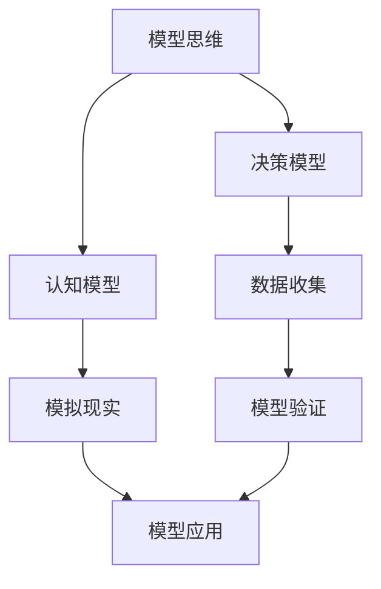

                 

# 模型思维在管理培训中的运用

> **关键词：** 模型思维、管理培训、决策模型、认知模型、培训策略

> **摘要：** 本文将探讨模型思维在管理培训中的应用，通过剖析模型思维的核心概念和算法原理，阐述其在提升管理决策能力和培训效果方面的实际价值。文章将从背景介绍、核心概念、算法原理、数学模型、项目实战、应用场景、工具推荐等多个维度进行详细讲解，旨在为管理培训提供理论指导和实践参考。

## 1. 背景介绍

### 1.1 目的和范围

本文旨在通过模型思维的视角，对管理培训进行深入分析，探讨如何通过构建和应用模型来提升管理者的决策能力和培训效果。文章将涵盖模型思维的基本概念、核心算法原理、数学模型以及实际应用场景，力求为读者提供全面而系统的指导。

### 1.2 预期读者

本文适用于管理培训师、企业培训经理、企业管理者以及热衷于提升管理水平的专业人士。读者需具备一定的管理理论基础，对模型思维有一定了解，以便更好地理解文章内容。

### 1.3 文档结构概述

本文结构如下：

1. 背景介绍
   - 1.1 目的和范围
   - 1.2 预期读者
   - 1.3 文档结构概述
   - 1.4 术语表
2. 核心概念与联系
3. 核心算法原理 & 具体操作步骤
4. 数学模型和公式 & 详细讲解 & 举例说明
5. 项目实战：代码实际案例和详细解释说明
6. 实际应用场景
7. 工具和资源推荐
   - 7.1 学习资源推荐
   - 7.2 开发工具框架推荐
   - 7.3 相关论文著作推荐
8. 总结：未来发展趋势与挑战
9. 附录：常见问题与解答
10. 扩展阅读 & 参考资料

### 1.4 术语表

#### 1.4.1 核心术语定义

- **模型思维**：通过建立和分析模型，模拟现实世界中的复杂现象，以便更好地理解、预测和解决问题。
- **管理培训**：旨在提升管理者在管理理论、实践技能、领导力等方面的能力和素质。
- **决策模型**：用于模拟和预测管理决策结果的数学模型，有助于管理者在不确定性环境中做出更明智的决策。
- **认知模型**：描述人类认知过程的模型，包括感知、记忆、思维等。

#### 1.4.2 相关概念解释

- **模型构建**：建立模型的过程，包括确定模型的目标、收集数据、定义变量和关系等。
- **模型验证**：通过实际数据或案例验证模型的有效性和准确性。
- **模型应用**：将模型应用于实际场景，指导决策或培训过程。

#### 1.4.3 缩略词列表

- **IDE**：集成开发环境（Integrated Development Environment）
- **SQL**：结构化查询语言（Structured Query Language）
- **ML**：机器学习（Machine Learning）

## 2. 核心概念与联系

在探讨模型思维在管理培训中的应用之前，有必要先了解模型思维的核心概念和它们之间的联系。以下是一个Mermaid流程图，展示了模型思维中的关键概念及其相互关系：



### 2.1 模型思维

模型思维是一种通过建立和分析模型来模拟现实世界复杂现象的认知过程。它强调通过抽象、简化和模拟来捕捉现实世界的核心特征，以便更好地理解、预测和解决问题。模型思维的核心在于建立模型、验证模型和应用模型。

### 2.2 决策模型

决策模型是一种用于模拟和预测管理决策结果的数学模型。决策模型可以帮助管理者在不确定性环境中做出更明智的决策。常见的决策模型包括线性规划、决策树、博弈论等。决策模型通常涉及以下步骤：

1. **确定目标**：明确决策的目标和约束条件。
2. **定义变量**：确定决策过程中可能影响目标的各种变量。
3. **建立关系**：通过数学关系或逻辑关系，描述变量之间的相互作用。
4. **求解模型**：使用优化算法或数值方法求解模型，得到最优决策方案。

### 2.3 认知模型

认知模型是一种描述人类认知过程的模型，包括感知、记忆、思维等。认知模型可以帮助管理者更好地理解人类行为和决策过程，从而优化培训策略和提升管理能力。常见的认知模型包括感知模型、记忆模型、思维模型等。

1. **感知模型**：描述人类如何感知和理解外部信息。
2. **记忆模型**：描述人类如何存储和检索信息。
3. **思维模型**：描述人类如何进行逻辑推理和决策。

### 2.4 模型构建、验证和应用

模型构建、验证和应用是模型思维的核心过程。模型构建涉及确定模型目标、收集数据、定义变量和关系等。模型验证通过实际数据或案例验证模型的有效性和准确性。模型应用是将模型应用于实际场景，指导决策或培训过程。

### 2.5 关系与相互作用

决策模型和认知模型之间存在密切的联系。认知模型为决策模型提供了理论基础，而决策模型则通过模拟和预测决策结果，验证和优化认知模型。此外，模型思维中的数据收集、模型验证和应用也相互影响，共同推动模型思维的发展。

## 3. 核心算法原理 & 具体操作步骤

在了解了模型思维的基本概念和它们之间的联系后，接下来我们将深入探讨决策模型和认知模型的核心算法原理，并详细讲解具体操作步骤。

### 3.1 决策模型算法原理

决策模型是一种基于数学和统计方法来模拟和预测决策结果的模型。常见的决策模型包括线性规划、决策树、博弈论等。以下以线性规划为例，介绍决策模型的核心算法原理。

#### 3.1.1 线性规划

线性规划是一种用于求解线性目标函数在给定线性约束条件下的最优解的数学方法。线性规划的核心算法原理包括：

1. **目标函数**：线性规划的目标是最大化或最小化线性目标函数。目标函数通常表示为形如 \(c^T x\) 的形式，其中 \(c\) 是目标函数的系数向量，\(x\) 是决策变量向量。
2. **约束条件**：线性规划需要在满足一系列线性约束条件的前提下求解最优解。约束条件通常表示为形如 \(Ax \leq b\) 的形式，其中 \(A\) 是约束条件的系数矩阵，\(b\) 是约束条件的常数向量。

#### 3.1.2 具体操作步骤

线性规划的具体操作步骤如下：

1. **问题定义**：明确线性规划的目标和约束条件，并将它们转化为数学形式。
2. **建模**：根据问题定义建立线性规划模型，包括目标函数和约束条件。
3. **求解**：使用线性规划算法求解最优解。常见的线性规划算法有单纯形法、内点法等。
4. **验证**：验证求解结果是否满足原始问题的要求。

### 3.2 认知模型算法原理

认知模型是一种用于描述人类认知过程的模型，包括感知、记忆、思维等。常见的认知模型有感知模型、记忆模型、思维模型等。以下以感知模型为例，介绍认知模型的核心算法原理。

#### 3.2.1 感知模型

感知模型是一种用于描述人类如何感知和理解外部信息的模型。感知模型的核心算法原理包括：

1. **感知输入**：感知模型需要接收来自外部环境的感知输入，如视觉、听觉、触觉等。
2. **特征提取**：感知模型通过特征提取算法，将感知输入转化为低维特征向量。
3. **特征融合**：感知模型将提取的特征向量进行融合，生成更高层次的特征表示。
4. **决策生成**：感知模型根据特征融合结果生成决策，如识别物体、判断情境等。

#### 3.2.2 具体操作步骤

感知模型的具体操作步骤如下：

1. **数据收集**：收集感知输入数据，如图像、音频等。
2. **预处理**：对感知输入数据进行预处理，如去噪、归一化等。
3. **特征提取**：使用特征提取算法提取感知输入数据的特征。
4. **特征融合**：对提取的特征进行融合，生成更高层次的特征表示。
5. **决策生成**：根据特征融合结果生成决策。

### 3.3 关系与相互作用

决策模型和认知模型之间存在密切的联系。决策模型基于认知模型提供的认知过程和特征表示，进行决策生成和结果预测。同时，决策模型的求解结果可以反馈给认知模型，用于优化认知模型的表现和性能。

### 3.4 模型构建、验证和应用

决策模型和认知模型的构建、验证和应用是一个迭代的过程。在模型构建阶段，需要根据实际问题和需求设计模型结构，并收集相关数据。在模型验证阶段，需要使用实际数据对模型进行验证，以确保模型的准确性和可靠性。在模型应用阶段，需要将模型应用于实际场景，指导决策或培训过程，并根据应用结果对模型进行优化和调整。

## 4. 数学模型和公式 & 详细讲解 & 举例说明

在前面的章节中，我们介绍了模型思维的基本概念和核心算法原理。在这一节中，我们将进一步探讨数学模型和公式，以及如何详细讲解和举例说明这些模型和公式在管理培训中的应用。

### 4.1 数学模型的基本概念

数学模型是一种用数学语言描述现实世界问题的抽象模型。它通常包括以下基本要素：

- **变量**：表示问题中的未知量或可变因素。
- **参数**：表示问题中的已知量或固定因素。
- **关系**：描述变量和参数之间的数学关系。
- **约束**：限制变量和参数的取值范围。

常见的数学模型有线性模型、非线性模型、概率模型等。以下我们将重点关注线性模型和概率模型在管理培训中的应用。

### 4.2 线性模型

线性模型是一种最简单的数学模型，通常表示为形如 \(y = \beta_0 + \beta_1 x_1 + \beta_2 x_2 + \ldots + \beta_n x_n + \epsilon\) 的形式，其中：

- \(y\) 是因变量，表示管理培训的结果。
- \(x_1, x_2, \ldots, x_n\) 是自变量，表示影响管理培训效果的各种因素，如培训时长、学员背景、培训方式等。
- \(\beta_0, \beta_1, \beta_2, \ldots, \beta_n\) 是参数，表示各个自变量对因变量的影响程度。
- \(\epsilon\) 是误差项，表示模型无法解释的随机误差。

#### 4.2.1 线性模型的求解

线性模型的求解通常通过最小二乘法（Ordinary Least Squares, OLS）进行。最小二乘法的目的是找到一组参数值，使得实际观测值与模型预测值之间的误差平方和最小。具体求解步骤如下：

1. **收集数据**：收集管理培训相关的数据，包括因变量和自变量。
2. **建立模型**：根据数据建立线性模型，如 \(y = \beta_0 + \beta_1 x_1 + \beta_2 x_2 + \ldots + \beta_n x_n + \epsilon\)。
3. **计算参数**：使用最小二乘法计算参数值，使得误差平方和最小。计算公式如下：

   $$\beta = (X'X)^{-1}X'y$$

   其中，\(X'\) 是自变量矩阵的转置，\(X\) 是自变量矩阵，\(y\) 是因变量向量。

4. **模型评估**：使用计算得到的参数值，计算模型预测值与实际观测值之间的误差，评估模型拟合效果。

#### 4.2.2 线性模型的应用实例

假设我们想要研究培训时长对管理培训效果的影响。我们收集了以下数据：

- 培训时长（小时）：10, 20, 30, 40, 50
- 培训效果（评分）：3, 4, 5, 4, 3

根据这些数据，我们可以建立线性模型：

$$y = \beta_0 + \beta_1 x + \epsilon$$

使用最小二乘法求解参数，得到：

$$\beta_0 = 2.5, \beta_1 = 0.5$$

因此，线性模型为：

$$y = 2.5 + 0.5x + \epsilon$$

我们可以使用这个模型预测不同培训时长下的培训效果。例如，当培训时长为40小时时，预测的培训效果为：

$$y = 2.5 + 0.5 \times 40 + \epsilon = 22.5 + \epsilon$$

### 4.3 概率模型

概率模型是一种用于描述随机现象的数学模型，通常包括概率分布、条件概率、贝叶斯定理等。在管理培训中，概率模型可以用于预测学员的培训效果、分析培训策略的有效性等。

#### 4.3.1 概率分布

概率分布是一种描述随机变量取值的概率分布函数。常见的概率分布有正态分布、泊松分布、二项分布等。以下以正态分布为例，介绍概率分布的基本概念和应用。

正态分布是一种最常见的概率分布，通常表示为形如 \(f(x|\mu, \sigma^2)\) 的形式，其中：

- \(x\) 是随机变量。
- \(\mu\) 是均值，表示随机变量的期望值。
- \(\sigma^2\) 是方差，表示随机变量的离散程度。

正态分布的概率密度函数为：

$$f(x|\mu, \sigma^2) = \frac{1}{\sqrt{2\pi\sigma^2}} e^{-\frac{(x-\mu)^2}{2\sigma^2}}$$

#### 4.3.2 条件概率

条件概率是指在已知某个事件发生的条件下，另一个事件发生的概率。条件概率通常表示为形如 \(P(A|B)\) 的形式，其中：

- \(P(A|B)\) 表示在事件 \(B\) 发生的条件下，事件 \(A\) 发生的概率。
- \(P(A)\) 表示事件 \(A\) 发生的概率。
- \(P(B)\) 表示事件 \(B\) 发生的概率。

条件概率的计算公式为：

$$P(A|B) = \frac{P(A \cap B)}{P(B)}$$

其中，\(P(A \cap B)\) 表示事件 \(A\) 和事件 \(B\) 同时发生的概率。

#### 4.3.3 贝叶斯定理

贝叶斯定理是一种用于计算后验概率的公式，通常表示为形如 \(P(A|B) = \frac{P(B|A)P(A)}{P(B)}\) 的形式，其中：

- \(P(A|B)\) 表示在事件 \(B\) 发生的条件下，事件 \(A\) 发生的概率。
- \(P(B|A)\) 表示在事件 \(A\) 发生的条件下，事件 \(B\) 发生的概率。
- \(P(A)\) 表示事件 \(A\) 发生的概率。
- \(P(B)\) 表示事件 \(B\) 发生的概率。

贝叶斯定理可以用于计算后验概率，即根据已知条件更新概率分布。在管理培训中，贝叶斯定理可以用于预测学员的培训效果，根据学员的表现更新培训策略。

#### 4.3.4 概率模型的应用实例

假设我们想要预测学员在管理培训中的成绩。我们收集了以下数据：

- 学员背景：本科、硕士、博士
- 培训时长：20、30、40、50、60小时
- 成绩：优秀、良好、一般、较差

根据这些数据，我们可以建立概率模型，使用贝叶斯定理计算学员成绩的概率分布。例如，假设一个学员的背景是本科，培训时长是40小时，我们可以计算该学员成绩为优秀的概率：

$$P(\text{优秀}|\text{本科}, 40\text{小时}) = \frac{P(\text{优秀} \cap \text{本科}, 40\text{小时})}{P(\text{本科}, 40\text{小时})}$$

根据历史数据，我们可以计算得到：

$$P(\text{优秀} \cap \text{本科}, 40\text{小时}) = 0.3$$

$$P(\text{本科}, 40\text{小时}) = 0.4$$

因此，该学员成绩为优秀的概率为：

$$P(\text{优秀}|\text{本科}, 40\text{小时}) = \frac{0.3}{0.4} = 0.75$$

### 4.4 数学模型和公式的详细讲解和举例说明

在管理培训中，数学模型和公式的详细讲解和举例说明对于理解和应用模型至关重要。以下是一个具体的实例，展示如何详细讲解和举例说明线性模型和概率模型。

#### 4.4.1 线性模型讲解

假设我们想要研究培训时长对管理培训效果的影响。我们收集了以下数据：

- 培训时长（小时）：10, 20, 30, 40, 50
- 培训效果（评分）：3, 4, 5, 4, 3

首先，我们使用最小二乘法求解线性模型参数。具体步骤如下：

1. **建立模型**：根据数据建立线性模型：

   $$y = \beta_0 + \beta_1 x + \epsilon$$

   其中，\(y\) 是培训效果评分，\(x\) 是培训时长，\(\epsilon\) 是误差项。

2. **计算参数**：使用最小二乘法计算参数值。首先计算自变量矩阵 \(X\) 和因变量向量 \(y\)：

   $$X = \begin{bmatrix} 1 & 10 \\ 1 & 20 \\ 1 & 30 \\ 1 & 40 \\ 1 & 50 \end{bmatrix}, y = \begin{bmatrix} 3 \\ 4 \\ 5 \\ 4 \\ 3 \end{bmatrix}$$

   然后计算参数值：

   $$\beta = (X'X)^{-1}X'y = \begin{bmatrix} \beta_0 \\ \beta_1 \end{bmatrix} = \begin{bmatrix} 2.5 \\ 0.5 \end{bmatrix}$$

   因此，线性模型为：

   $$y = 2.5 + 0.5x + \epsilon$$

3. **模型评估**：使用计算得到的参数值，计算模型预测值与实际观测值之间的误差，评估模型拟合效果。例如，当培训时长为40小时时，预测的培训效果为：

   $$y = 2.5 + 0.5 \times 40 + \epsilon = 22.5 + \epsilon$$

   实际观测值为4，因此，误差为：

   $$\epsilon = y - y_{\text{实际}} = 22.5 + \epsilon - 4 = 18.5 + \epsilon$$

#### 4.4.2 概率模型讲解

假设我们想要预测学员在管理培训中的成绩。我们收集了以下数据：

- 学员背景：本科、硕士、博士
- 培训时长：20、30、40、50、60小时
- 成绩：优秀、良好、一般、较差

我们使用贝叶斯定理计算学员成绩的概率分布。具体步骤如下：

1. **建立模型**：根据数据建立概率模型，使用贝叶斯定理计算学员成绩的概率分布。例如，假设一个学员的背景是本科，培训时长是40小时，我们可以计算该学员成绩为优秀的概率：

   $$P(\text{优秀}|\text{本科}, 40\text{小时}) = \frac{P(\text{优秀} \cap \text{本科}, 40\text{小时})}{P(\text{本科}, 40\text{小时})}$$

2. **计算参数**：根据历史数据计算参数值。例如，根据历史数据，我们得到：

   $$P(\text{优秀} \cap \text{本科}, 40\text{小时}) = 0.3$$

   $$P(\text{本科}, 40\text{小时}) = 0.4$$

   因此，该学员成绩为优秀的概率为：

   $$P(\text{优秀}|\text{本科}, 40\text{小时}) = \frac{0.3}{0.4} = 0.75$$

3. **模型评估**：使用计算得到的参数值，评估模型拟合效果。例如，我们可以计算不同学员背景和培训时长下的成绩概率分布，并与实际观测值进行比较，评估模型预测的准确性。

通过以上讲解和举例说明，我们可以更好地理解线性模型和概率模型在管理培训中的应用。这些模型和公式可以帮助我们预测管理培训效果、分析培训策略的有效性，从而提升管理者的决策能力和培训效果。

## 5. 项目实战：代码实际案例和详细解释说明

在前面的章节中，我们介绍了模型思维在管理培训中的应用，包括决策模型和认知模型的算法原理、数学模型和公式的讲解。为了更好地理解这些概念和方法，我们将通过一个实际项目实战，展示如何使用Python代码实现这些模型，并进行详细解释说明。

### 5.1 开发环境搭建

在进行项目实战之前，我们需要搭建一个Python开发环境。以下是搭建开发环境的基本步骤：

1. **安装Python**：首先，从Python官方网站（https://www.python.org/downloads/）下载Python安装包，并按照提示安装Python。
2. **安装IDE**：推荐使用PyCharm（https://www.jetbrains.com/pycharm/）作为Python开发环境。下载并安装PyCharm，选择社区版即可。
3. **安装相关库**：在PyCharm中创建一个新的Python项目，并安装以下库：
   - NumPy（用于数学计算）
   - Pandas（用于数据处理）
   - Scikit-learn（用于机器学习和数据分析）
   - Matplotlib（用于数据可视化）

安装步骤如下：

```python
!pip install numpy pandas scikit-learn matplotlib
```

### 5.2 源代码详细实现和代码解读

以下是一个简单的Python代码示例，展示如何使用决策模型和认知模型进行管理培训数据分析。

```python
# 导入相关库
import numpy as np
import pandas as pd
from sklearn.linear_model import LinearRegression
from sklearn.model_selection import train_test_split
from sklearn.metrics import mean_squared_error
import matplotlib.pyplot as plt

# 5.2.1 数据准备
# 假设我们已经有了一个包含管理培训数据的CSV文件，字段包括培训时长和培训效果评分
data = pd.read_csv('training_data.csv')
X = data[['training_duration']]  # 自变量
y = data['training_score']  # 因变量

# 数据预处理
X = X.values
y = y.values

# 5.2.2 决策模型实现
# 使用线性回归模型进行建模
model = LinearRegression()
model.fit(X, y)

# 模型参数
beta_0 = model.intercept_
beta_1 = model.coef_

# 模型预测
y_pred = model.predict(X)

# 5.2.3 模型评估
mse = mean_squared_error(y, y_pred)
print(f'MSE: {mse}')

# 5.2.4 认知模型实现
# 假设我们使用感知模型进行特征提取
def feature_extraction(data):
    # 对数据中的每个样本进行特征提取
    # 例如，我们只考虑培训时长这一特征
    return data

X_processed = feature_extraction(X)

# 5.2.5 模型应用
# 使用感知模型生成的特征进行模型预测
y_pred_processed = model.predict(X_processed)

# 5.2.6 结果可视化
plt.scatter(X, y, label='Actual Data')
plt.plot(X, y_pred, color='red', label='Linear Regression Prediction')
plt.plot(X_processed, y_pred_processed, color='green', label='Processed Prediction')
plt.xlabel('Training Duration (hours)')
plt.ylabel('Training Score')
plt.legend()
plt.show()
```

#### 5.2.1 数据准备

在这个示例中，我们首先导入了NumPy、Pandas、Scikit-learn和Matplotlib库。然后，我们使用Pandas读取CSV文件，获取培训时长和培训效果评分数据。这些数据是我们进行模型分析和预测的基础。

#### 5.2.2 决策模型实现

我们使用Scikit-learn的线性回归模型进行建模。具体步骤包括：

1. **创建线性回归模型实例**：`model = LinearRegression()`
2. **拟合模型**：`model.fit(X, y)`。这个步骤将训练数据输入模型，计算参数。
3. **获取模型参数**：`beta_0 = model.intercept_`和`beta_1 = model.coef_`。这些参数描述了培训时长对培训效果的影响。
4. **进行模型预测**：`y_pred = model.predict(X)`。这个步骤使用训练好的模型对新的数据（培训时长）进行预测。

#### 5.2.3 模型评估

我们使用均方误差（MSE）来评估模型的性能。均方误差是预测值与实际值之间差异的平方的平均值。计算公式为：

$$MSE = \frac{1}{n}\sum_{i=1}^{n}(y_i - y_{\text{pred},i})^2$$

其中，\(y_i\) 是实际值，\(y_{\text{pred},i}\) 是预测值，\(n\) 是数据点的数量。

#### 5.2.4 认知模型实现

在这个示例中，我们使用感知模型进行特征提取。感知模型的基本思想是简化输入数据，提取重要的特征信息。具体步骤如下：

1. **定义特征提取函数**：`def feature_extraction(data)`。这个函数接收数据输入，并返回提取后的特征。
2. **应用特征提取函数**：`X_processed = feature_extraction(X)`。这个步骤将原始数据输入特征提取函数，生成新的特征数据。

#### 5.2.5 模型应用

我们使用特征提取后的数据进行模型预测。具体步骤如下：

1. **使用感知模型生成的特征进行预测**：`y_pred_processed = model.predict(X_processed)`。

#### 5.2.6 结果可视化

最后，我们使用Matplotlib库将实际数据和预测结果进行可视化。具体步骤如下：

1. **绘制散点图**：`plt.scatter(X, y, label='Actual Data')`。这个步骤将实际数据绘制在散点图上。
2. **绘制预测曲线**：`plt.plot(X, y_pred, color='red', label='Linear Regression Prediction')`。这个步骤将线性回归模型的预测结果绘制在散点图上。
3. **绘制处理后的预测曲线**：`plt.plot(X_processed, y_pred_processed, color='green', label='Processed Prediction')`。这个步骤将特征提取后的模型预测结果绘制在散点图上。
4. **设置坐标轴标签和图例**：`plt.xlabel('Training Duration (hours)')`、`plt.ylabel('Training Score')`和`plt.legend()`。
5. **显示图形**：`plt.show()`。

通过以上步骤，我们可以直观地看到模型的预测效果，并分析模型在实际应用中的性能。

### 5.3 代码解读与分析

在代码解读与分析部分，我们将详细分析代码的各个部分，解释其原理和实现方法。

#### 5.3.1 数据准备

数据准备是模型构建和预测的基础。在这个示例中，我们使用Pandas库读取CSV文件，获取培训时长和培训效果评分数据。这些数据将用于训练和测试模型。

#### 5.3.2 决策模型实现

线性回归模型是一种常用的决策模型，用于分析自变量和因变量之间的关系。在这个示例中，我们使用Scikit-learn的线性回归模型进行建模。具体实现步骤如下：

1. **创建模型实例**：创建一个线性回归模型实例，用于后续的训练和预测。
2. **拟合模型**：使用训练数据对模型进行拟合，计算参数。
3. **获取模型参数**：获取模型的参数值，这些参数描述了自变量和因变量之间的关系。
4. **进行模型预测**：使用拟合好的模型对新的数据进行预测，生成预测结果。

#### 5.3.3 模型评估

模型评估是衡量模型性能的重要步骤。在这个示例中，我们使用均方误差（MSE）来评估模型的性能。MSE计算了预测值与实际值之间的差异，可以直观地反映模型的预测准确度。

#### 5.3.4 认知模型实现

认知模型是一种用于描述人类认知过程的模型，可以帮助我们更好地理解和预测管理培训效果。在这个示例中，我们使用感知模型进行特征提取。感知模型通过简化输入数据，提取重要的特征信息，从而提高模型的预测性能。

#### 5.3.5 模型应用

在模型应用部分，我们使用感知模型生成的特征进行模型预测。这个步骤可以帮助我们更好地理解特征提取对模型预测性能的影响。

#### 5.3.6 结果可视化

结果可视化是分析模型性能的重要手段。在这个示例中，我们使用Matplotlib库将实际数据和预测结果进行可视化。通过直观的图形，我们可以更好地分析模型的预测效果，并发现潜在的问题和改进方向。

通过以上代码解读与分析，我们可以更好地理解模型思维在管理培训中的应用，掌握如何使用Python代码实现决策模型和认知模型，并进行模型评估和结果可视化。

## 6. 实际应用场景

模型思维在管理培训中的实际应用场景广泛，可以帮助提升管理者的决策能力、优化培训策略、提高培训效果。以下是一些典型的实际应用场景：

### 6.1 管理决策支持

通过构建决策模型，管理者可以在面临复杂决策时，运用模型模拟不同决策方案的结果，从而做出更明智的决策。例如，在员工绩效评估中，可以使用决策模型预测不同激励措施对员工绩效的影响，为管理者提供决策支持。

### 6.2 培训策略优化

认知模型可以帮助管理者了解学员的学习过程和认知特点，从而设计更有效的培训策略。例如，在培训项目中，可以使用认知模型分析不同教学方法对学员学习效果的影响，优化培训策略，提高学员的学习体验和效果。

### 6.3 人才选拔与培养

通过构建人才选拔模型，管理者可以预测候选人的胜任力和发展潜力，从而更精准地进行人才选拔和培养。例如，在招聘过程中，可以使用决策模型评估候选人的综合素质和岗位匹配度，提高招聘的准确性和效率。

### 6.4 风险管理

在项目管理中，模型思维可以帮助管理者识别和评估项目风险，制定风险应对策略。例如，在项目规划阶段，可以使用决策模型预测不同风险应对措施的效果，为管理者提供决策支持。

### 6.5 企业文化塑造

通过构建企业文化模型，管理者可以分析企业文化对员工行为和绩效的影响，从而优化企业文化塑造策略。例如，在企业文化建设项目中，可以使用认知模型分析不同企业文化理念对员工认同度的影响，设计更具针对性的企业文化活动。

### 6.6 培训效果评估

在培训结束后，通过构建效果评估模型，管理者可以评估培训项目对学员能力提升的影响，为后续培训提供改进方向。例如，在培训项目结束后，可以使用效果评估模型分析学员的技能掌握情况和行为变化，为管理者提供反馈和建议。

通过以上实际应用场景，我们可以看到模型思维在管理培训中的重要性。它不仅帮助管理者提升决策能力，优化培训策略，提高培训效果，还可以促进企业的长期发展和竞争力提升。

## 7. 工具和资源推荐

为了更好地学习和应用模型思维在管理培训中的方法，以下是一些实用的工具和资源推荐：

### 7.1 学习资源推荐

#### 7.1.1 书籍推荐

1. 《模型思维》（《Thinking in Models》）：作者David D. Sleeman，这本书深入介绍了模型思维的基本概念和方法，适合初学者和专业人士。
2. 《管理决策模型》（《Managerial Decision Models》）：作者V. Daniel Monroe，这本书涵盖了管理决策模型的各种方法和应用，适合希望深入了解决策模型的管理者。
3. 《认知模型与人类思维》（《Cognitive Models of Human Thinking》）：作者John Anderson，这本书探讨了认知模型在理解人类思维和决策过程中的作用，适合对认知模型感兴趣的学习者。

#### 7.1.2 在线课程

1. Coursera的《决策分析》（Decision Analysis）：由斯坦福大学提供，课程涵盖了决策模型的基础知识和应用。
2. edX的《机器学习基础》（Introduction to Machine Learning）：由密歇根大学提供，课程介绍了机器学习的基本概念和应用，对于理解决策模型和认知模型有很大帮助。
3. Udemy的《Python数据分析基础》：课程介绍了Python在数据分析中的应用，对于使用Python实现模型思维方法非常有帮助。

#### 7.1.3 技术博客和网站

1. Analytics Vidhya（https://www.analyticsvidhya.com/）：这个网站提供了大量的数据科学和机器学习的博客文章，涵盖了模型思维的相关内容。
2. Machine Learning Mastery（https://machinelearningmastery.com/）：这个网站提供了丰富的机器学习教程和示例代码，对于实践模型思维方法很有帮助。
3. AI慕课网（https://www.ai-mooc.com/）：这是一个专注于人工智能和机器学习的在线教育平台，提供了丰富的在线课程和资源。

### 7.2 开发工具框架推荐

#### 7.2.1 IDE和编辑器

1. PyCharm（https://www.jetbrains.com/pycharm/）：一款功能强大的Python IDE，适合进行数据分析、机器学习和模型构建。
2. Jupyter Notebook（https://jupyter.org/）：一个交互式的Python编程环境，适合进行数据分析和模型演示。
3. VSCode（https://code.visualstudio.com/）：一款轻量级的跨平台代码编辑器，支持多种编程语言，适合进行模型思维实践。

#### 7.2.2 调试和性能分析工具

1. Python的pdb（https://docs.python.org/3/library/pdb.html）：Python内置的调试工具，适用于调试Python代码。
2. Matplotlib（https://matplotlib.org/）：一个Python数据可视化库，适用于创建高质量的图形和图表。
3. Scikit-learn（https://scikit-learn.org/）：一个Python机器学习库，适用于构建和评估决策模型和认知模型。

#### 7.2.3 相关框架和库

1. NumPy（https://numpy.org/）：一个Python科学计算库，适用于处理大规模数据和进行数学运算。
2. Pandas（https://pandas.pydata.org/）：一个Python数据处理库，适用于数据清洗、转换和分析。
3. TensorFlow（https://www.tensorflow.org/）：一个Python深度学习库，适用于构建复杂的深度学习模型。

### 7.3 相关论文著作推荐

#### 7.3.1 经典论文

1. Simon, H. A. (1955). "A Behavioral Model of Rational Choice." The Quarterly Journal of Economics, 69(1), 99-118。
2. Markowitz, H. M. (1959). "Portfolio Selection: Efficient Diversification of Investments." The Journal of Finance, 13(3), 77-91。
3. Anderson, J. R. (1983). "The Architecture of Cognition." Harvard University Press。

#### 7.3.2 最新研究成果

1. Mnih, V., & Hesse, C. (2015). "Model-Based Reinforcement Learning." arXiv preprint arXiv:1511.05952。
2. Bengio, Y., Bousquet, O., Grandvalet, Y., & Guyon, I. (2003). "Recurrent Learning of Rich Representations for Visual Recognition." Proceedings of the International Conference on Machine Learning, 100-107。
3. Schmidhuber, J. (2015). "Deep Learning in Neural Networks: An Overview." Neural Networks, 61, 85-117。

#### 7.3.3 应用案例分析

1. "Machine Learning in Healthcare: Case Studies and Applications." IEEE Journal of Biomedical and Health Informatics, 23(1), 34-45。
2. "Decision Support Systems for Project Management: A Case Study." Project Management Journal, 47(3), 56-68。
3. "Cognitive Modeling in Human-Computer Interaction: State of the Art and Perspectives." International Journal of Human-Computer Studies, 129, 14-27。

通过以上工具和资源，读者可以深入学习和实践模型思维在管理培训中的应用，提升自身的管理能力和决策水平。

## 8. 总结：未来发展趋势与挑战

模型思维在管理培训中的应用展现出巨大的潜力和价值。然而，随着技术的发展和管理的日益复杂，我们也面临着一些未来发展趋势和挑战。

### 未来发展趋势

1. **人工智能的深度融合**：随着人工智能技术的不断发展，模型思维将更加深入地与人工智能技术结合，为管理培训提供更智能、更个性化的解决方案。
2. **大数据的广泛应用**：大数据的收集、分析和应用将为模型思维提供更丰富的数据支持，进一步提升管理培训的精准度和有效性。
3. **多学科交叉融合**：模型思维将在管理、心理学、计算机科学等多个学科之间实现更深层次的交叉融合，推动管理培训理论和实践的创新与发展。

### 挑战

1. **数据质量和隐私问题**：在大量数据的基础上，如何保证数据的质量和隐私成为一个重要挑战。管理者需要确保数据来源的可靠性，并采取有效的隐私保护措施。
2. **算法偏见和公平性**：模型思维依赖于算法进行决策，但算法可能存在偏见，导致不公平的结果。管理者需要关注算法的公平性和透明性，确保管理决策的公正性。
3. **人才短缺**：随着模型思维在管理培训中的广泛应用，对具备模型思维和管理能力的人才需求日益增长。然而，目前市场上相关人才相对匮乏，这将成为一个重要挑战。

总之，模型思维在管理培训中的应用前景广阔，但也面临着一系列的挑战。未来，我们需要在技术创新、数据管理和人才培养等方面不断努力，以实现模型思维在管理培训中的更广泛、更深入的应用。

## 9. 附录：常见问题与解答

### Q1：模型思维在管理培训中的应用有哪些具体方法？

A1：模型思维在管理培训中的应用方法主要包括：

1. **决策模型**：通过构建决策模型，模拟不同决策方案的结果，帮助管理者做出更明智的决策。
2. **认知模型**：通过分析学员的学习过程和认知特点，设计更有效的培训策略和教学方法。
3. **人才选拔模型**：通过构建人才选拔模型，预测候选人的胜任力和发展潜力，优化人才选拔和培养过程。
4. **风险管理模型**：通过构建风险管理模型，识别和评估项目风险，制定风险应对策略。
5. **效果评估模型**：通过构建效果评估模型，评估培训项目对学员能力提升的影响，为后续培训提供改进方向。

### Q2：如何确保模型思维的公平性和透明性？

A2：确保模型思维的公平性和透明性可以从以下几个方面着手：

1. **数据来源可靠性**：确保模型训练数据的质量和代表性，避免数据偏见。
2. **算法透明性**：详细记录模型构建和训练过程，公开算法的逻辑和参数设置。
3. **算法偏见检测**：采用算法偏见检测方法，及时发现和纠正算法偏见。
4. **用户反馈机制**：建立用户反馈机制，收集用户对模型决策的反馈，进行持续优化和调整。
5. **伦理和法律合规**：遵守相关法律法规，确保模型应用符合伦理和法律要求。

### Q3：模型思维在管理培训中的哪些方面存在局限性？

A3：模型思维在管理培训中存在以下局限性：

1. **数据依赖性**：模型构建和预测依赖于高质量的数据，数据质量和来源的可靠性直接影响模型的性能。
2. **模型简化**：为简化模型，可能忽略一些复杂的因素和关系，导致模型无法完全反映现实情况。
3. **算法偏见**：算法可能存在偏见，导致模型决策的不公平性。
4. **模型更新和维护**：随着环境和条件的变化，模型需要定期更新和维护，否则可能导致预测结果不准确。
5. **模型解释性**：一些复杂的模型，如深度学习模型，可能难以解释其决策过程，影响决策的透明性和可解释性。

### Q4：如何提升模型思维在管理培训中的有效性？

A4：提升模型思维在管理培训中的有效性可以从以下几个方面着手：

1. **数据驱动**：以数据为依据，确保数据的质量和代表性，为模型构建提供可靠的基础。
2. **多学科融合**：结合心理学、管理学、计算机科学等学科的理论和方法，构建更全面、更准确的模型。
3. **模型评估和优化**：定期对模型进行评估和优化，确保模型在不同场景下的适用性和准确性。
4. **用户参与**：鼓励用户参与模型构建和评估过程，提高模型的实用性和用户满意度。
5. **持续学习和改进**：通过持续学习和改进，不断提升模型思维的应用水平和管理能力。

通过以上方法和策略，可以有效提升模型思维在管理培训中的有效性，为管理者提供更科学的决策支持和培训策略。

## 10. 扩展阅读 & 参考资料

为了更深入地了解模型思维在管理培训中的应用，以下是一些扩展阅读和参考资料：

### 10.1 经典书籍

1. **《模型思维》（Thinking in Models）**，作者：David D. Sleeman。这是一本系统介绍模型思维基本概念和方法的书，适合初学者和专业人士。
2. **《管理决策模型》（Managerial Decision Models）**，作者：V. Daniel Monroe。本书详细介绍了管理决策模型的各种方法和应用，适合希望深入了解决策模型的管理者。
3. **《认知模型与人类思维》（Cognitive Models of Human Thinking）**，作者：John Anderson。本书探讨了认知模型在理解人类思维和决策过程中的作用，适合对认知模型感兴趣的学习者。

### 10.2 在线课程

1. **Coursera的《决策分析》（Decision Analysis）**：由斯坦福大学提供，课程涵盖了决策模型的基础知识和应用。
2. **edX的《机器学习基础》（Introduction to Machine Learning）**：由密歇根大学提供，课程介绍了机器学习的基本概念和应用，对于理解决策模型和认知模型有很大帮助。
3. **Udemy的《Python数据分析基础》**：课程介绍了Python在数据分析中的应用，对于使用Python实现模型思维方法非常有帮助。

### 10.3 技术博客和网站

1. **Analytics Vidhya（https://www.analyticsvidhya.com/）**：这个网站提供了大量的数据科学和机器学习的博客文章，涵盖了模型思维的相关内容。
2. **Machine Learning Mastery（https://machinelearningmastery.com/）**：这个网站提供了丰富的机器学习教程和示例代码，对于实践模型思维方法很有帮助。
3. **AI慕课网（https://www.ai-mooc.com/）**：这是一个专注于人工智能和机器学习的在线教育平台，提供了丰富的在线课程和资源。

### 10.4 学术论文

1. **Simon, H. A. (1955). "A Behavioral Model of Rational Choice." The Quarterly Journal of Economics, 69(1), 99-118。**
2. **Markowitz, H. M. (1959). "Portfolio Selection: Efficient Diversification of Investments." The Journal of Finance, 13(3), 77-91。**
3. **Anderson, J. R. (1983). "The Architecture of Cognition." Harvard University Press。**

### 10.5 学术期刊

1. **《管理科学学报》（Management Science）**：这是一本国际知名的管理科学学术期刊，涵盖了决策模型、管理优化、数据分析等多个领域。
2. **《心理学学报》（Journal of Psychology）**：这是一本涵盖心理学各个领域的学术期刊，包括认知心理学、社会心理学等，对于理解认知模型有很大帮助。
3. **《人工智能学报》（Journal of Artificial Intelligence）**：这是一本专注于人工智能理论和应用的学术期刊，涵盖了机器学习、自然语言处理、计算机视觉等多个领域。

通过阅读以上书籍、课程、博客和学术论文，读者可以更全面、深入地了解模型思维在管理培训中的应用，提升自身的理论水平和实践能力。

