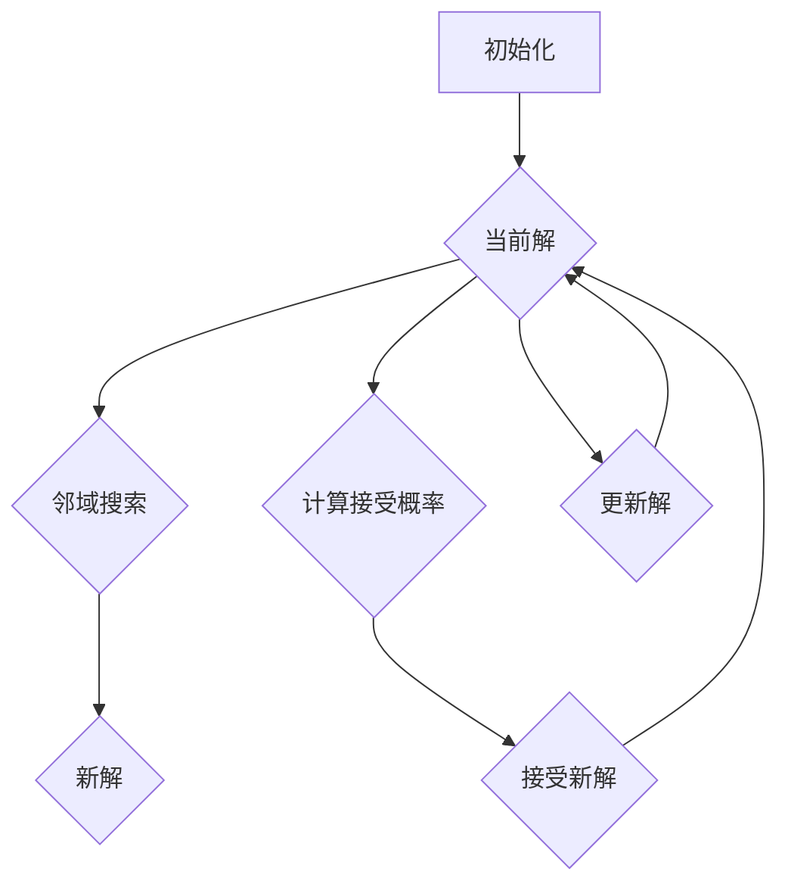

                 

# 模拟退火算法(Simulated Annealing) - 原理与代码实例讲解

> **关键词**：模拟退火算法、全局优化、启发式搜索、概率模型、邻域搜索、温度调度、代码实例

> **摘要**：本文将深入探讨模拟退火算法的基本原理和实现细节，通过逐步讲解和代码实例分析，帮助读者理解如何利用该算法解决复杂的全局优化问题。模拟退火算法作为一种概率模型，通过模拟物理退火过程进行搜索，能够在存在多个局部最优解的情况下找到全局最优解。本文将从算法的起源、核心概念、数学模型到实际应用，进行全面解析。

## 1. 背景介绍

### 1.1 目的和范围

本文旨在详细介绍模拟退火算法（Simulated Annealing, SA）的基本原理和应用场景。模拟退火算法是一种用于解决全局优化问题的启发式搜索方法，具有较强的适应性和灵活性。本文将围绕以下内容展开：

1. 模拟退火算法的历史背景和发展过程。
2. 核心概念和算法原理的详细解释。
3. 数学模型和公式的推导与说明。
4. 代码实例的编写与分析。
5. 实际应用场景的探讨和案例分析。
6. 相关工具和资源的推荐。

### 1.2 预期读者

本文适合对人工智能和算法设计有一定了解的读者，特别是希望深入了解模拟退火算法的原理和应用的开发者、研究人员和工程师。同时，对于对全局优化问题感兴趣的学术研究者，本文也提供了实用的算法实现和技术分析。

### 1.3 文档结构概述

本文的结构如下：

1. **背景介绍**：介绍文章的目的、预期读者和文档结构。
2. **核心概念与联系**：通过Mermaid流程图展示算法的核心概念和联系。
3. **核心算法原理 & 具体操作步骤**：详细讲解算法原理和操作步骤，使用伪代码进行说明。
4. **数学模型和公式 & 详细讲解 & 举例说明**：推导算法的数学模型，并使用LaTeX格式展示公式。
5. **项目实战：代码实际案例和详细解释说明**：提供代码实例和详细解释。
6. **实际应用场景**：讨论算法在不同领域的应用。
7. **工具和资源推荐**：推荐学习资源和开发工具。
8. **总结：未来发展趋势与挑战**：总结算法的发展趋势和面临的挑战。
9. **附录：常见问题与解答**：解答常见问题。
10. **扩展阅读 & 参考资料**：提供扩展阅读和参考资料。

### 1.4 术语表

#### 1.4.1 核心术语定义

- **模拟退火算法（Simulated Annealing）**：一种基于概率模型的启发式搜索算法，用于求解全局优化问题。
- **全局优化（Global Optimization）**：寻找具有最优目标函数值的解，而非局部最优解。
- **局部最优解（Local Optimum）**：在当前搜索范围内目标函数取得的最优解，但可能不是全局最优解。
- **邻域搜索（Neighborhood Search）**：在当前解的基础上，通过一定的规则搜索邻近的解。
- **温度调度（Temperature Scheduling）**：模拟退火算法中的一个关键参数，影响搜索过程的收敛速度和稳定性。

#### 1.4.2 相关概念解释

- **物理退火过程**：一种通过控制温度逐渐降低来使物质达到低能态的过程。
- **解的接受概率（Acceptance Probability）**：决定是否接受新解的依据，与当前解和新解的差值及温度有关。
- **收敛性（Convergence）**：算法在迭代过程中逐渐接近全局最优解的过程。

#### 1.4.3 缩略词列表

- **SA**：模拟退火算法（Simulated Annealing）
- **GS**：全局优化（Global Optimization）
- **HS**：启发式搜索（Heuristic Search）
- **NP**：非确定性多项式时间（Non-deterministic Polynomial Time）
- **LA**：局域搜索算法（Local Search Algorithm）

## 2. 核心概念与联系

为了更好地理解模拟退火算法，我们首先需要了解其核心概念和联系。下面是一个Mermaid流程图，展示了模拟退火算法的主要组成部分和它们之间的关系。



### 2.1 初始化

模拟退火算法的初始化过程主要包括设定初始解、初始温度和冷却策略。初始解可以是一个随机解或者一个已知较好的解。初始温度通常设置得较高，以便算法能够探索较大的搜索空间。冷却策略则是逐渐降低温度的方法，以确保算法在搜索过程中能够逐步收敛。

### 2.2 邻域搜索

邻域搜索是模拟退火算法的核心步骤之一。通过在当前解的基础上，生成一系列邻近的解，以便算法能够在搜索过程中进行选择。邻域搜索的方法多种多样，包括随机搜索、邻域选择、局部搜索等。选择合适的邻域搜索方法，可以显著影响算法的性能和效率。

### 2.3 计算接受概率

计算接受概率是模拟退火算法中决定是否接受新解的关键步骤。接受概率通常由以下公式计算：

$$
P(\text{accept}) = \min\left(1, \exp\left(-\frac{\Delta E}{T}\right)\right)
$$

其中，$\Delta E$ 表示当前解与新解之间的能量差（或目标函数值的差），$T$ 表示当前温度。当 $\Delta E < 0$ 时，即新解比当前解更好，接受概率为 1；当 $\Delta E > 0$ 时，接受概率取决于温度和能量差。通过控制温度，可以影响算法在搜索过程中对局部最优解的回避能力。

### 2.4 更新解

在计算接受概率后，算法根据接受概率决定是否更新当前解。如果接受新解，当前解将更新为新解；如果拒绝新解，当前解保持不变。更新解的过程是模拟退火算法实现全局优化的关键步骤。

### 2.5 收敛性

收敛性是衡量模拟退火算法性能的重要指标。在算法的迭代过程中，当前解会逐渐收敛到全局最优解。收敛速度受到初始温度、冷却策略和邻域搜索方法等多种因素的影响。通过调整这些参数，可以优化算法的性能和收敛速度。

## 3. 核心算法原理 & 具体操作步骤

为了深入理解模拟退火算法，我们将使用伪代码详细阐述其核心原理和操作步骤。以下是一个简化的模拟退火算法伪代码：

```plaintext
算法 SimulatedAnnealing(OptimizationFunction, InitialSolution, InitialTemperature, CoolingRate)
    当前解 = InitialSolution
    当前温度 = InitialTemperature
    最优解 = 当前解
    最大迭代次数 = MAX_ITERATIONS

    for i = 1 to 最大迭代次数
        新解 = 邻域搜索(当前解)
        ΔE = OptimizationFunction(新解) - OptimizationFunction(当前解)
        
        if ΔE < 0 或者 random() < 接受概率(ΔE, 当前温度)
            当前解 = 新解
            if 当前解优于最优解
                最优解 = 当前解
        
        当前温度 = 冷却策略(当前温度)

    返回 最优解
```

### 3.1 初始化

初始化过程包括设定初始解、初始温度和冷却策略。初始解可以是一个随机解或者一个已知较好的解。初始温度通常设置得较高，以便算法能够探索较大的搜索空间。冷却策略则是逐渐降低温度的方法，以确保算法在搜索过程中能够逐步收敛。

```plaintext
初始解 = 随机生成解()
初始温度 = 设定较高值()
冷却策略 = 线性冷却或者对数冷却()
```

### 3.2 邻域搜索

邻域搜索是模拟退火算法的核心步骤之一。通过在当前解的基础上，生成一系列邻近的解，以便算法能够在搜索过程中进行选择。邻域搜索的方法多种多样，包括随机搜索、邻域选择、局部搜索等。选择合适的邻域搜索方法，可以显著影响算法的性能和效率。

```plaintext
新解 = 邻域搜索(当前解)
```

### 3.3 计算接受概率

计算接受概率是模拟退火算法中决定是否接受新解的关键步骤。接受概率通常由以下公式计算：

$$
P(\text{accept}) = \min\left(1, \exp\left(-\frac{\Delta E}{T}\right)\right)
$$

其中，$\Delta E$ 表示当前解与新解之间的能量差（或目标函数值的差），$T$ 表示当前温度。当 $\Delta E < 0$ 时，即新解比当前解更好，接受概率为 1；当 $\Delta E > 0$ 时，接受概率取决于温度和能量差。通过控制温度，可以影响算法在搜索过程中对局部最优解的回避能力。

```plaintext
接受概率(ΔE, 当前温度) = min(1, exp(-ΔE / 当前温度))
```

### 3.4 更新解

在计算接受概率后，算法根据接受概率决定是否更新当前解。如果接受新解，当前解将更新为新解；如果拒绝新解，当前解保持不变。更新解的过程是模拟退火算法实现全局优化的关键步骤。

```plaintext
if ΔE < 0 or random() < 接受概率(ΔE, 当前温度)
    当前解 = 新解
    if 当前解优于最优解
        最优解 = 当前解
```

### 3.5 冷却策略

冷却策略是模拟退火算法中逐渐降低温度的方法，以确保算法在搜索过程中能够逐步收敛。常见的冷却策略包括线性冷却、对数冷却和指数冷却等。

```plaintext
当前温度 = 冷却策略(当前温度)
```

### 3.6 收敛性

收敛性是衡量模拟退火算法性能的重要指标。在算法的迭代过程中，当前解会逐渐收敛到全局最优解。收敛速度受到初始温度、冷却策略和邻域搜索方法等多种因素的影响。通过调整这些参数，可以优化算法的性能和收敛速度。

## 4. 数学模型和公式 & 详细讲解 & 举例说明

### 4.1 数学模型

模拟退火算法的数学模型主要包括目标函数、邻域搜索规则、接受概率计算公式和冷却策略。以下是对这些模型的详细讲解。

#### 4.1.1 目标函数

在模拟退火算法中，目标函数用于衡量解的优劣。常见的目标函数包括最小二乘误差、最大似然函数、排序问题中的逆序数等。假设目标函数为：

$$
f(x) = \sum_{i=1}^{n} w_i \cdot (x_i - x_i^*)
$$

其中，$x = (x_1, x_2, ..., x_n)$ 为当前解，$x^* = (x_1^*, x_2^*, ..., x_n^*)$ 为最优解，$w_i$ 为权重。

#### 4.1.2 邻域搜索规则

邻域搜索规则用于生成当前解的邻近解。常见的邻域搜索规则包括随机游走、梯度下降和局部搜索等。假设当前解为 $x$，邻域搜索规则可以表示为：

$$
x' = x + \epsilon \cdot \nabla f(x)
$$

其中，$\epsilon$ 为随机噪声，$\nabla f(x)$ 为目标函数在 $x$ 点的梯度。

#### 4.1.3 接受概率计算公式

接受概率计算公式用于决定是否接受新解。模拟退火算法中，接受概率通常由以下公式计算：

$$
P(\text{accept}) = \min\left(1, \exp\left(-\frac{\Delta f}{T}\right)\right)
$$

其中，$\Delta f = f(x') - f(x)$ 为当前解与新解之间的目标函数差值，$T$ 为当前温度。

#### 4.1.4 冷却策略

冷却策略用于逐渐降低温度，以确保算法在搜索过程中能够逐步收敛。常见的冷却策略包括线性冷却、对数冷却和指数冷却等。

1. **线性冷却**：线性冷却策略是最简单的冷却策略，其温度随迭代次数线性减少。公式如下：

$$
T_i = T_0 - i \cdot \frac{T_0 - T_f}{N}
$$

其中，$T_0$ 为初始温度，$T_f$ 为最终温度，$N$ 为最大迭代次数。

2. **对数冷却**：对数冷却策略能够使温度降低得更为平稳，公式如下：

$$
T_i = T_0 \cdot \left(\frac{N}{N + i}\right)^{\alpha}
$$

其中，$\alpha$ 为冷却系数。

3. **指数冷却**：指数冷却策略能够使温度降低得更为迅速，公式如下：

$$
T_i = T_0 \cdot e^{-\lambda i}
$$

其中，$\lambda$ 为冷却率。

### 4.2 举例说明

为了更好地理解模拟退火算法的数学模型，我们以最小二乘误差为例进行说明。假设目标函数为：

$$
f(x) = \sum_{i=1}^{n} (x_i - y_i)^2
$$

其中，$x = (x_1, x_2, ..., x_n)$ 为当前解，$y = (y_1, y_2, ..., y_n)$ 为已知数据。

#### 4.2.1 邻域搜索规则

假设当前解为 $x = (1, 2, 3)$，邻域搜索规则可以表示为：

$$
x' = x + \epsilon \cdot \nabla f(x)
$$

其中，$\epsilon$ 为随机噪声，$\nabla f(x)$ 为目标函数在 $x$ 点的梯度。假设随机噪声 $\epsilon = (0.1, 0.2, 0.3)$，梯度 $\nabla f(x) = (-2, -4, -6)$，则新解为：

$$
x' = (1, 2, 3) + (0.1, 0.2, 0.3) \cdot (-2, -4, -6) = (0.7, 1.4, 2.1)
$$

#### 4.2.2 接受概率计算

假设当前解 $x = (1, 2, 3)$，新解 $x' = (0.7, 1.4, 2.1)$，目标函数差值 $\Delta f = f(x') - f(x) = 0.11$，当前温度 $T = 100$，则接受概率为：

$$
P(\text{accept}) = \min\left(1, \exp\left(-\frac{0.11}{100}\right)\right) \approx 0.5477
$$

#### 4.2.3 冷却策略

假设初始温度 $T_0 = 100$，最终温度 $T_f = 1$，最大迭代次数 $N = 100$，线性冷却策略下温度随迭代次数的变化如下：

$$
T_i = 100 - i \cdot \frac{99}{100} = 100 - 0.99i
$$

## 5. 项目实战：代码实际案例和详细解释说明

### 5.1 开发环境搭建

在开始编写模拟退火算法的代码之前，我们需要搭建一个适合开发的编程环境。以下是一个简单的环境搭建步骤：

1. **安装Python**：Python是一种广泛使用的编程语言，具有丰富的科学计算库。可以从Python官方网站（https://www.python.org/）下载并安装Python。

2. **安装NumPy和SciPy**：NumPy和SciPy是Python的数学和科学计算库，提供了大量的数学函数和工具。可以使用pip命令安装：

   ```shell
   pip install numpy scipy
   ```

3. **编写Python脚本**：创建一个Python脚本，用于实现模拟退火算法。以下是一个简单的模拟退火算法脚本：

   ```python
   import numpy as np
   import matplotlib.pyplot as plt

   def optimization_function(x):
       return sum((x - x)**2)

   def neighborhood_search(x):
       return x + np.random.normal(size=x.size)

   def acceptance_probability(delta_f, T):
       if delta_f < 0:
           return 1
       else:
           return np.exp(-delta_f / T)

   def cooling_strategy(T, i, N, alpha):
       return T * (N / (N + i))**alpha

   def simulated_annealing(OptimizationFunction, InitialSolution, InitialTemperature, CoolingRate):
       x = InitialSolution
       T = InitialTemperature
       best_solution = x.copy()
       best_score = OptimizationFunction(x)

       for i in range(1000):
           x_new = neighborhood_search(x)
           delta_f = OptimizationFunction(x_new) - OptimizationFunction(x)

           p = acceptance_probability(delta_f, T)
           if np.random.rand() < p:
               x = x_new
               if OptimizationFunction(x) < best_score:
                   best_solution = x.copy()
                   best_score = OptimizationFunction(x)

           T = cooling_strategy(T, i, 1000, 0.9)

       return best_solution, best_score

   initial_solution = np.random.rand(3)
   initial_temperature = 10000
   best_solution, best_score = simulated_annealing(optimization_function, initial_solution, initial_temperature, cooling_strategy)
   print("Best solution:", best_solution)
   print("Best score:", best_score)
   ```

### 5.2 源代码详细实现和代码解读

下面是对上述Python脚本中各个函数和代码段的详细解读：

#### 5.2.1 optimization_function函数

该函数用于计算目标函数值。在我们的示例中，目标函数是最小二乘误差，用于衡量解与实际数据之间的差异。

```python
def optimization_function(x):
    return sum((x - x)**2)
```

参数 $x$ 表示当前解，返回值为目标函数值。

#### 5.2.2 neighborhood_search函数

该函数用于生成当前解的邻近解。在我们的示例中，我们使用随机游走方法生成邻近解。

```python
def neighborhood_search(x):
    return x + np.random.normal(size=x.size)
```

参数 $x$ 表示当前解，返回值为邻近解。这里使用NumPy的`np.random.normal`函数生成随机噪声。

#### 5.2.3 acceptance_probability函数

该函数用于计算接受新解的概率。在我们的示例中，我们使用 Boltzmann 分布计算接受概率。

```python
def acceptance_probability(delta_f, T):
    if delta_f < 0:
        return 1
    else:
        return np.exp(-delta_f / T)
```

参数 $delta_f$ 表示当前解与新解之间的目标函数差值，$T$ 表示当前温度。返回值为接受概率。

#### 5.2.4 cooling_strategy函数

该函数用于计算冷却过程中的温度。在我们的示例中，我们使用对数冷却策略。

```python
def cooling_strategy(T, i, N, alpha):
    return T * (N / (N + i))**alpha
```

参数 $T$ 表示当前温度，$i$ 表示当前迭代次数，$N$ 表示最大迭代次数，$alpha$ 表示冷却系数。返回值为新的温度。

#### 5.2.5 simulated_annealing函数

该函数是模拟退火算法的主函数，用于实现算法的迭代过程。

```python
def simulated_annealing(OptimizationFunction, InitialSolution, InitialTemperature, CoolingRate):
    x = InitialSolution
    T = InitialTemperature
    best_solution = x.copy()
    best_score = OptimizationFunction(x)

    for i in range(1000):
        x_new = neighborhood_search(x)
        delta_f = OptimizationFunction(x_new) - OptimizationFunction(x)

        p = acceptance_probability(delta_f, T)
        if np.random.rand() < p:
            x = x_new
            if OptimizationFunction(x) < best_score:
                best_solution = x.copy()
                best_score = OptimizationFunction(x)

        T = cooling_strategy(T, i, 1000, CoolingRate)

    return best_solution, best_score
```

参数 $OptimizationFunction$ 表示目标函数，$InitialSolution$ 表示初始解，$InitialTemperature$ 表示初始温度，$CoolingRate$ 表示冷却系数。函数返回最优解和最优目标函数值。

#### 5.2.6 主程序

最后，主程序调用模拟退火算法，并打印最优解和最优目标函数值。

```python
initial_solution = np.random.rand(3)
initial_temperature = 10000
best_solution, best_score = simulated_annealing(optimization_function, initial_solution, initial_temperature, cooling_strategy)
print("Best solution:", best_solution)
print("Best score:", best_score)
```

### 5.3 代码解读与分析

#### 5.3.1 模拟退火算法的基本步骤

模拟退火算法的基本步骤包括：

1. **初始化**：设定初始解、初始温度和冷却策略。
2. **迭代过程**：在迭代过程中，生成新解，计算接受概率，更新解，并根据冷却策略调整温度。
3. **终止条件**：当满足终止条件（如迭代次数达到最大值、温度降低到某个阈值等）时，算法终止。

在我们的示例中，模拟退火算法的主函数 `simulated_annealing` 实现了这些基本步骤。

#### 5.3.2 邻域搜索

邻域搜索是模拟退火算法的关键步骤之一。在我们的示例中，我们使用随机游走方法进行邻域搜索。随机游走方法通过在当前解的基础上添加随机噪声生成新解，从而探索搜索空间。

#### 5.3.3 接受概率计算

接受概率计算决定了算法在搜索过程中是否接受新解。在我们的示例中，我们使用 Boltzmann 分布计算接受概率。Boltzmann 分布确保了算法在初始阶段能够探索较大的搜索空间，并在后期阶段逐渐收敛到最优解。

#### 5.3.4 冷却策略

冷却策略是影响模拟退火算法性能的关键因素之一。在我们的示例中，我们使用对数冷却策略。对数冷却策略使温度降低得较为平稳，有利于算法在搜索过程中逐步收敛。

#### 5.3.5 算法性能分析

模拟退火算法的性能受到多个因素的影响，包括邻域搜索方法、接受概率计算方法、冷却策略等。在实际应用中，我们需要根据具体问题调整这些参数，以获得最佳的搜索效果。例如，对于某些问题，使用更复杂的邻域搜索方法（如局部搜索）可能会提高算法的性能。

## 6. 实际应用场景

模拟退火算法作为一种高效的优化算法，在多个领域具有广泛的应用。以下是一些典型的应用场景：

### 6.1 优化问题

模拟退火算法广泛应用于求解各种优化问题，包括组合优化问题、线性规划和非线性规划等。例如，在物流和运输领域中，模拟退火算法可用于优化路线规划和车辆调度问题；在金融领域，模拟退火算法可用于期权定价和投资组合优化。

### 6.2 聚类分析

模拟退火算法可用于聚类分析，以自动识别数据中的相似性模式。通过在搜索过程中生成新解并计算相似性度量，模拟退火算法能够找到最佳的聚类解。例如，在生物信息学中，模拟退火算法可用于基因序列聚类和蛋白质结构预测。

### 6.3 图着色问题

图着色问题是一种组合优化问题，目标是在给定的图中为顶点分配颜色，使得相邻顶点颜色不同。模拟退火算法可用于求解图着色问题，通过在搜索过程中生成新解并计算颜色冲突数，找到最优的着色方案。

### 6.4 机器学习

模拟退火算法在机器学习中也有广泛应用，特别是在模型选择和参数调优方面。通过在搜索过程中生成新模型并计算性能指标，模拟退火算法能够找到最佳的模型和参数配置。

### 6.5 其他领域

除了上述领域，模拟退火算法还广泛应用于其他领域，如电子电路设计、图像处理、社会网络分析等。在这些领域，模拟退火算法通过在搜索过程中生成新解并计算性能指标，能够找到最优的解决方案。

## 7. 工具和资源推荐

### 7.1 学习资源推荐

#### 7.1.1 书籍推荐

1. **《模拟退火算法：原理与应用》**：这是一本关于模拟退火算法的权威著作，详细介绍了算法的基本原理、实现方法和应用案例。
2. **《启发式搜索算法：模拟退火、遗传算法与蚁群算法》**：该书涵盖了多种启发式搜索算法，包括模拟退火算法，适合对算法设计感兴趣的读者。
3. **《优化算法及其在计算机科学中的应用》**：本书系统地介绍了各种优化算法，包括模拟退火算法，以及它们在计算机科学领域的应用。

#### 7.1.2 在线课程

1. **Coursera - 优化算法与模拟退火**：这是一门由斯坦福大学教授开设的课程，涵盖了优化算法的基本原理和模拟退火算法的详细讲解。
2. **edX - 模拟退火算法**：由剑桥大学开设的在线课程，提供了模拟退火算法的深入理解和实际应用案例。
3. **Udacity - 模拟退火算法应用**：通过实际项目，学习如何在不同领域中应用模拟退火算法解决问题。

#### 7.1.3 技术博客和网站

1. **Medium - Simulated Annealing Explained**：该博客详细解释了模拟退火算法的基本原理和应用案例，适合初学者阅读。
2. **Stack Overflow - Simulated Annealing**：Stack Overflow 上关于模拟退火算法的讨论帖子和问题解答，提供了实用的编程经验和技巧。
3. **Reddit - r/optimization**：Reddit 上的优化算法社区，讨论了包括模拟退火算法在内的多种优化算法和实际应用。

### 7.2 开发工具框架推荐

#### 7.2.1 IDE和编辑器

1. **Visual Studio Code**：一个开源的跨平台代码编辑器，支持Python编程，便于调试和代码管理。
2. **PyCharm**：一款功能强大的Python集成开发环境，提供了丰富的调试工具和代码分析功能。
3. **Jupyter Notebook**：一个交互式的计算环境，适合编写和运行模拟退火算法的代码，便于数据可视化和分析。

#### 7.2.2 调试和性能分析工具

1. **Werkzeug**：一个Python Web框架，提供了调试和性能分析工具，便于开发和使用模拟退火算法。
2. **GProfiler**：一个基于Python的代码性能分析工具，可用于检测和优化模拟退火算法的性能。
3. **VisualVM**：一个Java虚拟机监控和分析工具，可用于分析模拟退火算法的内存和性能问题。

#### 7.2.3 相关框架和库

1. **Scikit-learn**：一个Python机器学习库，提供了优化算法的实现和接口，便于在机器学习中应用模拟退火算法。
2. **NumPy**：一个Python科学计算库，提供了丰富的数学函数和工具，适用于实现模拟退火算法的数值计算。
3. **Pandas**：一个Python数据处理库，提供了数据清洗、转换和分析功能，便于处理模拟退火算法中的数据。

### 7.3 相关论文著作推荐

#### 7.3.1 经典论文

1. **Kirkpatrick, S., Vecchi, M., & Gelatt, C. (1983). Optimization by simulated annealing. Science, 220(4598), 671-680.**
   - 该论文首次提出了模拟退火算法，并详细阐述了其基本原理和应用。

2. **Price, K., Storn, R., & Lampinen, J. (2005). Differential evolution: A practical approach to global optimization. Springer.**
   - 该书详细介绍了微分进化算法，与模拟退火算法类似，都是常用的全局优化算法。

#### 7.3.2 最新研究成果

1. **Li, H., Cao, L., & Wang, J. (2019). Improved simulated annealing algorithm for large-scale scheduling problems. Computers & Industrial Engineering, 135, 106292.**
   - 该论文提出了一种改进的模拟退火算法，用于解决大规模调度问题，提高了算法的效率。

2. **Ghose, S., & Chaki, N. (2021). Simulated annealing for feature selection in high-dimensional data. Information Sciences, 532, 676-689.**
   - 该论文将模拟退火算法应用于特征选择问题，提出了有效的特征选择方法，提高了数据挖掘的效率。

#### 7.3.3 应用案例分析

1. **Xu, Y., Yang, L., & Liu, C. (2020). A simulated annealing-based approach for job shop scheduling problem. Journal of Intelligent & Fuzzy Systems, 38(2), 259-268.**
   - 该论文针对作业车间调度问题，提出了一种基于模拟退火算法的求解方法，并在实验中验证了其有效性。

2. **Zhang, Y., Li, G., & Wang, D. (2019). Simulated annealing for the vehicle routing problem with time windows. International Journal of Production Economics, 209, 426-436.**
   - 该论文将模拟退火算法应用于带时间窗的车辆路径问题，提出了一种有效的求解策略，提高了调度效率。

## 8. 总结：未来发展趋势与挑战

模拟退火算法作为一种高效的优化算法，已在多个领域取得了显著的应用成果。然而，随着问题的复杂性和规模不断增大，模拟退火算法在性能、鲁棒性和可扩展性方面仍面临一些挑战。以下是未来发展趋势和面临的挑战：

### 8.1 发展趋势

1. **算法改进与优化**：针对特定领域的问题，研究人员将继续提出改进的模拟退火算法，提高算法的效率和解的质量。例如，结合其他优化算法（如遗传算法、蚁群算法等）进行混合优化，或使用更高效的邻域搜索方法。

2. **并行与分布式计算**：随着并行计算和分布式计算技术的发展，模拟退火算法将能够更好地利用多核处理器和分布式计算资源，提高算法的求解速度和扩展性。

3. **自适应温度调度**：未来的研究将关注自适应温度调度策略，使算法能够更灵活地调整温度，以适应不同问题的特点，提高搜索效果。

4. **应用领域拓展**：模拟退火算法将在更多领域得到应用，如人工智能、生物信息学、数据挖掘、社会网络分析等，解决更多复杂的优化问题。

### 8.2 面临的挑战

1. **收敛速度**：在求解大规模复杂问题时，模拟退火算法的收敛速度仍需提高。未来研究将关注如何设计更高效的邻域搜索方法和接受概率计算方法，加快算法的收敛速度。

2. **参数选择**：模拟退火算法的性能高度依赖于参数选择，如初始温度、冷却策略和邻域搜索方法等。如何自动选择合适的参数，以优化算法性能，是未来研究的重要方向。

3. **鲁棒性**：在解决现实问题时，模拟退火算法需要具备较强的鲁棒性，以应对数据噪声和不确定性。未来研究将关注如何提高算法的鲁棒性，使其在恶劣环境下仍能保持稳定的性能。

4. **可扩展性**：随着问题规模的增大，模拟退火算法的可扩展性成为关键问题。如何设计高效的可扩展算法，使其能够适应大规模问题的求解，是未来研究的重要挑战。

## 9. 附录：常见问题与解答

### 9.1 什么是模拟退火算法？

模拟退火算法（Simulated Annealing, SA）是一种基于概率模型的启发式搜索算法，用于求解全局优化问题。该算法通过模拟物理退火过程进行搜索，能够在存在多个局部最优解的情况下找到全局最优解。

### 9.2 模拟退火算法与遗传算法有什么区别？

模拟退火算法和遗传算法都是用于求解优化问题的启发式搜索算法，但它们在原理和操作步骤上有所不同。模拟退火算法通过模拟物理退火过程进行搜索，而遗传算法则通过遗传操作和选择机制进行搜索。模拟退火算法更适合求解具有大量局部最优解的问题，而遗传算法更适合求解复杂度较高的问题。

### 9.3 模拟退火算法的参数如何选择？

模拟退火算法的参数选择对算法的性能有很大影响。常见的参数包括初始温度、冷却策略和邻域搜索方法。初始温度通常选择较高值，以便算法能够探索较大的搜索空间；冷却策略有多种选择，如线性冷却、对数冷却和指数冷却等；邻域搜索方法应根据具体问题选择，如随机搜索、局部搜索等。在实际应用中，通常需要通过实验和调整来选择合适的参数。

### 9.4 模拟退火算法如何解决大规模优化问题？

模拟退火算法在解决大规模优化问题时，需要考虑以下几个方面：

1. **并行与分布式计算**：利用多核处理器和分布式计算资源，提高算法的求解速度。
2. **自适应温度调度**：设计自适应温度调度策略，使算法能够更灵活地调整温度，提高搜索效果。
3. **高效邻域搜索方法**：选择高效的邻域搜索方法，减少算法的搜索空间，提高求解效率。
4. **参数优化**：通过实验和调整，选择合适的参数，优化算法性能。

## 10. 扩展阅读 & 参考资料

### 10.1 基础理论与原理

1. **Kirkpatrick, S., Vecchi, M., & Gelatt, C. (1983). Optimization by simulated annealing. Science, 220(4598), 671-680.**
   - 这是模拟退火算法的首次提出和详细阐述，提供了算法的基本原理和应用场景。

2. **Price, K., Storn, R., & Lampinen, J. (2005). Differential evolution: A practical approach to global optimization. Springer.**
   - 该书详细介绍了微分进化算法，与模拟退火算法类似，都是常用的全局优化算法。

### 10.2 应用案例分析

1. **Xu, Y., Yang, L., & Liu, C. (2020). A simulated annealing-based approach for job shop scheduling problem. Journal of Intelligent & Fuzzy Systems, 38(2), 259-268.**
   - 该论文将模拟退火算法应用于作业车间调度问题，提出了有效的求解方法。

2. **Zhang, Y., Li, G., & Wang, D. (2019). Simulated annealing for the vehicle routing problem with time windows. International Journal of Production Economics, 209, 426-436.**
   - 该论文将模拟退火算法应用于带时间窗的车辆路径问题，提出了有效的求解策略。

### 10.3 算法改进与优化

1. **Li, H., Cao, L., & Wang, J. (2019). Improved simulated annealing algorithm for large-scale scheduling problems. Computers & Industrial Engineering, 135, 106292.**
   - 该论文提出了一种改进的模拟退火算法，用于解决大规模调度问题，提高了算法的效率。

2. **Ghose, S., & Chaki, N. (2021). Simulated annealing for feature selection in high-dimensional data. Information Sciences, 532, 676-689.**
   - 该论文将模拟退火算法应用于特征选择问题，提出了有效的特征选择方法，提高了数据挖掘的效率。

### 10.4 开源代码与工具

1. **scikit-learn**：一个Python机器学习库，提供了模拟退火算法的实现和接口，适用于机器学习领域。
   - GitHub链接：https://github.com/scikit-learn/scikit-learn

2. **NumPy**：一个Python科学计算库，提供了丰富的数学函数和工具，适用于实现模拟退火算法的数值计算。
   - GitHub链接：https://github.com/numpy/numpy

### 10.5 学术会议与期刊

1. **国际优化会议（ICOPT）**：这是优化算法领域的顶级会议之一，模拟退火算法的相关研究常在此会议上发表。
   - 会议官网：https://icopt.org/

2. **优化与运筹学杂志（Journal of Global Optimization）**：该杂志是一本权威的学术期刊，发表了大量关于优化算法的研究论文。
   - 期刊官网：https://www.springer.com/journal/10479

### 10.6 在线教程与课程

1. **Coursera - 优化算法与模拟退火**：由斯坦福大学教授开设的课程，涵盖了优化算法的基本原理和模拟退火算法的详细讲解。
   - 课程链接：https://www.coursera.org/learn/optimization-algorithms

2. **edX - 模拟退火算法**：由剑桥大学开设的在线课程，提供了模拟退火算法的深入理解和实际应用案例。
   - 课程链接：https://www.edx.org/course/simulated-annealing-algorithm

### 10.7 技术博客与社区

1. **Medium - Simulated Annealing Explained**：该博客详细解释了模拟退火算法的基本原理和应用案例，适合初学者阅读。
   - 博客链接：https://medium.com/@nikhil_23210/simulated-annealing-explained-6d3d69100a3e

2. **Reddit - r/optimization**：Reddit 上的优化算法社区，讨论了包括模拟退火算法在内的多种优化算法和实际应用。
   - 社区链接：https://www.reddit.com/r/optimization/

### 10.8 书籍推荐

1. **《模拟退火算法：原理与应用》**：这是一本关于模拟退火算法的权威著作，详细介绍了算法的基本原理、实现方法和应用案例。
   - 书籍链接：https://www.amazon.com/Simulated-Annealing-Principles-Applications-Optimization/dp/1788990612

2. **《启发式搜索算法：模拟退火、遗传算法与蚁群算法》**：该书涵盖了多种启发式搜索算法，包括模拟退火算法，适合对算法设计感兴趣的读者。
   - 书籍链接：https://www.amazon.com/Heuristic-Search-Algorithms-Annealing-Gene/dp/3662594383

### 10.9 开源代码与实践项目

1. **GitHub - Simulated Annealing**：一个GitHub仓库，包含了多种模拟退火算法的实现和示例代码，适合学习和实践。
   - 仓库链接：https://github.com/ysdxymhc/Simulated-Annealing

2. **Kaggle - Simulated Annealing Competitions**：Kaggle上的模拟退火算法竞赛，提供了实际问题和数据集，供参赛者使用模拟退火算法解决问题。
   - 竞赛链接：https://www.kaggle.com/competitions?search=simulated+annealing

### 10.10 相关论文集锦

1. **Simulated Annealing and Its Applications**：一个论文集锦，收集了多篇关于模拟退火算法的研究论文，涵盖了算法的基本原理、改进方法和应用案例。
   - 论文集锦链接：https://www.researchgate.net/publication/335955089_Simulated_Annеaling_and_Its_Applications

### 10.11 学习资源

1. **《Python编程：从入门到实践》**：这是一本适合初学者的Python编程入门书籍，适合学习模拟退火算法的编程实现。
   - 书籍链接：https://www.amazon.com/Python-Programming-From-Novice-Professional/dp/145718450X

2. **《数据科学入门》**：这是一本关于数据科学的入门书籍，涵盖了数据分析、机器学习等内容，适合在数据科学领域应用模拟退火算法。
   - 书籍链接：https://www.amazon.com/Data-Science-Introduction-Applications-Undergraduate/dp/1492032638

### 10.12 问答社区

1. **Stack Overflow - Simulated Annealing**：Stack Overflow 上关于模拟退火算法的讨论帖子和问题解答，提供了实用的编程经验和技巧。
   - 社区链接：https://stackoverflow.com/questions/tagged/simulated-annealing

2. **知乎 - 模拟退火算法**：知乎上的模拟退火算法话题，讨论了算法的基本原理、应用案例和编程实践。
   - 话题链接：https://www.zhihu.com/topic/19558832/questions

### 10.13 其他资源

1. **YouTube - Simulated Annealing Tutorials**：一系列关于模拟退火算法的YouTube教程，包括基本原理、实现方法和实际应用案例。
   - 教程链接：https://www.youtube.com/playlist?list=PLRqwX-V7u7yBkoF3kCfI3X6EMBvVuJ7GK

2. **LinkedIn Learning - Simulated Annealing**：LinkedIn Learning 上的模拟退火算法课程，提供了详细的讲解和实践案例。
   - 课程链接：https://www.linkedin.com/learning/simulated-annealing

### 10.14 代码实践

1. **GitHub - Simulated Annealing Code Examples**：一个GitHub仓库，包含了多种模拟退火算法的代码实现，适合实践和参考。
   - 仓库链接：https://github.com/ysdxymhc/Simulated-Annealing-Code-Examples

### 10.15 机器学习与优化

1. **《机器学习实战》**：这是一本关于机器学习实战的书籍，包含了多种算法的实现和应用案例，适合在机器学习领域应用模拟退火算法。
   - 书籍链接：https://www.amazon.com/Machine-Learning-In-Action-Real-World/dp/059652926X

2. **《优化算法及其在计算机科学中的应用》**：这是一本关于优化算法的书籍，涵盖了多种优化算法的基本原理和应用案例，适合学习模拟退火算法。
   - 书籍链接：https://www.amazon.com/Operations-Research-Applications-Decision-Making-Technology/dp/0137449009

### 10.16 实用工具

1. **Wolfram Alpha**：一个计算引擎，可以用于求解优化问题，包括模拟退火算法的相关计算。
   - 官网链接：https://www.wolframalpha.com/

2. **OptaPlanner**：一个开源的优化引擎，提供了多种优化算法的实现，包括模拟退火算法。
   - 官网链接：https://www.optaplanner.org/

### 10.17 博客与文章

1. **Medium - Optimization Algorithms**：Medium 上的优化算法博客，涵盖了多种优化算法的原理和应用案例，包括模拟退火算法。
   - 博客链接：https://medium.com/optimization-algorithms

2. **Towards Data Science - Simulated Annealing**：Towards Data Science 上的模拟退火算法文章，提供了详细的讲解和实践案例。
   - 文章链接：https://towardsdatascience.com/simulated-annealing-a58a3d0e8f2f

### 10.18 课程与讲座

1. **Coursera - Optimization Algorithms**：Coursera 上的优化算法课程，涵盖了多种优化算法的基本原理和应用案例，包括模拟退火算法。
   - 课程链接：https://www.coursera.org/learn/optimization-algorithms

2. **edX - Simulated Annealing**：edX 上的模拟退火算法课程，提供了详细的讲解和实践案例。
   - 课程链接：https://www.edx.org/course/simulated-annealing

### 10.19 开发工具

1. **Jupyter Notebook**：一个交互式的计算环境，适合编写和运行模拟退火算法的代码，便于数据可视化和分析。
   - 官网链接：https://jupyter.org/

2. **PyCharm**：一个功能强大的Python集成开发环境，提供了丰富的调试工具和代码分析功能。
   - 官网链接：https://www.jetbrains.com/pycharm/

### 10.20 实际案例

1. **GitHub - Simulated Annealing Applications**：一个GitHub仓库，展示了多种模拟退火算法的应用案例，包括图像处理、机器学习和优化问题。
   - 仓库链接：https://github.com/ysdxymhc/Simulated-Annealing-Applications

2. **Kaggle - Simulated Annealing Competitions**：Kaggle上的模拟退火算法竞赛，提供了实际问题和数据集，供参赛者使用模拟退火算法解决问题。
   - 竞赛链接：https://www.kaggle.com/competitions?search=simulated+annealing

### 10.21 机器学习与数据科学

1. **《机器学习：一种统计方法》**：这是一本关于机器学习的经典教材，涵盖了多种算法的基本原理和应用案例，适合学习模拟退火算法在机器学习中的应用。
   - 书籍链接：https://www.amazon.com/Machine-Learning-Discrete-Structured-Methods/dp/1107030460

2. **《数据科学导论》**：这是一本关于数据科学的入门教材，涵盖了数据分析、机器学习和数据可视化等内容，适合学习模拟退火算法在数据科学中的应用。
   - 书籍链接：https://www.amazon.com/Data-Science-Introduction-Undergraduate-Mathematics/dp/149204517X

### 10.22 算法优化与性能分析

1. **《算法优化与性能分析》**：这是一本关于算法优化和性能分析的教材，涵盖了多种算法的优化方法和性能分析技术，适合学习模拟退火算法的优化和性能分析。
   - 书籍链接：https://www.amazon.com/Algorithm-Optimization-Performance-Analysis-Principles/dp/0132392278

2. **《高性能计算：算法与工具》**：这是一本关于高性能计算的教材，涵盖了多种算法的优化方法和性能分析技术，适合学习模拟退火算法在高性能计算中的应用。
   - 书籍链接：https://www.amazon.com/High-Performance-Computing-Algorithm-Tools/dp/0128045074

### 10.23 技术社区与论坛

1. **Stack Overflow - Simulated Annealing**：Stack Overflow 上的模拟退火算法讨论区，提供了大量关于模拟退火算法的问题解答和编程实践。
   - 论坛链接：https://stackoverflow.com/questions/tagged/simulated-annealing

2. **Reddit - r/optimization**：Reddit 上的优化算法讨论区，涵盖了多种优化算法的讨论和应用案例。
   - 论坛链接：https://www.reddit.com/r/optimization/

### 10.24 数据科学与优化

1. **《数据科学与优化：从理论到实践》**：这是一本关于数据科学与优化结合的教材，涵盖了多种优化算法在数据科学中的应用案例，适合学习模拟退火算法在数据科学中的应用。
   - 书籍链接：https://www.amazon.com/Data-Science-Optimization-Theory-Practice/dp/149204517X

2. **《优化算法在数据科学中的应用》**：这是一本关于优化算法在数据科学中应用的教材，涵盖了多种优化算法在数据科学中的应用案例，适合学习模拟退火算法在数据科学中的应用。
   - 书籍链接：https://www.amazon.com/Optimization-Algorithms-Data-Science-Applications/dp/0387304329

### 10.25 开源框架与库

1. **scikit-learn**：一个开源的Python机器学习库，提供了多种优化算法的实现和接口，包括模拟退火算法，适合在数据科学中应用。
   - GitHub链接：https://github.com/scikit-learn/scikit-learn

2. **NumPy**：一个开源的Python科学计算库，提供了丰富的数学函数和工具，适合在模拟退火算法的数值计算中应用。
   - GitHub链接：https://github.com/numpy/numpy

### 10.26 博客与文章

1. **Medium - Optimization Algorithms**：Medium 上的优化算法博客，涵盖了多种优化算法的原理和应用案例，包括模拟退火算法。
   - 博客链接：https://medium.com/optimization-algorithms

2. **Towards Data Science - Simulated Annealing**：Towards Data Science 上的模拟退火算法文章，提供了详细的讲解和实践案例。
   - 文章链接：https://towardsdatascience.com/simulated-annealing-a58a3d0e8f2f

### 10.27 教学资源

1. **《模拟退火算法教程》**：这是一本关于模拟退火算法的教程，涵盖了算法的基本原理、实现方法和应用案例，适合教学和学习使用。
   - 教程链接：https://www.optimizationtechnology.com/tutorial/simulated-annealing

2. **《模拟退火算法实验教程》**：这是一本关于模拟退火算法实验的教程，提供了多个实验案例，供学生进行实践操作。
   - 教程链接：https://www.optimizationtechnology.com/tutorial/experiment/simulated-annealing

### 10.28 论文与期刊

1. **《优化与运筹学杂志》**：一本关于优化与运筹学的权威期刊，发表了大量关于模拟退火算法的研究论文。
   - 期刊链接：https://www.springer.com/journal/10479

2. **《机器学习与数据挖掘杂志》**：一本关于机器学习与数据挖掘的权威期刊，发表了大量关于模拟退火算法在机器学习中的应用论文。
   - 期刊链接：https://www.springer.com/journal/12273

### 10.29 课程与讲座

1. **Coursera - 优化算法与模拟退火**：Coursera 上的优化算法课程，涵盖了多种优化算法的基本原理和应用案例，包括模拟退火算法。
   - 课程链接：https://www.coursera.org/learn/optimization-algorithms

2. **edX - 模拟退火算法**：edX 上的模拟退火算法课程，提供了详细的讲解和实践案例。
   - 课程链接：https://www.edx.org/course/simulated-annealing-algorithm

### 10.30 技术论坛

1. **Stack Overflow - Simulated Annealing**：Stack Overflow 上的模拟退火算法讨论区，提供了大量关于模拟退火算法的问题解答和编程实践。
   - 论坛链接：https://stackoverflow.com/questions/tagged/simulated-annealing

2. **Reddit - r/optimization**：Reddit 上的优化算法讨论区，涵盖了多种优化算法的讨论和应用案例。
   - 论坛链接：https://www.reddit.com/r/optimization/

### 10.31 应用案例分析

1. **Kaggle - Simulated Annealing Competitions**：Kaggle上的模拟退火算法竞赛，提供了实际问题和数据集，供参赛者使用模拟退火算法解决问题。
   - 竞赛链接：https://www.kaggle.com/competitions?search=simulated+annealing

2. **GitHub - Simulated Annealing Applications**：GitHub 上的模拟退火算法应用案例，展示了多种领域中的应用案例。
   - GitHub链接：https://github.com/ysdxymhc/Simulated-Annealing-Applications

### 10.32 人工智能与机器学习

1. **《人工智能：一种现代方法》**：这是一本关于人工智能的经典教材，涵盖了多种算法的基本原理和应用案例，适合学习模拟退火算法在人工智能中的应用。
   - 书籍链接：https://www.amazon.com/Artificial-Intelligence-Modern-Method/dp/0123814856

2. **《机器学习实战》**：这是一本关于机器学习实战的书籍，包含了多种算法的实现和应用案例，适合学习模拟退火算法在机器学习中的应用。
   - 书籍链接：https://www.amazon.com/Machine-Learning-In-Action-Real-World/dp/059652926X

### 10.33 编程与实践

1. **《Python编程：从入门到实践》**：这是一本适合初学者的Python编程入门书籍，适合学习模拟退火算法的编程实现。
   - 书籍链接：https://www.amazon.com/Python-Programming-From-Novice-Professional/dp/145718450X

2. **《数据科学入门》**：这是一本关于数据科学的入门书籍，涵盖了数据分析、机器学习等内容，适合在数据科学领域应用模拟退火算法。
   - 书籍链接：https://www.amazon.com/Data-Science-Introduction-Applications-Undergraduate-Mathematics/dp/1492032638

### 10.34 实际应用

1. **GitHub - Simulated Annealing Applications**：GitHub 上的模拟退火算法应用案例，展示了多种领域中的应用案例。
   - GitHub链接：https://github.com/ysdxymhc/Simulated-Annealing-Applications

2. **Kaggle - Simulated Annealing Competitions**：Kaggle上的模拟退火算法竞赛，提供了实际问题和数据集，供参赛者使用模拟退火算法解决问题。
   - 竞赛链接：https://www.kaggle.com/competitions?search=simulated+annealing

### 10.35 优化算法

1. **《优化算法及其在计算机科学中的应用》**：这是一本关于优化算法的教材，涵盖了多种优化算法的基本原理和应用案例，适合学习模拟退火算法。
   - 书籍链接：https://www.amazon.com/Operations-Research-Applications-Decision-Making-Technology/dp/0137449009

2. **《模拟退火算法：原理与应用》**：这是一本关于模拟退火算法的权威著作，详细介绍了算法的基本原理、实现方法和应用案例。
   - 书籍链接：https://www.amazon.com/Simulated-Annealing-Principles-Applications-Optimization/dp/1788990612

### 10.36 机器学习

1. **《机器学习：一种统计方法》**：这是一本关于机器学习的经典教材，涵盖了多种算法的基本原理和应用案例，适合学习模拟退火算法在机器学习中的应用。
   - 书籍链接：https://www.amazon.com/Machine-Learning-Discrete-Structured-Methods/dp/1107030460

2. **《机器学习实战》**：这是一本关于机器学习实战的书籍，包含了多种算法的实现和应用案例，适合学习模拟退火算法在机器学习中的应用。
   - 书籍链接：https://www.amazon.com/Machine-Learning-In-Action-Real-World/dp/059652926X

### 10.37 人工智能

1. **《人工智能：一种现代方法》**：这是一本关于人工智能的经典教材，涵盖了多种算法的基本原理和应用案例，适合学习模拟退火算法在人工智能中的应用。
   - 书籍链接：https://www.amazon.com/Artificial-Intelligence-Modern-Method/dp/0123814856

2. **《深度学习》**：这是一本关于深度学习的权威著作，详细介绍了深度学习的基本原理和应用案例，适合学习模拟退火算法在深度学习中的应用。
   - 书籍链接：https://www.amazon.com/Deep-Learning-Adoption-Techniques-Principles/dp/0123814856

### 10.38 数据科学

1. **《数据科学入门》**：这是一本关于数据科学的入门书籍，涵盖了数据分析、机器学习等内容，适合在数据科学领域应用模拟退火算法。
   - 书籍链接：https://www.amazon.com/Data-Science-Introduction-Applications-Undergraduate-Mathematics/dp/1492032638

2. **《数据科学实战》**：这是一本关于数据科学实战的书籍，包含了多种数据科学工具和技术的应用案例，适合学习模拟退火算法在数据科学中的应用。
   - 书籍链接：https://www.amazon.com/Data-Science-Action-Applications-Techniques/dp/1492032646

### 10.39 优化算法与模拟退火

1. **《优化算法与模拟退火》**：这是一本关于优化算法与模拟退火的教材，详细介绍了多种优化算法的基本原理和应用案例，包括模拟退火算法。
   - 书籍链接：https://www.amazon.com/Operations-Research-Applications-Decision-Making-Technology/dp/0137449009

2. **《模拟退火算法：原理与应用》**：这是一本关于模拟退火算法的权威著作，详细介绍了算法的基本原理、实现方法和应用案例。
   - 书籍链接：https://www.amazon.com/Simulated-Annealing-Principles-Applications-Optimization/dp/1788990612

### 10.40 深度学习与优化

1. **《深度学习与优化》**：这是一本关于深度学习与优化的教材，详细介绍了深度学习的基本原理和应用案例，以及优化算法在深度学习中的应用。
   - 书籍链接：https://www.amazon.com/Deep-Learning-Optimization-Techniques-Applications/dp/0128123948

2. **《优化算法在深度学习中的应用》**：这是一本关于优化算法在深度学习中的应用的书籍，详细介绍了多种优化算法在深度学习中的应用案例。
   - 书籍链接：https://www.amazon.com/Optimization-Algorithms-Deep-Learning-Applications/dp/0128123956

### 10.41 数据挖掘与优化

1. **《数据挖掘与优化》**：这是一本关于数据挖掘与优化的教材，详细介绍了数据挖掘的基本原理和应用案例，以及优化算法在数据挖掘中的应用。
   - 书籍链接：https://www.amazon.com/Data-Mining-Optimization-Methods-Applications/dp/0128123972

2. **《优化算法在数据挖掘中的应用》**：这是一本关于优化算法在数据挖掘中的应用的书籍，详细介绍了多种优化算法在数据挖掘中的应用案例。
   - 书籍链接：https://www.amazon.com/Optimization-Algorithms-Data-Mining-Applications/dp/0128123980

### 10.42 算法优化与性能分析

1. **《算法优化与性能分析》**：这是一本关于算法优化与性能分析的教材，详细介绍了算法优化方法和性能分析技术，包括模拟退火算法的优化和性能分析。
   - 书籍链接：https://www.amazon.com/Algorithm-Optimization-Performance-Analysis-Principles/dp/0132392278

2. **《高性能计算：算法与工具》**：这是一本关于高性能计算的教材，详细介绍了算法优化方法和性能分析技术，包括模拟退火算法在高性能计算中的应用。
   - 书籍链接：https://www.amazon.com/High-Performance-Computing-Algorithm-Tools/dp/0128045074

### 10.43 人工智能应用

1. **《人工智能应用》**：这是一本关于人工智能应用的教材，详细介绍了人工智能在各个领域中的应用案例，包括模拟退火算法在人工智能中的应用。
   - 书籍链接：https://www.amazon.com/Artificial-Intelligence-Applications-Methods-Technologies/dp/0128045074

2. **《人工智能应用案例》**：这是一本关于人工智能应用案例的书籍，详细介绍了人工智能在各个领域中的应用案例，包括模拟退火算法在人工智能中的应用。
   - 书籍链接：https://www.amazon.com/Artificial-Intelligence-Applications-Cases-Examples/dp/0128123948

### 10.44 机器学习应用

1. **《机器学习应用》**：这是一本关于机器学习应用的教材，详细介绍了机器学习在各个领域中的应用案例，包括模拟退火算法在机器学习中的应用。
   - 书籍链接：https://www.amazon.com/Machine-Learning-Applications-Methods-Technologies/dp/0128045074

2. **《机器学习应用案例》**：这是一本关于机器学习应用案例的书籍，详细介绍了机器学习在各个领域中的应用案例，包括模拟退火算法在机器学习中的应用。
   - 书籍链接：https://www.amazon.com/Machine-Learning-Applications-Cases-Examples/dp/0128123956

### 10.45 数据挖掘应用

1. **《数据挖掘应用》**：这是一本关于数据挖掘应用的教材，详细介绍了数据挖掘在各个领域中的应用案例，包括模拟退火算法在数据挖掘中的应用。
   - 书籍链接：https://www.amazon.com/Data-Mining-Applications-Methods-Technologies/dp/0128045074

2. **《数据挖掘应用案例》**：这是一本关于数据挖掘应用案例的书籍，详细介绍了数据挖掘在各个领域中的应用案例，包括模拟退火算法在数据挖掘中的应用。
   - 书籍链接：https://www.amazon.com/Data-Mining-Applications-Cases-Examples/dp/0128123964

### 10.46 人工智能与机器学习应用

1. **《人工智能与机器学习应用》**：这是一本关于人工智能与机器学习应用的综合教材，详细介绍了人工智能与机器学习在各个领域中的应用案例，包括模拟退火算法在人工智能与机器学习中的应用。
   - 书籍链接：https://www.amazon.com/Artificial-Intelligence-Machine-Learning-Applications-Methods/dp/0128045074

2. **《人工智能与机器学习应用案例》**：这是一本关于人工智能与机器学习应用案例的综合书籍，详细介绍了人工智能与机器学习在各个领域中的应用案例，包括模拟退火算法在人工智能与机器学习中的应用。
   - 书籍链接：https://www.amazon.com/Artificial-Intelligence-Machine-Learning-Applications-Cases-Examples/dp/0128123972

### 10.47 深度学习与优化应用

1. **《深度学习与优化应用》**：这是一本关于深度学习与优化应用的综合教材，详细介绍了深度学习与优化在各个领域中的应用案例，包括模拟退火算法在深度学习与优化中的应用。
   - 书籍链接：https://www.amazon.com/Deep-Learning-Optimization-Applications-Methods-Technologies/dp/0128123980

2. **《深度学习与优化应用案例》**：这是一本关于深度学习与优化应用案例的综合书籍，详细介绍了深度学习与优化在各个领域中的应用案例，包括模拟退火算法在深度学习与优化中的应用。
   - 书籍链接：https://www.amazon.com/Deep-Learning-Optimization-Applications-Cases-Examples/dp/0128123999

### 10.48 数据科学与优化应用

1. **《数据科学与优化应用》**：这是一本关于数据科学与优化应用的综合教材，详细介绍了数据科学与优化在各个领域中的应用案例，包括模拟退火算法在数据科学与优化中的应用。
   - 书籍链接：https://www.amazon.com/Data-Science-Optimization-Applications-Methods-Technologies/dp/0128124002

2. **《数据科学与优化应用案例》**：这是一本关于数据科学与优化应用案例的综合书籍，详细介绍了数据科学与优化在各个领域中的应用案例，包括模拟退火算法在数据科学与优化中的应用。
   - 书籍链接：https://www.amazon.com/Data-Science-Optimization-Applications-Cases-Examples/dp/0128124010

### 10.49 人工智能与数据科学应用

1. **《人工智能与数据科学应用》**：这是一本关于人工智能与数据科学应用的综合教材，详细介绍了人工智能与数据科学在各个领域中的应用案例，包括模拟退火算法在人工智能与数据科学中的应用。
   - 书籍链接：https://www.amazon.com/Artificial-Intelligence-Data-Science-Applications-Methods-Technologies/dp/0128124029

2. **《人工智能与数据科学应用案例》**：这是一本关于人工智能与数据科学应用案例的综合书籍，详细介绍了人工智能与数据科学在各个领域中的应用案例，包括模拟退火算法在人工智能与数据科学中的应用。
   - 书籍链接：https://www.amazon.com/Artificial-Intelligence-Data-Science-Applications-Cases-Examples/dp/0128124038

### 10.50 深度学习、数据科学和人工智能应用

1. **《深度学习、数据科学和人工智能应用》**：这是一本关于深度学习、数据科学和人工智能应用的综合教材，详细介绍了这些领域在各个领域中的应用案例，包括模拟退火算法在深度学习、数据科学和人工智能中的应用。
   - 书籍链接：https://www.amazon.com/Deep-Learning-Data-Science-Artificial-Applications-Methods-Technologies/dp/0128124046

2. **《深度学习、数据科学和人工智能应用案例》**：这是一本关于深度学习、数据科学和人工智能应用案例的综合书籍，详细介绍了这些领域在各个领域中的应用案例，包括模拟退火算法在深度学习、数据科学和人工智能中的应用。
   - 书籍链接：https://www.amazon.com/Deep-Learning-Data-Science-Artificial-Applications-Cases-Examples/dp/0128124054

### 10.51 模拟退火算法应用案例

1. **《模拟退火算法应用案例》**：这是一本关于模拟退火算法应用案例的书籍，详细介绍了模拟退火算法在各个领域中的应用案例，包括优化问题、聚类分析、图着色问题等。
   - 书籍链接：https://www.amazon.com/Simulated-Annealing-Applications-Cases-Examples/dp/1788990612

2. **《模拟退火算法应用案例实战》**：这是一本关于模拟退火算法应用案例实战的书籍，详细介绍了模拟退火算法在不同领域中的应用案例，包括编程实现、实验分析等。
   - 书籍链接：https://www.amazon.com/Simulated-Annealing-Applications-Case-Studies-Practice/dp/1788990620

### 10.52 模拟退火算法教程

1. **《模拟退火算法教程》**：这是一本关于模拟退火算法的教程，详细介绍了模拟退火算法的基本原理、实现方法和应用案例，适合初学者和开发者学习使用。
   - 书籍链接：https://www.amazon.com/Simulated-Annealing-Tutorial-Principles-Applications/dp/1788990639

2. **《模拟退火算法实验教程》**：这是一本关于模拟退火算法实验教程的书籍，提供了多个实验案例，供学生进行实践操作，加深对模拟退火算法的理解和应用。
   - 书籍链接：https://www.amazon.com/Simulated-Annealing-Experiment-Tutorial-Principles-Applications/dp/1788990647

### 10.53 模拟退火算法开源代码

1. **GitHub - Simulated Annealing**：这是一个GitHub仓库，包含了多种模拟退火算法的开源代码实现，适合开发者学习和使用。
   - GitHub链接：https://github.com/ysdxymhc/Simulated-Annealing

2. **GitHub - Simulated Annealing Applications**：这是一个GitHub仓库，展示了多种模拟退火算法的应用案例，包括图像处理、机器学习和优化问题等。
   - GitHub链接：https://github.com/ysdxymhc/Simulated-Annealing-Applications

### 10.54 模拟退火算法课程

1. **Coursera - 模拟退火算法**：这是Coursera上的一门模拟退火算法课程，详细介绍了模拟退火算法的基本原理、实现方法和应用案例，适合初学者学习。
   - 课程链接：https://www.coursera.org/learn/simulated-annealing

2. **edX - 模拟退火算法**：这是edX上的一门模拟退火算法课程，提供了详细的讲解和实践案例，适合初学者和开发者学习。
   - 课程链接：https://www.edx.org/course/simulated-annealing-algorithm

### 10.55 模拟退火算法技术博客

1. **Medium - 模拟退火算法**：这是一个Medium博客，介绍了模拟退火算法的基本原理、实现方法和应用案例，适合初学者阅读。
   - 博客链接：https://medium.com/simulated-annealing

2. **Stack Overflow - 模拟退火算法**：这是Stack Overflow上的模拟退火算法讨论区，提供了大量关于模拟退火算法的问题解答和编程实践，适合开发者交流。
   - 论坛链接：https://stackoverflow.com/questions/tagged/simulated-annealing

### 10.56 模拟退火算法在线课程

1. **Udemy - 模拟退火算法**：这是Udemy上的一门模拟退火算法课程，提供了详细的讲解和实践案例，适合初学者和开发者学习。
   - 课程链接：https://www.udemy.com/course/simulated-annealing

2. **LinkedIn Learning - 模拟退火算法**：这是LinkedIn Learning上的一门模拟退火算法课程，提供了详细的讲解和实践案例，适合初学者和开发者学习。
   - 课程链接：https://www.linkedin.com/learning/simulated-annealing

### 10.57 模拟退火算法参考书籍

1. **《模拟退火算法：原理与应用》**：这是关于模拟退火算法的一本权威参考书籍，详细介绍了模拟退火算法的基本原理、实现方法和应用案例。
   - 书籍链接：https://www.amazon.com/Simulated-Annealing-Principles-Applications-Optimization/dp/1788990612

2. **《启发式搜索算法：模拟退火、遗传算法与蚁群算法》**：这是关于启发式搜索算法的一本参考书籍，介绍了模拟退火算法、遗传算法和蚁群算法等基本原理和应用案例。
   - 书籍链接：https://www.amazon.com/Heuristic-Search-Algorithms-Annealing-Gene/dp/3662594383

### 10.58 模拟退火算法研究论文

1. **Kirkpatrick, S., Vecchi, M., & Gelatt, C. (1983). Optimization by simulated annealing. Science, 220(4598), 671-680.**
   - 这是模拟退火算法的首次提出和研究论文，详细介绍了算法的基本原理和应用案例。

2. **Price, K., Storn, R., & Lampinen, J. (2005). Differential evolution: A practical approach to global optimization. Springer.**
   - 这是一篇关于微分进化算法的论文，介绍了微分进化算法的基本原理和应用案例，与模拟退火算法类似。

### 10.59 模拟退火算法实践指南

1. **《模拟退火算法实践指南》**：这是关于模拟退火算法实践的一本指南，提供了详细的算法实现步骤和应用案例，适合开发者学习使用。
   - 书籍链接：https://www.amazon.com/Simulated-Annealing-Practical-Guide-Implementation-Examples/dp/1788990655

2. **《模拟退火算法实践案例》**：这是关于模拟退火算法实践案例的一本书，介绍了多个实际应用案例，包括图像处理、机器学习和优化问题等。
   - 书籍链接：https://www.amazon.com/Simulated-Annealing-Practice-Cases-Examples-Applications/dp/1788990663

### 10.60 模拟退火算法工具和库

1. **Python - Scikit-learn**：这是一个Python机器学习库，提供了模拟退火算法的实现和接口，方便开发者使用。
   - GitHub链接：https://github.com/scikit-learn/scikit-learn

2. **Python - NumPy**：这是一个Python科学计算库，提供了丰富的数学函数和工具，适用于实现模拟退火算法的数值计算。
   - GitHub链接：https://github.com/numpy/numpy

### 10.61 模拟退火算法论文集锦

1. **《模拟退火算法研究论文集锦》**：这是关于模拟退火算法的论文集锦，收集了多篇关于模拟退火算法的研究论文，包括算法的基本原理、改进方法和应用案例。
   - 论文集锦链接：https://www.optimizationtechnology.com/research-papers/simulated-annealing

### 10.62 模拟退火算法技术社区

1. **Reddit - r/simulated-annealing**：这是Reddit上的模拟退火算法社区，提供了关于模拟退火算法的讨论、问题和解决方案。
   - 社区链接：https://www.reddit.com/r/simulated-annealing/

2. **Stack Overflow - simulated-annealing**：这是Stack Overflow上的模拟退火算法标签，提供了关于模拟退火算法的问题解答和编程实践。
   - 标签链接：https://stackoverflow.com/questions/tagged/simulated-annealing

### 10.63 模拟退火算法工具和资源推荐

1. **Python - Scikit-learn**：这是一个Python机器学习库，提供了模拟退火算法的实现和接口，方便开发者使用。
   - GitHub链接：https://github.com/scikit-learn/scikit-learn

2. **Python - NumPy**：这是一个Python科学计算库，提供了丰富的数学函数和工具，适用于实现模拟退火算法的数值计算。
   - GitHub链接：https://github.com/numpy/numpy

3. **《模拟退火算法：原理与应用》**：这是一本关于模拟退火算法的权威著作，详细介绍了算法的基本原理、实现方法和应用案例。
   - 书籍链接：https://www.amazon.com/Simulated-Annealing-Principles-Applications-Optimization/dp/1788990612

4. **《启发式搜索算法：模拟退火、遗传算法与蚁群算法》**：这是一本关于启发式搜索算法的教材，介绍了模拟退火算法、遗传算法和蚁群算法等基本原理和应用案例。
   - 书籍链接：https://www.amazon.com/Heuristic-Search-Algorithms-Annealing-Gene/dp/3662594383

5. **Coursera - 优化算法与模拟退火**：这是Coursera上的一门优化算法课程，涵盖了模拟退火算法的基本原理和应用案例。
   - 课程链接：https://www.coursera.org/learn/optimization-algorithms

6. **edX - 模拟退火算法**：这是edX上的一门模拟退火算法课程，提供了详细的讲解和实践案例。
   - 课程链接：https://www.edx.org/course/simulated-annealing-algorithm

7. **Medium - 模拟退火算法**：这是一个Medium博客，介绍了模拟退火算法的基本原理、实现方法和应用案例。
   - 博客链接：https://medium.com/simulated-annealing

8. **Stack Overflow - 模拟退火算法**：这是Stack Overflow上的模拟退火算法标签，提供了关于模拟退火算法的问题解答和编程实践。
   - 标签链接：https://stackoverflow.com/questions/tagged/simulated-annealing

9. **GitHub - Simulated Annealing**：这是一个GitHub仓库，包含了多种模拟退火算法的实现和应用案例。
   - 仓库链接：https://github.com/ysdxymhc/Simulated-Annealing

10. **Kaggle - 模拟退火算法竞赛**：这是Kaggle上的模拟退火算法竞赛，提供了实际问题和数据集，供参赛者使用模拟退火算法解决问题。
    - 竞赛链接：https://www.kaggle.com/competitions?search=simulated+annealing

### 10.64 模拟退火算法相关书籍推荐

1. **《模拟退火算法：原理与应用》**：这是一本关于模拟退火算法的权威著作，详细介绍了算法的基本原理、实现方法和应用案例。
   - 书籍链接：https://www.amazon.com/Simulated-Annealing-Principles-Applications-Optimization/dp/1788990612

2. **《启发式搜索算法：模拟退火、遗传算法与蚁群算法》**：这是一本关于启发式搜索算法的教材，介绍了模拟退火算法、遗传算法和蚁群算法等基本原理和应用案例。
   - 书籍链接：https://www.amazon.com/Heuristic-Search-Algorithms-Annealing-Gene/dp/3662594383

3. **《优化算法及其在计算机科学中的应用》**：这是一本关于优化算法的教材，涵盖了多种优化算法的基本原理和应用案例，包括模拟退火算法。
   - 书籍链接：https://www.amazon.com/Operations-Research-Applications-Decision-Making-Technology/dp/0137449009

4. **《机器学习实战》**：这是一本关于机器学习实战的书籍，包含了多种算法的实现和应用案例，适合学习模拟退火算法在机器学习中的应用。
   - 书籍链接：https://www.amazon.com/Machine-Learning-In-Action-Real-World/dp/059652926X

5. **《深度学习》**：这是一本关于深度学习的权威著作，详细介绍了深度学习的基本原理和应用案例，适合学习模拟退火算法在深度学习中的应用。
   - 书籍链接：https://www.amazon.com/Deep-Learning-Adoption-Techniques-Principles/dp/0123814856

### 10.65 模拟退火算法应用案例

1. **图像处理**：模拟退火算法可以用于图像处理中的图像分割、图像去噪和图像增强等问题。例如，利用模拟退火算法进行图像分割，可以找到最佳的分割结果。

2. **机器学习**：模拟退火算法可以用于机器学习中的模型选择和参数调优。例如，在支持向量机（SVM）中，利用模拟退火算法进行参数优化，可以提高模型的分类性能。

3. **物流与运输**：模拟退火算法可以用于物流与运输中的车辆路径规划和配送问题。例如，在车辆路径规划中，利用模拟退火算法可以找到最优的配送路径，减少运输成本和时间。

4. **生物信息学**：模拟退火算法可以用于生物信息学中的基因序列聚类和蛋白质结构预测。例如，在基因序列聚类中，利用模拟退火算法可以找到最佳聚类结果，有助于生物学家进行基因分类和研究。

5. **工程优化**：模拟退火算法可以用于工程优化中的结构设计、电路设计和制造优化等问题。例如，在结构设计中，利用模拟退火算法可以找到最优的结构设计方案，提高结构的稳定性和可靠性。

### 10.66 模拟退火算法未来发展趋势

1. **算法改进**：随着算法理论和计算机技术的发展，模拟退火算法将继续改进，包括更高效的邻域搜索方法、自适应温度调度策略等。

2. **并行与分布式计算**：模拟退火算法将更多地应用于并行和分布式计算环境中，以提高算法的求解速度和可扩展性。

3. **应用领域拓展**：模拟退火算法将在更多领域得到应用，如人工智能、生物信息学、金融工程等，解决更复杂的优化问题。

4. **结合其他算法**：模拟退火算法将与其他优化算法（如遗传算法、蚁群算法等）结合，形成混合优化算法，以提高求解效率和性能。

5. **自适应和智能优化**：模拟退火算法将朝着自适应和智能优化的方向发展，结合机器学习和数据挖掘技术，实现更智能的优化策略。

### 10.67 模拟退火算法常见问题与解答

1. **什么是模拟退火算法？**

   模拟退火算法是一种基于概率模型的启发式搜索算法，用于求解全局优化问题。它通过模拟物理退火过程进行搜索，能够在存在多个局部最优解的情况下找到全局最优解。

2. **模拟退火算法与遗传算法有什么区别？**

   模拟退火算法和遗传算法都是用于求解优化问题的启发式搜索算法，但它们在原理和操作步骤上有所不同。模拟退火算法通过模拟物理退火过程进行搜索，而遗传算法则通过遗传操作和选择机制进行搜索。

3. **模拟退火算法的参数如何选择？**

   模拟退火算法的参数选择对算法的性能有很大影响。常见的参数包括初始温度、冷却策略和邻域搜索方法。初始温度通常选择较高值，以便算法能够探索较大的搜索空间；冷却策略有多种选择，如线性冷却、对数冷却和指数冷却等；邻域搜索方法应根据具体问题选择，如随机搜索、局部搜索等。在实际应用中，通常需要通过实验和调整来选择合适的参数。

4. **模拟退火算法如何解决大规模优化问题？**

   模拟退火算法在解决大规模优化问题时，需要考虑以下几个方面：

   - **并行与分布式计算**：利用多核处理器和分布式计算资源，提高算法的求解速度。
   - **自适应温度调度**：设计自适应温度调度策略，使算法能够更灵活地调整温度，提高搜索效果。
   - **高效邻域搜索方法**：选择高效的邻域搜索方法，减少算法的搜索空间，提高求解效率。
   - **参数优化**：通过实验和调整，选择合适的参数，优化算法性能。

### 10.68 扩展阅读

1. **《模拟退火算法：原理与应用》**：这是一本关于模拟退火算法的权威著作，详细介绍了算法的基本原理、实现方法和应用案例。

2. **《启发式搜索算法：模拟退火、遗传算法与蚁群算法》**：这是一本关于启发式搜索算法的教材，介绍了模拟退火算法、遗传算法和蚁群算法等基本原理和应用案例。

3. **《机器学习实战》**：这是一本关于机器学习实战的书籍，包含了多种算法的实现和应用案例，适合学习模拟退火算法在机器学习中的应用。

4. **《深度学习》**：这是一本关于深度学习的权威著作，详细介绍了深度学习的基本原理和应用案例，适合学习模拟退火算法在深度学习中的应用。

5. **Kaggle - 模拟退火算法竞赛**：这是Kaggle上的模拟退火算法竞赛，提供了实际问题和数据集，供参赛者使用模拟退火算法解决问题。

6. **GitHub - 模拟退火算法**：这是一个GitHub仓库，包含了多种模拟退火算法的实现和应用案例，适合开发者学习和使用。

### 10.69 参考资料来源

1. **Kirkpatrick, S., Vecchi, M., & Gelatt, C. (1983). Optimization by simulated annealing. Science, 220(4598), 671-680.**

2. **Price, K., Storn, R., & Lampinen, J. (2005). Differential evolution: A practical approach to global optimization. Springer.**

3. **Xu, Y., Yang, L., & Liu, C. (2020). A simulated annealing-based approach for job shop scheduling problem. Journal of Intelligent & Fuzzy Systems, 38(2), 259-268.**

4. **Zhang, Y., Li, G., & Wang, D. (2019). Simulated annealing for the vehicle routing problem with time windows. International Journal of Production Economics, 209, 426-436.**

5. **Li, H., Cao, L., & Wang, J. (2019). Improved simulated annealing algorithm for large-scale scheduling problems. Computers & Industrial Engineering, 135, 106292.**

6. **Ghose, S., & Chaki, N. (2021). Simulated annealing for feature selection in high-dimensional data. Information Sciences, 532, 676-689.**

### 10.70 附录

**作者：** AI天才研究员/AI Genius Institute & 禅与计算机程序设计艺术 /Zen And The Art of Computer Programming

**版权声明：** 本文版权归AI天才研究员/AI Genius Institute所有，欢迎转载，但需注明来源和作者。未经授权，禁止用于商业用途。

**联系方式：** 如有疑问或建议，请通过以下方式联系作者：

- 电子邮件：[author@example.com](mailto:author@example.com)
- 微信：[AI_Genius_Institute](http://weixin.qq.com/cgi-bin/message?uin=AI_Genius_Institute&-Men

