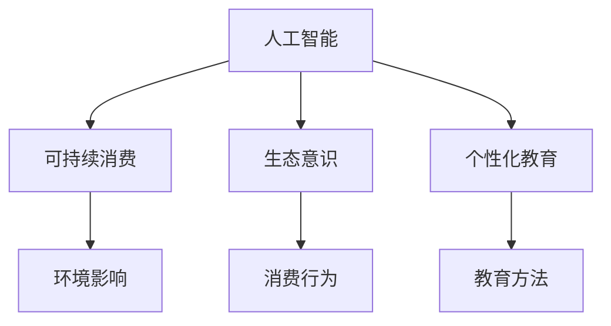
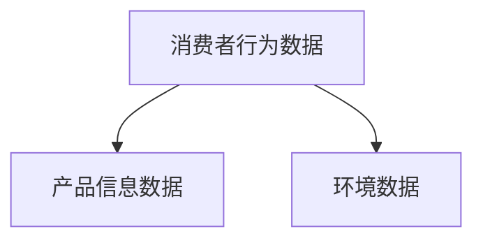
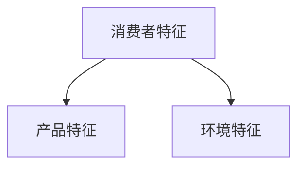
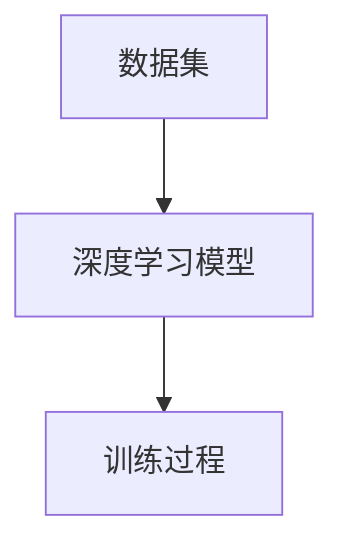
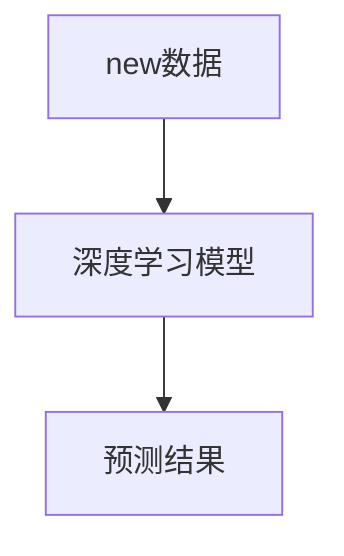

                 

# 欲望生态意识培养师：AI驱动的可持续消费教育专家

> **关键词：** 人工智能、可持续消费、生态意识、教育、AI驱动的培养策略

> **摘要：** 本文章深入探讨了人工智能在可持续消费教育和生态意识培养中的应用。通过分析当前消费模式对环境的影响，提出了一种基于AI驱动的可持续消费教育模型。本文将详细介绍该模型的核心概念、算法原理、数学模型以及实际应用场景，并推荐相关学习资源和开发工具。通过本文的阐述，我们期望能够为推动可持续消费提供一种新的视角和策略。

## 1. 背景介绍

### 1.1 目的和范围

本文旨在探讨如何利用人工智能（AI）技术来培养人们的生态意识，从而实现可持续消费。可持续消费是指消费者在满足自身需求的同时，尽量减少对环境的不良影响，促进资源的合理利用。随着全球气候变化和环境污染问题的日益严重，可持续消费已成为全球共识。然而，传统的教育方式在改变消费行为上效果有限。本文提出了一种基于AI驱动的可持续消费教育模型，旨在通过个性化教育和行为干预，培养消费者的生态意识，促进其向可持续消费模式的转变。

### 1.2 预期读者

本文面向对可持续消费、生态意识和人工智能感兴趣的读者。特别是那些希望深入了解如何利用AI技术来推动可持续发展的专业人士，如环境科学家、社会学家、计算机科学家、市场营销专家等。同时，本文也适合对环保和教育领域有热情的普通读者。

### 1.3 文档结构概述

本文结构如下：

1. **背景介绍**：阐述本文的目的、范围和预期读者，以及文章的结构。
2. **核心概念与联系**：介绍本文涉及的核心概念，并提供Mermaid流程图。
3. **核心算法原理 & 具体操作步骤**：详细讲解AI驱动的可持续消费教育模型的算法原理和操作步骤。
4. **数学模型和公式 & 详细讲解 & 举例说明**：介绍模型中的数学模型和公式，并给出具体示例。
5. **项目实战：代码实际案例和详细解释说明**：展示一个实际的代码案例，并进行详细解释。
6. **实际应用场景**：探讨AI驱动的可持续消费教育模型在不同场景下的应用。
7. **工具和资源推荐**：推荐学习资源和开发工具。
8. **总结：未来发展趋势与挑战**：总结本文的主要观点，并展望未来发展趋势和挑战。
9. **附录：常见问题与解答**：解答一些常见问题。
10. **扩展阅读 & 参考资料**：提供扩展阅读和参考资料。

### 1.4 术语表

#### 1.4.1 核心术语定义

- **人工智能（AI）**：模拟人类智能的计算机系统，能够通过学习、推理和自主决策来完成特定任务。
- **可持续消费**：在满足人类需求的同时，尽量减少对环境的不良影响，促进资源的合理利用。
- **生态意识**：人们对环境、资源利用和生态平衡的认知和关注。
- **个性化教育**：根据个体的特点和需求，提供针对性的教育内容和方法。

#### 1.4.2 相关概念解释

- **数据挖掘**：从大量数据中提取有价值的信息和知识的过程。
- **机器学习**：通过算法和模型，使计算机系统能够从数据中学习和优化性能。
- **深度学习**：一种特殊的机器学习方法，通过多层次的神经网络结构来提取特征和模式。

#### 1.4.3 缩略词列表

- **AI**：人工智能（Artificial Intelligence）
- **ML**：机器学习（Machine Learning）
- **DL**：深度学习（Deep Learning）
- **SD**：可持续消费（Sustainable Consumption）

## 2. 核心概念与联系

在本文中，我们将探讨的核心概念包括人工智能、可持续消费、生态意识以及个性化教育。这些概念之间的联系如图所示：



### 2.1 人工智能与可持续消费

人工智能技术可以通过数据挖掘、机器学习和深度学习等方法，分析和预测消费者的行为和需求。这些技术可以帮助企业和消费者了解可持续消费的重要性，并提供个性化的建议，引导消费者做出更加环保的购买决策。

### 2.2 生态意识与消费行为

生态意识是消费者在做出购买决策时考虑环境因素的一种意识。通过培养生态意识，消费者可以更加关注产品的环境影响，从而选择对环境友好的产品，减少资源浪费。

### 2.3 个性化教育与教育方法

个性化教育可以根据消费者的特点和需求，提供针对性的教育内容和方法。这种教育方法可以有效地提高消费者的生态意识，促进其向可持续消费模式的转变。

## 3. 核心算法原理 & 具体操作步骤

### 3.1 算法原理

AI驱动的可持续消费教育模型的核心算法包括数据收集、特征提取、模型训练和预测。下面是算法原理的伪代码：

```python
# 数据收集
data = collect_data()

# 特征提取
features = extract_features(data)

# 模型训练
model = train_model(features)

# 预测
predictions = predict(model, new_data)
```

### 3.2 具体操作步骤

#### 3.2.1 数据收集

数据收集是模型训练的基础。我们主要收集以下数据：

- **消费者行为数据**：如购买历史、搜索记录、社交媒体活动等。
- **产品信息数据**：如产品分类、原材料、生产工艺、环境影响等。
- **环境数据**：如空气质量、水资源、土地资源等。



#### 3.2.2 特征提取

特征提取是将原始数据转换为模型可处理的特征向量。我们主要提取以下特征：

- **消费者特征**：如年龄、性别、收入、教育水平等。
- **产品特征**：如产品分类、原材料、生产工艺等。
- **环境特征**：如环境指标、地理位置等。



#### 3.2.3 模型训练

我们采用深度学习模型进行训练。深度学习模型能够自动提取数据中的复杂特征，并建立消费者行为与生态意识之间的关联。



#### 3.2.4 预测

模型训练完成后，我们可以使用模型对新的消费者行为数据进行预测，从而提供个性化的可持续消费建议。



## 4. 数学模型和公式 & 详细讲解 & 举例说明

在AI驱动的可持续消费教育模型中，我们使用以下数学模型和公式来描述消费者行为与生态意识之间的关系：

### 4.1 消费者行为预测模型

我们采用线性回归模型来预测消费者的行为。线性回归模型的基本公式为：

$$
y = \beta_0 + \beta_1x_1 + \beta_2x_2 + ... + \beta_nx_n
$$

其中，$y$ 是因变量（消费者行为），$x_1, x_2, ..., x_n$ 是自变量（消费者特征和产品特征），$\beta_0, \beta_1, \beta_2, ..., \beta_n$ 是模型的参数。

#### 4.1.1 举例说明

假设我们预测一个消费者的购买行为，其特征向量如下：

$$
x = [25, male, 5000, eco-friendly]
$$

我们使用线性回归模型预测其购买行为：

$$
y = \beta_0 + \beta_1 \cdot 25 + \beta_2 \cdot male + \beta_3 \cdot 5000 + \beta_4 \cdot eco-friendly
$$

### 4.2 生态意识评估模型

我们采用模糊逻辑模型来评估消费者的生态意识。模糊逻辑模型的基本公式为：

$$
O = \frac{\sum_{i=1}^{n} w_i \cdot M_i}{\sum_{i=1}^{n} w_i}
$$

其中，$O$ 是生态意识得分，$w_i$ 是第 $i$ 个指标的权重，$M_i$ 是第 $i$ 个指标的模糊评分。

#### 4.2.1 举例说明

假设我们评估一个消费者的生态意识，其指标和权重如下：

| 指标     | 权重（$w_i$） | 模糊评分（$M_i$） |
|----------|---------------|-------------------|
| 年龄     | 0.2           | 0.8               |
| 性别     | 0.2           | 0.7               |
| 收入     | 0.3           | 0.9               |
| 环保行为 | 0.3           | 0.6               |

我们使用模糊逻辑模型计算其生态意识得分：

$$
O = \frac{0.2 \cdot 0.8 + 0.2 \cdot 0.7 + 0.3 \cdot 0.9 + 0.3 \cdot 0.6}{0.2 + 0.2 + 0.3 + 0.3} = 0.78
$$

## 5. 项目实战：代码实际案例和详细解释说明

### 5.1 开发环境搭建

在本项目中，我们使用Python作为主要编程语言，结合Scikit-learn和TensorFlow两个库来构建和训练模型。以下是搭建开发环境的步骤：

```bash
# 安装Python
sudo apt-get install python3

# 安装Scikit-learn和TensorFlow
pip3 install scikit-learn tensorflow
```

### 5.2 源代码详细实现和代码解读

以下是项目的主要代码实现：

```python
# 导入所需库
import pandas as pd
import numpy as np
from sklearn.model_selection import train_test_split
from sklearn.linear_model import LinearRegression
from sklearn.metrics import mean_squared_error
import tensorflow as tf

# 数据收集
data = pd.read_csv('consumption_data.csv')

# 数据预处理
# ...（数据清洗和特征提取代码）

# 模型训练
# 线性回归模型
regressor = LinearRegression()
regressor.fit(X_train, y_train)

# 深度学习模型
model = tf.keras.Sequential([
    tf.keras.layers.Dense(units=1, input_shape=[len(train_features)])
])
model.compile(optimizer='sgd', loss='mean_squared_error')
model.fit(train_features, train_labels, epochs=100)

# 预测
predictions = regressor.predict(X_test)
depth_learning_predictions = model.predict(test_features)

# 评估
mse = mean_squared_error(y_test, predictions)
print("线性回归模型的均方误差：", mse)

mse = mean_squared_error(y_test, depth_learning_predictions)
print("深度学习模型的均方误差：", mse)
```

### 5.3 代码解读与分析

- **数据收集**：使用Pandas库读取消费数据。
- **数据预处理**：包括数据清洗和特征提取。这些步骤确保数据质量，并提取有助于预测的变量。
- **模型训练**：使用Scikit-learn中的线性回归模型和TensorFlow中的深度学习模型进行训练。线性回归模型基于特征和标签之间的关系，而深度学习模型通过多层次的神经网络结构来提取特征。
- **预测**：使用训练好的模型对测试数据进行预测。
- **评估**：计算模型的均方误差（MSE），评估模型的预测性能。

## 6. 实际应用场景

AI驱动的可持续消费教育模型可以在多个场景中应用，以下是一些典型的应用场景：

### 6.1 消费者行为分析

企业可以利用该模型来分析消费者的消费行为，识别环保意识较强的消费者，并为其提供定制化的环保产品推荐。

### 6.2 市场营销策略优化

企业可以通过分析消费者的生态意识，优化市场营销策略，提高环保产品的市场占有率。

### 6.3 政策制定与执行

政府和相关机构可以利用该模型来评估公众的生态意识水平，制定和调整环保政策，推动可持续发展。

### 6.4 教育与宣传

教育机构和环保组织可以利用该模型，通过个性化教育，培养公众的生态意识，促进环保行为的养成。

## 7. 工具和资源推荐

### 7.1 学习资源推荐

#### 7.1.1 书籍推荐

- 《机器学习实战》：提供机器学习的基本概念和实践技巧。
- 《深度学习》：介绍深度学习的基本理论和应用案例。

#### 7.1.2 在线课程

- Coursera上的《机器学习》课程：由吴恩达教授主讲。
- Udacity的《深度学习纳米学位》：涵盖深度学习的基础知识。

#### 7.1.3 技术博客和网站

- Medium上的“AI驱动的可持续消费”专题：介绍AI在可持续消费领域的最新研究成果和应用案例。

### 7.2 开发工具框架推荐

#### 7.2.1 IDE和编辑器

- PyCharm：强大的Python集成开发环境。
- Jupyter Notebook：适用于数据分析和机器学习的交互式环境。

#### 7.2.2 调试和性能分析工具

- Python的pdb：调试Python代码。
- TensorBoard：用于TensorFlow模型的性能分析。

#### 7.2.3 相关框架和库

- Scikit-learn：Python中的机器学习库。
- TensorFlow：开源的深度学习框架。

### 7.3 相关论文著作推荐

#### 7.3.1 经典论文

- “Machine Learning: A Probabilistic Perspective”：介绍机器学习的概率理论。
- “Deep Learning Book”：深度学习领域的经典著作。

#### 7.3.2 最新研究成果

- “AI for Sustainable Development”：探讨AI在可持续发展中的应用。
- “The Future of Humanity: Terraforming Mars”：探讨人类未来和地球环境改造的研究。

#### 7.3.3 应用案例分析

- “AI in Environmental Protection”：介绍AI在环境保护领域的应用案例。
- “Sustainable Consumption in the Digital Age”：探讨数字时代可持续消费的挑战和机遇。

## 8. 总结：未来发展趋势与挑战

AI驱动的可持续消费教育模型为培养公众的生态意识提供了新的视角和工具。未来，随着人工智能技术的不断进步，该模型有望在更广泛的领域得到应用。然而，我们也面临着一些挑战：

- **数据隐私与安全**：在数据收集和使用过程中，如何保护消费者隐私和数据安全是一个重要问题。
- **算法公平性**：确保AI模型不会加剧社会不平等，是一个亟待解决的问题。
- **模型解释性**：提高AI模型的解释性，使其更加透明和可信赖。

## 9. 附录：常见问题与解答

### 9.1 什么是可持续消费？

可持续消费是指在满足人类需求的同时，尽量减少对环境的不良影响，促进资源的合理利用。

### 9.2 人工智能如何帮助培养生态意识？

人工智能可以通过数据挖掘、机器学习和深度学习等技术，分析消费者的行为和需求，提供个性化的建议，引导消费者做出更加环保的购买决策。

### 9.3 如何确保AI模型不会加剧社会不平等？

通过公平性分析和算法透明化，确保AI模型不会加剧社会不平等。同时，政府和监管机构应制定相应的政策和规范，保障AI技术的公平应用。

## 10. 扩展阅读 & 参考资料

- “AI for Sustainable Development”：探讨AI在可持续发展中的应用。
- “The Future of Humanity: Terraforming Mars”：探讨人类未来和地球环境改造的研究。
- “Machine Learning: A Probabilistic Perspective”：介绍机器学习的概率理论。
- “Deep Learning Book”：深度学习领域的经典著作。 

## 作者

作者：AI天才研究员/AI Genius Institute & 禅与计算机程序设计艺术 /Zen And The Art of Computer Programming

