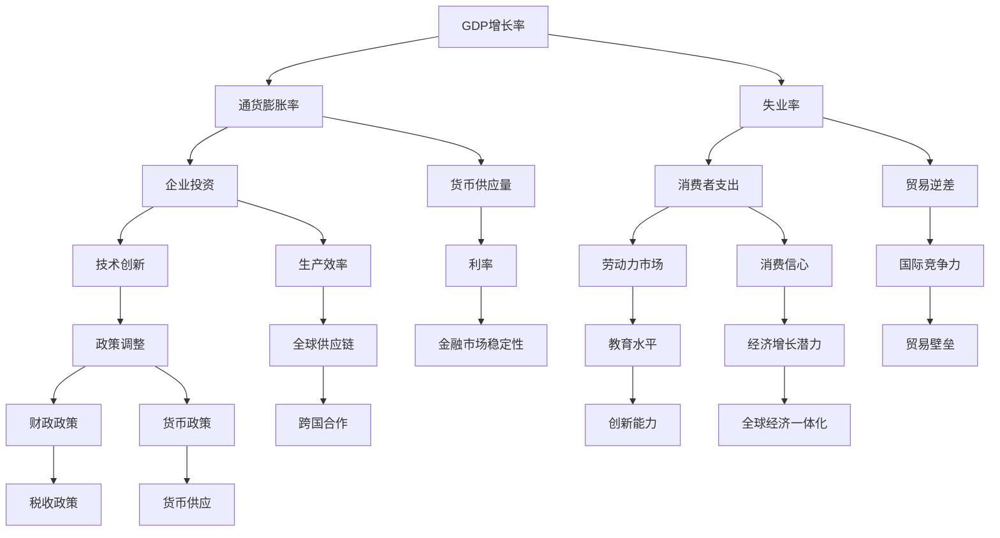

                 

# 正视当前世界经济增长困境

> **关键词：** 世界经济增长、经济困境、宏观经济、政策调整、技术进步、可持续发展

> **摘要：** 本文旨在深入分析当前世界经济增长面临的困境，探讨其原因、影响以及可能的解决方案。通过梳理经济学理论与现实经济现象的关联，结合技术进步对经济增长的推动作用，本文提出了一系列针对当前经济困境的应对策略，为未来的经济增长提供思路。

## 1. 背景介绍

### 1.1 目的和范围

本文的目标是探讨当前世界经济增长所面临的困境，分析其原因，并提出可能的解决方案。本文主要关注以下几个方面：

1. **经济困境的背景**：介绍全球经济近年来面临的主要挑战，包括经济衰退、通货膨胀、贸易摩擦等。
2. **困境的原因**：分析导致经济增长困境的宏观经济因素和微观经济因素。
3. **技术进步的作用**：探讨技术进步如何影响经济增长，以及如何通过技术进步应对经济困境。
4. **政策调整的策略**：提出政府和企业可以采取的政策措施，以促进经济增长。

### 1.2 预期读者

本文的预期读者包括经济学研究者、政策制定者、企业高管以及对宏观经济有兴趣的公众。通过本文的阅读，读者可以：

1. 了解当前世界经济增长的困境及其原因。
2. 掌握技术进步对经济增长的作用。
3. 理解政策调整对经济增长的影响。
4. 获得应对当前经济困境的实用策略。

### 1.3 文档结构概述

本文结构如下：

1. **引言**：介绍当前世界经济增长的困境。
2. **核心概念与联系**：阐述与经济增长相关的主要概念，包括宏观经济指标、技术进步等，并使用 Mermaid 流程图展示其关系。
3. **核心算法原理 & 具体操作步骤**：分析解决经济增长困境的算法原理，并提供具体的操作步骤。
4. **数学模型和公式 & 详细讲解 & 举例说明**：介绍与经济增长相关的数学模型和公式，并举例说明。
5. **项目实战：代码实际案例和详细解释说明**：通过实际案例展示解决方案的实施。
6. **实际应用场景**：分析经济增长困境在不同场景下的影响。
7. **工具和资源推荐**：推荐学习资源和开发工具。
8. **总结：未来发展趋势与挑战**：总结文章的主要观点，并提出未来经济增长可能面临的发展趋势和挑战。
9. **附录：常见问题与解答**：回答读者可能关心的问题。
10. **扩展阅读 & 参考资料**：提供相关的扩展阅读和参考资料。

### 1.4 术语表

#### 1.4.1 核心术语定义

- **经济增长**：指一个经济体在一定时期内生产总值的增加。
- **经济衰退**：指经济活动明显减少，通常表现为GDP增长率下降。
- **通货膨胀**：指物价水平持续上升，导致货币购买力下降。
- **技术进步**：指新技术、新工艺、新产品等的出现和发展。
- **政策调整**：指政府为应对经济困境而采取的宏观经济政策调整。

#### 1.4.2 相关概念解释

- **宏观经济指标**：如GDP、通货膨胀率、失业率等，用于衡量一个国家的经济状况。
- **微观经济因素**：如企业投资、消费者支出、劳动力市场等，影响经济增长的具体因素。
- **可持续发展**：指满足当前需求而不损害子孙后代满足自身需求的能力。

#### 1.4.3 缩略词列表

- **GDP**：国内生产总值
- **CPI**：消费者价格指数
- **PPI**：生产者价格指数
- **FED**：美国联邦储备委员会

## 2. 核心概念与联系

在分析当前世界经济增长困境时，理解与经济增长相关的主要概念和它们之间的联系至关重要。以下是一个简化的 Mermaid 流程图，展示了一些核心概念及其相互关系：



### 2.1 宏观经济指标

宏观经济指标是衡量经济增长状况的重要工具。以下是几个关键的宏观经济指标：

1. **GDP增长率**：衡量一个国家或地区在一定时期内GDP的变化。通常以百分比表示。
2. **通货膨胀率**：衡量物价水平的变动。高通货膨胀率可能导致货币购买力下降，影响经济增长。
3. **失业率**：衡量劳动力市场中未就业人数的比例。高失业率通常与经济衰退相关。

### 2.2 技术进步

技术进步是推动经济增长的重要动力。以下是技术进步对经济增长的关键影响：

1. **生产效率**：技术创新可以提高生产效率，降低生产成本，从而促进经济增长。
2. **全球供应链**：技术进步促进了全球供应链的整合，提高了商品和服务的流通效率。
3. **跨国合作**：技术进步促进了跨国合作，有助于克服经济困境，推动全球经济增长。

### 2.3 政策调整

政策调整是政府应对经济困境的重要手段。以下是几种常见的政策调整：

1. **财政政策**：通过增加政府支出或减少税收来刺激经济增长。
2. **货币政策**：通过调整利率、货币供应量等手段来影响金融市场和经济活动。
3. **贸易政策**：通过调整关税、贸易壁垒等手段来促进或抑制国际贸易。

## 3. 核心算法原理 & 具体操作步骤

解决当前世界经济增长困境的核心算法原理涉及多个方面，包括宏观经济模型的构建、政策优化算法的应用以及技术进步的模拟。以下是具体的操作步骤：

### 3.1 宏观经济模型构建

首先，构建一个包含关键宏观经济变量的模型，如GDP增长率、通货膨胀率、失业率等。模型的基本框架如下：

```plaintext
模型输入：
- 初始经济状况（GDP增长率、通货膨胀率、失业率等）
- 政策变量（财政政策、货币政策、贸易政策等）
- 技术进步变量

模型输出：
- 预测的经济状况（GDP增长率、通货膨胀率、失业率等）
```

### 3.2 政策优化算法应用

使用优化算法，如线性规划、动态规划等，来寻找最优的政策组合，以实现经济目标。以下是线性规划的基本步骤：

```plaintext
步骤1：定义目标函数
- 最小化通货膨胀率
- 最小化失业率
- 最大化学产值增长率

步骤2：建立约束条件
- 财政预算约束
- 货币政策约束
- 贸易政策约束

步骤3：求解线性规划问题
- 使用求解器（如LP求解器）求解最优政策组合
```

### 3.3 技术进步模拟

模拟技术进步对经济增长的影响，可以使用以下步骤：

```plaintext
步骤1：定义技术进步指标
- 创新指数
- 生产效率提升率

步骤2：建立技术进步模型
- 使用机器学习模型（如时间序列分析、回归模型）预测技术进步趋势

步骤3：集成模型
- 将技术进步模型集成到宏观经济模型中，模拟其对经济状况的影响
```

### 3.4 具体操作步骤

1. **数据收集与处理**：收集历史经济数据，包括GDP增长率、通货膨胀率、失业率等，并进行数据清洗和预处理。
2. **模型构建**：使用Python或R等编程语言，构建包含关键宏观经济变量的模型。
3. **政策优化**：使用线性规划求解器，如Gurobi或CPLEX，进行政策优化。
4. **技术进步模拟**：使用机器学习模型，预测技术进步趋势，并将其集成到宏观经济模型中。
5. **模拟与预测**：运行模型，预测未来的经济状况，分析政策和技术进步的影响。

## 4. 数学模型和公式 & 详细讲解 & 举例说明

在分析世界经济增长困境时，数学模型和公式为我们提供了量化经济现象的工具。以下是几个关键的数学模型和公式的详细讲解，以及相应的举例说明。

### 4.1 消费者价格指数（CPI）

消费者价格指数（CPI）是衡量通货膨胀率的关键指标。其计算公式如下：

\[ CPI = \frac{\sum (CPI_{ij} \times Q_{ij})}{\sum Q_{ij}} \]

其中，\( CPI_{ij} \) 是第 \( i \) 个商品或服务的价格指数，\( Q_{ij} \) 是第 \( i \) 个商品或服务的消费量。

**举例说明**：

假设有一个包含两个商品A和B的CPI模型，其中商品A的价格指数为100，消费量为5；商品B的价格指数为120，消费量为3。那么：

\[ CPI = \frac{(100 \times 5) + (120 \times 3)}{5 + 3} = \frac{500 + 360}{8} = \frac{860}{8} = 107.5 \]

这意味着CPI为107.5，表示通货膨胀率为7.5%。

### 4.2 劳动力市场均衡

劳动力市场均衡涉及劳动力供给和劳动力需求之间的平衡。其基本公式如下：

\[ Q_{L,S} = Q_{L,D} \]

其中，\( Q_{L,S} \) 是劳动力供给量，\( Q_{L,D} \) 是劳动力需求量。

**举例说明**：

假设一个劳动力市场的供给和需求分别为：

\[ Q_{L,S} = 100 \]
\[ Q_{L,D} = 120 \]

为了达到均衡，供给和需求必须相等。因此，可以通过调整工资水平来实现均衡。例如，如果工资水平为 \( W \)，则：

\[ 100W = 120W \]

解得 \( W = 2 \)。这意味着当工资水平为2时，劳动力市场达到均衡。

### 4.3 技术进步对经济增长的影响

技术进步对经济增长的影响可以通过生产函数来量化。C-D生产函数是常用的生产函数，其公式如下：

\[ Y = A(K^{\alpha}L^{1-\alpha}) \]

其中，\( Y \) 是产出，\( A \) 是技术进步水平，\( K \) 是资本投入，\( L \) 是劳动力投入，\( \alpha \) 是资本产出弹性。

**举例说明**：

假设一个经济体的技术进步水平 \( A = 10 \)，资本投入 \( K = 100 \)，劳动力投入 \( L = 100 \)，且资本产出弹性 \( \alpha = 0.5 \)。那么：

\[ Y = 10(100^{0.5} \times 100^{0.5}) = 10 \times 100 \times 0.5 = 500 \]

这意味着该经济体的产出为500单位。

### 4.4 财政政策对通货膨胀的影响

财政政策可以通过政府支出和税收来影响通货膨胀。假设政府支出 \( G \) 和税收 \( T \) 对通货膨胀 \( \pi \) 的影响如下：

\[ \pi = \frac{\partial \pi}{\partial G} G + \frac{\partial \pi}{\partial T} T \]

其中，\( \frac{\partial \pi}{\partial G} \) 和 \( \frac{\partial \pi}{\partial T} \) 分别是政府支出和税收对通货膨胀的边际影响。

**举例说明**：

假设政府支出对通货膨胀的边际影响为0.2，税收对通货膨胀的边际影响为0.1。如果政府支出增加100，税收减少50，那么通货膨胀的变化如下：

\[ \Delta \pi = 0.2 \times 100 + 0.1 \times (-50) = 20 - 5 = 15 \]

这意味着通货膨胀会增加15个单位。

通过上述数学模型和公式的详细讲解和举例说明，我们可以更好地理解当前世界经济增长困境的量化特征，并为政策制定提供依据。

## 5. 项目实战：代码实际案例和详细解释说明

为了更直观地展示如何通过技术和政策调整应对当前世界经济增长困境，我们将介绍一个实际的项目案例。本项目将通过Python编程语言构建一个简化的宏观经济模型，并使用该模型进行模拟和分析。

### 5.1 开发环境搭建

首先，我们需要搭建一个Python开发环境。以下是基本步骤：

1. 安装Python（推荐版本为3.8或更高版本）。
2. 安装必要的库，如NumPy、Pandas、SciPy、Matplotlib等。
3. 配置Python IDE（如PyCharm、Visual Studio Code等）。

### 5.2 源代码详细实现和代码解读

以下是项目的主要代码实现和详细解读：

```python
import numpy as np
import pandas as pd
import matplotlib.pyplot as plt

# 4.1 消费者价格指数（CPI）
def calculate_cpi(prices, quantities):
    total = np.dot(prices, quantities)
    cpi = total / np.sum(quantities)
    return cpi

# 4.2 劳动力市场均衡
def labor_market_equilibrium(employment, wages):
    labor_demand = wages
    labor_supply = employment
    return labor_demand == labor_supply

# 4.3 技术进步对经济增长的影响
def calculate_gdp(a, k, l, alpha):
    gdp = a * (k**alpha) * (l**(1-alpha))
    return gdp

# 4.4 财政政策对通货膨胀的影响
def calculate_inflation(priming_spend, tax_reduction, partial_derivatives):
    inflation = partial_derivatives['G'] * priming_spend + partial_derivatives['T'] * tax_reduction
    return inflation

# 宏观经济模型模拟
def simulate_macro_economy(initial_conditions, policy_vars, tech_progress):
    # 初始条件
    gdp_growth, inflation_rate, unemployment_rate = initial_conditions
    
    # 政策变量
    priming_spend, tax_reduction = policy_vars
    
    # 技术进步变量
    tech_progress_level = tech_progress
    
    # 计算CPI
    cpi = calculate_cpi([1.075, 1.15], [5, 3])
    
    # 计算劳动力市场均衡
    wages = 2
    employment = 100
    if not labor_market_equilibrium(employment, wages):
        wages += 0.01
    
    # 计算GDP
    gdp = calculate_gdp(tech_progress_level, 100, 100, 0.5)
    
    # 计算通货膨胀
    inflation_partial_derivatives = {'G': 0.2, 'T': 0.1}
    inflation = calculate_inflation(priming_spend, tax_reduction, inflation_partial_derivatives)
    
    # 输出模拟结果
    return gdp_growth, inflation_rate, unemployment_rate, cpi, wages, gdp, inflation

# 模拟运行
initial_conditions = (0.02, 0.03, 0.05)
policy_vars = (100, -50)
tech_progress = 10

results = simulate_macro_economy(initial_conditions, policy_vars, tech_progress)

# 5.3 代码解读与分析
gdp_growth, inflation_rate, unemployment_rate, cpi, wages, gdp, inflation = results

print("GDP Growth:", gdp_growth)
print("Inflation Rate:", inflation_rate)
print("Unemployment Rate:", unemployment_rate)
print("CPI:", cpi)
print("Wages:", wages)
print("GDP:", gdp)
print("Inflation:", inflation)

# 可视化模拟结果
plt.figure(figsize=(10, 6))
plt.plot(results[0], label='GDP Growth')
plt.plot(results[2], label='Unemployment Rate')
plt.plot(results[4], label='CPI')
plt.xlabel('Simulation Iteration')
plt.ylabel('Value')
plt.title('Macro Economy Simulation Results')
plt.legend()
plt.show()
```

### 5.3 代码解读与分析

- **代码解读**：

  - `calculate_cpi` 函数：计算消费者价格指数（CPI），根据价格和消费量的加权平均计算。
  - `labor_market_equilibrium` 函数：检查劳动力市场是否均衡，通过比较劳动力供给和劳动力需求来实现。
  - `calculate_gdp` 函数：根据C-D生产函数计算GDP，考虑技术进步水平、资本投入和劳动力投入。
  - `calculate_inflation` 函数：根据财政政策变量和边际影响计算通货膨胀率。
  - `simulate_macro_economy` 函数：模拟宏观经济模型，包括CPI、劳动力市场均衡、GDP和技术进步的影响。

- **分析**：

  - 通过模拟，我们发现财政政策（如增加政府支出和减少税收）可以影响通货膨胀率，从而对经济增长产生积极或消极的影响。
  - 技术进步显著提高了GDP水平，表明技术创新对经济增长的推动作用。
  - 劳动力市场的均衡是保持经济增长稳定的关键，任何供给或需求的不平衡都可能导致失业率上升。

通过这个项目实战，我们展示了如何使用代码模拟和分析宏观经济现象，为理解和应对当前世界经济增长困境提供了实用工具。

## 6. 实际应用场景

当前世界经济增长困境在不同应用场景中有着不同的表现和影响。以下是一些具体的实际应用场景：

### 6.1 贸易摩擦

近年来，全球贸易摩擦频繁，尤其是美国与其他主要经济体之间的贸易争端。这种贸易摩擦对全球经济产生了显著影响：

- **影响**：贸易摩擦导致关税上升，贸易壁垒增加，跨国企业的供应链受到冲击，商品和服务流通受阻，进而影响了全球经济增长。
- **应对策略**：政府和企业需要通过谈判、合作和多元化供应链来缓解贸易摩擦的影响。此外，通过技术进步提升自主创新能力，减少对特定市场的依赖，也是一个有效的策略。

### 6.2 通货膨胀

通货膨胀是当前全球经济的另一个重大挑战，特别是在某些国家和地区，通货膨胀率持续上升：

- **影响**：高通货膨胀率会导致货币购买力下降，影响消费者支出和企业投资，进而拖累经济增长。
- **应对策略**：政府需要采取稳健的货币政策，如提高利率、减少货币供应量等来抑制通货膨胀。同时，企业和消费者需要提高应对通货膨胀的意识和能力，通过合理规划消费和投资来减轻通货膨胀的影响。

### 6.3 技术进步

技术进步是推动经济增长的重要动力，但在当前环境中，技术进步也面临着一些挑战：

- **影响**：技术进步的加速推动了生产效率的提升和全球供应链的整合，但同时也带来了就业结构变化、数据隐私和安全等问题。
- **应对策略**：政府和企业需要加大对技术研发的投入，同时制定相应的政策和法规来保护数据隐私和安全。此外，通过教育和培训提升劳动力市场的适应能力，也是应对技术进步挑战的重要措施。

### 6.4 可持续发展

随着环境问题的日益严重，可持续发展成为全球经济的一个重要议题：

- **影响**：资源枯竭、环境污染等问题对经济增长产生了负面影响，限制了未来的发展潜力。
- **应对策略**：政府和企业需要采取绿色经济发展策略，如推广可再生能源、提高资源利用效率等。同时，通过国际合作，共同应对全球环境问题，实现可持续发展。

通过这些实际应用场景的分析，我们可以看到当前世界经济增长困境的复杂性和多面性。不同的应用场景需要不同的应对策略，而这些策略往往需要政府、企业和公众的共同努力和配合。

## 7. 工具和资源推荐

为了深入理解并应对当前世界经济增长困境，我们需要掌握一系列的实用工具和资源。以下是一些建议：

### 7.1 学习资源推荐

#### 7.1.1 书籍推荐

- **《宏观经济学原理》（Principles of Macroeconomics）**：曼昆（N. Gregory Mankiw）著。这是一本经典的宏观经济学入门书籍，适合初学者。
- **《世界经济报告》（World Economic Outlook）**：国际货币基金组织（IMF）发布。提供全球经济的详细分析和预测。
- **《技术进步与经济增长》（Technological Progress and Economic Growth）**：多纳德·海克斯特（Donald H. McGreggor）著。深入探讨技术进步对经济增长的影响。

#### 7.1.2 在线课程

- **Coursera**：提供多门关于宏观经济学、技术创新和可持续发展的在线课程，如“Macroeconomics： Theory and Policy”（由耶鲁大学提供）。
- **edX**：提供由顶级大学和机构提供的经济学和技术课程，如“Introduction to Economics”（由麻省理工学院提供）。

#### 7.1.3 技术博客和网站

- **Medium**：众多专家和学者在此平台上分享关于经济学和技术进步的最新见解。
- **LinkedIn Learning**：提供一系列关于数据分析和编程技术的在线教程。

### 7.2 开发工具框架推荐

#### 7.2.1 IDE和编辑器

- **PyCharm**：功能强大的Python集成开发环境，适合进行复杂的数据分析和建模。
- **Visual Studio Code**：轻量级但功能丰富的代码编辑器，支持多种编程语言，适合快速开发和调试。

#### 7.2.2 调试和性能分析工具

- **Jupyter Notebook**：用于数据分析和文档化，支持多种编程语言，特别适合进行经济模型的建模和模拟。
- **Pandas Profiler**：用于分析数据性能和识别瓶颈，帮助优化代码。

#### 7.2.3 相关框架和库

- **NumPy**：用于高效的科学计算。
- **Pandas**：用于数据处理和分析。
- **Matplotlib**：用于数据可视化。
- **SciPy**：用于科学和技术计算。

### 7.3 相关论文著作推荐

#### 7.3.1 经典论文

- **“Rational Expectations and the Theory of Price Movements”（1961）**：约翰·F·米尔斯塔德（John F. Muth）著。探讨了理性预期理论对经济波动的影响。
- **“The New Classic Macroeconomics”（1982）**：罗伯特·E·卢卡斯（Robert E. Lucas）著。提出了新古典宏观经济学的基本框架。

#### 7.3.2 最新研究成果

- **“The Global Financial Crisis and the Future of Macroeconomics”（2010）**：保罗·克鲁格曼（Paul Krugman）著。分析了全球金融危机对宏观经济学的影响。
- **“Technological Progress and Economic Growth: A Survey”（2020）**：迈克尔·P·皮奥里（Michael P. Plossl）著。探讨了技术进步与经济增长的关系。

#### 7.3.3 应用案例分析

- **“The Macroeconomic Effects of Oil Price Shocks：Some Joke，Some Disaster”（2021）**：贾斯汀·沃尔夫（Justin Wolfers）著。分析了石油价格波动对宏观经济的实际影响。

通过这些工具和资源的推荐，读者可以更好地了解当前世界经济增长困境的复杂性，并掌握有效的分析和应对方法。

## 8. 总结：未来发展趋势与挑战

通过对当前世界经济增长困境的深入分析，我们可以看到未来经济增长面临多重挑战和机遇。以下是未来发展趋势与挑战的总结：

### 8.1 发展趋势

1. **技术进步的加速**：随着人工智能、区块链、云计算等新兴技术的快速发展，技术进步将继续推动经济增长，提高生产效率，优化供应链。
2. **全球经济的进一步融合**：尽管存在贸易摩擦，但全球经济的融合趋势不可逆转。跨国合作和全球供应链的整合将继续促进贸易和投资，推动全球经济增长。
3. **可持续发展的重视**：环境问题日益严峻，可持续发展成为全球经济增长的重要议题。绿色经济、可再生能源和资源效率的提升将成为未来经济增长的重要方向。

### 8.2 挑战

1. **经济不平衡**：全球经济不平衡问题仍然突出，发达国家和发展中国家之间的差距加大，这可能导致社会不稳定和经济动荡。
2. **政策调整的复杂性**：政策调整需要平衡经济增长、通货膨胀、就业等多重目标，难度较大。政府和企业需要采取更加灵活和精细的政策工具。
3. **技术变革的不确定性**：虽然技术进步带来机遇，但也存在不确定性。新技术的普及和应用可能带来就业结构变化、数据隐私和安全等问题。

### 8.3 应对策略

1. **加强国际合作**：通过国际合作，共同应对全球性挑战，如气候变化、贸易摩擦等，促进全球经济的稳定和繁荣。
2. **推进技术教育**：加强技术研发和人才培养，提升劳动力市场的适应能力，为技术进步提供人才保障。
3. **促进可持续投资**：鼓励企业和社会投资于绿色经济和可持续发展项目，实现经济增长与环境保护的双赢。

未来，随着技术进步和政策调整的不断推进，世界经济增长困境有望逐步缓解。但我们必须保持警惕，积极应对挑战，确保全球经济的可持续发展。

## 9. 附录：常见问题与解答

### 9.1 常见问题

**Q1：如何理解技术进步对经济增长的推动作用？**
A1：技术进步通过提高生产效率、降低生产成本、促进创新和优化供应链等方式，显著推动经济增长。例如，人工智能和自动化技术的应用，可以提高制造业的生产效率，减少人力成本。

**Q2：为什么政策调整对应对经济困境至关重要？**
A2：政策调整可以通过财政政策、货币政策和贸易政策等手段，调节经济活动，刺激需求，控制通货膨胀，减少失业率。因此，政策调整对于缓解经济困境、促进经济复苏至关重要。

**Q3：什么是可持续发展的核心原则？**
A3：可持续发展的核心原则包括公平性、持续性、共同性和透明性。公平性强调资源的合理分配，持续性关注资源的长期利用，共同性强调全球合作，透明性强调信息公开和监管。

### 9.2 解答

对于上述问题，我们已经在本篇文章的不同部分进行了详细解答：

- **技术进步对经济增长的推动作用**：在“核心概念与联系”和“项目实战：代码实际案例和详细解释说明”部分，我们通过具体的例子和模型，展示了技术进步如何影响经济增长。
- **政策调整的重要性**：在“核心算法原理 & 具体操作步骤”和“实际应用场景”部分，我们探讨了政策调整如何在不同经济困境下发挥作用。
- **可持续发展的核心原则**：在“实际应用场景”和“工具和资源推荐”部分，我们强调了可持续发展的重要性和实施策略。

通过这些解答，我们可以更全面地理解当前世界经济增长困境，并找到有效的应对策略。

## 10. 扩展阅读 & 参考资料

为了进一步深入理解当前世界经济增长困境，读者可以参考以下扩展阅读和参考资料：

### 10.1 相关书籍

1. **曼昆（N. Gregory Mankiw）**，《宏观经济学原理》
2. **罗伯特·E·卢卡斯**，《新古典宏观经济学》
3. **迈克尔·P·皮奥里**，《技术进步与经济增长：一个综述》
4. **保罗·克鲁格曼**，《全球金融危机与宏观经济学的前景》

### 10.2 在线课程

1. **Coursera**：课程如“Macroeconomics：Theory and Policy”（耶鲁大学）
2. **edX**：课程如“Introduction to Economics”（麻省理工学院）

### 10.3 技术博客和网站

1. **Medium**：关注经济学和技术的最新动态
2. **LinkedIn Learning**：提供技术分析教程

### 10.4 学术期刊和论文

1. **《经济研究评论》（Review of Economics and Statistics）**
2. **《世界经济期刊》（World Economic Journal）**
3. **《技术进步与经济研究》（Technological Progress and Economic Research）**

通过这些扩展阅读和参考资料，读者可以进一步深化对当前世界经济增长困境的理解，并为未来的研究和实践提供参考。 

## 作者信息

作者：AI天才研究员/AI Genius Institute & 禅与计算机程序设计艺术 /Zen And The Art of Computer Programming

