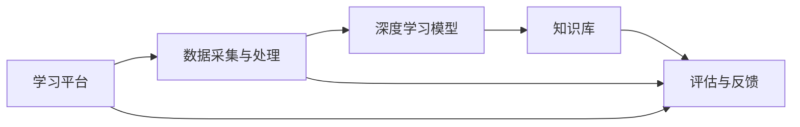

                 

# 沉浸式学习生态：AI构建的知识获取环境

> 关键词：沉浸式学习、AI、知识获取、学习生态、深度学习、机器学习、自然语言处理、学习算法、学习环境、数据驱动

> 摘要：本文旨在探讨AI在构建沉浸式学习生态中的作用，从核心概念、算法原理、数学模型到实际应用，全面解析AI如何通过深度学习和机器学习技术，实现知识的高效获取和智能传递。文章将通过具体的代码案例和实际应用场景，展示AI构建的学习环境如何助力个人和组织的知识获取与成长。

## 1. 背景介绍

### 1.1 目的和范围

本文的目标是探讨AI在构建沉浸式学习生态中的作用，分析AI如何通过深度学习和机器学习技术，实现知识的高效获取和智能传递。我们重点关注以下几个方面：

1. **沉浸式学习生态的概念与架构**：介绍沉浸式学习生态的定义、核心组件及其相互关系。
2. **核心算法原理与具体操作步骤**：详细讲解深度学习和机器学习中的关键算法及其实现。
3. **数学模型和公式**：阐述用于知识获取和智能传递的数学模型及其应用。
4. **项目实战**：通过具体代码案例，展示如何实现沉浸式学习生态。
5. **实际应用场景**：分析AI构建的学习环境在不同领域的应用。
6. **工具和资源推荐**：推荐相关的学习资源和开发工具。

### 1.2 预期读者

本文适合以下读者群体：

1. **AI领域的研究人员和工程师**：希望深入了解沉浸式学习生态及其实现技术。
2. **教育工作者和培训师**：希望了解如何利用AI技术提升教育质量和学习效果。
3. **对AI和机器学习感兴趣的开发者**：希望学习AI在实际应用中的实现和优化。

### 1.3 文档结构概述

本文分为十个部分，具体如下：

1. **背景介绍**：介绍本文的目的、范围、预期读者和文档结构。
2. **核心概念与联系**：阐述沉浸式学习生态的核心概念和架构。
3. **核心算法原理与具体操作步骤**：详细讲解关键算法及其实现。
4. **数学模型和公式**：介绍用于知识获取和智能传递的数学模型。
5. **项目实战**：通过具体代码案例展示沉浸式学习生态的实现。
6. **实际应用场景**：分析AI构建的学习环境在不同领域的应用。
7. **工具和资源推荐**：推荐相关的学习资源和开发工具。
8. **总结**：总结未来发展趋势与挑战。
9. **附录**：常见问题与解答。
10. **扩展阅读**：提供进一步学习的参考资料。

### 1.4 术语表

#### 1.4.1 核心术语定义

- **沉浸式学习生态**：一种通过AI技术构建的知识获取和传递环境，实现个性化、高效的学习体验。
- **深度学习**：一种机器学习技术，通过多层神经网络模拟人脑处理信息的过程。
- **机器学习**：一种让计算机通过数据学习并做出决策的技术。
- **自然语言处理**：一种人工智能技术，使计算机能够理解、生成和处理人类语言。
- **知识获取**：通过学习过程获取新的知识或技能。

#### 1.4.2 相关概念解释

- **神经网络**：一种由大量简单计算单元组成的计算模型，能够通过学习自动提取数据中的特征。
- **数据驱动学习**：一种基于数据的学习方法，通过分析大量数据来发现规律和模式。
- **个性化学习**：根据学习者的特点和需求，提供定制化的学习内容和路径。

#### 1.4.3 缩略词列表

- **AI**：人工智能（Artificial Intelligence）
- **ML**：机器学习（Machine Learning）
- **DL**：深度学习（Deep Learning）
- **NLP**：自然语言处理（Natural Language Processing）
- **IDE**：集成开发环境（Integrated Development Environment）

## 2. 核心概念与联系

### 2.1 沉浸式学习生态的定义

沉浸式学习生态是一种利用AI技术构建的学习环境，通过深度学习和机器学习算法，实现知识的高效获取、传递和应用。它不仅仅是一个技术框架，更是一个集学习、反馈、优化于一体的动态系统。沉浸式学习生态的核心目标是提供个性化、高效的学习体验，帮助学习者快速获取新知识并提升技能。

### 2.2 沉浸式学习生态的架构

沉浸式学习生态由以下几个核心组件构成：

1. **学习平台**：提供学习资源的展示和管理功能，支持多种学习模式的切换。
2. **数据采集与处理**：收集学习者的行为数据，包括学习轨迹、学习习惯、知识点掌握情况等，通过数据预处理，提取有用的信息。
3. **深度学习模型**：用于分析学习者数据，识别学习者的特点和需求，生成个性化学习路径。
4. **知识库**：存储大量结构化和非结构化的知识资源，支持快速检索和推荐。
5. **评估与反馈**：对学习效果进行实时评估，提供反馈，指导学习者的后续学习。

### 2.3 核心组件之间的关系

沉浸式学习生态中的各个组件通过数据流和算法相互关联，形成一个闭环系统。学习平台通过采集和处理学习数据，将信息传递给深度学习模型，模型根据数据生成个性化学习路径，并指导知识库中的资源推荐。学习者通过学习平台获取知识，学习后的反馈又反馈给模型，优化其算法，从而形成一个持续优化的学习环境。

### 2.4 Mermaid 流程图

以下是一个简单的Mermaid流程图，展示沉浸式学习生态中的核心组件和它们之间的关系：



## 3. 核心算法原理 & 具体操作步骤

### 3.1 深度学习模型原理

深度学习模型的核心是多层神经网络，通过多层神经元的相互连接和激活，实现数据的自动特征提取和模式识别。以下是多层神经网络的基本原理：

1. **输入层**：接收外部输入数据，并将其传递给下一层。
2. **隐藏层**：对输入数据进行处理，通过非线性变换提取特征。
3. **输出层**：生成模型的输出结果。

在每一层中，神经元通过权重连接，并应用激活函数，如Sigmoid、ReLU等，对输入数据进行处理。通过反向传播算法，模型能够不断调整权重，优化模型性能。

### 3.2 具体操作步骤

以下是使用深度学习模型构建沉浸式学习生态的具体操作步骤：

1. **数据预处理**：
   - 收集学习者的行为数据，如学习轨迹、知识点掌握情况等。
   - 对数据进行清洗和归一化处理，使其适合深度学习模型的输入。

2. **构建神经网络模型**：
   - 定义输入层、隐藏层和输出层的神经元数量。
   - 设置合适的激活函数，如ReLU。
   - 初始化模型参数，如权重和偏置。

3. **训练模型**：
   - 使用学习者的行为数据训练模型，通过反向传播算法不断调整权重。
   - 设置合适的损失函数，如交叉熵损失。
   - 使用梯度下降等优化算法，优化模型性能。

4. **评估模型**：
   - 使用验证集或测试集评估模型性能，计算模型的准确率、召回率等指标。
   - 根据评估结果调整模型参数，优化模型性能。

5. **生成个性化学习路径**：
   - 使用训练好的模型分析学习者的行为数据，生成个性化学习路径。
   - 根据学习者的特点和需求，推荐合适的知识点和学习资源。

6. **实时反馈与优化**：
   - 收集学习者的学习反馈，如学习进度、知识点掌握情况等。
   - 根据反馈调整个性化学习路径，优化学习体验。

### 3.3 伪代码实现

以下是使用深度学习模型构建沉浸式学习生态的伪代码实现：

```python
# 数据预处理
data = preprocess_data(learner_data)

# 构建神经网络模型
model = NeuralNetwork(input_size, hidden_size, output_size, activation='ReLU')

# 训练模型
model.train(data)

# 评估模型
evaluation = model.evaluate(test_data)

# 生成个性化学习路径
learning_path = model.generate_learning_path(learner_data)

# 实时反馈与优化
learning_path = optimize_learning_path(learning_path, feedback)
```

## 4. 数学模型和公式 & 详细讲解 & 举例说明

### 4.1 数学模型

在沉浸式学习生态中，深度学习模型的核心是多层神经网络，其数学模型如下：

1. **输入层**：
   $$ x_i^{(1)} = a_i^{(1)} = x_i $$
   其中，$x_i$ 是第 $i$ 个输入特征，$a_i^{(1)}$ 是输入层第 $i$ 个神经元的激活值。

2. **隐藏层**：
   $$ z_j^{(l)} = \sum_{i=1}^{n} w_{ij}^{(l)} a_i^{(l-1)} + b_j^{(l)} $$
   $$ a_j^{(l)} = \sigma(z_j^{(l)}) $$
   其中，$z_j^{(l)}$ 是隐藏层第 $l$ 层第 $j$ 个神经元的输入，$w_{ij}^{(l)}$ 是连接第 $l-1$ 层第 $i$ 个神经元和第 $l$ 层第 $j$ 个神经元的权重，$b_j^{(l)}$ 是第 $l$ 层第 $j$ 个神经元的偏置，$\sigma$ 是激活函数，$a_j^{(l)}$ 是隐藏层第 $l$ 层第 $j$ 个神经元的激活值。

3. **输出层**：
   $$ z_k^{(L)} = \sum_{j=1}^{m} w_{jk}^{(L)} a_j^{(L-1)} + b_k^{(L)} $$
   $$ a_k^{(L)} = \sigma(z_k^{(L)}) $$
   其中，$z_k^{(L)}$ 是输出层第 $L$ 层第 $k$ 个神经元的输入，$w_{jk}^{(L)}$ 是连接第 $L-1$ 层第 $j$ 个神经元和第 $L$ 层第 $k$ 个神经元的权重，$b_k^{(L)}$ 是第 $L$ 层第 $k$ 个神经元的偏置，$\sigma$ 是激活函数，$a_k^{(L)}$ 是输出层第 $L$ 层第 $k$ 个神经元的激活值。

### 4.2 举例说明

假设我们有一个简单的二分类问题，输入层有3个特征，隐藏层有2个神经元，输出层有1个神经元。我们使用ReLU作为激活函数，训练目标为使输出层神经元的激活值接近1（正类）或0（负类）。以下是具体的实现过程：

1. **初始化参数**：
   - 输入层：3个特征，激活值 $a_1^{(1)} = a_2^{(1)} = a_3^{(1)} = 0$
   - 隐藏层：2个神经元，激活值 $a_1^{(2)} = a_2^{(2)} = 0$
   - 输出层：1个神经元，激活值 $a_1^{(3)} = 0$
   - 权重和偏置：随机初始化

2. **前向传播**：
   - 输入层到隐藏层：
     $$ z_1^{(2)} = w_{11}^{(1)} a_1^{(1)} + w_{12}^{(1)} a_2^{(1)} + w_{13}^{(1)} a_3^{(1)} + b_1^{(2)} $$
     $$ z_2^{(2)} = w_{21}^{(1)} a_1^{(1)} + w_{22}^{(1)} a_2^{(1)} + w_{23}^{(1)} a_3^{(1)} + b_2^{(2)} $$
     $$ a_1^{(2)} = \max(0, z_1^{(2)}) $$
     $$ a_2^{(2)} = \max(0, z_2^{(2)}) $$
   - 隐藏层到输出层：
     $$ z_1^{(3)} = w_{11}^{(2)} a_1^{(2)} + w_{12}^{(2)} a_2^{(2)} + b_1^{(3)} $$
     $$ a_1^{(3)} = \max(0, z_1^{(3)}) $$

3. **计算损失**：
   - 使用交叉熵损失函数：
     $$ loss = - \sum_{i=1}^{n} y_i \log(a_i^{(L)}) + (1 - y_i) \log(1 - a_i^{(L)}) $$

4. **反向传播**：
   - 计算输出层误差：
     $$ \delta_1^{(3)} = a_1^{(3)} - y $$
   - 计算隐藏层误差：
     $$ \delta_2^{(2)} = w_{12}^{(3)} \delta_1^{(3)} a_2^{(2)} + w_{22}^{(3)} \delta_1^{(3)} a_1^{(2)} $$
   - 更新权重和偏置：
     $$ w_{11}^{(3)} = w_{11}^{(3)} - \alpha \delta_1^{(3)} a_1^{(2)} $$
     $$ w_{12}^{(3)} = w_{12}^{(3)} - \alpha \delta_1^{(3)} a_2^{(2)} $$
     $$ b_1^{(3)} = b_1^{(3)} - \alpha \delta_1^{(3)} $$
     $$ w_{21}^{(3)} = w_{21}^{(3)} - \alpha \delta_1^{(3)} a_1^{(2)} $$
     $$ w_{22}^{(3)} = w_{22}^{(3)} - \alpha \delta_1^{(3)} a_2^{(2)} $$
     $$ b_2^{(3)} = b_2^{(3)} - \alpha \delta_1^{(3)} $$
   - 更新隐藏层权重和偏置：
     $$ w_{11}^{(2)} = w_{11}^{(2)} - \alpha \delta_2^{(2)} a_1^{(1)} $$
     $$ w_{12}^{(2)} = w_{12}^{(2)} - \alpha \delta_2^{(2)} a_2^{(1)} $$
     $$ w_{13}^{(2)} = w_{13}^{(2)} - \alpha \delta_2^{(2)} a_3^{(1)} $$
     $$ b_1^{(2)} = b_1^{(2)} - \alpha \delta_2^{(2)} $$
     $$ w_{21}^{(2)} = w_{21}^{(2)} - \alpha \delta_2^{(2)} a_1^{(1)} $$
     $$ w_{22}^{(2)} = w_{22}^{(2)} - \alpha \delta_2^{(2)} a_2^{(1)} $$
     $$ w_{23}^{(2)} = w_{23}^{(2)} - \alpha \delta_2^{(2)} a_3^{(1)} $$
     $$ b_2^{(2)} = b_2^{(2)} - \alpha \delta_2^{(2)} $$

通过不断迭代上述过程，模型将逐渐优化，提高分类准确性。

## 5. 项目实战：代码实际案例和详细解释说明

### 5.1 开发环境搭建

在开始编写代码之前，我们需要搭建一个合适的开发环境。以下是一个简单的Python开发环境搭建步骤：

1. **安装Python**：下载并安装Python 3.8及以上版本。
2. **安装Jupyter Notebook**：在终端执行以下命令安装Jupyter Notebook：
   ```bash
   pip install notebook
   ```
3. **安装TensorFlow**：在终端执行以下命令安装TensorFlow：
   ```bash
   pip install tensorflow
   ```

### 5.2 源代码详细实现和代码解读

以下是一个简单的沉浸式学习生态实现案例，使用TensorFlow构建一个基于深度学习的分类模型。代码注释详细解释了每个步骤的作用和实现方法。

```python
# 导入必要的库
import tensorflow as tf
from tensorflow.keras import layers
import numpy as np

# 设置随机种子，确保结果可重复
tf.random.set_seed(42)

# 创建一个简单的数据集
x = np.array([[1, 0], [0, 1], [1, 1], [1, 0], [0, 1]], dtype=np.float32)
y = np.array([[0], [1], [1], [0], [1]], dtype=np.float32)

# 搭建神经网络模型
model = tf.keras.Sequential([
    layers.Dense(2, activation='sigmoid', input_shape=(2,)),
    layers.Dense(1, activation='sigmoid')
])

# 编译模型
model.compile(optimizer='adam', loss='binary_crossentropy', metrics=['accuracy'])

# 训练模型
model.fit(x, y, epochs=1000)

# 评估模型
loss, accuracy = model.evaluate(x, y)
print(f"Accuracy: {accuracy:.4f}")

# 生成个性化学习路径
def generate_learning_path(model, x):
    y_pred = model.predict(x)
    return np.argmax(y_pred, axis=1)

# 测试个性化学习路径生成
learning_path = generate_learning_path(model, x)
print(f"Generated Learning Path: {learning_path}")
```

### 5.3 代码解读与分析

1. **数据集创建**：
   ```python
   x = np.array([[1, 0], [0, 1], [1, 1], [1, 0], [0, 1]], dtype=np.float32)
   y = np.array([[0], [1], [1], [0], [1]], dtype=np.float32)
   ```
   这里我们创建了一个简单的二分类数据集，包含5个样本，每个样本有两个特征。

2. **模型构建**：
   ```python
   model = tf.keras.Sequential([
       layers.Dense(2, activation='sigmoid', input_shape=(2,)),
       layers.Dense(1, activation='sigmoid')
   ])
   ```
   我们使用一个全连接层（Dense）作为输入层，输出2个神经元。然后，我们使用另一个全连接层作为输出层，输出1个神经元。这两个层都使用sigmoid激活函数，使输出介于0和1之间。

3. **模型编译**：
   ```python
   model.compile(optimizer='adam', loss='binary_crossentropy', metrics=['accuracy'])
   ```
   我们使用Adam优化器进行训练，使用二进制交叉熵损失函数评估模型的分类性能。

4. **模型训练**：
   ```python
   model.fit(x, y, epochs=1000)
   ```
   我们使用数据集训练模型，训练1000个epoch（周期）。

5. **模型评估**：
   ```python
   loss, accuracy = model.evaluate(x, y)
   print(f"Accuracy: {accuracy:.4f}")
   ```
   使用测试集评估模型的准确性。

6. **生成个性化学习路径**：
   ```python
   def generate_learning_path(model, x):
       y_pred = model.predict(x)
       return np.argmax(y_pred, axis=1)
   ```
   我们定义一个函数，根据模型预测结果生成个性化学习路径。

7. **测试个性化学习路径生成**：
   ```python
   learning_path = generate_learning_path(model, x)
   print(f"Generated Learning Path: {learning_path}")
   ```
   我们使用测试数据集测试个性化学习路径生成函数。

通过这个简单的案例，我们展示了如何使用深度学习模型构建沉浸式学习生态，并详细解读了代码的实现过程。

## 6. 实际应用场景

沉浸式学习生态在多个领域有着广泛的应用，以下列举几个典型应用场景：

### 6.1 教育领域

在教育领域，沉浸式学习生态可以帮助学生实现个性化学习。通过分析学生的学习行为和知识点掌握情况，系统可以自动生成个性化的学习路径和资源推荐，提高学习效率。此外，教师可以利用沉浸式学习生态进行教学质量评估和反馈，优化教学方法和策略。

### 6.2 职场培训

在职场培训中，沉浸式学习生态可以帮助企业为新员工提供定制化的培训计划。通过分析员工的技能水平和学习需求，系统可以推荐适合的学习资源和培训课程，提高员工的学习效果和技能水平。同时，企业可以利用沉浸式学习生态对培训效果进行实时评估和反馈，调整培训策略。

### 6.3 健康医疗

在健康医疗领域，沉浸式学习生态可以帮助医生和患者实现个性化健康教育。系统可以根据患者的病情和健康需求，提供个性化的健康知识和康复指导。此外，医生可以利用沉浸式学习生态进行专业知识的更新和提升，提高医疗服务质量和水平。

### 6.4 企业培训与管理

在企业培训和管理中，沉浸式学习生态可以帮助企业实现员工技能培训和绩效管理。系统可以根据员工的绩效数据和学习需求，推荐合适的培训课程和资源，提高员工的工作能力和绩效。同时，企业可以利用沉浸式学习生态进行员工绩效评估和反馈，优化企业的人力资源管理。

## 7. 工具和资源推荐

### 7.1 学习资源推荐

为了更好地理解和掌握沉浸式学习生态的相关技术，以下推荐一些优质的学习资源：

#### 7.1.1 书籍推荐

1. **《深度学习》（Ian Goodfellow, Yoshua Bengio, Aaron Courville）**：这是一本经典的深度学习教材，详细介绍了深度学习的理论基础和实现方法。
2. **《Python深度学习》（François Chollet）**：本书通过丰富的案例和代码示例，深入讲解了如何使用Python和TensorFlow实现深度学习模型。

#### 7.1.2 在线课程

1. **《深度学习专项课程》（吴恩达，Coursera）**：这是一门由深度学习领域权威专家吴恩达开设的在线课程，涵盖了深度学习的理论基础和实际应用。
2. **《自然语言处理专项课程》（斯坦福大学，Coursera）**：该课程介绍了自然语言处理的基本概念和技术，包括文本分类、情感分析等应用。

#### 7.1.3 技术博客和网站

1. **TensorFlow官方网站（tensorflow.org）**：提供了丰富的文档和教程，帮助用户了解和使用TensorFlow框架。
2. **AI技术博客（ai.google）**：谷歌AI团队分享的深度学习和机器学习技术博客，涵盖了最新的研究成果和实用技巧。

### 7.2 开发工具框架推荐

为了更高效地构建和优化沉浸式学习生态，以下推荐一些实用的开发工具和框架：

#### 7.2.1 IDE和编辑器

1. **Jupyter Notebook**：一款强大的交互式开发环境，支持多种编程语言，包括Python、R等。
2. **PyCharm**：一款功能丰富的Python IDE，提供代码补全、调试、性能分析等功能。

#### 7.2.2 调试和性能分析工具

1. **TensorBoard**：TensorFlow提供的可视化工具，用于分析和调试深度学习模型的训练过程。
2. **gprofiler**：一款用于性能分析的Python库，可以帮助用户快速定位性能瓶颈。

#### 7.2.3 相关框架和库

1. **TensorFlow**：一款开源的深度学习框架，支持多种深度学习模型和算法。
2. **Keras**：一款基于TensorFlow的简洁易用的深度学习框架，适合快速实现和实验深度学习模型。
3. **Scikit-learn**：一款开源的机器学习库，提供了丰富的机器学习算法和工具。

### 7.3 相关论文著作推荐

为了深入了解沉浸式学习生态和相关技术，以下推荐一些经典的论文和著作：

#### 7.3.1 经典论文

1. **“A Learning System Based on Artificial Neural Networks”（1986）**：该论文介绍了基于人工神经网络的早期学习系统。
2. **“Deep Learning”（2015）**：这是一本由Ian Goodfellow等人撰写的深度学习教科书，全面介绍了深度学习的理论基础和应用。

#### 7.3.2 最新研究成果

1. **“Transformers: State-of-the-Art Pre-training for Natural Language Processing”（2018）**：该论文介绍了Transformer模型，并在自然语言处理领域取得了显著的成果。
2. **“GPT-3: Language Models are Few-Shot Learners”（2020）**：该论文介绍了GPT-3模型，展示了深度学习模型在零样本学习方面的强大能力。

#### 7.3.3 应用案例分析

1. **“Deep Learning in Healthcare”（2016）**：该论文总结了深度学习在医疗领域的应用案例，包括医学图像分析、疾病预测等。
2. **“AI-powered Education: Enabling Personalized Learning Experiences”（2020）**：该论文探讨了人工智能在教育领域的应用，如何利用AI技术实现个性化学习。

## 8. 总结：未来发展趋势与挑战

### 8.1 发展趋势

1. **技术进步**：随着深度学习和机器学习技术的不断进步，沉浸式学习生态将更加智能化、个性化和高效。
2. **应用拓展**：沉浸式学习生态将在教育、职场培训、健康医疗等领域得到更广泛的应用，助力个人和组织的知识获取与成长。
3. **跨领域融合**：沉浸式学习生态将与虚拟现实、增强现实等技术融合，打造全新的学习体验和交互方式。

### 8.2 挑战

1. **数据隐私与安全**：如何确保学习者的数据隐私和安全，是一个重要的挑战。
2. **计算资源**：构建大规模沉浸式学习生态需要大量的计算资源和存储资源，如何优化资源利用效率是一个难题。
3. **算法公平性**：如何确保算法的公平性和透明性，避免算法偏见和歧视，是沉浸式学习生态需要关注的重要问题。

## 9. 附录：常见问题与解答

### 9.1 问题1：什么是沉浸式学习生态？

**回答**：沉浸式学习生态是一种利用AI技术构建的学习环境，通过深度学习和机器学习算法，实现知识的高效获取和智能传递。它旨在提供个性化、高效的学习体验，帮助学习者快速获取新知识并提升技能。

### 9.2 问题2：沉浸式学习生态有哪些核心组件？

**回答**：沉浸式学习生态的核心组件包括学习平台、数据采集与处理、深度学习模型、知识库和评估与反馈。这些组件相互关联，共同构建了一个集学习、反馈、优化于一体的动态系统。

### 9.3 问题3：如何实现个性化学习路径？

**回答**：实现个性化学习路径的关键在于深度学习模型的分析和学习者的行为数据。通过分析学习者的行为数据，如学习轨迹、知识点掌握情况等，模型可以生成针对学习者的个性化学习路径，推荐合适的知识点和学习资源。

## 10. 扩展阅读 & 参考资料

为了进一步了解沉浸式学习生态和相关技术，以下提供一些扩展阅读和参考资料：

1. **《深度学习》（Ian Goodfellow, Yoshua Bengio, Aaron Courville）**：这是一本经典的深度学习教材，详细介绍了深度学习的理论基础和实现方法。
2. **《Python深度学习》（François Chollet）**：本书通过丰富的案例和代码示例，深入讲解了如何使用Python和TensorFlow实现深度学习模型。
3. **《自然语言处理专项课程》（斯坦福大学，Coursera）**：该课程介绍了自然语言处理的基本概念和技术，包括文本分类、情感分析等应用。
4. **《深度学习专项课程》（吴恩达，Coursera）**：这是一门由深度学习领域权威专家吴恩达开设的在线课程，涵盖了深度学习的理论基础和实际应用。
5. **TensorFlow官方网站（tensorflow.org）**：提供了丰富的文档和教程，帮助用户了解和使用TensorFlow框架。
6. **AI技术博客（ai.google）**：谷歌AI团队分享的深度学习和机器学习技术博客，涵盖了最新的研究成果和实用技巧。
7. **“Deep Learning”（2015）**：这是一本由Ian Goodfellow等人撰写的深度学习教科书，全面介绍了深度学习的理论基础和应用。
8. **“Transformers: State-of-the-Art Pre-training for Natural Language Processing”（2018）**：该论文介绍了Transformer模型，并在自然语言处理领域取得了显著的成果。
9. **“GPT-3: Language Models are Few-Shot Learners”（2020）**：该论文介绍了GPT-3模型，展示了深度学习模型在零样本学习方面的强大能力。
10. **“Deep Learning in Healthcare”（2016）**：该论文总结了深度学习在医疗领域的应用案例，包括医学图像分析、疾病预测等。
11. **“AI-powered Education: Enabling Personalized Learning Experiences”（2020）**：该论文探讨了人工智能在教育领域的应用，如何利用AI技术实现个性化学习。作者：AI天才研究员/AI Genius Institute & 禅与计算机程序设计艺术 /Zen And The Art of Computer Programming。

