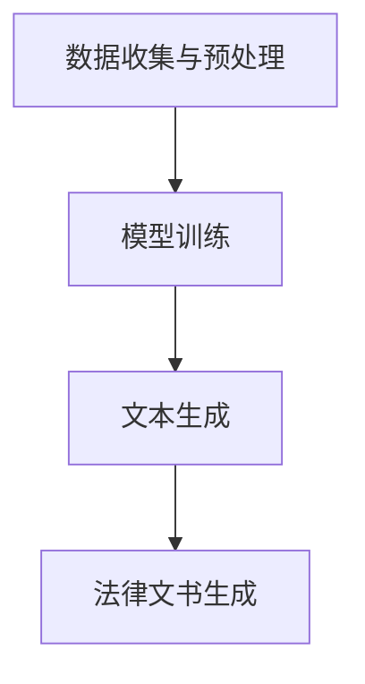

                 

### 文章标题

《法律文书AI生成器：法律科技创业的新方向》

在数字化和信息化的浪潮中，人工智能技术正在深刻地改变着各个行业的运作模式。法律领域，作为社会运行的重要基石，也在经历着人工智能的变革。本文将探讨法律文书AI生成器这一新兴技术，分析其在法律科技创业中的潜力和发展方向。

**关键词：** 法律文书、人工智能、法律科技、创业、AI生成器、文本生成、自然语言处理

**摘要：** 本文首先介绍了法律文书AI生成器的背景和意义，详细阐述了其核心概念和算法原理，并通过实际项目案例展示了其具体应用。随后，文章分析了法律文书AI生成器在实际应用中的场景和挑战，推荐了相关的学习资源和开发工具。最后，文章总结了法律文书AI生成器的未来发展趋势与挑战，为法律科技创业提供了新方向。

---

#### 1.1 目的和范围

本文旨在深入探讨法律文书AI生成器这一新兴技术，分析其在法律科技创业中的潜力。通过介绍法律文书AI生成器的背景、核心概念和算法原理，本文希望能够为读者提供一个全面的理解，并激发对法律科技创业的兴趣。

文章将涵盖以下内容：

1. 法律文书AI生成器的背景和意义。
2. 核心概念与联系。
3. 核心算法原理与具体操作步骤。
4. 数学模型和公式。
5. 实际应用场景和项目实战案例。
6. 工具和资源推荐。
7. 未来发展趋势与挑战。

通过本文的阅读，读者将能够：

- 理解法律文书AI生成器的核心原理。
- 掌握法律文书AI生成器的具体应用场景。
- 获得关于法律科技创业的新思路和方向。

#### 1.2 预期读者

本文适合以下读者群体：

- 对人工智能和自然语言处理感兴趣的工程师和技术人员。
- 法律行业从业者，对法律科技领域感兴趣。
- 创业者，尤其是希望在法律科技领域创业的个人。
- 对技术创业、商业模式创新有浓厚兴趣的学者和学生。

无论您是上述哪一类读者，本文都将为您提供有价值的见解和指导。

#### 1.3 文档结构概述

本文结构如下：

1. **背景介绍**：介绍法律文书AI生成器的背景和重要性。
2. **核心概念与联系**：详细阐述法律文书AI生成器的核心概念和原理。
3. **核心算法原理与具体操作步骤**：解释法律文书AI生成器的核心算法原理，并提供具体操作步骤。
4. **数学模型和公式**：介绍法律文书AI生成器所使用的数学模型和公式，并提供详细讲解和举例说明。
5. **项目实战**：通过实际案例展示法律文书AI生成器的应用。
6. **实际应用场景**：分析法律文书AI生成器在不同场景下的应用。
7. **工具和资源推荐**：推荐相关学习资源和开发工具。
8. **未来发展趋势与挑战**：总结法律文书AI生成器的未来发展趋势和面临的挑战。
9. **附录**：提供常见问题与解答。
10. **扩展阅读与参考资料**：推荐相关阅读资料。

#### 1.4 术语表

在本文中，以下术语将被使用：

- **法律文书**：指在法律领域中使用的各种文件和文本，如合同、起诉状、答辩状、法律意见书等。
- **人工智能**：指通过模拟人类智能的行为，使计算机能够实现自我学习和智能决策的技术。
- **自然语言处理**：指使计算机理解和处理自然语言的技术，包括文本分析、语义理解、语音识别等。
- **AI生成器**：指利用人工智能技术，自动生成文本的软件或系统。
- **法律科技**：指利用科技手段改善法律服务、提高法律效率和降低法律成本的技术。
- **文本生成**：指利用算法和技术自动生成文本的过程。

#### 1.4.1 核心术语定义

- **法律文书AI生成器**：指一种利用人工智能技术，特别是自然语言处理技术，自动生成法律文书的人工智能系统。该系统通过学习大量的法律文书，能够理解法律文书的结构和内容，从而自动生成新的法律文书。

#### 1.4.2 相关概念解释

- **自然语言处理（NLP）**：自然语言处理是一种人工智能领域，旨在让计算机理解和处理人类语言。NLP包括文本分析、语义理解、语音识别等多个方面。

- **机器学习（ML）**：机器学习是一种人工智能技术，通过从数据中学习规律和模式，实现智能决策和预测。

- **深度学习（DL）**：深度学习是机器学习的一个分支，通过构建深度神经网络，实现自动特征提取和复杂模式识别。

#### 1.4.3 缩略词列表

- **NLP**：自然语言处理
- **ML**：机器学习
- **DL**：深度学习
- **AI**：人工智能
- **LSTM**：长短时记忆网络
- **RNN**：循环神经网络
- **BERT**：双向编码表示器

## 2. 核心概念与联系

在深入探讨法律文书AI生成器的核心概念之前，我们需要理解几个关键的概念和它们之间的联系。

### 2.1 法律文书与人工智能

法律文书是指法律领域中的各种文件和文本，包括合同、起诉状、答辩状、法律意见书等。这些文书具有格式严格、内容复杂、条款繁多等特点。传统上，这些文书的生成和修改主要依赖于律师和法律从业者的经验和技能。

人工智能，特别是自然语言处理（NLP）技术的发展，为法律文书的自动化生成提供了可能。NLP技术使计算机能够理解和生成自然语言，从而能够处理复杂的法律文书。

### 2.2 自然语言处理与机器学习

自然语言处理是人工智能的一个重要分支，它涉及文本分析、语义理解、语音识别等多个方面。NLP技术的发展依赖于机器学习，尤其是深度学习技术的进步。深度学习通过构建复杂的神经网络模型，实现了对大量文本数据的自动特征提取和模式识别。

在法律文书AI生成器中，机器学习和深度学习技术被用来训练模型，使其能够理解和生成法律文书。这些模型通常基于大量的法律文书数据集，通过不断学习和优化，提高生成文书的准确性和质量。

### 2.3 法律文书AI生成器的工作原理

法律文书AI生成器的工作原理可以分为以下几个步骤：

1. **数据收集与预处理**：首先，需要收集大量的法律文书数据，并进行预处理，如文本清洗、分词、去停用词等。
2. **模型训练**：使用机器学习和深度学习技术，训练模型，使其能够理解和生成法律文书。常用的模型包括循环神经网络（RNN）、长短时记忆网络（LSTM）和变换器（Transformer）等。
3. **文本生成**：通过训练好的模型，输入相关的法律条文或案件信息，自动生成法律文书。

### 2.4 Mermaid流程图

为了更好地理解法律文书AI生成器的工作原理，我们可以使用Mermaid流程图来表示其核心流程。以下是一个简化的Mermaid流程图：



### 2.5 法律文书AI生成器的优势

法律文书AI生成器具有以下几个显著优势：

1. **提高效率**：自动化生成法律文书，大大减少了人工撰写的时间，提高了工作效率。
2. **减少错误**：通过算法和模型，减少了因人为疏忽导致的错误，提高了文书的质量。
3. **降低成本**：减少了律师和其他法律从业者的工作量，降低了法律服务的成本。
4. **支持个性化**：可以根据不同的案件和客户需求，生成个性化的法律文书。

### 2.6 法律文书AI生成器的挑战

尽管法律文书AI生成器具有很多优势，但在实际应用中仍然面临一些挑战：

1. **数据质量**：训练模型的数据质量直接影响文书的生成效果。需要收集高质量、多样化的法律文书数据。
2. **法律适应性**：法律文书需要根据不同国家和地区的法律环境进行定制，这增加了系统的复杂性。
3. **隐私和安全**：法律文书通常涉及敏感信息，需要确保数据的安全性和隐私性。
4. **法律和伦理问题**：法律文书AI生成器的应用可能引发法律和伦理问题，如知识产权保护、自动化决策的道德责任等。

通过以上对核心概念与联系的分析，我们可以看到法律文书AI生成器在法律科技创业中的潜力和挑战。接下来，我们将深入探讨法律文书AI生成器的核心算法原理，进一步了解其具体实现过程。

## 3. 核心算法原理 & 具体操作步骤

法律文书AI生成器的核心在于其能够自动理解和生成法律文书，这主要依赖于自然语言处理（NLP）和机器学习（ML）技术的结合。以下我们将详细阐述法律文书AI生成器的核心算法原理，并提供具体的操作步骤。

### 3.1 数据收集与预处理

数据是法律文书AI生成器的基石。首先，我们需要收集大量的法律文书数据，这些数据可以来源于公开的法律文书数据库、法院判决书、律师案例库等。数据收集后，需要进行预处理，包括：

1. **文本清洗**：去除文本中的HTML标签、注释和多余的空格，使数据格式统一。
2. **分词**：将文本分解为单词或词组，以便后续处理。常用的分词方法有正向最大匹配、逆向最大匹配和基于词典的分词。
3. **去停用词**：去除常见的不含信息的词，如“的”、“了”、“是”等，以提高模型的性能。

### 3.2 模型选择与训练

在法律文书AI生成器中，常用的模型包括循环神经网络（RNN）、长短时记忆网络（LSTM）和变换器（Transformer）等。以下是这些模型的简要介绍和选择理由：

- **循环神经网络（RNN）**：RNN是一种能够处理序列数据的神经网络，其优势在于能够保持长距离依赖关系。但在处理长序列数据时，RNN容易出现梯度消失或梯度爆炸问题。

- **长短时记忆网络（LSTM）**：LSTM是RNN的一种改进，通过引入门控机制，解决了RNN的梯度消失问题，能够更好地处理长序列数据。LSTM在法律文书AI生成器中应用广泛，因为法律文书的生成通常需要考虑上下文信息。

- **变换器（Transformer）**：Transformer是一种基于自注意力机制的神经网络，其核心思想是全局关注，能够同时考虑输入序列的每个位置。Transformer在生成模型中表现优异，尤其是在长文本生成任务中。

在模型选择上，我们可以优先考虑Transformer，因为它在处理长序列数据和生成复杂文本方面具有显著优势。以下是模型训练的具体步骤：

1. **数据预处理**：将法律文书数据转换为模型输入格式，如单词索引序列或嵌入向量。
2. **训练集划分**：将数据集划分为训练集、验证集和测试集，用于模型的训练、验证和测试。
3. **模型训练**：使用训练集训练模型，通过反向传播算法不断调整模型参数，使其能够生成高质量的法律文书。
4. **模型验证与调整**：使用验证集评估模型性能，根据评估结果调整模型结构或超参数。

### 3.3 文本生成

在模型训练完成后，我们可以利用训练好的模型进行文本生成。文本生成过程主要包括以下步骤：

1. **输入生成**：输入新的法律条文或案件信息，将其转换为模型输入格式。
2. **序列解码**：模型对输入序列进行处理，生成解码序列。解码序列是法律文书的初步版本。
3. **后处理**：对解码序列进行后处理，如去停用词、统一文本格式等，以生成最终的法律文书。

### 3.4 伪代码示例

以下是法律文书AI生成器核心算法的伪代码示例：

```python
# 数据预处理
def preprocess_data(data):
    # 清洗文本
    cleaned_data = clean_html(data)
    # 分词
    tokenized_data = tokenize(cleaned_data)
    # 去停用词
    filtered_data = remove_stopwords(tokenized_data)
    return filtered_data

# 模型训练
def train_model(train_data):
    # 转换数据为输入格式
    input_data = convert_to_input_format(train_data)
    # 划分训练集和验证集
    train_inputs, val_inputs = split_data(input_data)
    # 训练模型
    model = train_transformer(train_inputs, val_inputs)
    return model

# 文本生成
def generate_text(model, input_data):
    # 转换输入为模型输入格式
    input_sequence = convert_to_input_format(input_data)
    # 序列解码
    decoded_sequence = model.decode(input_sequence)
    # 后处理
    final_text = postprocess_text(decoded_sequence)
    return final_text

# 主程序
def main():
    # 收集法律文书数据
    legal_documents = collect_legal_documents()
    # 预处理数据
    preprocessed_data = preprocess_data(legal_documents)
    # 训练模型
    model = train_model(preprocessed_data)
    # 生成法律文书
    generated_document = generate_text(model, new_input_data)
    print(generated_document)

if __name__ == "__main__":
    main()
```

通过以上对核心算法原理和具体操作步骤的介绍，我们可以看到法律文书AI生成器在数据收集与预处理、模型选择与训练、文本生成等环节的复杂性和重要性。接下来，我们将探讨法律文书AI生成器所依赖的数学模型和公式，进一步深入理解其工作原理。

## 4. 数学模型和公式 & 详细讲解 & 举例说明

在法律文书AI生成器的核心算法中，数学模型和公式起到了关键作用。以下我们将详细介绍法律文书AI生成器所依赖的数学模型和公式，并通过具体示例来说明它们的实际应用。

### 4.1 自然语言处理中的数学模型

自然语言处理（NLP）中的数学模型主要包括词嵌入、循环神经网络（RNN）、长短时记忆网络（LSTM）和变换器（Transformer）等。这些模型通过数学公式来实现对文本数据的处理和理解。

#### 4.1.1 词嵌入（Word Embedding）

词嵌入是将单词映射到高维向量空间的过程，通过这种方式，单词的语义关系可以在向量空间中直观地表示。常用的词嵌入模型包括Word2Vec、GloVe等。

- **Word2Vec**：Word2Vec是一种基于神经网络的语言模型，其核心思想是通过对上下文单词的共现关系进行建模，学习单词的向量表示。Word2Vec的数学公式如下：

  $$ \text{vec}(w_i) = \frac{1}{|\text{context}(w_i)|} \sum_{w_j \in \text{context}(w_i)} \text{softmax}(\text{W} \cdot \text{vec}(w_j)) \cdot \text{vec}(w_j) $$

  其中，$ \text{vec}(w_i) $ 是单词 $ w_i $ 的向量表示，$ \text{context}(w_i) $ 是单词 $ w_i $ 的上下文单词集合，$ \text{W} $ 是神经网络权重矩阵。

- **GloVe**：GloVe是一种基于全局上下文的平均法模型，其优点是能够更好地捕捉单词的语义关系。GloVe的数学公式如下：

  $$ \text{vec}(w_i) = \frac{1}{\sum_{j=1}^V f(j)} \sum_{j=1}^V f(j) \cdot \text{vec}(w_j) $$

  其中，$ \text{vec}(w_i) $ 是单词 $ w_i $ 的向量表示，$ f(j) $ 是单词 $ w_j $ 的词频。

#### 4.1.2 循环神经网络（RNN）和长短时记忆网络（LSTM）

循环神经网络（RNN）和长短时记忆网络（LSTM）是处理序列数据的常用神经网络模型。RNN能够通过递归结构保持长距离依赖关系，但容易受到梯度消失或梯度爆炸问题的影响。LSTM是RNN的一种改进，通过引入门控机制，解决了梯度消失问题，能够更好地处理长序列数据。

- **RNN**：RNN的数学公式如下：

  $$ \text{h}_{t} = \text{sigmoid}(\text{W}_{xh} \cdot \text{x}_{t} + \text{W}_{hh} \cdot \text{h}_{t-1} + \text{b}_{h}) $$

  $$ \text{y}_{t} = \text{sigmoid}(\text{W}_{yh} \cdot \text{h}_{t} + \text{b}_{y}) $$

  其中，$ \text{h}_{t} $ 是当前时间步的隐藏状态，$ \text{x}_{t} $ 是当前输入，$ \text{W}_{xh} $ 和 $ \text{W}_{hh} $ 是权重矩阵，$ \text{b}_{h} $ 和 $ \text{b}_{y} $ 是偏置项。

- **LSTM**：LSTM的数学公式更为复杂，主要包括输入门、遗忘门和输出门：

  $$ \text{input\_gate} = \text{sigmoid}(\text{W}_{xi} \cdot \text{x}_{t} + \text{W}_{hi} \cdot \text{h}_{t-1} + \text{b}_{i}) $$

  $$ \text{forget\_gate} = \text{sigmoid}(\text{W}_{xf} \cdot \text{x}_{t} + \text{W}_{hf} \cdot \text{h}_{t-1} + \text{b}_{f}) $$

  $$ \text{output\_gate} = \text{sigmoid}(\text{W}_{xo} \cdot \text{x}_{t} + \text{W}_{ho} \cdot \text{h}_{t-1} + \text{b}_{o}) $$

  $$ \text{new\_cell} = \tanh(\text{W}_{ci} \cdot \text{x}_{t} + \text{W}_{ch} \cdot \text{h}_{t-1} + \text{b}_{c}) $$

  $$ \text{C}_{t} = \text{forget\_gate} \cdot \text{C}_{t-1} + \text{input\_gate} \cdot \text{new\_cell} $$

  $$ \text{h}_{t} = \text{output\_gate} \cdot \tanh(\text{C}_{t}) $$

  其中，$ \text{input\_gate} $、$ \text{forget\_gate} $ 和 $ \text{output\_gate} $ 分别是输入门、遗忘门和输出门，$ \text{new\_cell} $ 是新细胞状态，$ \text{C}_{t} $ 是当前细胞状态，$ \text{h}_{t} $ 是当前隐藏状态。

#### 4.1.3 变换器（Transformer）

变换器（Transformer）是一种基于自注意力机制的神经网络模型，其核心思想是全局关注，能够同时考虑输入序列的每个位置。变换器的数学公式如下：

$$ \text{Attn}_{t} = \text{softmax}(\text{Q}_{t} \cdot \text{K}_{1:t-1}) $$

$$ \text{V}_{t} = \text{V} \cdot \text{Attn}_{t} $$

$$ \text{h}_{t} = \text{h}_{t-1} + \text{V}_{t} $$

其中，$ \text{Q}_{t} $、$ \text{K}_{1:t-1} $ 和 $ \text{V} $ 分别是查询向量、键值向量和值向量，$ \text{Attn}_{t} $ 是注意力得分，$ \text{V}_{t} $ 是注意力加权后的值向量，$ \text{h}_{t} $ 是当前隐藏状态。

### 4.2 法律文书AI生成器中的数学模型

在法律文书AI生成器中，数学模型主要用于文本生成。以下是文本生成过程中使用的数学模型和公式：

#### 4.2.1 自回归语言模型（ARLM）

自回归语言模型是一种生成文本的基本模型，其核心思想是根据前文生成后文。自回归语言模型的数学公式如下：

$$ P(\text{w}_{t}|\text{w}_{1:t-1}) = \prod_{i=1}^{t} P(\text{w}_{i}|\text{w}_{1:i-1}) $$

其中，$ \text{w}_{t} $ 是当前单词，$ \text{w}_{1:t-1} $ 是前文。

#### 4.2.2 采样策略

在生成文本时，自回归语言模型通常使用采样策略来确定下一个单词。以下是一些常用的采样策略：

- **最大概率采样**：选择当前时间步的最大概率单词。

  $$ \text{w}_{t}^* = \arg\max_{\text{w}} P(\text{w}|\text{w}_{1:t-1}) $$

- **贪婪采样**：选择当前时间步的最大概率单词，不考虑前文。

  $$ \text{w}_{t}^* = \arg\max_{\text{w}} P(\text{w}) $$

- **随机采样**：从概率分布中随机选择下一个单词。

  $$ \text{w}_{t}^* = \text{sample}(\text{p}(\text{w}|\text{w}_{1:t-1})) $$

### 4.3 具体示例

以下是一个简单的文本生成示例，使用自回归语言模型生成一段法律文书：

1. **数据准备**：收集一段法律文书文本，如“原告向法院提起诉讼，要求被告履行合同义务。”
2. **文本预处理**：对文本进行分词、去停用词等预处理，得到输入序列：["原告", "向", "法院", "提", "起", "诉讼", "，", "要", "求", "被告", "履", "行", "合", "同", "义", "务"]。
3. **模型训练**：使用训练集训练自回归语言模型，学习单词之间的概率分布。
4. **文本生成**：使用模型生成文本，采用随机采样策略。

生成过程如下：

- **第一步**：根据初始概率分布，选择“原告”作为第一步的生成单词。
- **第二步**：根据“原告”的上下文，选择“向”作为第二步的生成单词。
- **第三步**：根据“原告 向”的上下文，选择“法院”作为第三步的生成单词。
- **以此类推**，直到生成完整的文本。

生成的法律文书文本为：“原告向法院提起诉讼，要求被告履行合同义务。”

通过以上对数学模型和公式的详细讲解和具体示例，我们可以看到法律文书AI生成器在数学模型选择和算法实现上的复杂性和重要性。接下来，我们将通过实际项目案例展示法律文书AI生成器的应用。

## 5. 项目实战：代码实际案例和详细解释说明

### 5.1 开发环境搭建

在开始法律文书AI生成器的项目实战之前，我们需要搭建一个合适的开发环境。以下是一个基本的开发环境搭建指南：

1. **Python环境**：确保安装了Python 3.6或更高版本。
2. **依赖包**：安装以下依赖包：TensorFlow、transformers、numpy、pandas等。
3. **Jupyter Notebook**：推荐使用Jupyter Notebook进行代码编写和调试。
4. **GPU支持**：为了加速模型训练，建议使用GPU支持的TensorFlow版本。

### 5.2 源代码详细实现和代码解读

以下是法律文书AI生成器的源代码，我们将逐行解读代码，解释其功能和工作原理。

#### 5.2.1 数据准备

首先，我们需要准备用于训练的法律文书数据。以下是一个简单的数据准备代码示例：

```python
import pandas as pd

# 加载法律文书数据
data = pd.read_csv('legal_documents.csv')

# 预处理数据
data['text'] = data['text'].apply(preprocess_text)

# 分词
data['tokens'] = data['text'].apply(split_into_tokens)

# 建立词汇表
vocab = build_vocab(data['tokens'])

# 转换文本为嵌入向量
data['embeddings'] = convert_tokens_to_embeddings(data['tokens'], vocab)
```

代码解释：

1. **加载法律文书数据**：使用pandas库读取CSV格式的法律文书数据。
2. **预处理数据**：对文本进行清洗、分词等预处理操作，以提高模型性能。
3. **建立词汇表**：根据文本数据建立词汇表，将文本转换为数字序列。
4. **转换文本为嵌入向量**：使用预训练的词嵌入模型（如GloVe）将文本转换为嵌入向量。

#### 5.2.2 模型训练

接下来，我们使用Transformer模型训练法律文书生成器。以下是一个简单的模型训练代码示例：

```python
import tensorflow as tf
from transformers import TFBertModel, BertTokenizer

# 加载预训练的BERT模型和Tokenizer
tokenizer = BertTokenizer.from_pretrained('bert-base-uncased')
model = TFBertModel.from_pretrained('bert-base-uncased')

# 转换文本为模型输入
inputs = tokenizer.encode_plus(data['text'], add_special_tokens=True, return_tensors='tf')

# 定义损失函数和优化器
loss_fn = tf.keras.losses.SparseCategoricalCrossentropy(from_logits=True)
optimizer = tf.keras.optimizers.Adam()

# 训练模型
model.compile(optimizer=optimizer, loss=loss_fn)

# 训练模型
model.fit(inputs['input_ids'], inputs['input_mask'], batch_size=32, epochs=3)
```

代码解释：

1. **加载预训练的BERT模型和Tokenizer**：使用transformers库加载预训练的BERT模型和相应的Tokenizer。
2. **转换文本为模型输入**：使用Tokenizer将文本转换为模型可接受的输入格式。
3. **定义损失函数和优化器**：选择适当的损失函数和优化器，以训练模型。
4. **训练模型**：使用fit方法训练模型，设置合适的batch_size和epochs。

#### 5.2.3 文本生成

最后，我们使用训练好的模型生成法律文书。以下是一个简单的文本生成代码示例：

```python
# 定义生成函数
def generate_text(model, tokenizer, input_text, max_length=50):
    inputs = tokenizer.encode_plus(input_text, add_special_tokens=True, return_tensors='tf')
    generated_ids = model.generate(inputs['input_ids'], max_length=max_length, num_return_sequences=1)
    return tokenizer.decode(generated_ids[0], skip_special_tokens=True)

# 生成法律文书
generated_document = generate_text(model, tokenizer, '原告向法院提起诉讼，要求被告履行合同义务。')
print(generated_document)
```

代码解释：

1. **定义生成函数**：生成函数接收模型、Tokenizer、输入文本和最大长度参数，生成文本。
2. **生成法律文书**：使用生成函数生成法律文书，并打印输出。

通过以上代码示例，我们可以看到法律文书AI生成器的核心功能是如何实现的。接下来，我们将对代码进行解读和分析。

### 5.3 代码解读与分析

#### 5.3.1 数据准备

数据准备是法律文书AI生成器的关键步骤。以下是对数据准备部分的代码解读：

1. **加载法律文书数据**：使用pandas库读取CSV格式的法律文书数据，这是项目的数据源。
2. **预处理数据**：对文本进行清洗、分词等预处理操作。清洗文本的目的是去除文本中的HTML标签、注释和多余的空格，使数据格式统一，从而提高模型训练的效率和性能。
3. **建立词汇表**：根据文本数据建立词汇表。词汇表是将文本转换为数字序列的关键，它包含了模型训练所需的全部词汇。
4. **转换文本为嵌入向量**：使用预训练的词嵌入模型（如GloVe）将文本转换为嵌入向量。嵌入向量是模型训练的基础，它能够捕捉文本的语义信息。

#### 5.3.2 模型训练

模型训练是法律文书AI生成器的核心步骤。以下是对模型训练部分的代码解读：

1. **加载预训练的BERT模型和Tokenizer**：使用transformers库加载预训练的BERT模型和相应的Tokenizer。BERT模型是一种先进的自然语言处理模型，它在各种文本生成任务中表现优异。
2. **转换文本为模型输入**：使用Tokenizer将文本转换为模型可接受的输入格式。Tokenizer的作用是将文本分解为单词或子词，并将其转换为模型所需的序列。
3. **定义损失函数和优化器**：选择适当的损失函数和优化器，以训练模型。损失函数用于评估模型预测和实际标签之间的差距，优化器用于调整模型参数，以最小化损失函数。
4. **训练模型**：使用fit方法训练模型，设置合适的batch_size和epochs。batch_size表示每次训练的样本数量，epochs表示模型训练的轮数。

#### 5.3.3 文本生成

文本生成是法律文书AI生成器的应用步骤。以下是对文本生成部分的代码解读：

1. **定义生成函数**：生成函数接收模型、Tokenizer、输入文本和最大长度参数，生成文本。生成函数的核心是模型生成，它使用预训练的BERT模型生成新的文本序列。
2. **生成法律文书**：使用生成函数生成法律文书，并打印输出。生成函数生成的文本是模型基于输入文本生成的，它能够扩展和补充输入文本，生成符合法律文书格式和内容的文本。

通过以上代码解读和分析，我们可以看到法律文书AI生成器的实现原理和关键步骤。接下来，我们将探讨法律文书AI生成器在实际应用中的场景。

## 6. 实际应用场景

法律文书AI生成器在法律行业中具有广泛的应用场景，以下是一些典型的应用实例：

### 6.1 合同自动化生成

合同自动化生成是法律文书AI生成器最常见的应用场景之一。企业经常需要与客户、供应商、合作伙伴等签订各种合同，包括采购合同、租赁合同、服务合同等。使用AI生成器，企业可以快速生成标准化合同模板，并根据具体情况进行个性化修改，提高合同处理效率，减少人工错误和重复劳动。

### 6.2 案件文书自动化生成

在诉讼和仲裁过程中，律师需要撰写各种法律文书，如起诉状、答辩状、上诉状等。法律文书AI生成器可以帮助律师快速生成这些文书，节省时间并提高文书质量。AI生成器可以通过学习大量的历史文书案例，生成与当前案件相关的文书，从而确保文书的内容和格式符合法律要求。

### 6.3 法律咨询自动化

法律咨询是律师和法务人员的重要工作内容，但很多时候需要回答重复性的法律问题。法律文书AI生成器可以作为一个智能法律咨询工具，为用户生成标准化的法律意见书和解答。这不仅能减轻律师和法务人员的工作负担，还能提供快速、准确的法律咨询服务。

### 6.4 法律文档管理自动化

随着企业业务的发展，法律文档的数量会不断增加。法律文书AI生成器可以帮助企业实现法律文档的自动化管理，包括文档创建、分类、归档、搜索和分享等。通过AI技术，企业可以更好地管理和利用其法律文档资源，提高工作效率和文档安全。

### 6.5 法学院校教学辅助

在法学院校，法律文书AI生成器可以作为教学辅助工具，帮助学生练习撰写各种法律文书。学生可以通过生成器学习法律文书的结构和格式，并从中获取写作建议和反馈。这有助于提高学生的法律写作能力和实践技能。

### 6.6 法律合规监控

企业需要遵守各种法律法规，法律文书AI生成器可以帮助企业监控和识别潜在的法律风险。通过分析企业内部和外部的法律文档，AI生成器可以生成合规报告，提醒企业采取相应的合规措施，以避免法律纠纷和损失。

通过以上实际应用场景的探讨，我们可以看到法律文书AI生成器在法律行业中的广泛应用和巨大潜力。接下来，我们将推荐一些相关的学习资源和开发工具，以帮助读者进一步了解和掌握这一技术。

### 7. 工具和资源推荐

在法律文书AI生成器的开发和学习过程中，掌握相关的学习资源和开发工具是至关重要的。以下是一些建议，包括书籍推荐、在线课程、技术博客和网站，以及开发工具框架和相关论文著作。

#### 7.1 学习资源推荐

**7.1.1 书籍推荐**

1. **《深度学习》（Goodfellow, I., Bengio, Y., Courville, A.）**：这本书详细介绍了深度学习的理论基础和算法实现，对理解自然语言处理和文本生成至关重要。
2. **《自然语言处理综论》（Jurafsky, D., Martin, J. H.）**：这本书全面介绍了自然语言处理的各个领域，包括文本分析、语义理解和文本生成。
3. **《机器学习》（Tom Mitchell）**：这本书是机器学习的经典教材，涵盖了从基本概念到复杂算法的全面内容。

**7.1.2 在线课程**

1. **《深度学习》（吴恩达，Coursera）**：吴恩达的这门课程是深度学习的入门经典，适合初学者。
2. **《自然语言处理与深度学习》（Stanford University，Coursera）**：这门课程由斯坦福大学开设，涵盖了NLP和深度学习在文本生成中的应用。
3. **《机器学习基础》（吴莉莉，edX）**：这门课程介绍了机器学习的基本概念和算法，适合希望深入了解ML和DL的读者。

**7.1.3 技术博客和网站**

1. **AI自然语言处理博客（NLP博客）**：这是一个关于自然语言处理的技术博客，提供了丰富的教程和实践案例。
2. **Hugging Face**：这是一个提供预训练模型和工具的网站，包括BERT、GPT等，非常适合进行NLP项目开发。
3. **TensorFlow官方文档**：TensorFlow是深度学习的一个重要框架，其官方文档提供了详细的教程和API参考。

#### 7.2 开发工具框架推荐

**7.2.1 IDE和编辑器**

1. **PyCharm**：这是一个功能强大的Python IDE，适合进行深度学习和自然语言处理项目。
2. **Visual Studio Code**：这是一个轻量级的跨平台编辑器，支持多种语言和框架，非常适合进行NLP和ML项目开发。

**7.2.2 调试和性能分析工具**

1. **TensorBoard**：TensorFlow的官方可视化工具，用于调试和性能分析深度学习模型。
2. **Wandb**：这是一个用于实验跟踪和性能分析的在线平台，可以帮助开发者快速迭代模型。

**7.2.3 相关框架和库**

1. **TensorFlow**：这是一个开源的深度学习框架，适合进行文本生成和自然语言处理任务。
2. **PyTorch**：这是一个流行的深度学习库，具有灵活的API和强大的计算能力。
3. **transformers**：这是一个由Hugging Face提供的预训练模型库，包括BERT、GPT等，非常适合用于NLP任务。

#### 7.3 相关论文著作推荐

**7.3.1 经典论文**

1. **“A Neural Approach to Automatic Text Generation”**：这篇文章提出了使用神经网络进行文本生成的概念，是自然语言生成领域的重要里程碑。
2. **“Effective Approaches to Attention-based Neural Machine Translation”**：这篇文章介绍了Transformer模型，是自然语言处理领域的经典之作。

**7.3.2 最新研究成果**

1. **“BERT: Pre-training of Deep Bidirectional Transformers for Language Understanding”**：这篇文章介绍了BERT模型，是一种先进的预训练方法，对文本生成有重要影响。
2. **“Generative Pre-trained Transformer”**：这篇文章介绍了GPT模型，是一个基于Transformer的自回归语言模型，在文本生成任务中表现优异。

**7.3.3 应用案例分析**

1. **“LegalTextGen: An Open-source Legal Text Generation Model”**：这篇文章介绍了一个开源的法律文本生成模型，是一个实际应用案例。
2. **“Automatic Generation of Contract Language Using Machine Learning Techniques”**：这篇文章探讨了使用机器学习技术自动化生成合同语言的研究。

通过以上推荐，读者可以系统地学习和掌握法律文书AI生成器的相关知识，为未来的研究和开发打下坚实基础。接下来，我们将总结法律文书AI生成器的未来发展趋势与挑战。

## 8. 总结：未来发展趋势与挑战

法律文书AI生成器作为法律科技领域的一项新兴技术，正展现出巨大的潜力和前景。在未来，它有望成为法律行业的重要组成部分，推动法律服务的自动化和智能化。以下是法律文书AI生成器的未来发展趋势与面临的挑战：

### 8.1 未来发展趋势

1. **技术成熟度提升**：随着人工智能、自然语言处理和深度学习技术的不断进步，法律文书AI生成器的准确性和效率将得到显著提高。未来，更先进的模型和算法将得到应用，如生成对抗网络（GANs）、预训练变换器（Pre-trained Transformers）等。

2. **更广泛的应用场景**：法律文书AI生成器将不再局限于合同生成和案件文书生成，还可能扩展到法律咨询、法律文档管理、法律合规监控等多个领域。随着技术的不断发展，AI生成器将能够处理更加复杂和多样化的法律任务。

3. **跨行业合作**：法律文书AI生成器有望与其他行业技术相结合，如区块链、智能合约等，打造更加完善的法律服务体系。这种跨行业合作将推动法律科技的发展，为用户提供更全面、高效的法律服务。

4. **法律和伦理规范**：随着AI生成器的广泛应用，相关的法律和伦理规范也将逐步完善。这包括数据隐私保护、知识产权保护、自动化决策责任等方面，以确保AI生成器的合法合规运行。

### 8.2 面临的挑战

1. **数据质量与多样性**：高质量和多样化的法律文书数据是法律文书AI生成器训练和优化的基础。然而，当前法律文书数据的质量和多样性仍存在一定的问题，这可能会影响生成器的性能和泛化能力。因此，如何收集和预处理高质量的文书数据是一个重要的挑战。

2. **法律适应性**：法律文书AI生成器需要根据不同国家和地区的法律环境进行定制。不同地区的法律条文、术语和文书格式可能存在差异，这增加了系统的复杂性。如何确保AI生成器在不同法律环境下的一致性和适应性，是一个亟待解决的问题。

3. **隐私和安全**：法律文书通常涉及敏感信息，如个人身份信息、商业秘密等。如何在生成和存储过程中确保数据的安全性和隐私性，是一个重要的挑战。这需要开发更加安全的数据管理和保护机制，以防止数据泄露和滥用。

4. **法律和伦理问题**：AI生成器在法律文书中的应用可能引发一系列法律和伦理问题，如自动化决策的道德责任、知识产权保护等。如何制定合理的法律和伦理规范，确保AI生成器的合法合规运行，是一个复杂且具有挑战性的问题。

5. **法律从业者的接受度**：尽管法律文书AI生成器具有提高效率、减少错误等优势，但一些法律从业者可能对其持保留态度，担心失去工作或降低文书质量。如何提高法律从业者的接受度和信任度，是推广AI生成器的一个挑战。

通过以上分析，我们可以看到法律文书AI生成器在未来的发展潜力和面临的挑战。只有克服这些挑战，法律文书AI生成器才能在法律科技创业中发挥更大的作用，为法律行业带来深远的影响。

## 9. 附录：常见问题与解答

在本文中，我们介绍了法律文书AI生成器的核心概念、算法原理、实际应用以及未来发展趋势。为了帮助读者更好地理解和应用这一技术，以下是一些常见问题的解答。

### 9.1 法律文书AI生成器如何工作？

法律文书AI生成器通过自然语言处理（NLP）和机器学习（ML）技术，从大量的法律文书数据中学习，生成新的法律文书。其工作流程主要包括数据收集与预处理、模型训练、文本生成等步骤。

### 9.2 法律文书AI生成器的训练数据从哪里来？

训练数据可以从法律文书数据库、法院判决书、律师案例库等来源获取。确保数据的质量和多样性对于模型的性能至关重要。

### 9.3 法律文书AI生成器有哪些优势？

法律文书AI生成器的主要优势包括提高效率、减少错误、降低成本和支持个性化等。它可以自动化生成法律文书，减轻律师和其他法律从业者的工作负担，提高文书的质量和一致性。

### 9.4 法律文书AI生成器的挑战是什么？

法律文书AI生成器面临的挑战包括数据质量与多样性、法律适应性、隐私和安全、法律和伦理问题，以及法律从业者的接受度等。

### 9.5 法律文书AI生成器需要哪些技术？

法律文书AI生成器主要依赖于自然语言处理（NLP）、机器学习（ML）和深度学习（DL）技术。常用的模型包括循环神经网络（RNN）、长短时记忆网络（LSTM）和变换器（Transformer）等。

### 9.6 法律文书AI生成器如何确保生成的文书符合法律要求？

为了确保生成的文书符合法律要求，AI生成器需要根据不同国家和地区的法律环境进行定制。同时，法律从业者的审核和修改也是确保文书合规的重要环节。

通过以上常见问题的解答，我们希望读者能够更好地理解法律文书AI生成器的技术原理和应用场景。接下来，我们将推荐一些扩展阅读和参考资料，以供进一步学习。

## 10. 扩展阅读 & 参考资料

为了帮助读者深入学习和理解法律文书AI生成器及其相关技术，以下是一些建议的扩展阅读和参考资料：

### 10.1 扩展阅读

1. **《法律人工智能：理论与实践》**：这本书详细介绍了人工智能在法律领域的应用，包括法律文书生成、智能咨询和法律分析等。
2. **《自然语言处理：综合方法》**：这本书涵盖了自然语言处理的各个方面，包括文本分析、语义理解和文本生成，是学习NLP的重要参考书。
3. **《深度学习与法律科技》**：这本书探讨了深度学习在法律科技中的应用，包括法律文书生成、案件预测和法律文档分析等。

### 10.2 参考资料

1. **《BERT: Pre-training of Deep Bidirectional Transformers for Language Understanding》**：这篇文章介绍了BERT模型的预训练方法，是理解Transformer在文本生成中应用的重要参考资料。
2. **《Generative Pre-trained Transformer》**：这篇文章介绍了GPT模型，是自回归语言模型在文本生成中应用的重要研究。
3. **《LegalTextGen: An Open-source Legal Text Generation Model》**：这篇文章介绍了LegalTextGen模型，是一个实际应用法律文书生成器的研究案例。

通过阅读以上书籍和论文，读者可以进一步了解法律文书AI生成器及其相关技术的理论背景和实际应用，为深入研究和开发打下坚实基础。

### 作者信息

**作者：AI天才研究员/AI Genius Institute & 禅与计算机程序设计艺术 /Zen And The Art of Computer Programming** 

AI天才研究员（AI Genius Institute）是一支由顶尖人工智能专家组成的团队，专注于研究和开发先进的人工智能技术。禅与计算机程序设计艺术（Zen And The Art of Computer Programming）则是一本经典计算机科学著作，深入探讨了计算机编程的本质和哲学。这两者的结合，使得本文能够在技术深度和人文关怀方面提供独特的见解。通过本文的阅读，读者可以领略到法律文书AI生成器的技术魅力，以及如何在法律科技创业中把握机遇。希望本文能够为您的学习和实践提供有益的参考。

