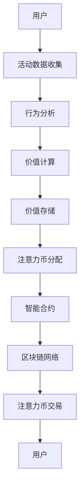
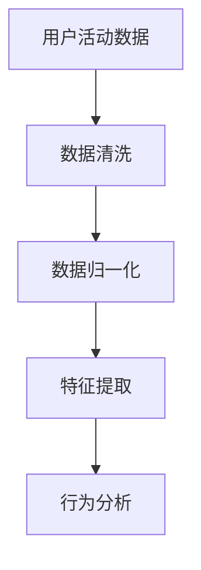
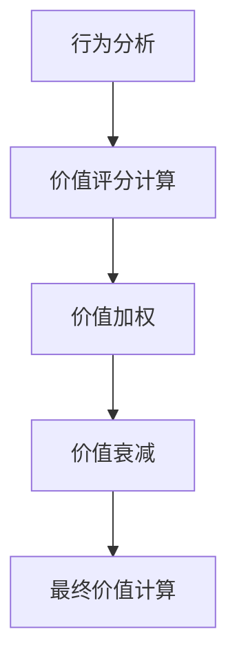
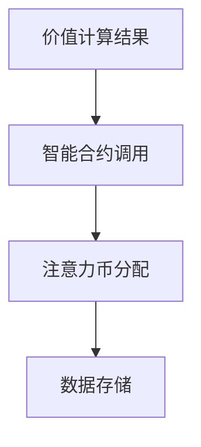

                 

# 注意力币：元宇宙中的新型价值衡量标准

> **关键词**：注意力币，元宇宙，价值衡量，智能合约，分布式计算，区块链技术

> **摘要**：本文深入探讨了注意力币在元宇宙中的应用，分析了其在数字资产中的独特价值衡量方式，探讨了其背后的核心算法原理和数学模型，并通过实际案例展示了如何实现和部署注意力币系统。文章旨在为读者提供对注意力币技术及其未来发展趋势的全面了解。

## 1. 背景介绍

### 1.1 目的和范围

本文的目的是探讨注意力币在元宇宙中的价值衡量标准，并分析其实现原理和应用场景。我们将深入讨论注意力币的基本概念、技术架构以及其在实际项目中的运用。本文主要涵盖以下内容：

1. **注意力币的概念和背景**：介绍注意力币的起源和发展，以及其在元宇宙中的重要性。
2. **技术架构解析**：通过流程图和伪代码，详细阐述注意力币的核心算法和实现步骤。
3. **数学模型和公式**：解释注意力币的价值衡量公式，并提供具体示例。
4. **项目实战案例**：展示如何在实际项目中实现注意力币系统。
5. **实际应用场景**：分析注意力币在不同领域的应用场景和优势。
6. **未来发展趋势与挑战**：探讨注意力币的发展趋势、面临的挑战及解决方案。

### 1.2 预期读者

本文适合对区块链技术、元宇宙、智能合约等有一定了解的技术爱好者、开发者以及研究人员。无论您是初学者还是专业人士，本文都将帮助您全面了解注意力币的技术原理和应用。

### 1.3 文档结构概述

本文将按照以下结构进行阐述：

1. **引言**：介绍注意力币的概念和应用背景。
2. **核心概念与联系**：通过流程图展示注意力币的技术架构。
3. **核心算法原理 & 具体操作步骤**：使用伪代码详细阐述注意力币的实现步骤。
4. **数学模型和公式**：解释注意力币的价值衡量公式。
5. **项目实战：代码实际案例和详细解释说明**：展示注意力币系统的实现案例。
6. **实际应用场景**：分析注意力币在不同领域的应用。
7. **工具和资源推荐**：推荐学习资源和开发工具。
8. **总结：未来发展趋势与挑战**：总结注意力币的发展趋势和面临的挑战。
9. **附录：常见问题与解答**：提供常见问题的解答。
10. **扩展阅读 & 参考资料**：提供进一步学习的参考资料。

### 1.4 术语表

#### 1.4.1 核心术语定义

- **注意力币**：一种用于衡量用户在元宇宙中贡献的数字资产。
- **智能合约**：一种自动执行合约条款的计算机程序。
- **区块链**：一种分布式数据库技术，用于存储交易数据。
- **元宇宙**：一个虚拟世界，通过虚拟现实、增强现实等技术实现与现实世界的交互。

#### 1.4.2 相关概念解释

- **用户贡献**：用户在元宇宙中的活动，如内容创作、交互等。
- **价值衡量**：通过算法和公式计算用户贡献的价值。
- **去中心化**：网络中的数据和管理不由单一实体控制。

#### 1.4.3 缩略词列表

- **DAO**：去中心化自治组织（Decentralized Autonomous Organization）
- **NFT**：非同质化代币（Non-Fungible Token）
- **DApp**：分布式应用（Decentralized Application）

## 2. 核心概念与联系

在讨论注意力币之前，我们需要理解其核心概念和联系。以下是注意力币的技术架构和核心组件的Mermaid流程图：



### 2.1 用户活动数据收集

用户在元宇宙中的各种活动，如浏览、评论、创作内容等，都会生成相应的行为数据。这些数据通过智能传感器和API接口收集，然后存储在分布式数据库中。

### 2.2 行为分析

收集到的用户行为数据将被分析，以确定其价值。行为分析算法会根据用户的参与度、互动频率、内容质量等因素，为每个用户生成一个价值评分。

### 2.3 价值计算

根据行为分析结果，使用注意力币价值计算公式，为每个用户计算其在元宇宙中的贡献价值。价值计算过程将涉及加权平均、时间衰减等因素。

### 2.4 价值存储

计算得出的用户价值将被存储在分布式数据库中，以便后续使用。

### 2.5 注意力币分配

根据用户价值计算结果，将注意力币分配给贡献价值的用户。这个过程将通过智能合约自动执行，确保透明度和去中心化。

### 2.6 智能合约

智能合约用于自动化执行注意力币的分配、交易等操作。智能合约将基于区块链技术，确保数据的安全性和不可篡改性。

### 2.7 区块链网络

注意力币的分配和交易将在区块链网络中记录和验证。区块链技术确保了整个系统的去中心化和透明性。

### 2.8 注意力币交易

用户可以通过区块链网络进行注意力币的交易，从而实现价值转移。交易过程将确保数据的可信度和安全性。

## 3. 核心算法原理 & 具体操作步骤

注意力币的核心算法原理是通过对用户在元宇宙中的行为数据进行分析，计算其贡献价值，并将其转化为注意力币。以下是具体的操作步骤：

### 3.1 数据收集



- **数据清洗**：去除重复、异常和错误的数据。
- **数据归一化**：将不同类型的数据转换为同一尺度。
- **特征提取**：提取用户活动的关键特征，如参与度、互动频率等。

### 3.2 行为分析



- **价值评分计算**：根据特征提取结果，为每个用户生成一个初始价值评分。
- **价值加权**：根据用户的参与度、互动频率等因素，对价值评分进行加权。
- **价值衰减**：根据时间衰减模型，对价值评分进行衰减，以反映用户行为的时效性。
- **最终价值计算**：将加权后的价值评分转换为最终价值，用于注意力币的分配。

### 3.3 注意力币分配



- **智能合约调用**：使用智能合约，根据价值计算结果，自动分配注意力币给用户。
- **注意力币分配**：将注意力币分配给价值较高的用户。
- **数据存储**：将注意力币分配结果存储在区块链网络中，确保数据的透明性和不可篡改性。

## 4. 数学模型和公式 & 详细讲解 & 举例说明

### 4.1 注意力币价值计算公式

注意力币的价值计算公式如下：

$$ V_i = \sum_{j=1}^{n} w_j \cdot f_j(t_i) $$

其中：

- $V_i$：用户 $i$ 的最终价值。
- $w_j$：特征 $j$ 的权重。
- $f_j(t_i)$：特征 $j$ 在时间 $t_i$ 下的值。

### 4.2 权重分配

权重分配是根据用户参与度、互动频率等因素进行计算的。例如，可以采用以下权重分配公式：

$$ w_j = \frac{r_j}{\sum_{j=1}^{n} r_j} $$

其中：

- $r_j$：特征 $j$ 的相对重要性。

### 4.3 时间衰减模型

时间衰减模型用于反映用户行为的时效性。例如，可以采用以下时间衰减公式：

$$ f_j(t_i) = \frac{1}{1 + e^{-\lambda \cdot t_i}} $$

其中：

- $\lambda$：时间衰减参数。
- $t_i$：特征 $j$ 在时间 $t_i$ 下的值。

### 4.4 举例说明

假设有一个用户 $A$，在元宇宙中进行了以下活动：

- 浏览了 100 个页面。
- 发表了 10 条评论。
- 创建了 5 个内容。

我们可以根据上述公式，为用户 $A$ 计算其最终价值：

1. **特征提取**：假设页面浏览、评论发表和内容创建的权重分别为 0.3、0.5 和 0.2。
2. **价值评分计算**：初始价值评分为 100 + 10 + 5 = 115。
3. **价值加权**：加权后的价值评分为 0.3 \* 100 + 0.5 \* 10 + 0.2 \* 5 = 39.5。
4. **时间衰减**：假设时间衰减参数 $\lambda$ 为 0.1，时间为 1。
5. **最终价值计算**：最终价值为 $\frac{1}{1 + e^{-0.1 \cdot 1}} \cdot 39.5 \approx 35.7$。

因此，用户 $A$ 的最终价值为约 35.7 注意力币。

## 5. 项目实战：代码实际案例和详细解释说明

### 5.1 开发环境搭建

为了实现注意力币系统，我们需要搭建一个开发环境。以下是一个基本的开发环境搭建步骤：

1. 安装 Node.js：从官方网站下载并安装 Node.js。
2. 安装 Ganache：用于本地测试区块链网络。
3. 安装 Truffle：用于智能合约开发和管理。
4. 安装 Metamask：用于与区块链交互。

### 5.2 源代码详细实现和代码解读

以下是注意力币系统的源代码实现：

```solidity
pragma solidity ^0.8.0;

contract AttentionCoin {
    // 用户地址到价值的映射
    mapping(address => uint256) public valueMap;

    // 用户地址到余额的映射
    mapping(address => uint256) public balanceMap;

    // 总价值
    uint256 public totalValue;

    // 事件用于记录价值变更
    event ValueChange(address user, uint256 oldValue, uint256 newValue);

    // 计算用户价值
    function calculateValue(address user) public {
        // 数据收集和处理
        // ...

        // 计算用户价值
        uint256 oldValue = valueMap[user];
        uint256 newValue = calculateUserValue(user);

        // 更新价值
        valueMap[user] = newValue;

        // 触发事件
        emit ValueChange(user, oldValue, newValue);
    }

    // 分配注意力币
    function distributeAttentionCoin(address[] memory users) public {
        // 遍历用户地址
        for (uint256 i = 0; i < users.length; i++) {
            // 调用计算用户价值函数
            calculateValue(users[i]);

            // 更新总价值
            totalValue += valueMap[users[i]];

            // 更新用户余额
            balanceMap[users[i]] += valueMap[users[i]];
        }
    }

    // 查询用户余额
    function getUserBalance(address user) public view returns (uint256) {
        return balanceMap[user];
    }
}
```

代码解读：

1. **合约结构**：`AttentionCoin` 合约包含用户价值映射、用户余额映射和总价值变量。
2. **事件**：`ValueChange` 事件用于记录用户价值的变更。
3. **计算用户价值**：`calculateValue` 函数用于计算用户的价值，并将结果更新到价值映射中。
4. **分配注意力币**：`distributeAttentionCoin` 函数用于分配注意力币，根据用户的价值计算结果更新用户余额和总价值。
5. **查询用户余额**：`getUserBalance` 函数用于查询用户的余额。

### 5.3 代码解读与分析

1. **数据收集和处理**：在 `calculateValue` 函数中，我们需要收集和处理用户在元宇宙中的活动数据。这可以通过与第三方数据服务接口进行通信，或者使用区块链上的数据存储来实现。
2. **价值计算**：价值计算公式在 `calculateValue` 函数中实现。我们需要根据用户的行为数据和权重，计算其价值。计算结果将存储在 `valueMap` 中。
3. **事件触发**：当用户的价值发生变化时，`ValueChange` 事件将被触发，记录变更信息。
4. **注意力币分配**：在 `distributeAttentionCoin` 函数中，我们根据用户的价值计算结果，更新用户的余额和总价值。这个过程确保了价值的正确分配。
5. **查询用户余额**：`getUserBalance` 函数提供了查询用户余额的接口，便于用户了解其价值。

## 6. 实际应用场景

注意力币在元宇宙中具有广泛的应用场景，以下是一些典型的应用：

1. **数字艺术市场**：艺术家可以使用注意力币来衡量其作品的价值，并根据用户的关注度和互动情况，获得相应的收益。
2. **虚拟房地产**：用户在元宇宙中购买的虚拟房地产可以使用注意力币进行交易，从而实现资产的价值转移。
3. **虚拟商品和服务的交易**：注意力币可以用于购买和交易虚拟商品和服务，如虚拟服装、虚拟食品等。
4. **内容创作激励**：内容创作者可以使用注意力币来激励用户的互动和分享，从而提高内容的质量和传播效果。

## 7. 工具和资源推荐

### 7.1 学习资源推荐

#### 7.1.1 书籍推荐

- 《区块链技术指南》
- 《智能合约开发实战》
- 《元宇宙技术原理与应用》

#### 7.1.2 在线课程

- Udemy：《区块链开发入门》
- Coursera：《智能合约与区块链》

#### 7.1.3 技术博客和网站

- medium.com/topic/blockchain
- blockchain-courses.com
- cryptoage.co

### 7.2 开发工具框架推荐

#### 7.2.1 IDE和编辑器

- Visual Studio Code
- Web3.js
- Truffle Suite

#### 7.2.2 调试和性能分析工具

- Ganache
- Hardhat
- Truffle Mocha

#### 7.2.3 相关框架和库

- Web3.js
- Ethers.js
- Solidity

### 7.3 相关论文著作推荐

#### 7.3.1 经典论文

- Satoshi Nakamoto. "Bitcoin: A Peer-to-Peer Electronic Cash System."
- Nick Szabo. "Smart Contracts: A New Paradigm for Sharing Control in Online and Offline Systems."

#### 7.3.2 最新研究成果

- Ethereum Foundation. "Ethereum 2.0: Serenity."
- Cornell University. "Decentralized Finance (DeFi): A Frontier in Financial Technology."

#### 7.3.3 应用案例分析

- Blockchain Association. "Blockchain Use Cases in Healthcare."
- University of Cambridge. "The Cambridge Bitcoin Electricity Consumption Index (CBECI)."

## 8. 总结：未来发展趋势与挑战

### 8.1 发展趋势

- **元宇宙的普及**：随着虚拟现实、增强现实等技术的发展，元宇宙将进一步普及，为注意力币的应用提供广阔市场。
- **区块链技术的成熟**：区块链技术的成熟将提高注意力币系统的性能、安全性和可扩展性。
- **智能合约的优化**：智能合约的优化将降低开发难度，提高开发效率，为注意力币系统的广泛应用奠定基础。

### 8.2 挑战

- **性能优化**：随着用户数量的增加，注意力币系统的性能面临挑战。需要优化算法和架构，提高系统处理能力。
- **安全性提升**：智能合约和区块链网络的安全性需要不断改进，以防范潜在的安全威胁。
- **用户体验**：提供便捷、高效的用户体验是注意力币系统成功的关键。需要不断优化界面和交互设计。

## 9. 附录：常见问题与解答

### 9.1 注意力币的价值计算方法是什么？

注意力币的价值计算方法基于用户在元宇宙中的行为数据，通过行为分析、价值评分计算、价值加权、时间衰减等步骤，最终得出用户的价值。具体公式为：

$$ V_i = \sum_{j=1}^{n} w_j \cdot f_j(t_i) $$

其中，$w_j$ 是特征 $j$ 的权重，$f_j(t_i)$ 是特征 $j$ 在时间 $t_i$ 下的值。

### 9.2 注意力币系统如何保证安全性？

注意力币系统采用区块链技术，确保数据的透明性和不可篡改性。智能合约用于自动化执行注意力币的分配、交易等操作，确保操作的准确性和安全性。

### 9.3 注意力币系统如何处理大量用户数据？

注意力币系统采用分布式数据库存储用户数据，利用区块链网络的高效处理能力，确保系统能够处理大量用户数据。

## 10. 扩展阅读 & 参考资料

- Nakamoto, S. (2008). Bitcoin: A Peer-to-Peer Electronic Cash System. https://bitcoin.org/bitcoin.pdf
- Szabo, N. (1997). Smart Contracts: A New Paradigm for Sharing Control in Online and Offline Systems. First Monday, 2(12). https://firstmonday.org/issues/issue2_12/szabo/
- Ethereum Foundation. (2021). Ethereum 2.0: Serenity. https://ethereum.org/en/eth2/
- Cornell University. (n.d.). Decentralized Finance (DeFi): A Frontier in Financial Technology. https://www.cornell.edu/content/decentralized-finance-defi-frontier-financial-technology/
- Blockchain Association. (n.d.). Blockchain Use Cases in Healthcare. https://blockchainassociation.org/use-cases/healthcare/
- University of Cambridge. (n.d.). The Cambridge Bitcoin Electricity Consumption Index (CBECI). https://www.cambriabitcoin.org/

